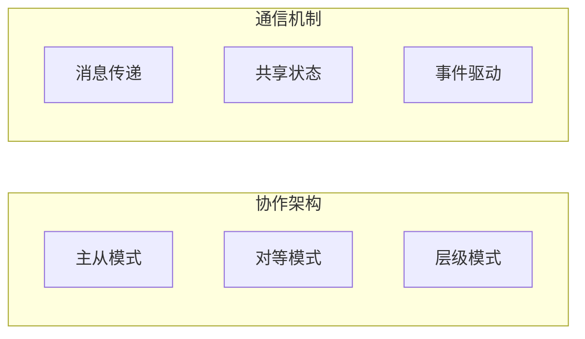

# 第4章 · 多 Agent 协作 — 构建复杂的 Agent 系统

> **时长**：约 4 小时 ｜ **难度**：⭐⭐⭐⭐ ｜ **类型**：高级实践
>
> **目标**：掌握多 Agent 系统的设计与实现

---

## 学习目标

学完本章后，你将能够：
- 设计多 Agent 协作架构
- 实现 Agent 间的通信机制
- 使用 LangGraph 构建 Agent 工作流
- 处理复杂的多 Agent 场景

---

## 知识地图



---

## 1、多 Agent 架构模式

### 1.1 常见架构

**概念定义**：多 Agent 系统是由多个具有不同职责的 Agent 组成的协作体系，通过分工与合作完成单一 Agent 难以处理的复杂任务。常见的架构包括主从模式（一个协调者管理多个执行者）、对等模式（Agent 间平等协作）和专家组模式（各领域专家各司其职）。

**核心定位**：多 Agent 架构的核心价值在于**分而治之**——将复杂问题分解为多个专业子任务，每个 Agent 专注于自己擅长的领域，通过协作产生 1+1>2 的效果。这种设计也天然支持了职责分离、可扩展性和容错性。

| 模式 | 说明 | 适用场景 |
|------|------|---------|
| 主从模式 | 一个主 Agent 协调多个子 Agent | 任务分解 |
| 对等模式 | Agent 间平等协作 | 讨论/辩论 |
| 层级模式 | 多层级的 Agent 结构 | 复杂系统 |
| 专家组模式 | 不同专长的 Agent 协作 | 多领域问题 |

### 1.2 主从模式

```
┌─────────────────────────────────────────────────────────┐
│                    Supervisor Agent                      │
│              (协调者 - 分配任务、汇总结果)                │
├─────────────────────────────────────────────────────────┤
│     ┌─────────┐  ┌─────────┐  ┌─────────┐              │
│     │Research │  │ Writer  │  │ Critic  │              │
│     │ Agent   │  │ Agent   │  │ Agent   │              │
│     └─────────┘  └─────────┘  └─────────┘              │
└─────────────────────────────────────────────────────────┘
```

---

## 2、专家团队实现

### 2.1 基础实现

```python
"""
01_multi_agent.py
多 Agent 协作
"""
import os
from langchain_openai import ChatOpenAI
from langchain_core.prompts import ChatPromptTemplate
from typing import List, Dict


class Expert:
    """专家 Agent 基类"""

    def __init__(self, name: str, expertise: str):
        self.name = name
        self.expertise = expertise
        self.llm = ChatOpenAI(model="gpt-4o-mini", temperature=0.7)

    def respond(self, question: str, context: str = "") -> str:
        """回应问题"""
        prompt = ChatPromptTemplate.from_template("""
你是一位 {expertise} 专家，名叫 {name}。

{context}

问题: {question}

请从你的专业角度回答:
""")
        chain = prompt | self.llm
        response = chain.invoke({
            "name": self.name,
            "expertise": self.expertise,
            "context": context,
            "question": question
        })
        return response.content


class Supervisor:
    """协调者 Agent"""

    def __init__(self, experts: List[Expert]):
        self.experts = experts
        self.llm = ChatOpenAI(model="gpt-4o-mini", temperature=0)

    def route(self, question: str) -> List[str]:
        """决定咨询哪些专家"""
        expert_list = ", ".join([f"{e.name}({e.expertise})" for e in self.experts])

        prompt = ChatPromptTemplate.from_template("""
你是一个任务协调者。根据问题决定需要咨询哪些专家。

可用专家: {experts}

问题: {question}

请列出需要咨询的专家名字（用逗号分隔）:
""")
        chain = prompt | self.llm
        response = chain.invoke({"experts": expert_list, "question": question})

        # 解析专家名字
        names = [n.strip() for n in response.content.split(",")]
        return [n for n in names if any(e.name == n for e in self.experts)]

    def synthesize(self, question: str, responses: Dict[str, str]) -> str:
        """综合各专家意见"""
        responses_text = "\n\n".join([
            f"【{name}】:\n{response}"
            for name, response in responses.items()
        ])

        prompt = ChatPromptTemplate.from_template("""
你是一个综合分析专家。请综合以下各位专家的意见，给出最终答案。

问题: {question}

各专家意见:
{responses}

综合分析和最终答案:
""")
        chain = prompt | self.llm
        return chain.invoke({
            "question": question,
            "responses": responses_text
        }).content


class ExpertTeam:
    """专家团队"""

    def __init__(self):
        self.experts = [
            Expert("技术专家", "软件开发和系统架构"),
            Expert("产品专家", "产品设计和用户体验"),
            Expert("商业专家", "商业模式和市场策略"),
        ]
        self.supervisor = Supervisor(self.experts)

    def consult(self, question: str) -> str:
        """咨询专家团队"""
        print(f"\n问题: {question}")
        print("=" * 60)

        # 1. 路由到合适的专家
        selected_names = self.supervisor.route(question)
        print(f"咨询专家: {', '.join(selected_names)}")

        # 2. 收集各专家意见
        responses = {}
        for expert in self.experts:
            if expert.name in selected_names:
                print(f"\n【{expert.name}】正在分析...")
                response = expert.respond(question)
                responses[expert.name] = response
                print(f"  {response[:100]}...")

        # 3. 综合意见
        print("\n【综合分析】")
        final = self.supervisor.synthesize(question, responses)

        return final


def multi_agent_demo():
    """多 Agent 演示"""
    print("=" * 60)
    print("【专家团队协作】")
    print("=" * 60)

    team = ExpertTeam()

    questions = [
        "我想开发一个 AI 写作助手产品，应该如何规划？",
    ]

    for q in questions:
        result = team.consult(q)
        print(f"\n最终答案:\n{result}")


if __name__ == "__main__":
    if not os.getenv("OPENAI_API_KEY"):
        print("请设置 OPENAI_API_KEY")
        exit()

    multi_agent_demo()
```

---

## 3、对话式协作

### 3.1 辩论模式

**概念定义**：辩论模式是一种让多个 Agent 围绕同一议题从不同立场进行讨论的协作方式。每个 Agent 扮演特定角色（如正方、反方），通过多轮交锋和反驳推动思考深入，最后由评判者综合各方观点给出结论。

**核心定位**：辩论模式的价值在于**多视角碰撞**——单一 Agent 有固定的立场和知识偏向，而辩论通过引入对立观点和批判性质疑，可以暴露论证的薄弱环节，产生更全面、更客观的结论，特别适合需要权衡利弊的决策场景。

```python
"""
02_debate_agents.py
Agent 辩论
"""
import os
from langchain_openai import ChatOpenAI
from langchain_core.prompts import ChatPromptTemplate


class DebateAgent:
    """辩论 Agent"""

    def __init__(self, name: str, stance: str):
        self.name = name
        self.stance = stance
        self.llm = ChatOpenAI(model="gpt-4o-mini", temperature=0.7)

    def argue(self, topic: str, opponent_argument: str = "") -> str:
        """提出论点"""
        context = f"\n对方论点: {opponent_argument}" if opponent_argument else ""

        prompt = ChatPromptTemplate.from_template("""
你是 {name}，持 {stance} 立场。

辩题: {topic}
{context}

请提出你的论点（2-3 句话）:
""")
        chain = prompt | self.llm
        return chain.invoke({
            "name": self.name,
            "stance": self.stance,
            "topic": topic,
            "context": context
        }).content


class DebateModerator:
    """辩论主持人"""

    def __init__(self):
        self.llm = ChatOpenAI(model="gpt-4o-mini", temperature=0)

    def summarize(self, topic: str, arguments: list) -> str:
        """总结辩论"""
        args_text = "\n\n".join([
            f"【{arg['name']}】({arg['stance']}): {arg['content']}"
            for arg in arguments
        ])

        prompt = ChatPromptTemplate.from_template("""
辩题: {topic}

辩论过程:
{arguments}

请总结双方观点，并给出客观评价:
""")
        chain = prompt | self.llm
        return chain.invoke({"topic": topic, "arguments": args_text}).content


def debate_demo():
    """辩论演示"""
    print("=" * 60)
    print("【Agent 辩论】")
    print("=" * 60)

    topic = "人工智能会取代大部分人类工作吗？"
    print(f"\n辩题: {topic}\n")

    # 创建辩手
    pro = DebateAgent("正方", "支持")
    con = DebateAgent("反方", "反对")
    moderator = DebateModerator()

    arguments = []
    rounds = 2

    for i in range(rounds):
        print(f"\n【第 {i+1} 轮】")
        print("-" * 40)

        # 正方发言
        last_con = arguments[-1]["content"] if arguments and arguments[-1]["stance"] == "反对" else ""
        pro_arg = pro.argue(topic, last_con)
        print(f"正方: {pro_arg}")
        arguments.append({"name": "正方", "stance": "支持", "content": pro_arg})

        # 反方发言
        con_arg = con.argue(topic, pro_arg)
        print(f"反方: {con_arg}")
        arguments.append({"name": "反方", "stance": "反对", "content": con_arg})

    # 总结
    print("\n【主持人总结】")
    print("-" * 40)
    summary = moderator.summarize(topic, arguments)
    print(summary)


if __name__ == "__main__":
    if os.getenv("OPENAI_API_KEY"):
        debate_demo()
    else:
        print("请设置 OPENAI_API_KEY")
```

---

## 4、LangGraph 工作流

### 4.1 状态图实现

**概念定义**：LangGraph 是一个基于图结构的工作流框架，允许开发者用有向图的方式定义 Agent 的执行流程。每个节点是一个处理函数，边代表执行流向，状态在节点间传递和更新。

**核心定位**：相比于传统的线性 Chain 或简单的 ReAct 循环，LangGraph 提供了**灵活的控制流**——支持条件分支、循环、并行执行等复杂模式，让多 Agent 工作流的设计更加自然和可控。它是构建生产级多 Agent 系统的核心基础设施。

```python
"""
03_langgraph_workflow.py
LangGraph 工作流
"""
import os
from typing import TypedDict, Annotated, Sequence
from langchain_openai import ChatOpenAI
from langchain_core.messages import HumanMessage, AIMessage, BaseMessage
from langgraph.graph import StateGraph, END


# 定义状态
class AgentState(TypedDict):
    messages: Annotated[Sequence[BaseMessage], lambda x, y: x + y]
    current_agent: str
    task_complete: bool


# 创建 Agent 节点
def create_researcher(state: AgentState) -> dict:
    """研究员节点"""
    llm = ChatOpenAI(model="gpt-4o-mini", temperature=0)

    messages = state["messages"]
    last_message = messages[-1].content if messages else ""

    response = llm.invoke([
        HumanMessage(content=f"""你是一个研究员。
任务: {last_message}
请搜索和整理相关信息。""")
    ])

    return {
        "messages": [AIMessage(content=f"[研究员] {response.content}")],
        "current_agent": "writer"
    }


def create_writer(state: AgentState) -> dict:
    """写作者节点"""
    llm = ChatOpenAI(model="gpt-4o-mini", temperature=0)

    # 获取研究员的输出
    research = state["messages"][-1].content if state["messages"] else ""

    response = llm.invoke([
        HumanMessage(content=f"""你是一个写作者。
基于以下研究内容，撰写简洁的报告:
{research}""")
    ])

    return {
        "messages": [AIMessage(content=f"[写作者] {response.content}")],
        "current_agent": "reviewer"
    }


def create_reviewer(state: AgentState) -> dict:
    """审核者节点"""
    llm = ChatOpenAI(model="gpt-4o-mini", temperature=0)

    # 获取写作者的输出
    draft = state["messages"][-1].content if state["messages"] else ""

    response = llm.invoke([
        HumanMessage(content=f"""你是一个审核者。
请审核以下内容，给出最终版本:
{draft}""")
    ])

    return {
        "messages": [AIMessage(content=f"[审核者] {response.content}")],
        "task_complete": True
    }


def should_continue(state: AgentState) -> str:
    """决定下一步"""
    if state.get("task_complete"):
        return END

    next_agent = state.get("current_agent", "researcher")
    return next_agent


def langgraph_demo():
    """LangGraph 演示"""
    print("=" * 60)
    print("【LangGraph 多 Agent 工作流】")
    print("=" * 60)

    # 创建图
    workflow = StateGraph(AgentState)

    # 添加节点
    workflow.add_node("researcher", create_researcher)
    workflow.add_node("writer", create_writer)
    workflow.add_node("reviewer", create_reviewer)

    # 设置入口
    workflow.set_entry_point("researcher")

    # 添加边
    workflow.add_edge("researcher", "writer")
    workflow.add_edge("writer", "reviewer")
    workflow.add_edge("reviewer", END)

    # 编译
    app = workflow.compile()

    # 运行
    task = "研究 LangGraph 的核心特性"
    print(f"\n任务: {task}\n")

    initial_state = {
        "messages": [HumanMessage(content=task)],
        "current_agent": "researcher",
        "task_complete": False
    }

    for output in app.stream(initial_state):
        for key, value in output.items():
            print(f"\n【{key}】")
            if "messages" in value:
                for msg in value["messages"]:
                    print(msg.content[:200] + "...")


if __name__ == "__main__":
    if os.getenv("OPENAI_API_KEY"):
        langgraph_demo()
    else:
        print("请设置 OPENAI_API_KEY")
```

---

## 5、设计最佳实践

| 原则 | 说明 |
|------|------|
| 职责单一 | 每个 Agent 专注一个领域 |
| 松耦合 | Agent 间通过消息通信 |
| 可观测 | 记录 Agent 的决策过程 |
| 容错设计 | 处理 Agent 失败情况 |

---

## 常见踩坑

1. **Agent 间通信冲突**：多个 Agent 同时写入共享状态或调用同一资源时可能产生冲突。建议使用 Supervisor Agent 统一调度，或通过消息队列解耦 Agent 间的直接依赖。
2. **协调者成为性能瓶颈**：单一 Supervisor Agent 承担所有路由和汇总工作，在 Agent 数量增加时会成为吞吐量的瓶颈。对于大规模场景，考虑使用分层架构或消息总线来分担负载。
3. **Agent 职责划分不清**：多个 Agent 的职责范围存在重叠时，会产生重复劳动或相互矛盾的输出。每个 Agent 应有明确且互斥的职责边界，职责描述要精确到具体的能力范围。
4. **多 Agent 系统调试困难**：执行链路复杂，出现问题时难以定位是哪个 Agent、哪个步骤出了错。应为每个 Agent 添加独立的日志记录和请求追踪 ID，便于链路追溯。
5. **资源消耗快速增长**：每个 Agent 都需要独立调用 LLM，Agent 数量增多时 Token 消耗和成本呈线性增长。应合理评估每个 Agent 的必要性，对非关键 Agent 使用更便宜的模型。

## 课后练习

1. 实现一个"写作团队"多 Agent 系统：包含研究 Agent（搜集素材）、写作 Agent（撰写初稿）和校对 Agent（修改润色），完成一篇 500 字的技术短文
2. 基于 LangGraph 构建一个简单的审批工作流：创建 → 审核 → 修改(循环) → 发布，包含条件判断节点
3. 设计一个三方辩论场景：正方、反方、中立观察员各持不同观点进行讨论，并由评判 Agent 总结各方优劣
4. 在专家团队模式中加入投票机制：让所有专家对最终答案进行评分投票，得票最高的方案作为最终输出

## 本节小结

- ✅ 掌握了多 Agent 架构模式
- ✅ 实现了专家团队协作
- ✅ 学会了 Agent 辩论模式
- ✅ 了解了 LangGraph 工作流

---

## 模块总结

恭喜完成 **模块9：Agent 开发**！

你已经掌握了：
- ✅ Agent 的核心概念和工作原理
- ✅ 工具开发和集成方法
- ✅ ReAct 等推理模式
- ✅ 多 Agent 协作系统

---

> **下一模块**：模块10 · LangGraph 深入 — 构建复杂的 AI 工作流
