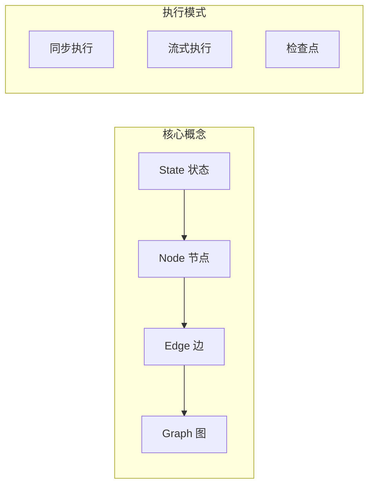

# 第1章 · LangGraph 核心概念 — 理解状态图编程

> **时长**：约 3 小时 ｜ **难度**：⭐⭐⭐ ｜ **类型**：理论 + 实践
>
> **目标**：理解 LangGraph 的核心概念和编程模型

---

## 学习目标

学完本章后，你将能够：
- 理解 LangGraph 与 LangChain 的关系
- 掌握状态图的核心概念
- 实现基础的 LangGraph 工作流
- 理解节点、边、状态的设计

---

## 知识地图



---

## 1、什么是 LangGraph

### 1.1 LangGraph 定义

**LangGraph** 是 LangChain 团队开发的用于构建有状态、多步骤 AI 应用的框架：

| 特性 | 说明 |
|------|------|
| 状态管理 | 自动管理应用状态 |
| 循环支持 | 支持循环和条件分支 |
| 检查点 | 支持暂停、恢复、时间旅行 |
| 流式输出 | 支持实时流式响应 |

### 1.2 LangGraph vs LCEL

| 特性 | LCEL | LangGraph |
|------|------|-----------|
| 执行模式 | 线性/DAG | 循环图 |
| 状态管理 | 隐式 | 显式 |
| 循环支持 | 不支持 | 支持 |
| 复杂度 | 简单 | 中等 |
| 适用场景 | 简单链 | Agent/工作流 |

### 1.3 核心组件

```
┌─────────────────────────────────────────────────────────┐
│                     LangGraph                           │
├─────────────────────────────────────────────────────────┤
│  State（状态）                                          │
│    ↓                                                    │
│  Node（节点）→ Node → Node                             │
│    ↓                                                    │
│  Edge（边）- 连接节点，可带条件                         │
│    ↓                                                    │
│  Graph（图）- 编排整个工作流                            │
└─────────────────────────────────────────────────────────┘
```

---

## 2、状态（State）

### 2.1 定义状态

```python
"""
01_state_definition.py
状态定义
"""
from typing import TypedDict, Annotated, Sequence
from langchain_core.messages import BaseMessage
from langgraph.graph.message import add_messages


# 简单状态
class SimpleState(TypedDict):
    """简单状态"""
    input: str
    output: str


# 带消息的状态
class ChatState(TypedDict):
    """对话状态"""
    messages: Annotated[Sequence[BaseMessage], add_messages]


# 复杂状态
class WorkflowState(TypedDict):
    """工作流状态"""
    task: str
    plan: list[str]
    current_step: int
    results: dict
    is_complete: bool


# 状态演示
if __name__ == "__main__":
    # 创建状态实例
    state = SimpleState(input="Hello", output="")
    print(f"简单状态: {state}")

    workflow_state = WorkflowState(
        task="写一篇文章",
        plan=["研究", "大纲", "写作", "审核"],
        current_step=0,
        results={},
        is_complete=False
    )
    print(f"工作流状态: {workflow_state}")
```

### 2.2 状态更新

```python
"""
02_state_update.py
状态更新机制
"""
from typing import TypedDict, Annotated
import operator


# 使用 reducer 函数的状态
class CounterState(TypedDict):
    """计数器状态"""
    count: Annotated[int, operator.add]  # 累加
    history: Annotated[list, operator.add]  # 追加


def demo_state_update():
    """状态更新演示"""
    # 初始状态
    state = CounterState(count=0, history=[])

    # 模拟更新
    update1 = {"count": 1, "history": ["step1"]}
    update2 = {"count": 2, "history": ["step2"]}

    # reducer 会自动累加/追加
    # count: 0 + 1 + 2 = 3
    # history: [] + ["step1"] + ["step2"] = ["step1", "step2"]

    print("状态更新使用 reducer 函数自动合并")


if __name__ == "__main__":
    demo_state_update()
```

---

## 3、节点（Node）

### 3.1 定义节点

```python
"""
03_nodes.py
节点定义
"""
from typing import TypedDict
from langchain_openai import ChatOpenAI
from langchain_core.messages import HumanMessage


class State(TypedDict):
    input: str
    processed: str
    output: str


# 简单函数节点
def process_input(state: State) -> dict:
    """处理输入的节点"""
    processed = state["input"].upper()
    return {"processed": processed}


def generate_output(state: State) -> dict:
    """生成输出的节点"""
    output = f"处理结果: {state['processed']}"
    return {"output": output}


# LLM 节点
def llm_node(state: State) -> dict:
    """LLM 调用节点"""
    llm = ChatOpenAI(model="gpt-4o-mini")
    response = llm.invoke([HumanMessage(content=state["input"])])
    return {"output": response.content}


if __name__ == "__main__":
    # 测试节点
    state = State(input="hello world", processed="", output="")

    result1 = process_input(state)
    print(f"process_input: {result1}")

    state.update(result1)
    result2 = generate_output(state)
    print(f"generate_output: {result2}")
```

---

## 4、边（Edge）

### 4.1 基础边

```python
"""
04_edges.py
边的定义
"""
from typing import Literal


# 条件边函数
def should_continue(state: dict) -> Literal["continue", "end"]:
    """决定是否继续"""
    if state.get("is_complete"):
        return "end"
    return "continue"


def route_by_type(state: dict) -> Literal["type_a", "type_b", "type_c"]:
    """根据类型路由"""
    task_type = state.get("task_type", "")

    if task_type == "research":
        return "type_a"
    elif task_type == "writing":
        return "type_b"
    else:
        return "type_c"
```

---

## 5、构建完整图

### ▶ 执行代码

```bash
cd code/01-状态图基础
python 01_basic_graph.py
```

```python
"""
01_basic_graph.py
基础 LangGraph 示例
"""
import os
from typing import TypedDict
from langgraph.graph import StateGraph, END


# 定义状态
class State(TypedDict):
    input: str
    step1_result: str
    step2_result: str
    final_output: str


# 定义节点
def step1(state: State) -> dict:
    """步骤1：处理输入"""
    result = f"[Step1] 处理: {state['input']}"
    print(result)
    return {"step1_result": result}


def step2(state: State) -> dict:
    """步骤2：进一步处理"""
    result = f"[Step2] 基于 Step1: {state['step1_result']}"
    print(result)
    return {"step2_result": result}


def final_step(state: State) -> dict:
    """最终步骤：汇总"""
    result = f"[Final] 完成！结果: {state['step2_result']}"
    print(result)
    return {"final_output": result}


def basic_graph_demo():
    """基础图演示"""
    print("=" * 60)
    print("【基础 LangGraph 示例】")
    print("=" * 60)

    # 创建图
    workflow = StateGraph(State)

    # 添加节点
    workflow.add_node("step1", step1)
    workflow.add_node("step2", step2)
    workflow.add_node("final", final_step)

    # 设置入口
    workflow.set_entry_point("step1")

    # 添加边
    workflow.add_edge("step1", "step2")
    workflow.add_edge("step2", "final")
    workflow.add_edge("final", END)

    # 编译
    app = workflow.compile()

    # 运行
    print("\n开始执行:")
    print("-" * 40)

    initial_state = {
        "input": "Hello LangGraph",
        "step1_result": "",
        "step2_result": "",
        "final_output": ""
    }

    result = app.invoke(initial_state)

    print("\n最终状态:")
    print(f"  final_output: {result['final_output']}")


if __name__ == "__main__":
    basic_graph_demo()
```

---

## 6、流式执行

```python
"""
02_streaming.py
流式执行
"""
from typing import TypedDict
from langgraph.graph import StateGraph, END


class State(TypedDict):
    value: int
    history: list


def increment(state: State) -> dict:
    new_value = state["value"] + 1
    return {
        "value": new_value,
        "history": state["history"] + [new_value]
    }


def streaming_demo():
    """流式执行演示"""
    print("=" * 60)
    print("【流式执行】")
    print("=" * 60)

    workflow = StateGraph(State)

    workflow.add_node("increment", increment)
    workflow.set_entry_point("increment")
    workflow.add_edge("increment", END)

    app = workflow.compile()

    # 流式执行
    print("\n流式输出:")
    for output in app.stream({"value": 0, "history": []}):
        for key, value in output.items():
            print(f"  节点 '{key}': {value}")


if __name__ == "__main__":
    streaming_demo()
```

---

## 本节小结

- ✅ 理解了 LangGraph 的定位和优势
- ✅ 掌握了 State、Node、Edge 的概念
- ✅ 实现了基础的状态图工作流
- ✅ 学会了流式执行

---

> **下一章**：第2章 · 条件分支与路由 — 实现智能决策流程
