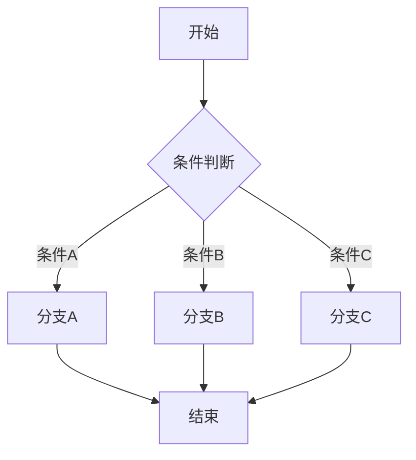

# 第2章 · 条件分支与路由 — 实现智能决策流程

> **时长**：约 3 小时 ｜ **难度**：⭐⭐⭐ ｜ **类型**：实践
>
> **目标**：掌握条件边和路由的实现方法

---

## 学习目标

学完本章后，你将能够：
- 使用条件边实现分支逻辑
- 实现多路由决策
- 构建动态工作流
- 处理复杂的分支场景

---

## 知识地图



---

## 1、条件边基础

### 1.1 add_conditional_edges

```python
"""
01_conditional_edge.py
条件边基础
"""
from typing import TypedDict, Literal
from langgraph.graph import StateGraph, END


class State(TypedDict):
    input: str
    category: str
    output: str


def classify(state: State) -> dict:
    """分类节点"""
    text = state["input"].lower()

    if "天气" in text or "weather" in text:
        category = "weather"
    elif "计算" in text or "math" in text:
        category = "math"
    else:
        category = "general"

    return {"category": category}


def handle_weather(state: State) -> dict:
    """处理天气查询"""
    return {"output": f"天气查询结果: {state['input']}"}


def handle_math(state: State) -> dict:
    """处理数学问题"""
    return {"output": f"数学计算结果: {state['input']}"}


def handle_general(state: State) -> dict:
    """处理一般问题"""
    return {"output": f"一般回复: {state['input']}"}


# 路由函数
def route_by_category(state: State) -> Literal["weather", "math", "general"]:
    """根据分类路由"""
    return state["category"]


def conditional_demo():
    """条件边演示"""
    print("=" * 60)
    print("【条件边演示】")
    print("=" * 60)

    workflow = StateGraph(State)

    # 添加节点
    workflow.add_node("classify", classify)
    workflow.add_node("weather", handle_weather)
    workflow.add_node("math", handle_math)
    workflow.add_node("general", handle_general)

    # 设置入口
    workflow.set_entry_point("classify")

    # 添加条件边
    workflow.add_conditional_edges(
        "classify",
        route_by_category,
        {
            "weather": "weather",
            "math": "math",
            "general": "general"
        }
    )

    # 所有处理节点都指向结束
    workflow.add_edge("weather", END)
    workflow.add_edge("math", END)
    workflow.add_edge("general", END)

    # 编译
    app = workflow.compile()

    # 测试不同输入
    test_inputs = [
        "今天天气怎么样",
        "计算 1+1 等于多少",
        "你好，请介绍一下自己",
    ]

    for input_text in test_inputs:
        print(f"\n输入: {input_text}")
        result = app.invoke({
            "input": input_text,
            "category": "",
            "output": ""
        })
        print(f"分类: {result['category']}")
        print(f"输出: {result['output']}")


if __name__ == "__main__":
    conditional_demo()
```

---

## 2、LLM 驱动的路由

### 2.1 使用 LLM 决策

```python
"""
02_llm_router.py
LLM 驱动的路由
"""
import os
from typing import TypedDict, Literal
from langchain_openai import ChatOpenAI
from langchain_core.prompts import ChatPromptTemplate
from langgraph.graph import StateGraph, END


class State(TypedDict):
    question: str
    route: str
    answer: str


def llm_classifier(state: State) -> dict:
    """使用 LLM 分类"""
    llm = ChatOpenAI(model="gpt-4o-mini", temperature=0)

    prompt = ChatPromptTemplate.from_template("""
将以下问题分类为以下类别之一：
- technical: 技术相关问题
- business: 商业相关问题
- casual: 闲聊/其他

问题: {question}

只返回类别名称（technical/business/casual），不要其他内容。
""")

    chain = prompt | llm
    response = chain.invoke({"question": state["question"]})
    route = response.content.strip().lower()

    # 确保返回有效的路由
    if route not in ["technical", "business", "casual"]:
        route = "casual"

    return {"route": route}


def technical_expert(state: State) -> dict:
    """技术专家"""
    llm = ChatOpenAI(model="gpt-4o-mini")
    response = llm.invoke(f"作为技术专家回答: {state['question']}")
    return {"answer": f"[技术专家] {response.content}"}


def business_expert(state: State) -> dict:
    """商业专家"""
    llm = ChatOpenAI(model="gpt-4o-mini")
    response = llm.invoke(f"作为商业顾问回答: {state['question']}")
    return {"answer": f"[商业专家] {response.content}"}


def casual_responder(state: State) -> dict:
    """闲聊回复"""
    llm = ChatOpenAI(model="gpt-4o-mini")
    response = llm.invoke(f"友好地回复: {state['question']}")
    return {"answer": f"[闲聊] {response.content}"}


def get_route(state: State) -> Literal["technical", "business", "casual"]:
    """获取路由"""
    return state["route"]


def llm_router_demo():
    """LLM 路由演示"""
    print("=" * 60)
    print("【LLM 驱动的路由】")
    print("=" * 60)

    workflow = StateGraph(State)

    # 添加节点
    workflow.add_node("classifier", llm_classifier)
    workflow.add_node("technical", technical_expert)
    workflow.add_node("business", business_expert)
    workflow.add_node("casual", casual_responder)

    # 设置流程
    workflow.set_entry_point("classifier")

    workflow.add_conditional_edges(
        "classifier",
        get_route,
        {
            "technical": "technical",
            "business": "business",
            "casual": "casual"
        }
    )

    workflow.add_edge("technical", END)
    workflow.add_edge("business", END)
    workflow.add_edge("casual", END)

    app = workflow.compile()

    # 测试
    questions = [
        "Python 中如何实现多线程？",
        "如何提高产品的市场占有率？",
        "你今天过得怎么样？",
    ]

    for q in questions:
        print(f"\n问题: {q}")
        print("-" * 40)
        result = app.invoke({
            "question": q,
            "route": "",
            "answer": ""
        })
        print(f"路由: {result['route']}")
        print(f"回答: {result['answer'][:100]}...")


if __name__ == "__main__":
    if not os.getenv("OPENAI_API_KEY"):
        print("请设置 OPENAI_API_KEY")
        exit()

    llm_router_demo()
```

---

## 3、多级路由

### 3.1 嵌套路由

```python
"""
03_nested_routing.py
多级路由
"""
from typing import TypedDict, Literal
from langgraph.graph import StateGraph, END


class State(TypedDict):
    input: str
    level1: str
    level2: str
    output: str


def level1_router(state: State) -> dict:
    """一级路由"""
    text = state["input"]
    if "紧急" in text or "urgent" in text.lower():
        return {"level1": "urgent"}
    else:
        return {"level1": "normal"}


def level2_urgent_router(state: State) -> dict:
    """紧急任务二级路由"""
    text = state["input"]
    if "技术" in text:
        return {"level2": "tech_urgent"}
    else:
        return {"level2": "general_urgent"}


def level2_normal_router(state: State) -> dict:
    """普通任务二级路由"""
    text = state["input"]
    if "咨询" in text:
        return {"level2": "consultation"}
    else:
        return {"level2": "info"}


def handle_tech_urgent(state: State) -> dict:
    return {"output": "[紧急-技术] 已派遣技术团队处理"}


def handle_general_urgent(state: State) -> dict:
    return {"output": "[紧急-一般] 已安排专人跟进"}


def handle_consultation(state: State) -> dict:
    return {"output": "[普通-咨询] 已安排咨询服务"}


def handle_info(state: State) -> dict:
    return {"output": "[普通-信息] 已提供相关信息"}


def get_level1(state: State) -> Literal["urgent", "normal"]:
    return state["level1"]


def get_level2_urgent(state: State) -> Literal["tech_urgent", "general_urgent"]:
    return state["level2"]


def get_level2_normal(state: State) -> Literal["consultation", "info"]:
    return state["level2"]


def nested_routing_demo():
    """多级路由演示"""
    print("=" * 60)
    print("【多级路由】")
    print("=" * 60)

    workflow = StateGraph(State)

    # 添加节点
    workflow.add_node("level1", level1_router)
    workflow.add_node("level2_urgent", level2_urgent_router)
    workflow.add_node("level2_normal", level2_normal_router)
    workflow.add_node("tech_urgent", handle_tech_urgent)
    workflow.add_node("general_urgent", handle_general_urgent)
    workflow.add_node("consultation", handle_consultation)
    workflow.add_node("info", handle_info)

    # 流程
    workflow.set_entry_point("level1")

    # 一级路由
    workflow.add_conditional_edges(
        "level1",
        get_level1,
        {"urgent": "level2_urgent", "normal": "level2_normal"}
    )

    # 二级路由（紧急）
    workflow.add_conditional_edges(
        "level2_urgent",
        get_level2_urgent,
        {"tech_urgent": "tech_urgent", "general_urgent": "general_urgent"}
    )

    # 二级路由（普通）
    workflow.add_conditional_edges(
        "level2_normal",
        get_level2_normal,
        {"consultation": "consultation", "info": "info"}
    )

    # 结束
    for node in ["tech_urgent", "general_urgent", "consultation", "info"]:
        workflow.add_edge(node, END)

    app = workflow.compile()

    # 测试
    test_cases = [
        "紧急！技术系统出问题了",
        "紧急！需要帮助",
        "我想咨询一下产品信息",
        "请问你们的营业时间",
    ]

    for text in test_cases:
        print(f"\n输入: {text}")
        result = app.invoke({
            "input": text,
            "level1": "",
            "level2": "",
            "output": ""
        })
        print(f"路由: {result['level1']} -> {result['level2']}")
        print(f"输出: {result['output']}")


if __name__ == "__main__":
    nested_routing_demo()
```

---

## 4、并行分支

```python
"""
04_parallel_branches.py
并行分支处理
"""
from typing import TypedDict, Annotated
import operator
from langgraph.graph import StateGraph, END


class State(TypedDict):
    input: str
    analysis_results: Annotated[list, operator.add]
    final_output: str


def sentiment_analysis(state: State) -> dict:
    """情感分析"""
    # 模拟分析
    return {"analysis_results": [{"type": "sentiment", "result": "positive"}]}


def keyword_extraction(state: State) -> dict:
    """关键词提取"""
    return {"analysis_results": [{"type": "keywords", "result": ["AI", "LangGraph"]}]}


def topic_classification(state: State) -> dict:
    """主题分类"""
    return {"analysis_results": [{"type": "topic", "result": "technology"}]}


def aggregate_results(state: State) -> dict:
    """汇总结果"""
    results = state["analysis_results"]
    summary = "; ".join([f"{r['type']}: {r['result']}" for r in results])
    return {"final_output": f"分析完成: {summary}"}


def parallel_demo():
    """并行分支演示"""
    print("=" * 60)
    print("【并行分支处理】")
    print("=" * 60)

    workflow = StateGraph(State)

    # 添加节点
    workflow.add_node("sentiment", sentiment_analysis)
    workflow.add_node("keywords", keyword_extraction)
    workflow.add_node("topic", topic_classification)
    workflow.add_node("aggregate", aggregate_results)

    # 并行分支：从入口同时到三个分析节点
    workflow.set_entry_point("sentiment")

    # 注意：LangGraph 原生不支持真正并行，这里是顺序执行
    # 真正并行需要使用异步或其他方式
    workflow.add_edge("sentiment", "keywords")
    workflow.add_edge("keywords", "topic")
    workflow.add_edge("topic", "aggregate")
    workflow.add_edge("aggregate", END)

    app = workflow.compile()

    result = app.invoke({
        "input": "LangGraph 是一个很棒的 AI 框架",
        "analysis_results": [],
        "final_output": ""
    })

    print(f"输入: {result['input']}")
    print(f"分析结果: {result['analysis_results']}")
    print(f"最终输出: {result['final_output']}")


if __name__ == "__main__":
    parallel_demo()
```

---

## 本节小结

- ✅ 掌握了条件边的使用方法
- ✅ 实现了 LLM 驱动的路由
- ✅ 学会了多级嵌套路由
- ✅ 了解了并行分支处理

---

> **下一章**：第3章 · 循环与持久化 — 构建有记忆的工作流
