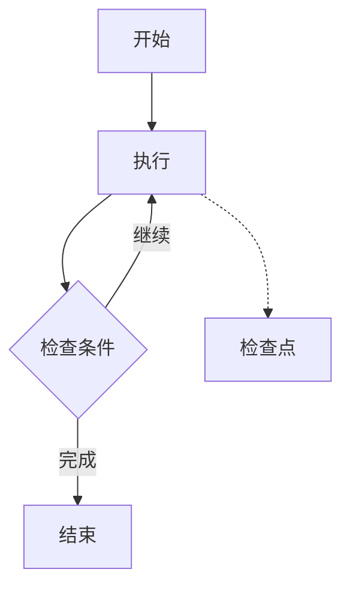

# 第3章 · 循环与持久化 — 构建有记忆的工作流

> **时长**：约 3 小时 ｜ **难度**：⭐⭐⭐⭐ ｜ **类型**：实践
>
> **目标**：掌握循环执行和状态持久化

---

## 学习目标

学完本章后，你将能够：
- 实现循环执行的工作流
- 使用检查点持久化状态
- 实现工作流的暂停和恢复
- 构建迭代优化的 Agent

---

## 知识地图



---

## 1、循环执行

### 1.1 基础循环

```python
"""
01_loop.py
循环执行
"""
from typing import TypedDict, Literal
from langgraph.graph import StateGraph, END


class State(TypedDict):
    count: int
    max_count: int
    history: list


def increment(state: State) -> dict:
    """增加计数"""
    new_count = state["count"] + 1
    history = state["history"] + [f"count={new_count}"]
    print(f"  执行: count = {new_count}")
    return {"count": new_count, "history": history}


def should_continue(state: State) -> Literal["continue", "end"]:
    """检查是否继续循环"""
    if state["count"] < state["max_count"]:
        return "continue"
    return "end"


def loop_demo():
    """循环演示"""
    print("=" * 60)
    print("【循环执行】")
    print("=" * 60)

    workflow = StateGraph(State)

    workflow.add_node("increment", increment)
    workflow.set_entry_point("increment")

    # 条件边：决定是继续循环还是结束
    workflow.add_conditional_edges(
        "increment",
        should_continue,
        {
            "continue": "increment",  # 回到自己，形成循环
            "end": END
        }
    )

    app = workflow.compile()

    print("\n执行循环 (max=5):")
    result = app.invoke({
        "count": 0,
        "max_count": 5,
        "history": []
    })

    print(f"\n最终状态:")
    print(f"  count: {result['count']}")
    print(f"  history: {result['history']}")


if __name__ == "__main__":
    loop_demo()
```

---

## 2、迭代优化 Agent

### 2.1 自我改进循环

```python
"""
02_iterative_agent.py
迭代优化 Agent
"""
import os
from typing import TypedDict, Literal
from langchain_openai import ChatOpenAI
from langchain_core.prompts import ChatPromptTemplate
from langgraph.graph import StateGraph, END


class State(TypedDict):
    task: str
    current_draft: str
    feedback: str
    iteration: int
    max_iterations: int
    is_approved: bool


def generate_draft(state: State) -> dict:
    """生成/改进草稿"""
    llm = ChatOpenAI(model="gpt-4o-mini", temperature=0.7)

    if state["current_draft"]:
        # 基于反馈改进
        prompt = ChatPromptTemplate.from_template("""
任务: {task}

当前草稿:
{draft}

反馈:
{feedback}

请根据反馈改进草稿。只输出改进后的内容。
""")
        chain = prompt | llm
        response = chain.invoke({
            "task": state["task"],
            "draft": state["current_draft"],
            "feedback": state["feedback"]
        })
    else:
        # 首次生成
        prompt = ChatPromptTemplate.from_template("""
任务: {task}

请完成这个任务。只输出结果内容。
""")
        chain = prompt | llm
        response = chain.invoke({"task": state["task"]})

    new_iteration = state["iteration"] + 1
    print(f"\n[迭代 {new_iteration}] 生成草稿")

    return {
        "current_draft": response.content,
        "iteration": new_iteration
    }


def evaluate_draft(state: State) -> dict:
    """评估草稿"""
    llm = ChatOpenAI(model="gpt-4o-mini", temperature=0)

    prompt = ChatPromptTemplate.from_template("""
任务: {task}

草稿:
{draft}

请评估这个草稿:
1. 是否完成了任务？(回答 YES 或 NO)
2. 如果 NO，给出改进建议

格式:
APPROVED: YES/NO
FEEDBACK: 你的反馈
""")
    chain = prompt | llm
    response = chain.invoke({
        "task": state["task"],
        "draft": state["current_draft"]
    })

    content = response.content
    is_approved = "APPROVED: YES" in content.upper()

    # 提取反馈
    feedback = ""
    if "FEEDBACK:" in content:
        feedback = content.split("FEEDBACK:")[-1].strip()

    print(f"  评估: {'通过' if is_approved else '需改进'}")
    if feedback:
        print(f"  反馈: {feedback[:50]}...")

    return {
        "feedback": feedback,
        "is_approved": is_approved
    }


def should_continue(state: State) -> Literal["improve", "end"]:
    """决定是否继续迭代"""
    if state["is_approved"]:
        return "end"
    if state["iteration"] >= state["max_iterations"]:
        print("  达到最大迭代次数")
        return "end"
    return "improve"


def iterative_agent_demo():
    """迭代优化演示"""
    print("=" * 60)
    print("【迭代优化 Agent】")
    print("=" * 60)

    workflow = StateGraph(State)

    workflow.add_node("generate", generate_draft)
    workflow.add_node("evaluate", evaluate_draft)

    workflow.set_entry_point("generate")
    workflow.add_edge("generate", "evaluate")

    workflow.add_conditional_edges(
        "evaluate",
        should_continue,
        {
            "improve": "generate",
            "end": END
        }
    )

    app = workflow.compile()

    result = app.invoke({
        "task": "写一个简短的 Python 函数说明，要求包含函数名、参数、返回值",
        "current_draft": "",
        "feedback": "",
        "iteration": 0,
        "max_iterations": 3,
        "is_approved": False
    })

    print(f"\n最终结果 (迭代 {result['iteration']} 次):")
    print("-" * 40)
    print(result["current_draft"])


if __name__ == "__main__":
    if not os.getenv("OPENAI_API_KEY"):
        print("请设置 OPENAI_API_KEY")
        exit()

    iterative_agent_demo()
```

---

## 3、检查点与持久化

### 3.1 使用 MemorySaver

```python
"""
03_checkpointing.py
检查点与持久化
"""
from typing import TypedDict, Annotated, Sequence
from langchain_core.messages import BaseMessage, HumanMessage, AIMessage
from langgraph.graph import StateGraph, END
from langgraph.graph.message import add_messages
from langgraph.checkpoint.memory import MemorySaver


class State(TypedDict):
    messages: Annotated[Sequence[BaseMessage], add_messages]


def chatbot(state: State) -> dict:
    """简单聊天机器人"""
    last_message = state["messages"][-1]
    response = f"你说的是: {last_message.content}"
    return {"messages": [AIMessage(content=response)]}


def checkpointing_demo():
    """检查点演示"""
    print("=" * 60)
    print("【检查点与持久化】")
    print("=" * 60)

    workflow = StateGraph(State)
    workflow.add_node("chatbot", chatbot)
    workflow.set_entry_point("chatbot")
    workflow.add_edge("chatbot", END)

    # 添加内存检查点
    memory = MemorySaver()
    app = workflow.compile(checkpointer=memory)

    # 配置（包含 thread_id）
    config = {"configurable": {"thread_id": "conversation-1"}}

    # 第一轮对话
    print("\n第一轮对话:")
    result1 = app.invoke(
        {"messages": [HumanMessage(content="你好")]},
        config
    )
    print(f"  用户: 你好")
    print(f"  机器人: {result1['messages'][-1].content}")

    # 第二轮对话（同一个 thread）
    print("\n第二轮对话 (同一会话):")
    result2 = app.invoke(
        {"messages": [HumanMessage(content="我叫张三")]},
        config
    )
    print(f"  用户: 我叫张三")
    print(f"  机器人: {result2['messages'][-1].content}")

    # 查看完整历史
    print("\n完整对话历史:")
    for msg in result2["messages"]:
        role = "用户" if isinstance(msg, HumanMessage) else "机器人"
        print(f"  {role}: {msg.content}")


if __name__ == "__main__":
    checkpointing_demo()
```

---

## 4、暂停与恢复

### 4.1 中断和恢复执行

```python
"""
04_interrupt_resume.py
暂停与恢复
"""
from typing import TypedDict
from langgraph.graph import StateGraph, END
from langgraph.checkpoint.memory import MemorySaver


class State(TypedDict):
    step: int
    data: str
    paused: bool


def step1(state: State) -> dict:
    print("  执行 Step 1")
    return {"step": 1, "data": "Step1完成"}


def step2(state: State) -> dict:
    print("  执行 Step 2")
    return {"step": 2, "data": state["data"] + " -> Step2完成"}


def step3(state: State) -> dict:
    print("  执行 Step 3")
    return {"step": 3, "data": state["data"] + " -> Step3完成"}


def interrupt_demo():
    """暂停恢复演示"""
    print("=" * 60)
    print("【暂停与恢复】")
    print("=" * 60)

    workflow = StateGraph(State)

    workflow.add_node("step1", step1)
    workflow.add_node("step2", step2)
    workflow.add_node("step3", step3)

    workflow.set_entry_point("step1")
    workflow.add_edge("step1", "step2")
    workflow.add_edge("step2", "step3")
    workflow.add_edge("step3", END)

    memory = MemorySaver()

    # 在 step2 之后设置中断点
    app = workflow.compile(
        checkpointer=memory,
        interrupt_after=["step2"]  # 在 step2 后中断
    )

    config = {"configurable": {"thread_id": "workflow-1"}}

    # 第一次执行（会在 step2 后暂停）
    print("\n第一次执行 (会在 step2 后暂停):")
    result1 = app.invoke(
        {"step": 0, "data": "", "paused": False},
        config
    )
    print(f"  当前状态: step={result1['step']}, data={result1['data']}")

    # 模拟一些操作...
    print("\n[暂停中...可以进行其他操作]")

    # 恢复执行
    print("\n恢复执行:")
    result2 = app.invoke(None, config)  # 传入 None 恢复
    print(f"  最终状态: step={result2['step']}, data={result2['data']}")


if __name__ == "__main__":
    interrupt_demo()
```

---

## 本节小结

- ✅ 实现了循环执行的工作流
- ✅ 构建了迭代优化的 Agent
- ✅ 学会了使用检查点持久化
- ✅ 掌握了暂停和恢复机制

---

> **下一章**：第4章 · 人机协作模式 — 构建交互式 AI 系统
