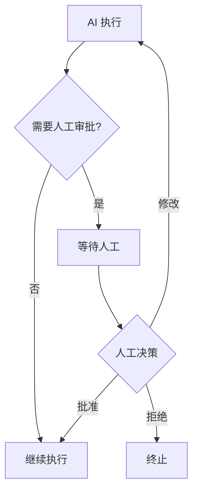

# 第4章 · 人机协作模式 — 构建交互式 AI 系统

> **时长**：约 3 小时 ｜ **难度**：⭐⭐⭐⭐ ｜ **类型**：高级实践
>
> **目标**：掌握人机协作的工作流设计

---

## 学习目标

学完本章后，你将能够：
- 实现人工审批节点
- 构建交互式 Agent
- 处理用户反馈和修正
- 设计安全的人机协作流程

---

## 知识地图



---

## 1、人工审批节点

### 1.1 基础实现

```python
"""
01_human_approval.py
人工审批节点
"""
from typing import TypedDict, Literal
from langgraph.graph import StateGraph, END
from langgraph.checkpoint.memory import MemorySaver


class State(TypedDict):
    task: str
    proposal: str
    human_feedback: str
    approved: bool
    result: str


def generate_proposal(state: State) -> dict:
    """生成方案"""
    proposal = f"针对任务 '{state['task']}' 的执行方案:\n1. 分析需求\n2. 制定计划\n3. 执行实施"
    print(f"\n[AI] 生成方案:\n{proposal}")
    return {"proposal": proposal}


def wait_for_approval(state: State) -> dict:
    """等待人工审批（这个节点会被中断）"""
    print("\n[系统] 等待人工审批...")
    return {}


def process_approval(state: State) -> dict:
    """处理审批结果"""
    if state["approved"]:
        print(f"\n[系统] 人工已批准")
        return {"result": f"方案已批准执行: {state['proposal']}"}
    else:
        print(f"\n[系统] 人工已拒绝，原因: {state['human_feedback']}")
        return {"result": f"方案被拒绝: {state['human_feedback']}"}


def check_approval(state: State) -> Literal["approved", "rejected"]:
    """检查审批状态"""
    return "approved" if state["approved"] else "rejected"


def human_approval_demo():
    """人工审批演示"""
    print("=" * 60)
    print("【人工审批节点】")
    print("=" * 60)

    workflow = StateGraph(State)

    workflow.add_node("generate", generate_proposal)
    workflow.add_node("wait_approval", wait_for_approval)
    workflow.add_node("process", process_approval)

    workflow.set_entry_point("generate")
    workflow.add_edge("generate", "wait_approval")
    workflow.add_edge("wait_approval", "process")
    workflow.add_edge("process", END)

    memory = MemorySaver()
    app = workflow.compile(
        checkpointer=memory,
        interrupt_after=["wait_approval"]
    )

    config = {"configurable": {"thread_id": "approval-1"}}

    # 第一阶段：生成方案
    print("\n=== 阶段1: 生成方案 ===")
    result1 = app.invoke({
        "task": "开发一个新功能",
        "proposal": "",
        "human_feedback": "",
        "approved": False,
        "result": ""
    }, config)

    # 模拟人工审批
    print("\n=== 阶段2: 人工审批 ===")
    user_input = input("批准方案? (y/n): ").strip().lower()
    approved = user_input == 'y'
    feedback = "" if approved else input("拒绝原因: ")

    # 更新状态并恢复
    app.update_state(config, {
        "approved": approved,
        "human_feedback": feedback
    })

    print("\n=== 阶段3: 处理结果 ===")
    result2 = app.invoke(None, config)
    print(f"\n最终结果: {result2['result']}")


if __name__ == "__main__":
    human_approval_demo()
```

---

## 2、交互式修正

### 2.1 允许用户修改

```python
"""
02_interactive_correction.py
交互式修正
"""
from typing import TypedDict, Literal
from langgraph.graph import StateGraph, END
from langgraph.checkpoint.memory import MemorySaver


class State(TypedDict):
    content: str
    version: int
    user_correction: str
    is_final: bool


def generate_content(state: State) -> dict:
    """生成内容"""
    if state["user_correction"]:
        # 根据用户修正重新生成
        content = f"[v{state['version'] + 1}] 根据您的反馈修改: {state['user_correction']}"
    else:
        content = f"[v1] 初始生成的内容"

    print(f"\n[AI] 生成内容: {content}")
    return {
        "content": content,
        "version": state["version"] + 1
    }


def check_status(state: State) -> Literal["continue", "end"]:
    """检查是否继续"""
    return "end" if state["is_final"] else "continue"


def interactive_demo():
    """交互式修正演示"""
    print("=" * 60)
    print("【交互式修正】")
    print("=" * 60)

    workflow = StateGraph(State)

    workflow.add_node("generate", generate_content)
    workflow.set_entry_point("generate")

    workflow.add_conditional_edges(
        "generate",
        check_status,
        {"continue": "generate", "end": END}
    )

    memory = MemorySaver()
    app = workflow.compile(
        checkpointer=memory,
        interrupt_after=["generate"]
    )

    config = {"configurable": {"thread_id": "interactive-1"}}

    # 初始生成
    result = app.invoke({
        "content": "",
        "version": 0,
        "user_correction": "",
        "is_final": False
    }, config)

    # 交互循环
    while True:
        print(f"\n当前内容: {result['content']}")
        user_input = input("\n输入修改意见 (或输入 'ok' 确认): ").strip()

        if user_input.lower() == 'ok':
            app.update_state(config, {"is_final": True})
            result = app.invoke(None, config)
            break
        else:
            app.update_state(config, {
                "user_correction": user_input,
                "is_final": False
            })
            result = app.invoke(None, config)

    print(f"\n最终版本 (v{result['version']}): {result['content']}")


if __name__ == "__main__":
    interactive_demo()
```

---

## 3、敏感操作确认

### 3.1 高风险操作审批

```python
"""
03_sensitive_operations.py
敏感操作确认
"""
from typing import TypedDict, Literal
from langgraph.graph import StateGraph, END
from langgraph.checkpoint.memory import MemorySaver


class State(TypedDict):
    operation: str
    risk_level: str
    confirmed: bool
    executed: bool
    result: str


def analyze_risk(state: State) -> dict:
    """分析操作风险"""
    operation = state["operation"].lower()

    # 判断风险等级
    if "删除" in operation or "delete" in operation:
        risk = "high"
    elif "修改" in operation or "update" in operation:
        risk = "medium"
    else:
        risk = "low"

    print(f"\n[分析] 操作: {state['operation']}")
    print(f"[分析] 风险等级: {risk}")

    return {"risk_level": risk}


def execute_operation(state: State) -> dict:
    """执行操作"""
    print(f"\n[执行] 正在执行: {state['operation']}")
    return {
        "executed": True,
        "result": f"操作 '{state['operation']}' 执行成功"
    }


def reject_operation(state: State) -> dict:
    """拒绝操作"""
    return {
        "executed": False,
        "result": f"操作 '{state['operation']}' 被用户取消"
    }


def route_by_risk(state: State) -> Literal["need_confirm", "auto_execute"]:
    """根据风险路由"""
    if state["risk_level"] in ["high", "medium"]:
        return "need_confirm"
    return "auto_execute"


def check_confirmation(state: State) -> Literal["execute", "reject"]:
    """检查确认结果"""
    return "execute" if state["confirmed"] else "reject"


def sensitive_ops_demo():
    """敏感操作演示"""
    print("=" * 60)
    print("【敏感操作确认】")
    print("=" * 60)

    workflow = StateGraph(State)

    workflow.add_node("analyze", analyze_risk)
    workflow.add_node("confirm", lambda s: {})  # 等待确认
    workflow.add_node("execute", execute_operation)
    workflow.add_node("reject", reject_operation)

    workflow.set_entry_point("analyze")

    # 根据风险路由
    workflow.add_conditional_edges(
        "analyze",
        route_by_risk,
        {
            "need_confirm": "confirm",
            "auto_execute": "execute"
        }
    )

    # 确认后路由
    workflow.add_conditional_edges(
        "confirm",
        check_confirmation,
        {"execute": "execute", "reject": "reject"}
    )

    workflow.add_edge("execute", END)
    workflow.add_edge("reject", END)

    memory = MemorySaver()
    app = workflow.compile(
        checkpointer=memory,
        interrupt_after=["confirm"]
    )

    # 测试高风险操作
    config = {"configurable": {"thread_id": "sensitive-1"}}

    print("\n测试高风险操作:")
    result = app.invoke({
        "operation": "删除所有用户数据",
        "risk_level": "",
        "confirmed": False,
        "executed": False,
        "result": ""
    }, config)

    # 需要确认
    if result["risk_level"] in ["high", "medium"]:
        user_input = input(f"\n⚠️ 这是{result['risk_level']}风险操作，确认执行? (y/n): ")
        confirmed = user_input.strip().lower() == 'y'
        app.update_state(config, {"confirmed": confirmed})
        result = app.invoke(None, config)

    print(f"\n结果: {result['result']}")


if __name__ == "__main__":
    sensitive_ops_demo()
```

---

## 4、完整人机协作 Agent

```python
"""
04_human_in_loop_agent.py
完整人机协作 Agent
"""
import os
from typing import TypedDict, Literal, Annotated, Sequence
from langchain_core.messages import BaseMessage, HumanMessage, AIMessage
from langchain_openai import ChatOpenAI
from langgraph.graph import StateGraph, END
from langgraph.graph.message import add_messages
from langgraph.checkpoint.memory import MemorySaver


class State(TypedDict):
    messages: Annotated[Sequence[BaseMessage], add_messages]
    pending_action: str
    action_approved: bool


def agent_node(state: State) -> dict:
    """Agent 节点"""
    llm = ChatOpenAI(model="gpt-4o-mini")

    # 分析是否需要执行敏感操作
    last_msg = state["messages"][-1].content if state["messages"] else ""

    # 模拟 Agent 决策
    if "执行" in last_msg or "运行" in last_msg:
        return {
            "pending_action": f"准备执行: {last_msg}",
            "messages": [AIMessage(content="检测到执行请求，需要您的确认。")]
        }
    else:
        response = llm.invoke(state["messages"])
        return {
            "pending_action": "",
            "messages": [response]
        }


def execute_action(state: State) -> dict:
    """执行操作"""
    if state["action_approved"]:
        return {"messages": [AIMessage(content=f"✅ 已执行: {state['pending_action']}")]}
    else:
        return {"messages": [AIMessage(content="❌ 操作已取消")]}


def needs_approval(state: State) -> Literal["need_approval", "respond"]:
    """检查是否需要审批"""
    if state["pending_action"]:
        return "need_approval"
    return "respond"


def human_in_loop_demo():
    """人机协作演示"""
    print("=" * 60)
    print("【人机协作 Agent】")
    print("=" * 60)

    workflow = StateGraph(State)

    workflow.add_node("agent", agent_node)
    workflow.add_node("execute", execute_action)

    workflow.set_entry_point("agent")

    workflow.add_conditional_edges(
        "agent",
        needs_approval,
        {
            "need_approval": "execute",
            "respond": END
        }
    )

    workflow.add_edge("execute", END)

    memory = MemorySaver()
    app = workflow.compile(
        checkpointer=memory,
        interrupt_before=["execute"]
    )

    config = {"configurable": {"thread_id": "hil-agent-1"}}

    print("\n输入消息 (输入 'quit' 退出):")

    while True:
        user_input = input("\n你: ").strip()
        if user_input.lower() == 'quit':
            break

        result = app.invoke({
            "messages": [HumanMessage(content=user_input)],
            "pending_action": "",
            "action_approved": False
        }, config)

        # 检查是否需要确认
        if result.get("pending_action"):
            print(f"\nAgent: {result['messages'][-1].content}")
            print(f"待执行操作: {result['pending_action']}")
            approval = input("确认执行? (y/n): ").strip().lower() == 'y'
            app.update_state(config, {"action_approved": approval})
            result = app.invoke(None, config)

        print(f"\nAgent: {result['messages'][-1].content}")


if __name__ == "__main__":
    if not os.getenv("OPENAI_API_KEY"):
        print("请设置 OPENAI_API_KEY")
        exit()

    human_in_loop_demo()
```

---

## 本节小结

- ✅ 实现了人工审批节点
- ✅ 构建了交互式修正流程
- ✅ 学会了敏感操作确认
- ✅ 完成了人机协作 Agent

---

## 模块总结

恭喜完成 **模块10：LangGraph 深入**！

你已经掌握了：
- ✅ LangGraph 核心概念（State, Node, Edge）
- ✅ 条件分支与智能路由
- ✅ 循环执行与状态持久化
- ✅ 人机协作模式设计

---

> **下一模块**：模块11 · MCP 协议 — AI 与外部系统的标准接口
