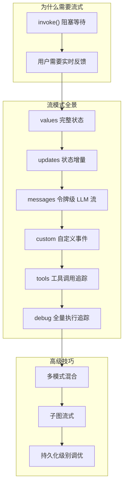
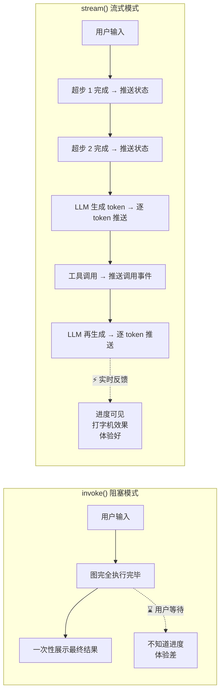
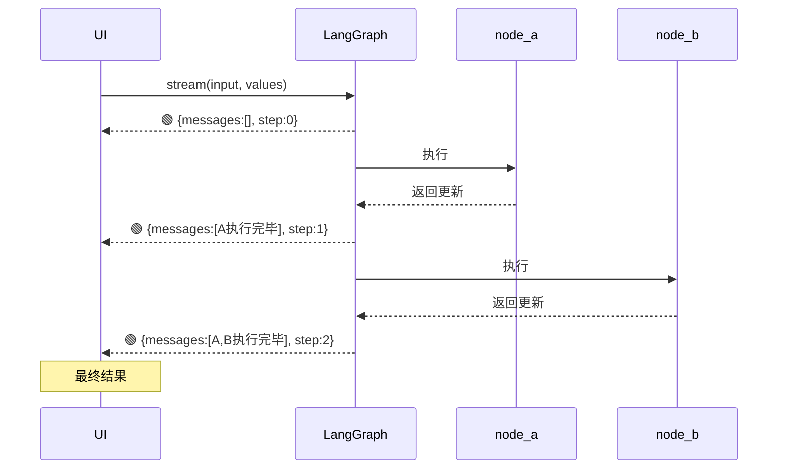
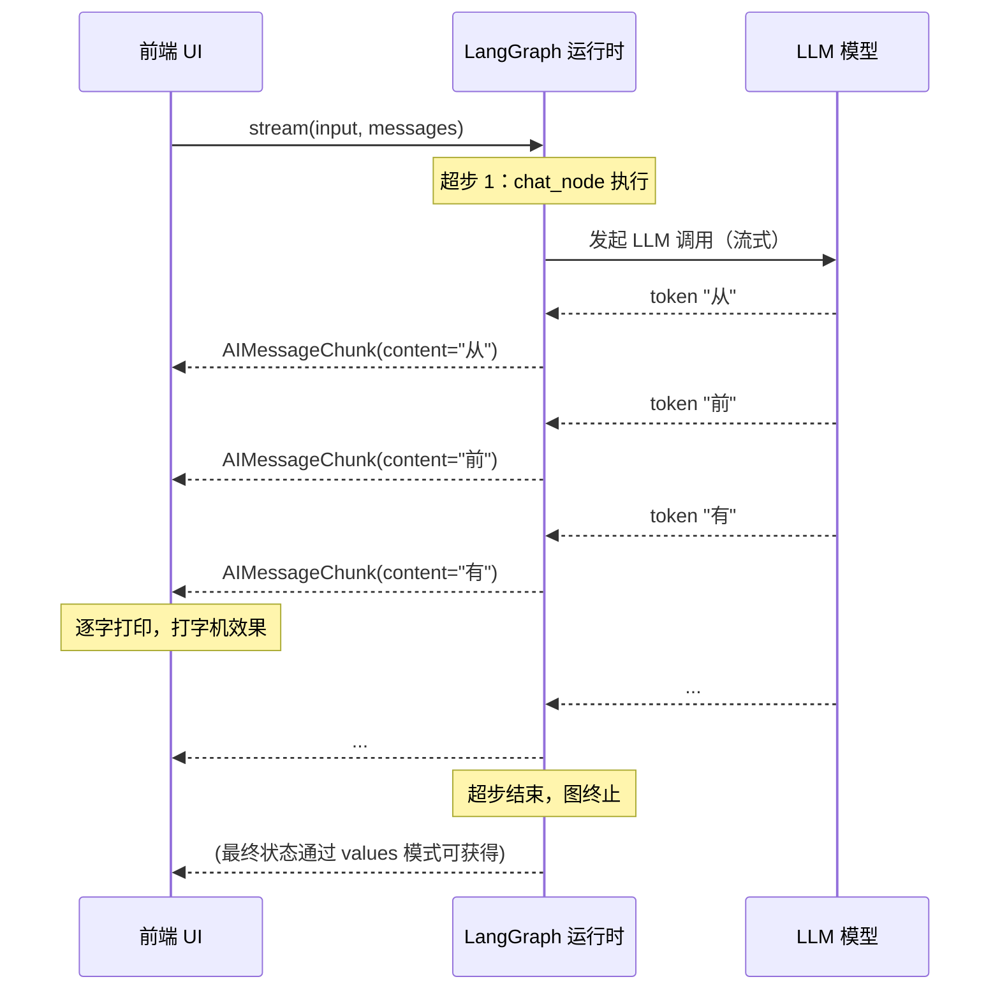
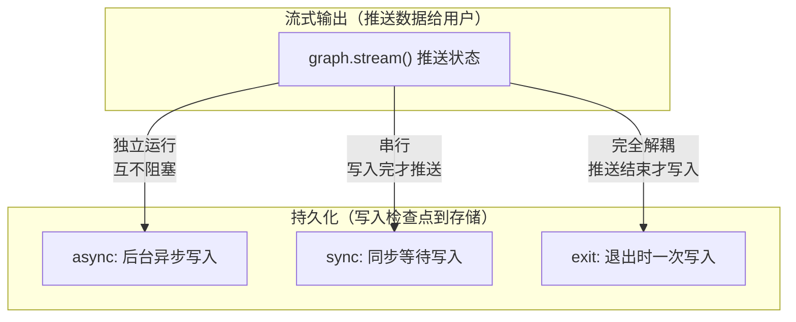

# 第6章 · 流式输出 — 实时掌控图执行的每个瞬间

> **时长**：约 2.5 小时 ｜ **难度**：⭐⭐⭐ ｜ **类型**：讲解 + 动手
>
> **目标**：全面掌握 LangGraph 的流式输出机制——从令牌级 LLM 流到状态变更流、从自定义事件到多模式混合，构建实时响应的 AI 应用

---

## 学习目标

学完本章后，你将能够：
- 理解 `invoke()` 阻塞模型的局限性，以及流式输出的核心价值
- 掌握 6 种流模式（values / updates / messages / custom / tools / debug）的原理与适用场景
- 用 `stream()` 方法替代 `invoke()`，实现逐步状态更新的 UI
- 在 Chat 应用中实现打字机效果的令牌级流式输出
- 通过 `get_stream_writer()` 在节点中发射自定义事件
- 使用多模式混合流式输出，同时接收状态变更和 LLM 令牌
- 理解子图流式输出的命名空间机制
- 掌握持久化级别（async / sync / exit）对性能的影响

---

## 知识地图



---

## 1、为什么需要流式输出

### 1.1 invoke() 的问题

前几章我们一直用 `graph.invoke()` 执行图。它简单直接——传入输入，等待图完全执行完毕，拿到最终结果：

```python
result = graph.invoke({"messages": [HumanMessage(content="讲个故事")]})
print(result["messages"][-1].content)  # 等好久才看到完整的回复
```

但 LLM 生成几百个 token 需要几秒甚至十几秒。如果整段文字生成完才显示，用户体验非常糟糕——用户面对一个空白界面，不知道 LLM 是在思考还是已经卡死。

```
时间线：  |--- LLM 思考 ---|--- 工具调用 ---|--- LLM 生成 400 token ---> 用户才看到结果
                        ↑ 用户全程傻等，没有进度反馈
```

### 1.2 流式解决方案



**LangGraph 的流式是第一等公民**——它不是事后补丁，而是从架构上内置的机制。你不需要额外配置就能获得所有流模式的支持。

### 1.3 stream() 基础用法

```python
# 基本 API
for chunk in graph.stream(input, stream_mode="values"):
    print(chunk)  # 每个超步完成时推送
```

> 💡 `stream()` 返回一个生成器（Generator），每个 `yield` 产出当前模式的数据。你可以在循环中逐个处理，实现实时 UI 更新。

---

## 2、流模式全景

LangGraph 提供 6 种流模式，覆盖从高级状态变更到低级 LLM 令牌的所有粒度：

| 模式 | 产出内容 | 粒度 | 最佳用途 |
|------|---------|------|---------|
| `values` | 每个超步完成后的**完整 State** | 超步级 | 调试状态演化、逐步 UI 刷新 |
| `updates` | 每个节点返回的**状态增量**（delta） | 节点级 | 高效前端更新（只发 diff） |
| `messages` | LLM 生成的**逐 token 流** | 令牌级 | Chat 打字机效果、实时展示回复 |
| `custom` | 节点通过 `get_stream_writer()` **主动发射的事件** | 自定义 | 进度条、通知、结构化状态 |
| `tools` | 工具调用的**生命周期事件**（开始/结束/错误） | 调用级 | 监控工具执行过程 |
| `debug` | 执行的**全量追踪信息**（节点开始/结束/状态快照） | 步骤级 | 深度开发和 Debug |

### 粒度层级

```
更宏观                    更微观
values → updates → tools → messages → debug
                               ↑
                          custom（自由位置）
```

> 💡 **选择策略**：前端展示用 `updates`（高效），Chat 对话用 `messages`（打字机效果），调试用 `values` 或 `debug`，进度监控用 `custom`。

---

## 3、values 模式 —— 完整状态快照

### 3.1 原理

`stream_mode="values"` 在每个**超步（Super-step）完成后**，发射当前 State 的**完整快照**。如果你在图中有 N 个超步，就会收到 N+1 次事件（含初始状态）。

### 3.2 代码示例

```python
from typing_extensions import TypedDict
from langgraph.graph import StateGraph, START, END

class State(TypedDict):
    messages: list
    step: int

def node_a(state: State) -> dict:
    return {"messages": state["messages"] + ["A 执行完毕"], "step": 1}

def node_b(state: State) -> dict:
    return {"messages": state["messages"] + ["B 执行完毕"], "step": 2}

builder = StateGraph(State)
builder.add_node("a", node_a)
builder.add_node("b", node_b)
builder.add_edge(START, "a")
builder.add_edge("a", "b")
builder.add_edge("b", END)
graph = builder.compile()

# values 模式流式输出
for chunk in graph.stream(
    {"messages": [], "step": 0},
    stream_mode="values",
):
    print(f">>> 当前状态: {chunk}")
```

**输出**：

```
>>> 当前状态: {'messages': [], 'step': 0}           # 初始状态
>>> 当前状态: {'messages': ['A 执行完毕'], 'step': 1} # 超步 1 后
>>> 当前状态: {'messages': ['A 执行完毕', 'B 执行完毕'], 'step': 2}  # 超步 2 后
```

### 3.3 关键特征

| 特征 | 说明 |
|------|------|
| **频率** | 每个超步结束一次 + 初始状态一次 |
| **数据量** | 全量 State——字段越多，数据越大 |
| **确定性** | 是——你可以从任意快照重建 UI 状态 |
| **适用场景** | 状态回放、快照恢复、调试状态演化 |

### 3.4 可视化：状态演化过程



> 💡 `values` 模式每次发射都会包含所有字段。如果你的 State 很大（如包含长文档），`updates` 模式更节省带宽。

---

## 4、updates 模式 —— 状态增量

### 4.1 原理

`stream_mode="updates"` 不发送完整的 State，而是只发送**每个节点返回的增量更新**（delta）。结构为：

```python
{
    "node_name": {       # 哪个节点返回的更新
        "key1": new_value1,
        "key2": new_value2,
    }
}
```

### 4.2 代码示例

```python
# 使用同一个 graph
for chunk in graph.stream(
    {"messages": [], "step": 0},
    stream_mode="updates",
):
    print(f">>> 增量更新: {chunk}")
```

**输出**：

```
>>> 增量更新: {'a': {'messages': ['A 执行完毕'], 'step': 1}}
>>> 增量更新: {'b': {'messages': ['A 执行完毕', 'B 执行完毕'], 'step': 2}}
```

### 4.3 values vs updates 对比

| 维度 | values | updates |
|------|--------|---------|
| **数据内容** | 整个 State 的完整快照 | 每个节点返回的变更部分 |
| **体积** | 随 State 增长而增大 | 只含增量，通常很小 |
| **消息数** | 超步数 + 1（含初始状态） | 等于活动的节点数 |
| **前端用法** | 直接替换整个 UI State | 合并到现有 UI State |
| **带宽** | 高（反复传未变字段） | 低（只传变更） |
| **易于理解** | 直观，一眼看到全貌 | 需要理解增量合并 |

### 4.4 使用场景：高效前端更新

在一个 RAG 应用中：

```python
# 前端可以这样处理 updates 流
final_state = {}

for chunk in graph.stream(input, stream_mode="updates"):
    for node_name, delta in chunk.items():
        print(f"[{node_name}] 更新了: {list(delta.keys())}")
        final_state.update(delta)  # 合并增量到本地状态
        # 或按节点名分类处理：
        if node_name == "retrieve":
            show_search_progress(delta["docs"])
        elif node_name == "generate":
            show_streaming_answer(delta["messages"])
```

> 💡 **经验法则**：前端框架（React/Vue）配合 `updates` 模式最合适——每次收到增量只更新受影响的组件，避免全量重渲染。

---

## 5、messages 模式 —— 令牌级 LLM 流（核心）

### 5.1 为什么 messages 模式最重要

在 ChatGPT 风格的对话应用中，最核心的用户体验是**打字机效果**——LLM 生成一个 token 就显示一个 token，而不是等全部生成完再一股脑展示。

`stream_mode="messages"` 正是为此而生：它捕捉 LLM 节点返回的 `AIMessageChunk`，并逐块（chunk）发射给调用者。

### 5.2 前置条件

messages 模式有两个前提：

1. State 的 `messages` 字段必须使用 `add_messages` 归约器
2. 节点必须返回 `AIMessage` 或 `AIMessageChunk`（即通过 LLM 调用生成）

```python
from typing import Annotated
from typing_extensions import TypedDict
from langgraph.graph.message import add_messages

class ChatState(TypedDict):
    messages: Annotated[list, add_messages]  # 必须！
```

### 5.3 基础用法

```python
from langchain_openai import ChatOpenAI
from langchain_core.messages import HumanMessage

llm = ChatOpenAI(model="deepseek-chat")
builder = StateGraph(ChatState)

def chat_node(state: ChatState) -> dict:
    response = llm.invoke(state["messages"])
    # messages 模式自动捕获 LLM 返回的流式令牌
    return {"messages": [response]}

builder.add_node("chat", chat_node)
builder.add_edge(START, "chat")
builder.add_edge("chat", END)
graph = builder.compile()

# messages 模式流式输出
input_state = {"messages": [HumanMessage(content="讲个关于 AI 的短故事")]}

for msg_chunk, metadata in graph.stream(input_state, stream_mode="messages"):
    if msg_chunk.content:
        print(msg_chunk.content, end="", flush=True)
```

**输出效果**（逐字符打印，模拟 LLM 生成）：

```
从
前
有
一
个
聪
明
的
AI
助
手
...
```

### 5.4 理解 msg_chunk 和 metadata

messages 模式的每次 yield 返回 `(AIMessageChunk, metadata)` 元组：

```python
for msg_chunk, metadata in graph.stream(input, stream_mode="messages"):
    # msg_chunk: 当前令牌块，包含 content 和 tool_call 等
    # metadata: 包含节点名、langgraph_step 等上下文信息

    print(f"令牌片段: {msg_chunk.content}")
    print(f"元数据  : {metadata}")
    # metadata 示例:
    # {'langgraph_node': 'chat_node', 'langgraph_step': 2, ...}
```

### 5.5 完整的 Chat UI 实现

```python
import sys
from langchain_core.messages import HumanMessage, AIMessageChunk

def chat_ui(graph, user_input: str):
    """一个简单的打字机效果 Chat UI"""
    print(f"你: {user_input}")
    print("AI: ", end="", flush=True)

    full_response = ""
    input_state = {"messages": [HumanMessage(content=user_input)]}

    for msg_chunk, metadata in graph.stream(input_state, stream_mode="messages"):
        if msg_chunk.content:
            print(msg_chunk.content, end="", flush=True)
            full_response += msg_chunk.content

    print("\n" + "-" * 40)
    return full_response

# 多轮对话
chat_ui(graph, "你好！")
chat_ui(graph, "再讲一个笑话")
```

### 5.6 messages 模式的工作原理



### 5.7 处理工具调用中的消息流

如果节点中 LLM 发起了工具调用，messages 模式同样会发送工具调用的令牌块：

```python
for msg_chunk, metadata in graph.stream(input, stream_mode="messages"):
    # 文本令牌
    if msg_chunk.content:
        print(msg_chunk.content, end="")

    # 工具调用令牌（当 LLM 决定调用工具时）
    if msg_chunk.tool_call_chunks:
        for tc in msg_chunk.tool_call_chunks:
            print(f"\n[准备调用工具: {tc.get('name', '...')}]")
```

> 💡 `tool_call_chunks` 是流式工具调用的令牌级片段——因为 LLM 也可能逐步生成工具调用参数。如需完整的工具调用，等 `msg_chunk.tool_calls` 非空时再处理。

---

## 6、custom 模式 —— 自定义事件

### 6.1 原理

有时候你需要从节点内部**主动发射**自定义事件——比如进度百分比、中间结果、日志消息。`stream_mode="custom"` 配合 `get_stream_writer()` 实现这个能力。

### 6.2 使用方法

在节点函数中调用 `get_stream_writer()` 获取写入器，然后调用 `writer(data)` 发射自定义事件：

```python
from langgraph.types import get_stream_writer

def long_running_node(state: State) -> dict:
    writer = get_stream_writer()  # 获取流写入器

    writer("进度: 开始处理")
    # ... 执行第一步 ...
    writer({"progress": 0.3, "message": "正在检索文档..."})

    # ... 执行第二步 ...
    writer({"progress": 0.6, "message": "正在分析结果..."})

    # ... 执行第三步 ...
    writer({"progress": 0.9, "message": "正在生成回复..."})

    result = process(...)
    writer({"progress": 1.0, "message": "完成"})
    return {"messages": [result]}

# 消费自定义事件
for event in graph.stream(input, stream_mode="custom"):
    print(f"[自定义事件] {event}")
```

**输出**：

```
[自定义事件] 进度: 开始处理
[自定义事件] {'progress': 0.3, 'message': '正在检索文档...'}
[自定义事件] {'progress': 0.6, 'message': '正在分析结果...'}
[自定义事件] {'progress': 0.9, 'message': '正在生成回复...'}
[自定义事件] {'progress': 1.0, 'message': '完成'}
```

### 6.3 最佳实践

| 场景 | 自定义事件内容 | 频率 |
|------|--------------|------|
| 进度条 | `{"progress": 0.0~1.0}` | 每步一次 |
| 日志流 | `{"level": "info", "message": "..."}` | 按需发射 |
| 结构化状态 | `{"status": "processing", "details": {...}}` | 关键节点 |
| 通知提醒 | `{"type": "warning", "text": "API 响应慢"}` | 异常时 |

```python
def data_pipeline_node(state: State) -> dict:
    writer = get_stream_writer()
    total_steps = 5

    for i in range(total_steps):
        # 模拟长时间处理
        import time
        time.sleep(1)

        writer({
            "progress": (i + 1) / total_steps,
            "step": i + 1,
            "total": total_steps,
            "status": "running",
        })

    writer({"status": "complete"})
    return {"result": "数据处理完成"}
```

> ⚠️ **注意**：`get_stream_writer()` 只能在节点函数内部调用——它不在节点函数外部或普通 Python 函数中工作。

---

## 7、tools 模式 —— 工具调用追踪

### 7.1 原理

当图中包含工具调用时（如 `ToolNode`），你可能想监控：什么工具被调用了？调用参数是什么？是否调成功了？`stream_mode="tools"` 专门为此设计。

### 7.2 事件类型

tools 模式发射三种事件：

| 事件类型 | 触发时机 | 数据内容 |
|---------|---------|---------|
| `tool_call_start` | 工具即将被执行 | 工具名称、输入参数、调用 ID |
| `tool_call_end` | 工具执行完毕 | 工具名称、输出结果、执行耗时 |
| `tool_call_error` | 工具执行出错 | 工具名称、错误信息、调用 ID |

### 7.3 代码示例

```python
for event in graph.stream(input, stream_mode="tools"):
    event_type = event["type"]
    tool_name = event.get("name", "unknown")
    tool_input = event.get("input", {})

    if event_type == "tool_call_start":
        print(f"\n🔧 [{tool_name}] 开始执行")
        print(f"   参数: {tool_input}")

    elif event_type == "tool_call_end":
        result = event.get("output", "")
        duration = event.get("duration_ms", 0)
        print(f"✅ [{tool_name}] 执行完成 ({duration}ms)")
        print(f"   结果: {str(result)[:100]}...")

    elif event_type == "tool_call_error":
        error = event.get("error", "未知错误")
        print(f"❌ [{tool_name}] 执行失败: {error}")
```

### 7.4 典型输出

```
🔧 [web_search] 开始执行
   参数: {'query': '2024年诺贝尔物理学奖'}
✅ [web_search] 执行完成 (234ms)
   结果: 2024年诺贝尔物理学奖授予 John Hopfield 和 Geoffrey Hinton...
🔧 [calculator] 开始执行
   参数: {'expression': '2 ** 10'}
✅ [calculator] 执行完成 (15ms)
   结果: 1024
```

> 💡 tools 模式与 values/updates 模式互不冲突——你可以在同一个 stream 调用中同时使用 tools 和其他模式（见第 10 节多模式流）。

---

## 8、debug 模式 —— 全量执行追踪

### 8.1 原理

`debug` 是**最详细**的流模式——它记录图中发生的每一件事：

- 每个节点的开始和结束
- 节点返回值（完整 State 快照）
- 边（Edge）的评估过程
- 条件边的路由结果
- 内部状态变更

### 8.2 使用方式

```python
for event in graph.stream(input, stream_mode="debug"):
    print(f"[{event['type']}] {event['timestamp']}")
    print(f"  节点: {event.get('step_name', 'N/A')}")
    print(f"  输入: {event.get('input', {})}")
    print(f"  输出: {event.get('output', {})}")
    print()
```

### 8.3 debug 事件结构

```
event = {
    "type": "node:start" | "node:end" | "edge" | "checkpoint",
    "timestamp": "2026-06-15T10:30:00.123Z",
    "step_name": "node_a",
    "input": {...},     # 节点接收到 State
    "output": {...},    # 节点返回（仅 end 事件）
    "metadata": {...},  # 运行时元数据
}
```

### 8.4 ⚠️ 性能警告

```python
# 只在开发/调试时使用 debug 模式！
if DEBUG_MODE:
    for event in graph.stream(input, stream_mode="debug"):
        log_debug_event(event)
else:
    result = graph.invoke(input)  # 生产环境不用 debug
```

> ⚠️ **debug 模式会产生大量事件**——一个包含 LLM 调用和图循环的应用，一次执行可能生成几百个 debug 事件。绝对不要在生产环境中使用。

---

## 9、流模式对比总结

| 模式 | 数据量 | 延迟 | 前端友好度 | 生产适用 | 典型场景 |
|------|-------|------|-----------|---------|---------|
| `values` | 高（全量） | 超步级 | ⭐⭐⭐ | 是 | 状态回放、调试 |
| `updates` | 低（增量） | 节点级 | ⭐⭐⭐⭐⭐ | 是 | 前端状态管理 |
| `messages` | 中（令牌） | 实时 | ⭐⭐⭐⭐⭐ | 是 | Chat 打字机 |
| `custom` | 自定义 | 自定义 | ⭐⭐⭐⭐ | 是 | 进度条、通知 |
| `tools` | 低（事件） | 调用级 | ⭐⭐⭐⭐ | 是 | 工具监控 |
| `debug` | 极高 | 步骤级 | ⭐⭐ | 否 | 开发调试 |

---

## 10、多模式混合流式输出

### 10.1 原理

很多时候你需要**同时监控不同层级的信息**——既想看到状态增量（updates），又想看到 LLM 令牌（messages）。LangGraph 允许你传入模式列表：

```python
for event in graph.stream(input, stream_mode=["updates", "messages"]):
    # event 现在是元组: (模式名称, 模式数据)
    mode, data = event
    print(f"[{mode}] {data}")
```

### 10.2 事件格式

多模式混合时，每个 `yield` 产出 `(mode_name, data)` 元组：

```
("updates", {"chat_node": {"messages": [AIMessageChunk(...)]}})
("messages", (AIMessageChunk(content="从"), {"langgraph_node": "chat_node"}))
("messages", (AIMessageChunk(content="前"), {"langgraph_node": "chat_node"}))
("messages", (AIMessageChunk(content="有"), {"langgraph_node": "chat_node"}))
("updates", {"chat_node": {"messages": [AIMessage(content="从前有...")]}})
```

### 10.3 完整示例

```python
def stream_chat_ui(graph, user_input: str):
    """同时接收状态更新和 LLM 令牌的 Chat UI"""
    input_state = {"messages": [HumanMessage(content=user_input)]}

    for event in graph.stream(input_state, stream_mode=["updates", "messages"]):
        mode, data = event

        if mode == "updates":
            # 处理状态变更
            for node_name, delta in data.items():
                if node_name == "search":
                    print(f"\n[搜索] 找到 {len(delta.get('docs', []))} 条结果")
                elif node_name == "generate":
                    print("\n[生成] ", end="", flush=True)

        elif mode == "messages":
            # 处理 LLM 令牌
            msg_chunk, metadata = data
            if msg_chunk.content:
                print(msg_chunk.content, end="", flush=True)
```

### 10.4 事件顺序

多模式不改变事件顺序——所有模式的事件按**执行时间**交织在一起：

```
时间 →  updates: {search: docs[...]}
时间 →  updates: {generate: ...}
时间 →  messages: token "从"
时间 →  messages: token "前"
时间 →  messages: token "有"
...
时间 →  updates: {generate: {messages: [final]}}
```

> 💡 **最佳实践**：`["updates", "messages"]` 是最常用的组合——`updates` 驱动 UI 结构变化，`messages` 驱动文本实时展示。

---

## 11、子图流式输出（Subgraph Streaming）

### 11.1 问题

当图中包含**子图**（Subgraph）时，默认流式输出会将子图内部的事件**扁平化**——你只看到子图作为一个整体的事件，看不到子图内部的节点执行细节。

### 11.2 启用子图流式

`stream()` 的 `subgraphs=True` 参数让子图内部的事件也暴露出来：

```python
# 主图包含子图 subgraph_1
for event in graph.stream(input, stream_mode="updates", subgraphs=True):
    namespace, data = event
    print(f"命名空间: {namespace}")
    print(f"数据: {data}")
```

### 11.3 命名空间机制

子图事件的 `namespace` 是一个元组，标识事件来源的路径：

```
# 主图事件
namespace = ()  # 空元组

# 一级子图的事件
namespace = ("subgraph_1",)  # 子图名为 "subgraph_1"

# 嵌套子图的事件
namespace = ("subgraph_1", "inner_subgraph")
```

```python
def stream_with_subgraphs(graph, input_data):
    for event in graph.stream(input_data, stream_mode="updates", subgraphs=True):
        namespace, data = event

        if not namespace:
            # 主图事件
            print(f"[主图] {data}")
        elif len(namespace) == 1:
            print(f"[子图: {namespace[0]}] {data}")
        else:
            print(f"[嵌套子图: {' → '.join(namespace)}] {data}")
```

### 11.4 典型输出

```
[主图] {'router': {'next': 'subgraph_1'}}
[子图: subgraph_1] {'search': {'docs': [...]}}
[子图: subgraph_1] {'generate': {'messages': [...]}}
[主图] {'aggregator': {'result': '最终答案'}}
```

> 💡 子图流式默认关闭（`subgraphs=False`），因为开启会引入额外的序列化/反序列化开销。只有当子图内部状态对你「可见」很重要时才开启。

---

## 12、持久化级别 —— 性能与可靠性的权衡

### 12.1 什么是持久化级别

LangGraph 默认在每个超步结束时保存**检查点**（checkpoint）。但这涉及 I/O 操作，可能拖慢性能。你可以通过 `durability` 参数调整持久化行为：

| 级别 | 行为 | 性能 | 可靠性 |
|------|------|------|--------|
| `"async"` | **异步保存**——不阻塞当前超步，在后台写检查点 | ⭐⭐⭐⭐⭐ | ⭐⭐⭐ |
| `"sync"` | **同步保存**——每个超步结束时等待检查点写完 | ⭐⭐⭐ | ⭐⭐⭐⭐⭐ |
| `"exit"` | **退出时保存**——只在图完全执行完毕后写一次检查点 | ⭐⭐⭐⭐ | ⭐⭐ |

### 12.2 配置方式

```python
# 用 compile() 的 durability 参数
graph = builder.compile(
    durability="async",  # 默认：异步保存，性能最佳
    # durability="sync", # 同步保存，可靠性最高
    # durability="exit", # 退出时保存，适合一次性执行
)

# 流式输出不受 durability 影响——它控制的是检查点写入策略
for chunk in graph.stream(input, stream_mode="updates"):
    print(chunk)
```

### 12.3 选择策略

| 场景 | 推荐级别 | 理由 |
|------|---------|------|
| 生产 Chat 应用 | `"async"` | 性能优先，少量检查点丢失可接受 |
| 金融/医疗场景 | `"sync"` | 必须保证每一步都有可靠恢复点 |
| 一次性批处理 | `"exit"` | 中间状态不需要恢复，只需最终结果 |
| 开发调试 | `"sync"` 或 `"async"` | 取决于你是否需要中间检查点来 Debug |

### 12.4 流式输出与持久化的关系



> 💡 `durability` 影响 `graph.stream()` 中相邻两个事件之间的延迟——`"sync"` 模式下每个超步结束时多一次 I/O 等待，`"async"` 模式下几乎无感。

---

## 常见踩坑

1. **`stream()` 走完无法复用**：`stream()` 返回的生成器只能被消费一次。如果需要重复流式，重新调用 `graph.stream()`。不要缓存生成器对象。

2. **messages 模式不生效**：最常见的原因是 State 中 `messages` 字段没有使用 `add_messages` 归约器。没有 `Annotated[list, add_messages]`，messages 模式无法识别消息块。

3. **custom 模式 `get_stream_writer()` 调用失败**：`get_stream_writer()` 只能在节点函数内部、**在图的执行上下文中**调用。在普通 Python 函数或节点外部调用会抛出运行时错误。

4. **多模式混合的事件顺序误解**：多模式流的 `(mode, data)` 元组不是按模式分组的，而是按时间交错排列的。不要假设同一模式的所有事件会连续到达。

5. **debug 模式在生产环境意外开启**：debug 模式产生的事件量极为庞大（一个图执行可能触发几百个事件），且包含完整的 State 快照。在生产环境中开启会严重拖慢性能并可能泄露敏感数据。

---

## 课后练习

1. 修改第 2 章的 RAG 图，从 `invoke()` 改为 `stream(mode="updates")`，在前端模拟逐步展示"检索中... → 生成中..."的状态变化。

2. 实现一个包含 `custom` 事件的"大文件处理图"：节点模拟读取、解析、分析、汇总四个步骤，每个步骤通过 `get_stream_writer()` 发射进度百分比，前端实现随进度变化的进度条。

3. 构建一个 Chat 应用图，使用 `stream(mode=["updates", "messages"])` 双模式混合流：`updates` 驱动对话列表更新，`messages` 驱动打字机效果，验证两种事件如何交织。

4. 创建一个包含子图的图（主图包含一个子图），分别用 `subgraphs=True` 和 `subgraphs=False` 执行流式输出，对比两者的输出差异，理解命名空间的工作机制。

---

## 本节小结

- ✅ 理解了 `invoke()` 的阻塞局限和流式输出的核心价值——实时反馈提升用户体验
- ✅ 掌握了 6 种流模式：values（全量状态）、updates（增量）、messages（令牌级 LLM 流）、custom（自定义事件）、tools（工具追踪）、debug（全量追踪）
- ✅ 学会了用 `stream(mode="messages")` 实现 Chat 打字机效果
- ✅ 掌握了 `get_stream_writer()` 在节点中发射自定义事件的方法
- ✅ 理解了多模式混合流的 `(mode, data)` 元组机制和事件交错顺序
- ✅ 掌握了子图流式的命名空间机制和 `subgraphs` 参数
- ✅ 理解了三种持久化级别（async / sync / exit）对性能和可靠性的影响

---

> **下一章**：第7章 · 持久化与检查点 — State 的快照、恢复与时间旅行
