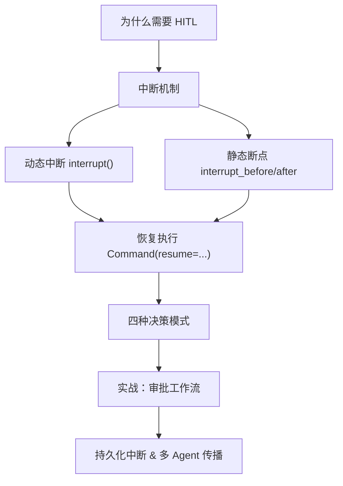
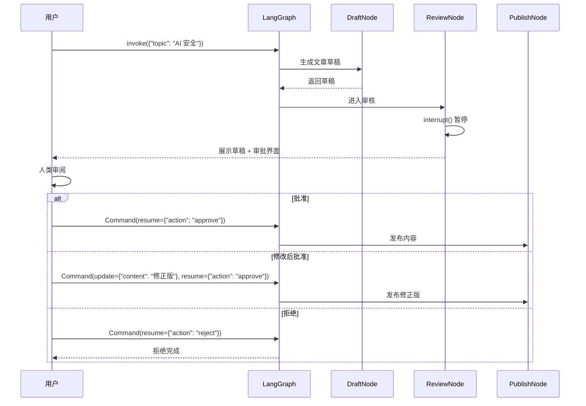

# 第7章 · 人机协作 — 中断、审批与动态恢复

> **时长**：约 3 小时 ｜ **难度**：⭐⭐⭐⭐ ｜ **类型**：项目实战
>
> **目标**：掌握 LangGraph 的人机协作机制——interrupt 动态中断、Command 恢复执行、四种审批模式，构建可靠的人工审批工作流

---

## 学习目标

学完本章后，你将能够：
- 理解 Human-in-the-Loop（HITL）在 Agent 系统中的必要性和典型应用场景
- 使用 `interrupt()` 在运行时动态暂停图执行并等待人类输入
- 使用 `interrupt_before` / `interrupt_after` 设置编译时静态断点
- 使用 `Command(resume=...)` 恢复被中断的图并传递人类决策
- 掌握四种人类决策模式：Approve / Reject / Edit / Respond
- 构建完整的人工审批工作流（内容审核、交易确认、发布审批）
- 理解持久化中断机制——中断状态可跨会话恢复
- 理解 Multi-Agent 场景中中断的传播规则

---

## 知识地图



---

## 1、为什么需要 Human-in-the-Loop（HITL）

AI Agent 变得越来越自主，但**自主不等于完美**。LLM 会产生幻觉、做出错误判断、或执行不可逆的操作。

| 场景 | 后果 | HITL 的作用 |
|------|------|------------|
| 金融交易 | 资金损失、合规风险 | 人类确认金额/收款方后再执行 |
| 内容发布 | 声誉损害、法律风险 | 人类审核内容合规性 |
| 医疗建议 | 生命健康风险 | 专业医生审核 AI 建议 |
| 代码部署 | 系统故障、数据丢失 | 开发者 Review 变更 |

LangGraph 的人机协作机制：`图执行 → interrupt() 暂停 → 返回中间状态 → 用户决策 → Command 恢复 → 图继续`。

核心设计理念：**图是状态机，中断是插入"等待外部输入"的暂停点**。完整状态保存到检查点（checkpoint），用户可在任意时间后恢复。

> 💡 **设计哲学**：LangGraph 的 HITL 不是"回调"或"通知"，而是**中断 + 恢复**。就像给图执行按下了"暂停键"。

---

## 2、动态中断：interrupt()

`interrupt()` 是 LangGraph 最灵活的 HITL 工具——在节点内任意位置调用，图立即暂停等待人类输入。

### 2.1 基本用法

```python
from langgraph.types import interrupt

def approval_node(state: State) -> dict:
    # interrupt() 暂停图，返回值为 Command(resume=...) 传入的数据
    decision = interrupt({
        "question": "是否批准以下内容？",
        "content": state["pending_content"],
        "options": ["approve", "reject", "edit"],
    })
    if decision["action"] == "approve":
        return {"status": "approved"}
    elif decision["action"] == "reject":
        return {"status": "rejected"}
    else:
        return {"status": "editing", "feedback": decision.get("feedback", "")}
```

### 2.2 执行流程

1. 节点调用 `interrupt(value)`
2. LangGraph 捕获 `GraphInterrupt` 异常，State 保存到检查点
3. 控制权返回给调用者，展示 value 给人类用户
4. 人类决策后传入 `Command(resume=decision)`
5. `interrupt()` 返回 resume 值，节点继续执行

> ⚠️ **必要条件**：`interrupt()` 必须与 Checkpointer 配合使用，否则无法保存状态。最简单的选择是 `MemorySaver`。

```python
# interrupt(value) 的 value 展示给人类
# interrupt() 返回值 = 用户传入的 resume 数据
human_input = interrupt({"title": "审批", "data": state["draft"], "actions": ["approve", "reject"]})
```

> 💡 一个节点中可多次调用 `interrupt()`——每次都会暂停等待输入，适合多步骤审批。

### ▶ 执行代码

```powershell
cd code/07-人机协作-代码案例
python 01_dynamic_interrupt.py
```

---

## 3、静态断点：interrupt_before / interrupt_after

除了运行时的 `interrupt()`，LangGraph 还支持在**编译时**设置静态断点。

### 3.1 基本语法

```python
# 在指定节点执行前暂停
graph = builder.compile(interrupt_before=["approval_node"], checkpointer=checkpointer)

# 在指定节点执行后暂停
graph = builder.compile(interrupt_after=["draft_node"], checkpointer=checkpointer)

# 同时设置多个
graph = builder.compile(
    interrupt_before=["approval_node", "publish_node"],
    interrupt_after=["draft_node"],
    checkpointer=checkpointer,
)
```

### 3.2 动态 vs 静态：对比

| 维度 | 动态中断 `interrupt()` | 静态断点 `interrupt_before/after` |
|------|----------------------|----------------------------------|
| 设置时机 | 运行时（代码中调用） | 编译时（`compile()` 参数） |
| 控制粒度 | 语句级 | 节点级 |
| 灵活性 | 高（条件触发、多次调用） | 低（固定位置） |
| 代码侵入性 | 需修改节点代码 | 不修改节点代码 |
| 恢复方式 | 必须 `Command(resume=...)` | 只需 `graph.invoke(None, config)` |
| 适用场景 | 条件审批、动态决策 | 调试、固定流程审核 |

### 3.3 使用示例

```python
graph = builder.compile(interrupt_before=["publish_node"], checkpointer=MemorySaver())
config = {"configurable": {"thread_id": "thread-1"}}
graph.invoke({"content": "待发布内容"}, config)

state = graph.get_state(config)
print(state.next)  # ('publish_node',)

# 恢复：不需 resume，直接继续
graph.invoke(None, config)
```

> 💡 **选择指南**：节点代码可修改时优先用 `interrupt()`。两者常结合：`interrupt_before` 确保关键节点必停，`interrupt()` 处理内部条件逻辑。

### ▶ 执行代码

```powershell
cd code/07-人机协作-代码案例
python 02_static_breakpoint.py
```

---

## 4、恢复执行：Command

被中断的图通过 `Command` 对象恢复，提供三种模式。

```python
from langgraph.types import Command

# 模式一：仅传递恢复数据（最常用）
Command(resume={"action": "approve"})

# 模式二：更新 State 并恢复（人类修改 AI 输出后继续）
Command(update={"content": "人工修正后的内容"}, resume={"action": "approve"})

# 模式三：恢复并重定向到其他节点
Command(goto="reject_handler", resume={"action": "reject", "reason": "不合规"})
```

| 参数 | 作用 | 适用场景 |
|------|------|---------|
| `resume=value` | 作为 `interrupt()` 的返回值传递给节点 | 人类做出决策 |
| `update={...}` | 合并到 State（节点恢复前生效） | 人类修改 AI 输出 |
| `goto="node"` | 重定向到指定节点（覆盖原有路径） | 异常处理、跳过步骤 |

> ⚠️ **节点重入规则**：`Command(resume=...)` 恢复时，包含 `interrupt()` 的节点会**从函数开头重新执行**。有副作用的节点务必设计幂等性。

### ▶ 执行代码

```powershell
cd code/07-人机协作-代码案例
python 03_command_resume.py
```

---

## 5、四种人类决策模式

| 模式 | Command 写法 | 节点行为 | 适用场景 |
|------|-------------|---------|---------|
| **Approve** | `Command(resume={"action":"approve"})` | 读取 resume 后继续 | 简单审核通过 |
| **Reject** | `Command(resume={"action":"reject","reason":"..."})` | 跳转拒绝处理 | 内容不合规 |
| **Edit** | `Command(update={"content":"..."}, resume={"action":"approve"})` | 先合并 update 再恢复 | 人类修正 AI 输出 |
| **Respond** | `Command(resume={"action":"respond","data":"..."})` | 读取补充信息合并到 State | 人类补充 AI 缺失信息 |

### Approve（批准）

```python
Command(resume={"action": "approve"})

def review_node(state: State) -> dict:
    result = interrupt("请审核...")
    if result["action"] == "approve":
        return {"approved": True, "reviewer": result.get("reviewer", "unknown")}
```

### Reject（拒绝）

```python
Command(resume={"action": "reject", "reason": "内容不符合规范"})

def review_node(state: State) -> dict:
    result = interrupt("请审核...")
    if result["action"] == "reject":
        return {"approved": False, "reject_reason": result.get("reason", ""), "status": "rejected"}
```

### Edit（修改后批准）—— 特色能力

人类不仅批准，还**直接修改 State**：

```python
Command(update={"content": "人工修正后的内容..."}, resume={"action": "approve"})
```

### Respond（补充信息）

```python
Command(resume={"action": "respond", "context": "该用户是 VIP 客户"})
```

> 💡 **Edit 模式最具 LangGraph 特色**：其他框架 HITL 通常只支持 approve/reject，而 LangGraph 允许人类在执行过程中**直接修改 State**，实现"AI 生成 → 人工修正 → AI 继续处理"的无缝协作。

---

## 6、实战：内容审批工作流

### 6.1 工作流设计



### 6.2 完整代码

```python
from typing_extensions import TypedDict
from langgraph.graph import StateGraph, START, END
from langgraph.checkpoint.memory import MemorySaver
from langgraph.types import Command, interrupt

class ArticleState(TypedDict):
    topic: str
    draft: str
    final_content: str
    status: str
    feedback: str
    reviewer: str
    version: int

def generate_draft(state: ArticleState) -> dict:
    draft = f"关于「{state['topic']}」的分析文章（v{state.get('version', 0) + 1}）"
    return {"draft": draft, "status": "draft", "version": state.get("version", 0) + 1}

def human_review(state: ArticleState) -> dict:
    decision = interrupt({"draft": state["draft"], "actions": ["approve", "reject", "edit"]})
    return {
        "status": "approved" if decision.get("action") == "approve" else "rejected",
        "feedback": decision.get("feedback", ""),
        "final_content": decision.get("edited_content", state["draft"]),
        "reviewer": decision.get("reviewer", "anonymous"),
    }

def publish_article(state: ArticleState) -> dict:
    return {"status": "published"}

def handle_rejection(state: ArticleState) -> dict:
    return {"status": "rejected"}

builder = StateGraph(ArticleState)
builder.add_node("generate", generate_draft)
builder.add_node("review", human_review)
builder.add_node("publish", publish_article)
builder.add_node("reject", handle_rejection)
builder.add_edge(START, "generate")
builder.add_edge("generate", "review")
builder.add_conditional_edges("review", lambda s: "publish" if s["status"] == "approved" else "reject")
builder.add_edge("publish", END)
builder.add_edge("reject", END)

graph = builder.compile(checkpointer=MemorySaver())
```

> 💡 **同一个图，三种行为**：通过不同 `Command` 注入决策实现批准、拒绝、编辑后批准三种工作流。

### ▶ 执行代码

```powershell
cd code/07-人机协作-代码案例
python 04_approval_workflow.py
```

---

## 7、持久化中断

中断具有**持久性**——用户可关闭页面，几小时甚至几天后回来继续执行。只要有 checkpointer 中断就是持久的。

```python
from langgraph.checkpoint.sqlite import SqliteSaver

checkpointer = SqliteSaver.from_conn_string("checkpoints.db")
graph = builder.compile(checkpointer=checkpointer)

# 第一天
config = {"configurable": {"thread_id": "order-12345"}}
graph.invoke({"amount": 9999.99}, config)

# ─── 第二天 ───
config = {"configurable": {"thread_id": "order-12345"}}
state = graph.get_state(config)
print(state.next)  # ('approve_payment',)

result = graph.invoke(Command(resume={"action": "approve"}), config)
```

### 检查挂起中断

```python
state = graph.get_state(config)
for task in state.tasks:
    if task.interrupts:
        for info in task.interrupts:
            print(f"中断值：{info.value}，节点：{info.node}")
print(f"下一个节点：{state.next}")
```

> ⚠️ **thread_id 是关键**：不指定时 LangGraph 生成随机 ID，丢失无法恢复。生产环境务必指定有业务含义的 thread_id。

---

## 8、Multi-Agent 场景中的中断

### 8.1 传播规则

1. **子图的 `interrupt()` 传播到父图调用节点**
2. **父图通过 `state.tasks` 暴露子图中断信息**
3. **恢复时在父图级别使用 `Command(resume=...)`**——LangGraph 自动将 resume 值传递给正确的 `interrupt()`
4. **父子图同时有中断时，父图中断优先处理**

### 8.2 嵌套中断处理

```python
child_builder = StateGraph(ChildState)
child_builder.add_node("review", lambda s: interrupt("子图审核中..."))
child_graph = child_builder.compile(checkpointer=MemorySaver())

def supervisor_node(state: MainState) -> dict:
    return {"result": child_graph.invoke({"content": state["task"]})}

config = {"configurable": {"thread_id": "multi-001"}}
parent_graph.invoke({"task": "审核用户反馈"}, config)

# 检查中断
state = parent_graph.get_state(config)
for task in state.tasks:
    if task.interrupts:
        print(f"中断节点：{task.name}")

# 父图级别恢复
parent_graph.invoke(Command(resume={"action": "approve"}), config)
```

> 💡 **关键理解**：子图是"黑盒"。调用者始终在父图级别通过 `Command(resume=...)` 恢复，LangGraph 自动将 resume 传递给正确的 `interrupt()`。

---

## 常见踩坑

1. **中断恢复后节点重新执行引发副作用**：`Command(resume=...)` 恢复时包含 `interrupt()` 的节点会**从函数开头重新执行**。有副作用时务必设计幂等性。

2. **混淆 interrupt() 和静态断点的恢复方式**：`interrupt()` 必须传入 `Command(resume=...)`；静态断点只需 `graph.invoke(None, config)`。

3. **thread_id 丢失导致无法恢复**：不指定时 LangGraph 生成随机 ID，页面刷新后无法恢复。生产环境务必指定有业务含义的 thread_id。

4. **忘记 checkpointer 导致中断异常**：`interrupt()` 和静态断点都需要 checkpointer。编译时未传入则触发中断时抛出运行时错误。

5. **`Command(goto=...)` 跳过后状态不一致**：`goto` 跳过中间节点可能导致 State 缺少关键字段。使用前确保目标节点能处理不完整的 State。

---

## 课后练习

1. **增加二次审核**：修改第 6 节审批工作流，在 `publish` 前再加 `confirm_node`。提示：`interrupt_before=["confirm_node"]` + `interrupt()`。

2. **交易审批系统**：模拟银行转账——金额校验 → 人工确认 → 执行转账。金额超 10000 元时强制人工审批，否则自动通过。

3. **多 Agent 审核流水线**：Agent A 生成报告 → Agent B 审核（子图中断）→ 人类修改 → Agent C 发布。验证子图中断传播和恢复。

4. **缓存审批机制**：同一内容 5 分钟内已被审核过则自动复用上次结果。提示：State 中存储 `approval_history`。

---

## 本节小结

- ✅ 理解了 Human-in-the-Loop 在 AI Agent 系统中的重要性和典型应用场景
- ✅ 掌握了 `interrupt()` 动态中断——在运行时暂停图，等待人类输入
- ✅ 掌握了 `interrupt_before` / `interrupt_after` 静态断点——编译时设置固定中断点
- ✅ 学会了使用 `Command(resume=...)`、`Command(update=..., resume=...)`、`Command(goto=...)` 三种恢复模式
- ✅ 掌握了四种人类决策模式：Approve（批准）、Reject（拒绝）、Edit（修改后批准）、Respond（补充信息）
- ✅ 构建了完整的内容审批工作流，理解了条件路由与中断恢复的结合
- ✅ 理解了中断的持久化机制——只要有 checkpointer，中断可在任意时间后恢复
- ✅ 掌握了 Multi-Agent 场景中中断的传播规则和恢复方法

---

> **下一章**：第8章 · 多 Agent 编排 — 子图、Supervisor 与通信模式
