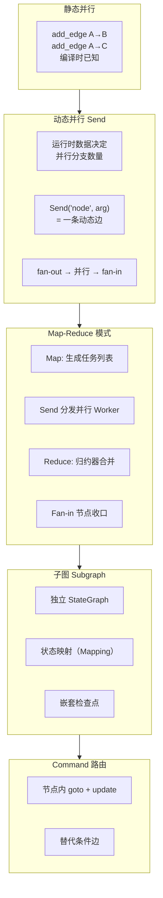
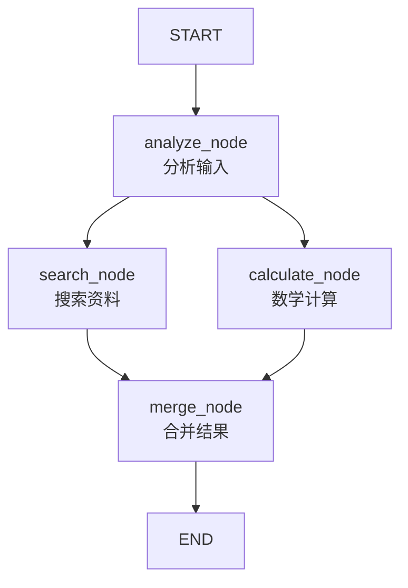
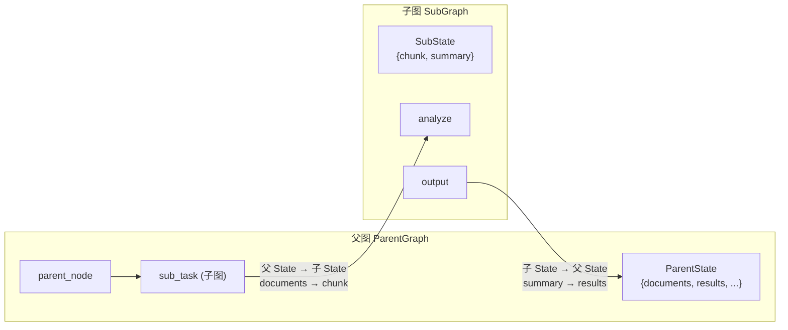
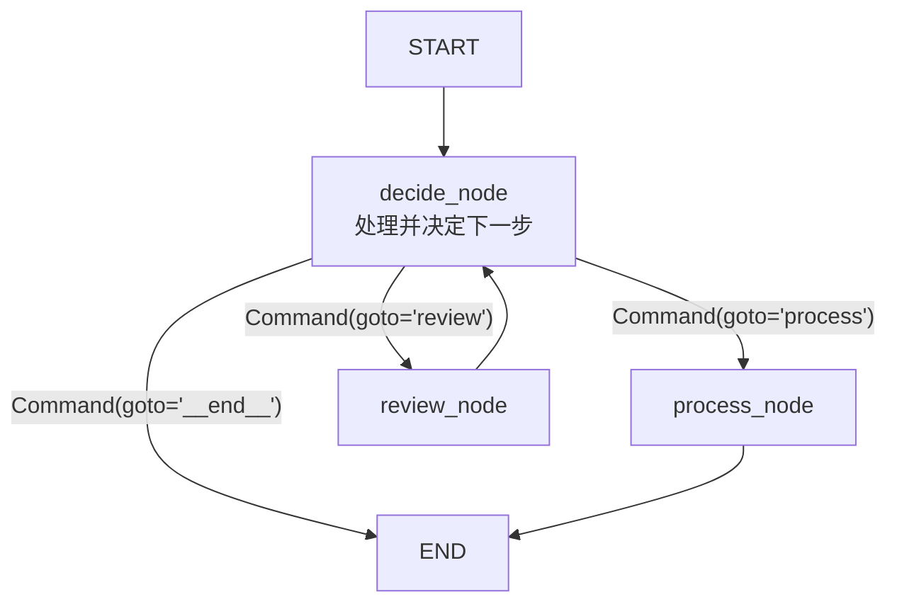

# 第8章 · 高级图模式 — 并行分支、子图与 Map-Reduce

> **时长**：约 3 小时 ｜ **难度**：⭐⭐⭐⭐ ｜ **类型**：讲解 + 动手
>
> **目标**：掌握动态并行（Send API）、Map-Reduce 模式、子图封装、Command 路由四大高级图模式，构建可扩展的复杂 Agent 应用

---

## 学习目标

学完本章后，你将能够：
- 理解静态并行和动态并行的区别，以及各自适用场景
- 使用 `Send` API 实现数据驱动的动态并行任务分发
- 构建完整的 Map-Reduce 模式：并行分发 → 并发执行 → 结果归约
- 用子图（Subgraph）封装可复用的独立工作流
- 配置父子图之间的状态映射（State Mapping）
- 用 `Command` 在节点内部直接控制路由，替代条件边
- 结合子图 + Send 实现并行子图执行
- 理解并行执行中的性能边界与调优策略

---

## 知识地图



---

## 1、静态并行与动态并行

### 1.1 静态并行（回顾）

在之前的章节中，我们见过这样的模式：



这是**静态并行**——编译时已知的并行结构。节点 B 和 C 在 A 完成后并行执行：

```python
builder.add_edge("analyze", "search")
builder.add_edge("analyze", "calculate")
builder.add_edge("search", "merge")
builder.add_edge("calculate", "merge")
```

**特点**：并行分支的数量、名称在编译时完全确定。无论运行时的输入是什么，始终是两个并行分支。

### 1.2 动态并行的需求

现在考虑这样的场景：用户上传一篇长文档，要求分析文档中的**每一章**。文档有 3 章还是 10 章，取决于用户输入——我们**编译时不知道**会有多少并行任务。

这就是动态并行的用武之地——并行分支的数量由**运行时数据**决定。

| 维度 | 静态并行 | 动态并行 |
|------|---------|---------|
| 分支数量 | 编译时已知 | 运行时决定 |
| 分支名称 | 固定节点名 | 同一节点多次执行 |
| 实现方式 | `add_edge` | `Send` API |
| 适用场景 | A/B 测试、并行工具调用 | 文档分析、批量处理、多轮搜索 |

---

## 2、Send API — 动态并行

### 2.1 核心概念

`Send` 是 LangGraph 提供的**动态边**机制。它从条件边中返回一组 `Send` 对象，每个 `Send` 对象代表一条到目标节点的动态边：

```python
from langgraph.types import Send
```

**工作原理**：

```
条件边（路由函数）
    │
    ├── Send("worker", {"item": "A"})  ──→  worker 节点（并行）
    ├── Send("worker", {"item": "B"})  ──→  worker 节点（并行）
    └── Send("worker", {"item": "C"})  ──→  worker 节点（并行）
                                              │
                                        所有 worker 完成后
                                              │
                                          fan-in 节点
```

**关键规则**：
- `Send` 必须从**条件边**（`add_conditional_edges`）的路由函数中返回
- 路由函数返回一个 `Send` 对象列表（普通条件边返回字符串节点名）
- `Send(node_name, arg)`：`node_name` 是目标节点，`arg` 是该节点的输入状态
- 每个 `Send` 独立成为一个执行分支，与同一列表中的其他 `Send` **并行执行**
- 图中其他节点执行完毕后，`Send` 分支的 worker 才会执行

### 2.2 Send 语法

```python
from langgraph.types import Send
from typing import Literal

def map_route(state: MainState) -> list[Send]:
    """路由函数：返回 Send 列表，每个 Send 启动一个并行 worker"""
    items = state["documents"]  # 运行时数据：文档列表
    return [
        Send("worker_node", {"chunk": doc})
        for doc in items
    ]
```

类比理解：
- **普通条件边**：`return "node_b"` — 去下一个节点
- **Send 边**：`return [Send("node_b", arg1), Send("node_b", arg2)]` — 去同一个节点多次，每次带不同参数

> 💡 `Send` 的名字来源于消息传递模型——每个 `Send` 对象就像一条"消息"，告诉 LangGraph 运行时："请用这个参数运行那个节点"。

### 2.3 完整示例：并行文档分析

```mermaid
graph TD
    START --> C["chunk_doc<br/>拆分文档"]
    C --> R{"router<br/>生成 Send 列表"}
    R -->|Send(chunk_1)| W1["worker<br/>分析段落 1"]
    R -->|Send(chunk_2)| W2["worker<br/>分析段落 2"]
    R -->|Send(chunk_3)| W3["worker<br/>分析段落 3"]
    R -->|Send(chunk_N)| WN["worker<br/>分析段落 N"]
    W1 --> M["merge_summaries<br/>合并摘要"]
    W2 --> M
    W3 --> M
    WN --> M
    M --> END
```

### ▶ 执行代码

```python
# 第8章代码 — parallel_doc_analysis.py
from typing_extensions import TypedDict, Annotated
from operator import add
from langgraph.graph import StateGraph, START, END
from langgraph.types import Send

# ── 定义状态 ──
class WorkerState(TypedDict):
    """每个 worker 接收的输入"""
    chunk: str          # 要分析的段落

class OverallState(TypedDict):
    """全局状态"""
    document: str                       # 原始文档
    chunks: list[str]                   # 拆分后的段落
    summaries: Annotated[list[str], add]  # 归约器：所有 worker 的结果追加合并
    final_summary: str                  # 最终合并摘要

# ── 节点函数 ──
def chunk_doc(state: OverallState) -> dict:
    """Step 1: 将文档拆分为段落"""
    doc = state["document"]
    # 按双换行拆分
    chunks = [c.strip() for c in doc.split("\n\n") if c.strip()]
    print(f"→ 拆分为 {len(chunks)} 个段落")
    return {"chunks": chunks}

def map_routes(state: OverallState) -> list[Send]:
    """Step 2: 条件边 — 为每个段落生成 Send"""
    return [
        Send("worker", {"chunk": chunk})
        for chunk in state["chunks"]
    ]

def worker(state: WorkerState) -> dict:
    """Step 3: 每个 worker 分析一个段落（并行执行）"""
    chunk = state["chunk"]
    # 实际项目中使用 LLM 分析
    summary = f"[摘要: {chunk[:30]}...]"
    print(f"  worker 分析: {chunk[:20]}... → {summary}")
    return {"summaries": [summary]}

def merge_summaries(state: OverallState) -> dict:
    """Step 4: 合并所有摘要（在所有 worker 完成后执行）"""
    joined = "\n".join(f"- {s}" for s in state["summaries"])
    return {"final_summary": f"## 合并摘要\n{joined}"}

# ── 构建图 ──
builder = StateGraph(OverallState)

builder.add_node("chunk_doc", chunk_doc)
builder.add_node("worker", worker)
builder.add_node("merge_summaries", merge_summaries)

builder.add_edge(START, "chunk_doc")
builder.add_conditional_edges("chunk_doc", map_routes)  # ← 返回 Send 列表
builder.add_edge("worker", "merge_summaries")            # ← 所有 worker 完成后自动 fan-in
builder.add_edge("merge_summaries", END)

graph = builder.compile()

# ── 执行 ──
result = graph.invoke({
    "document": "第一章：概述\n\n第二章：方法\n\n第三章：结果\n\n第四章：讨论"
})
print(result["final_summary"])
```

**输出示例**：
```
→ 拆分为 4 个段落
  worker 分析: 第一章：概述... → [摘要: 第一章：概述...]
  worker 分析: 第二章：方法... → [摘要: 第二章：方法...]
  worker 分析: 第三章：结果... → [摘要: 第三章：结果...]
  worker 分析: 第四章：讨论... → [摘要: 第四章：讨论...]
## 合并摘要
- [摘要: 第一章：概述...]
- [摘要: 第二章：方法...]
- [摘要: 第三章：结果...]
- [摘要: 第四章：讨论...]
```

### 2.4 Send 的语义细节

**输入参数**：`Send(node, arg)` 的 `arg` 必须与目标节点的 State 类型兼容。这里的 `WorkerState` 只包含 `chunk` 字段——但你可以传入 `OverallState` 的任何子集。

**并行语义**：所有通过 `Send` 启动的 worker 在同一超步中并行执行。LangGraph 会等待**所有** Send 分支完成后，才继续执行 worker 下游的节点（这里是 `merge_summaries`）。

**错误处理**：任何一个 worker 抛异常，整个图的执行都会失败。如果需要容错，在 worker 内部加 try/except。

> ⚠️ **重要**：Send 返回的列表不能为空！如果列表为空（没有段落需要分析），LangGraph 会报错。需要空列表时，用条件边分流：
>
> ```python
> def map_routes(state: OverallState):
>     if not state["chunks"]:
>         return [Send("noop", {})]  # 跳过一个空操作节点
>     return [Send("worker", {"chunk": c}) for c in state["chunks"]]
> ```

---

## 3、Map-Reduce 模式

### 3.1 模式解剖

Map-Reduce 是一种通用的**数据并行**模式，在 LangGraph 中自然映射为：

| 阶段 | 对应图形 | 实现方式 |
|------|---------|---------|
| **Map**（拆分） | 一个节点 + 条件边 | 节点拆分数据，条件边返回 `Send` 列表 |
| **Parallel**（并行处理） | 同一 worker 节点多次执行 | 每个 `Send` 启动一次 worker |
| **Reduce**（归约） | 归约器自动合并 | `Annotated[list, add]` 或自定义归约器 |
| **Fan-in**（收口） | worker 下游的节点 | `add_edge("worker", "merge_node")` |

### 3.2 完整的 Map-Reduce 模板

```python
from typing_extensions import TypedDict, Annotated
from operator import add
from langgraph.graph import StateGraph, START, END
from langgraph.types import Send

# ── 定义状态 ──
class WorkerInput(TypedDict):
    """单个 worker 的输入"""
    task_id: str
    data: str

class OverallState(TypedDict):
    inputs: list[str]                        # 待处理数据列表
    results: Annotated[list[str], add]       # 合并结果
    output: str                              # 最终输出

# ── 节点 ──
def map_node(state: OverallState) -> dict:
    """Map：准备数据，生成任务列表"""
    # 可能涉及数据预处理
    return {"inputs": state["inputs"]}

def dispatch(state: OverallState) -> list[Send]:
    """路由：为每个输入创建一个 worker"""
    return [Send("worker", {"task_id": f"task_{i}", "data": item})
            for i, item in enumerate(state["inputs"])]

def worker(state: WorkerInput) -> dict:
    """执行：处理单个数据项"""
    result = process(state["data"])  # 实际处理逻辑
    return {"results": [result]}

def reduce_node(state: OverallState) -> dict:
    """Reduce：整合所有结果"""
    return {"output": combine(state["results"])}

# ── 构建 ──
builder = StateGraph(OverallState)
builder.add_node("map", map_node)
builder.add_node("worker", worker)
builder.add_node("reduce", reduce_node)

builder.add_edge(START, "map")
builder.add_conditional_edges("map", dispatch)
builder.add_edge("worker", "reduce")  # 所有 worker 完成 → reduce
builder.add_edge("reduce", END)
```

### 3.3 实战：并行文档翻译

```python
class TranslationState(TypedDict):
    lines: list[str]
    translations: Annotated[list[str], add]
    full_translation: str

def split_lines(state: TranslationState) -> dict:
    """将文章按行拆分"""
    return {"lines": state["lines"]}

def route_lines(state: TranslationState) -> list[Send]:
    """每行一条翻译任务"""
    return [Send("translate_line", {"task_id": i, "data": line})
            for i, line in enumerate(state["lines"])]

def translate_line(state: WorkerInput) -> dict:
    """翻译单行（并行执行）"""
    # llm.invoke(f"将以下内容翻译为中文：{state['data']}")
    translated = f"[译文] {state['data']}"
    return {"translations": [translated]}

def combine_translations(state: TranslationState) -> dict:
    """按原始顺序拼接翻译结果"""
    return {"full_translation": "\n".join(state["translations"])}
```

> 💡 **归约器为何用 `add`？** 每个 worker 返回 `{"translations": [single_result]}`，所有 `[single_result]` 通过 `operator.add` 逐次拼接成完整列表。注意：由于并行执行，结果的**顺序不确定**！如果顺序重要，在 worker 中带上序号，在 reduce 阶段排序。

---

## 4、Send vs 静态并行：对比

| 对比维度 | 静态并行（add_edge） | 动态并行（Send） |
|---------|-------------------|----------------|
| **分支数量** | 固定（编译时已知） | 可变（运行时决定） |
| **目标节点** | 不同节点 | 同一节点的多次调用 |
| **代码结构** | 清晰的固定流程 | 灵活的数据驱动 |
| **可视化** | 图中可见所有分支 | 图中只有一条条件边 |
| **适用场景** | A/B 路由、并行工具调用 | 批量处理、多轮搜索 |
| **复杂度** | 低 | 中 |

**何时用 Send**：
- 任务数量取决于输入数据（批量处理）
- 运行时才能确定需要多少并行分支
- 需要为列表中的每个元素启动一个处理单元

**何时用静态并行**：
- 并行分支在架构上固定（比如同时搜索和计算）
- 不同分支执行不同的逻辑（需要不同节点名）
- 图的可视化很重要（静态并行在图中清晰可见）

---

## 5、子图（Subgraph）

### 5.1 为什么需要子图？

随着图变得复杂，把整个流程放在一个 StateGraph 中会导致：
- 状态庞大：所有节点共享一个 State 定义
- 难以复用：同样的流程需要在多个地方重建
- 命名冲突：节点名在全局唯一

**子图**是一个独立的 `StateGraph`，被编译后作为节点嵌入到父图中：

```python
# 创建子图
sub_builder = StateGraph(SubState)
# ... 添加节点和边 ...
subgraph = sub_builder.compile()

# 嵌入父图
parent_builder.add_node("sub_task", subgraph)
```

### 5.2 子图的状态映射

子图的核心机制是**状态映射**——父子图之间通过 State 字段的映射来通信：



```python
class ParentState(TypedDict):
    documents: list[str]
    results: Annotated[list[str], add]

class SubState(TypedDict):
    chunk: str          # 只关注一个段落
    summary: str        # 只输出分析结果

# 子图：处理单个段落
sub_builder = StateGraph(SubState)
sub_builder.add_node("analyze", analyze_node)
sub_builder.add_node("output", output_node)
sub_builder.add_edge(START, "analyze")
sub_builder.add_edge("analyze", "output")
sub_builder.add_edge("output", END)
subgraph = sub_builder.compile()

# 父图：嵌入子图
parent_builder = StateGraph(ParentState)
parent_builder.add_node("sub_task", subgraph)
# 状态映射在 add_node 中自动处理：
# - 父图传递给子图的字段 = SubState 中定义的字段
# - 子图返回的字段 = SubState 中定义的字段
```

### 5.3 子图 + Send：并行子图

这是最强大的组合——每个 Send 启动一个**子图实例**，实现**复杂的并行子工作流**：

```mermaid
graph TD
    START --> D["dispatch<br/>为每个文档创建 Send"]
    D -->|Send(doc_1)| SUB1["子图实例 1<br/>分析文档 1"]
    D -->|Send(doc_2)| SUB2["子图实例 2<br/>分析文档 2"]
    D -->|Send(doc_3)| SUB3["子图实例 3<br/>分析文档 3"]
    SUB1 --> M["merge<br/>合并结果"]
    SUB2 --> M
    SUB3 --> M
    M --> END

    subgraph SubDetail["子图内部"]
        S_START --> A["analyze_chunk"]
        A --> E["extract_key_points"]
        E --> R["rank_importance"]
        R --> S_END
    end
```

### ▶ 执行代码

```python
# ── 子图：采访一个分析师 ──
class InterviewState(TypedDict):
    """子图：采访状态"""
    topic: str                      # 采访主题
    question: str                   # 当前问题
    response: str                   # 分析师回答
    key_points: list[str]           # 提炼的观点

def ask_question(state: InterviewState) -> dict:
    """子图节点：提问"""
    return {"question": f"关于{state['topic']}，你的看法是？"}

def get_response(state: InterviewState) -> dict:
    """子图节点：获取回答"""
    response = f"[分析师]: {state['topic']}领域的最新进展是..."
    return {"response": response}

def extract_points(state: InterviewState) -> dict:
    """子图节点：提炼观点"""
    return {"key_points": [f"关键发现: {state['response'][:20]}..."]}

# 构建子图
interview_builder = StateGraph(InterviewState)
interview_builder.add_node("ask", ask_question)
interview_builder.add_node("respond", get_response)
interview_builder.add_node("extract", extract_points)
interview_builder.add_edge(START, "ask")
interview_builder.add_edge("ask", "respond")
interview_builder.add_edge("respond", "extract")
interview_builder.add_edge("extract", END)
interview_subgraph = interview_builder.compile()

# ── 父图：并行采访多个分析师 ──
class ResearchState(TypedDict):
    """父图状态"""
    topics: list[str]
    all_key_points: Annotated[list[list[str]], add]
    report: str

def dispatch_interviews(state: ResearchState) -> list[Send]:
    """为每个主题启动一个采访子图"""
    return [
        Send("interview_sub", {"topic": topic})
        for topic in state["topics"]
    ]

def compile_report(state: ResearchState) -> dict:
    """合并所有采访结果"""
    all_points = []
    for points in state["all_key_points"]:
        all_points.extend(points)
    return {"report": "研究报告中包含以下观点:\n" + "\n".join(f"- {p}" for p in all_points)}

# 父图
research_builder = StateGraph(ResearchState)
research_builder.add_node("interview_sub", interview_subgraph)
research_builder.add_node("compile", compile_report)
research_builder.add_conditional_edges(START, dispatch_interviews)
research_builder.add_edge("interview_sub", "compile")
research_builder.add_edge("compile", END)
research_graph = research_builder.compile()

# ── 执行 ──
result = research_graph.invoke({
    "topics": ["量子计算", "AI 安全", "生物科技"]
})
print(result["report"])
```

### 5.4 子图检查点

子图执行时的每一步都会创建**检查点（Checkpoint）**。这意味着：
- 父图的检查点包含所有活跃子图的检查点
- 子图内部的中断和恢复是独立的
- 每个子图实例有独立的执行追踪

```python
# 检查子图内部状态
for event in research_graph.stream({
    "topics": ["量子计算", "AI 安全"]
}):
    print(event)  # 会包含子图内部的每一步
```

### 5.5 子图最佳实践

| 场景 | 推荐 | 不推荐 |
|------|------|--------|
| 状态隔离 | 子图定义自己的 State | 子图直接使用父图的 State |
| 数据传递 | 明确的状态映射 | 通过闭包或全局变量传参 |
| 复用时 | 封装为独立子图 | 复制粘贴节点代码 |
| 复杂工作流 | 拆分为多个子图 | 一个巨大的 Flat Graph |

> 💡 **经验法则**：如果一段图逻辑可以被命名（"采访分析师"、"翻译文档"、"生成报告"），就应该封装为子图。

---

## 6、Command — 边自由路由

### 6.1 从条件边到 Command

回顾条件边的模式：路由函数返回下一个节点名，由 `add_conditional_edges` 决定走向。

```python
def router(state): ...
builder.add_conditional_edges("node_a", router, {"b": "b", "c": "c"})
```

`Command` 是一种更直接的方式——节点在执行完毕后，直接"命令"运行时下一步去哪里：

```python
from langgraph.types import Command

def my_node(state) -> Command:
    # 处理逻辑...
    if state["status"] == "ok":
        return Command(goto="next_node", update={"result": "success"})
    else:
        return Command(goto="retry_node", update={"retries": state["retries"] + 1})
```

### 6.2 基本用法



```python
from langgraph.types import Command
from typing import Literal

def decide_node(state) -> Command[Literal["process", "review", "__end__"]]:
    """节点执行完毕后，直接决定下一步"""
    intent = classify(state["input"])

    # 同时返回状态更新和路由
    if intent == "processable":
        return Command(
            goto="process",
            update={"status": "processing", "log": ["进入处理流程"]}
        )
    elif intent == "needs_review":
        return Command(
            goto="review",
            update={"status": "reviewing", "log": ["进入审核流程"]}
        )
    else:
        return Command(
            goto="__end__",
            update={"status": "done", "log": ["无需处理"]}
        )
```

### 6.3 何时用 Command？

**Command 更清晰**的场景：
- 节点需要同时更新状态和决定下一步
- 路由逻辑在节点内部自然属于节点职责
- 条件边太多，图变得难以阅读

**条件边更清晰**的场景：
- 路由逻辑与执行节点无关（纯状态驱动）
- 多个上游节点共享同一个路由逻辑
- 需要图的可视化展示路由逻辑

```python
# ── 反例：条件边分离了"在一起"的逻辑 ──
def process_node(state):
    ...  # 处理逻辑
    return {"status": "done", "items": [...]}

def route_after_process(state) -> str:
    if state["status"] == "done":
        return "next"
    return "fallback"

# ── 正例：Command 将处理 + 路由合为一体 ──
def process_node(state):
    ...  # 处理逻辑
    if success:
        return Command(goto="next", update={"items": result})
    return Command(goto="fallback", update={"error": str(e)})
```

### 6.4 Command + 子图

Command 在子图内部特别有用——子图可以根据中间结果**自主决定退出或继续**：

```python
def interview_loop(state) -> Command:
    """子图节点：根据回答决定是否继续追问"""
    if state["depth"] >= 3:
        return Command(goto="summarize", update={"done": True})
    if needs_followup(state["response"]):
        return Command(goto="ask_followup", update={"depth": state["depth"] + 1})
    return Command(goto="summarize", update={"done": True})
```

> 💡 **Command 的 trade-off**：它让节点更"胖"、边更"瘦"，图的静态结构变得不完整。如果团队需要可视化图来理解流程，优先用条件边。个人项目或小型图可以更自由地用 Command。

---

## 7、模式对比总结

| 模式 | 核心机制 | 并行方式 | 状态传递 | 适用场景 |
|------|---------|---------|---------|---------|
| **静态并行** | `add_edge` | 固定分支 | 共享 State + 归约器 | 固定流程的并行步骤 |
| **Send + Map-Reduce** | `Send` API | 数据驱动 | 归约器合并 | 批量数据处理 |
| **子图** | 独立 StateGraph | 嵌入节点 | 状态映射 | 封装可复用工作流 |
| **Command** | `Command(goto)` | 无（路由） | 路由+更新合一 | 节点内决策路由 |
| **子图+Send** | 子图作为 Send 目标 | 并行子工作流 | 双重映射 | 分布式分析/采访 |

---

## 8、性能考量

### 8.1 最大并行度

LangGraph 的并行受限于：
- **线程池/进程池大小**：默认并行度取决于运行时（同步为单线程，异步为 asyncio 事件循环）
- **API 限流**：如果每个 worker 调用 LLM API，并行数受 API Rate Limit 约束
- **内存**：每个 Send 分支都持有独立的 Worker State，并行数越多内存越高

### 8.2 递归限制

Send 创建的并行分支受到图的**递归限制**影响：

```python
graph = builder.compile()
graph.invoke(input, {"recursion_limit": 100})  # 默认 25
```

每个 Send 分支、子图内部的每一步都计入递归深度。对于大量并行任务，需要提高限制。

### 8.3 性能建议

| 实践 | 说明 |
|------|------|
| **限制并行数** | 用分批机制控制同时执行的 worker 数（如每次最多 10 个 Send） |
| **异步 worker** | 用 async worker 提高 I/O 密集型任务的吞吐 |
| **合理拆分粒度** | 粒度太小（每句话一个 worker）→ 通信开销超过计算收益 |
| **监控内存** | 大量并行分支积累中间结果，注意 State 大小 |

```python
# 分批：每次最多处理 5 个
def batched_dispatch(state) -> list[Send]:
    batch = state["inputs"][:5]
    return [Send("worker", {"data": item}) for item in batch]
```

---

## 常见踩坑

1. **Send 列表为空会报错**：当条件边返回空的 `[]` 时，LangGraph 会抛异常。务必保证至少一个 Send，或者在空列表时导向一个空操作节点
2. **忘记归约器**：Send 启动的多个 worker 会把结果写回同一 State 字段。不配归约器（如 `Annotated[list, add]`），只有最后一个 worker 的结果会保留
3. **子图状态映射遗漏**：子图只收到其 State 定义的字段。父图传给子图时，多余的字段会被丢弃；子图返回给父图时，同样只传递子图 State 中定义的字段
4. **Command 在条件边中无效**：`Command` 只能在节点函数的返回值中使用，不能在条件边的路由函数中使用。条件边的路由函数仍然返回字符串或 Send 列表
5. **递归限制耗尽**：Send + 子图嵌套时，递归深度快速增长。如果遇到 `GraphRecursionError`，先检查 `recursion_limit` 是否够用

---

## 课后练习

1. **构建关键词提取器**：用户输入一篇长文章，用 Send 将文章按句子拆分，每个 worker 并行提取一句话的关键词，最后合并所有关键词并去重（提示：用自定义归约器或 reduce 节点做去重）
2. **多轮搜索智能体**：设计一个子图"单轮搜索"，接收一个查询词，执行搜索并总结结果。然后在父图中用 Send 对多个查询词并行调用该子图，最后合并所有搜索结果
3. **Command 改写条件边**：回顾第 1 章的意图分类图，将 `classifier_node` + 条件边改写为用一个 `classify_and_route` 节点通过 `Command` 返回路由结果。比较两种实现的代码量和清晰度
4. **子图嵌套挑战**：构建一个三层嵌套的图——父图（研究项目）→ 子图（实验）→ 孙图（数据采集）。观察检查点结构，思考状态映射如何在多层间传递

---

## 本节小结

- ✅ 理解了静态并行（编译时固定分支）和动态并行（运行时数据驱动）的区别
- ✅ 掌握了 `Send` API 的核心用法——从条件边返回 `Send` 对象列表，每个 Send 启动一个并行 worker
- ✅ 能构建完整的 Map-Reduce 模式：Map 拆分任务 → Send 分发 → Worker 并行执行 → 归约器合并 → Fan-in 收口
- ✅ 学会了用子图封装可复用工作流，理解父子图之间的状态映射机制
- ✅ 掌握了子图 + Send 的组合用法：并行执行多个子图实例
- ✅ 理解了 `Command` 路由模式——在节点内部同时控制状态更新和路由
- ✅ 能根据场景选择合适的模式：静态并行、动态并行、子图、Command
- ✅ 理解了 Send 并行的性能边界和调优方法

---

> **下一章**：第9章 · 人机协作与中断控制 — 审批节点、动态断点与图内交互
