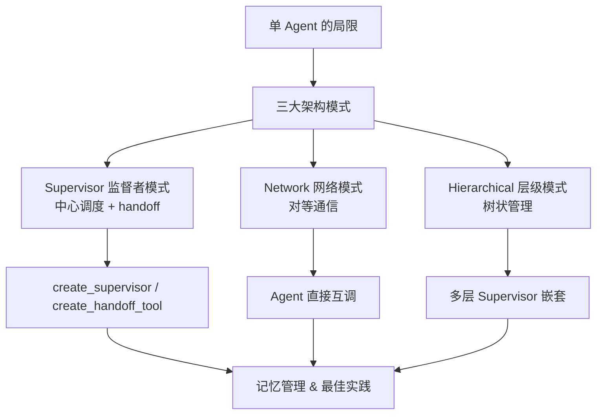
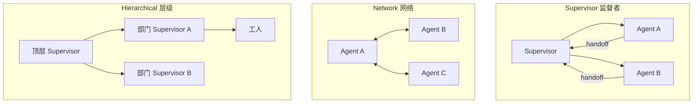
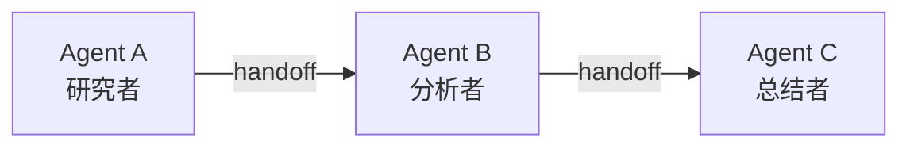
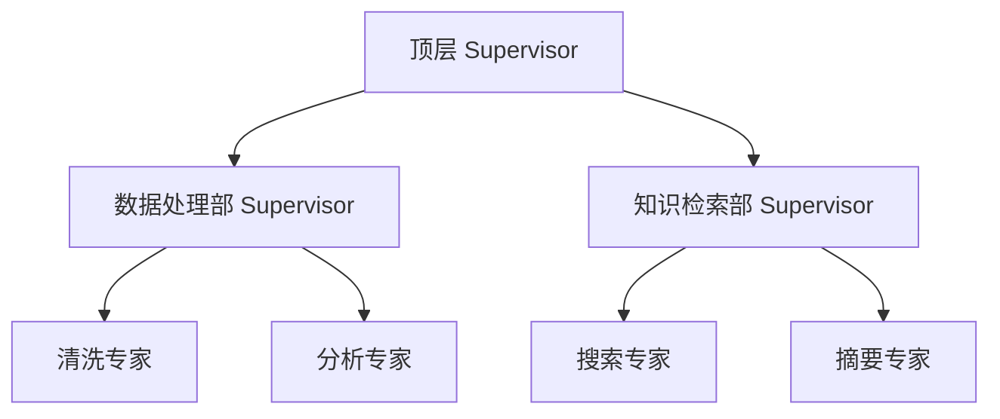
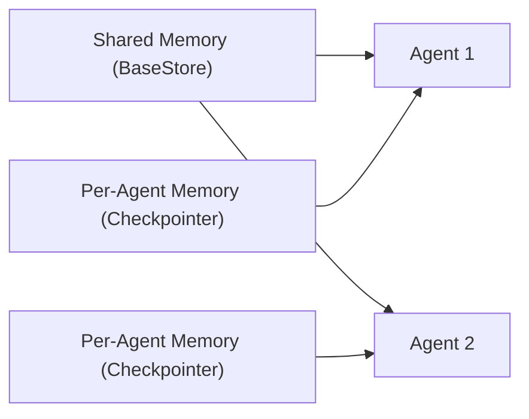

# 第9章 · 多智能体系统 — 监督者、交接与协作

> **时长**：约 3 小时 ｜ **难度**：⭐⭐⭐⭐ ｜ **类型**：项目实战
>
> **目标**：掌握 LangGraph 多智能体架构模式，熟练使用 Supervisor/Network/Hierarchical 三种编排方式构建多 Agent 协作系统

---

## 学习目标

学完本章后，你将能够：
- 理解单 Agent 的瓶颈与多 Agent 架构的核心价值
- 区分 Supervisor、Network、Hierarchical 三种编排模式及其适用场景
- 使用 `langgraph-supervisor` 包的 `create_supervisor()` 快速搭建监督者系统
- 掌握 `create_handoff_tool()` 的握手机制和状态传递原理
- 构建 Network 模式的直接通信多 Agent 系统
- 设计 Hierarchical 层级结构与跨层上下文管理
- 配置多 Agent 系统的共享记忆与独立记忆
- 应用多 Agent 最佳实践：角色边界、循环防护、监控追踪

---

## 知识地图



---

## 1、为什么需要多智能体？

### 1.1 单 Agent 的局限

| 瓶颈 | 具体问题 | 后果 |
|------|----------|------|
| **上下文窗口** | 工具描述 + 历史 + 提示争抢 Token | 长对话后 Agent "忘记" 指令 |
| **工具过载** | 50+ 工具塞给一个 LLM | 工具选择错误率急剧上升 |
| **能力冲突** | 同一模型既要写代码又要安全审核 | 指令冲突、行为不稳定 |

> **经验法则**：Agent 工具数超过 10 个，或需同时扮演多个专业角色时，考虑拆分为多 Agent 系统。

### 1.2 多 Agent 的优势

- **专业化**：每个 Agent 关注自己的领域，提示更短、更精准
- **并行化**：独立任务可同时执行，降低端到端延迟
- **鲁棒性**：单 Agent 出错不影响全局，Supervisor 可重新调度
- **可观测性**：每个 Agent 的输入输出清晰可追踪

### 1.3 何时用多 Agent？

| 场景 | 推荐 | 原因 |
|------|------|------|
| 工具 < 5 个，流程线性 | 单 Agent | 多 Agent 增加无意义复杂度 |
| 工具 10-20 个，角色单一 | 单 Agent + 优化提示 | 工具分组即可 |
| 工具 20+ 个，多角色 | 多 Agent（Supervisor） | 必须拆分工具和上下文 |
| 需要并行执行 | 多 Agent（Network） | 并行提升效率 |
| 团队规模大、层级多 | 多 Agent（Hierarchical） | 树状管理控制复杂度 |

---

## 2、三大架构模式总览



| 维度 | Supervisor | Network | Hierarchical |
|------|-----------|---------|-------------|
| **控制中心** | 中央调度 | 无中心 | 多层中心 |
| **复杂度** | 低～中 | 中 | 高 |
| **可扩展性** | 中（中心瓶颈） | 高 | 高（分层扩展） |
| **调试难度** | 低 | 高（消息流向复杂） | 中（层级追踪） |
| **典型场景** | 客服路由、代码审查 | 辩论、协作创作 | 企业自动化 |

---

## 3、Supervisor 监督者模式（重点）

### 3.1 工作原理

**一个中心 LLM 作为调度员，将任务分发给专业 Agent，再收回结果**：
```
用户请求 → Supervisor(决定谁来做) → math_expert(计算) → handoff → Supervisor(检查) → 返回用户
```

### 3.2 安装与核心 API

```powershell
pip install langgraph-supervisor
```

核心API：`create_supervisor(agents, llm, prompt)`、`create_handoff_tool(agent_name, ...)`、`create_react_agent(llm, tools, prompt)`

### 3.3 快速上手

```python
from langgraph_supervisor import create_supervisor
from langgraph.prebuilt import create_react_agent
from langchain_openai import ChatOpenAI
from langchain_core.tools import tool

@tool
def multiply(a: int, b: int) -> int:
    return a * b

@tool
def web_search(query: str) -> str:
    return f"关于 '{query}' 的搜索结果：模拟数据"

llm = ChatOpenAI(model="deepseek-chat")
math_agent = create_react_agent(
    llm, tools=[multiply],
    prompt="你负责数学计算。完成后通过 handoff 交还控制权。", name="math_expert",
)
search_agent = create_react_agent(
    llm, tools=[web_search],
    prompt="你负责网络搜索。完成后通过 handoff 交还控制权。", name="search_expert",
)
workflow = create_supervisor(
    [math_agent, search_agent], llm=llm,
    prompt="根据问题分派给 math_expert 或 search_expert。不要自己做专业工作。",
)
app = workflow.compile()
result = app.invoke({
    "messages": [{"role": "user", "content": "计算 123×456 并搜索 LangGraph"}]
})
print(result["messages"][-1].content)
```

### 3.4 create_handoff_tool() 握手机制

`create_supervisor()` 底层为每个工人 Agent 自动生成 handoff 工具。也可显式创建：

```python
from langgraph_supervisor import create_handoff_tool
handoff_back = create_handoff_tool(
    agent_name="supervisor", tool_name="handoff_to_supervisor",
    description="完成任务后将控制权交还给监督者。",
)
math_agent = create_react_agent(
    llm, tools=[multiply, handoff_back],
    prompt="数学专家。完成后调用 handoff_to_supervisor。",
)
```

**Handoff 内部机制**：
```
工人调用 handoff →
  1. 工人执行期间的消息合并到全局 State
  2. LangGraph 解析 Command(goto=supervisor, state_update={...})
  3. 下一超步切换到 Supervisor，携带工人结果上下文
```

> **关键**：Supervisor 能看到工人整个执行过程。`add_messages` 保证消息按 ID 正确合并。

### 3.5 完整案例：多专家研究助手

```python
from langgraph_supervisor import create_supervisor, create_handoff_tool
from langgraph.prebuilt import create_react_agent
from langgraph.checkpoint.memory import MemorySaver
from langchain_openai import ChatOpenAI
from langchain_core.tools import tool

@tool
def calculate(expr: str) -> str:
    try:
        return f"结果：{eval(expr, {'__builtins__': {}}, {})}"
    except Exception as e:
        return f"错误：{e}"

@tool
def get_weather(city: str) -> str:
    data = {"北京": "晴 25°C", "上海": "多云 28°C"}
    return data.get(city, f"无 {city} 的数据")

llm = ChatOpenAI(model="deepseek-chat")
handoff = create_handoff_tool(agent_name="supervisor", tool_name="handoff_back",
                              description="完成后回到监督者")
math_expert = create_react_agent(
    llm, tools=[calculate, handoff],
    prompt="数学专家。完成后调用 handoff_back。", name="math_expert",
)
weather_expert = create_react_agent(
    llm, tools=[get_weather, handoff],
    prompt="天气专家。完成后调用 handoff_back。", name="weather_expert",
)
workflow = create_supervisor(
    [math_expert, weather_expert], llm=llm,
    prompt="分派给 math_expert 或 weather_expert。不要自己做。",
)
app = workflow.compile(checkpointer=MemorySaver())
result = app.invoke(
    {"messages": [{"role": "user", "content": "北京天气？15×24 等于多少？"}]},
    {"configurable": {"thread_id": "test_001"}},
)
print(result["messages"][-1].content)
```

### 3.6 追踪 Agent 调用链

```python
for event in app.stream(
    {"messages": [{"role": "user", "content": "计算 25×4 并查天气"}]},
    {"configurable": {"thread_id": "trace_001"}},
):
    print(f"[{list(event.keys())[0]}] 执行中...")
```

---

## 4、Network 网络模式

### 4.1 对等通信

Agent 之间**直接通信**，无中央调度器：

适用场景：辩论/讨论、协作创作、分布式问题求解。

### 4.2 代码示例：双 Agent 辩论

```python
from langgraph.graph import StateGraph, END, START
from langgraph.prebuilt import create_react_agent
from langgraph_supervisor import create_handoff_tool
from langchain_openai import ChatOpenAI
from typing_extensions import TypedDict, Annotated
from langgraph.graph.message import add_messages

class DebateState(TypedDict):
    messages: Annotated[list, add_messages]
    round: int
    max_rounds: int

llm = ChatOpenAI(model="deepseek-chat")
handoff_con = create_handoff_tool(agent_name="con_side", tool_name="to_con",
                                   description="轮到反方时调用")
handoff_pro = create_handoff_tool(agent_name="pro_side", tool_name="to_pro",
                                   description="轮到正方时调用")
pro_agent = create_react_agent(
    llm, tools=[handoff_con],
    prompt="正方辩手。发言后调用 to_con 让反方发言。", name="pro_side",
)
con_agent = create_react_agent(
    llm, tools=[handoff_pro],
    prompt="反方辩手。发言后调用 to_pro 让正方发言。", name="con_side",
)
builder = StateGraph(DebateState)
builder.add_node("pro_side", pro_agent)
builder.add_node("con_side", con_agent)
builder.add_edge(START, "pro_side")
builder.add_conditional_edges("pro_side",
    lambda s: "con_side" if s["round"] < s["max_rounds"] else END)
builder.add_conditional_edges("con_side",
    lambda s: ({"round": s["round"] + 1}, "pro_side"))
app = builder.compile()
result = app.invoke({"messages": [], "round": 0, "max_rounds": 2})
```

> ⚠️ Network 模式务必设置轮次上限（`max_rounds`）或超时保护，避免无限循环。

---

## 5、Hierarchical 层级模式

### 5.1 树状管理

当 Agent 团队规模扩大时，单一 Supervisor 可能成为瓶颈：


### 5.2 代码示例

```python
cleaner = create_react_agent(llm, tools=[], prompt="数据清洗专家。", name="cleaner")
analyst = create_react_agent(llm, tools=[], prompt="数据分析专家。", name="analyst")
data_dept = create_supervisor(
    [cleaner, analyst], llm=llm,
    prompt="数据部门监督者，分派清洗和分析任务。", name="data_dept",
)
ceo = create_supervisor(
    [data_dept], llm=llm,
    prompt="顶层监督者。数据处理交给 data_dept。", name="ceo",
)
app = ceo.compile()
```

### 5.3 层级上下文管理

| 层级 | 上下文范围 | 策略 |
|------|-----------|------|
| 顶层 Supervisor | 完整需求 | 只传递子任务相关内容 |
| 部门 Supervisor | 本部门上下文 | 屏蔽无关信息 |
| 工人 Agent | 最小执行上下文 | 精确的任务描述 |

---

## 6、多 Agent 记忆管理



### 6.1 共享记忆

```python
from langgraph.store.memory import InMemoryStore
from langgraph.prebuilt import InjectedStore
from typing_extensions import Annotated

store = InMemoryStore()
store.put(namespace=("knowledge",), item_id="faq",
          value={"langgraph": "LangGraph 是图编排框架"})

@tool
def query_kb(topic: str, store: Annotated[InMemoryStore, InjectedStore]) -> str:
    items = store.search(namespace=("knowledge",))
    return str([item.value for item in items if topic in str(item.value)])
```

### 6.2 独立记忆

```python
from langgraph.checkpoint.memory import MemorySaver
agent = create_react_agent(llm, tools=[...], checkpointer=MemorySaver())
```

### 6.3 共享 vs 独立

| 信息类型 | 存储方式 | 示例 |
|----------|---------|------|
| 用户偏好 | BaseStore（全局） | 语言、风格 |
| 任务进度 | BaseStore（全局） | 完成度 |
| 专业成果 | State（handoff 携带） | 计算结果 |
| 对话历史 | Checkpointer（独立） | 上下文窗口 |

---

## 7、多 Agent 最佳实践

### 7.1 角色边界
```python
# 好的定义
prompt="你只负责数学计算。非数学问题请告知无法处理。"
# 坏的定义（模糊）
prompt="你是一个有帮助的助手，可以使用数学工具。"
```
### 7.2 避免无限循环
```python
class SafeState(TypedDict):
    handoff_count: int
def route_safe(state: SafeState) -> str:
    if state["handoff_count"] >= 10:
        return END
    return "next_agent"
# 或设置 recursion_limit: app.invoke(..., {"recursion_limit": 50})
```
### 7.3 工具可见性控制
| Agent | 可见工具 |
|-------|---------|
| Supervisor | Agent 的 handoff 入口（无需专业工具） |
| math_expert | 计算器、handoff |
| search_expert | 搜索、handoff |
### 7.4 监控追踪
```python
for event in app.stream(input_data):
    print(f"[{list(event.keys())[0]}] 执行中...")
# 生产环境用 LangSmith: export LANGCHAIN_TRACING_V2=true
```

---

## 常见踩坑

1. **Agent 忘记 handoff**：Worker 不调用 handoff 导致卡住。prompt 强调"完成后必须调用 handoff"，设超时兜底。
2. **Supervisor 自己干活**：跳过分发直接答。不给 Supervisor 配专业工具，prompt 明确"交给专业 Agent"。
3. **上下文爆炸**：handoff 携带全部历史致 Token 膨胀。用 `RemoveMessage` 裁剪，选择性传递。
4. **Network 死循环**：A 调 B 调 A。设 `max_rounds` 和 `recursion_limit`。
5. **层级命名冲突**：不同层级 Agent 同名致路由错误。用 `dept_role` 规范命名。

---

## 课后练习

1. **客服多 Agent 系统**：Supervisor 管理三个 Agent——订单查询、退换货、投诉，每个有独立工具。
2. **三 Agent 写作流水线**：Network 模式构建"构思 → 写作 → 审校"流水线，依次传递。
3. **层级 RAG 系统**：顶层 Supervisor 判断查询类型，分派给技术文档组或业务文档组 Supervisor。
4. **多 Agent 记忆实验**：用 `InMemoryStore` 实现跨 Agent 知识共享，math_expert 的结果可被 weather_expert 引用。

---

## 本节小结

- ✅ 理解了单 Agent 的三大局限和多 Agent 的三大优势
- ✅ 掌握了 Supervisor、Network、Hierarchical 三种架构模式
- ✅ 学会了 `create_supervisor()` 和 `create_handoff_tool()` 的使用
- ✅ 能构建 Network 模式直接通信系统并设置循环防护
- ✅ 掌握了层级结构和跨层上下文管理
- ✅ 理解了共享记忆与独立记忆在 multi-agent 中的分工
- ✅ 掌握了角色边界、循环防护、工具可见性、监控追踪等最佳实践

---

> **下一章**：第10章 · 生产化部署 — 持久化检查点、流式传输、人机交互与容错