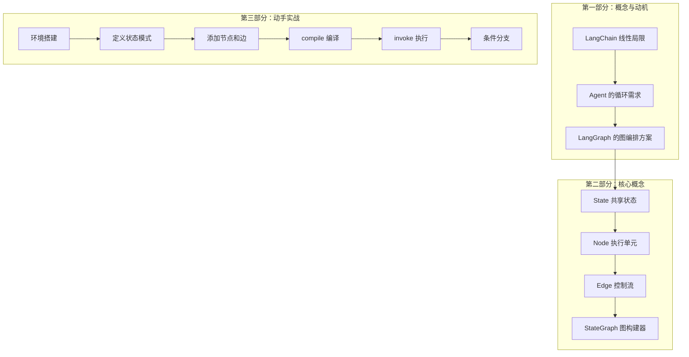
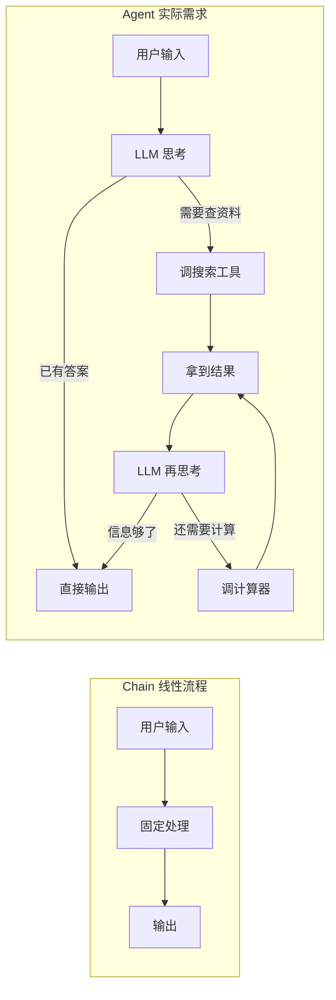
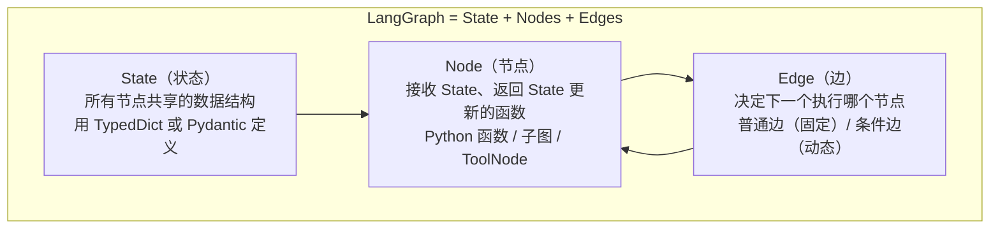
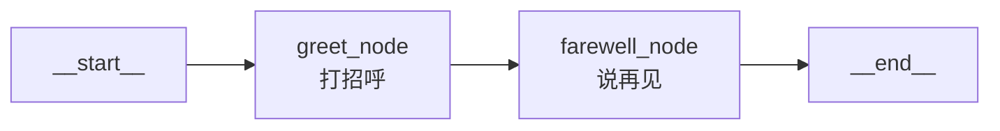
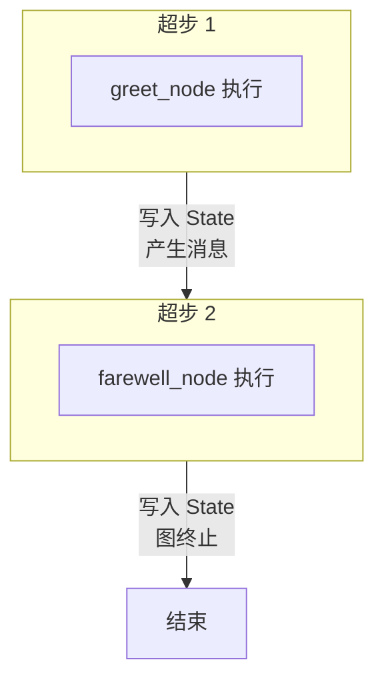
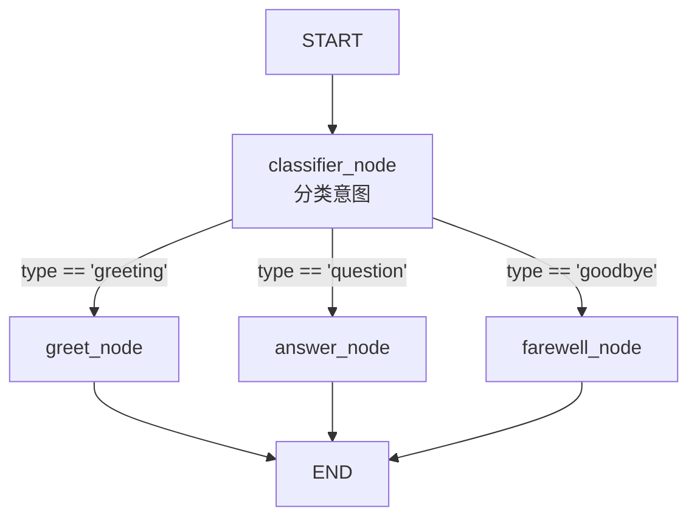
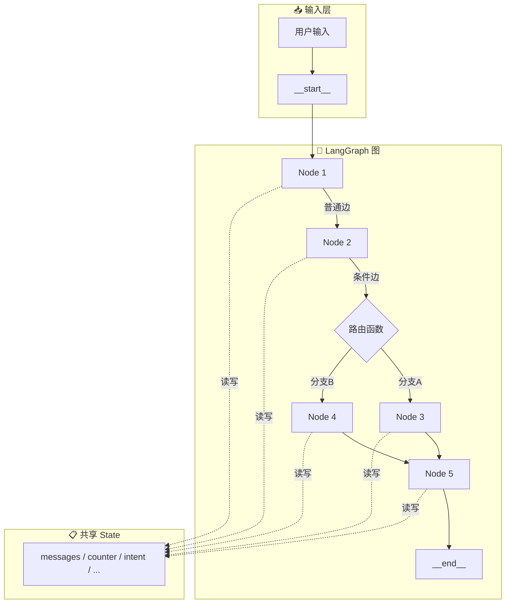

# 第1章 · LangGraph 快速上手 — 从线性链到有状态图

> **时长**：约 3 小时 ｜ **难度**：⭐⭐ ｜ **类型**：动手实操
>
> **目标**：理解 LangGraph 的核心价值，搭建环境，用 StateGraph 构建第一个有状态、可分支的 AI 应用

---

## 学习目标

学完本章后，你将能够：
- 理解 LangGraph 解决了 LangChain 的什么痛点
- 安装配置 LangGraph 开发环境
- 理解三大核心概念：State（状态）、Node（节点）、Edge（边）
- 用 `StateGraph` 构建包含条件分支的图
- 理解 `START` 和 `END` 虚拟节点的作用
- 用 `compile()` + `invoke()` 执行图并获取结果
- 区分 LangGraph 和 LangChain 的适用场景

---

## 知识地图



---

# 第一部分：概念与动机

## 1、LangChain 够用了吗？

LangChain 的核心抽象是 **Chain（链）**——将 Prompt、Model、Parser 等组件像水管一样串联起来：

```python
chain = prompt | model | parser  # A → B → C，单向流动
```

这在翻译、摘要、RAG 等**线性任务**中表现优秀。但 Agent 场景完全不同：



Agent 需要**循环、分支、回溯**——这是有向图（Digraph）的能力，不是链的能力。

**LangGraph 的定位**：LangGraph 之于 Agent，就像 React 之于前端——提供状态管理和组件化编排的底层运行时。

> **关键事实**：从 LangChain v1.0 开始，`create_agent` 底层就是用 LangGraph 实现的。你已经在用 LangGraph 了，只是还没有直接控制它。

---

## 2、LangGraph 核心三要素



| 要素 | 类比 | 职责 |
|------|------|------|
| **State** | 白板 | 节点间传递信息的共享数据结构 |
| **Node** | 工人 | 读取白板上的信息，处理后写回白板 |
| **Edge** | 流程箭头 | 根据白板内容决定下一个干活的是谁 |

**关键洞察**：LangGraph 的节点之间**不直接通信**——它们只读写共享的 State。这意味着节点是解耦的，可以独立开发、测试、替换。

---

# 第二部分：环境搭建

## 3、安装与配置

### 3.1 创建虚拟环境

```powershell
python --version  # 应 >= 3.10.0
python -m venv venv

# Windows 激活
venv\Scripts\activate
# macOS / Linux 激活
source venv/bin/activate
```

### 3.2 安装 LangGraph

```powershell
pip install langgraph langchain langchain-openai python-dotenv
# 后续章节按需补充：langgraph-checkpoint-sqlite langgraph-supervisor
```

### 3.3 验证安装

```powershell
python -c "import langgraph; print(f'LangGraph 安装成功')"
```

### 3.4 配置 API Key

在项目根目录创建 `.env`：

```ini
DEEPSEEK_API_KEY=YOUR_DEEPSEEK_API_KEY_HERE
DEEPSEEK_BASE_URL=https://api.deepseek.com
```

代码中读取：

```python
from dotenv import load_dotenv
load_dotenv()
```

---

# 第三部分：构建第一个 StateGraph

## 4、最简单的图：两个节点一条边

我们从最简单的图开始——两个节点、一条普通边、无分支。



### ▶ 执行代码

```powershell
cd code/01-快速上手-代码案例
python 01_first_graph.py
```

### 4.1 定义 State

State 是图中所有节点共享的数据结构。使用 `TypedDict` 定义：

```python
from typing_extensions import TypedDict

class MyState(TypedDict):
    messages: list      # 消息列表
    counter: int        # 计数器
```

### 4.2 定义 Node

Node 是普通的 Python 函数，接收当前 State，返回 State 的**部分更新**：

```python
def greet_node(state: MyState) -> dict:
    """第一个节点：打招呼"""
    name = state.get("name", "世界")
    return {
        "messages": [f"你好，{name}！"],
        "counter": state.get("counter", 0) + 1,
    }

def farewell_node(state: MyState) -> dict:
    """第二个节点：说再见"""
    return {
        "messages": state["messages"] + ["再见！"],
        "counter": state["counter"] + 1,
    }
```

> ⚠️ **关键规则**：Node 返回的 dict 是**部分更新**——你只需要返回想修改的字段。LangGraph 会自动将更新合并到 State 中。

### 4.3 构建图

```python
from langgraph.graph import StateGraph, START, END

# 创建图构建器，绑定 State 类型
builder = StateGraph(MyState)

# 添加节点
builder.add_node("greet", greet_node)
builder.add_node("farewell", farewell_node)

# 添加边：定义执行顺序
builder.add_edge(START, "greet")     # 从入口到 greet
builder.add_edge("greet", "farewell") # greet 完成后到 farewell
builder.add_edge("farewell", END)     # farewell 完成后结束

# 编译（验证图结构，生成可执行对象）
graph = builder.compile()
```

### 4.4 执行图

```python
# invoke：传入初始状态，返回最终状态
result = graph.invoke({"messages": [], "counter": 0})
print(result["messages"])  # ['你好，世界！', '再见！']
print(result["counter"])   # 2
```

---

## 5、理解执行模型：超步（Super-step）

LangGraph 的执行模型受 Google Pregel 启发，以**超步**为基本单位：



**关键规则**：
- 同一超步内的节点**并行执行**（如果它们之间没有依赖）
- 不同超步的节点**顺序执行**
- 每个超步结束时，LangGraph 自动创建检查点（checkpoint）
- 当所有节点都不活跃且无消息在传输时，图终止

在我们的简单图中，两个节点有先后依赖（通过边连接），所以它们分属两个超步，顺序执行。

---

## 6、添加条件分支

真正的 Agent 需要根据 State 内容**动态决定**下一步。这通过条件边实现。



### ▶ 执行代码

```powershell
cd code/01-快速上手-代码案例
python 02_conditional_graph.py
```

### 6.1 路由函数

条件边的核心是一个**路由函数**——它读取 State，返回下一个节点的名称：

```python
from typing import Literal

def route_by_intent(state: MyState) -> Literal["greet", "answer", "farewell"]:
    """根据意图分类结果，决定路由到哪个节点"""
    intent = state.get("intent", "greeting")
    if intent == "greeting":
        return "greet"
    elif intent == "question":
        return "answer"
    else:
        return "farewell"
```

> 💡 路由函数可以返回 `END`（字符串 `"__end__"`）来直接终止图。

### 6.2 添加条件边

```python
from langgraph.graph import StateGraph, START, END

class MyState(TypedDict):
    messages: list
    intent: str       # 新增：意图分类结果
    counter: int

builder = StateGraph(MyState)

# 添加节点
builder.add_node("classify", classify_node)  # 分类意图
builder.add_node("greet", greet_node)
builder.add_node("answer", answer_node)
builder.add_node("farewell", farewell_node)

# START → classify
builder.add_edge(START, "classify")

# 条件边：根据路由函数的结果选择下一个节点
builder.add_conditional_edges(
    "classify",          # 从哪个节点出发
    route_by_intent,     # 路由函数
    {                    # 路由映射（可选，用于可视化）
        "greet": "greet",
        "answer": "answer",
        "farewell": "farewell",
    }
)

# 三个分支都通向 END
builder.add_edge("greet", END)
builder.add_edge("answer", END)
builder.add_edge("farewell", END)

graph = builder.compile()
```

**执行测试**：

```python
# 测试不同的意图
print(graph.invoke({"intent": "greeting", "messages": [], "counter": 0})["messages"])
print(graph.invoke({"intent": "question", "messages": [], "counter": 0})["messages"])
print(graph.invoke({"intent": "goodbye", "messages": [], "counter": 0})["messages"])
```

---

## 7、在图中使用 LLM

现在加入真正的 LLM 节点，让图具备 AI 能力。

### ▶ 执行代码

```powershell
cd code/01-快速上手-代码案例
python 03_llm_graph.py
```

### 7.1 定义 LLM 节点

```python
from langchain_openai import ChatOpenAI
from langchain_core.messages import HumanMessage, AIMessage
from dotenv import load_dotenv

load_dotenv()

llm = ChatOpenAI(
    model="deepseek-chat",
    api_key="your-api-key",     # 实际应从环境变量读取
    base_url="https://api.deepseek.com",
)

class ChatState(TypedDict):
    messages: list          # 对话历史
    next_action: str        # 下一步行动

def chat_node(state: ChatState) -> dict:
    """LLM 对话节点"""
    response = llm.invoke(state["messages"])
    return {
        "messages": [response],  # 追加 AI 回复
    }

def classifier_node(state: ChatState) -> dict:
    """分类用户意图"""
    last_msg = state["messages"][-1]
    prompt = f"将以下用户消息分类为 greeting/question/goodbye，只输出一个词：\n{last_msg.content}"
    response = llm.invoke([HumanMessage(content=prompt)])
    return {
        "next_action": response.content.strip().lower(),
    }
```

### 7.2 完整的 LLM 对话图

```python
builder = StateGraph(ChatState)

builder.add_node("classify", classifier_node)
builder.add_node("greet", greet_node)
builder.add_node("answer", answer_node)
builder.add_node("farewell", farewell_node)

builder.add_edge(START, "classify")
builder.add_conditional_edges("classify", lambda s: s["next_action"], {
    "greeting": "greet",
    "question": "answer",
    "goodbye": "farewell",
})
builder.add_edge("greet", END)
builder.add_edge("answer", END)
builder.add_edge("farewell", END)

graph = builder.compile()
```

---

## 8、LangGraph vs LangChain：一张表说清楚

| 维度 | LangChain | LangGraph |
|------|-----------|-----------|
| **核心抽象** | Chain（链） | Graph（图） |
| **数据流** | 线性、单向 | 有环、多分支 |
| **状态管理** | 隐式（流经管道） | 显式（TypedDict/Pydantic 模式） |
| **执行模型** | 顺序执行 | 超步并行 |
| **适用场景** | 翻译、摘要、RAG | Agent、多步推理、人机协作 |
| **复杂度** | 低，上手快 | 中，需要理解图概念 |
| **关系** | 上层框架 | 底层运行时 |

**选择策略**：
- 任务能用 `A → B → C` 描述的 → 用 LangChain Chain（或 `create_agent` 一行搞定）
- 任务需要循环、分支、人工审批、多 Agent 协作 → 直接上 LangGraph

> 💡 **经验法则**：从 `create_agent` 开始。当你发现需要在中间插入人工审核、需要根据中间结果动态改变流程、或者需要多个 Agent 交接时，下降到 LangGraph 手动构建图。

---

## 组件全景图



---

## 常见踩坑

1. **忘记 compile()**：`StateGraph` 只是构建器，必须调用 `.compile()` 才能生成可执行的 `CompiledGraph`
2. **Node 返回格式错误**：Node 必须返回 `dict`，且 key 必须存在于 State 定义中
3. **路由函数返回未知节点**：条件边的路由函数返回值必须是已注册的节点名或 `END`
4. **混淆 START/END 和普通节点名**：`START` 和 `END` 是 LangGraph 的特殊常量，不要用字符串 `"start"` 代替
5. **State 字段更新语义**：默认情况下，同名 Key 的更新是**覆盖**（最后一个写入者胜出），列表需要显式拼接

---

## 课后练习

1. 修改第 4 节的图，添加第三个节点 `log_node`，在 greet 之前打印日志
2. 为路由函数增加 `"joke"` 意图，实现对应的 `joke_node`
3. 构建一个"计算器图"：用户输入表达式 → 分类为 math/translation/chat → 分别处理
4. 对比 `invoke()` 返回的最终 State 和中间过程，思考如何观察中间步骤（提示：`stream()`）

---

## 本节小结

- ✅ 理解了 LangGraph 解决的核心问题：Agent 需要循环和分支，Chain 做不到
- ✅ 掌握了三大核心概念：State（共享状态）、Node（执行单元）、Edge（控制流）
- ✅ 学会了用 `StateGraph` 构建图：`add_node` → `add_edge` / `add_conditional_edges` → `compile`
- ✅ 理解了 `START` 和 `END` 虚拟节点的作用
- ✅ 掌握了条件边的路由函数模式
- ✅ 能将 LLM 作为节点集成到图中
- ✅ 清楚了 LangChain 和 LangGraph 的分工与协作关系

---

> **下一章**：第2章 · StateGraph 核心深度 — 状态模式、归约器与节点高级配置
