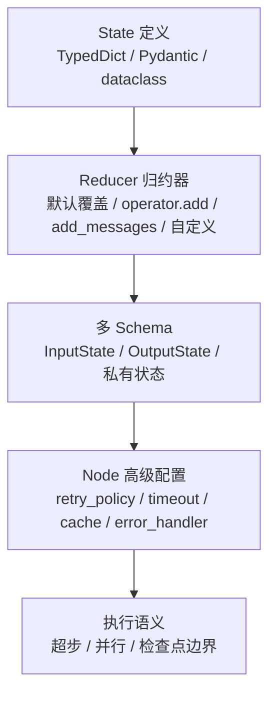
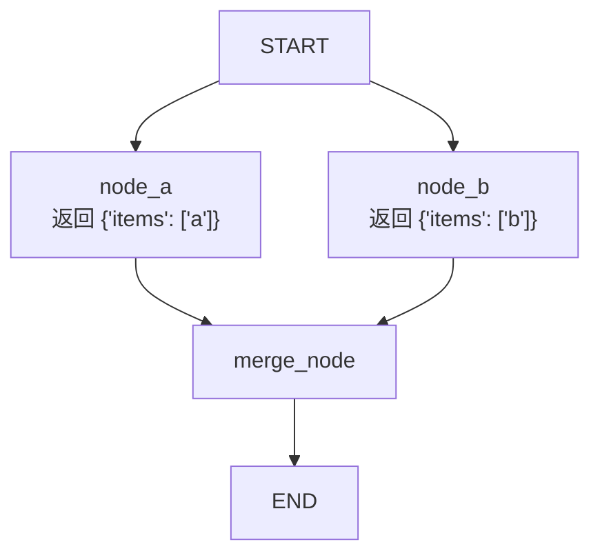
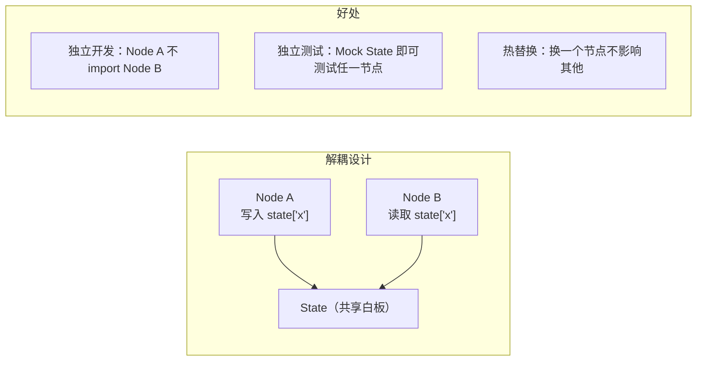
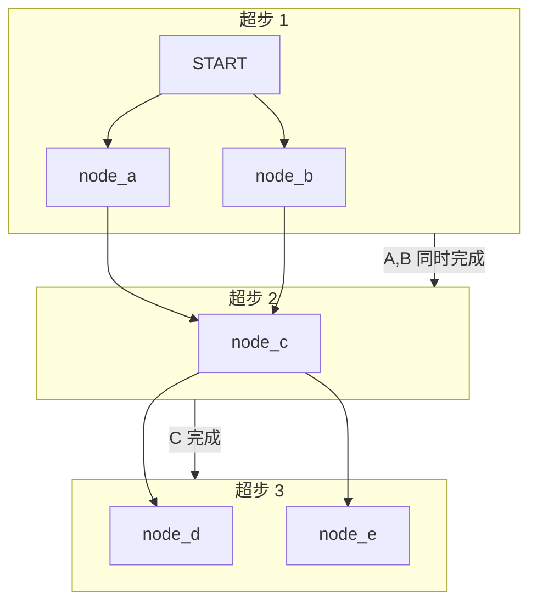

# 第2章 · StateGraph 核心深度 — 状态、归约器与节点通信

> **时长**：约 3 小时 ｜ **难度**：⭐⭐⭐ ｜ **类型**：讲解 + 动手
>
> **目标**：深入掌握 StateGraph 的状态管理机制——模式定义、归约器原理、多 Schema 隔离、节点高级配置

---

## 学习目标

学完本章后，你将能够：
- 用 TypedDict、Pydantic BaseModel、dataclass 三种方式定义 State
- 理解归约器（Reducer）原理并编写自定义归约器
- 掌握 `add_messages` 归约器的追加/去重/更新/删除机制
- 使用多 Schema 模式（InputState / OutputState / 私有状态）
- 配置节点的重试、超时、缓存策略
- 理解超步（Super-step）并行执行语义

---

## 知识地图



---

## 1、State 定义的三种方式

### 1.1 TypedDict（推荐，图内部使用）

`TypedDict` 是 LangGraph 最推荐的方式——零运行时开销，IDE 友好：

```python
from typing_extensions import TypedDict
from typing import Annotated

class AgentState(TypedDict):
    messages: list
    user_id: str
    retry_count: int
```

**优点**：轻量、类型检查、无额外依赖。
**缺点**：无运行时验证。

### 1.2 Pydantic BaseModel（图边界使用）

Pydantic 提供运行时验证和默认值，适合在图边界（接收外部输入、返回最终输出）使用：

```python
from pydantic import BaseModel, Field

class AgentState(BaseModel):
    messages: list = Field(default_factory=list)
    user_id: str = ""
    retry_count: int = 0
```

**优点**：运行时验证、默认值、JSON Schema 生成。
**缺点**：有性能开销，不适合高频内部传递。

### 1.3 dataclass（Python 标准库）

```python
from dataclasses import dataclass, field

@dataclass
class AgentState:
    messages: list = field(default_factory=list)
    user_id: str = ""
    retry_count: int = 0
```

**最佳实践**：图内部用 TypedDict，图边界用 Pydantic。本章后续示例均使用 TypedDict。

---

## 2、归约器（Reducer）—— 控制 State 如何更新

### 2.1 问题：两个节点同时修改同一个 Key

考虑这个图：



node_a 和 node_b 都在写 `items`。没有归约器时，LangGraph 怎么做？

**默认行为：覆盖（Overwrite）**——最后一个完成的节点胜出。这意味着数据可能丢失！

归约器就是**指定如何合并多个更新**的函数。

### 2.2 内置归约器

| 归约器 | 行为 | 适用场景 |
|--------|------|---------|
| 默认（无归约器） | 覆盖，最后写入者胜出 | 单值字段：temperature、user_id |
| `operator.add` | 列表拼接 | 简单列表追加（不关心顺序） |
| `add_messages` | 智能消息合并（按 ID 去重、更新、删除） | 对话消息管理（推荐） |

### ▶ 执行代码

```powershell
cd code/02-StateGraph深度-代码案例
python 01_reducers.py
```

### 2.3 operator.add 归约器

```python
from typing import Annotated
from operator import add

class State(TypedDict):
    # 无归约器：覆盖
    current_step: str

    # operator.add：两个列表拼接
    logs: Annotated[list, add]

# 使用示例
def node_a(state: State) -> dict:
    return {"current_step": "a", "logs": ["node_a 执行完成"]}

def node_b(state: State) -> dict:
    return {"current_step": "b", "logs": ["node_b 执行完成"]}

# 并行执行后，logs = ["node_a 执行完成", "node_b 执行完成"]（拼接）
# current_step = "b" 或 "a"（取决于谁最后完成，不确定！）
```

> ⚠️ `operator.add` 只做简单拼接。如果并行节点分别追加消息，消息顺序不确定。对话场景请用 `add_messages`。

### 2.4 add_messages —— 最强大的消息归约器

`add_messages` 是 LangGraph 为对话场景设计的专用归约器：

```python
from langgraph.graph.message import add_messages
from langchain_core.messages import HumanMessage, AIMessage, RemoveMessage

class State(TypedDict):
    messages: Annotated[list, add_messages]
```

**四种核心行为**：

```python
# 1. 追加新消息（无 ID 的消息）
state["messages"] = [HumanMessage(content="你好")]

# 2. 更新已有消息（相同 ID = 替换）
msg = AIMessage(content="...", id="msg_001")
state["messages"] = [AIMessage(content="新内容", id="msg_001")]  # 替换，不是追加

# 3. 删除指定消息
state["messages"] = [RemoveMessage(id="msg_001")]  # 从列表中移除

# 4. 清除所有消息
from langgraph.graph.message import REMOVE_ALL_MESSAGES
state["messages"] = [REMOVE_ALL_MESSAGES]
```

**内部机制**：`add_messages` 维护一个以消息 ID 为键的内部映射。追加时检查 ID——已存在则更新，不存在则追加，`RemoveMessage` 则删除。

### 2.5 自定义归约器

当内置归约器不满足需求时（例如：取最大值、合并 dict、选择非空值），写自定义归约器：

```python
def max_reducer(existing: int | None, new: int) -> int:
    """总是保留最大值（优先级递增）"""
    if existing is None:
        return new
    return max(existing, new)

def merge_dicts(existing: dict, new: dict) -> dict:
    """深度合并两个字典"""
    result = existing.copy()
    result.update(new)
    return result

class State(TypedDict):
    priority: Annotated[int, max_reducer]           # 取最大优先级
    metadata: Annotated[dict, merge_dicts]          # 合并元数据
    messages: Annotated[list, add_messages]         # 智能消息合并
    user_name: str                                  # 默认覆盖
```

归约器函数签名：`(existing_value, new_value) -> merged_value`

---

## 3、多 Schema 模式：输入、输出与私有状态

一个常见需求：不同节点需要不同的字段，但用户只应看到输入/输出字段。

```python
from typing_extensions import TypedDict

class InputState(TypedDict):
    """用户传入的字段"""
    question: str

class OutputState(TypedDict):
    """返回给用户的字段"""
    answer: str

class OverallState(InputState, OutputState):
    """图内部使用的完整状态（节点间传递）"""
    retrieved_docs: list
    reasoning_steps: list
```

### ▶ 执行代码

```powershell
cd code/02-StateGraph深度-代码案例
python 02_multi_schema.py
```

### 3.1 构建多 Schema 图

```python
from langgraph.graph import StateGraph, START, END

builder = StateGraph(
    OverallState,
    input_schema=InputState,    # 用户只需提供 question
    output_schema=OutputState,  # 用户只看到 answer
)

# 定义节点...
def retrieve_node(state: OverallState) -> dict:
    """检索相关文档（访问 OverallState 的所有字段）"""
    docs = search(state["question"])
    return {"retrieved_docs": docs}

def answer_node(state: OverallState) -> dict:
    """生成答案"""
    answer = llm.invoke(f"根据 {state['retrieved_docs']} 回答 {state['question']}")
    return {"answer": answer}

builder.add_node("retrieve", retrieve_node)
builder.add_node("answer", answer_node)
builder.add_edge(START, "retrieve")
builder.add_edge("retrieve", "answer")
builder.add_edge("answer", END)

graph = builder.compile()

# 用户调用时只需提供 input_schema 的字段
result = graph.invoke({"question": "什么是归约器？"})
print(result["answer"])  # 只有 OutputState 的字段返回给用户
# print(result["retrieved_docs"])  # 用户不可见！
```

**三层的职责**：

| Schema | 可见性 | 用途 |
|--------|--------|------|
| `InputState` | 用户 → 图 | 定义调用者必须传入的字段 |
| `OutputState` | 图 → 用户 | 定义返回给调用者的字段 |
| `OverallState` | 节点间 | 定义图中所有节点共享的内部字段 |

### 3.2 私有状态

在 OverallState 中定义但不在 InputState/OutputState 中的字段是**私有的**——仅在节点间传递，对外不可见。这保护了内部实现细节。

---

## 4、节点的对称性：State 即通信协议

LangGraph 的核心设计哲学：**节点之间不直接通信，只通过 State 读写**。



这意味着图的结构（边）定义的是**状态转换的先后顺序**，而非**节点间的依赖关系**。节点的唯一依赖是 State 的当前值。

---

## 5、节点高级配置

`add_node()` 支持丰富的运行时配置：

```python
from langgraph.types import RetryPolicy

builder.add_node(
    "critical_api_call",
    critical_node,
    retry_policy=RetryPolicy(
        max_attempts=3,
        initial_interval=0.5,   # 首次重试等待 0.5s
        backoff_factor=2.0,     # 指数退避：0.5 → 1.0 → 2.0
        jitter=True,            # 随机抖动避免惊群效应
    ),
    timeout=30,                 # 节点最多执行 30 秒
    cache_policy=True,          # 缓存该节点的输出（相同输入 → 直接返回缓存）
)
```

### 5.1 RetryPolicy 完整配置

```python
RetryPolicy(
    max_attempts=3,               # 最大尝试次数（含首次）
    initial_interval=0.5,         # 首次重试等待（秒）
    backoff_factor=2.0,           # 退避倍数
    max_interval=60.0,            # 最大重试间隔上限
    jitter=True,                  # 随机抖动
    retry_on=ConnectionError,     # 只对特定异常重试
    # retry_on=lambda e: isinstance(e, (TimeoutError, ConnectionError)),
)
```

### 5.2 TimeoutPolicy（仅异步节点）

```python
builder.add_node(
    "async_node",
    async_node_function,
    timeout=TimeoutPolicy(
        run_timeout=30,           # 壁钟超时：最多 30 秒
        idle_timeout=5,           # 空闲超时：5 秒无进度则终止
        refresh_on="heartbeat",   # 心跳刷新
    ),
)
```

### ▶ 执行代码

```powershell
cd code/02-StateGraph深度-代码案例
python 03_node_config.py
```

---

## 6、深入超步（Super-step）

### 6.1 并行执行判定

节点是否在同一超步并行执行，取决于**图结构**：



**判定规则**：
- 同一超步的节点 = 从同一组"前驱节点"出发、且彼此无直接依赖的节点
- A 和 B 都依赖 START → 同一超步，并行执行
- D 和 E 都依赖 C → 同一超步，并行执行
- A 依赖 START，C 依赖 A+B → 不同超步

### 6.2 并行写冲突与归约器

并行节点可能同时写入 State 的同一字段——这就是归约器存在的原因。没有归约器，结果是不确定的（取决于哪个节点先完成）。有归约器，LangGraph 在超步边界统一合并。

```
超步 N 执行：
  node_a 返回 {"items": ["a"], "score": 5}
  node_b 返回 {"items": ["b"], "score": 3}
→ 超步边界合并（使用归约器）：
  items = add_reducer(["a"], ["b"]) = ["a", "b"]
  score = 默认覆盖，取决于完成顺序（不确定！）
```

> ⚠️ **最佳实践**：可能被并行写入的字段，务必配置归约器。

---

## 常见踩坑

1. **并行写入不确定**：多个并行节点写同一字段但未配归约器 → 结果随机。凡是被并行访问的字段都配上归约器
2. **消息列表用 `operator.add` 而非 `add_messages`**：后者才能正确处理 ID 去重和更新
3. **Pydantic 默认值陷阱**：Pydantic model 的默认值在类定义时计算，可变默认值（如 `list`）会共享——用 `Field(default_factory=list)`
4. **忘记继承关系**：`OverallState` 必须继承 `InputState` 和 `OutputState`，否则字段不互通
5. **超步≠每节点一步**：不要假设每个节点独占一个超步，并行节点共享超步

---

## 课后练习

1. 实现一个 `keep_latest` 归约器：总是保留最新值，同时在 `history` 字段中追加旧值
2. 构建一个 RAG 图，使用 InputState/OutputState 隔离内部检索字段
3. 配置一个节点的重试策略，模拟 API 调用失败场景，验证重试和退避行为
4. 设计一个包含 3 个并行节点的图，观察哪些节点在同一超步执行，验证归约器的作用

---

## 本节小结

- ✅ 掌握了 TypedDict（推荐）、Pydantic（边界）、dataclass 三种 State 定义方式
- ✅ 理解了归约器的核心作用——在并行节点写入同一字段时安全合并
- ✅ 掌握了 `add_messages` 的追加/去重/更新/删除四种行为
- ✅ 学会了用多 Schema 模式隔离内部状态与对外接口
- ✅ 理解了节点间通过 State 解耦通信的设计哲学
- ✅ 能配置节点的重试、超时、缓存策略
- ✅ 理解了超步的并行执行语义和检查点边界

---

> **下一章**：第3章 · Agent 循环与 ReAct 模式 — 从零构建自主决策智能体
