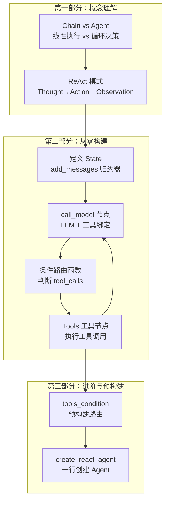
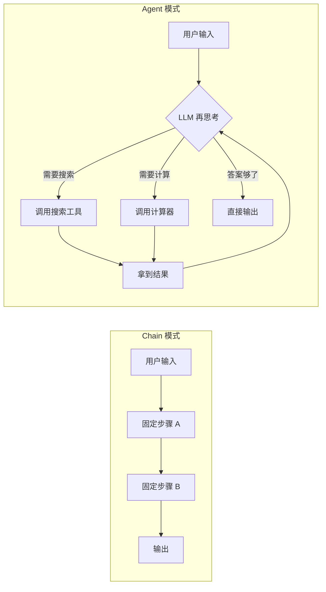
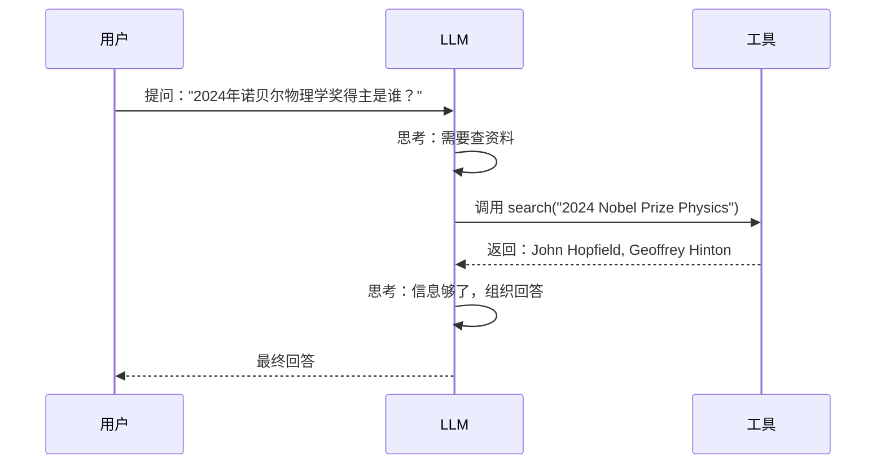
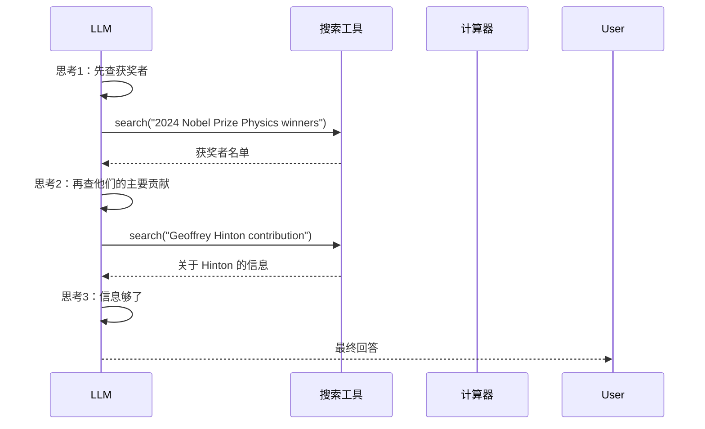
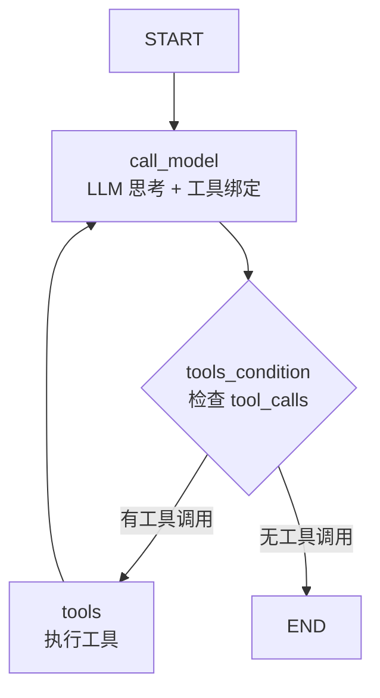
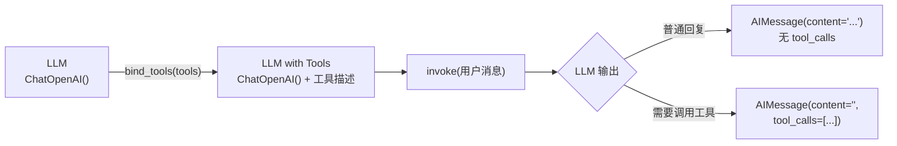
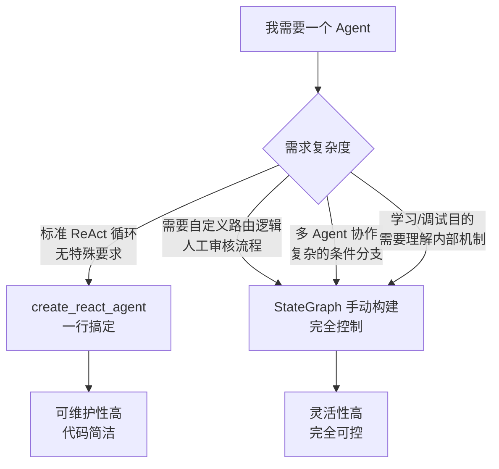
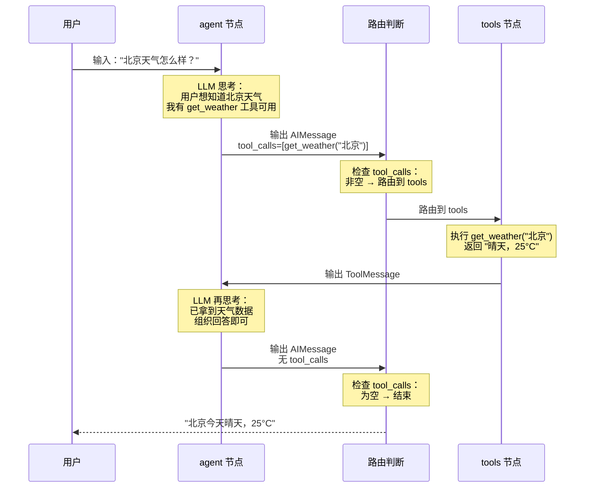
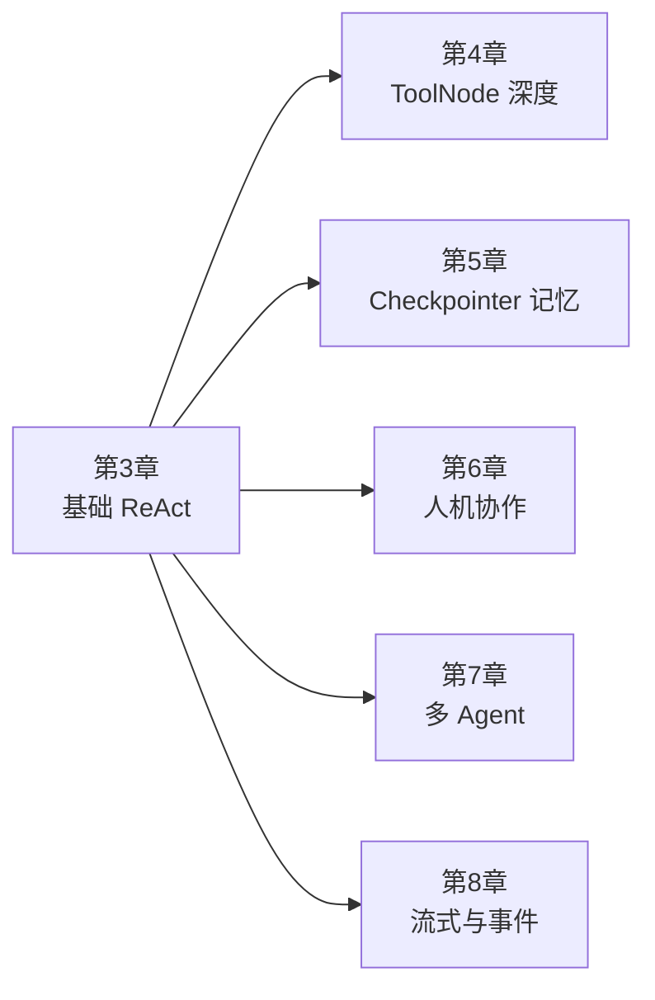

# 第3章 · Agent 循环与 ReAct 模式 — 从零构建自主决策智能体

> **时长**：约 2.5 小时 ｜ **难度**：⭐⭐⭐ ｜ **类型**：项目实战
>
> **目标**：理解 Agent 与 Chain 的本质区别，掌握 ReAct 循环模式，从零构建一个可自主决策、调用工具的智能体

---

## 学习目标

学完本章后，你将能够：
- 理解 Agent（智能体）与 Chain（链）的核心区别
- 掌握 ReAct 模式的「思考 → 行动 → 观察」循环原理
- 用 StateGraph 从零构建一个完整的 ReAct Agent
- 编写条件边（conditional edge）实现动态循环路由
- 使用 `tools_condition` 预构建路由函数简化代码
- 理解并区分 `create_react_agent` 与手动构建的适用场景
- 分步追踪 Agent 的执行过程，理解每次 LLM 调用和工具调用

---

## 知识地图



---

## 1、Agent vs Chain：智能体与链的本质区别

### 1.1 Chain 的局限

LangChain 的 Chain 模式本质是**固定的流水线**：

```python
chain = prompt | model | parser
# 每一步做什么、按什么顺序，在编译时就已经确定
```

Chain 适用于**确定路径**的任务：翻译、摘要、RAG 检索问答。输入进去，经过固定步骤，输出结果——中间没有决策点。

### 1.2 Agent 的本质

Agent 的核心特征是**自主决策**：

| 维度 | Chain（链） | Agent（智能体） |
|------|------------|----------------|
| **执行路径** | 编译时确定 | 运行时动态决定 |
| **工具调用** | 不需要 | 自主决定何时调用、调用哪个 |
| **循环次数** | 0（固定步数） | 根据上下文动态决定 |
| **状态感** | 无状态（数据流过） | 有状态（维护对话/推理上下文） |
| **决策能力** | 无 | 有（LLM 驱动决策） |
| **容错性** | 差（一步失败全链中断） | 好（可 retry、换工具、换策略） |



> **一句话总结**：Chain 是「执行方案」，Agent 是「制定并执行方案」。Agent 里的每一步都是 LLM「想」出来的。

---

## 2、ReAct 模式：思考 → 行动 → 观察

### 2.1 什么是 ReAct

ReAct（Reasoning + Acting）是当前绝大多数 Agent 系统的底层模式。它的核心思想是**交替进行推理和行动**：

```
循环：
  1. Thought（思考）：LLM 分析当前状态，决定下一步做什么
  2. Action（行动）：执行选定的工具（搜索、计算、查数据库……）
  3. Observation（观察）：将工具执行结果反馈给 LLM
  ⤴ 回到 Thought（继续思考）
  
  当 LLM 认为信息足够时 → 输出最终答案
```

### 2.2 完整的 ReAct 循环



当需要多次工具调用时，循环会扩展：



### 2.3 ReAct 的三种退出条件

| 条件 | 表现 | 原因 |
|------|------|------|
| **正常退出** | LLM 返回无 `tool_calls` 的纯文本回答 | LLM 认为信息已足够，直接作答 |
| **达到最大迭代** | LangGraph 抛出 `GraphRecursionError` | 防止无限循环，默认上限 25 步 |
| **工具执行错误** | Observation 中记录错误信息 | LLM 可据此决定重试或换工具 |

> ⚠️ **重要**：始终为生产环境的 Agent 设置 `recursion_limit`，防止 LLM 陷入死循环。设置方式：`graph.invoke(inputs, {"recursion_limit": 50})`。

---

## 3、从零构建 ReAct Agent

这是本章的核心。我们将用 StateGraph 完整构建一个支持 ReAct 循环的 Agent。

### 3.1 架构总览



### ▶ 执行代码

```powershell
cd code/03-Agent循环-代码案例
python 01_react_from_scratch.py
```

### 3.2 第一步：定义 State

Agent 的核心状态是**消息列表**——记录每次 LLM 思考和工具调用的结果：

```python
from typing import Annotated, TypedDict
from langgraph.graph.message import add_messages

class AgentState(TypedDict):
    """Agent 的共享状态"""
    messages: Annotated[list, add_messages]  # 使用 add_messages 归约器
```

> 💡 `add_messages` 归约器是 Agent 场景的关键——它能按消息 ID 去重、更新、追加，确保 LLM 调用和工具返回的消息正确合并到历史列表中。

### 3.3 第二步：定义工具

首先定义 Agent 可以调用的工具。用 `@tool` 装饰器把普通函数变成 LangChain 工具：

```python
from langchain_core.tools import tool

@tool
def get_weather(city: str) -> str:
    """查询指定城市的天气"""
    # 这里简化实现，实际场景应调用天气 API
    weather_data = {
        "北京": "晴天，25°C",
        "上海": "多云，28°C",
        "深圳": "雷阵雨，30°C",
    }
    return weather_data.get(city, f"未找到 {city} 的天气数据")

@tool
def calculate(expression: str) -> str:
    """执行数学计算，输入应为数学表达式"""
    try:
        result = eval(expression)
        return f"计算结果：{result}"
    except Exception as e:
        return f"计算错误：{e}"

# 收集工具列表
tools = [get_weather, calculate]
```

### 3.4 第三步：创建 call_model 节点

这是 Agent 的**大脑**节点——将工具绑定到 LLM，让 LLM 知道可以使用哪些工具：

```python
from langchain_openai import ChatOpenAI
from dotenv import load_dotenv

load_dotenv()

# 创建 LLM 并绑定工具
llm = ChatOpenAI(model="deepseek-chat")
llm_with_tools = llm.bind_tools(tools)

def call_model(state: AgentState) -> dict:
    """LLM 思考节点：接收当前消息，返回 AI 回复（可能含工具调用请求）"""
    system_prompt = (
        "你是助手，可以使用工具来回答用户问题。"
        "请根据用户的问题决定是否需要使用工具。"
    )
    messages = [{"role": "system", "content": system_prompt}] + state["messages"]
    response = llm_with_tools.invoke(messages)
    return {"messages": [response]}
```

**关键理解**：`bind_tools` 做了什么？



`bind_tools` 将工具函数的名称、描述、参数 Schema 注入到 LLM 的系统消息中。LLM 在推理时如果觉得需要调用工具，就会在输出中附带 `tool_calls` 字段。

### 3.5 第四步：创建工具执行节点

工具节点的职责：接收 LLM 发出的工具调用请求，执行对应的工具函数，返回结果：

```python
from langgraph.graph import StateGraph, START, END

def call_tools(state: AgentState) -> dict:
    """工具执行节点：执行所有挂起的工具调用，返回结果"""
    last_message = state["messages"][-1]
    tool_messages = []

    for tool_call in last_message.tool_calls:
        # 根据工具名称找到对应的工具函数
        tool_name = tool_call["name"]
        tool_args = tool_call["args"]
        tool_id = tool_call["id"]

        # 执行工具
        for tool in tools:
            if tool.name == tool_name:
                result = tool.invoke(tool_args)
                tool_messages.append({
                    "role": "tool",
                    "content": str(result),
                    "tool_call_id": tool_id,
                    "name": tool_name,
                })
                break

    return {"messages": tool_messages}
```

> ⚠️ **关键点**：`tool_call_id` 必须与 LLM 发起的 `tool_call.id` 一一对应。LangGraph 的 `add_messages` 归约器通过这个 ID 将工具结果与对应的工具调用请求关联起来。

### 3.6 第五步：编写条件路由函数

条件边是 Agent 循环的核心——决定是继续调用工具还是输出最终答案：

```python
from typing import Literal

def should_continue(state: AgentState) -> Literal["tools", "__end__"]:
    """路由函数：检查最后一条消息中是否有工具调用请求"""
    last_message = state["messages"][-1]

    # 如果 LLM 发起了工具调用 → 路由到 tools 节点
    if hasattr(last_message, "tool_calls") and last_message.tool_calls:
        return "tools"

    # 否则 → 结束（输出最终回答）
    return "__end__"
```

**路由逻辑非常简洁**：
- `AIMessage.tool_calls` 非空 → 还需要调用工具，继续循环
- `AIMessage.tool_calls` 为空 → LLM 直接回答了，循环结束

### 3.6 第六步：组装图

把所有节点和边连接起来：

```python
from langgraph.graph import StateGraph, START, END

# 创建构建器
builder = StateGraph(AgentState)

# 添加节点
builder.add_node("agent", call_model)   # LLM 思考节点
builder.add_node("tools", call_tools)   # 工具执行节点

# 添加边
builder.add_edge(START, "agent")                       # 入口 → agent

# 条件边：agent 完成后，根据 should_continue 路由
builder.add_conditional_edges(
    "agent",                    # 源节点
    should_continue,            # 路由函数
    {
        "tools": "tools",       # 有工具调用 → tools
        "__end__": END,         # 无工具调用 → 结束
    }
)

# tools 执行完成后回到 agent，让 LLM 再思考
builder.add_edge("tools", "agent")

# 编译
graph = builder.compile()
```

### 3.7 完整运行

```python
# 运行 Agent
inputs = {"messages": [{"role": "user", "content": "北京天气怎么样？"}]}
result = graph.invoke(inputs)
print(result["messages"][-1].content)

# 运行需要多步工具调用的场景
inputs = {"messages": [{"role": "user", "content": "上海和深圳哪个城市更热？"}]}
result = graph.invoke(inputs)
print(result["messages"][-1].content)
```

---

## 4、条件边深度解析：tools_condition 预构建函数

### 4.1 手动路由 vs 预构建路由

上一节我们手写了 `should_continue` 路由函数。LangGraph 提供了一个**预构建的等价实现**：

```python
from langgraph.prebuilt import tools_condition

# 完全等价于我们的 should_continue 函数
builder.add_conditional_edges("agent", tools_condition)
```

> 💡 `tools_condition` 是为单一 Agent 场景设计的便捷函数。它的逻辑和我们写的 `should_continue` 完全一样——检查最后一条消息中是否有 `tool_calls`，有则返回 `"tools"`，没有则返回 `"__end__"`。

### 4.2 使用 tools_condition 简化代码

使用预构建函数后，我们的图构建代码简化为：

```python
from langgraph.prebuilt import tools_condition

builder = StateGraph(AgentState)
builder.add_node("agent", call_model)
builder.add_node("tools", call_tools)

builder.add_edge(START, "agent")
builder.add_conditional_edges("agent", tools_condition)
builder.add_edge("tools", "agent")
```

### 4.3 tools_condition 的局限性

| 场景 | tools_condition | 手动路由 |
|------|----------------|---------|
| 标准单 Agent | ✅ 推荐使用 | ✅ 可以 |
| 多 Agent 路由 | ❌ 不够灵活 | ✅ 自定义逻辑 |
| 条件注入（如人工审核） | ❌ 不支持 | ✅ 完全可控 |
| 特殊退出条件 | ❌ 不支持 | ✅ 自定义条件 |

> ⚠️ **选择建议**：初学阶段先用手动路由，理解原理后再切换到 `tools_condition` 简化代码。生产环境中，如果只有标准 ReAct 循环，用预构建函数减少维护成本。

---

## 5、create_react_agent：一行创建 Agent

### 5.1 基础用法

LangGraph 在 `langgraph.prebuilt` 中提供了 `create_react_agent`，一行代码就能创建完整的 ReAct Agent：

```python
from langgraph.prebuilt import create_react_agent

# 一行创建 Agent
agent = create_react_agent(
    model=llm,          # 使用 bind_tools 后的 LLM
    tools=tools,        # 工具列表
)

# 执行
result = agent.invoke({"messages": [{"role": "user", "content": "北京天气如何？"}]})
```

> 🔧 注意：`create_react_agent` 内部也会创建 `agent` 和 `tools` 两个节点，和我们手动构建的结构完全一致。它是手写 ReAct 图的**语法糖**。

### 5.2 完整参数

```python
agent = create_react_agent(
    model=llm,                          # ChatModel 实例（无 bind_tools 也行，会自动绑定）
    tools=tools,                        # 工具列表或 ToolNode
    prompt="你是专业助手",               # 系统提示词（可选）
    state_schema=AgentState,            # 自定义状态模式（默认内置消息模式）
    checkpointer=checkpointer,          # 记忆/持久化（第5章详述）
    interrupt_before=["tools"],         # 在 tools 节点前暂停（第6章详述）
    interrupt_after=["tools"],          # 在 tools 节点后暂停
    name="my_agent",                    # 节点名称（用于多 Agent 场景）
)
```

### 5.3 使用示例

```python
from langgraph.prebuilt import create_react_agent
from langgraph.checkpoint.memory import MemorySaver

# 带记忆的 Agent
agent = create_react_agent(
    model=llm_with_tools,
    tools=tools,
    prompt="你是天气助手，只回答天气相关问题。",
    checkpointer=MemorySaver(),
)

# 第一次对话
result = agent.invoke(
    {"messages": [("user", "北京天气怎么样？")]},
    config={"configurable": {"thread_id": "thread_1"}},
)

# 第二次对话（Agent 能记住上下文）
result = agent.invoke(
    {"messages": [("user", "那上海呢？")]},
    config={"configurable": {"thread_id": "thread_1"}},
)
```

### 5.4 预构建 vs 手动构建：何时用哪个



### 5.5 关于 create_react_agent 的版本说明

> ⚠️ **注意**：`create_react_agent` 在 LangChain v1 系列中仍被广泛使用。LangGraph 社区有提案将其统一为 `create_agent`，但截至目前（2026 年中），`create_react_agent` 仍然是主要的函数名。无论名称如何变化，底层的 ReAct 循环机制完全一致——你从本章学到的手动构建知识将永远适用。

---

## 6、追踪 Agent 执行过程

理解 Agent 在每步做什么，是调试和优化的基础。

### 6.1 使用 stream 观察每一步

```python
# 使用 stream 逐帧执行
inputs = {"messages": [{"role": "user", "content": "计算 3.14 * 5^2，然后告诉我北京天气"}]}

for event in graph.stream(inputs):
    for node_name, value in event.items():
        print(f"\n{'='*50}")
        print(f"节点：{node_name}")
        print(f"{'='*50}")
        if isinstance(value, dict) and "messages" in value:
            msg = value["messages"][-1]
            if hasattr(msg, "tool_calls") and msg.tool_calls:
                print(f"LLM 思考：需要调用工具")
                for tc in msg.tool_calls:
                    print(f"  工具：{tc['name']}({tc['args']})")
            else:
                print(f"LLM 回复：{msg.content[:200]}")
```

### 6.2 分步骤执行流程

以「北京天气怎么样？」为例，Agent 的完整执行流程如下：



### 6.3 实际调试技巧

```python
# 方法1：使用 stream 查看中间状态
for step in graph.stream(inputs):
    print(step)  # 打印每个超步的完整状态

# 方法2：设置 GraphRecursionError 保护
try:
    result = graph.invoke(inputs, {"recursion_limit": 20})
except Exception as e:
    print(f"Agent 超出最大迭代次数：{e}")

# 方法3：使用 get_state 查看特定检查点（需配置 checkpointer）
from langgraph.checkpoint.memory import MemorySaver

graph = builder.compile(checkpointer=MemorySaver())
result = graph.invoke(inputs, config={"configurable": {"thread_id": "test_1"}})
state = graph.get_state(config={"configurable": {"thread_id": "test_1"}})
print(state.values["messages"])  # 查看所有历史消息
```

---

## 7、Agent 的扩展方向

本章构建的是**最基本的单 Agent ReAct 循环**。后续章节会在其基础上扩展：

| 扩展方向 | 内容 | 对应章节 |
|---------|------|---------|
| **工具增强** | ToolNode 深度、工具错误处理、并行工具调用 | 第4章 |
| **记忆持久化** | Checkpointer、对话历史、长期记忆 | 第5章 |
| **人机协作** | Interrupt、human-in-the-loop 审批流程 | 第6章 |
| **多 Agent 系统** | Supervisor Agent、Agent 团队协作 | 第7章 |
| **流式输出** | 实时流式显示 LLM 思考和工具调用过程 | 第8章 |



---

## 常见踩坑

1. **忘记 `bind_tools`**：LLM 默认不知道任何工具的存在。如果没有调用 `bind_tools(tools)`，LLM 永远不会产生 `tool_calls`，Agent 会以 LLM 普通回复结束——Agent 看起来在工作，但实际上从未调用工具。

2. **`tool_call_id` 不匹配**：工具返回的 `ToolMessage` 必须有正确的 `tool_call_id` 来关联 LLM 发起的工具调用。ID 不匹配会导致 `add_messages` 归约器无法正确关联消息，可能引发重复调用或状态错乱。

3. **Agent 无限循环**：LLM 在某些情况下会不断调用工具而不给出最终答案。始终设置 `recursion_limit`（图级别的限制）来防止无限循环：`graph.invoke(inputs, {"recursion_limit": 25})`。

4. **工具名冲突**：两个工具函数如果同名（包括通过 `name` 参数自定义名称），LangGraph 会抛出异常。确保工具名称唯一，特别是使用 `functools.partial` 或 lambda 包装时。

5. **混淆 `create_react_agent` 的 `model` 参数**：`create_react_agent` 的 `model` 参数可以传入**未** `bind_tools` 的 LLM——函数内部会自动绑定。但如果提前 `bind_tools` 了，注意不要重复传递冲突的工具列表。

---

## 课后练习

1. **添加计算器工具**：为本章的 Agent 添加一个 `calculate` 工具（支持加减乘除），测试「先查询数据再计算结果」的多步场景（例如：「计算上海和北京的温度差」）。

2. **自定义路由条件**：修改 `should_continue` 函数，添加最大工具调用次数限制——当工具调用超过 3 次时强制结束并返回当前状态。

3. **对比实验**：用 `create_react_agent` 重新实现本章的 Agent，对比手写版和预构建版的代码长度和执行结果，总结各自的优缺点。

4. **流式观察**：使用 `graph.stream()` 方法观察一个多步 Agent 调用的完整执行过程，绘制出实际执行路径图（提示：记录每个 event 的 `node_name` 和 `tool_calls` 情况）。

---

## 本节小结

- ✅ 理解了 Agent 与 Chain 的本质区别：Chain 是固定路径，Agent 是动态循环决策
- ✅ 掌握了 ReAct 模式的三步循环：Thought（思考）→ Action（行动）→ Observation（观察）
- ✅ 从零用 StateGraph 构建了完整的 ReAct Agent：State → call_model → 条件路由 → tools → 循环
- ✅ 掌握了 `tools_condition` 预构建路由函数和手动路由函数的等价关系
- ✅ 理解了 `bind_tools` 如何让 LLM 「知道」工具的存在并自主决定调用
- ✅ 学会了使用 `create_react_agent` 一行创建 Agent，以及何时选择手写构建
- ✅ 掌握了用 `stream()` 等方法追踪 Agent 的每一步执行过程

---

> **下一章**：第4章 · 工具与 ToolNode 深度 — ToolNode、工具调用分发、错误处理与 ToolKind 全解析
