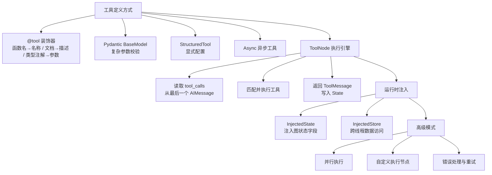
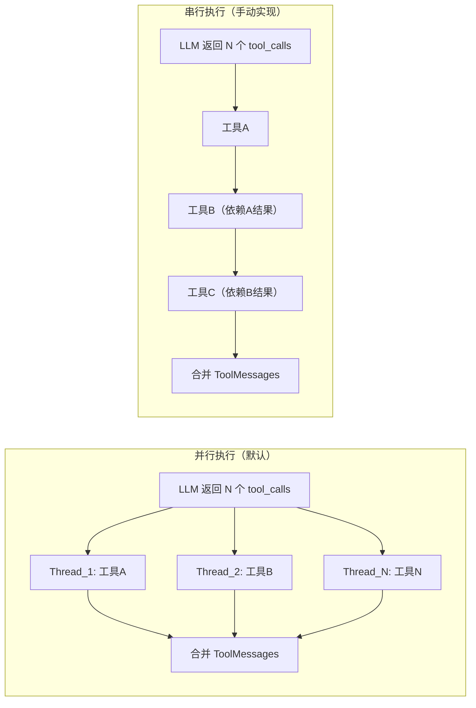

# 第4章 · 工具与 ToolNode 深度 — 让 Agent 精确使用外部能力

> **时长**：约 2.5 小时 ｜ **难度**：⭐⭐⭐ ｜ **类型**：项目实战
>
> **目标**：深入掌握 LangGraph 的工具定义体系与 ToolNode 执行引擎——从函数装饰器到 Pydantic 模型，从并行执行到运行时注入，从错误处理到自定义执行逻辑

---

## 学习目标

学完本章后，你将能够：
- 用 `@tool` 装饰器、Pydantic BaseModel、StructuredTool 三种方式定义工具
- 理解 `@tool` 如何将函数签名映射为 LLM 的工具 Schema
- 掌握 ToolNode 的执行机制：消息读取、工具匹配、并行调用、结果回写
- 使用 `InjectedState` 和 `InjectedStore` 在运行时注入图状态而无需暴露给 LLM
- 处理工具并行执行中的错误隔离与传播
- 构建自定义工具执行节点实现预处理/后处理逻辑

---

## 知识地图



---

## 1、工具定义的三种方式

工具是 Agent 与外部世界交互的桥梁。在 LangGraph 中，工具本质上是一个**函数 + 元数据**——函数体是执行逻辑，元数据（名称、描述、参数 Schema）被送入 LLM，让 LLM 知道何时调用以及传什么参数。

### 1.1 `@tool` 装饰器（最常用）

`@tool` 是 LangChain/LangGraph 最简洁的工具定义方式。它将一个普通 Python 函数转换为 `BaseTool` 实例，**自动从函数签名提取 LLM 所需的参数 Schema**：

```python
from langchain_core.tools import tool

@tool
def search_knowledge_base(query: str, max_results: int = 5) -> str:
    """搜索知识库获取相关信息。当需要查找文档或技术资料时使用。

    Args:
        query: 搜索关键词
        max_results: 最大返回结果数，默认5
    """
    # 实际的搜索逻辑...
    results = execute_search(query, limit=max_results)
    return format_results(results)
```

**映射规则**：

| 函数元素 | LLM Schema 映射 | 说明 |
|---------|----------------|------|
| 函数名 `search_knowledge_base` | `tool.name` | LLM 用此名调用工具 |
| 文档字符串 | `tool.description` | LLM 判断何时使用的依据 |
| 参数类型注解 `str` / `int` | 生成 `type` 字段 | 约束参数类型 |
| 默认值 `max_results: int = 5` | 标记为 `optional` | 从签名自动推导 |

> **关键洞察**：LLM 看到的工具描述全部来自你的代码——函数名决定了调用方式，文档字符串决定了调用时机。写清晰的名字和文档，比写好的提示词更重要。

**生成的工具 Schema（LLM 实际看到的内容）：**

```json
{
  "type": "function",
  "function": {
    "name": "search_knowledge_base",
    "description": "搜索知识库获取相关信息。当需要查找文档或技术资料时使用。",
    "parameters": {
      "type": "object",
      "properties": {
        "query": {"type": "string", "description": "搜索关键词"},
        "max_results": {"type": "integer", "description": "最大返回结果数，默认5"}
      },
      "required": ["query"]
    }
  }
}
```

### 1.2 Pydantic BaseModel 工具（精准参数校验）

当工具参数结构复杂（嵌套对象、枚举约束、正则校验）时，`@tool` 的自动推导不够用。此时用 **BaseModel 作为参数 Schema**，再通过 `BaseTool.from_function` 或 `create_tool_from_pydantic` 构建工具：

```python
from pydantic import BaseModel, Field
from langchain_core.tools import BaseTool

# 1. 定义参数模型
class FlightSearchInput(BaseModel):
    origin: str = Field(description="出发城市代码，如 PEK")
    destination: str = Field(description="到达城市代码")
    date: str = Field(description="出发日期，YYYY-MM-DD 格式")
    cabin_class: str = Field(
        default="economy",
        description="舱位等级",
        pattern="^(economy|business|first)$"  # 正则约束
    )

# 2. 实现工具
def search_flights(origin: str, destination: str, date: str, cabin_class: str = "economy") -> str:
    # 实际的航班搜索逻辑
    return f"找到 {origin}→{destination} 在 {date} 的 {cabin_class} 航班..."

# 3. 绑定 Pydantic Schema
from langchain_core.utils.function_calling import convert_pydantic_to_openai_function
flight_tool = BaseTool.from_function(
    name="search_flights",
    description="搜索航班信息，需要出发地、目的地和日期",
    func=search_flights,
    args_schema=FlightSearchInput,
)
```

**对比**：`@tool` 适合 80% 的简单工具；Pydantic 模型适合需要正则验证、枚举值、嵌套结构的复杂工具。

### 1.3 StructuredTool（显式配置）

`StructuredTool` 提供了最显式的工具定义方式——所有字段都手写，没有自动推导：

```python
from langchain_core.tools import StructuredTool

def calculate_loan(principal: float, rate: float, months: int) -> str:
    """计算每月还款额"""
    monthly_rate = rate / 12 / 100
    payment = principal * monthly_rate * (1 + monthly_rate) ** months / \
              ((1 + monthly_rate) ** months - 1)
    return f"每月还款：¥{payment:.2f}"

loan_tool = StructuredTool.from_function(
    func=calculate_loan,
    name="calculate_loan_payment",
    description="计算贷款每月还款额",
    # 手动指定参数 Schema
    args_schema={
        "principal": {"type": "number", "description": "贷款本金"},
        "rate": {"type": "number", "description": "年利率(%)"},
        "months": {"type": "integer", "description": "还款月数"},
    },
    return_direct=False,  # 返回结果是否直接输出给用户（跳过 LLM）
)
```

> **何时用**：需要精细控制工具行为（如 `return_direct`、自定义错误处理）时。

### 1.4 异步工具

异步工具用 `async def` 定义——ToolNode 会自动检测并 `await`：

```python
from langchain_core.tools import tool
import asyncio

@tool
async def fetch_weather(city: str) -> str:
    """异步获取城市天气"""
    await asyncio.sleep(0.5)  # 模拟 IO 操作
    return f"{city}：晴，25°C"

# 等价于同步 + coroutine 参数
from langchain_core.tools import StructuredTool

async def _fetch_weather_impl(city: str) -> str:
    await asyncio.sleep(0.5)
    return f"{city}：晴，25°C"

weather_tool = StructuredTool.from_function(
    func=_fetch_weather_impl,  # 识别为 async function
    name="fetch_weather",
    description="获取城市天气",
    coroutine=_fetch_weather_impl,  # 显式指定协程
)
```

> **注意**：异步工具在 ToolNode 中会自动并行调度。如果所有工具都是 IO 密集的（API 调用、数据库查询），异步版本能显著提升吞吐量。

---

## 2、ToolNode — LangGraph 的工具执行引擎

### 2.1 什么是 ToolNode

`ToolNode` 是 LangGraph 内置的节点类型，专门负责**读取 LLM 返回的工具调用指令、执行对应工具、并将结果写回状态**。它解决了手动解析 `tool_calls`、调用工具、封装 ToolMessage 等重复工作。

```python
from langgraph.prebuilt import ToolNode

# 构建工具列表
tools = [search_knowledge_base, search_flights, calculate_loan]

# 方法一：传入列表
tool_node = ToolNode(tools)

# 方法二：解包传入
tool_node = ToolNode([search_knowledge_base, search_flights, calculate_loan])
```

### 2.2 ToolNode 的内部执行流程

```
┌──────────────────────────────────────────────────────────┐
│                  ToolNode.step()                          │
│                                                          │
│   State (dict)                                           │
│     └── messages: [..., AIMessage(tool_calls=[...])]      │
│                          │                               │
│                          ▼                               │
│   1. 查找最后一条 AIMessage                               │
│   2. 提取 tool_calls 列表                                 │
│   3. 按 tool name 匹配已注册的工具                         │
│   4. 并行执行匹配到的工具                                   │
│   5. 将每个结果封装为 ToolMessage                         │
│   6. 返回 { "messages": [ToolMessage, ...] }             │
│                                                          │
│   State (更新后)                                          │
│     └── messages: [..., AIMsg, ToolMsg, ToolMsg, ...]    │
└──────────────────────────────────────────────────────────┘
```

**关键细节**：

```python
# ToolNode 核心逻辑（简化版）
class ToolNode:
    def __init__(self, tools: Sequence[BaseTool]):
        self.tools_by_name = {tool.name: tool for tool in tools}
        self.handle_tool_errors = True

    def __call__(self, state: dict) -> dict:
        # 1. 查找最后一条 AIMessage
        last_message = state["messages"][-1]
        if not isinstance(last_message, AIMessage):
            raise ValueError("ToolNode 需要最后一条消息是 AIMessage")

        # 2. 提取 tool_calls
        tool_calls = last_message.tool_calls  # List[dict]
        if not tool_calls:
            return {"messages": []}

        # 3-4. 并行匹配和执行
        results = []
        for tc in tool_calls:
            tool_name = tc["name"]
            tool_args = tc["args"]
            tool_call_id = tc["id"]

            if tool_name not in self.tools_by_name:
                if self.handle_tool_errors:
                    results.append(ToolMessage(
                        content=f"工具 '{tool_name}' 不存在",
                        tool_call_id=tool_call_id,
                    ))
                else:
                    raise ValueError(f"未知工具: {tool_name}")
                continue

            try:
                tool = self.tools_by_name[tool_name]
                result = tool.invoke(tool_args)
                results.append(ToolMessage(
                    content=str(result),
                    tool_call_id=tool_call_id,
                ))
            except Exception as e:
                if self.handle_tool_errors:
                    results.append(ToolMessage(
                        content=f"工具执行错误: {str(e)}",
                        tool_call_id=tool_call_id,
                    ))
                else:
                    raise

        return {"messages": results}
```

### 2.3 handle_tool_errors 模式

默认 `handle_tool_errors=True`，工具执行失败时返回 **错误 ToolMessage** 而不是抛出异常。这让 LLM 有机会**看到错误并自我修正**：

```python
# 使用默认设置（推荐）
tool_node = ToolNode(tools)  # handle_tool_errors=True

# 错误信息流入 LLM 的对话上下文：
# User: "查一下北京的天气"
# AI: {"tool_calls": [{"name": "get_weather", "args": {"city": "北京"}}]}
# Tool: "错误: 天气 API 服务不可用"
# AI: "天气服务暂时不可用，请稍后再试。"

# 关闭错误处理（错误会中断图执行）
strict_node = ToolNode(tools, handle_tool_errors=False)
```

> **最佳实践**：始终使用默认的 `handle_tool_errors=True`。让 LLM 处理工具错误能显著提升用户体验——LLM 可以重试、降级、或给出友好提示，而不是抛出一个技术栈追踪。

### 2.4 在图中集成 ToolNode

```python
from langgraph.graph import StateGraph, MessagesState
from langgraph.prebuilt import ToolNode

# 定义状态
class AgentState(MessagesState):
    pass

# 构建图
builder = StateGraph(AgentState)

# 添加节点
builder.add_node("llm", call_model)               # LLM 调用节点
builder.add_node("tools", ToolNode(tools))         # 工具执行节点

# 添加边
builder.add_edge(START, "llm")
builder.add_conditional_edges(
    "llm",
    should_continue,  # 判断是否需要调用工具
    {"tools": "tools", END: END}
)
builder.add_edge("tools", "llm")  # 工具结果返回 LLM 再次处理

graph = builder.compile()
```

---

## 3、运行时注入：InjectedState 与 InjectedStore

### 3.1 问题：LLM 不该看到的信息

在很多场景中，工具需要访问上下文的**图状态字段**——比如当前用户 ID、会话 Token、请求追踪 ID。但这些信息是系统内部的，LLM 不需要知道，也不应该在工具 Schema 中暴露给 LLM。

```python
# 问题：工具需要 user_id，但 LLM 不该看到它
@tool
def query_user_orders(user_id: str) -> str:
    """查询用户订单"""
    # user_id 应该来自状态，而不是 LLM 决定！
    ...
```

### 3.2 解决方案：InjectedState

`InjectedState` 是一个**标记注解**，告诉 LangGraph 运行时：这个参数**由状态注入**，不要暴露给 LLM：

```python
from langgraph.prebuilt import InjectedState
from typing import Annotated

@tool
def query_user_orders(
    # LLM 可见的参数
    status: str = "all",
    page: int = 1,
    # 运行时注入的参数（对 LLM 不可见）
    user_id: Annotated[str, InjectedState("user_id")] = None,
) -> str:
    """查询当前用户的历史订单。

    Args:
        status: 订单状态过滤，可选 all/pending/shipped/completed
        page: 页码，默认第1页
    """
    if user_id is None:
        return "错误：无法获取用户信息"

    orders = fetch_orders(user_id, status=status, page=page)
    return format_order_list(orders)
```

**LLM 看到的工具 Schema（user_id 被自动移除）：**

```json
{
  "name": "query_user_orders",
  "description": "查询当前用户的历史订单。",
  "parameters": {
    "type": "object",
    "properties": {
      "status": {"type": "string"},
      "page": {"type": "integer"}
    }
  }
}
```

### 3.3 InjectedState 的工作原理

```python
@tool
def my_tool(
    # 普通参数 → 出现在 LLM Schema 中
    visible_param: str,
    # InjectedState 参数 → 从状态自动注入
    state_val: Annotated[str, InjectedState("field_name")] = None,
) -> ...:
    ...
```

执行流程：

```
┌─────────────┐
│  LLM 返回    │  tool_calls = [{
│             │    "args": {"visible_param": "xxx"},
│             │    "name": "my_tool"
│             │  }]
└──────┬──────┘
       │
       ▼
┌────────────────────────────────────┐
│  ToolNode / 自定义执行节点          │
│  1. 从 LLM args 提取普通参数        │
│  2. 从 State 提取注入参数           │
│  3. 合并调用工具函数                │
└────────────────────────────────────┘
       │
       ▼
┌─────────────┐
│  工具函数     │  my_tool("xxx", state_val="actual_user_id")
│  正常运行     │
└─────────────┘
```

### 3.4 InjectedStore — 跨线程数据访问

当图使用 **持久化存储**（如 `MemorySaver`、`SqliteSaver`）时，`InjectedStore` 让工具访问**跨会话、跨线程**的数据：

```python
from langgraph.store.base import BaseStore
from langgraph.prebuilt import InjectedStore

@tool
def get_user_preferences(
    category: str,
    store: Annotated[BaseStore, InjectedStore()] = None,
) -> str:
    """获取用户偏好设置。

    Args:
        category: 偏好类别，如 theme/notification/privacy
    """
    if store is None:
        return "存储不可用"

    prefs = store.get("user_preferences", category)
    return str(prefs)
```

> **区别**：`InjectedState` 注入**当前图状态**中的字段；`InjectedStore` 注入**持久化存储实例**，用于跨会话访问。

### 3.5 多参数注入

可以在一个工具中同时注入多个状态字段：

```python
@tool
def sensitive_operation(
    target: str,  # LLM 决定
    operator: Annotated[str, InjectedState("current_user")] = None,
    token: Annotated[str, InjectedState("auth_token")] = None,
    store: Annotated[BaseStore, InjectedStore()] = None,
) -> str:
    """需要权限校验的操作"""
    if not has_permission(operator, token, target):
        return "权限不足"
    return execute_safe(target)
```

LLM 只看到 `target` 一个参数——`operator`、`token`、`store` 都由运行时自动注入。

---

## 4、并行工具执行

### 4.1 何时并行

当 LLM 在一次回复中返回**多个 `tool_calls`** 时，ToolNode 默认**并行执行**它们：

```python
# LLM 返回多条工具调用
ai_msg = AIMessage(
    content="让我同时查一下天气和航班",
    tool_calls=[
        {"name": "get_weather", "args": {"city": "北京"}, "id": "call_1"},
        {"name": "search_flights", "args": {"origin": "PEK", "destination": "SHA"}, "id": "call_2"},
    ]
)
# ToolNode 会同时执行 get_weather 和 search_flights
```



### 4.2 并行 vs 串行选择指南

| 场景 | 推荐方式 | 原因 |
|------|---------|------|
| 查天气 + 查航班（独立） | 并行 | 互不依赖，同时执行快 |
| 查用户 → 查订单（依赖） | 串行 | 第二个需要第一个的结果 |
| 批量翻译多个文本块 | 并行 | 每个翻译任务独立 |
| 搜索 → 总结搜索结果 | 串行 | 先收集素材再处理 |

### 4.3 错误隔离

并行执行中，一个工具的失败**不会影响其他工具**（当 `handle_tool_errors=True` 时）：

```python
# 用户问："帮我查北京天气和上海天气"
# LLM 发起两个并行的工具调用
result_1 = get_weather("北京")  # ✅ 成功
result_2 = get_weather("上")    # ❌ 参数错误（少字了？）

# 结果：
# ToolMessage("北京：晴，25°C", tool_call_id="call_1")
# ToolMessage("错误: 城市 '上' 未找到", tool_call_id="call_2")

# LLM 看到两个结果，可以自行修正：
# "北京天气是晴天25°C。上海天气查询出错，让我重新查一下。"
```

> **注意**：并行执行的是**同一批次**的 tool_calls。如果 LLM 在一个 `tool_calls` 数组中有多个调用，它们并行执行。如果 LLM 分多轮调用（→ 工具 → 再 → 工具），每轮都是单独批次。

---

## 5、自定义工具执行逻辑

### 5.1 什么时候需要自定义 ToolNode

虽然 ToolNode 覆盖了 90% 的场景，但有些需求需要自定义：

| 需求 | 方案 |
|------|------|
| 工具执行前进行预处理（日志、鉴权、限流） | 自定义节点 |
| 根据工具调用内容动态选择执行策略 | 自定义节点 |
| 工具执行后修改结果格式（缓存、翻译、脱敏） | 自定义节点 |
| 需要控制串行执行而不是并行 | 自定义节点 |
| 需要精确控制错误重试逻辑 | 自定义节点 |

### 5.2 构建自定义工具执行节点

```python
from langgraph.prebuilt import InjectedState, InjectedStore
from langgraph.store.base import BaseStore
import time
import logging

logger = logging.getLogger(__name__)

def custom_tool_node(state: dict, store: BaseStore = None) -> dict:
    """
    自定义工具执行节点：
    1. 记录所有工具调用日志
    2. 执行前进行速率限制检查
    3. 串行执行（按依赖顺序）
    4. 缓存结果
    5. 脱敏敏感信息
    """
    last_message = state["messages"][-1]
    if not hasattr(last_message, "tool_calls"):
        return {"messages": []}

    tool_calls = last_message.tool_calls
    tools_by_name = {tool.name: tool for tool in registered_tools}
    results = []

    for tc in tool_calls:
        tool_name = tc["name"]
        tool_args = tc["args"]
        tool_call_id = tc["id"]

        # 1. 日志记录
        logger.info(f"[工具调用] {tool_name} | 参数: {tool_args}")

        if tool_name not in tools_by_name:
            results.append(ToolMessage(
                content=f"工具 '{tool_name}' 不可用",
                tool_call_id=tool_call_id,
            ))
            continue

        tool = tools_by_name[tool_name]

        # 2. 速率限制检查
        if is_rate_limited(tool_name, state.get("user_id")):
            results.append(ToolMessage(
                content=f"工具 '{tool_name}' 调用过于频繁，请稍后重试",
                tool_call_id=tool_call_id,
            ))
            continue

        # 3. 执行前注入状态参数
        full_args = inject_state_params(tool, tool_args, state)

        # 4. 检查缓存（只对幂等工具）
        cache_key = f"{tool_name}:{hash(frozenset(full_args.items()))}"
        cached = get_cache(cache_key)
        if cached is not None:
            results.append(ToolMessage(content=cached, tool_call_id=tool_call_id))
            continue

        # 5. 执行工具（串行）
        try:
            start = time.time()
            result = tool.invoke(full_args)
            elapsed = time.time() - start
            logger.info(f"[工具完成] {tool_name} | 耗时: {elapsed:.2f}s")

            # 6. 结果脱敏（去掉手机号、邮箱等）
            safe_result = desensitize(result, tool_name)

            # 7. 写入缓存
            set_cache(cache_key, safe_result, ttl=300)

            results.append(ToolMessage(content=safe_result, tool_call_id=tool_call_id))

        except Exception as e:
            logger.error(f"[工具错误] {tool_name} | {str(e)}")
            # 8. 智能重试
            retry_result = retry_with_backoff(tool, full_args, max_retries=2)
            if retry_result is not None:
                results.append(ToolMessage(content=retry_result, tool_call_id=tool_call_id))
            else:
                results.append(ToolMessage(
                    content=f"工具 '{tool_name}' 执行失败：{str(e)}",
                    tool_call_id=tool_call_id,
                ))

    return {"messages": results}

# 在图中替换默认 ToolNode
builder.add_node("tools", custom_tool_node)
```

### 5.3 条件工具路由

有时需要**根据调用内容决定使用哪个工具变体**：

```python
def routing_tool_node(state: dict) -> dict:
    last = state["messages"][-1]

    for tc in last.tool_calls:
        name = tc["name"]
        args = tc["args"]

        if name == "search":
            if args.get("type") == "web":
                # 路由到网络搜索
                result = web_search(args["query"])
            elif args.get("type") == "doc":
                # 路由到文档搜索
                result = doc_search(args["query"])
            else:
                result = hybrid_search(args["query"])

        # ... 处理其他工具

    return {"messages": results}
```

---

## 6、工具错误处理模式

### 6.1 返回值错误模式（推荐）

最优雅的错误处理方式——**将错误作为正常返回值返回给 LLM**，让 LLM 自行决定如何处理：

```python
@tool
def call_external_api(endpoint: str, payload: dict) -> str:
    """调用外部 API"""
    try:
        response = requests.post(endpoint, json=payload, timeout=10)
        response.raise_for_status()
        return response.text
    except requests.Timeout:
        return "错误: API 请求超时（10秒），建议缩小数据量后重试"
    except requests.HTTPError as e:
        status = e.response.status_code
        if status == 429:
            return "错误: 请求过于频繁，请等待 5 秒后重试"
        elif status == 503:
            return "错误: 服务暂时不可用，请稍后再试"
        else:
            return f"错误: API 返回 HTTP {status} - {e.response.text[:200]}"
    except requests.ConnectionError:
        return "错误: 无法连接到服务器，请检查网络连接"
```

LLM 收到这些友好的错误信息后，可以自然地做出反应——重试、解释、或者换一种方式：

```
User: "查一下公司上月财务报表"
AI: [调用 call_external_api] 
Tool: "错误: 服务暂时不可用，请稍后再试"
AI: "财务系统目前正在进行维护，暂时无法访问。请稍后再试，或者我可以先帮您查看其他信息？"
```

### 6.2 优雅降级模式

当主工具失败时，尝试备选方案：

```python
@tool
def get_stock_price(symbol: str, prefer_source: str = "primary") -> str:
    """获取股票实时价格"""
    sources = ["primary", "secondary", "tertiary"]
    # 从指定源开始尝试
    start_idx = 0 if prefer_source == "primary" else 1

    for i in range(start_idx, len(sources)):
        try:
            source_name = sources[i]
            price = fetch_from_source(symbol, source_name)
            return f"{symbol}: ¥{price:.2f}（数据来源：{source_name}）"
        except Exception:
            continue  # 尝试下一个源

    return f"错误: {symbol} 所有数据源均不可用"
```

### 6.3 重试模式

对偶发的网络超时等问题，在工具内部实现重试：

```python
import time
from functools import wraps

def retry_on_failure(max_retries: int = 3, delay: float = 1.0):
    """工具重试装饰器"""
    def decorator(func):
        @wraps(func)
        def wrapper(*args, **kwargs):
            last_error = None
            for attempt in range(max_retries):
                try:
                    return func(*args, **kwargs)
                except (TimeoutError, ConnectionError) as e:
                    last_error = e
                    if attempt < max_retries - 1:
                        wait = delay * (2 ** attempt)  # 指数退避
                        time.sleep(wait)
            return f"错误: 重试 {max_retries} 次后仍失败 - {last_error}"
        return wrapper
    return decorator

@tool
@retry_on_failure(max_retries=3)
def fetch_data(url: str) -> str:
    """获取远程数据"""
    return requests.get(url, timeout=5).text
```

### 6.4 错误处理策略对比

| 策略 | 适用场景 | 优点 | 缺点 |
|------|---------|------|------|
| 返回错误给 LLM | 通用场景 | LLM 可自我修正 | 额外 LLM 调用次数 |
| 优雅降级 | 有多级数据源 | 对用户透明 | 增加了工具延迟 |
| 重试 | 偶发网络问题 | 简单有效 | 延迟不可预测 |
| 抛出异常（`handle_tool_errors=False`） | 调试/测试 | 快速失败 | 用户体验差 |

---

## 常见踩坑

### 坑 1：工具名和 LLM 期望不匹配

```python
# 错误：函数名太抽象
@tool
def t1(q: str) -> str:  # LLM 不知道 t1 是什么
    return search(q)

# 正确：清晰描述功能的名称
@tool
def search_knowledge_base(query: str) -> str:
    """搜索知识库"""
    return search(query)
```

**现象**：LLM 定义了所有工具但从不调用某个。**解决**：检查工具名是否自解释。LLM 是靠名字和描述来选择工具的。

### 坑 2：参数缺少类型注解

```python
# 错误：没有类型注解
@tool
def process_data(input):  # LLM 不知道 input 应该是什么类型
    ...

# 正确：显式类型注解
@tool
def process_data(input: str) -> str:
    ...
```

**现象**：工具 Schema 中参数 `type` 为 `undefined`，LLM 传参格式错误。**解决**：始终给函数参数加类型注解。

### 坑 3：InjectedState 参数没有默认值

```python
# 错误：注入参数没有默认值（ToolNode 会报错）
@tool
def bad_tool(x: str, user: Annotated[str, InjectedState("user_id")]) -> str:
    ...

# 正确：注入参数给默认值
@tool
def good_tool(x: str, user: Annotated[str, InjectedState("user_id")] = None) -> str:
    ...
```

**现象**：`TypeError: bad_tool() missing 1 required positional argument`。**解决**：所有注入参数必须给默认值，因为 LLM 不会传入它们。

### 坑 4：ToolNode 接收的不是 AIMessage

```python
# 错误：在 ToolNode 之前放了 HumanMessage
builder.add_edge("input", "tools")  # input 节点输出 HumanMessage

# 正确：确保 ToolNode 前是 LLM 调用
builder.add_edge("llm", "tools")  # llm 节点输出 AIMessage(tool_calls=...)
```

**现象**：`ValueError: ToolNode 需要最后一条消息是 AIMessage`。**解决**：检查图的边连接，确保 ToolNode 的前驱节点是 LLM 调用节点。

### 坑 5：工具调用次数爆炸

当 Agent 连续出错时，可能陷入 `LLM → 工具(出错) → LLM → 工具(再出错)` 的无限循环。

```python
# 解决方案：在状态中加入调用计数
class AgentState(MessagesState):
    tool_call_count: int = 0  # 自定义归约器

# 在条件边中限制
def should_continue(state: AgentState):
    if state["tool_call_count"] > 10:  # 限制最多10次工具调用
        return END
    if "tool_calls" in state["messages"][-1]:
        return "tools"
    return END
```

---

## 课后练习

### 练习 1：基础工具定义

用 `@tool` 定义三个工具：`get_time(city)` 获取城市当前时间、`calculate(expression)` 计算数学表达式、`translate(text, target_lang)` 翻译文本。注意文档字符串要写清楚，让 LLM 能准确判断何时使用每个工具。

### 练习 2：飞行预订系统

构建一个包含**复杂参数校验**的航班预订工具。要求使用 Pydantic BaseModel 定义参数，包含：
- `origin/destination`：3 位机场代码，正则验证 `^[A-Z]{3}$`
- `date`：格式 YYYY-MM-DD
- `passengers`：1-9 的整数
- `class`：枚举 `economy` / `business` / `first`

### 练习 3：带用户上下文的客服 Agent

构建一个客服 Agent，工具需要用户的 `user_id`、`membership_level`（来自图状态），但这些**不应暴露给 LLM**。使用 `InjectedState` 实现。要求：
- `query_order(status, page)` 查询订单 → 需要 `user_id`
- `apply_discount(amount)` 申请折扣 → 需要 `membership_level`
- 验证 LLM 的工具 Schema 中确实看不到注入参数

### 练习 4：自定义工具节点

替换默认 ToolNode 为自定义节点，实现：
- 每分钟最多调用 30 次的速率限制
- 对 `get_time` 这样的幂等工具结果缓存 60 秒
- 工具失败时先重试 1 次，再返回错误给 LLM

---

## 本节小结

✅ **工具定义的三种方式**：`@tool` 装饰器自动推导、Pydantic BaseModel 复杂校验、StructuredTool 显式配置，适用不同复杂度场景

✅ **ToolNode 执行引擎**：自动从 `AIMessage.tool_calls` 读取调用指令，匹配并执行工具，返回 `ToolMessage` 结果，支持并行执行和错误隔离

✅ **运行时注入**：`InjectedState` 将图状态字段注入工具而不暴露给 LLM；`InjectedStore` 提供跨线程持久化数据访问

✅ **并行执行**：同一批次中多个 `tool_calls` 默认并行执行，错误隔离确保单工具失败不影响其他工具

✅ **自定义执行逻辑**：当默认 ToolNode 不满足需求时——鉴权、限流、缓存、脱敏、重试——可以构建自定义工具节点

✅ **错误处理模式**：推荐将错误作为正常返回值返回 LLM，配合优雅降级和重试策略，构建健壮的 Agent 系统

---

**下一章预告**：第5章「多智能体协作架构」——当单个 Agent 不够用时，如何让多个 Specialist Agent 协同工作，通过 Supervisor 模式、团队模式和图拼接模式解决复杂业务问题。
