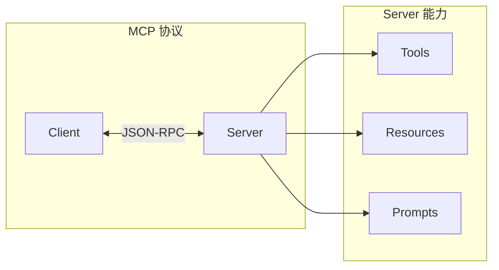
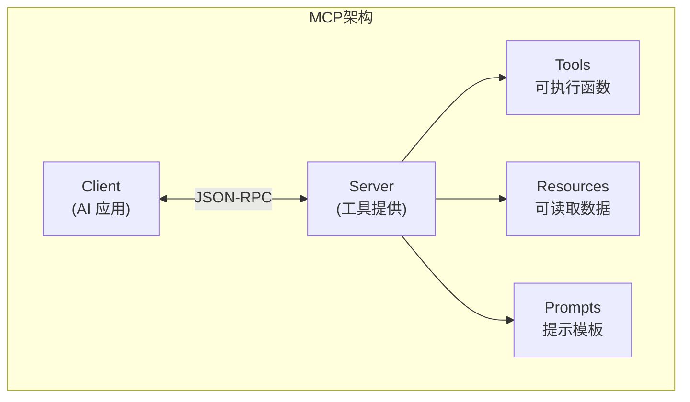
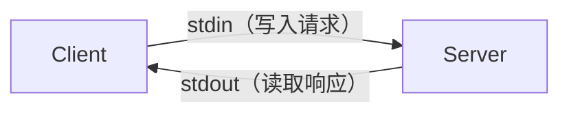

# 第1章 · MCP 协议基础 — 理解 AI 系统互操作标准

> **时长**：约 2 小时 ｜ **难度**：⭐⭐⭐ ｜ **类型**：理论 + 实践
>
> **目标**：理解 MCP 协议的核心概念和架构

---

## 学习目标

学完本章后，你将能够：
- 理解 MCP 协议的设计目标
- 掌握 MCP 的核心概念
- 了解 MCP 的通信机制
- 运行第一个 MCP 示例

---

## 知识地图



---

## 1、什么是 MCP

### 1.1 MCP 定义

**概念定义**：MCP（Model Context Protocol，模型上下文协议）是 Anthropic 提出的一种开放协议标准，用于建立 AI 系统与外部工具、数据源之间的互操作规范。它定义了 Client-Server 架构下的统一接口，包括工具调用、资源读取和提示模板三大能力类型。

**核心定位**：在 MCP 出现之前，每个 AI 平台（如 OpenAI、Claude、LangChain）都有各自独立的功能调用方式，开发者需要为每个平台编写不同的适配代码。MCP 的目标是成为 AI 领域的"USB 接口"——工具开发者只需按照 MCP 标准实现一次 Server，任何兼容 MCP 的 AI 应用都可以直接使用，从而彻底解决 AI 工具生态的碎片化问题。

**MCP (Model Context Protocol)** 是 Anthropic 开源的 AI 系统互操作协议：

| 特性 | 说明 |
|------|------|
| 标准化 | 统一的 AI 工具接口标准 |
| 开放 | 开源协议，任何人可实现 |
| 灵活 | 支持多种传输方式 |
| 安全 | 内置权限和安全机制 |

### 1.2 为什么需要 MCP

| 问题 | 传统方案 | MCP 方案 |
|------|---------|---------|
| 工具集成 | 每个 AI 平台不同 | 统一标准 |
| 代码复用 | 难以复用 | 一次开发，到处使用 |
| 生态建设 | 碎片化 | 标准化生态 |

### 1.3 MCP 架构



---

## 2、核心概念

### 2.1 Client 和 Server

**概念定义**：Client（客户端）是发起 MCP 请求的一方，通常是 AI 应用（如 Claude Desktop、IDE 插件）；Server（服务端）是提供具体能力的一方，负责执行工具、返回资源和生成提示模板。两者通过 JSON-RPC 协议进行通信。

**核心定位**：Client-Server 架构的核心价值在于解耦。AI 应用不需要关心工具内部实现，Server 也不需要关心 AI 应用如何调用。这种分离使得工具可以独立开发、测试和部署，AI 应用也能灵活组合多个 Server 的能力。

| 角色 | 职责 | 示例 |
|------|------|------|
| Client | 发起请求，使用能力 | Claude Desktop, IDE |
| Server | 提供能力，响应请求 | 文件系统, 数据库 |

### 2.2 三种能力类型

**概念定义**：MCP Server 可以暴露三种能力——Tools（工具）是可执行的函数，接收参数并返回结果；Resources（资源）是可读取的结构化数据，如文件、数据库记录；Prompts（提示模板）是预定义的对话模板，供 Client 按需使用以生成特定场景的提示词。

**核心定位**：三种能力的划分让 Server 可以灵活适配不同场景——Tools 适合"做事情"（搜索、计算、API 调用），Resources 适合"读数据"（文档、配置、数据库记录），Prompts 适合"给指令"（代码审查、翻译模板）。Client 可以根据需求组合使用这三种能力，实现丰富的 AI 交互场景。

| 类型 | 说明 | 示例 |
|------|------|------|
| **Tools** | 可执行的函数 | 搜索、计算、API 调用 |
| **Resources** | 可读取的数据 | 文件、数据库记录 |
| **Prompts** | 预定义的提示模板 | 代码审查、翻译 |

### 2.3 通信协议

**概念定义**：JSON-RPC 2.0 是一种轻量级的远程过程调用协议，使用 JSON 格式编码请求和响应。每个请求包含 `jsonrpc`（版本号）、`id`（请求标识）、`method`（方法名）和 `params`（参数）四个字段，响应则包含 `result`（成功结果）或 `error`（错误信息）。

**核心定位**：选择 JSON-RPC 而非 REST 或 gRPC 的原因在于其简洁性。MCP 的通信模式本质上是"请求-响应"（Client 调用 Server 的方法），JSON-RPC 正好提供了最轻量的实现——不需要复杂的路由配置，一个 `method` 字段加上 `params` 就能表达任何调用意图，且天然支持异步请求。

MCP 使用 **JSON-RPC 2.0** 作为消息格式：

```json
// 请求
{
  "jsonrpc": "2.0",
  "id": 1,
  "method": "tools/call",
  "params": {
    "name": "search",
    "arguments": {"query": "Python"}
  }
}

// 响应
{
  "jsonrpc": "2.0",
  "id": 1,
  "result": {
    "content": [{"type": "text", "text": "搜索结果..."}]
  }
}
```

---

## 3、传输方式

### 3.1 支持的传输

| 传输方式 | 说明 | 适用场景 |
|---------|------|---------|
| stdio | 标准输入输出 | 本地进程 |
| HTTP/SSE | HTTP + Server-Sent Events | 远程服务 |
| WebSocket | 双向实时通信 | 实时应用 |

### 3.2 stdio 传输



---

## 4、快速开始

### 4.1 安装

```bash
# Python SDK
pip install mcp

# 或使用 uv
uv pip install mcp
```

### 4.2 第一个 MCP Server

```python
"""
01_hello_mcp.py
Hello MCP Server
"""
from mcp.server import Server
from mcp.server.stdio import stdio_server
from mcp.types import Tool, TextContent
import asyncio


# 创建 Server
server = Server("hello-mcp")


# 注册工具
@server.list_tools()
async def list_tools():
    """列出可用工具"""
    return [
        Tool(
            name="hello",
            description="向指定的人打招呼",
            inputSchema={
                "type": "object",
                "properties": {
                    "name": {
                        "type": "string",
                        "description": "要打招呼的人名"
                    }
                },
                "required": ["name"]
            }
        )
    ]


@server.call_tool()
async def call_tool(name: str, arguments: dict):
    """调用工具"""
    if name == "hello":
        person_name = arguments.get("name", "World")
        return [TextContent(type="text", text=f"Hello, {person_name}!")]

    raise ValueError(f"Unknown tool: {name}")


async def main():
    """主函数"""
    async with stdio_server() as (read_stream, write_stream):
        await server.run(
            read_stream,
            write_stream,
            server.create_initialization_options()
        )


if __name__ == "__main__":
    asyncio.run(main())
```

---

## 5、MCP 生态

### 5.1 官方 Server

| Server | 功能 |
|--------|------|
| filesystem | 文件系统操作 |
| git | Git 仓库操作 |
| sqlite | SQLite 数据库 |
| fetch | HTTP 请求 |
| memory | 知识图谱记忆 |

### 5.2 社区 Server

| Server | 功能 |
|--------|------|
| slack | Slack 集成 |
| github | GitHub API |
| postgres | PostgreSQL |
| brave-search | Brave 搜索 |

---

## 常见踩坑

1. **JSON-RPC 请求格式错误**：新手常犯的错误包括忘记设置 `"jsonrpc": "2.0"` 字段、`id` 重复导致响应无法匹配、或 `params` 字段拼写错误。严格遵循 JSON-RPC 2.0 规范，每个请求必须包含 `jsonrpc`、`id`、`method` 三个必填字段。

2. **stdio 模式下日志输出到 stdout**：MCP Server 使用 stdio 传输时，stdout 被用于 JSON-RPC 通信，任何 `print()` 或日志输出到 stdout 都会破坏消息格式，导致 Client 解析失败。务必将所有日志输出到 stderr 或文件，使用 `logging` 模块并配置 `StreamHandler(sys.stderr)`。

3. **忘记初始化会话**：Client 连接 Server 后必须先调用 `session.initialize()` 完成握手，才能进行 `list_tools`、`call_tool` 等操作。跳过初始化步骤会直接报错，这是新手最容易遗漏的步骤。

4. **Server 名称冲突**：同时运行多个 MCP Server 时，如果 `Server("name")` 的名称重复，Claude Desktop 等 Host 应用可能会混淆。每个 Server 应使用全局唯一的名称标识。

5. **传输方式选型不当**：stdio 仅适用于本地进程通信，远程场景需要 HTTP/SSE 或 WebSocket。如果在 Docker 容器或远程服务器上使用 stdio，会导致连接失败。部署前需确认传输方式与运行环境匹配。

---

## 课后练习

1. 搭建一个最简单的 MCP Server，实现一个 `greet` 工具，接收 `name` 参数并返回 `"Hello, {name}!"`，用 Python 的 `mcp` SDK 完成。

2. 用 `curl` 手动模拟 JSON-RPC 请求，直接向 MCP Server 发送 `tools/list` 和 `tools/call` 请求，观察请求和响应的 JSON 结构。

3. 分别使用 stdio 和 HTTP/SSE 两种传输方式运行同一个 MCP Server，对比两者在启动方式、连接稳定性和延迟上的差异。

4. 从官方 Server 列表中选择一个（如 filesystem 或 fetch），配置运行后列出其暴露的 Tools 和 Resources，体验 MCP 生态的即插即用。

---

## 本节小结

- ✅ 理解了 MCP 协议的设计目标
- ✅ 掌握了 Client/Server 架构
- ✅ 了解了 Tools/Resources/Prompts 三种能力
- ✅ 运行了第一个 MCP Server

---

> **下一章**：第2章 · MCP Server 开发 — 构建自定义工具服务
