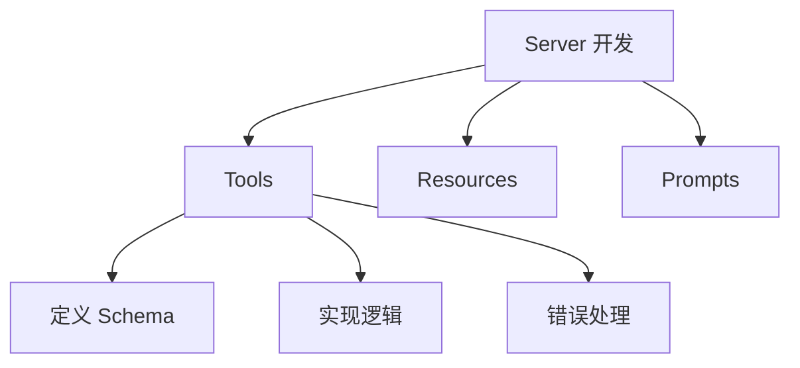

# 第2章 · MCP Server 开发 — 构建自定义工具服务

> **时长**：约 3 小时 ｜ **难度**：⭐⭐⭐⭐ ｜ **类型**：实践
>
> **目标**：掌握 MCP Server 的完整开发流程

---

## 学习目标

学完本章后，你将能够：
- 开发 Tools 类型的 Server
- 开发 Resources 类型的 Server
- 开发 Prompts 类型的 Server
- 处理错误和实现日志

---

## 知识地图



---

## 1、Tools 开发

### 1.1 工具定义

**概念定义**：在 MCP 中，Tool（工具）是一种可被 Client 远程调用的函数式能力。每个 Tool 通过 `Tool` 数据类定义，包含名称（`name`）、描述（`description`）和输入 Schema（`inputSchema`），由 Server 通过 `list_tools` 装饰器注册、`call_tool` 装饰器实现调用逻辑。

**核心定位**：Tool 是 MCP 最核心的能力类型，相当于 AI 应用的"双手"——让 LLM 不仅能"说"，还能"做"。传统 LLM 只能生成文本回复，而通过 Tool，AI 应用可以执行计算、查询数据库、调用外部 API 或操作文件系统，真正实现从对话到行动的跨越。`name` 是工具的唯一标识，`inputSchema` 使用 JSON Schema 格式定义参数结构，Client 根据 Schema 生成对应调用参数。

```python
"""
01_tools_server.py
Tools Server 示例
"""
from mcp.server import Server
from mcp.server.stdio import stdio_server
from mcp.types import Tool, TextContent
import asyncio
import json


server = Server("tools-demo")


@server.list_tools()
async def list_tools():
    """列出工具"""
    return [
        Tool(
            name="calculate",
            description="执行数学计算",
            inputSchema={
                "type": "object",
                "properties": {
                    "expression": {
                        "type": "string",
                        "description": "数学表达式，如 '2 + 3 * 4'"
                    }
                },
                "required": ["expression"]
            }
        ),
        Tool(
            name="get_weather",
            description="获取城市天气",
            inputSchema={
                "type": "object",
                "properties": {
                    "city": {
                        "type": "string",
                        "description": "城市名称"
                    }
                },
                "required": ["city"]
            }
        ),
        Tool(
            name="search",
            description="搜索信息",
            inputSchema={
                "type": "object",
                "properties": {
                    "query": {
                        "type": "string",
                        "description": "搜索关键词"
                    },
                    "limit": {
                        "type": "integer",
                        "description": "结果数量限制",
                        "default": 5
                    }
                },
                "required": ["query"]
            }
        )
    ]


@server.call_tool()
async def call_tool(name: str, arguments: dict):
    """调用工具"""
    if name == "calculate":
        try:
            expression = arguments["expression"]
            # 安全计算（仅允许基本运算）
            allowed = set("0123456789+-*/.() ")
            if not all(c in allowed for c in expression):
                return [TextContent(type="text", text="错误: 不支持的字符")]
            result = eval(expression)
            return [TextContent(type="text", text=f"计算结果: {result}")]
        except Exception as e:
            return [TextContent(type="text", text=f"计算错误: {e}")]

    elif name == "get_weather":
        city = arguments["city"]
        # 模拟天气数据
        weather_data = {
            "北京": "晴，25°C",
            "上海": "多云，28°C",
            "广州": "小雨，30°C",
        }
        weather = weather_data.get(city, "未知城市")
        return [TextContent(type="text", text=f"{city}天气: {weather}")]

    elif name == "search":
        query = arguments["query"]
        limit = arguments.get("limit", 5)
        # 模拟搜索
        results = [f"结果{i}: {query}相关内容" for i in range(1, limit + 1)]
        return [TextContent(type="text", text="\n".join(results))]

    raise ValueError(f"Unknown tool: {name}")


async def main():
    async with stdio_server() as (read, write):
        await server.run(read, write, server.create_initialization_options())


if __name__ == "__main__":
    asyncio.run(main())
```

---

## 2、Resources 开发

### 2.1 资源定义

**概念定义**：在 MCP 中，Resource（资源）是一种可被 Client 读取的结构化数据能力。每个 Resource 通过 `Resource` 数据类定义，包含唯一标识 `uri`、名称 `name`、描述 `description` 和 MIME 类型 `mimeType`，由 Server 通过 `list_resources` 装饰器注册、`read_resource` 装饰器提供读取逻辑。

**核心定位**：Resource 解决了"AI 如何按需读取数据"的问题。传统方式中需要将数据手动拼接到 prompt 里传给 LLM，既不灵活又浪费 token。通过 Resource，AI 应用可以像访问文件系统一样按需读取数据——Client 先调用 `list_resources` 查看可用资源列表，再通过 `read_resource` 获取具体内容。URI 充当资源的地址，`mimeType` 告诉 Client 如何解析返回内容。

```python
"""
02_resources_server.py
Resources Server 示例
"""
from mcp.server import Server
from mcp.server.stdio import stdio_server
from mcp.types import Resource, TextResourceContents
import asyncio


server = Server("resources-demo")


# 模拟数据
DOCUMENTS = {
    "doc1": {"title": "Python 入门", "content": "Python 是一种编程语言..."},
    "doc2": {"title": "机器学习", "content": "机器学习是 AI 的子领域..."},
    "doc3": {"title": "LangChain", "content": "LangChain 是 LLM 应用框架..."},
}


@server.list_resources()
async def list_resources():
    """列出资源"""
    return [
        Resource(
            uri=f"docs://{doc_id}",
            name=doc["title"],
            description=f"文档: {doc['title']}",
            mimeType="text/plain"
        )
        for doc_id, doc in DOCUMENTS.items()
    ]


@server.read_resource()
async def read_resource(uri: str):
    """读取资源"""
    # 解析 URI
    if uri.startswith("docs://"):
        doc_id = uri.replace("docs://", "")
        if doc_id in DOCUMENTS:
            doc = DOCUMENTS[doc_id]
            content = f"# {doc['title']}\n\n{doc['content']}"
            return TextResourceContents(
                uri=uri,
                mimeType="text/plain",
                text=content
            )

    raise ValueError(f"Resource not found: {uri}")


async def main():
    async with stdio_server() as (read, write):
        await server.run(read, write, server.create_initialization_options())


if __name__ == "__main__":
    asyncio.run(main())
```

---

## 3、Prompts 开发

### 3.1 提示模板

**概念定义**：在 MCP 中，Prompt（提示模板）是一种预定义的对话模板能力。每个 Prompt 通过 `Prompt` 数据类定义，包含名称 `name`、描述 `description` 和参数列表 `arguments`，由 Server 通过 `list_prompts` 装饰器注册、`get_prompt` 装饰器生成具体提示内容。`PromptArgument` 定义每个参数的名称、描述和是否必填。

**核心定位**：Prompt 解决了"AI 如何获得高质量指令"的问题。将常用的复杂指令（如代码审查、翻译、摘要）封装为可复用的模板，避免了每次手动编写长篇 prompt 的麻烦，也保证了指令质量的一致性。Client 只需传入参数（如代码内容、目标语言），Server 返回完整的 `PromptMessage` 列表，AI 应用直接使用即可。

```python
"""
03_prompts_server.py
Prompts Server 示例
"""
from mcp.server import Server
from mcp.server.stdio import stdio_server
from mcp.types import Prompt, PromptMessage, PromptArgument, TextContent
import asyncio


server = Server("prompts-demo")


@server.list_prompts()
async def list_prompts():
    """列出提示模板"""
    return [
        Prompt(
            name="code_review",
            description="代码审查提示",
            arguments=[
                PromptArgument(
                    name="code",
                    description="要审查的代码",
                    required=True
                ),
                PromptArgument(
                    name="language",
                    description="编程语言",
                    required=False
                )
            ]
        ),
        Prompt(
            name="translate",
            description="翻译提示",
            arguments=[
                PromptArgument(
                    name="text",
                    description="要翻译的文本",
                    required=True
                ),
                PromptArgument(
                    name="target_language",
                    description="目标语言",
                    required=True
                )
            ]
        ),
        Prompt(
            name="summarize",
            description="摘要提示",
            arguments=[
                PromptArgument(
                    name="content",
                    description="要总结的内容",
                    required=True
                ),
                PromptArgument(
                    name="max_length",
                    description="最大长度",
                    required=False
                )
            ]
        )
    ]


@server.get_prompt()
async def get_prompt(name: str, arguments: dict):
    """获取提示"""
    if name == "code_review":
        code = arguments.get("code", "")
        language = arguments.get("language", "未知")
        return [
            PromptMessage(
                role="user",
                content=TextContent(
                    type="text",
                    text=f"""请审查以下 {language} 代码，指出潜在问题和改进建议：

```{language}
{code}
```

请从以下几个方面进行审查：
1. 代码质量
2. 潜在 Bug
3. 性能问题
4. 可读性
5. 最佳实践"""
                )
            )
        ]

    elif name == "translate":
        text = arguments.get("text", "")
        target = arguments.get("target_language", "英语")
        return [
            PromptMessage(
                role="user",
                content=TextContent(
                    type="text",
                    text=f"请将以下文本翻译成{target}：\n\n{text}"
                )
            )
        ]

    elif name == "summarize":
        content = arguments.get("content", "")
        max_length = arguments.get("max_length", "200字")
        return [
            PromptMessage(
                role="user",
                content=TextContent(
                    type="text",
                    text=f"请将以下内容总结为{max_length}以内的摘要：\n\n{content}"
                )
            )
        ]

    raise ValueError(f"Unknown prompt: {name}")


async def main():
    async with stdio_server() as (read, write):
        await server.run(read, write, server.create_initialization_options())


if __name__ == "__main__":
    asyncio.run(main())
```

---

## 4、完整 Server 示例

```python
"""
04_complete_server.py
完整 MCP Server
"""
from mcp.server import Server
from mcp.server.stdio import stdio_server
from mcp.types import (
    Tool, TextContent,
    Resource, TextResourceContents,
    Prompt, PromptMessage, PromptArgument
)
import asyncio
import logging

# 配置日志
logging.basicConfig(level=logging.INFO)
logger = logging.getLogger(__name__)

server = Server("complete-mcp-server")


# ========== Tools ==========
@server.list_tools()
async def list_tools():
    return [
        Tool(
            name="echo",
            description="回显输入的消息",
            inputSchema={
                "type": "object",
                "properties": {
                    "message": {"type": "string", "description": "消息内容"}
                },
                "required": ["message"]
            }
        )
    ]


@server.call_tool()
async def call_tool(name: str, arguments: dict):
    logger.info(f"Tool called: {name} with {arguments}")

    if name == "echo":
        msg = arguments.get("message", "")
        return [TextContent(type="text", text=f"Echo: {msg}")]

    raise ValueError(f"Unknown tool: {name}")


# ========== Resources ==========
@server.list_resources()
async def list_resources():
    return [
        Resource(
            uri="config://settings",
            name="应用配置",
            mimeType="application/json"
        )
    ]


@server.read_resource()
async def read_resource(uri: str):
    logger.info(f"Resource read: {uri}")

    if uri == "config://settings":
        return TextResourceContents(
            uri=uri,
            mimeType="application/json",
            text='{"debug": true, "version": "1.0.0"}'
        )

    raise ValueError(f"Resource not found: {uri}")


# ========== Prompts ==========
@server.list_prompts()
async def list_prompts():
    return [
        Prompt(
            name="greeting",
            description="问候语生成",
            arguments=[
                PromptArgument(name="name", description="姓名", required=True)
            ]
        )
    ]


@server.get_prompt()
async def get_prompt(name: str, arguments: dict):
    if name == "greeting":
        person_name = arguments.get("name", "朋友")
        return [
            PromptMessage(
                role="user",
                content=TextContent(
                    type="text",
                    text=f"请生成一段对 {person_name} 的友好问候语。"
                )
            )
        ]

    raise ValueError(f"Unknown prompt: {name}")


async def main():
    logger.info("Starting MCP Server...")
    async with stdio_server() as (read, write):
        await server.run(read, write, server.create_initialization_options())


if __name__ == "__main__":
    asyncio.run(main())
```

---

## 常见踩坑

1. **inputSchema 缺少 `required` 字段**：定义 Tool 时 `inputSchema` 中的 `required` 数组容易被遗忘，导致 Client 不知道哪些参数是必填的，可能出现调用时漏传参数的问题。每个参数都应明确标注 `required` 或在注释中说明默认值。

2. **call_tool 返回类型不符合规范**：`call_tool` 必须返回 `list[TextContent]` 类型，新手常犯的错误是直接返回字符串或单个 `TextContent` 对象。MCP 协议要求统一使用列表包裹，每个元素代表一段独立内容。

3. **Resource URI 命名混乱**：Resource 的 URI 没有统一的命名规范时，Client 难以理解和发现可用的资源。建议使用 `scheme://path` 的格式（如 `docs://python-intro`、`config://app-settings`），让 URI 本身就能表达资源的来源和类型。

4. **异步函数忘记 `await`**：MCP SDK 的所有回调方法（`list_tools`、`call_tool`、`read_resource` 等）都是异步的。如果在同步函数中调用异步操作但忘记 `await`，会返回 coroutine 对象而非实际结果，导致奇怪的运行时错误。

5. **多种能力混在一个文件中难以维护**：当 Server 同时提供 Tools、Resources、Prompts 且每种能力有多个实现时，全部放在一个文件中会导致代码膨胀。建议按能力类型拆分模块，并通过 Server 实例的装饰器跨文件注册。

---

## 课后练习

1. 开发一个"城市天气查询"Tool Server，实现 `get_temperature`（查询温度）和 `get_forecast`（查询未来天气预报）两个工具，使用模拟数据返回结果。

2. 开发一个"文档笔记"Resource Server，提供 `notes://` 协议的资源，支持列出所有笔记和按 ID 读取笔记内容，数据存储在内存字典中。

3. 开发一个"多语言翻译"Prompt Server，支持中译英、英译中、日译中三种翻译模板，每种模板包含角色设定和格式要求。

4. 将以上三个独立的 Server 合并为一个完整 Server，同时暴露 Tools、Resources、Prompts 三种能力，并用统一的日志系统记录所有调用。

---

## 本节小结

- ✅ 掌握了 Tools Server 开发
- ✅ 学会了 Resources Server 开发
- ✅ 实现了 Prompts Server 开发
- ✅ 完成了完整 Server 示例

---

> **下一章**：第3章 · MCP Client 集成 — 在应用中使用 MCP 服务
