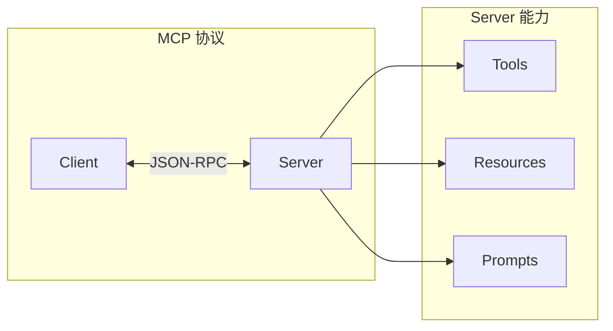

# 第1章 · MCP 协议基础 — 理解 AI 系统互操作标准

> **时长**：约 2 小时 ｜ **难度**：⭐⭐⭐ ｜ **类型**：理论 + 实践
>
> **目标**：理解 MCP 协议的核心概念和架构

---

## 学习目标

学完本章后，你将能够：
- 理解 MCP 协议的设计目标
- 掌握 MCP 的核心概念
- 了解 MCP 的通信机制
- 运行第一个 MCP 示例

---

## 知识地图



---

## 1、什么是 MCP

### 1.1 MCP 定义

**MCP (Model Context Protocol)** 是 Anthropic 开源的 AI 系统互操作协议：

| 特性 | 说明 |
|------|------|
| 标准化 | 统一的 AI 工具接口标准 |
| 开放 | 开源协议，任何人可实现 |
| 灵活 | 支持多种传输方式 |
| 安全 | 内置权限和安全机制 |

### 1.2 为什么需要 MCP

| 问题 | 传统方案 | MCP 方案 |
|------|---------|---------|
| 工具集成 | 每个 AI 平台不同 | 统一标准 |
| 代码复用 | 难以复用 | 一次开发，到处使用 |
| 生态建设 | 碎片化 | 标准化生态 |

### 1.3 MCP 架构

```
┌─────────────────────────────────────────────────────────┐
│                    MCP 架构                             │
├─────────────────────────────────────────────────────────┤
│                                                         │
│  ┌─────────────┐           ┌─────────────┐             │
│  │   Client    │  JSON-RPC │   Server    │             │
│  │  (AI 应用)  │ ←──────→  │  (工具提供) │             │
│  └─────────────┘           └─────────────┘             │
│                                   │                     │
│                    ┌──────────────┼──────────────┐     │
│                    ↓              ↓              ↓     │
│              ┌─────────┐   ┌─────────┐   ┌─────────┐  │
│              │  Tools  │   │Resources│   │ Prompts │  │
│              └─────────┘   └─────────┘   └─────────┘  │
│                                                         │
└─────────────────────────────────────────────────────────┘
```

---

## 2、核心概念

### 2.1 Client 和 Server

| 角色 | 职责 | 示例 |
|------|------|------|
| Client | 发起请求，使用能力 | Claude Desktop, IDE |
| Server | 提供能力，响应请求 | 文件系统, 数据库 |

### 2.2 三种能力类型

| 类型 | 说明 | 示例 |
|------|------|------|
| **Tools** | 可执行的函数 | 搜索、计算、API 调用 |
| **Resources** | 可读取的数据 | 文件、数据库记录 |
| **Prompts** | 预定义的提示模板 | 代码审查、翻译 |

### 2.3 通信协议

MCP 使用 **JSON-RPC 2.0** 作为消息格式：

```json
// 请求
{
  "jsonrpc": "2.0",
  "id": 1,
  "method": "tools/call",
  "params": {
    "name": "search",
    "arguments": {"query": "Python"}
  }
}

// 响应
{
  "jsonrpc": "2.0",
  "id": 1,
  "result": {
    "content": [{"type": "text", "text": "搜索结果..."}]
  }
}
```

---

## 3、传输方式

### 3.1 支持的传输

| 传输方式 | 说明 | 适用场景 |
|---------|------|---------|
| stdio | 标准输入输出 | 本地进程 |
| HTTP/SSE | HTTP + Server-Sent Events | 远程服务 |
| WebSocket | 双向实时通信 | 实时应用 |

### 3.2 stdio 传输

```
┌──────────┐  stdin   ┌──────────┐
│  Client  │ ──────→  │  Server  │
│          │ ←──────  │          │
└──────────┘  stdout  └──────────┘
```

---

## 4、快速开始

### 4.1 安装

```bash
# Python SDK
pip install mcp

# 或使用 uv
uv pip install mcp
```

### 4.2 第一个 MCP Server

```python
"""
01_hello_mcp.py
Hello MCP Server
"""
from mcp.server import Server
from mcp.server.stdio import stdio_server
from mcp.types import Tool, TextContent
import asyncio


# 创建 Server
server = Server("hello-mcp")


# 注册工具
@server.list_tools()
async def list_tools():
    """列出可用工具"""
    return [
        Tool(
            name="hello",
            description="向指定的人打招呼",
            inputSchema={
                "type": "object",
                "properties": {
                    "name": {
                        "type": "string",
                        "description": "要打招呼的人名"
                    }
                },
                "required": ["name"]
            }
        )
    ]


@server.call_tool()
async def call_tool(name: str, arguments: dict):
    """调用工具"""
    if name == "hello":
        person_name = arguments.get("name", "World")
        return [TextContent(type="text", text=f"Hello, {person_name}!")]

    raise ValueError(f"Unknown tool: {name}")


async def main():
    """主函数"""
    async with stdio_server() as (read_stream, write_stream):
        await server.run(
            read_stream,
            write_stream,
            server.create_initialization_options()
        )


if __name__ == "__main__":
    asyncio.run(main())
```

---

## 5、MCP 生态

### 5.1 官方 Server

| Server | 功能 |
|--------|------|
| filesystem | 文件系统操作 |
| git | Git 仓库操作 |
| sqlite | SQLite 数据库 |
| fetch | HTTP 请求 |
| memory | 知识图谱记忆 |

### 5.2 社区 Server

| Server | 功能 |
|--------|------|
| slack | Slack 集成 |
| github | GitHub API |
| postgres | PostgreSQL |
| brave-search | Brave 搜索 |

---

## 本节小结

- ✅ 理解了 MCP 协议的设计目标
- ✅ 掌握了 Client/Server 架构
- ✅ 了解了 Tools/Resources/Prompts 三种能力
- ✅ 运行了第一个 MCP Server

---

> **下一章**：第2章 · MCP Server 开发 — 构建自定义工具服务
