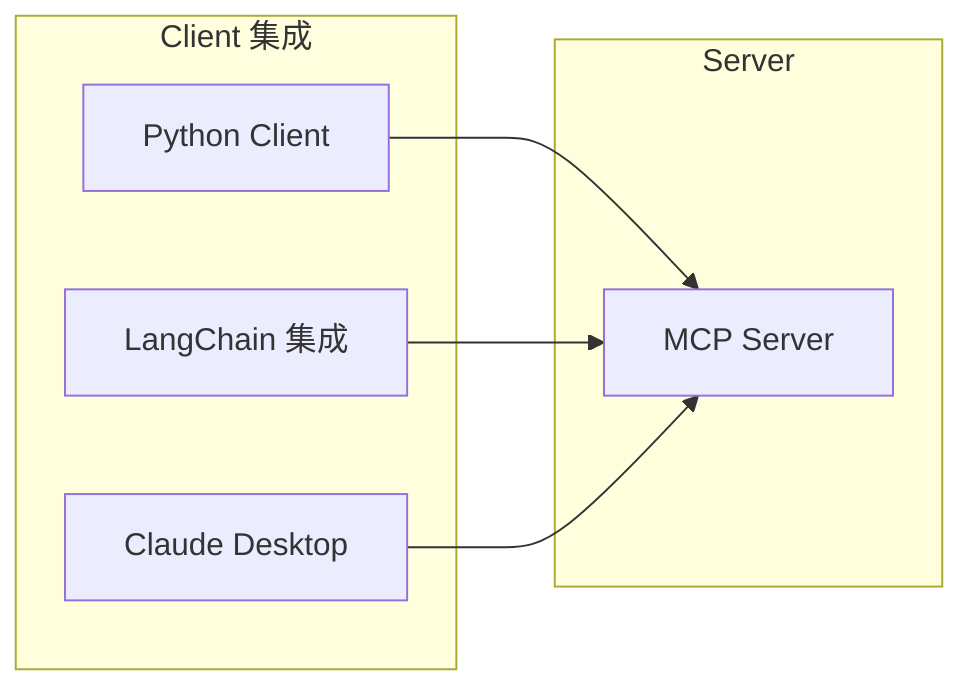

# 第3章 · MCP Client 集成 — 在应用中使用 MCP 服务

> **时长**：约 3 小时 ｜ **难度**：⭐⭐⭐⭐ ｜ **类型**：实践
>
> **目标**：掌握 MCP Client 的开发和集成

---

## 学习目标

学完本章后，你将能够：
- 开发 MCP Client
- 连接和调用 MCP Server
- 在 LangChain 中集成 MCP
- 配置 Claude Desktop 使用 MCP

---

## 知识地图



---

## 1、Python Client 开发

### 1.1 基础 Client

```python
"""
01_basic_client.py
基础 MCP Client
"""
import asyncio
from mcp import ClientSession, StdioServerParameters
from mcp.client.stdio import stdio_client


async def main():
    """主函数"""
    print("=" * 60)
    print("【MCP Client 示例】")
    print("=" * 60)

    # 服务器参数
    server_params = StdioServerParameters(
        command="python",
        args=["path/to/your/server.py"]
    )

    async with stdio_client(server_params) as (read, write):
        async with ClientSession(read, write) as session:
            # 初始化
            await session.initialize()

            # 列出工具
            print("\n可用工具:")
            tools = await session.list_tools()
            for tool in tools.tools:
                print(f"  - {tool.name}: {tool.description}")

            # 调用工具
            print("\n调用工具:")
            result = await session.call_tool("hello", {"name": "World"})
            print(f"  结果: {result.content[0].text}")

            # 列出资源
            print("\n可用资源:")
            resources = await session.list_resources()
            for resource in resources.resources:
                print(f"  - {resource.uri}: {resource.name}")

            # 列出提示
            print("\n可用提示:")
            prompts = await session.list_prompts()
            for prompt in prompts.prompts:
                print(f"  - {prompt.name}: {prompt.description}")


if __name__ == "__main__":
    asyncio.run(main())
```

---

## 2、与 LangChain 集成

### 2.1 MCP 工具转换

```python
"""
02_langchain_integration.py
LangChain 集成 MCP
"""
import asyncio
from typing import List, Any
from langchain_core.tools import BaseTool, ToolException
from langchain_openai import ChatOpenAI
from langchain.agents import AgentExecutor, create_tool_calling_agent
from langchain_core.prompts import ChatPromptTemplate
from pydantic import Field


class MCPTool(BaseTool):
    """MCP 工具包装器"""

    name: str = Field(description="工具名称")
    description: str = Field(description="工具描述")
    mcp_session: Any = Field(description="MCP 会话")

    def _run(self, **kwargs) -> str:
        """同步调用"""
        return asyncio.run(self._arun(**kwargs))

    async def _arun(self, **kwargs) -> str:
        """异步调用"""
        try:
            result = await self.mcp_session.call_tool(self.name, kwargs)
            return result.content[0].text
        except Exception as e:
            raise ToolException(f"MCP 调用失败: {e}")


async def create_mcp_tools(session) -> List[MCPTool]:
    """从 MCP 会话创建 LangChain 工具"""
    tools_response = await session.list_tools()
    tools = []

    for tool in tools_response.tools:
        mcp_tool = MCPTool(
            name=tool.name,
            description=tool.description,
            mcp_session=session
        )
        tools.append(mcp_tool)

    return tools


async def langchain_mcp_agent():
    """LangChain + MCP Agent"""
    # 这里假设已有 MCP 会话
    # session = ...

    # 创建工具
    # tools = await create_mcp_tools(session)

    # 模拟工具（演示用）
    from langchain_core.tools import tool

    @tool
    def search(query: str) -> str:
        """搜索信息"""
        return f"搜索结果: {query}"

    tools = [search]

    # 创建 Agent
    llm = ChatOpenAI(model="gpt-4o-mini")

    prompt = ChatPromptTemplate.from_messages([
        ("system", "你是一个助手，可以使用 MCP 工具。"),
        ("human", "{input}"),
        ("placeholder", "{agent_scratchpad}"),
    ])

    agent = create_tool_calling_agent(llm, tools, prompt)
    executor = AgentExecutor(agent=agent, tools=tools, verbose=True)

    # 运行
    result = executor.invoke({"input": "搜索 Python 教程"})
    print(f"结果: {result['output']}")


if __name__ == "__main__":
    import os
    if os.getenv("OPENAI_API_KEY"):
        asyncio.run(langchain_mcp_agent())
    else:
        print("请设置 OPENAI_API_KEY")
```

---

## 3、Claude Desktop 配置

### 3.1 配置文件

Claude Desktop 通过配置文件启用 MCP Server：

**配置文件位置**:
- macOS: `~/Library/Application Support/Claude/claude_desktop_config.json`
- Windows: `%APPDATA%\Claude\claude_desktop_config.json`

```json
{
  "mcpServers": {
    "my-server": {
      "command": "python",
      "args": ["/path/to/your/server.py"],
      "env": {
        "API_KEY": "your-api-key"
      }
    },
    "filesystem": {
      "command": "npx",
      "args": ["-y", "@modelcontextprotocol/server-filesystem", "/path/to/allowed/dir"]
    },
    "sqlite": {
      "command": "uvx",
      "args": ["mcp-server-sqlite", "--db-path", "/path/to/database.db"]
    }
  }
}
```

### 3.2 常用 Server 配置

```json
{
  "mcpServers": {
    "filesystem": {
      "command": "npx",
      "args": ["-y", "@modelcontextprotocol/server-filesystem", "D:/projects"]
    },
    "git": {
      "command": "uvx",
      "args": ["mcp-server-git", "--repository", "D:/my-repo"]
    },
    "fetch": {
      "command": "uvx",
      "args": ["mcp-server-fetch"]
    }
  }
}
```

---

## 4、调试技巧

### 4.1 日志调试

```python
"""
03_debug_server.py
带调试的 Server
"""
from mcp.server import Server
from mcp.server.stdio import stdio_server
from mcp.types import Tool, TextContent
import asyncio
import logging
import sys

# 配置日志到文件（不是 stdout）
logging.basicConfig(
    level=logging.DEBUG,
    format='%(asctime)s - %(name)s - %(levelname)s - %(message)s',
    handlers=[
        logging.FileHandler('mcp_server.log'),
    ]
)
logger = logging.getLogger(__name__)

server = Server("debug-server")


@server.list_tools()
async def list_tools():
    logger.debug("list_tools called")
    return [
        Tool(
            name="test",
            description="测试工具",
            inputSchema={
                "type": "object",
                "properties": {
                    "input": {"type": "string"}
                },
                "required": ["input"]
            }
        )
    ]


@server.call_tool()
async def call_tool(name: str, arguments: dict):
    logger.info(f"call_tool: name={name}, args={arguments}")

    try:
        if name == "test":
            result = f"测试结果: {arguments.get('input', '')}"
            logger.debug(f"Result: {result}")
            return [TextContent(type="text", text=result)]
    except Exception as e:
        logger.error(f"Error: {e}", exc_info=True)
        raise

    raise ValueError(f"Unknown tool: {name}")


async def main():
    logger.info("Server starting...")
    async with stdio_server() as (read, write):
        await server.run(read, write, server.create_initialization_options())


if __name__ == "__main__":
    asyncio.run(main())
```

### 4.2 MCP Inspector

使用官方 Inspector 工具调试：

```bash
# 安装
npm install -g @modelcontextprotocol/inspector

# 运行
npx @modelcontextprotocol/inspector python your_server.py
```

---

## 5、最佳实践

| 实践 | 说明 |
|------|------|
| 错误处理 | 返回有意义的错误信息 |
| 日志记录 | 记录到文件，不输出到 stdout |
| 输入验证 | 验证所有输入参数 |
| 超时处理 | 长操作设置超时 |
| 权限控制 | 限制敏感操作 |

---

## 本节小结

- ✅ 掌握了 Python MCP Client 开发
- ✅ 学会了 LangChain 集成 MCP
- ✅ 配置了 Claude Desktop 使用 MCP
- ✅ 了解了调试技巧和最佳实践

---

## 模块总结

恭喜完成 **模块11：MCP 协议**！

你已经掌握了：
- ✅ MCP 协议的核心概念
- ✅ Server 开发（Tools, Resources, Prompts）
- ✅ Client 开发与集成
- ✅ Claude Desktop 配置

---

> **下一模块**：模块12 · 项目实战 — 综合运用所学构建完整应用
