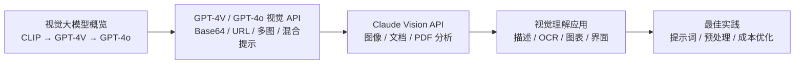
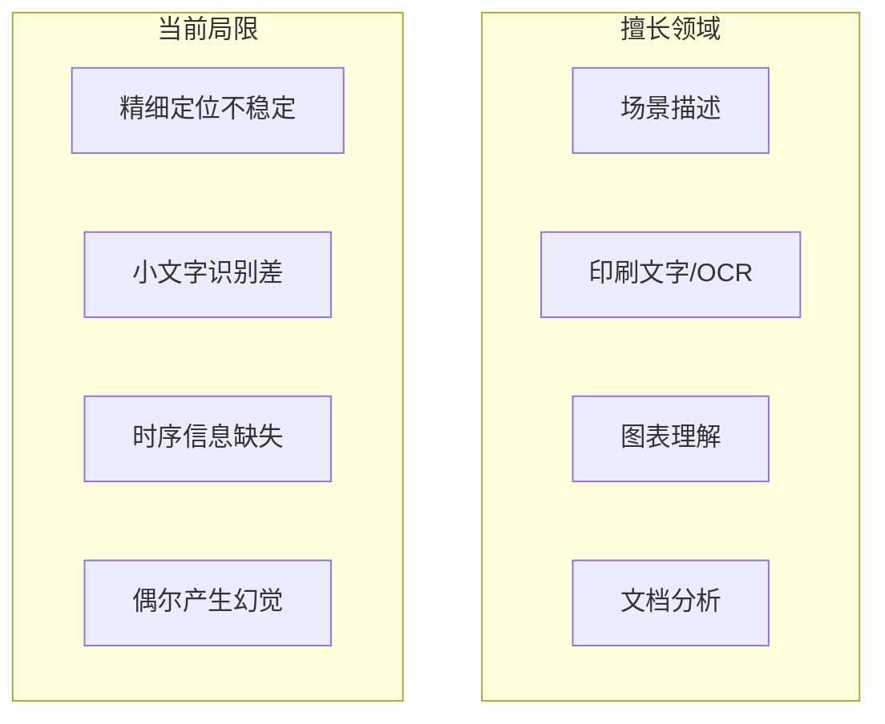
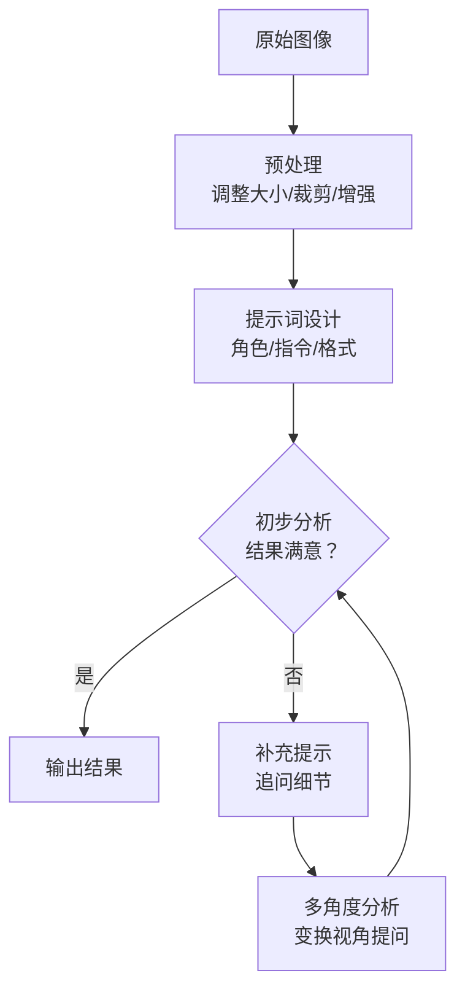

# 第1章 · 视觉理解能力 — 从图像分析到文档理解

> **时长**：约 3 小时 ｜ **难度**：⭐⭐ ｜ **类型**：讲解 + 动手实操
>
> **目标**：掌握主流视觉大模型 API 的使用方法，学会图像分析、OCR、图表理解等典型应用

---

## 学习目标

学完本章后，你将能够：
- 了解主流视觉大模型的发展脉络和各自特点
- 使用 GPT-4o Vision API 完成图像分析和多图输入
- 使用 Claude Vision API 完成文档和 PDF 分析
- 实现 OCR、图表数据提取、场景理解等应用
- 掌握视觉提示词技巧和成本优化策略

---

## 知识地图



---

## 1、视觉大模型概览

### 1.1 从 CLIP 到 GPT-4V

**概念定义**：视觉大模型是指能够理解和分析图像内容的大规模深度学习模型。与传统的计算机视觉模型（只能做分类、检测等特定任务）不同，视觉大模型展现出强大的通用图像理解能力——它们能描述场景、阅读文字、识别物体、理解图表，甚至根据图像进行推理。

**核心定位**：视觉大模型让 AI 拥有了"眼睛"——不再是只处理文本的聊天机器人，而是能理解照片、文档、图表、界面的多模态助手。

| 里程碑 | 时间 | 代表模型 | 突破 |
|--------|------|---------|------|
| 多模态对齐 | 2021 | CLIP (OpenAI) | 图文对比学习，打通视觉和语言 |
| 视觉编码 | 2022 | Flamingo (DeepMind) | 少数样本即可泛化到新任务 |
| 开源视觉 LLM | 2023 | LLaVA | 用语言模型理解图像 |
| 商业 API | 2023 | GPT-4V | 首次通过 API 提供视觉能力 |
| 多模态统一 | 2024 | GPT-4o | 原生多模态，看听说一体化 |

### 1.2 主流视觉模型对比

当前主流的视觉大模型 API 各有优势：

| 模型 | 优势场景 | 特殊能力 | 计费方式 |
|------|---------|---------|---------|
| GPT-4o Vision | 通用视觉理解 | 多图对比、高分辨率 | 按 Token + 图像尺寸 |
| Claude 3 Vision | 文档分析 | PDF 原生支持、长文档 | 按 Token + 图像页数 |
| Gemini Vision | Google 生态 | YouTube 视频理解 | 按 Token |
| LLaVA (开源) | 本地部署 | 无 API 费用 | 自建 GPU |
| Qwen-VL | 中文理解 | 中英文图表识别强 | 按 Token |

**选型建议**：
- **文档/PDF 分析**：首选 Claude Vision（原生支持 PDF）
- **通用图像理解**：GPT-4o 综合能力最强
- **中文场景**：Qwen-VL 或通义千问视觉模型
- **成本敏感**：开源方案 LLaVA 部署到自有 GPU

### 1.3 能力与局限

**视觉模型擅长**：
- 场景描述：识别物体、人物、场景、活动
- 文字阅读：印刷体、手写体、艺术字
- 图表理解：折线图、柱状图、饼图、流程图
- 文档分析：表单、发票、合同、证件
- 推理分析：判断因果关系、识别异常

**当前局限**：
- 精细定位：精确到像素级别的坐标定位不稳定
- 小文字识别：极小或模糊的文字可能读错
- 时序理解：单张图像缺乏时间信息
- 幻觉：可能描述出图像中不存在的物体
- 安全限制：人物识别、敏感内容限制



---

## 2、GPT-4V / GPT-4o 视觉 API

### 2.1 图像输入格式

**概念定义**：视觉 API 接受两种图像输入格式——Base64 编码和 URL 引用。Base64 将图像数据转为纯文本嵌入请求中；URL 引用让 API 直接访问远程图像。

```python
# 方式1：Base64 编码（适用于本地文件或敏感数据）
import base64

with open("photo.jpg", "rb") as f:
    image_data = base64.b64encode(f.read()).decode("utf-8")

image_url = f"data:image/jpeg;base64,{image_data}"

# 方式2：URL 引用（适用于公开可访问的在线图片）
image_url = "https://example.com/photo.jpg"
```

**分辨率与 Token 消耗**：GPT-4o 支持两种分辨率模式：

| 模式 | 说明 | Token 消耗 |
|------|------|-----------|
| `low` | 低分辨率（512x512） | 85 tokens |
| `high` | 高分辨率（按需缩放） | 170 tokens + 按分块计算 |

建议：简单场景（识别物体、文字）用 `low`；需要精细理解（图表、界面、小文字）用 `high`。

### 2.2 基本图像分析

### ▶ 执行代码

```powershell
cd code/12-multimodal/code
python 01_image_analysis.py
```

```python
from openai import OpenAI
import base64

client = OpenAI()

# 编码本地图像
with open("photo.jpg", "rb") as f:
    base64_img = base64.b64encode(f.read()).decode("utf-8")

response = client.chat.completions.create(
    model="gpt-4o",
    messages=[
        {
            "role": "user",
            "content": [
                {"type": "text", "text": "请详细描述这张图片中有什么？"},
                {
                    "type": "image_url",
                    "image_url": {
                        "url": f"data:image/jpeg;base64,{base64_img}",
                        "detail": "high"
                    }
                }
            ]
        }
    ],
    max_tokens=500,
)

print(response.choices[0].message.content)
```

### 2.3 多图输入

GPT-4o 支持在同一会话中传入多张图片进行比较分析：

```python
response = client.chat.completions.create(
    model="gpt-4o",
    messages=[
        {
            "role": "user",
            "content": [
                {"type": "text", "text": "对比这两张图片，列出它们的主要差异。"},
                {
                    "type": "image_url",
                    "image_url": {"url": "data:image/jpeg;base64,{img1}", "detail": "high"}
                },
                {
                    "type": "image_url",
                    "image_url": {"url": "data:image/jpeg;base64,{img2}", "detail": "high"}
                }
            ]
        }
    ]
)
```

### ▶ 执行代码

```powershell
python 04_multi_image.py
```

### 2.4 视觉 + 文本混合提示

**核心技巧**：在提示词中引导模型关注特定区域、执行特定任务，结合文本指令让视觉分析更精准：

```python
response = client.chat.completions.create(
    model="gpt-4o",
    messages=[
        {
            "role": "user",
            "content": [
                {
                    "type": "text",
                    "text": "这张发票的总金额是多少？发票号码、开票日期是什么？请以 JSON 格式输出。"
                },
                {
                    "type": "image_url",
                    "image_url": {"url": image_url, "detail": "high"}
                }
            ]
        }
    ],
    response_format={"type": "json_object"}
)
```

### 2.5 最佳实践

1. **先降采样**：上传前压缩到 2000px 以内，减少 Token 消耗
2. **裁剪无关区域**：只保留需要分析的部分
3. **明确指令**：告诉模型具体看什么、输出格式
4. **分步推理**：复杂图像先让模型描述，再提问
5. **错误重试**：模糊区域可换角度重新拍摄

---

## 3、Claude Vision API

### 3.1 图像输入格式

**概念定义**：Claude API 同样支持 Base64 和 URL 两种图像输入方式，但使用了 Anthropic 特有的消息格式。

```python
from anthropic import Anthropic

client = Anthropic()

# Base64 方式
import base64
with open("document.pdf", "rb") as f:
    pdf_data = base64.b64encode(f.read()).decode("utf-8")

response = client.messages.create(
    model="claude-3-5-sonnet-20241022",
    max_tokens=1024,
    messages=[
        {
            "role": "user",
            "content": [
                {
                    "type": "document",
                    "source": {
                        "type": "base64",
                        "media_type": "application/pdf",
                        "data": pdf_data
                    }
                },
                {
                    "type": "text",
                    "text": "请总结这份文档的主要内容。"
                }
            ]
        }
    ]
)
```

### 3.2 支持的图像类型

| 媒体类型 | 格式 | 说明 |
|---------|------|------|
| image/jpeg | .jpg, .jpeg | 照片、截图 |
| image/png | .png | 截图、图表 |
| image/webp | .webp | 网页图片 |
| image/gif | .gif | 动图（分析首帧） |
| application/pdf | .pdf | 文档（Claude 独有优势） |

### 3.3 文档 / PDF 分析

**核心定位**：Claude Vision 在文档分析领域具有独特优势——它原生支持 PDF 格式的输入，无需将 PDF 转为图片。这使得它特别适合合同分析、论文审阅、报告理解等场景。

```python
# PDF 分析示例
response = client.messages.create(
    model="claude-3-5-sonnet-20241022",
    max_tokens=2048,
    messages=[
        {
            "role": "user",
            "content": [
                {
                    "type": "document",
                    "source": {
                        "type": "base64",
                        "media_type": "application/pdf",
                        "data": pdf_base64
                    }
                },
                {
                    "type": "text",
                    "text": """请分析这份合同：
1. 合同双方的名称
2. 合同金额和支付条款
3. 关键日期和期限
4. 是否存在对甲方不利的条款
请以结构化格式输出。"""
                }
            ]
        }
    ]
)
```

### 3.4 与 GPT-4V 对比

| 对比维度 | Claude 3.5 Sonnet | GPT-4o |
|---------|-------------------|--------|
| 原生 PDF 支持 | ✅ 是 | ❌ 需转图片 |
| 多图对比 | ✅ 支持 | ✅ 支持 |
| 中文识别 | 优秀 | 优秀 |
| 表格识别 | 良好 | 优秀 |
| 图表推理 | 优秀 | 优秀 |
| 成本 | 按 Token | 按 Token + 图像 |

---

## 4、视觉理解应用

### 4.1 图像描述与标注

**概念定义**：图像描述是视觉模型最基础的能力——接收一张图片，输出自然语言描述。可用于生成无障碍替代文本、社交媒体自动标签、内容审核等场景。

```python
def describe_image(image_path: str, detail_level: str = "brief") -> str:
    """生成图像描述"""
    detail_prompt = {
        "brief": "请用一句话描述这张图片。",
        "normal": "请详细描述这张图片的内容。",
        "detailed": "请详细描述这张图片的所有元素：人物、物体、场景、颜色、位置关系、文字等。"
    }
    # ... API 调用
```

### 4.2 OCR 文字识别

**概念定义**：OCR（Optical Character Recognition，光学字符识别）是从图像中提取文字的技术。视觉大模型让 OCR 变得简单——不需要专门的 OCR 引擎，直接问"图片里写了什么"即可。

### ▶ 执行代码

```powershell
python 02_ocr_extraction.py
```

```python
def extract_text_from_image(image_path: str) -> str:
    """从图像中提取所有文字"""
    with open(image_path, "rb") as f:
        base64_img = base64.b64encode(f.read()).decode("utf-8")

    response = client.chat.completions.create(
        model="gpt-4o",
        messages=[
            {
                "role": "user",
                "content": [
                    {"type": "text", "text": "请提取这张图片中的所有文字，按原格式输出。"},
                    {
                        "type": "image_url",
                        "image_url": {"url": f"data:image/jpeg;base64,{base64_img}", "detail": "high"}
                    }
                ]
            }
        ]
    )
    return response.choices[0].message.content
```

### 4.3 图表数据提取

**核心应用**：从柱状图、折线图、饼图中提取结构化数据，用于数据分析报告。

### ▶ 执行代码

```powershell
python 03_chart_understanding.py
```

```python
def extract_chart_data(image_path: str) -> dict:
    """从图表中提取数据"""
    response = client.chat.completions.create(
        model="gpt-4o",
        messages=[
            {
                "role": "user",
                "content": [
                    {
                        "type": "text",
                        "text": """分析这张图表，并以JSON格式返回：
1. 图表类型（柱状图/折线图/饼图）
2. X轴/Y轴标签
3. 数据系列及其数值
4. 标题"""
                    },
                    {
                        "type": "image_url",
                        "image_url": {"url": f"data:image/jpeg;base64,{base64_img}", "detail": "high"}
                    }
                ]
            }
        ],
        response_format={"type": "json_object"}
    )
    return json.loads(response.choices[0].message.content)
```

### 4.4 界面 / 设计稿分析

**典型场景**：自动分析 UI 设计稿，生成组件描述、代码框架或可用性建议。

```python
def analyze_ui_design(image_path: str) -> str:
    """分析 UI 设计稿"""
    response = client.chat.completions.create(
        model="gpt-4o",
        messages=[
            {
                "role": "user",
                "content": [
                    {
                        "type": "text",
                        "text": """分析这个 UI 设计稿，请输出：
1. 页面类型（登录页/首页/详情页等）
2. 包含的组件列表
3. 交互流程
4. 改进建议"""
                    },
                    {
                        "type": "image_url",
                        "image_url": {"url": f"data:image/jpeg;base64,{base64_img}", "detail": "high"}
                    }
                ]
            }
        ]
    )
    return response.choices[0].message.content
```

### 4.5 产品识别

**应用场景**：电商平台识别商品、库存管理、拍照搜物。视觉模型可以识别品牌、型号、种类，甚至判断产品新旧程度。

### 4.6 场景理解

**应用场景**：自动驾驶场景理解、安防监控分析、旅游景点识别。通过视觉模型理解整个场景的语义信息——什么人在做什么、环境状况如何、是否存在异常。

---

## 5、视觉理解最佳实践

### 5.1 提示词技巧

| 技巧 | 示例 | 效果 |
|------|------|------|
| 指定输出格式 | "以 JSON 格式输出" | 结构化结果 |
| 分步指令 | "先描述，再分析，最后总结" | 更完整的分析 |
| 限定关注区域 | "只看左上角区域的文字" | 精准提取 |
| 否定指令 | "不要描述人物穿着" | 过滤无关信息 |
| 角色设定 | "你是一个专业的财务报表分析师" | 更专业的分析 |

### 5.2 图像预处理

```python
from PIL import Image

def preprocess_for_vision(image_path: str, max_size: int = 2000) -> str:
    """预处理图像：调整大小、优化质量"""
    img = Image.open(image_path)
    
    # 调整尺寸（减少 Token 消耗）
    if max(img.size) > max_size:
        ratio = max_size / max(img.size)
        new_size = (int(img.size[0] * ratio), int(img.size[1] * ratio))
        img = img.resize(new_size, Image.LANCZOS)
    
    # 转为 JPEG（减小文件大小）
    output_path = image_path.rsplit(".", 1)[0] + "_optimized.jpg"
    img.save(output_path, "JPEG", quality=85)
    
    return output_path
```

### 5.3 成本优化

**每张图像的费用估算**（以 GPT-4o 为例）：

| 图像复杂度 | 推荐模式 | 成本（每张） |
|-----------|---------|------------|
| 简单（白底文字） | low | ~85 tokens |
| 中等（普通照片） | low | ~85 tokens |
| 复杂（图表/界面） | high | ~170-500 tokens |
| 多图对比（N 张） | 混合 | ~85 × N tokens |

**优化策略**：
1. 先用 `low` 模式尝试，不够再用 `high`
2. 压缩图像到合理尺寸（~1024px）
3. 裁剪无用区域（边框、空白）
4. 批量分析时复用系统消息

### 5.4 准确性提升



---

## 常见踩坑

1. **上传 PDF 时格式错误**：Claude 用 `type: "document"` 而非 `type: "image"`，注意区分
2. **Base64 前缀遗漏**：GPT-4o 需要 `data:image/jpeg;base64,` 前缀，漏了会报格式错误
3. **分辨率过高导致 Token 爆炸**：一张 4000x3000 的图片用 `high` 模式可能消耗上千 Token
4. **幻觉问题**：视觉模型也会产生幻觉，对关键信息的提取建议多角度核实
5. **中文识别不稳定**：艺术字体、竖排文字、手写体的中文识别准确率明显下降

---

## 课后练习

1. 用 GPT-4o 和 Claude Vision 分别分析同一张复杂图表，对比输出质量
2. 实现一个"发票信息提取"函数，从发票图片中提取金额、日期、发票号
3. 用多图输入功能实现"找不同"——对比两张相似图片，列出差异
4. 测试同一张图片在 `detail: "low"` 和 `detail: "high"` 下的输出差异和 Token 消耗

---

## 本节小结

- ✅ 了解了视觉大模型的发展历程（CLIP → GPT-4V → GPT-4o）
- ✅ 掌握了主流视觉模型的选型依据和各自优势
- ✅ 学会了 GPT-4o 视觉 API 的三种输入方式和多图分析
- ✅ 学会了 Claude Vision API 的文档分析和 PDF 原生支持
- ✅ 实现了图像描述、OCR、图表提取、界面分析等应用
- ✅ 掌握了提示词技巧、图像预处理和成本优化策略

---

> **下一章**：第2章 · 图像生成与编辑 — 掌握 AI 绘图技术，从 DALL-E 到 Stable Diffusion
