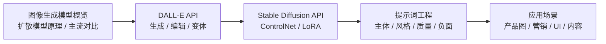
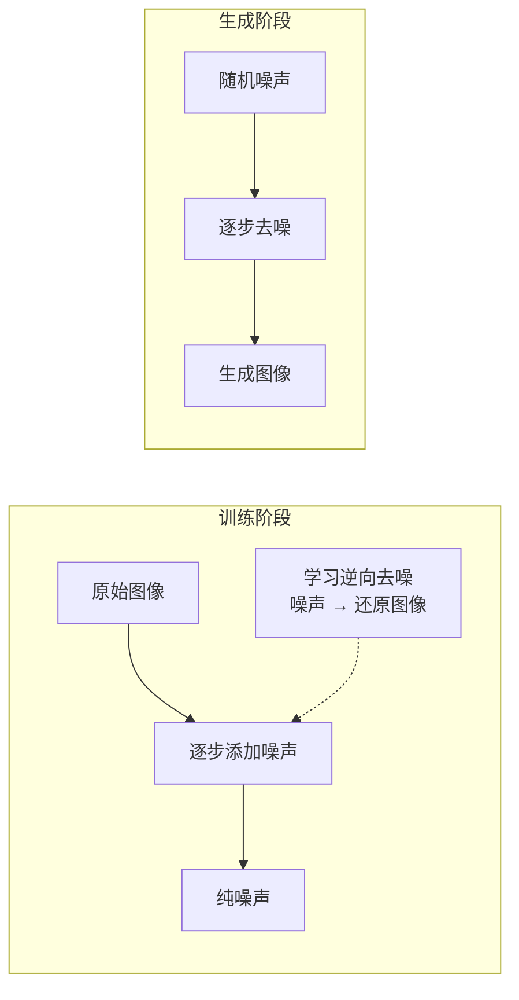
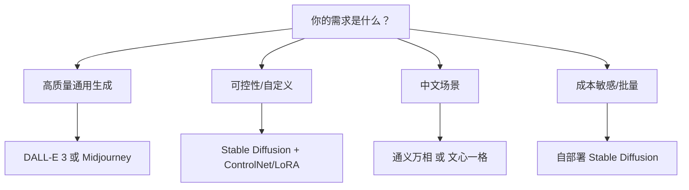
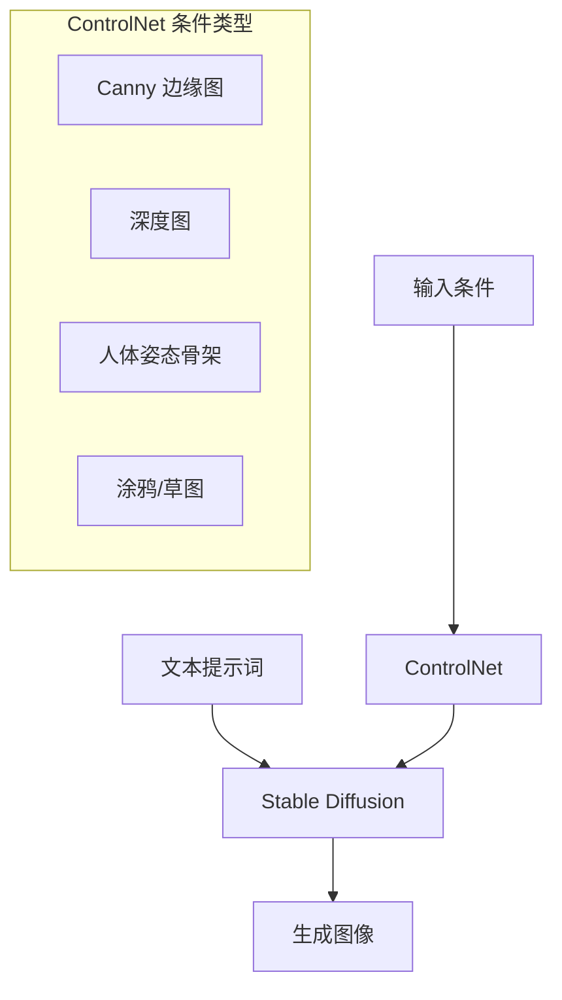

# 第2章 · 图像生成与编辑 — 掌握 AI 绘图技术

> **时长**：约 3 小时 ｜ **难度**：⭐⭐ ｜ **类型**：讲解 + 动手实操
>
> **目标**：掌握主流图像生成 API（DALL-E、Stable Diffusion），学会图像编辑和提示词工程

---

## 学习目标

学完本章后，你将能够：
- 理解扩散模型的基本原理
- 使用 DALL-E API 完成图像生成、编辑和变体
- 使用 Stable Diffusion API 完成可控图像生成
- 掌握图像提示词的编写技巧
- 实现产品图、营销素材、UI 设计等典型应用

---

## 知识地图



---

## 1、图像生成模型概览

### 1.1 扩散模型原理简介

**概念定义**：扩散模型（Diffusion Model）是一种生成式模型，其核心思想是"先破坏，再恢复"——训练阶段向图像逐步添加噪声直到完全模糊，然后学习逆向过程从噪声还原图像。生成时，模型从纯随机噪声开始，逐步去噪最终得到清晰的图像。

**核心定位**：扩散模型是当前图像生成领域的主流技术路线，相比 GAN（生成对抗网络）具有更好的多样性和稳定性，能生成高质量、高分辨率的图像。



**关键概念**：
- **前向过程**：逐步添加高斯噪声直到图像完全随机
- **逆向过程**：学习从噪声中恢复原图
- **Text Conditioning**：通过文本编码器（如 CLIP）将文本提示注入去噪过程
- **采样步数**：步数越多质量越高但越慢，通常 20-50 步

### 1.2 主流模型对比

| 模型 | 开发商 | 访问方式 | 图像质量 | 风格多样性 | 中文支持 | 成本 |
|------|--------|---------|---------|-----------|---------|------|
| DALL-E 3 | OpenAI | API | ⭐⭐⭐⭐⭐ | ⭐⭐⭐ | 良好 | 按张计费 |
| Midjourney | Midjourney | Discord / API | ⭐⭐⭐⭐⭐ | ⭐⭐⭐⭐⭐ | 一般 | 订阅制 |
| Stable Diffusion 3 | Stability AI | 开源/API | ⭐⭐⭐⭐ | ⭐⭐⭐⭐ | 良好 | 自部署免费 |
| 通义万相 | 阿里云 | API | ⭐⭐⭐⭐ | ⭐⭐⭐ | 优秀 | 按张计费 |
| 文心一格 | 百度 | API | ⭐⭐⭐ | ⭐⭐⭐ | 优秀 | 按张计费 |

### 1.3 选型指南



---

## 2、DALL-E API

### 2.1 API 端点与参数

**概念定义**：DALL-E 3 是 OpenAI 的图像生成模型，通过 `images/generations` 端点调用。它擅长理解复杂的自然语言描述，在提示词遵循度和图像质量方面表现优异。

```python
from openai import OpenAI

client = OpenAI()

response = client.images.generate(
    model="dall-e-3",
    prompt="一只橘猫坐在窗台上，午后阳光洒在它身上，摄影写实风格",
    n=1,                    # 生成数量（DALL-E 3 只能为 1）
    size="1024x1024",       # 尺寸
    quality="standard",     # standard 或 hd
    style="vivid",          # vivid 或 natural
)
image_url = response.data[0].url
print(image_url)
```

### 2.2 图像生成

#### 尺寸选择

| 尺寸 | 推荐场景 | 特点 |
|------|---------|------|
| 1024x1024 | 通用、社交媒体 | 正方形构图 |
| 1792x1024 | 横版海报、宽屏 | 宽屏风景 |
| 1024x1792 | 竖版海报、手机壁纸 | 竖屏内容 |

#### 质量参数

| quality | 说明 | 成本 |
|---------|------|------|
| `standard` | 标准质量，生成速度快 | 较低 |
| `hd` | 高质量，细节更丰富 | 2 倍价格 |

#### 风格控制

| style | 效果 | 适用场景 |
|-------|------|---------|
| `vivid` | 鲜艳生动，更具艺术感 | 创意设计、营销素材 |
| `natural` | 自然写实，更接近照片 | 产品图、写实场景 |

### ▶ 执行代码

```powershell
cd code/12-multimodal/code
python 01_dalle_generation.py
```

### 2.3 图像编辑（Inpainting）

**概念定义**：Inpainting（图像修复）是在已有图像的基础上，替换或新增指定的区域。DALL-E 通过 `images.edit` 端点实现——传入原图、蒙版和描述，只修改蒙版覆盖的区域。

```python
response = client.images.edit(
    model="dall-e-2",     # 注意：DALL-E 3 暂不支持 edit
    image=open("room.jpg", "rb"),
    mask=open("mask.png", "rb"),    # 白色区域是要编辑的部分
    prompt="把房间里的沙发换成一张木质书桌，上面放一盏台灯",
    n=1,
    size="1024x1024",
)
```

> **注意**：DALL-E 3 目前仅支持 `generations`（文生图），不支持 `edit`（图编辑）和 `variations`（图变体）。编辑和变体使用 DALL-E 2 端点。

### 2.4 图像变体

**概念定义**：图像变体（Variation）是基于一张原图生成与之相似但不完全相同的新图像——保留原图的风格和构图，在细节上产生变化。

```python
response = client.images.create_variation(
    model="dall-e-2",
    image=open("original.png", "rb"),
    n=3,
    size="1024x1024",
)

for i, data in enumerate(response.data):
    print(f"变体 {i+1}: {data.url}")
```

### 2.5 定价与限制

| 模型 | 尺寸 | Quality | 价格（每张） |
|------|------|---------|------------|
| DALL-E 3 | 1024x1024 | standard | $0.040 |
| DALL-E 3 | 1024x1024 | hd | $0.080 |
| DALL-E 3 | 1792x1024 | standard | $0.080 |
| DALL-E 3 | 1792x1024 | hd | $0.120 |
| DALL-E 3 | 1024x1792 | standard | $0.080 |
| DALL-E 3 | 1024x1792 | hd | $0.120 |
| DALL-E 2 | 1024x1024 | - | $0.020 |

**使用限制**：
- 每分钟请求数（RPM）限制
- 生成的图像归属用户（可商用）
- 内容审查：不生成暴力、成人等内容

---

## 3、Stable Diffusion API

### 3.1 服务商选择

**概念定义**：Stable Diffusion 是 Stability AI 开发的开源图像生成模型。由于开源，有多个服务商提供 API 服务，也可以自部署。

#### 方案一：Stability AI 官方 API

```python
import requests
import base64

response = requests.post(
    "https://api.stability.ai/v2beta/stable-image/generate/sd3",
    headers={
        "authorization": f"Bearer {api_key}",
        "accept": "image/*"
    },
    files={
        "prompt": (None, "一只熊猫在竹林里吃竹子"),
        "output_format": (None, "png"),
        "aspect_ratio": (None, "1:1"),
    }
)
```

#### 方案二：Replicate API

Replicate 提供云托管的各种开源模型，按运行时长计费：

```python
import replicate

output = replicate.run(
    "stability-ai/stable-diffusion-3:...",
    input={
        "prompt": "a cat wearing a hat, digital art",
        "width": 1024,
        "height": 1024,
        "num_outputs": 1,
    }
)
print(output[0])  # 生成的图像 URL
```

#### 方案三：自部署

本地或自有服务器部署，适合高频调用或数据隐私要求高的场景。

### ▶ 执行代码

```powershell
python 03_sd_api.py
```

### 3.2 基础生成

```python
def generate_sd(prompt: str, negative_prompt: str = "", 
                width: int = 1024, height: int = 1024) -> str:
    """使用 Stable Diffusion 生成图像"""
    response = requests.post(
        "https://api.stability.ai/v2beta/stable-image/generate/sd3",
        headers={"authorization": f"Bearer {api_key}", "accept": "image/*"},
        files={
            "prompt": (None, prompt),
            "negative_prompt": (None, negative_prompt),
            "aspect_ratio": (None, f"{width}:{height}"),
            "mode": (None, "text-to-image"),
            "output_format": (None, "png"),
        },
    )
    
    if response.status_code == 200:
        filename = f"output_{int(time.time())}.png"
        with open(filename, "wb") as f:
            f.write(response.content)
        return filename
    else:
        raise Exception(f"生成失败: {response.text}")
```

### 3.3 ControlNet 控制

**概念定义**：ControlNet 是 Stable Diffusion 的附加模块，允许通过额外条件（边缘图、深度图、姿态等）精确控制生成结果的结构和布局。



**常见 ControlNet 模型**：

| 类型 | 输入条件 | 适用场景 |
|------|---------|---------|
| Canny | 边缘检测图 | 保持原图构图，改变风格 |
| Depth | 深度图 | 保持空间结构 |
| OpenPose | 骨架图 | 控制人物姿态 |
| Scribble | 涂鸦 | 从草图生成完整图像 |
| Lineart | 线稿 | 线稿上色 |

### 3.4 LoRA 风格

**概念定义**：LoRA（Low-Rank Adaptation）是一种轻量级的模型微调方法。对于图像生成，LoRA 可以给 Stable Diffusion 添加特定的风格、角色或物体——只需一个很小的模型文件（通常 5-100MB），无需完整重训大模型。

**典型 LoRA 应用**：
- **角色 LoRA**：一致的动漫/游戏角色
- **风格 LoRA**：特定画师风格、水墨风、像素风
- **物体 LoRA**：特定产品、LOGO 的一致生成
- **概念 LoRA**：特定场景、建筑风格

```python
# 在使用 LoRA 的 API 中（如 Replicate）
output = replicate.run(
    "stability-ai/stable-diffusion-3:...",
    input={
        "prompt": "一张水墨风格的山景图 <lora:ink_wash:0.8>",
        "lora_scale": 0.8,
    }
)
```

---

## 4、提示词工程（图像）

**概念定义**：图像提示词工程是编写文本描述来引导 AI 模型生成符合预期的图像。与对话提示词不同，图像提示词需要精确描述视觉元素、风格、构图和技术参数。

**核心定位**：好的提示词是高质量图像生成的基石。同一个模型，不同的提示词产生的效果天差地别。

### 4.1 描述主体

```python
# ❌ 简单的描述
prompt = "一只猫"

# ✅ 精确的描述
prompt = "一只橘色的英国短毛猫，圆脸，大眼睛，坐在深蓝色天鹅绒沙发上"
```

| 要素 | 说明 | 示例 |
|------|------|------|
| 主体 | 明确描述核心对象 | "一只橘色英国短毛猫" |
| 特征 | 颜色、大小、形状、材质 | "圆脸、大眼睛、短毛" |
| 动作 | 在做什么 | "坐在、躺着、跳跃" |
| 环境 | 背景和周围物体 | "深蓝色天鹅绒沙发、午后阳光" |

### 4.2 风格指定

| 风格 | 提示词关键词 | 效果 |
|------|-------------|------|
| 写实摄影 | photorealistic, 35mm, f/1.8, DSLR | 照片级真实 |
| 数字艺术 | digital art, concept art, trending on ArtStation | 数字绘画 |
| 动漫 | anime style, Studio Ghibli, cel shaded | 日本动漫 |
| 油画 | oil painting, impasto, canvas texture | 油画质感 |
| 水墨 | ink wash painting, sumi-e, brush strokes | 水墨风格 |
| 水彩 | watercolor, wet on wet, paper texture | 水彩风格 |
| 3D 渲染 | 3D render, octane render, blender | 质感强烈 |
| 像素画 | pixel art, 8-bit, retro game | 复古像素 |

### 4.3 质量修饰词

```python
# 在提示词中加入质量修饰词
prompt = (
    "一只橘猫在窗台上晒太阳, "
    "masterpiece, best quality, highly detailed, "
    "sharp focus, 8K, cinematic lighting, "
    "professional photography"
)
```

**常用质量词**：
- `masterpiece`, `best quality`, `high quality`
- `highly detailed`, `intricate details`
- `sharp focus`, `crisp`, `clear`
- `cinematic lighting`, `volumetric lighting`
- `8K`, `ultra HD`, `high resolution`

### 4.4 负面提示词

**概念定义**：负面提示词（Negative Prompt）告诉模型不要生成什么。它是提升生成质量的关键技巧——排除不良结果，让模型集中生成理想内容。

```python
# 通用负面提示词
negative_prompt = (
    "worst quality, low quality, blurry, "
    "deformed, distorted, bad anatomy, "
    "extra limbs, missing fingers, "
    "watermark, text, signature, logo"
)
```

| 类别 | 负面词 | 解决什么问题 |
|------|--------|------------|
| 质量 | worst quality, blurry, low resolution | 低质量 |
| 畸形 | deformed, distorted, bad anatomy | 肢体扭曲 |
| 多余 | extra limbs, extra fingers | 多指/多肢 |
| 干扰 | watermark, text, signature | 水印/文字 |

### 4.5 提示词模板

```python
def build_image_prompt(
    subject: str,
    style: str = "photorealistic",
    environment: str = "",
    lighting: str = "",
    quality: str = "masterpiece, best quality",
    negative: str = "worst quality, blurry, deformed"
) -> tuple:
    """构建图像生成提示词"""
    prompt_parts = [
        subject,
        environment,
        lighting,
        style,
        quality,
    ]
    positive_prompt = ", ".join(p for p in prompt_parts if p)
    return positive_prompt, negative

# 使用示例
prompt, negative = build_image_prompt(
    subject="a glass bottle of orange juice with condensation",
    style="commercial product photography",
    environment="on a wooden table, natural sunlight from left",
    lighting="soft box lighting, rim light",
)
```

### ▶ 执行代码

```powershell
python 04_prompt_engineering.py
```

---

## 5、图像生成应用

### 5.1 产品图生成

**应用价值**：无需实际拍摄，通过 AI 生成产品展示图——节省摄影成本，快速迭代设计。

```python
def generate_product_image(product_desc: str, style: str = "commercial") -> str:
    """生成产品展示图"""
    prompt = f"{product_desc}, commercial product photography, "
    prompt += "white background, soft studio lighting, sharp focus, 8K"
    # ... 调用生成 API
    return image_url
```

### 5.2 营销素材

AI 生成营销图片的典型流程：
1. 确定主题和风格
2. 编写提示词生成主视觉
3. 添加文字和品牌元素
4. 生成不同尺寸适配多平台

### 5.3 UI 设计辅助

```python
def generate_ui_concept(description: str, platform: str = "mobile") -> str:
    """生成 UI 设计概念图"""
    prompt = f"UI design concept for {platform} app: {description}, "
    prompt += "modern design, Material Design, clean layout, app screenshot style"
    # ... 调用生成 API
    return image_url
```

### 5.4 内容创作

**典型场景**：
- 社交媒体配图：文章封面、帖子插图
- 游戏素材：角色概念、场景美宣
- 教育内容：科学图解、历史场景还原
- 个人创作：壁纸、头像、艺术装饰

---

## 常见踩坑

1. **DALL-E 3 不支持编辑和变体**：`images.edit` 和 `images.create_variation` 目前只适用于 DALL-E 2
2. **负面提示词被忽略**：部分 API（如 DALL-E 3）不支持负面提示词，需在正面提示词中"反向描述"
3. **提示词过长被截断**：DALL-E 3 的提示词上限约 4000 字符，超出部分会被忽略
4. **种子不固定导致结果不一致**：同一个提示词每次结果不同。SD 支持传 `seed` 参数固定结果
5. **生成内容审查严格**：即使是非敏感内容也可能触发内容过滤，需要准备备用提示词

---

## 课后练习

1. 用 DALL-E 3 生成同一主题在三种风格（写实、动漫、油画）下的图像，对比差异
2. 实现一个"产品图批量生成"函数：输入产品列表，自动生成统一风格的产品展示图
3. 用负面提示词技术，逐步排除不需要的元素，观察生成质量的变化
4. 对比 DALL-E 3 和 Stable Diffusion 3 对同一提示词的生成效果

---

## 本节小结

- ✅ 理解了扩散模型"去噪生成"的基本原理
- ✅ 掌握了 DALL-E 3 的生成参数和质量控制
- ✅ 学会了 DALL-E 2 的图像编辑和变体生成
- ✅ 掌握了 Stable Diffusion 的多种 API 接入方式
- ✅ 了解了 ControlNet 和 LoRA 的高级控制能力
- ✅ 掌握了图像提示词工程的核心技巧（主体、风格、质量、负面）
- ✅ 实现了产品图、营销素材、UI 设计等典型应用

---

> **下一章**：第3章 · 语音识别与合成 — 构建语音交互应用，从 Whisper 到实时语音对话
