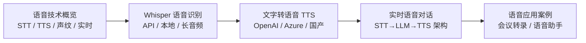
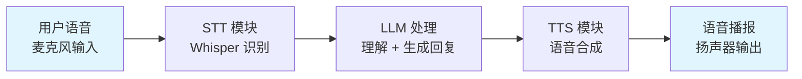

# 第3章 · 语音识别与合成 — 构建语音交互应用

> **时长**：约 2.5 小时 ｜ **难度**：⭐⭐ ｜ **类型**：讲解 + 动手实操
>
> **目标**：掌握语音转文字（STT）和文字转语音（TTS）技术，构建实时语音交互应用

---

## 学习目标

学完本章后，你将能够：
- 理解语音技术的基本概念和分类
- 使用 Whisper API 实现高精度语音识别
- 使用 TTS API 实现自然语音合成
- 了解实时语音对话的架构设计
- 构建会议转录、语音助手等典型应用

---

## 知识地图



---

## 1、语音技术概览

### 1.1 语音识别（ASR / STT）

**概念定义**：语音识别（Automatic Speech Recognition, ASR）也叫语音转文字（Speech-to-Text, STT），是将人类语音信号转换为文本的技术。

**核心定位**：STT 是语音交互的第一道关卡——用户说话 → 变成文字 → LLM 处理。精准的语音识别决定了整个交互链路的起点质量。

| 技术指标 | 说明 | 优秀水平 |
|---------|------|---------|
| WER（词错率） | 识别错误的词占比 | < 5% |
| 实时率（RTF） | 处理时长 / 语音时长 | < 0.5 |
| 语言支持 | 支持多少种语言 | 100+ |
| 端点检测 | 自动判断说话结束 | 准确率 > 95% |

### 1.2 语音合成（TTS）

**概念定义**：语音合成（Text-to-Speech, TTS）是将文本转换为自然语音的技术。现代 TTS 系统使用神经网络生成高度自然的语音，支持多种音色、语调和情感。

**核心定位**：TTS 是语音交互的输出环节——LLM 生成文字回复 → 变成语音播报给用户。好的 TTS 让交互从"机器发声"变成"真人对话"。

### 1.3 声纹识别

**概念定义**：声纹识别（Speaker Recognition）是从语音中识别说话人身份的技术，包括声纹验证（是不是本人）和声纹辨认（是谁在说话）。

**典型应用**：
- 语音登录和支付验证
- 会议自动标记谁在发言
- 个性化语音交互

### 1.4 实时语音处理

实时语音处理的挑战：
- **延迟**：人耳能感知 200ms 以上的延迟，需控制在 100ms 以内
- **流式处理**：边说话边识别，不等说完
- **打断处理**：用户随时可以打断 AI 的讲话
- **回声消除**：麦克风可能捕捉到扬声器的声音

---

## 2、Whisper 语音识别

### 2.1 Whisper 模型介绍

**概念定义**：Whisper 是 OpenAI 开源的通用语音识别模型，2022 年发布。它在大规模多语言数据集上训练，支持 100+ 种语言的识别、翻译和语言检测。

**核心优势**：
- **多语言**：支持 100+ 种语言，中文识别优秀
- **多任务**：识别、翻译、语言检测、时间戳
- **鲁棒性**：对噪声、口音、背景音的容忍度高
- **开源**：可本地部署，数据不外传

| 模型版本 | 参数规模 | 相对速度 | 推荐场景 |
|---------|---------|---------|---------|
| tiny | 39M | 32x | 嵌入式、实时 |
| base | 74M | 16x | 实时、移动端 |
| small | 244M | 6x | 通用、性价比高 |
| medium | 769M | 2x | 高精度 |
| large-v3 | 1550M | 1x | 最高精度 |

### 2.2 OpenAI Whisper API

### ▶ 执行代码

```powershell
cd code/12-multimodal/code
python 01_whisper_transcribe.py
```

```python
from openai import OpenAI

client = OpenAI()

# 基础转写
audio_file = open("speech.mp3", "rb")
transcript = client.audio.transcriptions.create(
    model="whisper-1",
    file=audio_file,
    response_format="text",
)
print(transcript)
```

#### 音频格式支持

| 格式 | 支持 | 说明 |
|------|------|------|
| mp3 | ✅ | 最常用 |
| wav | ✅ | 无损 |
| m4a | ✅ | iPhone 录音 |
| ogg | ✅ | 常见 |
| flac | ✅ | 无损压缩 |
| webm | ✅ | 网页录音 |

**最大文件**：25MB（API 限制），超过需要分段处理。

#### 语言检测

```python
# 指定语言可提升准确率
transcript = client.audio.transcriptions.create(
    model="whisper-1",
    file=audio_file,
    language="zh",         # ISO 639-1 语言代码
    response_format="text",
)
```

#### 时间戳输出

```python
# 获取带时间戳的转录结果
transcript = client.audio.transcriptions.create(
    model="whisper-1",
    file=audio_file,
    response_format="srt",    # 或 vtt 格式
)

# SRT 格式输出示例：
# 1
# 00:00:01,000 --> 00:00:04,500
# 大家好，今天我们来讨论一下AI技术。

# 2
# 00:00:04,500 --> 00:00:08,200
# 首先，让我们看一下目前的发展现状。
```

### 2.3 本地部署 Whisper

**适用场景**：数据隐私要求高、高频调用、网络不稳定。

```python
import whisper

# 加载模型（首次运行会自动下载）
model = whisper.load_model("base")  # 可选: tiny/base/small/medium/large

# 转写
result = model.transcribe("speech.mp3", language="zh")
print(result["text"])

# 获取带时间戳的片段
for segment in result["segments"]:
    start = segment["start"]
    end = segment["end"]
    text = segment["text"]
    print(f"[{start:.1f}s - {end:.1f}s] {text}")
```

### 2.4 长音频处理

API 限制音频文件最大 25MB。超过此限制需要分段处理：

```python
from pydub import AudioSegment

def split_audio(file_path: str, max_size_mb: int = 24) -> list:
    """将音频文件分割成不超过 max_size_mb 的片段"""
    audio = AudioSegment.from_file(file_path)
    file_size_mb = len(audio.raw_data) / (1024 * 1024)
    
    if file_size_mb <= max_size_mb:
        return [(file_path, 0, len(audio))]
    
    # 计算分段数量
    num_segments = int(file_size_mb / max_size_mb) + 1
    segment_duration = len(audio) // num_segments
    
    segments = []
    for i in range(num_segments):
        start = i * segment_duration
        end = (i + 1) * segment_duration if i < num_segments - 1 else len(audio)
        segment = audio[start:end]
        segment_path = f"{file_path}_part_{i}.mp3"
        segment.export(segment_path, format="mp3")
        segments.append((segment_path, start, end))
    
    return segments

# 分段转写并拼接
def transcribe_long_audio(file_path: str) -> str:
    segments = split_audio(file_path)
    full_text = []
    
    for segment_path, start, end in segments:
        with open(segment_path, "rb") as f:
            transcript = client.audio.transcriptions.create(
                model="whisper-1",
                file=f,
                response_format="text",
            )
        full_text.append(transcript)
    
    return "\n".join(full_text)
```

### 2.5 精度优化

| 场景 | 问题 | 优化方法 |
|------|------|---------|
| 噪音环境 | 背景音干扰 | 先降噪处理（noisereduce 库） |
| 专业术语 | 识别为常见词 | 提供提示词 `prompt` 参数 |
| 中英混杂 | 语言切换不准确 | 指定语言为中文 |
| 多人对话 | 分不清说话人 | 配合声纹识别做 diarization |

```python
# 使用提示词提升专业术语的识别准确率
transcript = client.audio.transcriptions.create(
    model="whisper-1",
    file=audio_file,
    prompt="以下对话涉及AI和机器学习，术语包括：Transformer、扩散模型、LoRA、RAG", 
    language="zh",
)
```

---

## 3、文字转语音（TTS）

### 3.1 OpenAI TTS API

**概念定义**：OpenAI TTS API 提供基于神经网络的文本转语音能力。支持多种音色、语速和情感控制，生成自然的语音输出。

### ▶ 执行代码

```powershell
python 02_tts_demo.py
```

```python
from openai import OpenAI

client = OpenAI()

response = client.audio.speech.create(
    model="tts-1",                # 标准版
    voice="alloy",                 # 音色选择
    input="你好，我是你的AI语音助手，今天有什么可以帮你的？",
    speed=1.0,                     # 语速 0.25 - 4.0
    response_format="mp3",         # 输出格式
)

# 保存到文件
response.stream_to_file("output.mp3")
```

#### 音色选择

| 音色 | 特点 | 适合场景 |
|------|------|---------|
| alloy | 中性、平衡 | 通用助手 |
| echo | 男性、沉稳 | 播报新闻 |
| fable | 英式口音、温和 | 讲故事 |
| nova | 女性、温暖 | 客服、导购 |
| shimmer | 女性、明亮 | 通知提醒 |
| coral | 乐观、友善 | 引导提示 |

#### 语速控制

```python
# 快速播报（适合摘要）
fast_speech = client.audio.speech.create(
    model="tts-1",
    voice="alloy",
    input="这是一段快速播报的测试内容。",
    speed=1.3,
)

# 慢速（适合教学、发音清晰）
slow_speech = client.audio.speech.create(
    model="tts-1",
    voice="nova",
    input="请跟我一起朗读这个单词。",
    speed=0.8,
)
```

#### 输出格式

| 格式 | 说明 | 文件大小 |
|------|------|---------|
| mp3 | 通用，兼容性好 | 中等 |
| opus | 压缩比高 | 小 |
| aac | iOS 原生 | 中等 |
| flac | 无损 | 大 |
| wav | 无压缩 | 最大 |

### 3.2 Azure Speech

微软 Azure Speech 提供更专业的 TTS 能力，支持情感控制和 SSML（语音合成标记语言）：

```python
import azure.cognitiveservices.speech as speechsdk

speech_config = speechsdk.SpeechConfig(
    subscription="your_key",
    region="eastasia"
)
speech_config.speech_synthesis_voice_name = "zh-CN-XiaoxiaoNeural"

# SSML 控制：语速、停顿、强调
ssml = """
<speak version="1.0" xmlns="http://www.w3.org/2001/10/synthesis" xml:lang="zh-CN">
    <voice name="zh-CN-XiaoxiaoNeural">
        <prosody rate="+10%" pitch="+5%">
            你好，<break time="500ms"/>欢迎使用Azure语音服务。
            <emphasis level="strong">这是重点内容。</emphasis>
        </prosody>
    </voice>
</speak>
"""

synthesizer = speechsdk.SpeechSynthesizer(speech_config=speech_config)
result = synthesizer.speak_ssml(ssml)
```

### 3.3 国产方案：阿里 / 讯飞

| 平台 | 特点 | 音色数量 | 定价模式 |
|------|------|---------|---------|
| 阿里云 TTS | 中文自然度高，支持情感 | 100+ | 按字符计费 |
| 讯飞 TTS | 中文最优，方言支持 | 200+ | 按调用次数 |
| 百度 TTS | 免费额度大 | 50+ | 按字符计费 |

**阿里云示例**：

```python
from aliyunsdkcore.client import AcsClient
from aliyunsdkcore.request import CommonRequest

client = AcsClient(access_key_id, access_secret, 'cn-shanghai')

request = CommonRequest()
request.set_domain('nls-slp.cn-shanghai.aliyuncs.com')
request.set_version('2019-09-05')
request.set_action_name('SubmitTextToVoiceTask')

params = {
    'Text': '你好，欢迎使用阿里云语音合成服务。',
    'Voice': 'aixia',
    'Volume': 50,
    'SpeechRate': 0,
    'PitchRate': 0,
}
```

### 3.4 质量对比

| 对比维度 | OpenAI TTS | Azure Speech | 阿里云 TTS | 讯飞 TTS |
|---------|-----------|-------------|-----------|---------|
| 中文自然度 | 良好 | 优秀 | 优秀 | 最优 |
| 英文自然度 | 优秀 | 优秀 | 良好 | 良好 |
| 情感控制 | 无 | SSML 支持 | 情感参数 | 情感参数 |
| 方言 | 无 | 部分 | 部分 | 丰富 |
| 延迟 | 低 | 中等 | 低 | 低 |
| 成本 | 中等 | 较高 | 低 | 低 |

---

## 4、实时语音对话

### 4.1 架构设计

**概念定义**：实时语音对话系统的核心流程是 STT → LLM → TTS，即"语音转文字 → 大模型处理 → 文字转语音"。这被称为级联架构，是目前最成熟的方案。



**端到端模型**：新一代模型（如 GPT-4o 的音频模式）直接处理语音输入输出，跳过中间的文本转换环节——延迟更低、信息损耗更少，但 API 访问受限。

### 4.2 延迟优化

语音交互对延迟极为敏感。以下是各环节的延迟优化策略：

| 环节 | 典型延迟 | 优化方法 |
|------|---------|---------|
| 语音采集 | 20ms | 使用低延迟麦克风驱动 |
| STT 识别 | 200-500ms | 使用流式识别（边录边识） |
| LLM 推理 | 500-2000ms | 使用流式输出、轻量模型 |
| TTS 合成 | 200-500ms | 使用流式合成（边生边播） |

**目标**：端到端延迟控制在 1-2 秒以内。

### 4.3 打断处理

**概念定义**：打断（Interruption）处理是语音交互的关键体验——用户可以在 AI 说话时随时插话，系统需立即停止当前语音输出，开始倾听用户的新输入。

```python
class VoiceInteraction:
    def __init__(self):
        self.is_speaking = False
        self.should_stop = False
    
    def play_audio(self, audio_stream):
        """播放语音（支持打断）"""
        self.is_speaking = True
        
        for chunk in audio_stream:
            if self.should_stop:        # 检测到用户打断
                self.should_stop = False
                break
            # 播放 audio chunk
            yield chunk
        
        self.is_speaking = False
    
    def on_user_start_speaking(self):
        """用户开始说话时触发"""
        if self.is_speaking:
            self.should_stop = True    # 停止当前播放
```

### 4.4 OpenAI Realtime API

**概念定义**：OpenAI Realtime API（2024 年发布）支持直接建立 WebSocket 连接，实现低延迟的双向语音交互。无需分别调用 STT、LLM、TTS，通过一个连接完成完整对话。

```python
# Realtime API 伪代码示例（简化）
import asyncio
import websockets
import json

async def realtime_voice_chat():
    async with websockets.connect(
        "wss://api.openai.com/v1/realtime",
        extra_headers={
            "Authorization": f"Bearer {api_key}",
            "OpenAI-Beta": "realtime=v1",
        }
    ) as ws:
        # 配置会话
        await ws.send(json.dumps({
            "type": "session.update",
            "session": {
                "modalities": ["audio", "text"],
                "instructions": "你是一个友好的语音助手，请用中文回答。",
                "voice": "alloy",
            }
        }))
        
        # 持续发送音频并接收回复
        async for message in ws:
            event = json.loads(message)
            # 处理音频响应事件
```

---

## 5、语音应用案例

### 5.1 会议转录

### ▶ 执行代码

```powershell
python 03_voice_assistant.py
```

```python
def transcribe_meeting(audio_path: str) -> dict:
    """会议语音转文字 + 说话人标记（模拟）"""
    # 1. 语音识别
    result = model.transcribe(audio_path, language="zh")
    
    # 2. 结构化输出
    meeting = {
        "full_text": result["text"],
        "segments": [],
        "summary": ""
    }
    
    for seg in result["segments"]:
        meeting["segments"].append({
            "start": seg["start"],
            "end": seg["end"],
            "text": seg["text"].strip(),
        })
    
    # 3. 调用 LLM 生成会议摘要
    summary = llm.invoke(f"请总结以下会议内容：\n{result['text']}")
    meeting["summary"] = summary
    
    return meeting
```

### 5.2 语音助手

```python
def voice_assistant():
    """简易语音助手（STT → LLM → TTS）"""
    recognizer = sr.Recognizer()
    
    with sr.Microphone() as source:
        print("请说话...")
        audio = recognizer.listen(source, timeout=5, phrase_time_limit=10)
    
    # STT
    text = client.audio.transcriptions.create(
        model="whisper-1",
        file=audio.get_wav_data(),
    ).text
    print(f"你说: {text}")
    
    # LLM
    reply = llm.invoke(text)
    print(f"AI: {reply}")
    
    # TTS
    speech = client.audio.speech.create(
        model="tts-1",
        voice="alloy",
        input=reply,
    )
    speech.stream_to_file("reply.mp3")
```

### 5.3 播客生成

```python
def generate_podcast(topic: str, duration_minutes: int = 5) -> str:
    """自动生成播客音频"""
    # 1. 生成播客脚本
    script_prompt = f"""写一段 {duration_minutes} 分钟的播客对话稿，主题是：{topic}。
格式：主持人A和嘉宾B的对话形式。
要求：口语化、有互动、有总结。"""
    
    script = llm.invoke(script_prompt)
    
    # 2. 分角色合成语音
    lines = parse_dialogue(script)
    audio_segments = []
    
    for speaker, text in lines:
        voice = "alloy" if speaker == "主持人A" else "nova"
        speech = client.audio.speech.create(
            model="tts-1",
            voice=voice,
            input=text,
        )
        audio_segments.append(speech.content)
    
    # 3. 合并音频
    combined = merge_audio(audio_segments)
    output_path = f"podcast_{topic}.mp3"
    combined.export(output_path, format="mp3")
    
    return output_path
```

### 5.4 语音翻译

```python
def voice_translate(audio_path: str, target_lang: str = "en") -> str:
    """语音翻译：输入中文语音，输出英文语音"""
    # 1. 识别源语言
    transcript = client.audio.transcriptions.create(
        model="whisper-1",
        file=open(audio_path, "rb"),
    ).text
    
    # 2. 翻译文字
    translated = client.chat.completions.create(
        model="gpt-4o",
        messages=[{"role": "user", "content": f"翻译成{target_lang}：{transcript}"}]
    ).choices[0].message.content
    
    # 3. 合成目标语言语音
    speech = client.audio.speech.create(
        model="tts-1",
        voice="alloy",
        input=translated,
    )
    
    return speech.content
```

---

## 常见踩坑

1. **音频格式不兼容**：Whisper API 不支持某些稀有格式，建议统一转为 mp3 或 wav
2. **文件超过 25MB**：API 有大小限制，长音频需要分段处理再拼接
3. **TTS 语音生硬**：不使用 SSML 或情感参数时，TTS 可能听起来机械，建议加适当停顿和语调变化
4. **实时对话延迟过高**：未使用流式处理时端到端延迟可能超过 3 秒，远超可接受范围
5. **中文多音字问题**：TTS 可能读错多音字（如"行"读作 háng 还是 xíng），Azure 等支持 SSML 注音可解决

---

## 课后练习

1. 录制一段 30 秒的中文语音，分别用 Whisper API 和本地 whisper 模型识别，对比准确率和速度
2. 实现一个"语音翻译器"：输入中文语音，输出英文语音
3. 用多种 TTS 音色朗读同一段文字，对比自然度差异
4. 构建一个简易的语音助手：录音 → 识别 → LLM 回复 → TTS 播放

---

## 本节小结

- ✅ 了解了语音技术的基本体系（STT / TTS / 声纹 / 实时）
- ✅ 掌握了 Whisper API 和本地部署的语音识别方法
- ✅ 学会了长音频的分段处理和精度优化
- ✅ 掌握了 OpenAI TTS、Azure Speech 和国产方案的语音合成
- ✅ 理解了实时语音对话的 STT → LLM → TTS 架构设计
- ✅ 了解了打断处理、延迟优化等关键体验技术
- ✅ 实现了会议转录、语音助手、播客生成等典型应用

---

> **下一章**：第4章 · 视频理解与生成 — 视频 AI 技术入门，从视频分析到 AI 生成
