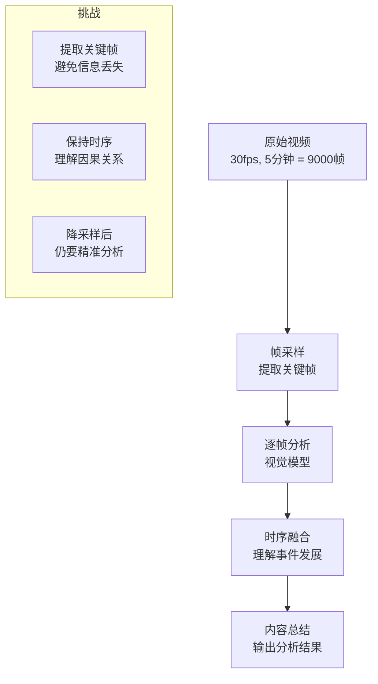
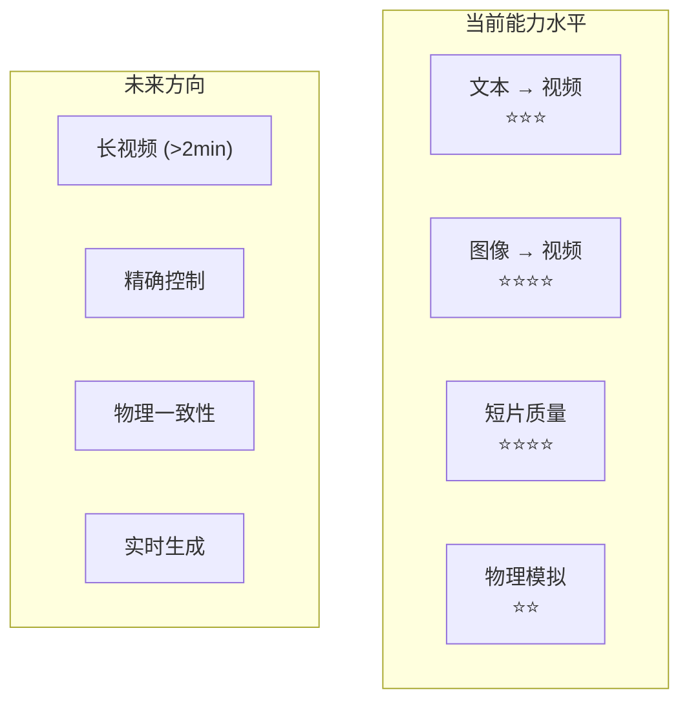

# 第4章 · 视频理解与生成 — 视频 AI 技术入门

> **时长**：约 2.5 小时 ｜ **难度**：⭐⭐ ｜ **类型**：讲解 + 动手实操
>
> **目标**：了解视频 AI 的核心技术，掌握视频分析方法，了解视频生成模型的使用

---

## 学习目标

学完本章后，你将能够：
- 理解视频分析的核心挑战和帧采样策略
- 使用视觉模型对视频进行场景描述和内容总结
- 了解主流视频生成模型及其能力边界
- 使用视频生成 API 从文本或图像生成视频
- 掌握短视频生成、产品展示等典型应用场景

---

## 知识地图


---

## 1、视频理解

### 1.1 视频分析挑战

**概念定义**：视频理解是指让 AI 模型自动分析视频内容——包括场景识别、目标跟踪、动作检测、内容总结等。与单张图像分析不同，视频分析需要考虑时序维度的信息。

**核心定位**：视频理解是视觉能力和时序理解的结合。它不仅要"看懂"每一帧的内容，还要理解帧与帧之间的变化、运动轨迹、事件发展等动态信息。

**视频分析的核心挑战**：

| 挑战 | 说明 | 影响 |
|------|------|------|
| 数据量巨大 | 1 分钟 1080p 视频 ≈ 1800 帧 | 无法逐帧分析 |
| 时序依赖 | 单帧看不出"动作" | 需要跨帧理解 |
| 冗余信息 | 相邻帧高度相似 | 大量计算浪费 |
| 多模态同步 | 音画需要对齐 | 增加分析复杂度 |
| 实时性要求 | 部分场景需实时处理 | 算力要求高 |



### 1.2 帧采样策略

**概念定义**：帧采样（Frame Sampling）是从视频流中选取代表性帧进行分析的策略。好的采样策略能在减少计算量的同时，最大限度地保留视频的关键信息。

| 采样策略 | 方法 | 适用场景 | 帧数（5分钟视频） |
|---------|------|---------|-----------------|
| 固定间隔 | 每 N 秒取一帧 | 监控回放、课程录像 | 300（每1秒） |
| 关键帧提取 | 检测画面突变点 | 视频剪辑、广告 | 50-200 |
| 场景切换 | 基于场景切分 | 电影、纪录片 | 20-50 |
| 随机采样 | 随机选取 | 快速预览 | 30-100 |
| 动态采样 | 根据内容密度调整 | 体育赛事、直播 | 不等 |

**关键帧提取实现**：

```python
import cv2
import numpy as np

def extract_keyframes(video_path: str, threshold: float = 30.0) -> list:
    """基于帧间差异提取关键帧"""
    cap = cv2.VideoCapture(video_path)
    keyframes = []
    prev_frame = None
    frame_idx = 0
    
    while True:
        ret, frame = cap.read()
        if not ret:
            break
        
        if prev_frame is not None:
            # 计算当前帧与前一帧的差异
            diff = cv2.absdiff(frame, prev_frame)
            mean_diff = np.mean(diff)
            
            # 差异超过阈值 → 关键帧
            if mean_diff > threshold:
                keyframes.append({
                    "frame_idx": frame_idx,
                    "timestamp": frame_idx / cap.get(cv2.CAP_PROP_FPS),
                    "image": frame
                })
        
        prev_frame = frame
        frame_idx += 1
    
    cap.release()
    return keyframes
```

### 1.3 使用视觉模型分析视频

**核心方法**：虽然没有专用于视频理解的 API，但我们可以通过"提取关键帧 → 逐帧分析 → 时序融合"的方式，用视觉模型理解视频内容。

#### 关键帧提取

### ▶ 执行代码

```powershell
cd code/12-multimodal/code
python 01_video_analysis.py
```

```python
def extract_frames_at_interval(video_path: str, interval_sec: int = 5) -> list:
    """每隔 interval_sec 秒提取一帧"""
    cap = cv2.VideoCapture(video_path)
    fps = cap.get(cv2.CAP_PROP_FPS)
    frame_interval = int(fps * interval_sec)
    
    frames = []
    frame_idx = 0
    
    while True:
        ret, frame = cap.read()
        if not ret:
            break
        
        if frame_idx % frame_interval == 0:
            timestamp = frame_idx / fps
            # 转为 JPEG Base64
            _, buffer = cv2.imencode('.jpg', frame)
            img_base64 = base64.b64encode(buffer).decode('utf-8')
            frames.append({
                "timestamp": timestamp,
                "data": img_base64
            })
        
        frame_idx += 1
    
    cap.release()
    return frames
```

#### 场景描述

```python
def describe_video_scene(video_path: str, max_frames: int = 10) -> str:
    """提取关键帧并让视觉模型逐段描述"""
    frames = extract_frames_at_interval(video_path, interval_sec=30)
    frames = frames[:max_frames]  # 控制 Token 消耗
    
    descriptions = []
    for i, frame in enumerate(frames):
        response = client.chat.completions.create(
            model="gpt-4o",
            messages=[
                {
                    "role": "user",
                    "content": [
                        {"type": "text", "text": f"请描述这个视频片段（第{i+1}段，时间戳{frame['timestamp']:.1f}秒）的画面内容。"},
                        {
                            "type": "image_url",
                            "image_url": {
                                "url": f"data:image/jpeg;base64,{frame['data']}",
                                "detail": "low"
                            }
                        }
                    ]
                }
            ],
            max_tokens=200,
        )
        descriptions.append({
            "timestamp": frame['timestamp'],
            "description": response.choices[0].message.content
        })
    
    return descriptions
```

#### 内容总结

```python
def summarize_video(video_path: str) -> str:
    """整体视频内容总结"""
    frame_descriptions = describe_video_scene(video_path)
    
    # 将所有描述合并，让 LLM 做整体总结
    timeline = "\n".join([
        f"[{d['timestamp']:.1f}s] {d['description']}"
        for d in frame_descriptions
    ])
    
    summary = client.chat.completions.create(
        model="gpt-4o",
        messages=[
            {
                "role": "user",
                "content": f"""以下是某视频的时间轴描述，请生成一份完整的视频内容总结：

{timeline}

请输出：
1. 视频主题概括
2. 关键事件时间线
3. 主要内容要点"""
            }
        ]
    )
    
    return summary.choices[0].message.content
```

### 1.4 专用视频模型

除"视觉模型 + 帧采样"的通用方法外，也有专门为视频理解设计的模型：

| 模型 | 特点 | 访问方式 |
|------|------|---------|
| Gemini Pro Vision | 原生视频理解，支持上传视频 | API（Google） |
| Video-LLaMA | 开源视频语言模型 | 本地部署 |
| InternVideo | 通用视频理解开源模型 | 本地部署 |
| Qwen-VL-Plus | 支持视频输入 | API（阿里云） |

**Gemini 视频分析**：

```python
import google.generativeai as genai

genai.configure(api_key=api_key)
model = genai.GenerativeModel('gemini-1.5-pro')

# 直接传入视频文件
video_file = genai.upload_file("demo_video.mp4")
response = model.generate_content([
    video_file,
    "请详细描述这个视频的内容，包括场景、人物和活动。"
])
print(response.text)
```

### 1.5 应用场景

| 场景 | 分析目标 | 关键挑战 |
|------|---------|---------|
| 监控安防 | 异常行为检测、人物追踪 | 实时性要求高 |
| 内容审核 | 暴力、色情、违规内容识别 | 准确率要求高 |
| 视频搜索 | 根据描述搜索视频片段 | 语义理解 |
| 智能剪辑 | 自动提取精彩片段 | 关键事件识别 |
| 教育分析 | 课堂互动、注意力分析 | 多人场景 |

---

## 2、视频生成模型

### 2.1 技术发展现状

**概念定义**：视频生成模型能够根据文本描述、图像或视频片段生成新的视频内容。这项技术从 2023 年开始快速发展，从早期的"几秒模糊片段"发展到如今的"高保真长视频"。

**核心定位**：视频生成被视为"图像生成的下一站"——当图像生成趋于成熟后，业界开始攻克更具挑战的视频生成。

**发展里程碑**：

| 时间 | 模型 | 突破 |
|------|------|------|
| 2023.02 | Runway Gen-1 | 首个商用视频生成模型 |
| 2023.06 | Runway Gen-2 | 文本/图像生成视频 |
| 2023.11 | Pika 1.0 | 轻量化视频生成 |
| 2024.02 | Sora (OpenAI) | 物理世界模拟级生成 |
| 2024.06 | Runway Gen-3 | 高保真视频 |
| 2024 下半年 | 国产模型涌现 | 可灵、Vidu、清影 |

### 2.2 主流模型对比

| 模型 | 开发商 | 最长时长 | 分辨率 | 访问方式 | 中文支持 |
|------|--------|---------|--------|---------|---------|
| Sora | OpenAI | 60s | 1080p | 内测中 | 良好 |
| Runway Gen-3 | Runway | 10s | 1080p | API/网页 | 一般 |
| Pika 2.0 | Pika Labs | 10s | 1080p | Discord/网页 | 一般 |
| 可灵 Kling | 快手 | 30s | 1080p | API/网页 | 优秀 |
| Vidu | 生数科技 | 16s | 1080p | 网页 | 优秀 |
| 清影 | 智谱 | 6s | 720p | API | 优秀 |

### 2.3 能力与局限

**当前能力**：
- 文本生成视频：从描述性文本生成连贯视频
- 图像生成视频：从静态图生成动画
- 风格化：写实、动漫、3D 等多种风格
- 镜头控制：推进、平移、旋转等运镜

**当前局限**：
- 时长限制：大多数模型只能生成 10-30 秒
- 物理一致性：物体交互时常违反物理规律
- 角色一致性：同一角色的外观在不同片段中不稳定
- 精细控制：难以精确控制物体运动轨迹
- 成本高昂：生成高质量视频的算力消耗远高于图像



---

## 3、视频生成 API 使用

### 3.1 Runway API

**概念定义**：Runway 是当前最成熟的商用视频生成平台之一，提供 Gen-2、Gen-3 等模型的 API 访问。

### ▶ 执行代码

```powershell
python 02_video_generation.py
```

```python
import runway

runway.api_key = "your_api_key"

# 文本生成视频
result = runway.generate(
    model="gen3",
    prompt="一只橘猫在花园里追逐蝴蝶，阳光明媚，慢动作",
    duration=5,              # 生成秒数
    width=1280,
    height=720,
)

# 获取生成的视频 URL
video_url = result["output"][0]
print(f"视频已生成: {video_url}")
```

### 3.2 文本生成视频

```python
def generate_video_from_text(
    prompt: str,
    duration: int = 5,
    style: str = "cinematic"
) -> str:
    """根据文本描述生成视频"""
    
    # 增强提示词
    enhanced_prompt = f"{prompt}, {style} quality, professional lighting, smooth motion"
    
    # 调用生成 API
    result = client.generate(
        model="gen3",
        prompt=enhanced_prompt,
        duration=duration,
        width=1920,
        height=1080,
        seed=None,  # 随机种子，固定可复现结果
    )
    
    return result["output"][0]
```

**提示词技巧**：

| 要素 | 说明 | 示例 |
|------|------|------|
| 主体 | 明确的核心对象 | "一只橘猫" |
| 动作 | 描述运动 | "在花园里追逐蝴蝶" |
| 环境 | 背景和氛围 | "阳光明媚的花园" |
| 镜头 | 拍摄方式 | "慢动作、特写、推镜头" |
| 风格 | 视觉风格 | "电影质感、自然光" |
| 时长 | 生成时长 | "5秒" |

### 3.3 图像生成视频

**概念定义**：图像生成视频（Image-to-Video）是以一张静态图像为起点，让模型预测接下来的运动，生成一段短视频。

```python
def generate_video_from_image(
    image_path: str,
    motion_prompt: str = "",
    duration: int = 5
) -> str:
    """从图像生成视频"""
    
    with open(image_path, "rb") as f:
        image_data = base64.b64encode(f.read()).decode("utf-8")
    
    result = client.generate(
        model="gen3",
        prompt=motion_prompt,      # 描述图像中发生的运动
        image=f"data:image/jpeg;base64,{image_data}",
        duration=duration,
        width=1280,
        height=720,
    )
    
    return result["output"][0]
```

### 3.4 参数控制

```python
def generate_video_with_params(
    prompt: str,
    duration: int = 5,
    motion_scale: float = 0.5,    # 运动强度 0-1
    camera: str = "static",        # static / pan / orbit / zoom
    negative_prompt: str = "",
) -> str:
    """带参数控制的视频生成"""
    
    params = {
        "model": "gen3",
        "prompt": prompt,
        "duration": duration,
        "motion_scale": motion_scale,
        "camera": camera,
        "negative_prompt": negative_prompt,
        "width": 1920,
        "height": 1080,
    }
    
    result = client.generate(**params)
    return result["output"][0]
```

| 参数 | 作用 | 可选值 |
|------|------|--------|
| duration | 视频时长 | 5, 10（秒） |
| motion_scale | 运动强度 | 0（静帧）~ 1（剧烈） |
| camera | 镜头运动 | static / pan / orbit / zoom |
| negative_prompt | 负面提示词 | 排除不想要的元素 |
| seed | 随机种子 | 整数（固定可复现） |

---

## 4、视频应用场景

### 4.1 短视频生成

**典型流程**：


### ▶ 执行代码

```powershell
python 03_video_workflow.py
```

```python
def create_short_video(scenes: list) -> str:
    """根据分镜列表生成短视频（每个分镜一个片段）"""
    video_segments = []
    
    for i, scene in enumerate(scenes):
        prompt = scene["prompt"]
        duration = scene.get("duration", 5)
        
        # 生成分段视频
        result = client.generate(
            model="gen3",
            prompt=prompt,
            duration=duration,
        )
        video_segments.append(result["output"][0])
    
    # 使用 ffmpeg 拼接各分段
    output_path = merge_video_segments(video_segments)
    return output_path
```

### 4.2 产品展示

利用视频生成技术创建动态产品展示，无需实际拍摄：

```python
def create_product_demo(product_name: str, features: list) -> str:
    """生成产品展示视频"""
    scenes = []
    
    # 开场：产品全景
    scenes.append({
        "prompt": f"A cinematic shot of {product_name} on a rotating pedestal, white background, studio lighting",
        "duration": 5,
    })
    
    # 各功能特写
    for feature in features:
        scenes.append({
            "prompt": f"Close-up shot of {product_name} {feature}, macro lens, slow motion",
            "duration": 4,
        })
    
    # 结尾
    scenes.append({
        "prompt": f"Full product shot of {product_name}, elegant fade out",
        "duration": 3,
    })
    
    return create_short_video(scenes)
```

### 4.3 教育内容

```python
def create_educational_clip(topic: str, description: str) -> str:
    """生成教育动画片段"""
    prompt = f"Educational animation showing {topic}: {description}"
    prompt += ", clear visuals, informative, calm narration tone"
    
    return generate_video_from_text(prompt, duration=10)
```

### 4.4 创意广告

AI 视频生成在广告创意领域的典型应用：
1. **概念可视化**：将创意脚本转为预览视频
2. **A/B 测试**：生成多个版本的创意对比效果
3. **快速迭代**：根据反馈快速修改视觉方案
4. **个性化**：为不同受众生成定制广告

---

## 常见踩坑

1. **帧采样太密集导致 Token 爆炸**：1 分钟视频每 1 秒采样一帧 = 60 帧，全部传给 GPT-4o 可能消耗数千 Token
2. **视频生成时长不宜过长**：当前模型单次生成超过 10 秒的视频质量明显下降，建议分段生成后拼接
3. **物理运动不自然**：复杂交互动作（如手部操作、液体流动）很容易出现不自然的效果
4. **角色/物体一致性差**：不同片段间的主角外观可能不一致，建议保持同一生成参数
5. **API 异步返回模式**：视频生成通常需要几十秒到几分钟，大多数 API 采用异步轮询模式，非实时返回

---

## 课后练习

1. 下载一个 3 分钟的短视频，用帧采样 + GPT-4o 分析其内容，生成时间轴描述
2. 用 Runway 或类似 API 从"一只在雪地里奔跑的狗"生成 5 秒视频
3. 对比同一提示词在不同视频生成模型（如可灵 vs Runway）的效果差异
4. 设计一个 15 秒的产品展示视频分镜，逐段生成并拼接

---

## 本节小结

- ✅ 理解了视频分析的核心挑战（数据量、时序、采样策略）
- ✅ 掌握了多种帧采样策略及其适用场景
- ✅ 学会了用视觉模型 + 帧采样分析视频内容
- ✅ 了解了主流视频生成模型的发展和对比
- ✅ 掌握了视频生成 API 的使用方法
- ✅ 实现了短视频生成、产品展示等典型应用
- ✅ 了解了视频 AI 当前的能力边界

---

> **下一章**：第5章 · 多模态 Agent — 跨模态智能体构建，融合图文音视频能力
