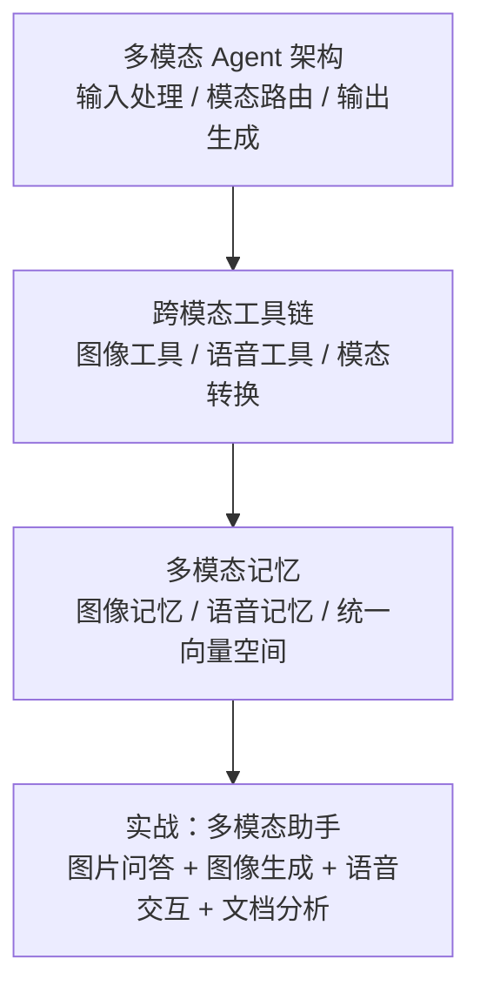
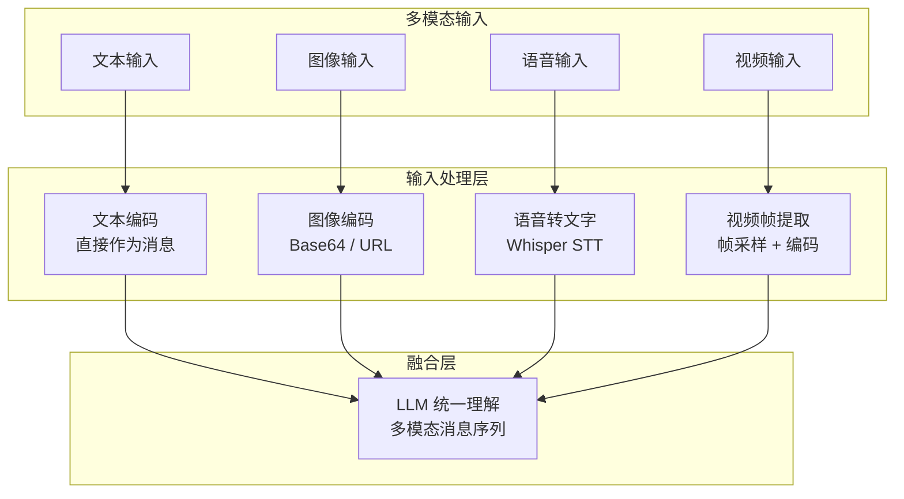
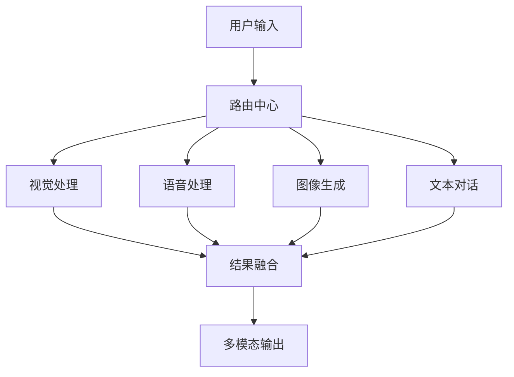
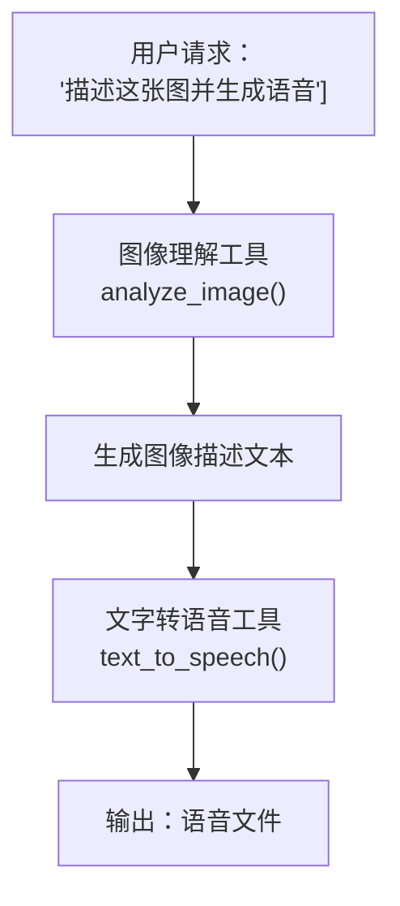
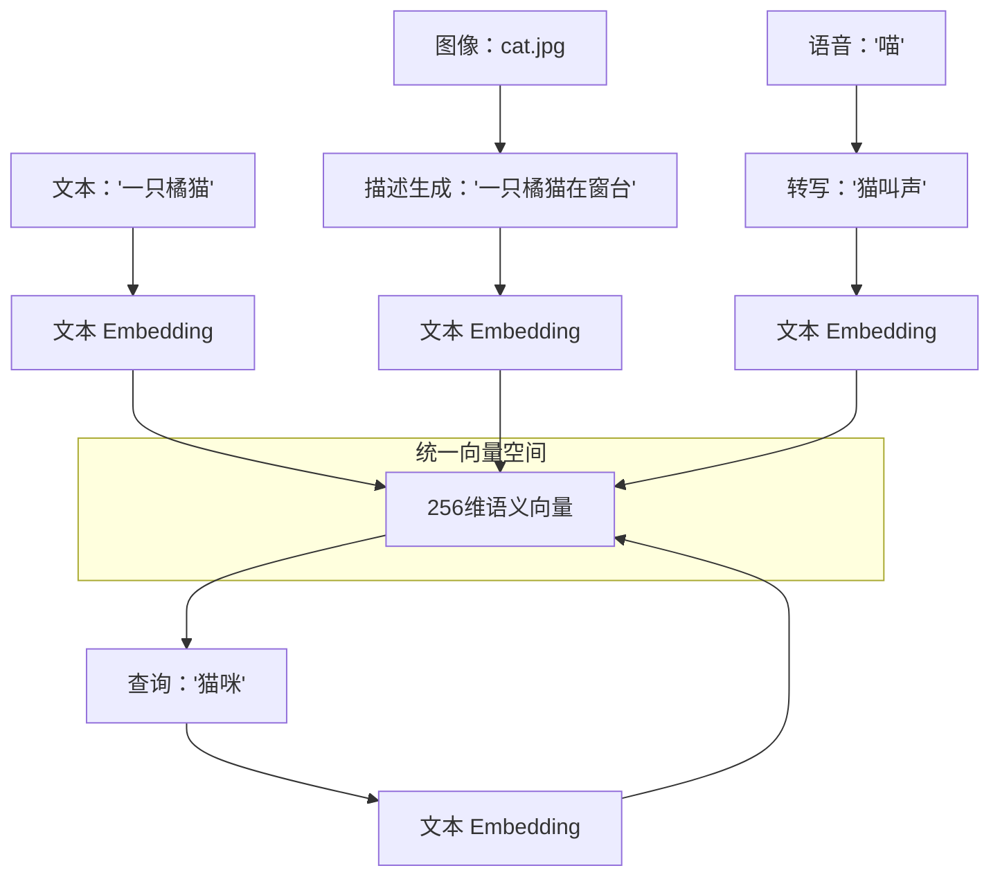
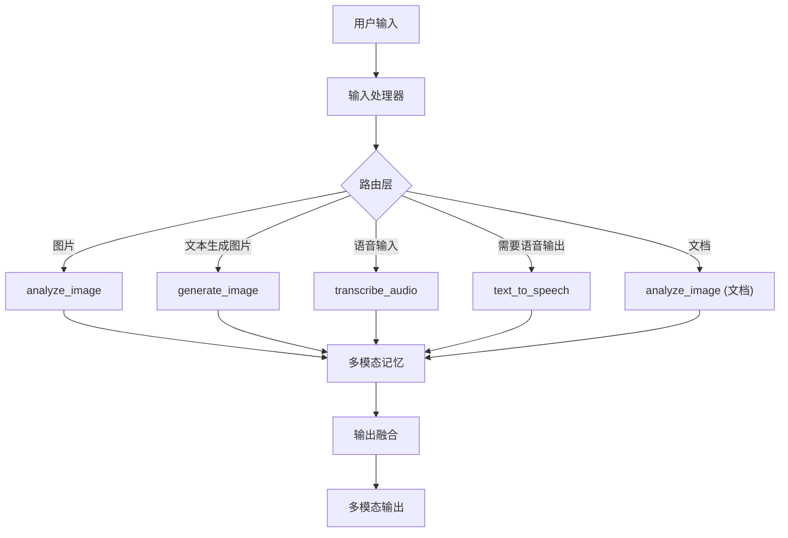
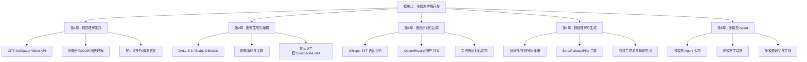

# 第5章 · 多模态 Agent — 跨模态智能体构建

> **时长**：约 3 小时 ｜ **难度**：⭐⭐⭐ ｜ **类型**：项目实战
>
> **目标**：理解多模态 Agent 的架构，学会构建跨模态工具链，实现图文音视频融合的智能助手

---

## 学习目标

学完本章后，你将能够：
- 理解多模态 Agent 的核心架构和设计模式
- 构建跨模态工具链（图像理解、图像生成、语音处理）
- 实现模态路由和模态转换
- 设计多模态记忆系统
- 构建一个完整的图文音视频多模态交互助手

---

## 知识地图



---

## 1、多模态 Agent 架构

### 1.1 输入处理

**概念定义**：多模态 Agent 区别于纯文本 Agent 的关键在于它能接收并理解多种类型的输入——文本、图像、语音、视频。输入处理模块负责将这些异构数据统一转换为 Agent 可处理的内部表示。

**核心定位**：多模态 Agent 的输入处理层相当于"感官系统"——将不同形式的感知信息标准化，让上层 LLM 能够统一理解和推理。



#### 文本输入

文本是最基本的输入形式，直接作为 LLM 消息内容处理。

#### 图像输入

```python
def process_image_input(image_source: str) -> dict:
    """处理图像输入：支持 Base64 和 URL"""
    if image_source.startswith(("http://", "https://")):
        return {"type": "image_url", "image_url": {"url": image_source, "detail": "high"}}
    else:
        with open(image_source, "rb") as f:
            b64 = base64.b64encode(f.read()).decode("utf-8")
        return {
            "type": "image_url",
            "image_url": {"url": f"data:image/jpeg;base64,{b64}", "detail": "high"}
        }
```

#### 语音输入

```python
def process_audio_input(audio_path: str) -> str:
    """处理语音输入：转写为文本"""
    with open(audio_path, "rb") as f:
        transcript = client.audio.transcriptions.create(
            model="whisper-1",
            file=f,
        )
    return transcript.text
```

#### 多模态融合

**概念定义**：多模态融合是将不同模态的信息整合到统一的语义空间中的过程。在多模态 Agent 中，融合层将所有输入（文本、图像描述、语音转写）合并成 LLM 可以处理的消息序列。

### 1.2 模态路由

**概念定义**：模态路由是多模态 Agent 的核心决策机制——根据用户输入的内容和意图，决定调用哪个模态的工具或模型来处理。

```python
class ModalityRouter:
    """模态路由器：判断输入类型并选择处理策略"""
    
    def route(self, user_input: dict) -> str:
        """判断输入的主要模态"""
        if user_input.get("image"):
            return "vision"
        elif user_input.get("audio"):
            return "speech"
        elif user_input.get("video"):
            return "video"
        else:
            # 纯文本 → 根据内容判断
            return self._route_by_text(user_input["text"])
    
    def _route_by_text(self, text: str) -> str:
        """根据文本内容判断意图"""
        text_lower = text.lower()
        
        if any(kw in text_lower for kw in ["画", "生成图片", "create image"]):
            return "image_generation"
        elif any(kw in text_lower for kw in ["语音", "朗读", "speak"]):
            return "tts"
        elif any(kw in text_lower for kw in ["视频", "video"]):
            return "video_generation"
        else:
            return "text_chat"
```

### 1.3 输出生成

多模态 Agent 的输出也可以是多种形式：

| 输出类型 | 生成方式 | 适用场景 |
|---------|---------|---------|
| 文本 | LLM 直接输出 | 通用回复 |
| 图像 | DALL-E / Stable Diffusion | 图片生成需求 |
| 语音 | TTS API | 语音交互场景 |
| 视频 | Runway / Pika | 视频生成 |
| 混合 | 组合多种输出 | 综合回复 |

```python
def generate_multimodal_response(agent_output: dict) -> dict:
    """根据 Agent 的决策生成多模态输出"""
    response = {"text": "", "images": [], "audio": None}
    
    if agent_output.get("text"):
        response["text"] = agent_output["text"]
    
    if agent_output.get("generate_image"):
        image = generate_image(agent_output["generate_image"])
        response["images"].append(image)
    
    if agent_output.get("speak"):
        speech = generate_speech(agent_output["speak"])
        response["audio"] = speech
    
    return response
```

### 1.4 架构设计模式

**模式一：中心化路由**



**模式二：LLM 原生路由**——让 LLM 自主决定调用哪些模态工具：

```python
def multimodal_agent_loop(user_input: dict) -> dict:
    """LLM 原生多模态路由"""
    messages = build_multimodal_messages(user_input)
    
    for step in range(5):  # 最多 5 步
        response = llm_with_tools.invoke(messages)
        messages.append(response)
        
        if not response.tool_calls:
            # LLM 判断完成，提取最终回复
            return parse_final_response(response)
        
        # 执行工具调用
        for tool_call in response.tool_calls:
            tool_name = tool_call["name"]
            tool_args = tool_call["args"]
            result = execute_multimodal_tool(tool_name, tool_args)
            messages.append(ToolMessage(content=result, tool_call_id=tool_call["id"]))
```

---

## 2、跨模态工具链

### 2.1 图像理解工具

```python
from langchain_core.tools import tool

@tool
def analyze_image(image_path: str, question: str = "") -> str:
    """分析图像内容。输入图片路径和可选的提问，返回分析结果。
    
    Args:
        image_path: 图像文件路径
        question: 可选，针对图像的特定问题
    """
    with open(image_path, "rb") as f:
        b64 = base64.b64encode(f.read()).decode("utf-8")
    
    prompt = question if question else "请详细描述这张图片的内容。"
    
    response = client.chat.completions.create(
        model="gpt-4o",
        messages=[{
            "role": "user",
            "content": [
                {"type": "text", "text": prompt},
                {"type": "image_url", "image_url": {"url": f"data:image/jpeg;base64,{b64}", "detail": "high"}}
            ]
        }]
    )
    return response.choices[0].message.content

@tool
def extract_text_from_image(image_path: str) -> str:
    """从图像中提取文字（OCR功能）。
    
    Args:
        image_path: 包含文字的图像文件路径
    """
    # ...调用视觉 API 提取文字
    return extracted_text
```

### 2.2 图像生成工具

```python
@tool
def generate_image(prompt: str, style: str = "vivid") -> str:
    """根据文本描述生成图像。
    
    Args:
        prompt: 图像描述
        style: 风格 (vivid/natural)
    """
    response = client.images.generate(
        model="dall-e-3",
        prompt=prompt,
        size="1024x1024",
        quality="standard",
        style=style,
        n=1,
    )
    return response.data[0].url

@tool
def edit_image(image_path: str, mask_path: str, prompt: str) -> str:
    """编辑图像的指定区域。
    
    Args:
        image_path: 原图路径
        mask_path: 蒙版路径（白色区域为编辑区域）
        prompt: 编辑描述
    """
    # DALL-E 2 inpainting
    response = client.images.edit(
        model="dall-e-2",
        image=open(image_path, "rb"),
        mask=open(mask_path, "rb"),
        prompt=prompt,
    )
    return response.data[0].url
```

### 2.3 语音处理工具

```python
@tool
def transcribe_audio(audio_path: str, language: str = "zh") -> str:
    """将语音转为文字。
    
    Args:
        audio_path: 音频文件路径
        language: 语言代码 (zh/en/ja)
    """
    with open(audio_path, "rb") as f:
        transcript = client.audio.transcriptions.create(
            model="whisper-1",
            file=f,
            language=language,
        )
    return transcript.text

@tool
def text_to_speech(text: str, voice: str = "alloy") -> str:
    """将文字转为语音。
    
    Args:
        text: 要朗读的文字
        voice: 音色 (alloy/echo/fable/nova/shimmer)
    """
    response = client.audio.speech.create(
        model="tts-1",
        voice=voice,
        input=text,
    )
    output_path = f"speech_{int(time.time())}.mp3"
    response.stream_to_file(output_path)
    return output_path
```

### 2.4 工具编排

**概念定义**：工具编排是多模态 Agent 的核心能力——将多个模态工具按照合理的顺序组合成一个完整的工作流，完成复杂的跨模态任务。



### ▶ 执行代码

```powershell
cd code/12-multimodal/code
python 01_multimodal_agent.py
python 02_cross_modal_tools.py
```

### 2.5 模态转换

**概念定义**：模态转换（Modality Conversion）是将一种模态的信息转换为另一种模态。这是多模态 Agent 最核心的能力之一：

| 转换方向 | 实现方式 | 应用场景 |
|---------|---------|---------|
| 图像 → 文本 | 视觉分析 | 图像描述、OCR |
| 文本 → 图像 | 图像生成 | 文生图 |
| 语音 → 文本 | STT | 语音识别 |
| 文本 → 语音 | TTS | 语音合成 |
| 图像 → 语音 | 图像→文本→语音 | 为图片生成解说 |
| 视频 → 文本 | 帧分析 + 总结 | 视频内容摘要 |

```python
@tool
def image_to_speech(image_path: str) -> str:
    """为图片生成语音解说。
    
    Args:
        image_path: 图像文件路径
    """
    # 1. 图像 → 文本
    description = analyze_image.invoke({"image_path": image_path, "question": "请简短描述这张图片"})
    
    # 2. 文本 → 语音
    audio_path = text_to_speech.invoke({"text": f"这是{description}", "voice": "nova"})
    
    return audio_path
```

---

## 3、多模态记忆

### 3.1 图像记忆

**概念定义**：多模态记忆使 Agent 能记住过去交互中出现的图像、语音等信息，并在后续对话中引用。图像记忆不只是存储图像文件，还需要存储图像的语义描述和向量表示。

```python
class ImageMemory:
    """图像记忆：存储图像的描述和特征"""
    
    def __init__(self):
        self.memory = []  # [{image_id, description, embedding, timestamp}]
    
    def remember_image(self, image_path: str, description: str):
        """存储图像到记忆"""
        embedding = self._get_image_embedding(description)
        self.memory.append({
            "image_id": f"img_{len(self.memory)}",
            "description": description,
            "embedding": embedding,
            "timestamp": time.time(),
        })
    
    def recall_image(self, query: str, top_k: int = 3) -> list:
        """根据查询检索相关图像"""
        query_embedding = self._get_text_embedding(query)
        scored = [
            (item, cosine_similarity(query_embedding, item["embedding"]))
            for item in self.memory
        ]
        scored.sort(key=lambda x: x[1], reverse=True)
        return [item for item, score in scored[:top_k]]
    
    def _get_image_embedding(self, text: str) -> list:
        """用文本编码器生成语义向量"""
        response = client.embeddings.create(
            model="text-embedding-3-small",
            input=text,
        )
        return response.data[0].embedding
```

### 3.2 语音记忆

```python
class AudioMemory:
    """语音记忆：存储语音片段的转写和摘要"""
    
    def __init__(self):
        self.memory = []
    
    def remember_audio(self, audio_path: str):
        """存储语音到记忆"""
        transcript = transcribe_audio.invoke({"audio_path": audio_path})
        embedding = self._get_embedding(transcript)
        self.memory.append({
            "audio_id": f"aud_{len(self.memory)}",
            "transcript": transcript,
            "embedding": embedding,
            "timestamp": time.time(),
        })
    
    def search_audio(self, query: str) -> list:
        """通过文本搜索相关语音片段"""
        query_emb = self._get_embedding(query)
        results = []
        for item in self.memory:
            sim = cosine_similarity(query_emb, item["embedding"])
            results.append((item, sim))
        results.sort(key=lambda x: x[1], reverse=True)
        return results
```

### 3.3 多模态检索

**概念定义**：多模态检索是指在同一个向量空间中，用任意模态的查询去检索任意模态的内容——用文本搜图像、用图像搜语音、用语音搜文本。

### ▶ 执行代码

```powershell
python 03_multimodal_memory.py
```

```python
class MultimodalRetriever:
    """统一的多模态检索器"""
    
    def __init__(self):
        self.items = []  # {type, content, embedding, metadata}
    
    def add_item(self, item_type: str, content: any, metadata: dict = None):
        """添加任意类型的记忆项"""
        # 生成统一向量
        text_repr = self._to_text_representation(item_type, content)
        embedding = self._get_embedding(text_repr)
        
        self.items.append({
            "type": item_type,
            "content": content,
            "text_repr": text_repr,
            "embedding": embedding,
            "metadata": metadata or {},
        })
    
    def search(self, query: str, top_k: int = 5) -> list:
        """统一检索：文本搜所有模态"""
        query_emb = self._get_embedding(query)
        scored = [
            (item, cosine_similarity(query_emb, item["embedding"]))
            for item in self.items
        ]
        scored.sort(key=lambda x: x[1], reverse=True)
        return scored[:top_k]
    
    def _to_text_representation(self, item_type: str, content: any) -> str:
        """将不同模态的内容转为统一文本表示"""
        if item_type == "text":
            return content
        elif item_type == "image":
            return f"[图像] {content.get('description', '')}"
        elif item_type == "audio":
            return f"[语音] {content.get('transcript', '')}"
        elif item_type == "video":
            return f"[视频] {content.get('summary', '')}"
        return str(content)
```

### 3.4 统一向量空间

**概念定义**：统一向量空间的核心思想是用一个共享的 Embedding 模型将所有模态的信息映射到同一语义空间中。这样，文本"一只橘猫"和一张猫的照片在向量空间中的距离很近，跨模态检索就变成了简单的向量相似度计算。



---

## 4、实战：多模态助手

### 4.1 需求分析

构建一个完整的"多模态智能助手"，支持以下功能：

| 功能 | 输入 | 输出 | 使用的工具 |
|------|------|------|-----------|
| 图片问答 | 图片 + 问题 | 文本回答 | analyze_image |
| 图片生成 | 文本描述 | 图片 URL | generate_image |
| 语音交互 | 语音 | 语音 | transcribe_audio + text_to_speech |
| 文档分析 | PDF/图片 | 结构化信息 | analyze_image (文档模式) |
| 多模态记忆 | 任意 | 检索结果 | multimodal_retriever |

### 4.2 架构设计



### 4.3 功能实现

### ▶ 执行代码

```powershell
python 04_full_assistant.py
```

```python
from langgraph.prebuilt import create_react_agent
from langchain_openai import ChatOpenAI
from dotenv import load_dotenv
import os

load_dotenv()

# 初始化 LLM
llm = ChatOpenAI(
    model="gpt-4o",
    api_key=os.getenv("OPENAI_API_KEY"),
    temperature=0,
)

# 注册所有多模态工具
mm_tools = [
    analyze_image,
    extract_text_from_image,
    generate_image,
    edit_image,
    transcribe_audio,
    text_to_speech,
    image_to_speech,  # 模态转换工具
]

# 创建多模态 Agent
mm_agent = create_react_agent(
    model=llm,
    tools=mm_tools,
    prompt="""你是多模态智能助手，具有以下能力：

## 可用的多模态工具
1. **analyze_image**：分析图像内容，回答关于图像的问题
2. **extract_text_from_image**：从图像中提取文字（OCR）
3. **generate_image**：根据文本描述生成图像
4. **edit_image**：编辑图像的指定区域
5. **transcribe_audio**：将语音转为文字
6. **text_to_speech**：将文字转为语音
7. **image_to_speech**：为图片生成语音解说

## 交互原则
- 用户发送图片时，自动识别并分析
- 用户要求"画"或"生成"时，调用图像生成工具
- 用户发送语音时，先转写再处理
- 需要语音回复时，使用 TTS 生成
- 多步骤任务按顺序执行工具
- 始终用中文回复用户""",
)
```

### 4.4 完整示例

```python
def run_multimodal_assistant():
    """运行多模态助手交互示例"""
    
    # 场景1：图片问答
    result1 = mm_agent.invoke({
        "messages": [HumanMessage(content=[
            {"type": "text", "text": "这张图里有什么？"},
            {"type": "image_url", "image_url": {"url": "https://example.com/photo.jpg"}}
        ])]
    })
    print("图片分析:", result1["messages"][-1].content)
    
    # 场景2：图文生成
    result2 = mm_agent.invoke({
        "messages": [HumanMessage(content="画一幅江南水乡的水墨画，有拱桥、乌篷船和柳树")]
    })
    print("生成图片:", result2["messages"][-1].content)
    
    # 场景3：语音交互（假设已转录为文本）
    result3 = mm_agent.invoke({
        "messages": [HumanMessage(content="请朗读这首诗：床前明月光，疑是地上霜")]
    })
    print("语音回复已生成")
    
    # 场景4：文档分析
    result4 = mm_agent.invoke({
        "messages": [HumanMessage(content=[
            {"type": "text", "text": "请提取这份合同中的金额和日期"},
            {"type": "image_url", "image_url": {"url": "data:image/jpeg;base64,{contract_pdf_image}"}}
        ])]
    })
    print("文档分析:", result4["messages"][-1].content)
```

**跨模态交互示例流程**：

- 用户："帮我看看这张猫的照片，并给照片配一段语音描述"
- Agent 步骤：
  1. analyze_image(photo.jpg) → "一只橘猫在窗台上晒太阳"
  2. image_to_speech(photo.jpg) → "speech_describing_cat.mp3"
  3. 输出：文字描述 + 语音文件路径

---

## 常见踩坑

1. **模态路由判断不准**：LLM 可能把图像生成请求误判为图像分析，需在提示词中明确说明工具功能
2. **多工具调用顺序混乱**：Agent 可能不按合理顺序调用工具，建议在提示词中给出步骤示例
3. **记忆内容超出上下文窗口**：多模态记忆中的图像描述会消耗大量 Token，需要做摘要和截断
4. **工具执行超时**：图像生成和视频生成耗时较长（10-60 秒），Agent 的 recursion_limit 需要调大
5. **上下文切换开销**：每切换一次模态（如从图像分析转到语音合成）都需要重新构建消息格式，注意格式一致性

---

## 课后练习

1. 扩展多模态助手，添加"视频分析"功能——接收视频文件，输出内容总结
2. 实现一个"图生文→文生图"的模态转换循环：用一张图生成描述，再用描述生成新的图，观察信息损耗
3. 为多模态 Agent 添加记忆功能：记住之前看过的图片，支持"刚才那张图里的那只猫是什么颜色？"
4. 构建一个完整的"多模态客服助手"：支持用户发截图提问、语音描述问题、生成解决方案配图

---

## 本节小结

- ✅ 理解了多模态 Agent 的核心架构（输入处理 → 模态路由 → 输出生成）
- ✅ 掌握了跨模态工具链的构建方法（图像、语音、模态转换工具）
- ✅ 学会了多模态记忆的实现（图像记忆、语音记忆、统一向量空间）
- ✅ 理解了模态转换和跨模态检索的设计模式
- ✅ 构建了完整的图文音视频多模态助手
- ✅ 掌握了大模型原生的多模态路由和工具编排

---

## 模块12总结

经过本模块 5 章的学习，你已经掌握了多模态 AI 应用开发的完整技能体系：



**你现在具备的能力**：

- ✅ **视觉理解**：熟练使用 GPT-4o Vision 和 Claude Vision API，能够分析图像、提取文字、理解图表和文档
- ✅ **图像生成**：掌握 DALL-E 3 和 Stable Diffusion 的图像生成与编辑，精通提示词工程
- ✅ **语音交互**：能够用 Whisper 实现语音转文字，用 TTS 实现文字转语音，构建实时语音对话
- ✅ **视频处理**：了解视频分析方法和帧采样策略，掌握视频生成 API 的使用
- ✅ **多模态融合**：能够构建多模态 Agent，实现跨模态工具链、模态转换和多模态记忆

**下一步建议**：

学完本模块后，可以根据兴趣继续深入学习：
- **模块14：企业级应用实战** — 将多模态能力整合到完整的项目中
- **LangGraph 课程** — 构建更复杂的多模态 Agent 工作流
- **MCP 协议课程** — 将多模态能力通过 MCP 协议标准化为可复用的工具服务
