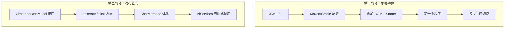
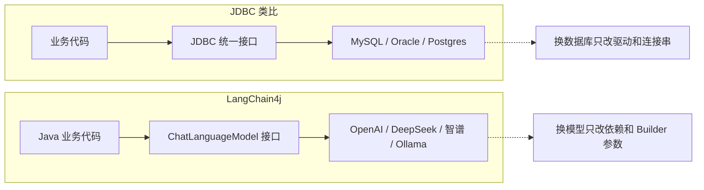

# 第1章 · 快速上手 — 从环境搭建到第一个 AI 应用

> **时长**：约 3 小时 ｜ **难度**：⭐ ｜ **类型**：动手实操
>
> **目标**：搭建 Java 开发环境，用 Maven/Gradle 引入 LangChain4j，理解核心组件，构建第一个 AI 对话应用

---

## 学习目标

学完本章后，你将能够：
- 用 Maven 或 Gradle 引入 LangChain4j 依赖
- 理解 LangChain4j 与 Python LangChain 的关系和差异
- 用 `ChatLanguageModel` 统一接口切换不同 LLM 提供商
- 理解 Temperature 参数的作用并正确选值
- 区分通用模型和推理模型的使用场景
- 用 `ChatLanguageModel.generate()` 和 `AiServices` 两种方式调用 LLM

---

## 知识地图



---

# 第一部分：环境搭建与入门

## 1、LangChain4j 是什么

LangChain4j 是 2023 年由 Java 社区发起的开源框架，用于在 Java 生态中开发由大语言模型（LLM）驱动的应用程序。它不是 Python LangChain 的简单移植，而是**完全重写**的、遵循 Java 习惯的独立框架。

**核心定位**：LangChain4j 之于 Java 大模型应用，就像 JDBC 之于数据库应用——统一接口，屏蔽差异。



**最新版本：1.16.1**（2026年6月）

**六大核心能力**：

| 能力 | 对应场景 | 对应章节 |
|------|---------|---------|
| 文本生成 | 翻译、摘要、文案 | 第1章 |
| 结构化输出 | 简历解析、合同要素抽取 | 第4章 |
| AI 服务（声明式） | 接口+注解，零样板代码 | 第3章 |
| 知识检索 (RAG) | 企业文档智能问答 | 第5章 |
| 工具调用 (Agent) | 自主查数据库、调 API | 第6章 |
| 对话记忆 | 上下文记忆、会话隔离 | 第7章 |

---

## 2、环境准备

### 2.1 前置要求

- JDK 17+（推荐 JDK 21 LTS）
- Maven 3.8+ 或 Gradle 8+
- IDE：IntelliJ IDEA / Eclipse / VS Code

### 2.2 Maven 项目配置

LangChain4j 使用 BOM（Bill of Materials）统一管理版本：

```xml
<!-- pom.xml -->
<project>
    <properties>
        <maven.compiler.source>17</maven.compiler.source>
        <maven.compiler.target>17</maven.compiler.target>
        <langchain4j.version>1.16.1</langchain4j.version>
    </properties>

    <dependencyManagement>
        <dependencies>
            <dependency>
                <groupId>dev.langchain4j</groupId>
                <artifactId>langchain4j-bom</artifactId>
                <version>${langchain4j.version}</version>
                <type>pom</type>
                <scope>import</scope>
            </dependency>
        </dependencies>
    </dependencyManagement>

    <dependencies>
        <!-- 核心依赖 -->
        <dependency>
            <groupId>dev.langchain4j</groupId>
            <artifactId>langchain4j</artifactId>
        </dependency>
        <!-- OpenAI 适配器（DeepSeek 兼容） -->
        <dependency>
            <groupId>dev.langchain4j</groupId>
            <artifactId>langchain4j-open-ai</artifactId>
        </dependency>
        <!-- 后续章节按需添加 -->
    </dependencies>
</project>
```

### 2.3 Gradle 项目配置

```groovy
// build.gradle
plugins {
    id 'java'
}

ext {
    langchain4jVersion = '1.16.1'
}

dependencies {
    implementation platform("dev.langchain4j:langchain4j-bom:${langchain4jVersion}")
    implementation 'dev.langchain4j:langchain4j'
    implementation 'dev.langchain4j:langchain4j-open-ai'
}
```

---

## 3、第一个程序：Hello LangChain4j

### ▶ 执行代码

```powershell
cd code/01-快速上手-代码案例
# Maven
mvn exec:java -Dexec.mainClass="com.example.HelloLangChain4j"
```

### 3.1 ChatLanguageModel —— 统一接口

```java
import dev.langchain4j.model.chat.ChatLanguageModel;
import dev.langchain4j.model.openai.OpenAiChatModel;

public class HelloLangChain4j {
    public static void main(String[] args) {
        // 创建模型（以 DeepSeek 为例，兼容 OpenAI 协议）
        ChatLanguageModel model = OpenAiChatModel.builder()
            .apiKey(System.getenv("DEEPSEEK_API_KEY"))
            .baseUrl("https://api.deepseek.com")
            .modelName("deepseek-chat")
            .build();

        // 最简单的调用
        String answer = model.generate("用一句话介绍 LangChain4j");
        System.out.println(answer);
    }
}
```

### 3.2 关键参数说明

```java
ChatLanguageModel model = OpenAiChatModel.builder()
    .apiKey(System.getenv("DEEPSEEK_API_KEY"))   // API 密钥（从环境变量读取）
    .baseUrl("https://api.deepseek.com")          // 自定义 API 地址
    .modelName("deepseek-chat")                   // 模型名称
    .temperature(0.7)                             // 创造性控制（0~2）
    .maxTokens(2048)                              // 最大输出 token 数
    .logRequests(true)                            // 打印请求日志
    .logResponses(true)                           // 打印响应日志
    .build();
```

> ⚠️ **安全原则**：API Key 绝不能硬编码在代码中。使用环境变量或配置文件注入。

---

## 4、多提供商切换

LangChain4j 支持 20+ LLM 提供商，切换只需改依赖和 Builder：

| 提供商 | 依赖 | Builder 类 |
|--------|------|----------|
| OpenAI | `langchain4j-open-ai` | `OpenAiChatModel` |
| DeepSeek | `langchain4j-open-ai` | `OpenAiChatModel`（兼容协议） |
| 智谱 GLM | `langchain4j-open-ai` | `OpenAiChatModel`（兼容协议） |
| Ollama（本地） | `langchain4j-ollama` | `OllamaChatModel` |
| Google Gemini | `langchain4j-google-ai-gemini` | `GoogleAiGeminiChatModel` |
| Anthropic Claude | `langchain4j-anthropic` | `AnthropicChatModel` |

### ▶ 执行代码

```powershell
cd code/01-快速上手-代码案例
mvn exec:java -Dexec.mainClass="com.example.ProviderComparison"
```

### 多提供商示例

```java
// DeepSeek（通过 OpenAI 兼容协议）
ChatLanguageModel deepseek = OpenAiChatModel.builder()
    .apiKey(System.getenv("DEEPSEEK_API_KEY"))
    .baseUrl("https://api.deepseek.com")
    .modelName("deepseek-chat")
    .build();

// 智谱 GLM（通过 OpenAI 兼容协议）
ChatLanguageModel zhipu = OpenAiChatModel.builder()
    .apiKey(System.getenv("ZHIPU_API_KEY"))
    .baseUrl("https://open.bigmodel.cn/api/paas/v4/")
    .modelName("glm-4-flash")
    .build();

// Ollama（本地运行，无需 API Key）
ChatLanguageModel ollama = OllamaChatModel.builder()
    .baseUrl("http://localhost:11434")
    .modelName("qwen2.5:7b")
    .build();
```

**切换模型只需改 Builder 参数，业务代码零改动。**

---

## 5、Temperature 实验

Temperature 控制模型输出的随机性，取值范围 0~2：

| Temperature | 行为 | 适用场景 |
|-------------|------|---------|
| 0.0 ~ 0.3 | 确定性输出，几乎每次相同 | 翻译、分类、事实性问答 |
| 0.5 ~ 0.7 | 适度创造性 | 摘要、文案、通用对话 |
| 0.8 ~ 1.2 | 高创造性 | 创意写作、头脑风暴 |
| 1.5+ | 非常随机，可能出现乱码 | 极少使用 |

### ▶ 执行代码

```powershell
cd code/01-快速上手-代码案例
mvn exec:java -Dexec.mainClass="com.example.TemperatureDemo"
```

```java
// 对比实验
for (double temp : new double[]{0.0, 0.7, 1.5}) {
    ChatLanguageModel model = OpenAiChatModel.builder()
        .apiKey(System.getenv("DEEPSEEK_API_KEY"))
        .baseUrl("https://api.deepseek.com")
        .modelName("deepseek-chat")
        .temperature(temp)
        .build();

    System.out.println("Temperature " + temp + ":");
    for (int i = 0; i < 3; i++) {
        System.out.println("  -> " + model.generate("写一句诗"));
    }
}
```

---

## 6、ChatMessage 体系

LangChain4j 提供了完整的消息类型系统：

```java
import dev.langchain4j.data.message.*;

// 系统消息：设定 AI 角色
SystemMessage systemMsg = SystemMessage.from("你是 Java 专家，用中文回答");

// 用户消息：用户的输入
UserMessage userMsg = UserMessage.from("什么是 CompletableFuture？");

// AI 消息：模型的响应
AiMessage aiMsg = AiMessage.from("CompletableFuture 是 Java 8 引入的...");

// 工具执行结果消息
ToolExecutionResultMessage toolMsg = ToolExecutionResultMessage.from(
    "tool-1", "getWeather", "{"temperature": 25}"
);
```

调用时传入消息列表：

```java
Response<AiMessage> response = model.generate(
    Arrays.asList(systemMsg, userMsg)
);
System.out.println(response.content().text());
```

---

## 7、AiServices —— 声明式 AI 调用（初体验）

AiServices 是 LangChain4j 最独特的功能——你只需定义接口，框架自动生成实现：

```java
// 1. 定义接口
interface Translator {
    @SystemMessage("你是专业翻译，将 {{sourceLanguage}} 翻译为 {{targetLanguage}}")
    String translate(
        @V("sourceLanguage") String source,
        @V("targetLanguage") String target,
        @UserMessage String text
    );
}

// 2. 创建实例（框架动态代理）
Translator translator = AiServices.create(Translator.class, model);

// 3. 像调用普通 Java 方法一样使用
String result = translator.translate("中文", "英文", "今天天气真好");
System.out.println(result);  // "The weather is really nice today"
```

> 💡 **核心洞察**：`AiServices.create()` 在运行时生成一个动态代理，将方法调用转换为 LLM 请求。你不需要写任何 HTTP 调用、JSON 解析、提示词拼接的代码。

---

## LangChain4j vs Python LangChain：一张表说清楚

| 维度 | Python LangChain | Java LangChain4j |
|------|-----------------|-----------------|
| **设计范式** | LCEL 管道（`prompt \| model \| parser`） | AI Services 声明式接口 |
| **调用方式** | 显式组装 Runnable 链 | 接口注解，框架自动实现 |
| **类型安全** | 动态类型（运行时） | 静态类型 + POJO（编译时） |
| **并发模型** | async I/O，GIL 限制 | JVM 线程，无 GIL |
| **生态集成** | 独立框架 | Spring Boot / Quarkus 原生集成 |
| **最适合** | 快速原型、Python ML 生态 | 企业 Java 后端、微服务架构 |
| **关系** | 两个独立项目 | 理念相似，API 完全不同 |

---

## 常见踩坑

1. **JDK 版本过低**：LangChain4j 要求 JDK 17+，必须配置 `maven.compiler.source=17`
2. **忘记引入 BOM**：不用 BOM 时需要手动指定每个依赖的版本，容易冲突
3. **API Key 硬编码**：`apiKey("sk-xxx")` 会导致密钥泄露——用环境变量或配置文件
4. **baseUrl 末尾斜杠**：`baseUrl("https://api.deepseek.com/")` 末尾斜杠可能导致路径拼接错误
5. **AiServices 接口方法参数缺少注解**：不带 `@UserMessage` 或 `@V` 的参数不会被识别

---

## 课后练习

1. 分别用 DeepSeek 和 Ollama 本地模型回答同一个问题，对比质量和速度
2. 用 temperature=0 和 temperature=1.5 让 LLM 写诗，观察差异
3. 写一个 `CodeReviewer` AI 服务接口：输入代码，输出中文审查意见
4. 对比 `model.generate()` 和 `AiServices` 两种调用方式的代码量差异

---

## 本节小结

- ✅ 用 Maven/Gradle 配置了 LangChain4j 1.16.1 环境
- ✅ 理解了 `ChatLanguageModel` 统一接口的设计理念
- ✅ 掌握了多提供商切换（DeepSeek / 智谱 / Ollama）
- ✅ 理解了 Temperature 的作用和选值依据
- ✅ 认识了 ChatMessage 体系（System / User / Ai / ToolExecutionResult）
- ✅ 体验了 AiServices 声明式调用的零样板代码威力

---

> **下一章**：第2章 · ChatModel 深度与提示词工程——消息体系深入、PromptTemplate、多模态支持
