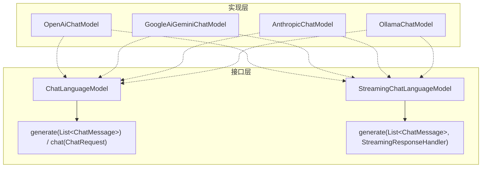

# 第2章 · ChatModel 深度与提示词工程 — 消息体系、模板与多模态

> **时长**：约 2.5 小时 ｜ **难度**：⭐⭐ ｜ **类型**：讲解 + 动手
>
> **目标**：深入理解 ChatLanguageModel 接口体系、消息类型层次、提示词模板、多模态输入，以及各提供商专属特性

---

## 学习目标

学完本章后，你将能够：
- 区分 `ChatLanguageModel` 与 `StreamingChatLanguageModel` 接口并正确选型
- 用 Builder 模式配置不同提供商的模型参数（temperature、maxTokens、topP 等）
- 熟练运用五种以上的 ChatMessage 子类型构建多轮对话
- 使用 `PromptTemplate` 进行提示词模板化，避免字符串拼接
- 通过 `UserMessage` 发送图文混合的多模态请求
- 了解各提供商（OpenAI、Anthropic、Gemini、Ollama）的专属特性
- 使用 `TokenCountEstimator` 估算 Token 消耗和成本

---

## 知识地图

```mermaid
graph TD
    subgraph A["ChatModel 接口"]
        A1[ChatLanguageModel 同步] & A2[StreamingChatLanguageModel 流式]
    end
    subgraph B["消息体系"]
        B1[SystemMessage] --> B5[角色设定]
        B2[UserMessage] --> B6[文本 + 图片多模态]
        B3[AiMessage] --> B7[文本 + Tool 请求]
        B4[ToolExecution*Message] --> B8[工具结果回传]
    end
    subgraph C["提示词"]
        C1[PromptTemplate {{var}}] --> C2[apply 填充] --> C3[调用模型]
    end
    subgraph D["高级"]
        D1[OpenAI o1/o3] & D2[Anthropic Thinking] & D3[Gemini Safety] & D4[TokenCountEstimator]
    end
    A1 --> B --> D
    A1 --> C
```

---

# 第一部分：ChatLanguageModel 深度解析

## 1、接口体系

LangChain4j 的模型接口分为同步和流式两层：



| 维度 | ChatLanguageModel | StreamingChatLanguageModel |
|------|------------------|---------------------------|
| 返回方式 | 阻塞等待完整响应 | 逐 token 回调 |
| 方法签名 | `Response<AiMessage> generate(...)` | `void generate(..., StreamingResponseHandler)` |
| 适用场景 | 翻译、分类、结构化抽取 | 聊天 UI、长文生成 |
| 首 token 延迟 | 完整生成时间 | 首 token 时间（快得多） |
| 异常处理 | try-catch | handler.onError 回调 |

> 💡 **最佳实践**：业务代码依赖接口而非实现类。面向 `ChatLanguageModel` / `StreamingChatLanguageModel` 编程。

---

## 2、Builder 模式与通用配置

```java
ChatLanguageModel model = OpenAiChatModel.builder()
    .apiKey(System.getenv("OPENAI_API_KEY"))
    .baseUrl("https://api.openai.com/v1")
    .modelName("gpt-4o")
    .temperature(0.7)          // 创造性 (0~2)
    .maxTokens(2048)           // 最大输出 token
    .topP(0.95)                // 核采样 (0~1)
    .frequencyPenalty(0.0)     // 频率惩罚 (-2~2)
    .presencePenalty(0.0)      // 存在惩罚 (-2~2)
    .logRequests(true)
    .logResponses(true)
    .build();
```

| 参数 | 范围 | 作用 |
|------|------|------|
| `temperature` | 0~2 | 随机性。0 确定性，越大越随机 |
| `maxTokens` | 1~模型上限 | 限制单次生成 token 数 |
| `topP` | 0~1 | 核采样阈值 |
| `frequencyPenalty` | -2~2 | 正值减少重复 |
| `presencePenalty` | -2~2 | 正值鼓励新话题 |

> ⚠️ **temperature 和 topP 不要同时调整**：通常固定一个，调节另一个。

### ▶ 执行代码

```java
// OpenAI
ChatLanguageModel openai = OpenAiChatModel.builder()
    .apiKey(System.getenv("OPENAI_API_KEY"))
    .modelName("gpt-4o").temperature(0.3).build();

// Anthropic Claude
ChatLanguageModel claude = AnthropicChatModel.builder()
    .apiKey(System.getenv("ANTHROPIC_API_KEY"))
    .modelName("claude-sonnet-4-20250514")
    .temperature(0.7).maxTokens(4096).build();

// Google Gemini
ChatLanguageModel gemini = GoogleAiGeminiChatModel.builder()
    .apiKey(System.getenv("GOOGLE_AI_API_KEY"))
    .modelName("gemini-2.5-flash-001").temperature(0.5).build();

// Ollama（本地，无需 API Key）
ChatLanguageModel ollama = OllamaChatModel.builder()
    .baseUrl("http://localhost:11434")
    .modelName("qwen2.5:7b").temperature(0.8).build();
```

---

## 3、模型选择指南

| 提供商 | 模型 | 推荐场景 | 多模态 | 备注 |
|--------|------|---------|--------|------|
| OpenAI | gpt-4o | 通用、结构化输出 | 图片 | 综合最强 |
| OpenAI | o3-mini | 数学、推理、代码 | 否 | 推理模型 |
| Anthropic | claude-sonnet-4 | 长文档、Agent | 图片 | 200K 上下文 |
| Google | gemini-2.5-flash | 高吞吐、成本敏感 | 图片+视频 | 1M 上下文 |
| Ollama | qwen2.5:7b | 本地开发、隐私 | 否 | 无需 API Key |
| DeepSeek | deepseek-chat | 性价比优先 | 图片 | 兼容 OpenAI |

**模型目录（v1.10.0+）**——内置模型元数据查询：

```java
ModelCatalog.getChatModels().forEach(meta ->
    System.out.println(meta.getName() + " | 上下文: " + meta.getMaxTokens()
        + " | 提供商: " + meta.getProvider()));
```

---

# 第二部分：ChatMessage 体系深度

## 4、完整消息层次结构

| 消息类型 | 创建方式 | 用途 | 关键特性 |
|---------|---------|------|---------|
| `SystemMessage` | `from("指令")` | 角色和行为设定 | 位于对话开头 |
| `UserMessage` | `from("问题")` | 用户输入 | 支持多 Content（图文混合） |
| `AiMessage` | `from("回复")` | 模型响应 | 可同时含文本 + tool 调用 |
| `ToolExecutionRequestMessage` | `from(...)` | 工具调用请求 | 含工具名和参数 |
| `ToolExecutionResultMessage` | `from(...)` | 工具结果回传 | 回传模型继续推理 |
| `CustomMessage` | `from(attrs)` | 扩展未知类型 | 属性可自定义 |

### ▶ 执行代码

```java
// 多轮对话消息列表
List<ChatMessage> messages = List.of(
    SystemMessage.from("你是 Java 代码审查专家"),
    UserMessage.from("审查代码：public int div(int a, int b) { return a / b; }"),
    AiMessage.from("存在除以零的风险，建议添加参数校验。"),
    UserMessage.from("请帮我修改")
);
Response<AiMessage> response = model.generate(messages);
```

**AiMessage 文本 + 工具请求共存**——LangChain4j 独特设计：

```java
AiMessage aiMsg = AiMessage.from(
    "我需要查询天气数据",
    List.of(ToolExecutionRequest.builder()
        .id("req-1").name("getWeather")
        .arguments("{\"city\": \"北京\"}").build())
);
System.out.println(aiMsg.hasToolExecutionRequests()); // true
```

> ⚠️ Python LangChain 中工具调用和文本分属不同消息；LangChain4j 的 AiMessage 可同时承载文本和多个 tool call。

**vs Python LangChain 消息体系**：

| 维度 | Python LangChain | Java LangChain4j |
|------|-----------------|-----------------|
| 基类 | `BaseMessage` 抽象类 | `ChatMessage` 接口 |
| AI+Tool | `AIMessage` + `ToolCallChunk` 分离 | `AiMessage.text()` + `toolExecutionRequests()` 共存 |
| 多模态 | `HumanMessage(content=[...])` | `UserMessage.from(TextContent, ImageContent)` |
| 类型安全 | 动态运行时 | 编译时类型安全 |

---

# 第三部分：PromptTemplate 提示词模板

## 5、模板引擎

`PromptTemplate` 使用 `{{variableName}}` 双花括号语法进行变量插值：

```java
PromptTemplate template = PromptTemplate.from(
    "你是{{language}}编程助手。请解释：\n```{{language}}\n{{code}}\n```"
);
dev.langchain4j.model.input.Prompt prompt = template.apply(Map.of(
    "language", "Java",
    "code", "var list = Stream.of(1,2,3).map(x -> x*2).toList();"
));
System.out.println(prompt.text());
// 输出：你是Java编程助手。请解释：
// ```java
// var list = Stream.of(1,2,3).map(x -> x*2).toList();
// ```
```

结合 ChatLanguageModel：

```java
Prompt prompt = PromptTemplate.from("""
    你是{{role}}。请用{{style}}风格回答：
    问题：{{question}}  要求：不超过{{maxWords}}字。
    """).apply(Map.of("role", "资深架构师", "style", "简洁",
          "question", "什么是微服务？", "maxWords", "100"));
String answer = model.generate(prompt.text());
```

**Fill Name（v1.10.0+）**——为模板命名方便日志追踪：

```java
PromptTemplate template = PromptTemplate.from("你好，{{name}}！")
    .fillName("greeting-template");
Prompt prompt = template.apply(Map.of("name", "小明"));
```

**PromptTemplate vs 注解**：

| 方式 | 适用场景 | 灵活性 |
|------|---------|--------|
| `PromptTemplate` | 代码中动态组装提示词 | 高，运行期 |
| `@SystemMessage/@UserMessage` | AiServices 声明式接口 | 低，编译期 |
| `@V` 注解 | AiServices 参数绑定 | 中，注解驱动 |

---

# 第四部分：多模态支持

## 6、图文混合输入

`UserMessage` 通过 `Content` 接口支持多模态，可同时携带 `TextContent` 和 `ImageContent`。

### ▶ 执行代码

```java
// URL 来源
UserMessage msg1 = UserMessage.from(
    TextContent.from("请描述这张图片"),
    ImageContent.from("https://example.com/photo.jpg"));

// base64 编码
String base64 = "iVBORw0KGgoAAAANSUhEUg...";
UserMessage msg2 = UserMessage.from(
    TextContent.from("图片中有什么？"),
    ImageContent.from(base64, "image/png"));

// 本地文件
Path path = Path.of("screenshot.png");
String b64 = Base64.getEncoder().encodeToString(Files.readAllBytes(path));
UserMessage msg3 = UserMessage.from(
    TextContent.from("分析这个截图"),
    ImageContent.from(b64, "image/png"));

// 完整示例：GPT-4o 分析图片
ChatLanguageModel gpt4o = OpenAiChatModel.builder()
    .apiKey(System.getenv("OPENAI_API_KEY"))
    .modelName("gpt-4o").build();
UserMessage userMsg = UserMessage.from(
    TextContent.from("这张图表展示了什么趋势？"),
    ImageContent.from("https://example.com/chart.png"));
Response<AiMessage> response = gpt4o.generate(List.of(
    SystemMessage.from("你是数据分析专家"), userMsg));
System.out.println(response.content().text());
```

**多模态支持**：

| 提供商 | 图片支持 | 模型要求 | 备注 |
|--------|---------|---------|------|
| OpenAI | 是 | gpt-4o, gpt-4o-mini | 多图，URL/base64 |
| Anthropic | 是 | claude-sonnet-4, claude-3.5-haiku | JPEG/PNG/WebP |
| Google Gemini | 是 | gemini-2.5-flash/pro | 还支持视频帧 |
| Ollama | 依赖模型 | llama3.2-vision, qwen2.5-vl | 需本地拉取视觉模型 |
| DeepSeek | 是 | deepseek-vl2 | 兼容 OpenAI 协议 |

> ⚠️ 一张 1080p 图片约消耗 200-500 token，多次发送高分辨率图片会快速消耗上下文窗口。

---

# 第五部分：提供商专属特性

## 7、OpenAI

**Strict JSON Schema（v1.10.0+）**：

```java
OpenAiChatModel model = OpenAiChatModel.builder()
    .apiKey(System.getenv("OPENAI_API_KEY"))
    .modelName("gpt-4o").strictJsonSchema(true).build();

JsonObjectSchema schema = JsonObjectSchema.builder()
    .addProperty("name", JsonStringSchema.INSTANCE)
    .addRequiredProperty("age", new JsonIntegerSchema()).build();
ResponseFormat format = ResponseFormat.builder()
    .type(ResponseFormatType.JSON).jsonSchema(schema).build();
```

**o1/o3 推理模型**——不支持 SystemMessage，temperature 固定为 1.0：

```java
ChatLanguageModel o3mini = OpenAiChatModel.builder()
    .apiKey(System.getenv("OPENAI_API_KEY"))
    .modelName("o3-mini").maxTokens(4096).temperature(1.0).build();
// 角色指令需合并到 UserMessage 中
String answer = o3mini.generate("你是一位数学专家。计算 ∫(3x² + 2x + 1)dx");
```

---

## 8、Anthropic

**Extended Thinking**——模型展示推理步骤：

```java
ChatLanguageModel claude = AnthropicChatModel.builder()
    .apiKey(System.getenv("ANTHROPIC_API_KEY"))
    .modelName("claude-sonnet-4-20250514")
    .maxTokens(8192)                // 总 token = 思考 + 可见
    .thinkingType("enabled")         // 启用扩展思考
    .thinkingBudgetTokens(4096)      // 思考 token 预算
    .build();
```

**严格工具调用（v1.10.0+）**：

```java
AnthropicChatModel model = AnthropicChatModel.builder()
    .apiKey(System.getenv("ANTHROPIC_API_KEY"))
    .modelName("claude-sonnet-4-20250514")
    .strictTools(true).build();
```

---

## 9、Google Gemini

**Safety Settings**：

```java
ChatLanguageModel gemini = GoogleAiGeminiChatModel.builder()
    .apiKey(System.getenv("GOOGLE_AI_API_KEY"))
    .modelName("gemini-2.5-flash-001")
    .safetySettings(Map.of(
        HarmCategory.HARASSMENT, SafetyThreshold.BLOCK_ONLY_HIGH,
        HarmCategory.HATE_SPEECH, SafetyThreshold.BLOCK_ONLY_HIGH,
        HarmCategory.SEXUALLY_EXPLICIT, SafetyThreshold.BLOCK_MEDIUM_AND_ABOVE))
    .build();
```

**缓存内容（v1.16.0+）**：缓存系统提示词和大文档，降低重复消耗。

---

## 10、Ollama

```java
ChatLanguageModel ollama = OllamaChatModel.builder()
    .baseUrl("http://localhost:11434")
    .modelName("qwen2.5:7b")
    .temperature(0.7).numPredict(2048).topK(40).build();
// 流式版本
StreamingChatLanguageModel streamingOllama = OllamaStreamingChatModel.builder()
    .baseUrl("http://localhost:11434").modelName("qwen2.5:7b").build();
```

---

# 第六部分：StreamingChatLanguageModel

## 11、流式接口

模型逐 token 回调结果，适用于即时反馈场景。

### ▶ 执行代码

```java
StreamingChatLanguageModel streamingModel = OpenAiStreamingChatModel.builder()
    .apiKey(System.getenv("OPENAI_API_KEY"))
    .modelName("gpt-4o").temperature(0.7).build();

streamingModel.generate("写一个关于 Java 的笑话",
    new StreamingResponseHandler<>() {
        @Override
        public void onNext(String token) {
            System.out.print(token);
        }
        @Override
        public void onComplete(Response<AiMessage> response) {
            System.out.println("\n--- 完成 --- token: "
                + response.tokenUsage().totalTokenCount());
        }
        @Override
        public void onError(Throwable error) {
            System.err.println("错误: " + error.getMessage());
        }
    });
```

| 场景 | 推荐方式 | 原因 |
|------|---------|------|
| JSON 结构化输出 | 阻塞 | 需完整 parse JSON |
| 翻译/分类 | 阻塞 | 输出短，等待可接受 |
| 聊天 UI / Agent | 流式 | 首 token 快，体验好 |

---

# 第七部分：成本与 Token 管理

## 12、Token 计数与成本估算

```java
TokenCountEstimator estimator = OpenAiTokenCountEstimator.builder()
    .modelName("gpt-4o").apiKey(System.getenv("OPENAI_API_KEY")).build();

// 估算单条文本
int tokenCount = estimator.estimateTokenCount("你好，请用 Java 实现二分查找算法");

// 成本估算
List<ChatMessage> messages = List.of(
    SystemMessage.from("你是 Java 专家"),
    UserMessage.from("解释 volatile 关键字"));
int inputTokens = estimator.estimateTokenCount(messages);
int maxOutput = 2048;
// GPT-4o: $2.50/1M input, $10.00/1M output
double cost = (inputTokens / 1000.0) * 0.0025 + (maxOutput / 1000.0) * 0.0100;
System.out.printf("预估成本: $%.4f%n", cost);
```

**合理设置 maxTokens**：

```java
ChatLanguageModel model = OpenAiChatModel.builder()
    .apiKey(System.getenv("OPENAI_API_KEY")).modelName("gpt-4o")
    .maxTokens(switch (taskType) {
        case "classification" -> 50;
        case "short_reply" -> 256;
        case "summarization" -> 1024;
        case "code_generation" -> 4096;
        case "long_article" -> 8192;
        default -> 2048;
    }).build();
```

> 💡 maxTokens 应刚好满足任务需求。过大浪费资源，过小截断答案。分类任务 50-100 tokens 足矣。

---

## 常见踩坑

1. **Streaming 与阻塞混用**：不要在同一对话中交替使用 `ChatLanguageModel.generate()` 和 `StreamingChatLanguageModel.generate()`，会导致消息状态不一致。

2. **maxTokens 被误解为"总对话长度"**：maxTokens 仅控制**每次生成**的最大输出 token，不是整个对话历史长度。对话历史由模型上下文窗口决定（如 GPT-4o 为 128K）。

3. **PromptTemplate 变量名大小写不匹配**：`{{name}}` 与 `apply(Map.of("Name", "xxx"))` 不匹配时不会报错，但变量不会被替换。

4. **多模态图片格式不兼容**：不同模型支持的图片格式不同。GPT-4o 支持 PNG/JPEG/GIF/WebP；Claude 支持 JPEG/PNG/WebP。

5. **o1/o3 推理模型误用 SystemMessage**：推理模型不支持 SystemMessage，应合并到 UserMessage 中。

---

## 课后练习

1. 分别用 `ChatLanguageModel`（阻塞）和 `StreamingChatLanguageModel`（流式）调用同一个模型，对比首 token 到达时间
2. 用 `PromptTemplate` 构建代码审查模板：输入 `language`、`code`、`focus`，生成专业化审查意见
3. 从本地加载图片，用 GPT-4o 或 Gemini 分析图片内容
4. 用 `TokenCountEstimator` 估算 5 个不同长度提示词的 token 数，对比估算值与实际 API 返回值

---

## 本节小结

- ✅ 理解了 `ChatLanguageModel` vs `StreamingChatLanguageModel` 接口体系及选型依据
- ✅ 掌握了 Builder 模式配置多提供商模型的通用参数
- ✅ 学会了完整的 ChatMessage 层次结构（System/User/Ai/ToolExecution/Custom）
- ✅ 掌握了 PromptTemplate 模板化提示词，避免字符串拼接
- ✅ 实现了多模态图文混合输入（URL/base64/文件三种来源）
- ✅ 了解了各提供商专属特性（OpenAI o1/o3、Anthropic Thinking、Gemini Safety）
- ✅ 掌握了流式调用和 Token 成本估算的方法

---

> **下一章**：第3章 · AiServices 与结构化输出——声明式接口、JSON 模式、POJO 映射
