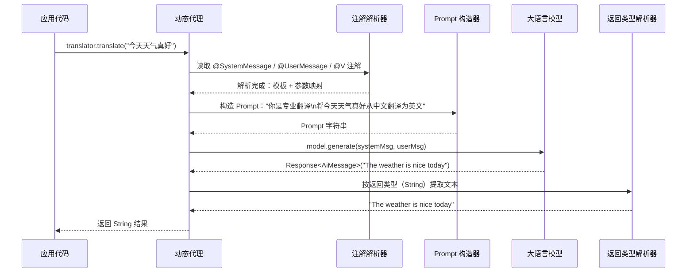
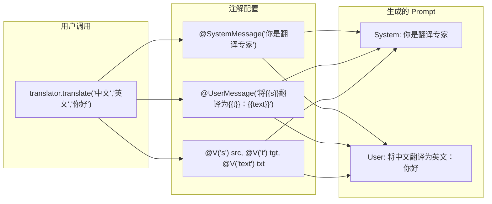
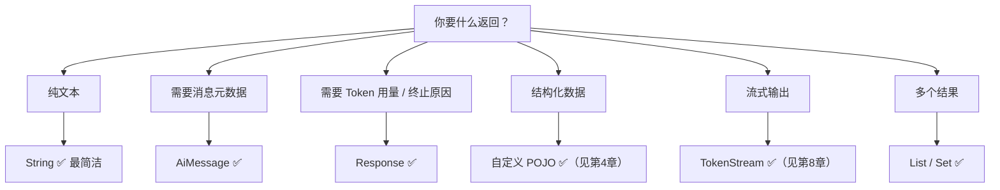
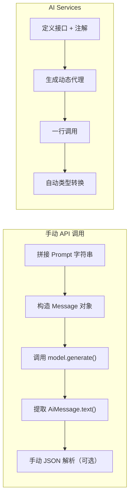

# 第3章 · AI 服务深度 — 声明式 AI 的接口魔法

> **时长**：约 3 小时 ｜ **难度**：⭐⭐⭐ ｜ **类型**：项目实战
>
> **目标**：掌握 LangChain4j 核心杀手级特性——AI Services，理解动态代理机制、注解体系、构建器模式，从手动 API 调用进化到声明式接口编程

---

## 学习目标

学完本章后，你将能够：
- 理解 AI Services 解决的问题及其在 LangChain4j 中的旗舰地位
- 掌握 AiServices 动态代理机制的内部工作原理
- 熟练使用 `@SystemMessage`、`@UserMessage`、`@V` 三种核心注解
- 灵活运用 AiServices 构建器配置记忆、工具、RAG 等能力
- 根据场景选择不同的返回类型（String、AiMessage、Response、POJO、TokenStream）
- 理解 UserMessage 模板系统与 @V 参数绑定的各种组合方式
- 掌握 ChatRequestParameters 实现每次调用的参数覆盖
- 编写可测试的 AI Service 代码并掌握测试策略

---

## 知识地图

```mermaid
graph TD
    subgraph P0["前置理解"]
        A1[手动 API 痛点] --> A2["样板代码堆叠"] --> A3["JSON 解析噩梦"]
    end

    subgraph P1["AI Services 核心机制"]
        B1[定义接口 + 注解] --> B2[AiServices.create 动态代理] --> B3[方法调用 → LLM 请求 → POJO 返回]
    end

    subgraph P2["注解体系"]
        C1[@SystemMessage] --> C1a["角色设定 / 外部文件加载"]
        C2[@UserMessage] --> C2a["模板变量 / 默认命名"]
        C3[@V] --> C3a["参数绑定 / 多参数组合"]
    end

    subgraph P3["构建器与配置"]
        D1[.chatLanguageModel] --> D2[.chatMemory / .chatMemoryProvider]
        D2 --> D3[.tools / .retrievalAugmentor]
        D3 --> D4[.streamingChatLanguageModel]
    end

    subgraph P4["返回类型"]
        E1[String] & E2[AiMessage] & E3["Response<AiMessage>"]
        E4[POJO] & E5[TokenStream] & E6[List / Set]
    end

    subgraph P5["高级特性"]
        F1[ChatRequestParameters] --> F1a["每个方法覆盖参数"]
        F2[SystemMessageProvider] --> F2a["动态系统消息"]
    end

    A1 --> B1
    B2 --> P2
    B2 --> P3
    B2 --> P4
    B2 --> P5
```

---

## 1、为什么需要 AI Services

### 1.1 手动 API 的痛点

如果不使用 AI Services，与 LLM 交互的代码长什么样？

```java
// 手动 API —— 每一步都要自己写
public class ManualTranslator {
    private final ChatLanguageModel model;

    public ManualTranslator(ChatLanguageModel model) {
        this.model = model;
    }

    public String translate(String sourceLanguage, String targetLanguage, String text) {
        // 1. 手动拼接提示词
        String prompt = "You are a professional translator. "
            + "Translate from " + sourceLanguage + " to " + targetLanguage + ".\n"
            + text;

        // 2. 调用模型
        Response<AiMessage> response = model.generate(
            SystemMessage.from(prompt)
        );

        // 3. 手动提取文本
        return response.content().text();
    }
}
```

**这里的每个步骤都是样板代码**：拼接字符串、组装消息对象、调用模型、提取结果。如果涉及 JSON 解析（比如期望返回结构化数据），还要自己写序列化/反序列化逻辑。

### 1.2 AI Services 的解决方案

LangChain4j 的答案是：**定义一个接口，添加注解，框架替你实现所有样板代码**。

```java
// AI Services —— 声明式接口，零样板代码
interface Translator {
    @SystemMessage("你是专业翻译")
    @UserMessage("将 {{it}} 从中文翻译为英文")
    String translate(String text);
}

// 创建代理，一行搞定
Translator translator = AiServices.create(Translator.class, model);

// 直接调用，像普通 Java 方法
String result = translator.translate("今天天气真好");
```

> **本质**：AI Services 让 LLM 调用变得像 RPC 框架（如 Feign、gRPC）一样——定义接口，注解描述行为，框架生成实现。这是 Java 生态中声明式编程哲学的典型应用。

---

## 2、动态代理机制——揭开 AiServices 的神秘面纱

### 2.1 运行时发生了什么

当你调用 `AiServices.create(Translator.class, model)` 时，LangChain4j 在运行时做了这些事情：

1. **解析接口** —— 读取所有方法的注解信息
2. **提取模板** —— 解析 @SystemMessage、@UserMessage 中的模板字符串
3. **绑定参数** —— 根据 @V 或默认参数名，建立方法参数和模板变量的映射
4. **生成代理** —— 使用 JDK 动态代理创建接口的运行时实现
5. **注册拦截器** —— 拦截所有方法调用，转换为 LLM 请求



### 2.2 核心源码路径（参考理解）

```java
// AiServices.create() 的简化内部逻辑
public static <T> T create(Class<T> aiServiceClass, ChatLanguageModel model) {
    // 1. 验证接口
    if (!aiServiceClass.isInterface()) {
        throw new IllegalArgumentException("AI Service 必须是接口");
    }

    // 2. 构建代理实例
    return (T) Proxy.newProxyInstance(
        aiServiceClass.getClassLoader(),
        new Class[]{aiServiceClass},
        new AiServiceInvocationHandler(model)
    );
}

// 代理的调用处理器
class AiServiceInvocationHandler implements InvocationHandler {
    @Override
    public Object invoke(Object proxy, Method method, Object[] args) {
        // 1. 解析 @SystemMessage
        SystemMessage systemMsg = extractSystemMessage(method);

        // 2. 解析 @UserMessage 模板，替换 {{variables}}
        UserMessage userMsg = buildUserMessage(method, args);

        // 3. 调用 LLM
        Response<AiMessage> response = model.generate(systemMsg, userMsg);

        // 4. 根据方法返回类型转换结果
        return convertResponse(response, method.getReturnType());
    }
}
```

### 2.3 AiServices 能做什么、不能做什么

| 能力 | 支持情况 |
|------|---------|
| 调用 ChatLanguageModel 生成文本 | ✅ 核心能力 |
| 维护对话记忆（chatMemory） | ✅ 通过 builder 配置 |
| 注册工具函数（Tool） | ✅ 通过 builder 配置 |
| 集成 RAG 检索增强 | ✅ 通过 builder 配置 |
| 流式输出（TokenStream） | ✅ 返回 TokenStream |
| 多模态输入（图片/音频） | ❌ 需要手动 API |
| 自定义 HTTP 请求参数 | ⚠️ 通过 ChatRequestParameters |

> **黄金法则**：90% 的 LLM 调用场景都应该使用 AiServices。只有需要细粒度控制请求细节时才回退到手动 API。

---

## 3、核心注解深入讲解

AI Services 围绕三个核心注解构建。

### 3.1 @SystemMessage —— 设定 AI 的角色

```java
import dev.langchain4j.service.SystemMessage;

// 基础用法：直接给字符串
interface ChatBot {
    @SystemMessage("你是 Java 编程导师，擅长用简洁的语言解释复杂概念")
    String answer(String question);
}

// 支持模板变量
interface Reviewer {
    @SystemMessage("你是 {{language}} 编程专家，代码规范采用 {{standard}}")
    String review(@V("language") String lang,
                  @V("standard") String standard,
                  @UserMessage String code);
}

// 从外部文件加载（推荐用于长系统提示词）
interface ExpertBot {
    @SystemMessage(fromResource = "prompts/expert-system.txt")
    String ask(String question);
}

// 多 @SystemMessage 叠加（按顺序合并为多条 SystemMessage）
interface MultiRoleBot {
    @SystemMessage("你是一名资深架构师")
    @SystemMessage("你特别擅长微服务设计")
    @SystemMessage("请始终用中文回答")
    String design(String requirements);
}
```

**注解属性一览**：

| 属性 | 类型 | 默认值 | 说明 |
|------|------|--------|------|
| `value` | String | `""` | 系统消息内容，支持 `{{变量}}` 模板 |
| `fromResource` | String | `""` | 从 classpath 资源文件加载（v1.13+） |
| ~~fromClasspathResource~~ | String | `""` | 已废弃，改用 fromResource |

> **注意**：fromResource 的路径相对于 classpath 根目录。多个 @SystemMessage 会按声明顺序依次添加为独立的系统消息。

### 3.2 @UserMessage —— 定义用户的输入模板

```java
import dev.langchain4j.service.UserMessage;

// 默认模板：方法参数名自动作为模板变量
interface SimpleBot {
    String say(String message);
    // 等价于 @UserMessage("{{message}}")
}

// 显式模板
interface Translator {
    @UserMessage("将以下文本从 {{source}} 翻译为 {{target}}：\n{{text}}")
    String translate(@V("source") String src,
                     @V("target") String tgt,
                     @V("text") String txt);
}

// 多参数无 @V——按顺序绑定到 {{arg0}} {{arg1}} {{arg2}}
interface MultiParamBot {
    @UserMessage("分析此代码：\n{{arg0}}\n编程语言：{{arg1}}\n关注点：{{arg2}}")
    String analyze(String code, String language, String focus);
}
```

**模板变量绑定方式**：

| 绑定方式 | 示例 | 说明 |
|---------|------|------|
| 默认参数名 | `String say(String message)` → `{{message}}` | 参数名自动成为变量名 |
| @V 注解 | `@V("lang") String language` → `{{lang}}` | 显式指定变量名 |
| 位置索引 | `String f(String a, String b)` → `{{arg0}}` `{{arg1}}` | 无注解时使用索引 |
| `{{it}}` 单参数 | `String ask(String question)` | 单个未注解参数的特殊占位符 |

### 3.3 @V —— 参数绑定注解

```java
import dev.langchain4j.service.V;

// 基本绑定
interface Reporter {
    @SystemMessage("你是 {{field}} 领域的专家记者")
    @UserMessage("请写一篇关于 {{topic}} 的报道，字数 {{words}} 字")
    String report(
        @V("field") String field,
        @V("topic") String topic,
        @V("words") int wordCount
    );
}

// @V 可以省略的情况：参数名与模板变量名一致
interface SimpleReporter {
    @UserMessage("写一篇关于 {{topic}} 的报道")
    String report(String topic);  // 参数名 topic 自动匹配 {{topic}}
}

// @V 与 @UserMessage 结合——@UserMessage 参数优先级最高
interface CombinedBot {
    @SystemMessage("你是 AI 助手")
    @UserMessage("请回答：{{query}}")
    String ask(@V("query") String question, int maxTokens);
}
```

> **规则**：如果模板变量名和参数名完全相同，可以省略 @V。但为了代码可读性，建议显式标注。

### 3.4 三种注解的完整协作



---

## 4、AiServices 构建器模式

`AiServices.create()` 适合最简单的场景。对于生产级应用，使用构建器模式配置更多能力。

### 4.1 基础构建器 API

```java
import dev.langchain4j.service.AiServices;

// 最简形式——等价于 AiServices.create()
Assistant assistant = AiServices.builder(Assistant.class)
    .chatLanguageModel(model)
    .build();

// 完整配置
Assistant fullAssistant = AiServices.builder(Assistant.class)
    .chatLanguageModel(model)                           // 核心：大语言模型
    .streamingChatLanguageModel(streamingModel)         // 可选：流式模型
    .chatMemory(MessageWindowChatMemory.withMaxMessages(10))  // 对话记忆
    .tools(new WeatherTool(), new CalculatorTool())     // 工具函数
    .retrievalAugmentor(retrievalAugmentor)             // RAG 检索增强
    .build();
```

### 4.2 chatMemory vs chatMemoryProvider

这是最容易混淆的两个配置项：

```java
// chatMemory：所有会话共享同一记忆
// 适合单个用户、单轮对话的应用
Assistant shared = AiServices.builder(Assistant.class)
    .chatLanguageModel(model)
    .chatMemory(MessageWindowChatMemory.withMaxMessages(10))
    .build();

// chatMemoryProvider：每个会话 ID 独立记忆
// 适合多用户、多会话的应用（生产环境首选）
Assistant perSession = AiServices.builder(Assistant.class)
    .chatLanguageModel(model)
    .chatMemoryProvider(memoryId -> MessageWindowChatMemory.builder()
        .maxMessages(20)
        .chatMemoryBuilder(memoryId.toString())  // 按用户/会话隔离
        .build())
    .build();
```

| 配置项 | 适用场景 | 记忆隔离 | 推荐 |
|--------|---------|---------|------|
| `.chatMemory(...)` | 原型开发、单用户 | 无隔离 | ❌ 生产少用 |
| `.chatMemoryProvider(...)` | 多用户 Web 应用 | 按 memoryId 隔离 | ✅ 推荐 |

### 4.3 注册多个工具

```java
// 方式一：传入多个工具实例
Assistant withTools = AiServices.builder(Assistant.class)
    .chatLanguageModel(model)
    .tools(new WeatherTool(), new CalculatorTool(), new SqlQueryTool())
    .build();

// 方式二：分步添加（链式调用）
Assistant stepByStep = AiServices.builder(Assistant.class)
    .chatLanguageModel(model)
    .tools(new WeatherTool())
    .tools(new CalculatorTool())
    .build();

// 方式三：使用工具提供者（动态获取工具实例）
Assistant withProvider = AiServices.builder(Assistant.class)
    .chatLanguageModel(model)
    .tools(toolProvider)  // ToolProvider 接口
    .build();
```

### 4.4 流式模型配置

```java
import dev.langchain4j.model.chat.StreamingChatLanguageModel;

StreamingChatLanguageModel streamingModel = OpenAiStreamingChatModel.builder()
    .apiKey(System.getenv("API_KEY"))
    .modelName("gpt-4o")
    .build();

// 接口方法返回 TokenStream
interface StreamingAssistant {
    @SystemMessage("你是有用的助手")
    TokenStream chat(@UserMessage String message);
}

// 构建时同时配置普通模型和流式模型
StreamingAssistant assistant = AiServices.builder(StreamingAssistant.class)
    .chatLanguageModel(model)                // 普通调用
    .streamingChatLanguageModel(streamingModel) // 流式调用
    .build();
```

---

## 5、返回类型灵活运用

AI Services 支持多种返回类型，根据场景选择最合适的。

### 5.1 返回类型对照表

```java
import dev.langchain4j.model.chat.response.ChatResponse;

interface ReturnTypeDemo {

    // 1. String —— 最常用，直接返回文本
    @SystemMessage("你是有趣的助手")
    @UserMessage("讲个关于 {{topic}} 的笑话")
    String tellJoke(@V("topic") String topic);

    // 2. AiMessage —— 获取完整消息对象（含元数据）
    @UserMessage("用中文回答：{{it}}")
    AiMessage answer(String question);

    // 3. Response<AiMessage> —— 包含 Token 用量、终止原因
    @UserMessage("{{it}}")
    Response<AiMessage> askWithDetails(String question);
    // response.metadata().tokenUsage().inputTokenCount()
    // response.finishReason()

    // 4. POJO —— 自动 JSON 反序列化（第4章深入）
    @UserMessage("从以下简历提取信息：\n{{it}}")
    Resume parseResume(String resumeText);

    // 5. TokenStream —— 流式返回（第8章深入）
    @UserMessage("写一篇关于 {{topic}} 的文章")
    TokenStream writeArticle(@V("topic") String topic);

    // 6. List / Set —— 多个结果
    @UserMessage("列出 {{it}} 的 5 个优点，每行一个")
    List<String> listBenefits(String thing);
}
```

### 5.2 提取 Token 用量示例

```java
Response<AiMessage> response = assistant.askWithDetails("Java 21 的新特性");

// 获取 Token 统计
TokenUsage usage = response.metadata().tokenUsage();
System.out.println("输入 Token: " + usage.inputTokenCount());
System.out.println("输出 Token: " + usage.outputTokenCount());
System.out.println("总计 Token: " + usage.totalTokenCount());

// 获取终止原因
FinishReason reason = response.finishReason();
System.out.println("终止原因: " + reason);  // STOP / LENGTH / TOOL_EXECUTION

// 获取响应内容
String text = response.content().text();
```

### 5.3 返回类型选择指南



---

## 6、UserMessage 模板系统

### 6.1 默认模板命名规则

```java
interface DefaultNaming {

    // 单个参数 → 默认 {{it}}
    @UserMessage("翻译：{{it}}")
    String translate(String text);
    // 等价于不写 @UserMessage（自动推断）

    // 多个参数 → 按参数位置 {{arg0}} {{arg1}} ...
    @UserMessage("从 {{arg0}} 翻译到 {{arg1}}：{{arg2}}")
    String translate(String source, String target, String text);
}
```

### 6.2 显式模板最佳实践

```java
interface BestPracticeBot {

    // ✅ 好：显式 @UserMessage，参数名清晰
    @UserMessage("Summarize the following {{genre}} text in {{language}}:\n{{text}}")
    String summarize(
        @V("genre") String genre,
        @V("language") String language,
        @V("text") String text
    );

    // ❌ 差：依赖默认命名，可读性差
    @UserMessage("Summarize {{arg0}} in {{arg1}}:\n{{arg2}}")
    String badSummarize(String genre, String language, String text);
}
```

### 6.3 模板中的特殊处理

```java
// 多行模板 —— 使用文本块（Java 15+）
interface CodeBot {
    @UserMessage("""
        请审查以下代码：
        ```java
        {{code}}
        ```
        关注点：{{focus}}
        """)
    String reviewCode(@V("code") String code, @V("focus") String focus);
}

// 条件模板 —— 在 Java 侧拼接（模板不支持 if/else）
interface ConditionalBot {
    @UserMessage("""
        角色：{{role}}
        任务：{{task}}
        {{constraints}}
        """)
    String execute(
        @V("role") String role,
        @V("task") String task,
        @V("constraints") String constraints  // 可以在调用方拼好空字符串
    );
}
```

---

## 7、SystemMessage 进阶

### 7.1 从外部文件加载

```java
// 文件位置：src/main/resources/prompts/expert-system.txt
// 文件内容（UTF-8 编码）：
//   你是世界顶级的 Java 架构师。
//   你有 20 年企业级开发经验。
//   请用中文回答，保持专业但友好的语气。
//
interface ExpertBot {
    @SystemMessage(fromResource = "prompts/expert-system.txt")
    String consult(String question);
}
```

**路径加载规则**：

| 写法 | 加载路径 |
|------|---------|
| `fromResource = "prompts/sys.txt"` | classpath:prompts/sys.txt |
| `fromResource = "/prompts/sys.txt"` | classpath:/prompts/sys.txt（同上） |
| `fromResource = "config/sys.json"` | classpath:config/sys.json |

> **最佳实践**：超过 100 个字符的系统提示词建议放入外部文件，便于维护和版本控制。

### 7.2 动态系统消息（v1.16.0+）

当系统消息需要在运行时动态生成时，使用 `SystemMessageProvider`：

```java
interface DynamicBot {
    String chat(@UserMessage String message);
}

// 使用 SystemMessageProvider 动态构造系统消息
DynamicBot bot = AiServices.builder(DynamicBot.class)
    .chatLanguageModel(model)
    .systemMessageProvider(chatRequest -> {
        // 根据每次请求动态生成系统消息
        String userName = chatRequest.userName();  // 假设有上下文
        String userLang = chatRequest.userLanguage();

        return """
            你是 %s 的 AI 助手。
            请用 %s 回答。
            你擅长帮助用户解决编程问题。
            """.formatted(userName, userLang);
    })
    .build();
```

### 7.3 @SystemMessage 的优先级规则

多个 @SystemMessage 与 SystemMessageProvider 同时存在时的优先级：

```java
@SystemMessage("静态系统消息A")
@SystemMessage("静态系统消息B")
interface PriorityBot {
    String chat(String message);
}
```

**优先级**：
1. 如果注解中存在 `@SystemMessage`：发所有静态消息 + Provider 生成的消息
2. 如果没有注解：只发 Provider 生成的消息
3. 两者都没有：不发系统消息

---

## 8、ChatRequestParameters —— 每次调用的参数覆盖

从 v1.10.0 开始，AI Services 方法支持将 `ChatRequestParameters` 作为方法参数，在单次调用中覆盖模型参数。

### 8.1 基础用法

```java
import dev.langchain4j.model.chat.request.ChatRequestParameters;

interface ConfigurableBot {
    @SystemMessage("你是有用的助手")
    String chat(
        @UserMessage String message,
        ChatRequestParameters params  // 每次调用可传入不同参数
    );
}

// 调用时覆盖参数
ChatRequestParameters params = ChatRequestParameters.builder()
    .temperature(0.0)          // 这次调用使用确定性输出
    .maxOutputTokens(500)      // 限制输出长度
    .build();

String result = bot.chat("解释什么是微服务架构", params);
```

### 8.2 实际应用场景

```java
// 场景：翻译服务，根据用户选择控制温度
interface TranslationService {
    String translate(
        @V("source") String source,
        @V("target") String target,
        @UserMessage String text,
        ChatRequestParameters params
    );
}

// 正式翻译：低温度
String formal = service.translate("中文", "英文",
    "合同条款如下",
    ChatRequestParameters.builder().temperature(0.1).build()
);

// 创意翻译：高温度
String creative = service.translate("中文", "英文",
    "今晚月色真美",
    ChatRequestParameters.builder().temperature(0.8).build()
);
```

### 8.3 支持覆盖的参数

| 参数 | 类型 | 说明 |
|------|------|------|
| `temperature` | Double | 随机性控制（0~2） |
| `maxOutputTokens` | Integer | 最大输出 Token 数 |
| `topP` | Double | Nucleus 采样参数 |
| `frequencyPenalty` | Double | 频率惩罚 |
| `presencePenalty` | Double | 存在惩罚 |
| `stopSequences` | List<String> | 停止序列 |
| `responseFormat` | ResponseFormat | 响应格式（JSON mode） |
| `modelName` | String | 模型名称（某些提供商支持） |

---

## 9、AiServices vs 手动 API —— 全方位对比



### 实际代码量对比

```java
// ─── 手动 API ───
// 约 20~30 行
public class CodeAnalyzerManual {
    private final ChatLanguageModel model;

    public CodeAnalyzerManual(ChatLanguageModel model) {
        this.model = model;
    }

    public AnalysisResult analyze(String code, String language) {
        String prompt = String.format("""
            分析以下 %s 代码的质量：
            ```%s
            %s
            ```
            返回 JSON 格式：{"score": 0-100, "issues": ["问题1", "问题2"]}
            """, language, language, code);

        Response<AiMessage> response = model.generate(
            SystemMessage.from("你是代码审查专家"),
            UserMessage.from(prompt)
        );

        // 手动 JSON 解析
        return new Gson().fromJson(response.content().text(), AnalysisResult.class);
    }
}

// ─── AI Services ───
// 约 5~10 行
interface CodeAnalyzer {
    @SystemMessage("你是代码审查专家")
    @UserMessage("分析以下 {{language}} 代码的质量：\n{{code}}")
    AnalysisResult analyze(@V("language") String lang, @V("code") String code);
}

// 使用
CodeAnalyzer analyzer = AiServices.create(CodeAnalyzer.class, model);
AnalysisResult result = analyzer.analyze("Java", code);
```

### 全面对比表

| 维度 | 手动 API | AI Services |
|------|---------|-------------|
| **代码量** | 多（20+ 行/方法） | 少（5~10 行/接口） |
| **类型安全** | 无（手动解析 JSON） | ✅ 强类型（编译时检查） |
| **可读性** | 差（逻辑夹杂样板代码） | ✅ 好（专注业务意图） |
| **错误处理** | 手动 try-catch | ✅ 统一异常处理 |
| **流式支持** | 手动处理回调 | ✅ TokenStream 返回 |
| **测试难度** | 中等 | ✅ 容易（接口易 Mock） |
| **灵活性** | ✅ 完全控制 | 受限于注解能力 |
| **学习成本** | 低（直接 API） | 需要理解注解语义 |
| **推荐场景** | 自定义请求流程、调试 | 90% 标准场景 |

> **结论**：对于绝大多数业务场景，AI Services 是更好的选择。只有当需要精细控制请求流程（如自定义重试、多模态输入、底层 HTTP 调试）时，才考虑使用手动 API。

---

## 10、测试 AI Services

### 10.1 单元测试——接口易 Mock

```java
import static org.mockito.Mockito.*;

// AI Service 接口天然可 Mock（因为它就是接口）
interface WeatherBot {
    @SystemMessage("你是天气预报员")
    @UserMessage("{{city}} 今天的天气怎么样？")
    String ask(String city);
}

// 测试代码
class WeatherBotTest {

    @Test
    void testAsk() {
        // 方法1：直接 Mock 接口（最简单）
        WeatherBot bot = mock(WeatherBot.class);
        when(bot.ask("北京")).thenReturn("北京今天晴，25°C");

        String result = bot.ask("北京");
        assertEquals("北京今天晴，25°C", result);
    }

    @Test
    void testWithRealModel() {
        // 方法2：使用真实模型（集成测试）
        ChatLanguageModel model = OpenAiChatModel.builder()
            .apiKey(System.getenv("TEST_API_KEY"))
            .modelName("gpt-4o-mini")  // 使用廉价模型
            .temperature(0.0)          // 确定性输出
            .build();

        WeatherBot bot = AiServices.create(WeatherBot.class, model);
        String result = bot.ask("上海");
        assertNotNull(result);
        assertTrue(result.contains("上海"));
    }
}
```

### 10.2 集成测试策略

```java
// 使用测试专用的配置文件
class AiServiceIntegrationTest {

    private static ChatLanguageModel testModel;
    private static Translator translator;

    @BeforeAll
    static void setup() {
        // 使用测试专用 API Key（不得与生产环境共用）
        testModel = OpenAiChatModel.builder()
            .apiKey(System.getenv("TEST_API_KEY"))
            .baseUrl(System.getenv("TEST_BASE_URL"))
            .modelName("gpt-4o-mini")   // 小型模型节省成本
            .temperature(0.0)            // 确保可重复性
            .maxRetries(2)
            .logRequests(true)
            .logResponses(true)
            .build();

        translator = AiServices.create(Translator.class, testModel);
    }

    @Test
    void testTranslationConsistency() {
        // temperature=0 时，相同输入应产生相同输出
        String result1 = translator.translate("中文", "英文", "你好");
        String result2 = translator.translate("中文", "英文", "你好");
        assertEquals(result1, result2);
    }

    @Test
    void testTranslationAccuracy() {
        String result = translator.translate("中文", "英文", "谢谢");
        assertTrue(result.toLowerCase().contains("thank"));
    }

    @AfterAll
    static void cleanup() {
        // 清理资源
    }
}
```

### 10.3 测试最佳实践

| 原则 | 说明 |
|------|------|
| **接口优先** | AI Service 是接口，天然适合 Mock |
| **单元测试 Mock 接口** | 不调用真实 LLM，测试业务逻辑 |
| **集成测试用小模型** | 使用 gpt-4o-mini 等廉价模型 |
| **temperature=0** | 确保结果可重复，测试不 flaky |
| **隔离测试 Key** | 使用独立的测试 API Key |
| **异步测试** | 流式接口需要等待回调完成 |

---

## 常见踩坑

### 1. @UserMessage 的 `{{it}}` 不生效

```java
// ❌ 错误：方法有多个参数但没有 @V
interface BadBot {
    @UserMessage("分析 {{it}}")
    String analyze(String code, String language);
    // 抛出异常：多个参数不能使用 {{it}}
}

// ✅ 正确：多个参数时要明确绑定
interface GoodBot {
    @UserMessage("用 {{language}} 分析以下代码：\n{{code}}")
    String analyze(@V("code") String code, @V("language") String language);
}
```

### 2. chatMemory 导致跨用户数据泄露

```java
// ❌ 错误：所有用户共享同一个记忆
ChatLanguageModel model = ...;  // 单例模型
ChatMemory memory = MessageWindowChatMemory.withMaxMessages(10);
Assistant bot = AiServices.builder(Assistant.class)
    .chatLanguageModel(model)
    .chatMemory(memory)          // 所有请求共用记忆！
    .build();

// ✅ 正确：每个会话独立记忆
Assistant bot = AiServices.builder(Assistant.class)
    .chatLanguageModel(model)
    .chatMemoryProvider(sessionId -> MessageWindowChatMemory.builder()
        .maxMessages(10)
        .build())
    .build();
```

### 3. 接口方法返回类型不支持

```java
// ❌ 错误：boolean 不是支持的返回类型
interface BadBot {
    @UserMessage("这个句子是中文吗：{{it}}")
    boolean isChinese(String text);  // 编译不报错，运行时失败
}

// ✅ 正确：使用 String 或 POJO
interface GoodBot {
    @UserMessage("判断这个句子是否是中文，只回答 true 或 false：{{it}}")
    String isChinese(String text);
}
```

### 4. fromResource 路径错误

```java
// ❌ 错误：路径写错
interface BadBot {
    @SystemMessage(fromResource = "prompts/my-system.txt")
    // 如果文件在 src/main/resources/prompts/my-system.txt 则正确
    // 如果文件在 src/main/resources/my-system.txt 则找不到
    String ask(String question);
}

// ✅ 检查步骤
// 1. 确认文件在 classpath 下
// 2. 确认编码为 UTF-8（不支持 BOM）
// 3. 确认路径无拼写错误
// 4. 资源文件不能以 / 开头（跨平台兼容性问题）
```

### 5. chatLanguageModel 和 streamingChatLanguageModel 类型不匹配

```java
// ❌ 错误：如果接口方法返回 String 但只想用流式模型
StreamingChatLanguageModel streamingModel = ...;
Assistant bot = AiServices.builder(Assistant.class)
    .streamingChatLanguageModel(streamingModel)  // 可以
    // .chatLanguageModel(model)                 // 忘记配置普通模型
    .build();

String result = bot.chat("你好");  // 运行时异常：非流式方法需要 ChatLanguageModel

// ✅ 正确：两种模型都配置
Assistant bot = AiServices.builder(Assistant.class)
    .chatLanguageModel(model)
    .streamingChatLanguageModel(streamingModel)
    .build();
```

---

## 课后练习

### 1. 实现一个代码审查 AI 服务

```java
// 要求：定义 CodeReviewer 接口
// - @SystemMessage 设置角色为资深代码审查员
// - @UserMessage 接受代码和编程语言
// - 返回 ReviewResult POJO（包含 score、issues、suggestions 字段）
// 进阶：添加 ChatRequestParameters 参数覆盖 temperature
```

### 2. 对比 chatMemory 两种模式

编写两个版本的客服机器人：
- 版本A：使用 `.chatMemory()` 共享记忆
- 版本B：使用 `.chatMemoryProvider()` 隔离记忆
- 同时启动两个客户端，看版本A 是否出现跨用户数据泄露
- 写一个测试验证你的结论

### 3. 完整的 AI 服务测试套件

为一个多语言翻译接口编写完整的测试：
- 单元测试：Mock 翻译接口，验证业务逻辑
- 集成测试：使用 gpt-4o-mini 模型，temperature=0，验证翻译一致性
- 边界测试：空字符串、超长文本、特殊字符的翻译

### 4. 将手动 API 调用重构为 AI Services

```java
// 给定这段手动 API 代码，将其重构为 AI Services 风格
public class ManualResumeParser {
    public Resume parse(String resumeText) {
        String prompt = "从以下简历中提取姓名、年龄、技能列表、工作经验年限：\n"
            + resumeText;
        Response<AiMessage> response = model.generate(
            SystemMessage.from("你是专业的 HR 助理"),
            UserMessage.from(prompt)
        );
        return new Gson().fromJson(response.content().text(), Resume.class);
    }
}
```

---

## 本节小结

- ✅ 理解了 AI Services 的核心理念：声明式接口消除样板代码
- ✅ 掌握了动态代理机制：接口注解 → 动态代理 → LLM 调用 → 自动类型转换
- ✅ 熟练使用 @SystemMessage（含外部文件加载、多注解叠加）
- ✅ 熟练使用 @UserMessage 模板系统（含默认命名、显式绑定、`{{it}}` 占位符）
- ✅ 掌握了 @V 注解的参数绑定规则和最佳实践
- ✅ 理解了 AiServices 构建器的完整 API（模型、记忆、工具、RAG）
- ✅ 区分了 chatMemory 和 chatMemoryProvider 的使用场景
- ✅ 掌握了六种返回类型及其适用场景（String、AiMessage、Response、POJO、TokenStream、List）
- ✅ 学会了使用 ChatRequestParameters 实现每次调用的参数覆盖
- ✅ 理解了 AI Services 与手动 API 的优劣和选型原则
- ✅ 掌握了 AI Services 的测试策略（单元 Mock + 集成测试）

---

> **下一章**：第4章 · 结构化输出（JSON Mode）——让 LLM 输出精确的 POJO 和集合类型
