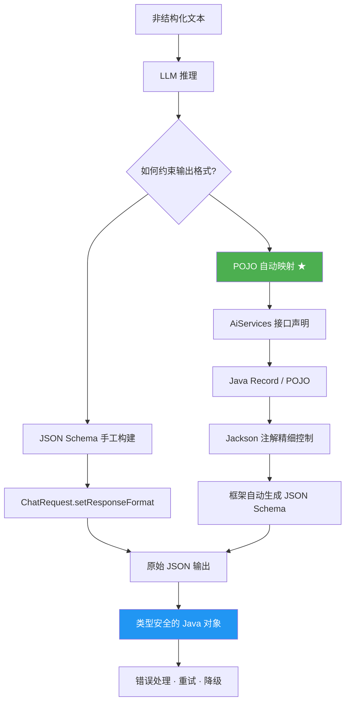
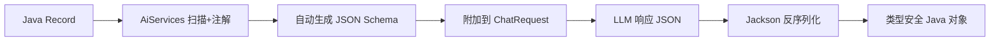
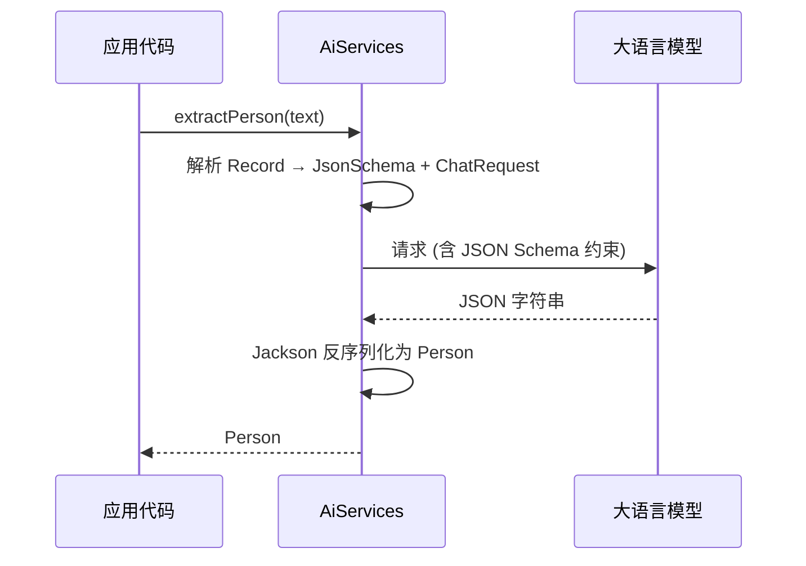

# 第4章 · 结构化输出 — 从文本到类型安全的 POJO

> **预计时长**：2.5 小时 | **难度**：⭐⭐⭐ | **类型**：讲解 + 动手

---

## 学习目标

- 理解非结构化输出在生产系统中的局限性
- 掌握 JSON Schema 构建 API，手动定义输出约束
- 学会通过 Java POJO / Record 自动推导 JSON Schema
- 熟练运用 `AiServices` 结合 `@SystemMessage` 完成结构化解构
- 掌握嵌套对象、枚举、可选字段、多态等高级 Schema 模式
- 了解各模型供应商的结构化输出兼容性差异
- 掌握非法 JSON 的重试与降级处理策略

---

## 知识图谱



---

## 4.1 为什么需要结构化输出

### 非结构化文本的困境

大语言模型擅长生成自然语言，但在企业应用中直接使用 LLM 的"散文"输出会带来工程难题：

- **解析脆弱**：正则或字符串切割难以应对输出的微小变化，加一个标点就可能导致解析失败
- **缺乏类型约束**：编译期无法检查字段是否存在或类型正确，`"age": "twenty"` 和 `"age": 20` 难以统一处理
- **上下文漂移**：同一提示词在不同轮次可能输出不同格式，需要处理大量边缘情况

### 结构化输出的价值

| 维度 | 自由文本 | 结构化输出 (JSON Schema) |
|------|----------|--------------------------|
| 可解析性 | 低，依赖 NLP 或正则 | 高，JSON 解析器直接处理 |
| 类型安全 | 无 | 编译期检查 |
| 可维护性 | 差，提示词与解析逻辑耦合 | 好，Schema 即契约 |
| 工具链 | 自定义解析器 | Jackson / Gson / 代码生成 |
| LLM 幻觉控制 | 弱 | Schema 约束可降低幻觉 |

### 典型应用场景

简历解析、合同信息抽取、商品属性结构化、对话意图分类、报表生成等——任何需要将 LLM 输出接入下游系统的场景都是结构化输出的用武之地。

---

## 4.2 JSON Schema 手工构建方式

LangChain4j 提供了完整的 `JsonSchemaElement` 继承体系，允许通过 Java 代码手动描述期望的输出结构。核心类型包括：`JsonObjectSchema`、`JsonStringSchema`、`JsonIntegerSchema`、`JsonNumberSchema`、`JsonBooleanSchema`、`JsonEnumSchema`、`JsonArraySchema`，以及高级类型 `JsonAnyOfSchema`、`JsonReferenceSchema`、`JsonNullSchema`。

### 手工构建示例

```java
import dev.langchain4j.model.chat.request.json.*;

JsonObjectSchema personSchema = JsonObjectSchema.builder()
    .addStringProperty("name", "The full name of the person")
    .addIntegerProperty("age", "Age in years")
    .addStringProperty("occupation", "Current job title")
    .addProperty("gender", JsonEnumSchema.builder()
        .enumValues("MALE", "FEMALE", "OTHER")
        .description("Gender identity")
        .build())
    .required("name", "age")
    .build();

JsonObjectSchema addressSchema = JsonObjectSchema.builder()
    .addStringProperty("city", "City name")
    .addStringProperty("street", "Street address")
    .addStringProperty("zipCode", "Postal code")
    .required("city")
    .build();

JsonObjectSchema personWithAddressSchema = JsonObjectSchema.builder()
    .addStringProperty("name", "The full name")
    .addIntegerProperty("age", "Age in years")
    .addProperty("address", addressSchema)
    .required("name", "age", "address")
    .build();
```

### 应用到 ChatRequest

```java
ChatRequest request = ChatRequest.builder()
    .messages(UserMessage.from("张三今年28岁，是一名软件工程师，住在北京市朝阳区"))
    .responseFormat(ResponseFormat.builder()
        .type(ResponseFormatType.JSON)
        .jsonSchema(personWithAddressSchema)
        .build())
    .build();
Response<AiMessage> response = model.chat(request);
// {"name":"张三","age":28,"address":{"city":"北京市","street":"朝阳区"}}
```

---

## 4.3 POJO 自动映射（推荐方式）★

手工构建 JSON Schema 存在 Schema 与 Java 类型分离、修改不同步、样板代码多等缺点。LangChain4j 最强大的特性之一就是**从 Java POJO / Record 自动生成 JSON Schema**，实现"定义一次、到处使用"的类型安全体验。

### 核心原理



### 基础用法：Java Record

```java
import com.fasterxml.jackson.annotation.JsonProperty;
import com.fasterxml.jackson.annotation.JsonPropertyDescription;

public record Person(
    @JsonProperty(required = true)
    @JsonPropertyDescription("The full name of the person")
    String name,
    @JsonProperty(required = true)
    @JsonPropertyDescription("Age in years")
    int age,
    @JsonPropertyDescription("Current occupation or job title")
    String occupation
) {}
```

```java
import dev.langchain4j.service.AiServices;
import dev.langchain4j.service.SystemMessage;

interface PersonExtractor {
    @SystemMessage("Extract person info. If occupation is not mentioned, leave it null.")
    Person extractPerson(String text);
}

PersonExtractor extractor = AiServices.create(PersonExtractor.class, model);
Person person = extractor.extractPerson("李四今年35岁，是一名数据科学家");
// person.name() = "李四", person.age() = 35, person.occupation() = "数据科学家"
```

**这是 LangChain4j 的核心优势**：只需编写标准 Java Record，框架自动完成 Schema 推导、请求装配、响应解析全流程。类型错误在编译期即可发现。

### 嵌套对象

```java
public record Address(
    @JsonProperty(required = true) @JsonPropertyDescription("City name") String city,
    @JsonPropertyDescription("Street address") String street,
    @JsonPropertyDescription("Postal code") String zipCode
) {}

public record Employee(
    @JsonProperty(required = true) @JsonPropertyDescription("Full name") String name,
    @JsonProperty(required = true) @JsonPropertyDescription("Age") int age,
    @JsonProperty(required = true) @JsonPropertyDescription("Home address") Address address,
    @JsonPropertyDescription("Skills list") List<String> skills
) {}

interface EmployeeExtractor {
    @SystemMessage("Extract employee details from the resume.")
    Employee extractEmployee(String resume);
}
// "王五，28岁，家住上海市浦东新区，精通Java、Python、Kubernetes"
Employee emp = extractor.extractEmployee(resumeText);
// emp.address.city() = "上海市", emp.skills() = ["Java", "Python", "Kubernetes"]
```

### Jackson 注解一览

| 注解 | 作用 | Schema 映射 |
|------|------|-------------|
| `@JsonProperty(required = true)` | 标记必填字段 | 加入 `"required"` 列表 |
| `@JsonProperty(required = false)` | 标记可选 | 允许 null |
| `@JsonPropertyDescription` | 字段语义描述 | 生成 `"description"` 传递给 LLM |
| `@JsonIgnore` | 排除字段 | 不参与 Schema 生成 |

### POJO 方式优势

单一真相来源（Java 类型即 Schema）、编译期安全、零样板代码、IDE 工具链友好、修改 Record 即同步更新输出结构。

---

## 4.4 AiServices 深入

`AiServices` 通过动态代理拦截接口返回值类型，自动完成 Schema 推导、请求构造、响应解析和类型转换。

### 返回集合类型

```java
interface BatchExtractor {
    @SystemMessage("Extract ALL persons mentioned in the text. " +
                   "Return a JSON array. If none found, return empty array.")
    List<Person> extractAll(String text);

    @SystemMessage("Extract all company names mentioned.")
    Set<String> extractCompanies(String text);
}
```

框架自动检测 `List<Person>` 泛型参数，生成 `JsonArraySchema`，`itemsSchema` 由 `Person` 推导得出。

### 枚举字段

枚举类型会自动映射为 `JsonEnumSchema`，LLM 输出被限制在枚举值范围内，大幅降低幻觉：

```java
public enum Sentiment { POSITIVE, NEGATIVE, NEUTRAL }

public record Review(
    @JsonProperty(required = true) String productName,
    @JsonProperty(required = true) Sentiment sentiment,
    @JsonPropertyDescription("Brief reason for the sentiment") String reason
) {}

interface ReviewAnalyzer {
    @SystemMessage("Analyze the sentiment of the product review.")
    Review analyze(String reviewText);
}

### 返回 Optional

```java
interface OptionalExtractor {
    @SystemMessage("Extract book information. Return null if text contains no book reference.")
    Book extractBook(String text);
}
// 无相关内容时 AiServices 返回 null
Book book = extractor.extractBook("今天天气很好");
assert book == null;
```

### 完整装配流程



---

## 4.5 高级 Schema 模式

### 多态与递归 (JsonAnyOfSchema / JsonReferenceSchema)

当字段可以是多种类型之一时使用 `anyOf`；递归结构使用 `$ref` 引用自身：

```java
JsonObjectSchema categorySchema = JsonObjectSchema.builder()
    .addStringProperty("name", "Category name")
    .addProperty("children", JsonArraySchema.builder()
        .itemsSchema(JsonReferenceSchema.builder()
            .reference("#/$defs/category").build())
        .build())
    .build();
JsonSchema schema = JsonSchema.builder().rootObject(categorySchema).build();
```

### Nullable 与默认值

POJO 中通过 `@JsonProperty(required = false)` 控制可空性，`@JsonProperty(defaultValue)` 设定默认值：

```java
public record Product(
    @JsonProperty(required = true) String name,
    @JsonProperty(required = false) String description,
    @JsonProperty(required = false) Double discountPrice
) {}

public record Config(
    @JsonProperty(required = true) String mode,
    @JsonProperty(defaultValue = "100") int timeout
) {}
```

手工 Schema 中可为字段添加 `JsonNullSchema` 作为 `anyOf` 分支。

---

## 4.6 供应商兼容性对照

不同供应商对 JSON Schema 的支持存在差异：

| 供应商 | JSON Schema 支持 | 推荐用法 | 注意事项 |
|--------|-----------------|----------|----------|
| **OpenAI** | 全量支持 | `strictJsonSchema(true)` | GPT-4 Turbo+, strict 模式保证 Schema 匹配 |
| **Anthropic Claude** | 自 v1.10.0+ | JSON Schema 绑定 | 需启用 `responseFormat` |
| **Google Gemini** | 全量支持 | POJO 自动映射 | 流式场景也支持结构化 JSON |
| **Ollama** | 取决于模型 | 建议测试确认 | Qwen2.5 / Llama3 较好，小模型不稳定 |
| **Azure OpenAI** | 全量支持 | 同 OpenAI | 注意终结点版本 |
| **Amazon Bedrock** | 部分支持 | POJO 优先 | Claude 需 ≥ v1.10.0 |

```java
// OpenAI 严格模式示例
OpenAiChatModel model = OpenAiChatModel.builder()
    .apiKey(System.getenv("OPENAI_API_KEY"))
    .modelName("gpt-4o")
    .strictJsonSchema(true)  // 保证输出严格符合 Schema
    .build();
```

---

## 4.7 错误处理

### LLM 返回非法 JSON

即使配置了 JSON Schema，LLM 仍可能返回格式错误的 JSON。AiServices 默认尝试反序列化，失败时抛出异常。生产环境应配置重试机制：

```java
PersonExtractor extractor = AiServices.builder(PersonExtractor.class)
    .chatLanguageModel(model)
    .retryPolicy(RetryPolicy.builder()
        .maxRetries(3)
        .delay(Duration.ofSeconds(1))
        .onRetry(e -> System.err.println("Retry: " + e.getMessage()))
        .build())
    .build();
```

### 手动重试模式

```java
int maxAttempts = 3;
Person person = null;

for (int i = 0; i < maxAttempts; i++) {
    try {
        person = extractor.extractPerson(text);
        break;
    } catch (Exception e) {
        System.err.printf("Attempt %d failed: %s%n", i + 1, e.getMessage());
        if (i == maxAttempts - 1) {
            // 降级：尝试自由文本解析
            person = fallbackParser(text);
        }
    }
}
```

### 降级策略

当结构化输出完全失败时，可采用文本解析兜底：

```java
Person fallbackParser(String text) {
    Pattern namePattern = Pattern.compile("([一-龥]{2,4})[：:，]");
    Matcher matcher = namePattern.matcher(text);
    String name = matcher.find() ? matcher.group(1) : "未知";
    Pattern agePattern = Pattern.compile("(\\d+)岁");
    matcher = agePattern.matcher(text);
    int age = matcher.find() ? Integer.parseInt(matcher.group(1)) : 0;
    return new Person(name, age, null);
}
```

---

## 4.8 方案对比

| 维度 | 手工 JSON Schema | AiServices + POJO ★ | 纯提示词 + 字符串解析 |
|------|-----------------|--------------------|--------------------|
| **可靠性** | 高 | 最高 | 低 |
| **代码量** | 中（Builder 较多） | 低（注解即可） | 高（定制解析器） |
| **类型安全** | 运行时 | 编译期 | 无 |
| **灵活性** | 最高（anyOf、递归） | 中（常见模式全覆盖） | 最高（无约束） |
| **维护成本** | 中 | 低 | 高 |
| **推荐场景** | 复杂多态 / 递归 | 绝大多数业务场景 | 快速原型 |

**选型建议**：日常开发优先使用 **AiServices + POJO**，遇到多态或递归等边界情况时退回到手工 JSON Schema。

---

## 常见踩坑

**1. LLM 忽略 Schema 直接输出解释性文字**
- 原因：提示词不够明确或模型未理解 `ResponseFormatType.JSON`
- 解决：在 `@SystemMessage` 强调"只输出 JSON"；部分模型设 `temperature=0`

**2. Jackson 注解遗漏导致必填字段未约束**
- 原因：忘记 `@JsonProperty(required = true)`，LLM 跳过该字段
- 解决：对业务必需字段显式标注 `required = true`

**3. 枚举值不匹配导致反序列化失败**
- 原因：LLM 输出不在 Java 枚举定义范围内
- 解决：在 `@JsonPropertyDescription` 中列出可接受值；或使用 `@JsonCreator` 自定义反序列化

**4. 嵌套层级过深导致模型输出不稳定**
- 原因：深层嵌套（>4 层）超出模型 Schema 理解能力
- 解决：扁平化设计或拆分为多次提取调用

---

## 课后练习

**练习 1：简历信息提取器**
定义 `Resume` Record（姓名、电话、邮箱、技能列表、工作经历），使用 `AiServices` 从非结构化简历文本中提取结构化信息。技能列表 `List<String>` 为必填但可为空。

**练习 2：多意图分类器**
定义 `Intent` 枚举（BOOKING、INQUIRY、COMPLAINT、GREETING、OTHER），接收用户输入后输出 `{"intent": "BOOKING", "confidence": 0.95}`。分别用手工 JSON Schema 和 POJO 自动映射实现并对比代码量。

**练习 3：嵌套对象与可选字段**
定义 `Order` Record（含 `Customer`、`List<Product>`、可选 `ShippingAddress`、`totalPrice`）。构造订单文本，测试 LLM 能否正确处理可选字段为 null 的场景。

**练习 4：错误重试与降级**
基于练习 1，模拟 LLM 返回非法 JSON 的场景。配置重试策略（最多 2 次），失败后调用正则降级解析器，对比降级前后的提取完整性。

---

## 本节小结

- ✅ 结构化输出是将 LLM 能力接入企业系统的关键基础设施
- ✅ **POJO 自动映射（AiServices + Java Record）** 是日常开发首选——类型安全、编译期检查、零样板代码
- ✅ Jackson 注解体系提供了对 Schema 生成的精细控制
- ✅ 复杂场景（多态、递归）时手工 JSON Schema 仍是必要补充
- ✅ 供应商兼容性存在差异，需验证目标模型的 Schema 支持程度
- ✅ 健壮的工程方案必须包含重试机制和降级策略

---

> **下一章预告：第 5 章 · 对话记忆与上下文管理**  
> 本章学习了如何让 LLM 输出结构化的数据，下一章我们将聚焦另一个核心能力——如何让 LLM"记住"对话历史。从最简单的内存存储到持久的数据库方案，以及窗口滑动、摘要压缩等高级策略，构建真正有上下文感知能力的对话系统。
