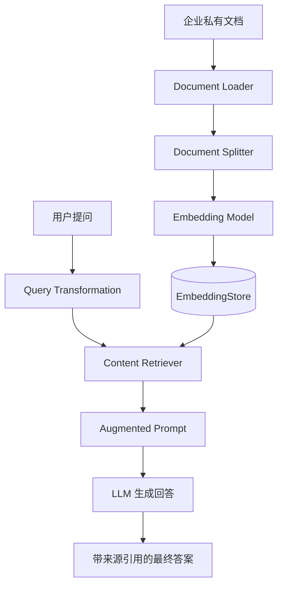
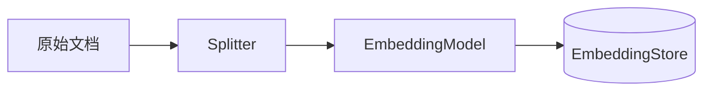

# 第5章 · RAG 检索增强生成 — 企业私有知识库的高效落地

> **预计时长**：3 小时 | **难度**：⭐⭐⭐ | **类型**：项目实战

---

## 学习目标

完成本章后，你将能够：

- 理解 RAG 检索增强生成的核心原理与完整工作流程
- 掌握 LangChain4j 中文档加载、分割、向量化的全链路 API 用法
- 熟练使用 `EmbeddingStoreIngestor` 批量构建企业知识库向量索引
- 配置 `ContentRetriever` 与 `RetrievalAugmentor` 实现精准检索增强
- 理解 Embedding Model 选型与成本/精度权衡
- 掌握混合检索、查询变换、重排序等高级 RAG 技术（v1.10.0+）
- 独立搭建一套"员工手册问答机器人"端到端系统
- 辨析 RAG 与微调、纯 LLM 推理的适用场景

---

## 知识图谱



---

## 5.1 RAG 架构总览

### 什么是 RAG？

**RAG（Retrieval-Augmented Generation）** 将信息检索与 LLM 生成相结合：在 LLM 回答前先从外部知识库检索最相关的文档片段，注入 Prompt 作为上下文，让模型基于真实信息作答。

### RAG vs 微调 vs 纯 LLM

| 维度 | 纯 LLM | 微调 | RAG |
|------|--------|------|-----|
| 知识更新 | 需重新训练 | 需重新微调 | **只需更新向量库** |
| 幻觉控制 | 高幻觉 | 仍可能产生 | **最低，有原文约束** |
| 开发成本 | 低 | 高（数据+GPU） | 中等 |
| 可解释性 | 无 | 无 | **有，可追溯原文** |
| 适用场景 | 通用问答 | 风格/行为定制 | **企业知识库** |

**何时选择 RAG？** 知识库频繁更新、需要低幻觉和来源引用、数据私有。

---

## 5.2 Document Loading

### 核心类

```java
public class Document {
    private String text;         // 文档文本
    private Metadata metadata;   // 元数据：文件名、来源URL等
}
```

### FileSystemDocumentLoader

```java
// 加载单个文件
Document doc = FileSystemDocumentLoader.loadDocument("handbook.pdf");
// 加载目录下所有 PDF
List<Document> docs = FileSystemDocumentLoader.loadDocuments(
    Paths.get("D:/handbook/"), new GlobFileMatcher("*.pdf")
);
```

### UrlDocumentLoader

```java
Document doc = UrlDocumentLoader.load(
    URI.create("https://example.com/policy.html").toURL(),
    DocumentType.HTML
);
```

### 支持格式

| 格式 | 依赖 | 说明 |
|------|------|------|
| PDF | Apache PDFBox | 自动提取文本 |
| TXT | 内置 | UTF-8 |
| HTML | JSoup | 自动去标签 |
| Markdown | 内置 | 保留结构 |

使用 Apache Tika 可自动检测格式：引入 `langchain4j-document-loader-tika` 即可。

### TextSegment

文档分割后的基本单元，也是向量化存储的基本单位：

```java
TextSegment seg = TextSegment.from("文档片段");
TextSegment seg = TextSegment.from("部分文本",
    Metadata.from("source", "handbook.pdf").and("page", "12"));
```

---

## 5.3 Document Splitting

### 分割器对比

| 分割器 | 策略 | 适用场景 |
|--------|------|---------|
| `DocumentByParagraphSplitter` | 按段落分割 | 结构化文档 |
| `DocumentBySentenceSplitter` | 按句号分割 | 自然语言文本 |
| `RecursiveSplitter` | 递归尝试不同分隔符 | **通用推荐** |

### 代码示例

```java
// 段落分割
DocumentByParagraphSplitter splitter = new DocumentByParagraphSplitter(512, 64);

// 句子分割
DocumentBySentenceSplitter splitter = new DocumentBySentenceSplitter(384, 32);

// 递归分割（推荐）
RecursiveSplitter splitter = RecursiveSplitter.builder()
    .maxCharsPerSegment(512).overlap(64).build();

List<TextSegment> segments = splitter.split(document);
```

### Overlap 的重要性

相邻片段间保留重叠文本，防止关键语义在切分边界处断裂。缺少 overlap 会导致边界上下文丢失，降低召回率。**通用推荐配置：384~512 字符 + 48~64 重叠**。

---

## 5.4 Embedding Model

### EmbeddingModel 接口

```java
public interface EmbeddingModel {
    Embedding embed(String text);
    Embedding embed(TextSegment textSegment);
    List<Embedding> embedAll(List<TextSegment> segments);
    int dimension();
}
```

### 主流模型对比

| 提供商 | 实现类 | 维度 | 场景 | 成本 |
|--------|--------|------|------|------|
| OpenAI | `OpenAiEmbeddingModel` | 1536/3072 | 通用 | 按 Token |
| Ollama | `OllamaEmbeddingModel` | 视模型 | 本地开发 | **免费** |
| HuggingFace | `HuggingFaceEmbeddingModel` | 视模型 | 私有化 | **免费** |
| DashScope | `DashScopeEmbeddingModel` | 1536 | 中文场景 | 按量 |

### 示例

```java
// OpenAI
EmbeddingModel model = OpenAiEmbeddingModel.builder()
    .apiKey(System.getenv("OPENAI_API_KEY"))
    .modelName("text-embedding-3-small").build();
Embedding emb = model.embed("员工手册第3章规定了请假流程");
System.out.println(emb.vector().length); // 1536

// Ollama（开发推荐）
EmbeddingModel model = OllamaEmbeddingModel.builder()
    .baseUrl("http://localhost:11434")
    .modelName("nomic-embed-text").build();
```

**选型建议**：开发用 Ollama + nomic-embed-text；中文生产用 DashScope 或 OpenAI text-embedding-3-small；英文生产用 OpenAI；私有化用 HuggingFace BGE/GTE 系列。

---

## 5.5 EmbeddingStore（向量数据库）

### 核心接口

```java
public interface EmbeddingStore<T> {
    String add(Embedding embedding, T embedded);
    List<String> addAll(List<Embedding> embeddings, List<T> embedded);
    List<EmbeddingMatch<T>> search(Embedding query, int maxResults, double minScore);
    void remove(String id);
}
```

### 主流存储

| 存储 | 实现类 | 适用场景 |
|------|--------|---------|
| 内存 | `InMemoryEmbeddingStore` | 开发/测试 |
| Chroma | `ChromaEmbeddingStore` | 中小规模生产 |
| PgVector | `PgVectorEmbeddingStore` | 已有 PG 基础设施 |
| Milvus | `MilvusEmbeddingStore` | 百万级大规模 |

### 代码示例

```java
// 内存存储（开发首选）
EmbeddingStore<TextSegment> store = new InMemoryEmbeddingStore<>();
store.add(embedding, textSegment);
List<EmbeddingMatch<TextSegment>> matches = store.search(query, 5, 0.7);

// Chroma（Docker: chromadb/chroma）
EmbeddingStore<TextSegment> store = ChromaEmbeddingStore.builder()
    .baseUrl("http://localhost:8000")
    .collectionName("employee_handbook").build();

// PgVector
EmbeddingStore<TextSegment> store = PgVectorEmbeddingStore.builder()
    .host("localhost").port(5432)
    .database("knowledge_base").table("handbook")
    .dimension(1536).createTable(true).build();
```

---

## 5.6 EmbeddingStoreIngestor

封装"加载 → 分割 → 向量化 → 存储"为一条流水线。



```java
EmbeddingModel model = OllamaEmbeddingModel.builder()
    .baseUrl("http://localhost:11434").modelName("nomic-embed-text").build();

EmbeddingStore<TextSegment> store = new InMemoryEmbeddingStore<>();

EmbeddingStoreIngestor ingestor = EmbeddingStoreIngestor.builder()
    .documentSplitter(RecursiveSplitter.builder()
        .maxCharsPerSegment(512).overlap(64).build())
    .embeddingModel(model)
    .embeddingStore(store)
    .build();

// 注入单个文档
Document doc = FileSystemDocumentLoader.loadDocument("handbook.pdf");
ingestor.ingest(doc);

// 批量注入（自动分批防 OOM）
List<Document> docs = FileSystemDocumentLoader.loadDocuments(
    Paths.get("D:/handbook/"), new GlobFileMatcher("*.pdf"));
ingestor.ingest(docs);
```

---

## 5.7 ContentRetriever

负责在向量库中检索与问题最相关的文档片段。

```java
ContentRetriever retriever = EmbeddingStoreContentRetriever.builder()
    .embeddingStore(store)
    .embeddingModel(model)
    .maxResults(5)     // 最多返回5个结果
    .minScore(0.6)     // 最低相似度阈值
    .build();
```

### 手动检索（无 RAG 模式）

```mermaid
sequenceDiagram
    User->>Retriever: "年假有几天？"
    Retriever->>Model: 问题→向量
    Model->>Retriever: queryEmbedding
    Retriever->>Store: search(query,5)
    Store->>Retriever: 匹配结果
    Retriever->>User: List&lt;Content&gt;
```

```java
Embedding query = model.embed("年假有几天？");
List<EmbeddingMatch<TextSegment>> matches = store.search(query, 5, 0.6);
for (var m : matches) {
    System.out.println(m.score() + " | " + m.embedded().text());
}
```

---

## 5.8 RetrievalAugmentor

协调查询变换、检索和 Prompt 组装的"大脑"。

### AiServices 完整集成

```java
interface EmployeeAssistant {
    String chat(String userMessage);
}

// 配置检索器
ContentRetriever retriever = EmbeddingStoreContentRetriever.builder()
    .embeddingStore(store).embeddingModel(model)
    .maxResults(5).minScore(0.6).build();

// 配置增强器
RetrievalAugmentor augmentor = DefaultRetrievalAugmentor.builder()
    .contentRetriever(retriever).build();

// 组装服务
EmployeeAssistant assistant = AiServices.builder(EmployeeAssistant.class)
    .chatLanguageModel(chatModel)
    .retrievalAugmentor(augmentor)
    .build();

// 提问
String answer = assistant.chat("年假有几天？");
```

### QueryTransformer（查询变换）

```java
// 查询压缩：多轮对话→独立问题
QueryTransformer compressor = CompressingQueryTransformer.builder()
    .chatLanguageModel(chatModel).build();

// 查询扩展：一个问题→多个相关查询
QueryTransformer expander = ExpandingQueryTransformer.builder()
    .chatLanguageModel(chatModel).n(3).build();

RetrievalAugmentor augmentor = DefaultRetrievalAugmentor.builder()
    .contentRetriever(retriever)
    .queryTransformer(compressor)  // 注入变换器
    .build();
```

---

## 5.9 高级 RAG 技术（v1.10.0+）

### 混合检索（Dense + Sparse）

同时使用语义向量和关键词匹配，显著提升召回率：

```java
ContentRetriever hybrid = EmbeddingStoreContentRetriever.builder()
    .embeddingStore(store).embeddingModel(model)
    .maxResults(10).minScore(0.5)
    .hybridSearch(true)   // 启用混合检索
    .build();
```

### Re-ranking 流程


初检取更多候选（如 20 个），经重排序模型逐对评分后取 Top-5，精度显著高于纯向量检索。

### 多查询检索

将问题从不同角度改写（如"年假政策"→"年假天数""申请条件"），分别检索后合并去重。

---

## 5.10 完整实战：员工手册问答机器人

### 依赖配置

```xml
<properties><langchain4j.version>1.10.0</langchain4j.version></properties>
<dependencies>
    <dependency>
        <groupId>dev.langchain4j</groupId>
        <artifactId>langchain4j</artifactId>
        <version>${langchain4j.version}</version>
    </dependency>
    <dependency>
        <groupId>dev.langchain4j</groupId>
        <artifactId>langchain4j-open-ai</artifactId>
        <version>${langchain4j.version}</version>
    </dependency>
    <dependency>
        <groupId>dev.langchain4j</groupId>
        <artifactId>langchain4j-document-loader-tika</artifactId>
        <version>${langchain4j.version}</version>
    </dependency>
</dependencies>
```

### 完整代码

```java
package com.example.rag;

import dev.langchain4j.data.document.Document;
import dev.langchain4j.data.document.loader.FileSystemDocumentLoader;
import dev.langchain4j.data.document.splitter.RecursiveSplitter;
import dev.langchain4j.data.segment.TextSegment;
import dev.langchain4j.model.chat.ChatLanguageModel;
import dev.langchain4j.model.embedding.EmbeddingModel;
import dev.langchain4j.model.openai.OpenAiChatModel;
import dev.langchain4j.model.openai.OpenAiEmbeddingModel;
import dev.langchain4j.rag.DefaultRetrievalAugmentor;
import dev.langchain4j.rag.RetrievalAugmentor;
import dev.langchain4j.rag.content.retriever.EmbeddingStoreContentRetriever;
import dev.langchain4j.service.AiServices;
import dev.langchain4j.store.embedding.EmbeddingStore;
import dev.langchain4j.store.embedding.EmbeddingStoreIngestor;
import dev.langchain4j.store.embedding.InMemoryEmbeddingStore;

public class EmployeeHandbookBot {

    interface HandbookAssistant {
        String chat(String userMessage);
    }

    public static void main(String[] args) {
        // 1. Embedding 模型
        EmbeddingModel embeddingModel = OpenAiEmbeddingModel.builder()
            .apiKey(System.getenv("OPENAI_API_KEY"))
            .modelName("text-embedding-3-small").build();

        // 2. 向量存储
        EmbeddingStore<TextSegment> store = new InMemoryEmbeddingStore<>();

        // 3. 注入文档
        EmbeddingStoreIngestor ingestor = EmbeddingStoreIngestor.builder()
            .documentSplitter(RecursiveSplitter.builder()
                .maxCharsPerSegment(512).overlap(64).build())
            .embeddingModel(embeddingModel)
            .embeddingStore(store).build();
        Document handbook = FileSystemDocumentLoader
            .loadDocument("employee-handbook.pdf");
        ingestor.ingest(handbook);
        System.out.println("员工手册已注入知识库！");

        // 4. 检索器 + 增强器
        EmbeddingStoreContentRetriever retriever =
            EmbeddingStoreContentRetriever.builder()
                .embeddingStore(store).embeddingModel(embeddingModel)
                .maxResults(5).minScore(0.6).build();
        RetrievalAugmentor augmentor = DefaultRetrievalAugmentor.builder()
            .contentRetriever(retriever).build();

        // 5. AiServices
        ChatLanguageModel chatModel = OpenAiChatModel.builder()
            .apiKey(System.getenv("OPENAI_API_KEY"))
            .modelName("gpt-4o-mini").temperature(0.0).build();

        HandbookAssistant assistant = AiServices
            .builder(HandbookAssistant.class)
            .chatLanguageModel(chatModel)
            .retrievalAugmentor(augmentor).build();

        // 6. 提问测试
        String[] questions = {"年假有几天？", "请假审批流程？", "加班工资如何计算？"};
        for (String q : questions) {
            System.out.println("Q: " + q + "\nA: " + assistant.chat(q) + "\n");
        }
    }
}
```

### 运行示例

```
Q: 年假有几天？
A: 入职满1年的员工享有5天带薪年假，工龄每增1年加1天，上限15天。
   年假需提前3个工作日通过OA申请。

Q: 请假审批流程？
A: 3天以内直属上级审批；3天以上部门负责人审批；通过后抄送HR备案。
```

---

## 常见踩坑

### 坑 1：分割粒度过大导致命中率低

`maxCharsPerSegment` 设为 2000+ 时片段语义混杂。**解决**：控制在 256~512 字符，overlap 48~64。

### 坑 2：Embedding Model 不支持中文

中文问句检索效果差。**解决**：中文场景选择 `text-embedding-3-small`、DashScope 或 BGE 中文系列。

### 坑 3：minScore 不合理

设 0.9 常返回空，0.3 噪音太多。**解决**：先用测试查询观察分数分布。经验值：OpenAI 设 0.7，Ollama 设 0.5。

### 坑 4：重复注入导致重复结果

同一文档多次 `ingestor.ingest()` 产生重复。**解决**：维护已注入文档 ID；或用支持唯一索引的向量库（PgVector）。

### 坑 5：元数据丢失无法溯源

模型给出答案但无来源——注入前确保 metadata 已设置：

```java
Document doc = FileSystemDocumentLoader.loadDocument("handbook.pdf");
doc.metadata().put("source", "handbook.pdf");
// 分割后自动继承到每个 segment
```

---

## 课后练习

### 练习 1：搭建本地 RAG 系统

使用 Ollama（`nomic-embed-text` + `qwen2.5`）+ `InMemoryEmbeddingStore`，从本地加载 3~5 份文档，使用 `RecursiveSplitter`（384 字符，48 重叠），`maxResults=3`，测试至少 5 个问题。

### 练习 2：检索质量调优

对比 `maxCharsPerSegment=256/512/1024`、`maxResults=3/5/10`、`minScore=0.5/0.7/0.9` 三种配置的效果，记录差异并总结最佳实践。

### 练习 3：集成 PgVector 持久化

将 `InMemoryEmbeddingStore` 替换为 `PgVectorEmbeddingStore`，实现知识库持久化、增量注入和按需删除。

### 练习 4：带来源引用的问答（挑战）

使用 `@Inject` 获取 `Content` 列表，输出每个引用的文件名和分数，格式：

```
回答：根据员工手册第三章规定...
参考资料：[1] handbook.pdf 第12页 (相似度: 0.94)
```

---

## 本节小结

- ✅ RAG 通过外部知识检索解决 LLM 知识过时和幻觉问题，是企业知识库落地的首选架构
- ✅ LangChain4j RAG 管线七层：Loader → Splitter → Embed Model → EmbeddingStore → ContentRetriever → RetrievalAugmentor → AiServices
- ✅ `EmbeddingStoreIngestor` 一站式封装"加载→分割→向量化→存储"
- ✅ **384~512 字符 + 48~64 重叠**是推荐的分割配置
- ✅ 生产环境推荐 PgVector/Chroma 持久化向量存储
- ✅ v1.10.0+ 支持混合检索、查询变换、重排序等高级技术
- ✅ 中文场景应选对中文友好的 Embedding Model

---

**下一章预告**：第 6 章将深入 LangChain4j 的 **Function Calling（函数调用）** 机制，学习如何让 LLM 调用外部 API、数据库查询和自定义工具，实现真正的"智能体"行为。
