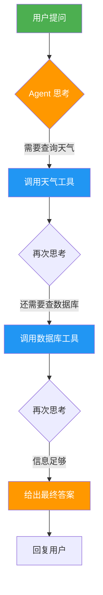
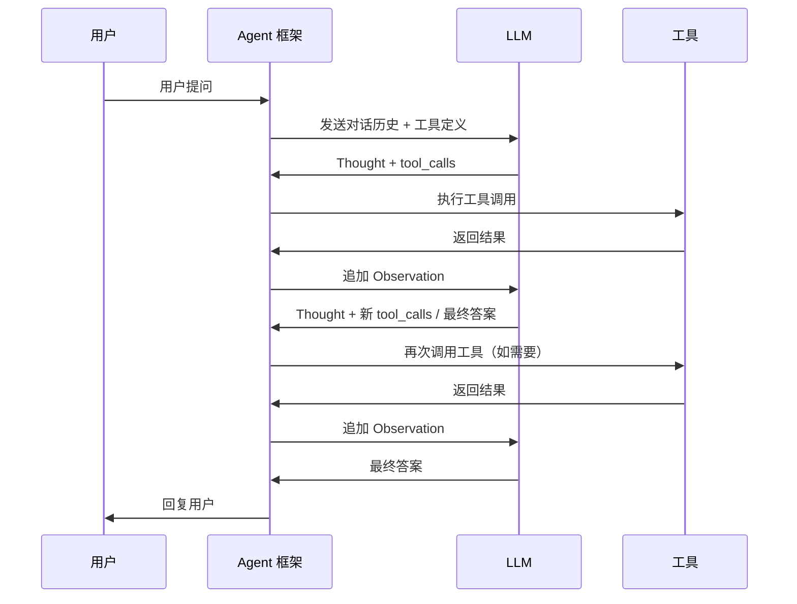
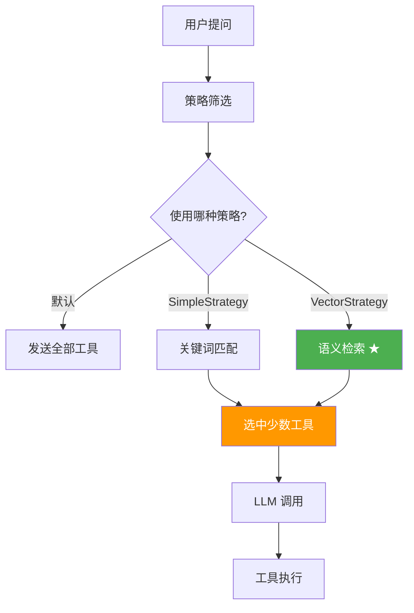
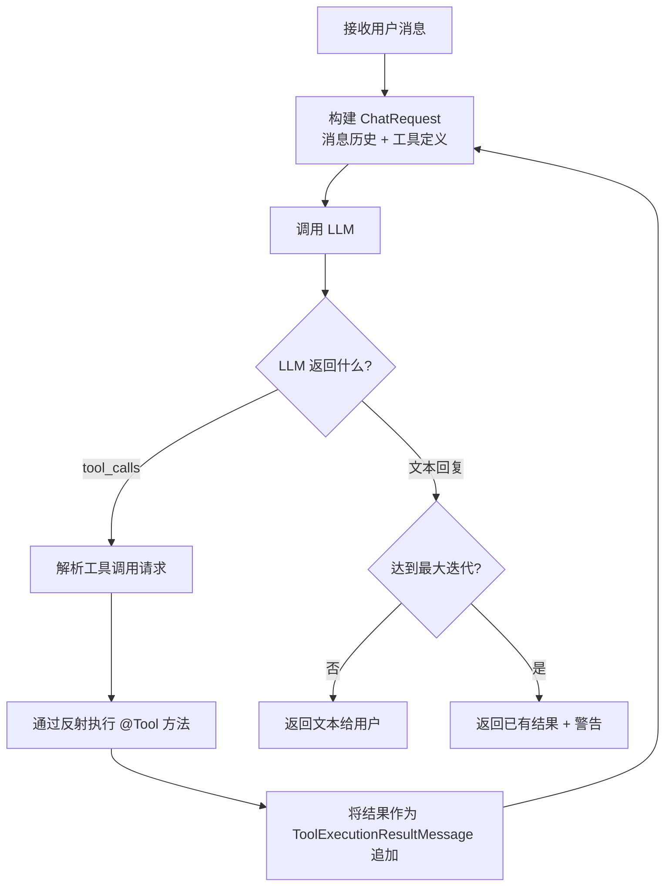
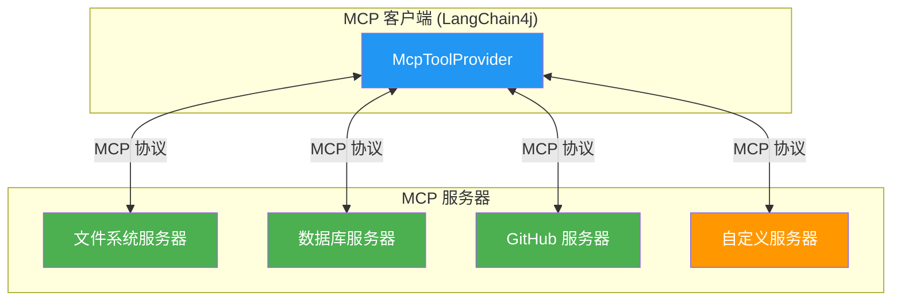

# 第6章 · 工具与 Agent — 让 AI 拥有行动能力

> **预计时长**：3 小时 | **难度**：⭐⭐⭐ | **类型**：项目实战

---

## 学习目标

学完本章后，你将能够：
- 理解 Agent 与常规 Chain 的本质区别，掌握 ReAct 循环的工作机制
- 使用 `@Tool` 注解定义任意 Java 方法为 LLM 可调用的工具
- 掌握工具继承（v1.16.0+）和动态工具发现（v1.10.0+）等进阶特性
- 在 `AiServices` 中组合声明工具，打通 LLM 与外部系统的双向通道
- 深入理解 LangChain4j 内部 ReAct Agent 的执行流程与配置选项
- 掌握 MCP（Model Context Protocol）集成，连接标准化工具生态系统
- 为生产环境的工具调用添加错误处理和安全防护

---

## 知识地图

```mermaid
graph TD
    subgraph C1["概念基础"]
        A[Chain vs Agent] --> B[ReAct 循环]
        B --> C[Thought → Action → Observation]
    end
    subgraph C2["工具定义"]
        D[@Tool 注解] --> E[描述与参数]
        E --> F[工具继承 v1.16+]
        E --> G[动态发现 v1.10+]
    end
    subgraph C3["Agent 执行"]
        H[AiServices 组装] --> I[ReAct 循环引擎]
        I --> J[函数调用模式]
        I --> K[文本 ReAct 模式]
    end
    subgraph C4["MCP 集成"]
        L[MCP 协议] --> M[stdio / HTTP / WebSocket]
        M --> N[MCP 客户端]
        N --> O[ToolProvider]
    end
    subgraph C5["生产化"]
        P[错误处理] --> Q[安全防护]
        Q --> R[生产部署]
    end
    C1 --> C2 --> C3 --> C4 --> C5

    style A fill:#FF9800,color:#fff
    style D fill:#4CAF50,color:#fff
    style H fill:#2196F3,color:#fff
    style L fill:#9C27B0,color:#fff
    style P fill:#f44336,color:#fff
```

---

## 6.1 从 Chain 到 Agent：思维方式的转变

### Chain（链）——确定性的流水线

在之前的章节中，我们构建的应用本质上都是 **Chain（链）** ：输入按预定顺序经过一系列步骤，每步做什么是开发者在编译期写死的。例如"先总结 → 再翻译 → 最后格式化输出"。


**Chain 的特点**：
- 执行路径 **在编码时已固定**
- 每一步做什么是**开发者决定的**
- 适合流程明确的场景（翻译、分类、提取）

### Agent（智能体）——动态的决策者

**Agent（智能体）** 的核心区别在于：不是开发者决定下一步做什么，而是 **LLM 自己决定**。

Agent 被赋予一组"工具"和一个目标，然后它自主决定：

1. 当前应该调用哪个工具
2. 是否需要多次调用
3. 信息是否已足够，可以给出最终答案



### ReAct 循环：Agent 的心脏

主流 Agent 框架（包括 LangChain4j）都基于 **ReAct（Reasoning + Acting）** 范式：

| 阶段 | 含义 | 谁执行 |
|------|------|--------|
| **Thought（思考）** | LLM 分析当前状态，决定下一步行动 | LLM |
| **Action（行动）** | 调用选定的工具，传入参数 | 框架 + Java 代码 |
| **Observation（观察）** | 将工具返回结果送回 LLM | 框架 |
| **循环** | 重复以上步骤，直到 LLM 认为任务完成 | LLM + 框架 |



> **关键区别**：Chain 是 if-else 的升级版，Agent 是 while-loop 的 AI 版——它会反复思考、行动、观察，直到任务完成。

---

## 6.2 定义工具：@Tool 注解

让 LLM 能够调用 Java 代码，核心就是 `@Tool` 注解。它由 LangChain4j 提供，标注在方法上，框架会自动将方法签名、参数描述等信息编译为 LLM 可理解的工具定义（Function Calling Schema）。

### 6.2.1 最简单的工具

```java
import dev.langchain4j.agent.tool.Tool;

public class WeatherTool {

    @Tool("查询指定城市的当前天气")
    public String getWeather(String city) {
        // 实际项目中调用天气 API
        if ("北京".equals(city)) {
            return "北京：晴，25°C，空气质量良";
        } else if ("上海".equals(city)) {
            return "上海：多云，28°C，湿度 75%";
        }
        return city + "：暂无天气数据";
    }
}
```

### 6.2.2 描述即一切

LLM 决定"是否调用某个工具"的唯一依据就是 **工具的描述（description）**。描述写得越清晰，LLM 的决策就越准确。

```java
public class DocumentTool {

    @Tool("根据文档 ID 搜索企业内部知识库中的文档内容，返回文档标题和摘要。"
         + "仅限内部员工使用，外部用户无权访问。"
         + "参数 docId 为文档的数字编号，如 10023")
    public String searchDocument(int docId) {
        // 实际查询知识库
        return "文档 #" + docId + "：《LangChain4j 最佳实践》，共计 42 页";
    }
}
```

`@Tool` 注解的 `value` 就是描述文本。建议包含：
- 工具能做什么（**必须**）
- 参数含义和格式（**强烈建议**）
- 使用限制或前提条件（可选但有益）

### 6.2.3 参数描述：@P 注解

参数描述通过 `@P` 注解提供，让 LLM 知道每个参数的含义、格式和约束：

```java
import dev.langchain4j.agent.tool.P;

public class CalculatorTool {

    @Tool("执行四则运算，支持加、减、乘、除")
    public double calculate(
        @P("运算表达式，例如 '12.5 * 3' 或 '100 / 7'") String expression
    ) {
        // 注意：生产环境应使用安全的表达式求值库
        // 这里使用 ScriptEngine 仅作演示
        try {
            javax.script.ScriptEngine engine =
                new javax.script.ScriptEngineManager().getEngineByName("JavaScript");
            return (double) engine.eval(expression);
        } catch (Exception e) {
            throw new RuntimeException("表达式非法: " + expression);
        }
    }

    @Tool("计算两点之间的欧几里得距离")
    public double distance(
        @P("第一个点的 x 坐标") double x1,
        @P("第一个点的 y 坐标") double y1,
        @P("第二个点的 x 坐标") double x2,
        @P("第二个点的 y 坐标") double y2
    ) {
        return Math.sqrt(Math.pow(x2 - x1, 2) + Math.pow(y2 - y1, 2));
    }
}
```

### 6.2.4 自定义工具名称

默认情况下，工具名称就是 Java 方法名。也可以通过 `@Tool(name = "...")` 显式指定：

```java
public class DatabaseTool {

    @Tool(name = "query_user_by_id", value = "根据用户 ID 查询用户信息")
    public String queryUser(
        @P("用户 ID，整数类型") long userId
    ) {
        // 查询数据库
        return "User(id=" + userId + ", name=张三, email=zhangsan@example.com)";
    }

    @Tool(name = "query_order_list", value = "查询指定用户的订单列表，返回订单号和金额")
    public String queryOrders(
        @P("用户 ID") long userId,
        @P("查询最近 N 天的订单，默认 30 天") int days
    ) {
        // 查询订单表
        return "[Order(1001, ¥299), Order(1002, ¥1500)]";
    }
}
```

> **最佳实践**：工具名称使用 `snake_case` 或 `camelCase` 均可，但需注意不同模型偏好不同。OpenAI 对蛇形命名更友好，Claude 对两种风格都兼容。

### 6.2.5 工具返回值类型

工具方法可以返回任意类型，框架会自动序列化为 JSON 字符串传给 LLM：

```java
import java.time.LocalDate;

// POJO 返回值：自动转为 JSON
public record FlightInfo(
    String flightNo,
    String departure,
    String arrival,
    LocalDate date,
    String status
) {}

public class FlightTool {

    @Tool("查询航班动态信息，返回航班号、起降地、日期和当前状态")
    public FlightInfo queryFlight(
        @P("航班号，如 CA1234") String flightNo
    ) {
        // 模拟查询
        return new FlightInfo(
            flightNo,
            "北京首都",
            "上海虹桥",
            LocalDate.now(),
            "准点"
        );
    }
}
```

当工具返回 `FlightInfo` 这样的 POJO 时，LLM 收到的 Observation 是：
```json
{
  "flightNo": "CA1234",
  "departure": "北京首都",
  "arrival": "上海虹桥",
  "date": "2026-06-15",
  "status": "准点"
}
```

---

## 6.3 工具继承（v1.16.0+）

从 LangChain4j **v1.16.0** 开始，`@Tool` 注解的方法可以从父类和接口继承。这对于构建可复用的工具基类非常有用：

### 父类继承

```java
// 抽象基类：定义通用工具
public abstract class BaseTools {

    @Tool("获取当前系统时间")
    public String getCurrentTime() {
        return java.time.LocalDateTime.now().toString();
    }

    @Tool("获取当前日期")
    public String getCurrentDate() {
        return java.time.LocalDate.now().toString();
    }
}

// 子类：继承父类的工具，同时添加自己的工具
public class OrderTools extends BaseTools {

    @Tool("查询订单状态")
    public String queryOrderStatus(@P("订单号") String orderId) {
        return "订单 " + orderId + " 状态：已发货";
    }

    @Tool("取消订单")
    public String cancelOrder(@P("订单号") String orderId) {
        return "订单 " + orderId + " 已取消";
    }
}
```

### 接口继承

```java
// 接口定义工具契约
public interface LoggerTools {

    @Tool("记录一条调试日志")
    default String logDebug(@P("日志内容") String message) {
        System.out.println("[DEBUG] " + message);
        return "日志已记录";
    }
}

// 实现类自动获得接口中的 @Tool 方法
public class UserServiceAgent extends BaseTools implements LoggerTools {

    @Tool("查询用户信息")
    public String findUser(@P("用户名") String username) {
        return "User: " + username;
    }
}
```

**使用继承的工具**：

```java
UserServiceAgent agent = new UserServiceAgent();

Assistant assistant = AiServices.builder(Assistant.class)
    .chatLanguageModel(model)
    .tools(agent)  // 传入子类实例，自动包含 getCurrentTime、logDebug、findUser
    .build();
```

> **注意**：继承工具要求 v1.16.0 及以上版本。在旧版本中，即使父类方法标注了 `@Tool`，子类实例传入 `tools()` 时也不会被识别。

---

## 6.4 动态工具发现（v1.10.0+）

### 问题：工具太多怎么办？

当你的 Agent 拥有几十个甚至上百个工具时，将所有工具定义塞入 LLM 的上下文会导致：

- **Token 消耗剧增**：每个工具定义可能消耗数百 Token，100 个工具就是数万 Token
- **决策质量下降**：LLM 在过多选项中更容易选错
- **成本失控**：每次请求的输入 Token 大幅增加

### 解决方案：工具搜索策略

LangChain4j 提供 `ToolSearchStrategy` 接口，在每次 LLM 调用前**只选择最相关的工具**发送给模型：



#### SimpleToolSearchStrategy（关键词过滤）

基于关键词的简单匹配，适合工具名称/描述中包含明确关键词的场景：

```java
import dev.langchain4j.agent.tool.*;
import static dev.langchain4j.agent.tool.ToolSearchStrategies.*;

Assistant assistant = AiServices.builder(Assistant.class)
    .chatLanguageModel(model)
    .tools(new WeatherTool(), new CalculatorTool(), new DatabaseTool(),
           new EmailTool(), new SmsTool(), new FileTool() /* 共 20+ 工具 */)
    .toolSearchStrategy(simpleStrategy())
    .build();
```

`simpleStrategy()` 内部会对用户查询进行分词，并与工具的名称和描述进行匹配，只保留命中关键词的工具。

#### VectorToolSearchStrategy（语义检索）

更加智能的方案——使用 Embedding 向量检索，根据语义相关性选择工具：

```java
import dev.langchain4j.agent.tool.ToolSearchStrategies;
import static dev.langchain4j.agent.tool.ToolSearchStrategies.*;

Assistant assistant = AiServices.builder(Assistant.class)
    .chatLanguageModel(model)
    .tools(allTools)  // 大量工具
    .toolSearchStrategy(vectorStrategy(embeddingModel))  // 需要 EmbeddingModel
    .build();
```

**工作原理**：

1. 启动时，将所有工具的描述文本向量化存入内存向量库
2. 每次用户提问时，将用户输入也向量化
3. 执行相似度检索，返回 Top-K 最相关的工具（默认 K=3）
4. 仅将 K 个工具的定义发送给 LLM

```java
// 自定义 Top-K 数量
import dev.langchain4j.agent.tool.vector.VectorToolSearchStrategy;

VectorToolSearchStrategy strategy = VectorToolSearchStrategy.builder()
    .embeddingModel(embeddingModel)
    .maxResults(5)           // 每次最多选 5 个工具
    .minScore(0.65)          // 最低相似度阈值
    .build();

Assistant assistant = AiServices.builder(Assistant.class)
    .chatLanguageModel(model)
    .tools(allTools)
    .toolSearchStrategy(strategy)
    .build();
```

> **何时用哪种策略？**
>
> | 策略 | 工具数量 | 推荐场景 |
> |------|---------|---------|
> | 默认（全部发送） | < 10 个 | 简单场景，无需过滤 |
> | SimpleStrategy | 10~50 个 | 工具名/描述有明显关键词可匹配 |
> | VectorStrategy | > 50 个 | 工具描述差异微妙，需语义理解 |

---

## 6.5 声明工具：AiServices 中的 tools()

### 基础用法

在前面几章中我们已经多次使用 `AiServices`。将工具接入只需调用 `.tools()` 方法：

```java
interface Assistant {
    String chat(String userMessage);
}

Assistant assistant = AiServices.builder(Assistant.class)
    .chatLanguageModel(model)
    .tools(
        new WeatherTool(),
        new CalculatorTool(),
        new FlightTool()
    )
    .build();

String response = assistant.chat("明天上海天气怎么样？适合飞北京吗？");
// LLM 会自主决定调用 WeatherTool 查上海天气，再调用 FlightTool 查航班
```

### 组合记忆、RAG 和工具

AiServices 可以同时配置多个组件，彼此协同工作：

```java
Assistant assistant = AiServices.builder(Assistant.class)
    .chatLanguageModel(model)
    .chatMemory(MessageWindowChatMemory.withMaxMessages(20))  // 对话记忆
    .contentRetriever(EmbeddingStoreContentRetriever.builder()  // RAG
        .embeddingStore(embeddingStore)
        .embeddingModel(embeddingModel)
        .maxResults(3)
        .build())
    .tools(new CustomerTool(), new OrderTool(), new ProductTool())  // 工具
    .build();
```

### ToolProvider 接口

除了 `.tools()` 的便捷方式，LangChain4j 还提供了 `ToolProvider` 接口，允许以编程方式提供工具：

```java
import dev.langchain4j.agent.tool.*;

ToolProvider myProvider = new ToolProvider() {
    @Override
    public Collection<ToolSpecification> toolSpecifications() {
        // 返回工具规格列表
        return List.of(
            ToolSpecification.builder()
                .name("myTool")
                .description("我的自定义工具")
                .addParameter("arg1", JsonStringSchema.SCHEMA_DEFINITION)
                .build()
        );
    }

    @Override
    public ToolExecutionResult execute(ToolExecutionRequest request) {
        // 执行工具并返回结果
        String result = "执行结果：" + request.arguments();
        return ToolExecutionResult.builder()
            .id(request.id())
            .toolName(request.name())
            .result(result)
            .build();
    }
};

Assistant assistant = AiServices.builder(Assistant.class)
    .chatLanguageModel(model)
    .toolProvider(myProvider)
    .build();
```

LangChain4j 内置了几个 `ToolProvider` 实现：
- **`McpToolProvider`**：基于 MCP 协议的工具提供者（见 6.7 节）
- 自定义 `ToolProvider`：可动态决定返回哪些工具规格

---

## 6.6 ReAct Agent 执行机制

### 函数调用模式 vs 文本 ReAct 模式

LangChain4j 的 Agent 实现支持两种模式：

| 模式 | 底层机制 | 适用模型 | 优势 |
|------|---------|---------|------|
| **函数调用模式** | LLM 原生 Function Calling API | GPT-4、Claude、Gemini、DeepSeek 等商业模型 | 稳定、高效、结构化 |
| **文本 ReAct 模式** | 在提示词中嵌入 ReAct 格式指令 | Ollama 本地模型、不支持 Function Calling 的模型 | 兼容性好，无需 Provider 支持 |

绝大多数情况下，你不需要手动选择模式——LangChain4j 会自动检测 LLM 是否支持 Function Calling，若支持则使用函数调用模式，否则回退到文本 ReAct。

### 内部执行流程

当 `AiServices` 检测到 LLM 返回 `tool_calls`（函数调用请求）时：



### 控制最大迭代次数

默认情况下，Agent 最多进行 10 次工具调用循环（防止无限循环）。可以通过 `AiServices` 配置：

```java
import dev.langchain4j.service.VaryingParameters;

// 全局最大迭代次数
ToolExecutionPlanManager planManager = ToolExecutionPlanManager.builder()
    .maxIterations(5)
    .build();

Assistant assistant = AiServices.builder(Assistant.class)
    .chatLanguageModel(model)
    .tools(new WeatherTool(), new CalculatorTool())
    .toolExecutionPlanManager(planManager)
    .build();
```

> **注意**：如果达到最大迭代次数时 LLM 仍未给出最终答案，框架会返回当前的累积信息。生产环境中应考虑在系统提示词中引导 LLM 尽快决策。

### 流式 Agent

Agent 也支持流式输出，让用户实时看到思考过程：

```java
interface StreamingAssistant {
    TokenStream chat(String userMessage);
}

StreamingAssistant assistant = AiServices.builder(StreamingAssistant.class)
    .streamingChatLanguageModel(streamingModel)
    .tools(new WeatherTool())
    .build();

assistant.chat("北京今天天气如何？")
    .onNext(System.out::print)
    .onToolExecuted(request -> {
        System.out.println("\n[调用工具] " + request.name());
    })
    .onComplete(response -> {
        System.out.println("\n[DONE]");
    })
    .onError(Throwable::printStackTrace)
    .start();
```

---

## 6.7 MCP（Model Context Protocol）集成

### 什么是 MCP？

**MCP（Model Context Protocol）** 是 Anthropic 于 2024 年底发布的开源协议，旨在为 LLM 应用提供**标准化的工具和服务接口**。可以将其理解为"AI 应用的 USB 协议"——只要服务方实现了 MCP 协议，任何 MCP 客户端（包括 LangChain4j）都可以无缝调用其工具。



### 支持的传输方式

| 传输方式 | 说明 | 推荐场景 |
|---------|------|---------|
| **stdio** | 通过标准输入/输出与子进程通信 | 本地工具，无需网络 |
| **HTTP (Streamable HTTP)** | 基于 HTTP 长连接，支持服务端推送 | 远程服务，标准 REST |
| **WebSocket** | 全双工通信，低延迟 | 实时交互场景 |
| **Docker** | 容器化部署，隔离性强 | 生产环境安全隔离 |

### 基础集成：连接 MCP 文件系统服务器

先添加 MCP 依赖：

```xml
<dependency>
    <groupId>dev.langchain4j</groupId>
    <artifactId>langchain4j-mcp</artifactId>
    <version>${langchain4j.version}</version>
</dependency>
```

通过 stdio 连接到文件系统 MCP 服务器：

```java
import dev.langchain4j.mcp.client.*;
import dev.langchain4j.mcp.client.transport.*;
import dev.langchain4j.mcp.client.transport.stdio.*;
import java.time.Duration;

// 1. 配置 MCP 传输层
McpTransport transport = StdioMcpTransport.builder()
    .command(List.of("npx", "-y", "@modelcontextprotocol/server-filesystem", "C:/temp"))
    .logEvents(true)  // 调试用，生产环境可关闭
    .build();

// 2. 创建 MCP 客户端
McpClient mcpClient = McpClient.builder()
    .transport(transport)
    .build();

// 3. 创建 MCP 工具提供者
ToolProvider toolProvider = new McpToolProvider(mcpClient);

// 4. 组装 AiServices
Assistant assistant = AiServices.builder(Assistant.class)
    .chatLanguageModel(model)
    .toolProvider(toolProvider)
    .build();

// 5. 使用——LLM 可自主调用文件系统工具
String response = assistant.chat("请列出 C:/temp 目录下的所有文件，并读取 README.txt 的内容");
System.out.println(response);
```

### HTTP 传输方式

对于远程 MCP 服务器，使用 HTTP 传输：

```java
import dev.langchain4j.mcp.client.transport.http.*;

McpTransport transport = HttpMcpTransport.builder()
    .baseUrl("http://localhost:8080/mcp")
    .timeout(Duration.ofSeconds(30))
    .build();

McpClient mcpClient = McpClient.builder()
    .transport(transport)
    .build();
```

### 输出 Schema 支持（v1.16.0+）

从 v1.16.0 起，MCP 工具定义支持 `outputSchema`，让 LLM 更好地理解工具的返回数据结构：

```java
// MCP 服务器端（如使用 Quarkus MCP）可定义输出 schema
// 这有助于 LLM 预知返回数据的结构，提高后续决策质量
```

### Quarkus 中的 MCP 集成

如果你使用 Quarkus 框架，可以利用 `@McpToolBox` 注解更简洁地定义 MCP 工具：

```java
import io.quarkus.mcp.*;

@McpToolBox
public class MyMcpTools {

    @McpTool(name = "analyze_sentiment")
    @McpToolParam(name = "text", description = "待分析的文本")
    public String analyzeSentiment(String text) {
        // 情感分析逻辑
        return "positive";
    }

    @McpTool(name = "get_stock_price")
    @McpToolParam(name = "symbol", description = "股票代码")
    public double getStockPrice(String symbol) {
        // 查询股票价格
        return 158.50;
    }
}
```

在 `application.properties` 中配置 MCP 服务器：

```properties
quarkus.mcp.server.enabled=true
quarkus.mcp.server.transport-type=stdio
```

### 多 MCP 服务器组合

一个 Agent 可以同时连接多个 MCP 服务器，获得更丰富的工具能力：

```java
McpTransport fsTransport = StdioMcpTransport.builder()
    .command(List.of("npx", "-y", "@modelcontextprotocol/server-filesystem", "/data"))
    .build();

McpTransport dbTransport = StdioMcpTransport.builder()
    .command(List.of("python", "db-mcp-server.py"))
    .build();

McpClient fsClient = McpClient.builder().transport(fsTransport).build();
McpClient dbClient = McpClient.builder().transport(dbTransport).build();

// 合并多个 MCP 工具提供者
ToolProvider combinedProvider = ToolProvider.union(
    new McpToolProvider(fsClient),
    new McpToolProvider(dbClient)
);

Assistant assistant = AiServices.builder(Assistant.class)
    .chatLanguageModel(model)
    .toolProvider(combinedProvider)
    .build();
```

---

## 6.8 错误处理

### 工具抛出异常时

当 `@Tool` 方法抛出异常时，LangChain4j 默认会将异常信息转换为 Observation 文本返回给 LLM，让 LLM 决定如何应对：

```java
public class PaymentTool {

    @Tool("执行支付扣款")
    public String processPayment(
        @P("订单号") String orderId,
        @P("支付金额，单位元") double amount
    ) {
        if (amount <= 0) {
            throw new IllegalArgumentException("金额必须大于零，收到: " + amount);
        }
        if (amount > 10000) {
            throw new RuntimeException("单笔支付超过 10000 元限额，需人工审批");
        }
        // 实际支付逻辑
        return "支付成功，订单 " + orderId + " 已扣款 " + amount + " 元";
    }
}
```

当 LLM 收到 `Observation: 金额必须大于零，收到: -100` 时，它可能会：
- 自我纠正，重新传入正确的参数
- 或者向用户说明错误原因，询问正确的输入

### 优雅的错误提示模式

更好的做法是**不抛异常，而是返回结构化错误信息**，让 LLM 更容易理解：

```java
@Tool("查询客户信息，返回 JSON 格式")
public String queryCustomer(@P("客户 ID") String customerId) {
    try {
        Customer customer = customerRepository.findById(customerId);
        if (customer == null) {
            return "{\"error\": \"NOT_FOUND\", \"message\": \"客户 " + customerId + " 不存在\"}";
        }
        return String.format(
            "{\"id\": \"%s\", \"name\": \"%s\", \"level\": \"%s\"}",
            customer.id(), customer.name(), customer.level()
        );
    } catch (Exception e) {
        return "{\"error\": \"SYSTEM_ERROR\", \"message\": \"数据库查询异常: " + e.getMessage() + "\"}";
    }
}
```

### 降级模式

对于非关键工具，可以设计降级逻辑：

```java
@Tool("发送短信通知")
public String sendSms(
    @P("手机号") String phone,
    @P("短信内容") String message
) {
    try {
        smsService.send(phone, message);
        return "短信已发送至 " + phone;
    } catch (Exception e) {
        // 降级：记日志并通过备用通道
        log.warn("短信发送失败，已转邮件通知: {}", e.getMessage());
        emailService.send("admin@company.com", "短信发送失败通知", phone + ": " + message);
        return "短信发送失败（已通过邮件通知管理员），请提醒用户检查手机号";
    }
}
```

---

## 6.9 安全注意事项

工具赋予了 LLM"行动能力"，这也意味着**风险随之而来**。在生产环境中使用 Agent 必须考虑以下安全层面：

### 原则：最小权限

每个工具只暴露必要的能力，不要给 LLM "万能工具"：

```java
// ❌ 危险：让 LLM 可以直接执行任意系统命令
@Tool("执行系统命令")
public String runCommand(@P("命令") String cmd) {
    Runtime.getRuntime().exec(cmd);  // 极度危险！
    return "ok";
}

// ✅ 安全：只暴露明确、有限的操作
@Tool("在 /data/reports 目录下列出文件")
public String listReports() {
    File dir = new File("/data/reports");
    return Arrays.toString(dir.list());
}

@Tool("读取 /data/reports 下的指定报告文件")
public String readReport(@P("文件名") String filename) {
    // 防止路径穿越
    if (filename.contains("..") || filename.contains("/")) {
        return "错误：文件名不合法";
    }
    File file = new File("/data/reports", filename);
    if (!file.getCanonicalPath().startsWith("/data/reports")) {
        return "错误：访问被拒绝";
    }
    // 安全读取文件...
    return "文件内容...";
}
```

### 输入验证

始终验证工具参数，不要假设 LLM 会传入"合理"的值：

```java
public class UserTool {

    @Tool("删除用户（需要管理员权限）")
    public String deleteUser(@P("要删除的用户 ID") long userId) {
        // 验证：不允许删除管理员账户
        if (userId <= 0) {
            return "错误：用户 ID 无效";
        }
        if (userId == 1) {
            return "错误：不允许删除超级管理员";
        }
        // 业务逻辑...
        return "用户 " + userId + " 已删除";
    }
}
```

### 沙箱执行

对于高风险工具（如文件操作、命令执行），建议在隔离环境中运行：

```java
// 方案 1：使用线程池限制资源
ExecutorService sandbox = Executors.newSingleThreadExecutor(r -> {
    Thread t = new Thread(r, "tool-sandbox");
    t.setDaemon(true);
    t.setPriority(Thread.MIN_PRIORITY);
    return t;
});

// 方案 2：将工具部署为独立微服务 + MCP 协议
// 通过 MCP 的 stdio/Docker 传输层天然实现进程级隔离
```

### 审计日志

所有工具调用都应记录，便于事后审计：

```java
public class AuditedWeatherTool extends WeatherTool {

    @Override
    @Tool("查询天气")
    public String getWeather(@P("城市名") String city) {
        String result = super.getWeather(city);
        // 记录审计日志
        System.out.printf("[AUDIT] %s | tool=getWeather | args=[%s] | result=%s%n",
            java.time.Instant.now(), city, result);
        return result;
    }
}
```

### 安全对照表

| 风险 | 场景 | 缓解措施 |
|------|------|---------|
| **提示注入** | 用户输入诱导 LLM 调用危险工具 | 系统提示词固化；敏感工具增加确认步骤 |
| **权限提升** | LLM 调用本应由高层级用户使用的工具 | 按用户角色过滤可用工具集 |
| **资源耗尽** | LLM 循环调用工具导致无限执行 | 设置 `maxIterations`；工具内加超时和限流 |
| **数据泄露** | 工具返回了不应暴露的敏感信息 | 工具返回值脱敏；对返回内容做二次过滤 |
| **路径穿越** | 通过参数操纵文件路径访问非法区域 | 严格校验路径参数，使用白名单 |

---

## 常见踩坑

**1. LLM 总是调用错误的工具**
- 原因：工具描述（description）写得不够清晰或存在歧义，LLM 无法准确判断何时使用哪个工具
- 解决：重构工具描述，明确"何时用"和"何时不用"。例如："此工具仅用于查询实时天气，不用于历史天气或天气预报"。必要时在描述中给出反面示例

**2. 工具参数类型不匹配导致 LLM 频繁重试**
- 原因：`@P` 注解描述未说明参数格式（如日期格式、单位），LLM 传入的值无法正确解析
- 解决：在 `@P` 描述中明确参数的格式要求，例如 `@P("日期，格式 yyyy-MM-dd，如 2026-06-15")`；对于枚举值，明确列出可接受的取值列表

**3. Agent 陷入无限循环（Tool Call Loop）**
- 原因：工具返回的结果被 LLM 理解为"还需要再次调用"，或者 LLM 始终认为信息不足
- 解决：检查工具返回值是否清晰完整，让 LLM 明确知道"这就是最终结果"；设置 `maxIterations` 上限；在系统提示词中加入"尽快给出最终答案"的引导

**4. MCP 连接超时或工具无响应**
- 原因：MCP 服务器启动失败、网络不通或子进程异常退出
- 解决：使用 `McpClient.builder().timeout(Duration.ofSeconds(30))` 设置超时；添加 `logEvents(true)` 开启调试日志；确保 MCP 服务器的命令路径正确

**5. 工具继承（v1.16.0+）在旧版本中不生效**
- 原因：项目使用的 LangChain4j 版本低于 1.16.0，框架不扫描父类和接口中的 `@Tool` 方法
- 解决：升级至 v1.16.0+；如果无法升级，将所有 `@Tool` 方法定义在同一个类中

---

## 课后练习

**练习 1：构建个人助手 Agent**
定义至少 4 个工具：查询天气、查询时间、发送邮件（模拟）、查询日历事件。使用 `AiServices` 构建一个 Agent，让它能够回答"明天上午天气怎么样？帮我设置一个提醒"这类复合问题。尝试问一些需要按顺序调用多个工具的问题，观察 LLM 的执行顺序。

**练习 2：实现动态工具发现**
创建 15-20 个工具（名称和描述覆盖不同领域，如财务、人事、IT、销售等），分别使用默认策略、`simpleStrategy()` 和 `vectorStrategy(embeddingModel)` 三种方式进行对比。用同样的 5 个问题测试三种策略下的 Token 消耗和执行准确性。

**练习 3：MCP 文件系统工具集成**
安装 `@modelcontextprotocol/server-filesystem`，通过 stdio 传输方式将文件系统工具接入 Agent。让 Agent 执行：创建目录 → 写入文件 → 读取文件 → 列出目录结构等操作。观察 Agent 在多步操作中的自主决策能力。

**练习 4：安全加固**
基于练习 1 的 Agent，添加安全审计日志；模拟一个"提示注入"攻击场景（用户在对话中要求 Agent 执行未授权的操作），测试你的工具是否能抵御此类攻击。尝试在 `@Tool` 方法中添加参数校验和权限校验逻辑。

---

## 本节小结

- ✅ Agent 与 Chain 的本质区别在于：Agent 让 LLM 自主决策执行路径，而非开发者预先固定
- ✅ `@Tool` 注解是连接 LLM 与 Java 代码的桥梁，描述质量直接影响 LLM 的决策准确性
- ✅ v1.16.0+ 支持工具继承，`@Tool` 方法可从父类和接口自动继承
- ✅ 动态工具发现（v1.10.0+）使用关键词或向量检索从大量工具中筛选最相关项，有效降低 Token 消耗
- ✅ AiServices 的 `tools()` 方法可以同时组合工具、记忆和 RAG，构建全能 Agent
- ✅ LangChain4j 支持函数调用和文本 ReAct 两种模式，自动适配不同模型
- ✅ **MCP 集成是本章的亮点特性**——通过标准化协议连接文件系统、数据库等外部工具生态
- ✅ 生产环境的 Agent 必须考虑错误处理、输入验证、最小权限和审计日志等安全措施

---

> **下一章预告：第 7 章 · 生产化部署与运维**  
> 本章学习了如何赋予 LLM 行动能力，下一章我们将聚焦生产环境中的关键问题——性能调优、监控告警、成本控制、A/B 测试和多模型路由策略。从原型验证到上线运营，构建真正可依赖的 LLM 应用基础设施。
