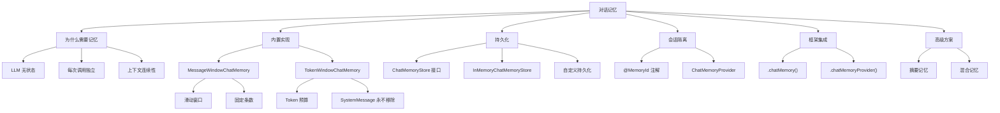
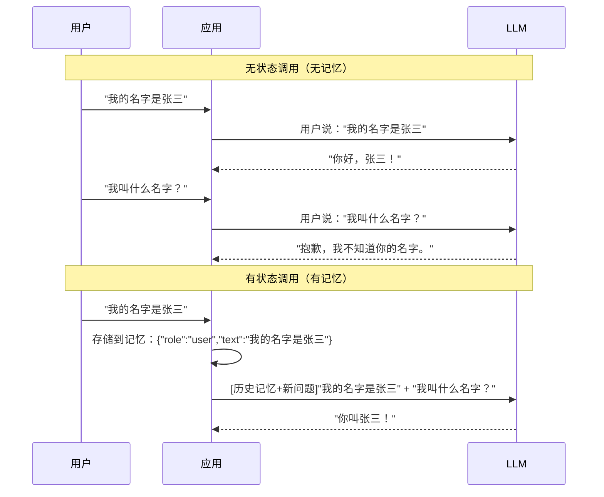
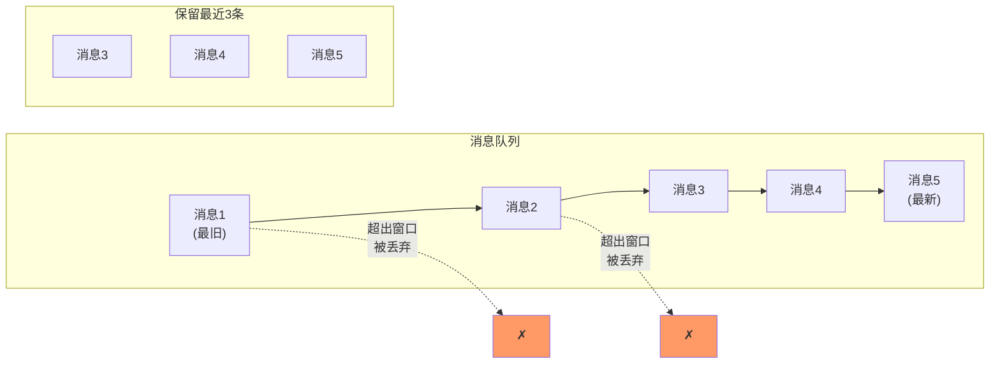
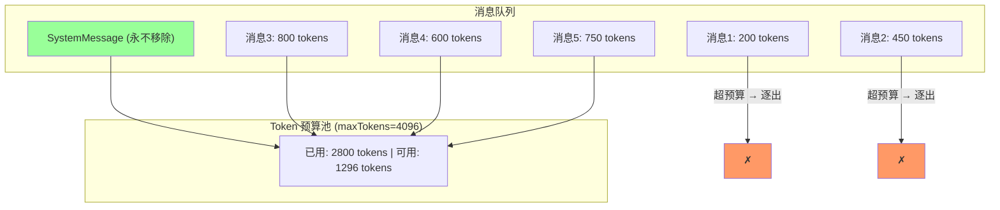
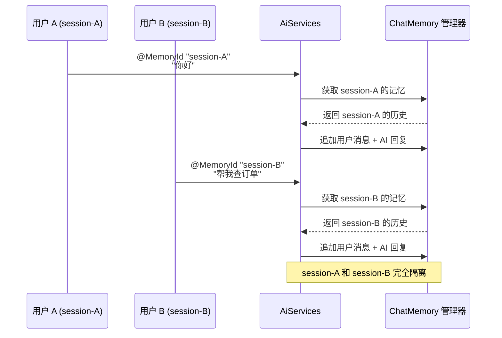
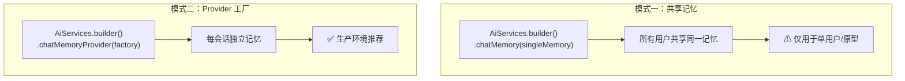
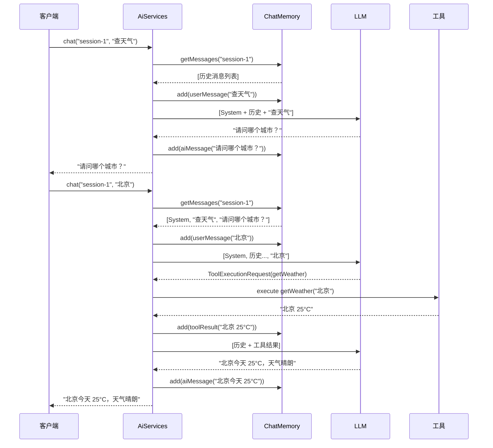
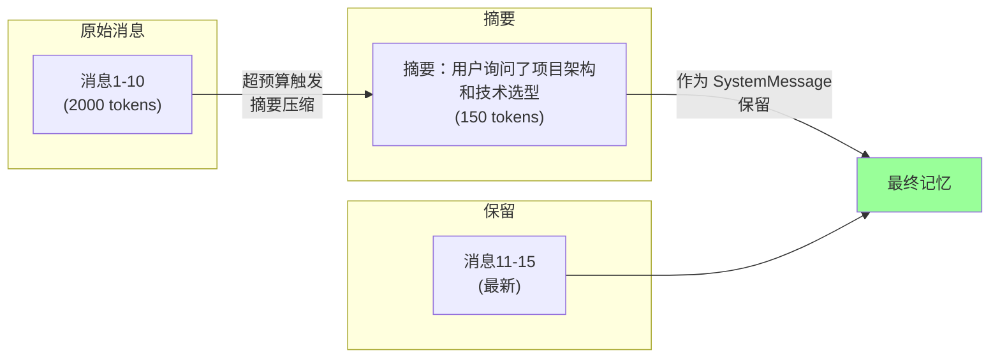

# 第7章 · 对话记忆 — 让 LLM 记住聊过什么

> **课时**: 2.5 小时 | **难度**: ⭐⭐ | **类型**: 讲解 + 动手

---

## 学习目标

- 理解 LLM 无状态特性与对话记忆的核心价值
- 掌握 MessageWindowChatMemory 滑动窗口机制及适用场景
- 掌握 TokenWindowChatMemory 基于预算的内存裁剪策略
- 精通 ChatMemoryStore 接口及自定义持久化存储
- 熟练运用 @MemoryId 实现多会话内存隔离
- 掌握 AiServices 集成记忆的两种模式
- 学会内存参数调优与清理策略
- 了解摘要记忆与混合记忆等高级方案

---

## 知识图谱



---

## 7.1 为什么需要对话记忆

### LLM 的无状态本质

每一次调用大语言模型都是一次**独立的、无上下文**的请求。API 不会自动记住你上一轮问了什么，就像每次都在跟一个初次见面的陌生人对话。



**对话记忆**的作用就是将历史消息一并发送给 LLM，让它"看起来"记住了之前的对话。LangChain4j 提供了开箱即用的内存实现，开发者只需配置即可。

---

## 7.2 MessageWindowChatMemory — 消息窗口记忆

### 核心原理

`MessageWindowChatMemory` 基于**滑动窗口**算法：只保留最近 N 条消息，超出部分自动丢弃。



### 基本用法

```java
import dev.langchain4j.memory.chat.MessageWindowChatMemory;
import dev.langchain4j.memory.ChatMemory;

// 创建记忆实例：最多保留 10 条消息
ChatMemory memory = MessageWindowChatMemory.withMaxMessages(10);
```

### Builder 模式

```java
ChatMemory memory = MessageWindowChatMemory.builder()
        .id("session-001")          // 会话唯一标识
        .maxMessages(20)             // 窗口大小
        .chatMemoryStore(customStore) // 自定义持久化（可选）
        .build();
```

### 参数说明

| 参数 | 类型 | 说明 | 默认值 |
|------|------|------|--------|
| `id` | `Object` | 会话标识，用于多会话隔离 | 自动生成 |
| `maxMessages` | `int` | 保留的最大消息数 | 10 |
| `chatMemoryStore` | `ChatMemoryStore` | 持久化存储实现 | `InMemoryChatMemoryStore` |

### 窗口满了会怎样

当消息数量达到 `maxMessages` 上限时，**最旧的消息会被逐出**（evicted）。

```java
// 演示：窗口为 3，添加 5 条消息
ChatMemory memory = MessageWindowChatMemory.builder()
        .id("demo")
        .maxMessages(3)
        .build();

memory.add(userMessage("第1条: 你好"));
memory.add(userMessage("第2条: 今天天气怎么样"));
memory.add(userMessage("第3条: 给我讲个笑话"));
memory.add(userMessage("第4条: 再讲一个"));
memory.add(userMessage("第5条: 谢谢"));

// 此时记忆只保留第3、4、5条
List<ChatMessage> messages = memory.messages();
System.out.println(messages.size()); // 输出 3
```

### 适用场景

- 对话长度相对均匀的聊天机器人
- 快速原型开发、POC 验证
- 对 token 消耗不敏感的简单问答

---

## 7.3 TokenWindowChatMemory — Token 预算记忆

### 核心原理

`TokenWindowChatMemory` 基于**Token 数量预算**来管理记忆。当累计 Token 数超过 `maxTokens` 时，从最旧的消息开始逐出。



### 基本用法

```java
import dev.langchain4j.memory.chat.TokenWindowChatMemory;
import dev.langchain4j.model.openai.OpenAiTokenCountEstimator;

ChatMemory memory = TokenWindowChatMemory.builder()
        .id("session-001")
        .maxTokens(4096)  // Token 预算上限
        .tokenCountEstimator(new OpenAiTokenCountEstimator())
        .build();
```

### TokenCountEstimator 选择

| 实现类 | 适用模型 | 说明 |
|--------|----------|------|
| `OpenAiTokenCountEstimator` | GPT-3.5 / GPT-4 | 使用 tiktoken 估算 |
| `AzureOpenAiTokenCountEstimator` | Azure OpenAI | Azure 版 |
| `自定义实现` | 任意模型 | 实现 `TokenCountEstimator` 接口 |

自定义 Token 估算器：

```java
ChatMemory memory = TokenWindowChatMemory.builder()
        .maxTokens(2048)
        .tokenCountEstimizer(content -> {
            // 简单按字符估算：4字符 ≈ 1 token
            return content.length() / 4;
        })
        .build();
```

### 动态 maxTokens

```java
import java.util.function.Supplier;
import dev.langchain4j.memory.chat.TokenWindowChatMemory;

// 根据模型动态调整预算
Supplier<Integer> tokenProvider = () -> {
    String currentModel = getCurrentModel(); // 获取当前使用的模型
    if ("gpt-4".equals(currentModel)) {
        return 8192;  // GPT-4 支持更大的上下文
    } else {
        return 4096;  // 其他模型使用较小的预算
    }
};

ChatMemory memory = TokenWindowChatMemory.builder()
        .maxTokensProvider(tokenProvider)  // 使用动态供应商
        .tokenCountEstimator(new OpenAiTokenCountEstimator())
        .build();
```

### 关键行为规则

1. **SystemMessage 永不逐出** — 系统提示词始终保留
2. **工具消息成对移除** — `ToolExecutionRequest` 和 `ToolExecutionResultMessage` 一起移除
3. **消息原子性** — 一条消息不可拆分；即便单条消息超出预算，也整条保留或整条移除

```java
// 演示：SystemMessage 永不丢失
ChatMemory memory = TokenWindowChatMemory.builder()
        .maxTokens(100) // 故意设置很小的预算
        .tokenCountEstimator(new OpenAiTokenCountEstimator())
        .build();

memory.add(systemMessage("你是专业的 Java 编程助手。"));  // 始终保留
memory.add(userMessage("请用 Java 写一个排序算法"));       // 可能被逐出

List<ChatMessage> msgs = memory.messages();
// SystemMessage 始终在列表中
assert msgs.stream().anyMatch(m -> m.type() == ChatMessageType.SYSTEM);
```

### MessageWindow vs TokenWindow 对比

| 对比维度 | MessageWindowChatMemory | TokenWindowChatMemory |
|----------|------------------------|----------------------|
| 裁剪策略 | 按消息条数（滑动窗口） | 按 Token 预算 |
| 内存控制 | 不可控（每条消息 token 数不同） | 精确可控 |
| 配置参数 | `maxMessages` | `maxTokens` + `TokenCountEstimator` |
| SystemMessage | 可能被逐出 | 永不移除 |
| 工具消息处理 | 作为普通消息 | 成对原子移除 |
| 适合场景 | 对话等长、快速原型 | 预算敏感、生产环境 |

---

## 7.4 ChatMemoryStore — 持久化你的记忆

### 默认行为

默认使用的 `InMemoryChatMemoryStore` 将消息保存在 JVM 堆内存中。应用重启后，所有记忆丢失。

### Store 接口

```java
import dev.langchain4j.memory.ChatMemoryStore;
import dev.langchain4j.data.message.ChatMessage;
import java.util.List;

public interface ChatMemoryStore {

    List<ChatMessage> getMessages(Object memoryId);

    void updateMessages(Object memoryId, List<ChatMessage> messages);

    void deleteMessages(Object memoryId);
}
```

### 实现一个持久化存储（基于 MySQL）

```java
import dev.langchain4j.data.message.*;
import dev.langchain4j.memory.ChatMemoryStore;
import javax.sql.DataSource;
import java.sql.*;
import java.util.*;

public class MySqlChatMemoryStore implements ChatMemoryStore {

    private final DataSource dataSource;

    public MySqlChatMemoryStore(DataSource dataSource) {
        this.dataSource = dataSource;
    }

    @Override
    public List<ChatMessage> getMessages(Object memoryId) {
        String sql = "SELECT message_json FROM chat_memory WHERE memory_id = ? ORDER BY seq ASC";
        List<ChatMessage> messages = new ArrayList<>();
        try (Connection conn = dataSource.getConnection();
             PreparedStatement ps = conn.prepareStatement(sql)) {
            ps.setString(1, memoryId.toString());
            ResultSet rs = ps.executeQuery();
            while (rs.next()) {
                String json = rs.getString("message_json");
                // 使用 LangChain4j 的序列化工具
                messages.add(ChatMessageDeserializer.messageFromJson(json));
            }
        } catch (SQLException e) {
            throw new RuntimeException("读取记忆失败", e);
        }
        return messages;
    }

    @Override
    public void updateMessages(Object memoryId, List<ChatMessage> messages) {
        deleteMessages(memoryId);  // 先清空
        String sql = "INSERT INTO chat_memory (memory_id, seq, message_json) VALUES (?, ?, ?)";
        try (Connection conn = dataSource.getConnection();
             PreparedStatement ps = conn.prepareStatement(sql)) {
            for (int i = 0; i < messages.size(); i++) {
                ps.setString(1, memoryId.toString());
                ps.setInt(2, i);
                ps.setString(3, ChatMessageSerializer.messageToJson(messages.get(i)));
                ps.addBatch();
            }
            ps.executeBatch();
        } catch (SQLException e) {
            throw new RuntimeException("更新记忆失败", e);
        }
    }

    @Override
    public void deleteMessages(Object memoryId) {
        String sql = "DELETE FROM chat_memory WHERE memory_id = ?";
        try (Connection conn = dataSource.getConnection();
             PreparedStatement ps = conn.prepareStatement(sql)) {
            ps.setString(1, memoryId.toString());
            ps.executeUpdate();
        } catch (SQLException e) {
            throw new RuntimeException("删除记忆失败", e);
        }
    }
}
```

### 表结构

```sql
CREATE TABLE chat_memory (
    id BIGINT AUTO_INCREMENT PRIMARY KEY,
    memory_id VARCHAR(128) NOT NULL,
    seq INT NOT NULL,
    message_json TEXT NOT NULL,
    created_at TIMESTAMP DEFAULT CURRENT_TIMESTAMP,
    INDEX idx_memory_id (memory_id)
);
```

### 使用自定义 Store

```java
ChatMemoryStore store = new MySqlChatMemoryStore(dataSource);

ChatMemory memory = MessageWindowChatMemory.builder()
        .id("user-123")
        .maxMessages(50)
        .chatMemoryStore(store)
        .build();
```

### 为什么需要持久化

| 场景 | 无持久化 | 有持久化 |
|------|----------|----------|
| 服务器重启 | 所有用户对话丢失 | 对话完整恢复 |
| 横向扩展 | 不同实例记忆不一致 | 共享存储保证一致 |
| 分析与审计 | 无法追溯历史对话 | 可查询、可分析 |
| 长期会话 | 仅限单次会话 | 跨会话持续 |

---

## 7.5 @MemoryId — 会话隔离

### 问题场景

一个在线客服系统同时服务成百上千个用户。如果不做隔离，所有人的消息会混在一起。

### @MemoryId 的工作原理



### 基于 AiServices 的多用户聊天机器人

```java
import dev.langchain4j.service.*;
import dev.langchain4j.memory.chat.MessageWindowChatMemory;
import dev.langchain4j.memory.ChatMemory;

interface ChatAssistant {
    String chat(@MemoryId String sessionId, @UserMessage String message);
}

// 配置 AiServices
ChatAssistant assistant = AiServices.builder(ChatAssistant.class)
        .chatLanguageModel(model)
        .chatMemoryProvider(memoryId -> MessageWindowChatMemory.builder()
                .id(memoryId)
                .maxMessages(20)
                .build())
        .build();

// 用户 A
String replyA1 = assistant.chat("session-A", "我的名字是小明");
System.out.println(replyA1); // "你好，小明！"

String replyA2 = assistant.chat("session-A", "我叫什么名字？");
System.out.println(replyA2); // "你叫小明！"

// 用户 B — 完全独立的记忆空间
String replyB1 = assistant.chat("session-B", "我叫小红");
String replyB2 = assistant.chat("session-B", "你知道我的名字吗？"); // "你叫小红"
String replyA3 = assistant.chat("session-A", "我刚才说自己叫什么？");
// "你叫小明" — 不受用户 B 的影响
```

### ChatMemoryProvider — 记忆工厂

`ChatMemoryProvider` 是一个函数式接口，每次新的会话 ID 出现时调用，创建专属记忆实例。

```java
import dev.langchain4j.memory.ChatMemory;
import dev.langchain4j.memory.chat.TokenWindowChatMemory;
import dev.langchain4j.model.openai.OpenAiTokenCountEstimator;

ChatMemoryProvider memoryProvider = memoryId -> {
    // 可以为不同用户分配不同的预算
    int maxTokens = isVipUser(memoryId.toString()) ? 8192 : 2048;

    return TokenWindowChatMemory.builder()
            .id(memoryId)
            .maxTokens(maxTokens)
            .tokenCountEstimator(new OpenAiTokenCountEstimator())
            .chatMemoryStore(new MySqlChatMemoryStore(dataSource))
            .build();
};
```

### 完整的多用户客服 Bot 示例

```java
import dev.langchain4j.agent.tool.Tool;
import dev.langchain4j.memory.ChatMemory;
import dev.langchain4j.memory.chat.MessageWindowChatMemory;
import dev.langchain4j.service.*;

public class CustomerServiceBot {

    // 工具：查询订单
    static class OrderTools {
        @Tool("根据订单号查询订单状态")
        String getOrderStatus(@ToolMemoryId String sessionId, String orderId) {
            // @ToolMemoryId 绑定到当前会话的记忆
            return "订单 " + orderId + " 状态：已发货";
        }
    }

    interface CustomerService {
        String chat(@MemoryId String sessionId, @UserMessage String message);
    }

    public static void main(String[] args) {
        CustomerService service = AiServices.builder(CustomerService.class)
                .chatLanguageModel(OpenAiChatModel.withApiKey("demo"))
                .chatMemoryProvider(memoryId ->
                        MessageWindowChatMemory.builder()
                                .id(memoryId)
                                .maxMessages(30)
                                .build())
                .tools(new OrderTools())
                .build();

        // 用户会话演示
        System.out.println(service.chat("user-001", "我的订单 12345 怎么样了？"));
        System.out.println(service.chat("user-001", "帮我查一下 12346"));
        System.out.println(service.chat("user-002", "我的订单 67890 呢？")); // 独立会话
    }
}
```

### 记忆生命周期

| 阶段 | 触发 | 说明 |
|------|------|------|
| 创建 | 首次出现新的 `@MemoryId` | `ChatMemoryProvider.create()` 被调用 |
| 使用 | 每次对话调用 | 自动读取 + 追加消息 |
| 清理 | 手动触发或定时任务 | 调用 `ChatMemoryStore.deleteMessages()` |

---

## 7.6 AiServices 记忆集成

### 两种集成模式



### 模式一：共享记忆

```java
ChatMemory sharedMemory = MessageWindowChatMemory.withMaxMessages(20);

ChatAssistant assistant = AiServices.builder(ChatAssistant.class)
        .chatLanguageModel(model)
        .chatMemory(sharedMemory)  // 所有请求共享同一份记忆
        .build();

// 危险：多用户时会互相干扰
assistant.chat("用户A的消息");  // OK
assistant.chat("用户B的消息");  // 用户B能看到用户A的历史！
```

### 模式二：Provider 工厂（生产推荐）

```java
// 推荐做法
ChatAssistant assistant = AiServices.builder(ChatAssistant.class)
        .chatLanguageModel(model)
        .chatMemoryProvider(memoryId ->
                TokenWindowChatMemory.builder()
                        .id(memoryId)
                        .maxTokens(4096)
                        .tokenCountEstimator(new OpenAiTokenCountEstimator())
                        .chatMemoryStore(persistentStore)  // 持久化
                        .build())
        .tools(new MyTools())
        .build();
```

### 完整流程时序图



---

## 7.7 记忆最佳实践

### MessageWindow vs TokenWindow 选择指南

```
对话场景                        推荐方案
──────────────────────────────────────────────
简短问答（≤5轮）                MessageWindow(10)
客服对话（长度不等）            TokenWindow(4096)
代码生成（单次长回复）          TokenWindow(2048)
流式输出 + 多轮对话            TokenWindow(8192)
快速原型 / POC                 MessageWindow(20)
```

### maxMessages / maxTokens 推荐值

| 场景 | 推荐值 | 估算 Token 消耗 |
|------|--------|----------------|
| 简单问答 | maxMessages=10 | ~2K tokens |
| 一般对话 | maxMessages=20 | ~4K tokens |
| 复杂任务 | maxMessages=30~50 | ~8K tokens |
| TokenWindow 保守 | maxTokens=2048 | 精确控制 |
| TokenWindow 标准 | maxTokens=4096 | 大多数场景 |
| TokenWindow 宽松 | maxTokens=8192 | 长上下文模型 |

### 内存清理策略

```java
import java.util.concurrent.*;
import java.util.Set;
import java.util.concurrent.ConcurrentHashMap;

public class MemoryCleanupScheduler {

    private final ChatMemoryStore store;
    private final Set<Object> activeSessions = ConcurrentHashMap.newKeySet();
    private final ScheduledExecutorService scheduler = Executors.newScheduledThreadPool(1);

    public MemoryCleanupScheduler(ChatMemoryStore store) {
        this.store = store;
    }

    public void markActive(Object memoryId) {
        activeSessions.add(memoryId);
    }

    public void startCleanupTask(long inactiveThresholdMinutes) {
        scheduler.scheduleAtFixedRate(() -> {
            long deadline = System.currentTimeMillis()
                    - TimeUnit.MINUTES.toMillis(inactiveThresholdMinutes);
            // 遍历并清理过期会话（实现取决于存储层设计）
            System.out.println("执行记忆清理任务...");
        }, 0, 30, TimeUnit.MINUTES);
    }

    public void stop() {
        scheduler.shutdown();
    }
}
```

### 成本考量

```
消息数量与 Token 消耗的关系图：

消息数    平均单条 Token    总 Token     GPT-4 成本 (per call)
────────────────────────────────────────────────────────
 10           200          2,000        ~$0.06
 20           200          4,000        ~$0.12
 50           200         10,000        ~$0.30
100           200         20,000        ~$0.60
```

> 注意：GPT-4 等高端模型按 Token 计费。过大的历史记忆会显著增加每次调用的成本。建议在成本和性能之间找到平衡。

### 记忆 + RAG 的组合

```java
@Assistant
interface RAGAssistant {
    String chat(@MemoryId String sessionId, @UserMessage String message);
}

// 在服务层组合 RAG 检索与记忆
public class RagWithMemoryService {

    private final RAGAssistant assistant;
    private final ContentRetriever retriever;

    public RagWithMemoryService(RAGAssistant assistant, ContentRetriever retriever) {
        this.assistant = assistant;
        this.retriever = retriever;
    }

    public String chat(String sessionId, String userMessage) {
        // 1. 检索相关知识
        List<Content> relevantDocs = retriever.retrieve(userMessage);

        // 2. 将知识注入到 SystemMessage 或 UserMessage 前缀
        String enrichedMessage = buildPromptWithContext(userMessage, relevantDocs);

        // 3. 调用带记忆的助手
        return assistant.chat(sessionId, enrichedMessage);
    }

    private String buildPromptWithContext(String message, List<Content> docs) {
        StringBuilder sb = new StringBuilder();
        sb.append("以下是相关知识：\n");
        docs.forEach(d -> sb.append("- ").append(d.text()).append("\n"));
        sb.append("\n用户问题：").append(message);
        return sb.toString();
    }
}
```

---

## 7.8 高级：自定义记忆策略

### 摘要记忆（Summary Memory）

当对话很长时，将早期消息**摘要压缩**后保留，而不是直接丢弃。



### 实现摘要策略

```java
import dev.langchain4j.data.message.*;
import dev.langchain4j.memory.ChatMemory;
import dev.langchain4j.memory.chat.TokenWindowChatMemory;
import dev.langchain4j.model.chat.ChatLanguageModel;
import java.util.*;

public class SummarizingChatMemory implements ChatMemory {

    private final ChatMemory delegate;
    private final ChatLanguageModel summarizingModel;
    private final int summarizeThreshold;
    private String summary = "";

    public SummarizingChatMemory(ChatMemory delegate,
                                  ChatLanguageModel summarizingModel,
                                  int summarizeThreshold) {
        this.delegate = delegate;
        this.summarizingModel = summarizingModel;
        this.summarizeThreshold = summarizeThreshold;
    }

    @Override
    public Object id() {
        return delegate.id();
    }

    @Override
    public void add(ChatMessage message) {
        delegate.add(message);
        maybeSummarize();
    }

    @Override
    public List<ChatMessage> messages() {
        List<ChatMessage> messages = new ArrayList<>(delegate.messages());
        if (!summary.isEmpty()) {
            // 在消息列表开头插入摘要
            messages.add(0, SystemMessage.from(
                    "之前的对话摘要：" + summary));
        }
        return messages;
    }

    @Override
    public void clear() {
        delegate.clear();
        summary = "";
    }

    private void maybeSummarize() {
        List<ChatMessage> messages = delegate.messages();
        if (messages.size() > summarizeThreshold) {
            String conversationText = messages.subList(0,
                    messages.size() - summarizeThreshold / 2).toString();
            summary = summarizingModel.generate(
                    "用一句话概括以下对话：" + conversationText);
            // 逐出已摘要的消息
            List<ChatMessage> recent = messages.subList(
                    messages.size() - summarizeThreshold / 2,
                    messages.size());
            delegate.clear();
            recent.forEach(delegate::add);
        }
    }
}
```

### 混合记忆策略

```java
// 组合多种策略
ChatMemory hybridMemory = new SummarizingChatMemory(
        TokenWindowChatMemory.builder()
                .maxTokens(4096)
                .tokenCountEstimator(new OpenAiTokenCountEstimator())
                .chatMemoryStore(persistentStore)
                .build(),
        summarizingModel,
        20  // 超过 20 条消息触发摘要
);
```

### 何时需要自定义记忆

| 需求 | 内置方案 | 自定义方案 |
|------|----------|------------|
| 基本对话 | MessageWindowChatMemory | — |
| Token 预算控制 | TokenWindowChatMemory | — |
| 超长对话摘要 | — | SummarizingChatMemory |
| 按重要性保留 | — | 自定义优先级策略 |
| 结构化记忆 | — | 数据库模式存储 |
| 跨会话共享记忆 | — | 自定义 Store + 共享键 |

---

## 常见踩坑

**1. 多用户共用同一 ChatMemory 实例（最易犯的错误）**

```java
// ❌ 错误：所有用户共享同一个记忆
ChatMemory memory = MessageWindowChatMemory.withMaxMessages(10);
ChatAssistant assistant = AiServices.builder(ChatAssistant.class)
        .chatLanguageModel(model)
        .chatMemory(memory)  // 单例共享
        .build();

// ✅ 正确：使用 ChatMemoryProvider 按会话隔离
ChatAssistant assistant = AiServices.builder(ChatAssistant.class)
        .chatLanguageModel(model)
        .chatMemoryProvider(mid -> MessageWindowChatMemory.withMaxMessages(10))
        .build();
```

**2. Token 估算器不匹配导致消息意外截断**

```java
// ❌ 错误：GPT-4 用了一个过于简单的估算器
ChatMemory memory = TokenWindowChatMemory.builder()
        .maxTokens(4096)
        .tokenCountEstimator(content -> content.length()) // 严重高估
        .build();

// ✅ 正确：使用与模型匹配的估算器
ChatMemory memory = TokenWindowChatMemory.builder()
        .maxTokens(4096)
        .tokenCountEstimator(new OpenAiTokenCountEstimator())
        .build();
```

**3. 忘记持久化导致重启丢失记忆**

```java
// ❌ 错误：所有记忆都在内存中
// ✅ 正确：生产环境务必配置 ChatMemoryStore
ChatMemoryStore store = new MySqlChatMemoryStore(dataSource);
ChatMemory memory = MessageWindowChatMemory.builder()
        .chatMemoryStore(store)
        .build();
```

**4. ToolExecutionResultMessage 被单独移除导致工具调用失败**

```java
// TokenWindowChatMemory 保证工具消息成对移除，
// 但自定义实现可能破坏这一保证
// ✅ 建议：优先使用内置 TokenWindowChatMemory
// ❌ 不建议：在自定义 Store 中单独过滤工具消息
```

**5. 未清理过期会话导致内存泄漏**

```java
// ❌ 错误：每个会话创建后从不清理
// ✅ 正确：定期清理不活跃会话
// 方案一：定时任务
scheduler.scheduleAtFixedRate(() -> store.deleteExpired(), 1, 1, TimeUnit.HOURS);
// 方案二：基于最后活动时间的 LRU 淘汰
```

---

## 课后练习

**练习 1：基础记忆配置**

创建一个 `MessageWindowChatMemory`，保留最近 15 条消息。添加 20 条消息后验证实际保留的消息数量是否为 15。用断言验证 SystemMessage 是否可能被逐出。

**练习 2：多用户客服聊天**

使用 `@MemoryId` 实现一个多用户客服聊天机器人，每个用户独立记忆。要求：
- 使用 `ChatMemoryProvider` 创建记忆实例
- 至少实现一个查询工具（如查订单、查积分）
- 验证两个用户的对话不会互相干扰

**练习 3：TokenWindow 与持久化**

整合 `TokenWindowChatMemory` + `ChatMemoryStore`：
- 基于 H2 或 SQLite 实现 `ChatMemoryStore`
- 设置 `maxTokens=2048`
- 编写测试：应用重启后记忆仍然存在

**练习 4：微博客服机器人**

设计一个微博客服机器人，要求：
- 每个粉丝私信使用独立的 `@MemoryId`
- 使用 `TokenWindowChatMemory` 控制成本
- 配置 `ChatMemoryStore` 持久化到 Redis 或 MySQL
- 实现一个定时任务，清理 24 小时未活跃的会话记忆
- 将检索到的用户历史订单信息注入到 SystemMessage

---

## 本节小结

- ✅ LLM 是无状态的，对话记忆通过将历史消息附加到每次请求中来模拟"记忆"
- ✅ `MessageWindowChatMemory` 按消息条数滑动窗口，简单直接，适合快速原型
- ✅ `TokenWindowChatMemory` 按 Token 预算精确控制内存，SystemMessage 永不移除
- ✅ `ChatMemoryStore` 接口支持自定义持久化，解决重启丢失和应用扩展问题
- ✅ `@MemoryId` 注解实现会话级别隔离，`ChatMemoryProvider` 作为工厂按需创建
- ✅ AiServices 提供 `.chatMemory()` 和 `.chatMemoryProvider()` 两种集成模式
- ✅ 生产环境必须关注记忆清理、成本控制和估算器匹配
- ✅ 摘要记忆和混合记忆适用于超长对话的高级场景

---

> **下一章预告：第8章 · AI Service — 声明式 AI 编程**
>
> 在掌握了对话记忆之后，下一章将深入 AI Service 层的声明式编程模式，学习如何用接口定义 AI 行为、集成工具函数、处理流式输出，并探索高级特性如动态提示模板和链式调用。
