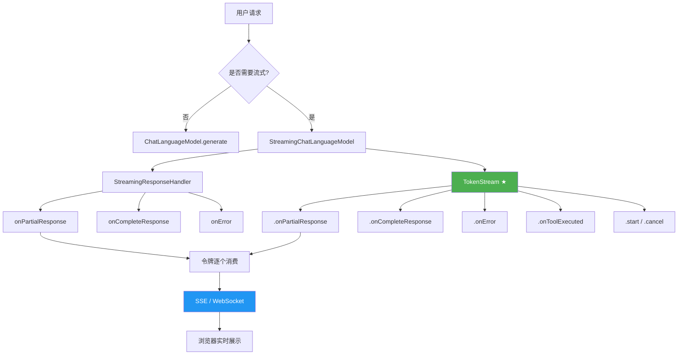
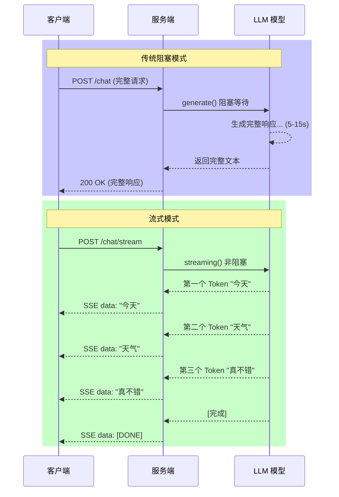
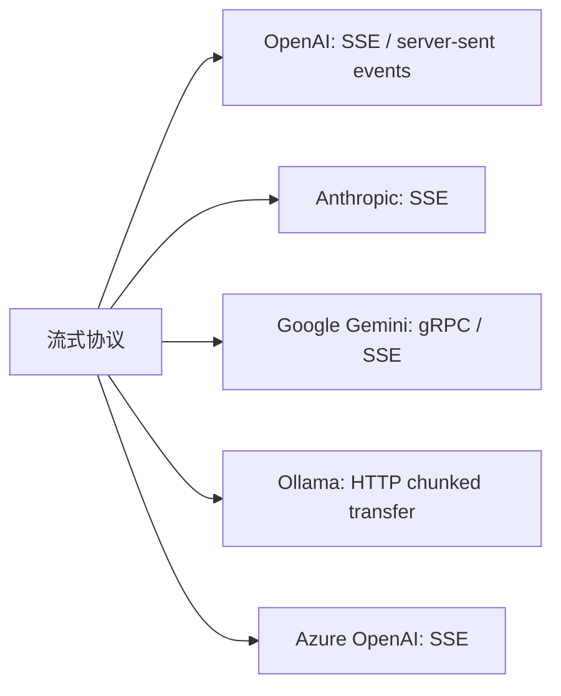

# 第8章 · 流式输出 — 实时响应与 SSE 推送

> **预计时长**：2.5 小时 | **难度**：⭐⭐⭐ | **类型**：讲解 + 动手

---

## 学习目标

- 理解流式输出与传统阻塞式调用的本质区别及性能影响
- 掌握 `StreamingChatLanguageModel` 接口及其与 `ChatLanguageModel` 的关系
- 熟练使用 `StreamingResponseHandler` 的三种核心回调处理流式内容
- 掌握 `TokenStream` 流式 API 的声明式用法与生命周期管理
- 能够将流式输出集成到 Spring Boot SSE 端点实现浏览器实时推送
- 理解流式场景下对话记忆、工具调用与异常处理的机制
- 学会为不同业务场景选择合适的流式策略并规避常见陷阱

---

## 知识图谱



---

## 8.1 为什么需要流式输出

### 阻塞式调用的痛点

使用传统的 `ChatLanguageModel.generate()` 或 `chat()` 方法时，调用线程会**阻塞等待 LLM 生成完整响应**后才返回。这意味着：

- **延迟感知差**：用户点击发送后界面完全静止，等待时间可能长达数秒甚至数十秒。
- **资源浪费**：长时间的 TCP 连接空等浪费服务端线程资源。
- **体验断裂**：人类阅读速度远快于 LLM 逐字生成，但阻塞模式强迫用户一次性读完所有内容。



### 流式输出的三大价值

| 维度 | 阻塞模式 | 流式模式 |
|------|---------|---------|
| 首 token 延迟 | 等待完整生成 (3-15s) | 毫秒级返回第一个 token |
| 用户体验 | 界面冻结，用户焦虑 | 文字逐字出现，交互自然 |
| 服务端资源 | 长连接占用线程 | 事件驱动，线程高效复用 |
| 中断能力 | 无法中途取消 | 支持 cancel 中断 |
| 适用场景 | 批处理、后台任务 | 对话、实时生成、搜索推荐 |

---

## 8.2 StreamingChatLanguageModel

### 接口定义

`StreamingChatLanguageModel` 是 LangChain4j 为流式场景定义的核心接口，与 `ChatLanguageModel` 形成平行体系：

```java
public interface StreamingChatLanguageModel {
    void chat(ChatRequest request, StreamingResponseHandler handler);
    // 可选的重载：chat(String userMessage, StreamingResponseHandler handler)
}
```

**关键区别**：
- `ChatLanguageModel.chat()` 返回 `Response<AiMessage>` —— 同步、阻塞。
- `StreamingChatLanguageModel.chat()` 返回 `void` —— 异步、结果通过回调传递。

### 各提供商实现类

| 提供商 | 阻塞实现 | 流式实现 |
|--------|---------|---------|
| OpenAI | `OpenAiChatModel` | `OpenAiStreamingChatModel` |
| Anthropic | `AnthropicChatModel` | `AnthropicStreamingChatModel` |
| Google Gemini | `GeminiChatModel` | `GeminiStreamingChatModel` |
| Ollama | `OllamaChatModel` | `OllamaStreamingChatModel` |
| Azure OpenAI | `AzureOpenAiChatModel` | `AzureOpenAiStreamingChatModel` |

### 构建方式（与阻塞版本完全一致）

```java
import dev.langchain4j.model.openai.OpenAiStreamingChatModel;
import dev.langchain4j.model.ollama.OllamaStreamingChatModel;

// OpenAI 流式模型
StreamingChatLanguageModel openaiModel = OpenAiStreamingChatModel.builder()
    .apiKey(System.getenv("OPENAI_API_KEY"))
    .modelName("gpt-4o")
    .temperature(0.7)
    .build();

// Ollama 本地流式模型
StreamingChatLanguageModel ollamaModel = OllamaStreamingChatModel.builder()
    .baseUrl("http://localhost:11434")
    .modelName("qwen2.5:7b")
    .temperature(0.7)
    .build();
```

Builder 的 API 与 `ChatLanguageModel` 完全一致——`temperature`、`maxTokens`、`topP` 等参数均可照常设置。区别仅在于模型类名前多了 `Streaming`。

---

## 8.3 StreamingResponseHandler 回调

### 回调接口解析

`StreamingResponseHandler` 定义了三个核心回调方法，分别在流的不同阶段被调用：

```java
public interface StreamingResponseHandler {
    void onPartialResponse(String token);          // 每收到一个 token 时回调
    void onCompleteResponse(Response<AiMessage> response); // 流结束时回调
    void onError(Throwable error);                 // 发生异常时回调
    default void onToolExecuted(ToolExecution toolExecution) {} // 工具执行时回调 (v1.0+)
}
```

### 完整示例：控制台打字机效果

```java
import dev.langchain4j.data.message.AiMessage;
import dev.langchain4j.data.message.UserMessage;
import dev.langchain4j.model.StreamingResponseHandler;
import dev.langchain4j.model.chat.StreamingChatLanguageModel;
import dev.langchain4j.model.openai.OpenAiStreamingChatModel;
import dev.langchain4j.model.output.Response;

public class TypingEffectDemo {

    public static void main(String[] args) throws InterruptedException {
        StreamingChatLanguageModel model = OpenAiStreamingChatModel.builder()
            .apiKey(System.getenv("OPENAI_API_KEY"))
            .modelName("gpt-4o-mini")
            .build();

        System.out.print("AI: ");

        model.chat("用 50 字介绍 Java 的历史", new StreamingResponseHandler() {

            @Override
            public void onPartialResponse(String token) {
                System.out.print(token);         // 逐字打印，模拟打字效果
                System.out.flush();
            }

            @Override
            public void onCompleteResponse(Response<AiMessage> response) {
                System.out.println();
                System.out.println("--- 流结束 ---");
                System.out.println("完整内容: " + response.content().text());
                System.out.println("Token 用量: " + response.tokenUsage());
            }

            @Override
            public void onError(Throwable error) {
                System.err.println("\n流式调用出错: " + error.getMessage());
                error.printStackTrace();
            }
        });

        // 等待异步回调完成
        Thread.sleep(30_000);
    }
}
```

### Lambda 简化写法

当回调逻辑简单时，LangChain4j 提供了 lambda 风格的重载：

```java
model.chat("你好，请介绍一下自己", new StreamingResponseHandler() {

    @Override
    public void onPartialResponse(String token) {
        System.out.print(token);
    }

    @Override
    public void onCompleteResponse(Response<AiMessage> response) {
        System.out.println("\n[DONE]");
    }

    @Override
    public void onError(Throwable error) {
        System.err.println("Error: " + error.getMessage());
    }
});
```

> **注意**：目前 LangChain4j 没有为 `StreamingResponseHandler` 提供纯 lambda 构造方式，但可以借助匿名内部类或定义一个工厂方法简化重复代码。

### 线程安全注意事项

`onPartialResponse` 和 `onCompleteResponse` 可能从**不同的线程**回调，且多个 `onPartialResponse` 调用可能被框架批量合并。因此在回调中：

- **不要假设线程一致性** —— 务必使用线程安全的数据结构收集 token。
- **使用 `synchronized` 或 `ConcurrentLinkedQueue`** 收集 token 列表。
- **不要在回调中执行耗时操作** —— 回调方法是事件循环的一部分，阻塞会拖慢整个流。

```java
// 安全的 token 收集方式
List<String> tokenList = Collections.synchronizedList(new ArrayList<>());

model.chat("Hello", new StreamingResponseHandler() {
    @Override
    public void onPartialResponse(String token) {
        tokenList.add(token);  // 线程安全的 list
    }
    // ...
});
```

---

## 8.4 TokenStream — 推荐的高级 API

### 为什么推荐 TokenStream

自 LangChain4j 1.0 起，框架引入了 `TokenStream` 作为 `AiServices` 流式调用的首选方案。相比直接使用 `StreamingResponseHandler`，`TokenStream` 提供了：

- **Fluent 声明式 API** —— 链式调用，代码更简洁
- **完整的生命周期管理** —— `start()` 启动，`cancel()` 中断
- **工具调用透明处理** —— `onToolExecuted` 回调嵌入流式管道
- **异常类型化** —— 不同类型的异常可分别处理

### 基本用法

```java
import dev.langchain4j.service.AiServices;
import dev.langchain4j.service.TokenStream;

interface ChatAssistant {
    TokenStream chat(String userMessage);
}

// 构建服务
StreamingChatLanguageModel model = OpenAiStreamingChatModel.builder()
    .apiKey(System.getenv("OPENAI_API_KEY"))
    .modelName("gpt-4o-mini")
    .build();

ChatAssistant assistant = AiServices.create(ChatAssistant.class, model);

// 流式调用
TokenStream tokenStream = assistant.chat("用 100 字解释量子计算");

tokenStream.onPartialResponse(System.out::print)
    .onCompleteResponse(response -> {
        System.out.println("\n[DONE] 总 tokens: " + response.tokenUsage().totalTokenCount());
    })
    .onError(error -> {
        System.err.println("\n[ERROR] " + error.getMessage());
    })
    .start();  // 启动流
```

### 对比传统方式

```java
// ===== 方式一：StreamingResponseHandler（啰嗦）=====
model.chat("Hello", new StreamingResponseHandler() {
    @Override
    public void onPartialResponse(String token) { /* ... */ }
    @Override
    public void onCompleteResponse(Response<AiMessage> r) { /* ... */ }
    @Override
    public void onError(Throwable t) { /* ... */ }
});

// ===== 方式二：TokenStream（简洁）=====
assistant.chat("Hello")
    .onPartialResponse(System.out::print)
    .onCompleteResponse(r -> { /* ... */ })
    .onError(t -> { /* ... */ })
    .start();
```

### 取消流（Cancel）

在长对话场景中，用户可能希望中途停止生成。`TokenStream` 提供了 `cancel()` 方法：

```java
TokenStream stream = assistant.chat("给我讲一个很长的故事...");

stream.onPartialResponse(token -> {
        System.out.print(token);
        // 检测到关键词时取消
        if (token.contains("但是")) {
            System.out.println("\n[用户中断生成]");
            stream.cancel();  // 请求取消
        }
    })
    .onCompleteResponse(response -> System.out.println("\n[完成]"))
    .onError(error -> System.err.println("\n[错误] " + error.getMessage()))
    .start();
```

> **注意**：`cancel()` 是一个请求信号，框架会尽力中断底层 HTTP 连接并释放资源。取消后 `onCompleteResponse` **不会被调用**，但 `onError` 可能被调用（携带 `CancellationException`）。

---

## 8.5 Spring Boot SSE 集成

### SSE 协议简介

Server-Sent Events (SSE) 是一种轻量级的服务器推送技术，基于 HTTP 长连接。与 WebSocket 相比：

| 特性 | SSE | WebSocket |
|------|-----|-----------|
| 协议 | HTTP | 独立协议 (ws://) |
| 方向 | 服务器→客户端单向 | 全双工 |
| 自动重连 | 浏览器原生支持 | 需自行实现 |
| 消息格式 | 纯文本/UTF-8 | 二进制或文本 |
| 适用场景 | AI 流式输出、通知推送 | 实时游戏、协作编辑 |

SSE 的格式非常简单：

```
data: 今天
data: 天气
data: 真不错
data: [DONE]
```

### 完整示例：实时对话 API

```java
import dev.langchain4j.data.message.AiMessage;
import dev.langchain4j.data.message.UserMessage;
import dev.langchain4j.model.StreamingResponseHandler;
import dev.langchain4j.model.chat.StreamingChatLanguageModel;
import dev.langchain4j.model.openai.OpenAiStreamingChatModel;
import dev.langchain4j.model.output.Response;
import org.springframework.http.MediaType;
import org.springframework.web.bind.annotation.*;
import org.springframework.web.servlet.mvc.method.annotation.SseEmitter;

import java.io.IOException;
import java.util.concurrent.ExecutorService;
import java.util.concurrent.Executors;

@RestController
@RequestMapping("/api/chat")
public class ChatStreamController {

    private final StreamingChatLanguageModel model;
    private final ExecutorService executor = Executors.newVirtualThreadPerTaskExecutor();

    public ChatStreamController() {
        this.model = OpenAiStreamingChatModel.builder()
            .apiKey(System.getenv("OPENAI_API_KEY"))
            .modelName("gpt-4o-mini")
            .temperature(0.7)
            .build();
    }

    @GetMapping(value = "/stream", produces = MediaType.TEXT_EVENT_STREAM_VALUE)
    public SseEmitter stream(@RequestParam("message") String message) {
        // 超时时间设为 5 分钟
        SseEmitter emitter = new SseEmitter(300_000L);

        executor.submit(() -> {
            try {
                model.chat(message, new StreamingResponseHandler() {

                    @Override
                    public void onPartialResponse(String token) {
                        try {
                            emitter.send(SseEmitter.event()
                                .name("token")
                                .data(token));
                        } catch (IOException e) {
                            // 客户端断开连接时取消流
                            emitter.completeWithError(e);
                        }
                    }

                    @Override
                    public void onCompleteResponse(Response<AiMessage> response) {
                        try {
                            // 发送结束标记
                            emitter.send(SseEmitter.event()
                                .name("done")
                                .data(response.content().text()));
                            emitter.complete();
                        } catch (IOException e) {
                            emitter.completeWithError(e);
                        }
                    }

                    @Override
                    public void onError(Throwable error) {
                        try {
                            emitter.send(SseEmitter.event()
                                .name("error")
                                .data(error.getMessage()));
                        } catch (IOException e) {
                            // ignore
                        }
                        emitter.completeWithError(error);
                    }
                });
            } catch (Exception e) {
                emitter.completeWithError(e);
            }
        });

        return emitter;
    }
}
```

### 流式响应 DTO

为方便客户端解析，建议定义统一的 SSE 消息格式：

```java
public class StreamEvent {
    private String type;    // "token" | "done" | "error"
    private String content;

    public StreamEvent(String type, String content) {
        this.type = type;
        this.content = content;
    }

    public String getType() { return type; }
    public String getContent() { return content; }

    public String toSseFormat() {
        return "data: " + type + "|" + content + "\n\n";
    }
}
```

### 客户端 HTML 示例

```html
<!DOCTYPE html>
<html lang="zh-CN">
<head>
    <meta charset="UTF-8">
    <title>AI 流式对话</title>
</head>
<body>
    <div>
        <input type="text" id="messageInput" placeholder="输入消息..." />
        <button onclick="sendMessage()">发送</button>
    </div>
    <div id="response"></div>

    <script>
        function sendMessage() {
            const message = document.getElementById('messageInput').value;
            const responseDiv = document.getElementById('response');
            responseDiv.innerHTML = '<strong>AI:</strong> ';

            const eventSource = new EventSource(
                '/api/chat/stream?message=' + encodeURIComponent(message)
            );

            eventSource.addEventListener('token', function(event) {
                responseDiv.innerHTML += event.data;
            });

            eventSource.addEventListener('done', function(event) {
                responseDiv.innerHTML += '<br><em>[对话完成]</em>';
                eventSource.close();
            });

            eventSource.addEventListener('error', function(event) {
                responseDiv.innerHTML += '<br><span style="color:red">[错误: '
                    + event.data + ']</span>';
                eventSource.close();
            });

            // 网络错误处理
            eventSource.onerror = function() {
                responseDiv.innerHTML += '<br><span style="color:red">[连接中断]</span>';
                eventSource.close();
            };
        }
    </script>
</body>
</html>
```

### SSE 在生产环境的增强

```java
@RestController
@RequestMapping("/api/chat")
public class ProductionChatController {

    private final StreamingChatLanguageModel model;
    private final ExecutorService executor = Executors.newVirtualThreadPerTaskExecutor();

    // 构造函数注入 — 实际项目中从 Spring 容器获取
    public ProductionChatController(StreamingChatLanguageModel model) {
        this.model = model;
    }

    @GetMapping(value = "/stream/v2", produces = MediaType.TEXT_EVENT_STREAM_VALUE)
    public SseEmitter streamV2(
            @RequestParam("message") String message,
            @RequestHeader(value = "X-Request-Id", required = false) String requestId) {

        SseEmitter emitter = new SseEmitter(300_000L);

        // 注册完成/超时/异常回调
        emitter.onCompletion(() -> log.info("SSE completed, requestId={}", requestId));
        emitter.onTimeout(() -> {
            log.warn("SSE timeout, requestId={}", requestId);
            emitter.complete();
        });
        emitter.onError(ex -> log.error("SSE error, requestId={}", requestId, ex));

        executor.submit(() -> {
            try {
                // 发送开始事件
                emitter.send(SseEmitter.event().name("start").data("connected"));

                model.chat(message, new StreamingResponseHandler() {
                    private final StringBuilder fullResponse = new StringBuilder();

                    @Override
                    public void onPartialResponse(String token) {
                        fullResponse.append(token);
                        safeSend(() -> emitter.send(
                            SseEmitter.event().name("token").data(token)));
                    }

                    @Override
                    public void onCompleteResponse(Response<AiMessage> response) {
                        safeSend(() -> emitter.send(
                            SseEmitter.event().name("done")
                                .data(fullResponse.toString())));
                        emitter.complete();
                    }

                    @Override
                    public void onError(Throwable error) {
                        safeSend(() -> emitter.send(
                            SseEmitter.event().name("error")
                                .data(error.getMessage())));
                        emitter.completeWithError(error);
                    }

                    private void safeSend(Runnable sendAction) {
                        try {
                            sendAction.run();
                        } catch (IOException e) {
                            // 客户端已断开，忽略
                        }
                    }
                });
            } catch (Exception e) {
                try {
                    emitter.send(SseEmitter.event().name("error")
                        .data("Internal error: " + e.getMessage()));
                } catch (IOException ex) {
                    // ignore
                }
                emitter.completeWithError(e);
            }
        });

        return emitter;
    }

    private static final org.slf4j.Logger log =
        org.slf4j.LoggerFactory.getLogger(ProductionChatController.class);
}
```

---

## 8.6 流式输出与记忆和工具的协同

### 带记忆的流式对话

流式输出并不影响对话记忆的使用——只需在 `AiServices` 中正常添加 `ChatMemory`：

```java
import dev.langchain4j.memory.chat.MessageWindowChatMemory;
import dev.langchain4j.service.TokenStream;

interface StreamingAssistant {
    TokenStream chat(String userMessage);
}

ChatMemory memory = MessageWindowChatMemory.builder()
    .maxMessages(10)
    .build();

StreamingAssistant assistant = AiServices.builder(StreamingAssistant.class)
    .streamingChatLanguageModel(model)
    .chatMemory(memory)
    .build();

// 第一轮
assistant.chat("我的名字是张三")
    .onPartialResponse(System.out::print)
    .onCompleteResponse(r -> System.out.println("\n---"))
    .start();

// 第二轮 — 模型还记得名字
assistant.chat("我叫什么名字？")
    .onPartialResponse(System.out::print)
    .onCompleteResponse(r -> System.out.println("\n---"))
    .start();
```

### 带工具的流式调用

当流式对话与工具调用结合时，`TokenStream` 的 `onToolExecuted` 回调可以实时反馈工具执行状态：

```java
import dev.langchain4j.agent.tool.Tool;
import dev.langchain4j.service.tool.ToolExecutor;

class WeatherTools {
    @Tool("获取指定城市的当前天气")
    String getWeather(String city) {
        // 模拟工具调用
        return city + " 当前温度 22°C，晴";
    }
}

StreamingAssistant assistant = AiServices.builder(StreamingAssistant.class)
    .streamingChatLanguageModel(model)
    .chatMemory(memory)
    .tools(new WeatherTools())
    .build();

assistant.chat("北京今天天气怎么样？")
    .onPartialResponse(System.out::print)
    .onToolExecuted(toolExecution -> {
        System.out.println("\n[工具调用] " + toolExecution.toolName()
            + " -> " + toolExecution.result());
    })
    .onCompleteResponse(r -> System.out.println("\n[完成]"))
    .onError(e -> System.err.println("\n[错误] " + e.getMessage()))
    .start();
```

**工具调用在流中的流程**：

```
用户提问 → 模型判断需要工具 → [工具执行回调] → 模型生成含工具结果的文本 → [逐 token 输出]
```

流式场景下，工具调用对客户端是**透明**的——客户端只看到 `onToolExecuted` 回调和后续的 `onPartialResponse` 文本，无需关心工具调用的内部细节。

---

## 8.7 各厂商流式支持一览



| 厂商 | 流式支持 | 专用流式模型类 | 备注 |
|------|---------|----------------|------|
| OpenAI / Azure OpenAI | 完整支持 | `OpenAiStreamingChatModel` | 原生 SSE 协议，支持流式工具调用与 JSON Schema |
| Anthropic Claude | 完整支持 | `AnthropicStreamingChatModel` | 支持流式内容块（content block），消息头中包含 `message_start` / `content_block_delta` |
| Google Gemini | 完整支持 | `GeminiStreamingChatModel` | 基于 gRPC 流式，也支持 REST SSE；流式+JSON Schema 可同时使用 |
| Ollama | 完整支持 | `OllamaStreamingChatModel` | 基于 HTTP chunked transfer，本地部署首选，低延迟 |
| DeepSeek | 完整支持 | 通过 OpenAI 兼容 API | 使用 `OpenAiStreamingChatModel` 设置 `baseUrl` 为 DeepSeek 端点 |
| 智谱 ChatGLM | 完整支持 | `ZhipuAiStreamingChatModel` | 支持 SSE 流式调用 |
| 百度千帆 | 完整支持 | `QianfanStreamingChatModel` | 支持流式输出 |
| 阿里通义千问 | 完整支持 | `TongYiStreamingChatModel` | 支持流式输出 |

> **关键结论**：主流 LLM 厂商**全部支持**流式输出，这意味着流式可以作为默认配置应用于所有对话场景。

---

## 8.8 性能与最佳实践

### 连接管理

流式输出的连接是长连接，需要关注服务端的连接池配置：

```yaml
# application.yml — 调整 Tomcat 连接器参数
server:
  tomcat:
    max-connections: 10000         # 最大连接数
    threads:
      max: 200                     # 工作线程数
    connection-timeout: 300000     # 连接超时 (5分钟)
```

### 超时处理

| 超时类型 | 建议值 | 说明 |
|---------|--------|------|
| SSE Emitter 超时 | 300s | `new SseEmitter(300_000L)` |
| HTTP 连接超时 | 60s | 与 LLM 提供商的 HTTP 连接 |
| 读取超时 | 300s | 等待 LLM 返回下一个 token |
| 空闲超时 | 120s | 客户端长时间不接收则断开 |

### 何时不应该使用流式

流式并非万能方案，以下场景应优先考虑阻塞模式：

- **批处理任务**：一次性处理大量文本（如批量翻译 100 篇文章），流式的逐 token 开销毫无意义。
- **后台异步作业**：消息推送、定时报告生成等用户不直接交互的场景。
- **需要完整上下文才能处理的场景**：如文本分类、情感分析，需要看到完整输出再做判断。
- **函数链式调用**：一个 LLM 的输出直接作为下一个 LLM 的输入时，流式徒增复杂性。

### 流式 + CompletableFuture 组合

在需要流式结果的同时进行后续处理的场景，可以使用 `CompletableFuture`：

```java
import java.util.concurrent.CompletableFuture;

public CompletableFuture<String> streamAndCollect(String message) {
    CompletableFuture<String> future = new CompletableFuture<>();
    StringBuilder sb = new StringBuilder();

    model.chat(message, new StreamingResponseHandler() {
        @Override
        public void onPartialResponse(String token) {
            sb.append(token);
        }

        @Override
        public void onCompleteResponse(Response<AiMessage> response) {
            future.complete(sb.toString());  // 流完成时触发 future
        }

        @Override
        public void onError(Throwable error) {
            future.completeExceptionally(error);  // 异常时触发
        }
    });

    return future;
}

// 使用
CompletableFuture<String> future = streamAndCollect("用一句话总结微服务架构");
future.thenAccept(result -> System.out.println("完整结果: " + result));
```

这种模式非常适合与 Spring 的 `@Async` 或响应式框架结合，实现流式收集后的异步处理链路。

---

## 常见踩坑

### 踩坑 1：忘记调用 `start()`

`TokenStream` 的 API 是惰性的——链式调用只是注册回调，必须调用 `start()` 才能真正发起请求。

```java
// 错误 ❌ — 什么都不会发生
assistant.chat("Hello")
    .onPartialResponse(System.out::print);

// 正确 ✅
assistant.chat("Hello")
    .onPartialResponse(System.out::print)
    .start();
```

### 踩坑 2：SSE 连接的 MediaType 错误

Spring Boot 中 SSE 端点必须指定 `produces = MediaType.TEXT_EVENT_STREAM_VALUE`，否则浏览器无法正确解析。

```java
// 错误 ❌ — 浏览器不会建立 EventSource 连接
@GetMapping("/stream")
public SseEmitter stream(...) { ... }

// 正确 ✅
@GetMapping(value = "/stream", produces = MediaType.TEXT_EVENT_STREAM_VALUE)
public SseEmitter stream(...) { ... }
```

### 踩坑 3：回调中抛出异常未处理

`StreamingResponseHandler` 的回调方法不声明受检异常，但 `emitter.send()` 会抛出 `IOException`。如果客户端断开连接，未捕获的异常会导致服务端线程泄漏。

```java
// 错误 ❌ — 异常传播到框架层
@Override
public void onPartialResponse(String token) {
    emitter.send(token);  // 可能抛出 IOException
}

// 正确 ✅ — 捕获异常并优雅结束
@Override
public void onPartialResponse(String token) {
    try {
        emitter.send(token);
    } catch (IOException e) {
        emitter.completeWithError(e);
    }
}
```

### 踩坑 4：流式与非流式模型混淆

创建 `AiServices` 时传入了流式模型但没有声明 `TokenStream` 返回值，会导致编译错误或运行时异常。

```java
// 错误 ❌ — 返回值必须是 TokenStream
interface BadAssistant {
    String chat(String msg);  // 流式模型不支持同步返回
}

// 正确 ✅
interface GoodAssistant {
    TokenStream chat(String msg);
}

// 创建服务时传递流式模型
GoodAssistant assistant = AiServices.create(GoodAssistant.class, streamingModel);
```

### 踩坑 5：虚拟线程池耗尽

虽然虚拟线程（Virtual Threads）很轻量，但每个 SSE 连接仍会占用一个虚拟线程。高并发场景下需要合理配置线程池并设置连接数上限。

```java
// 单独配置流式线程池，避免与业务线程池竞争
@Bean("streamingExecutor")
public ExecutorService streamingExecutor() {
    return Executors.newVirtualThreadPerTaskExecutor();
}
```

---

## 课后练习

### 练习 1：打字机控制台应用

使用 `StreamingResponseHandler` 实现一个控制台聊天程序，用户输入 `exit` 退出。要求：
- 每个 token 之间延迟 50ms 模拟打字机效果
- 流结束时显示总 token 数
- 捕获并显示所有异常

### 练习 2：SSE 聊天面板

基于 Spring Boot 实现一个完整的流式聊天端点，并编写前端 HTML 页面。要求：
- 支持多轮对话（使用 `ChatMemory`）
- 客户端显示"正在输入..."状态指示器
- 支持通过按钮中断生成

### 练习 3：工具执行可视化

创建一个带有天气查询工具的流式对话应用。要求：
- 使用 `TokenStream` 的 `onToolExecuted` 回调
- 在控制台以可视化方式显示工具调用过程：
  ```
  [工具调用] getWeather("北京") → 等待结果...
  [工具结果] 22°C，晴
  正在生成回答...
  ```
- 完整显示包含工具结果的最终回答

### 练习 4：流式结果收集器

使用 `CompletableFuture` 封装流式调用，实现一个 `StreamCollector` 工具类：

```java
public class StreamCollector {
    public static CompletableFuture<String> collect(
            StreamingChatLanguageModel model, String message) {
        // 你的实现
    }
}
```

要求：
- 支持超时控制
- 支持中途取消（返回 `CompletableFuture` 的 `cancel()` 方法）
- 支持收集所有 token 的总耗时统计

---

## 本节小结

- ✅ 流式输出通过逐 token 推送实现了**毫秒级首 token 延迟**，显著改善 AI 对话的用户体验
- ✅ `StreamingChatLanguageModel` 与 `ChatLanguageModel` 的 Builder API 完全一致，切换成本极低
- ✅ `StreamingResponseHandler` 的三个核心回调（`onPartialResponse`、`onCompleteResponse`、`onError`）覆盖了流生命周期的全部阶段
- ✅ **`TokenStream` 是 `AiServices` 流式调用的首选方案**——Fluent API、支持取消、工具执行透明化
- ✅ Spring Boot 的 `SseEmitter` 与 `StreamingResponseHandler` 是天作之合，几十行代码即可实现浏览器实时对话
- ✅ 流式输出与 `ChatMemory`、`Tool` 完全兼容——工具调用在流中对客户端透明
- ✅ 主流 LLM 厂商**全部支持**流式输出，可作为默认配置使用
- ✅ 流式并非万能——批处理、后台作业等场景仍应使用阻塞模式

---

> **下一章预告：第 9 章 · 函数调用与工具定义**  
> 本章学习了如何让 LLM 实时"说话"，下一章我们将教 LLM 如何"行动"。从 `@Tool` 注解定义、参数自动解析到多工具编排，以及工具调用的错误恢复和审计日志，全面掌握 LangChain4j 的函数调用机制，让 AI 拥有与真实世界交互的能力。
