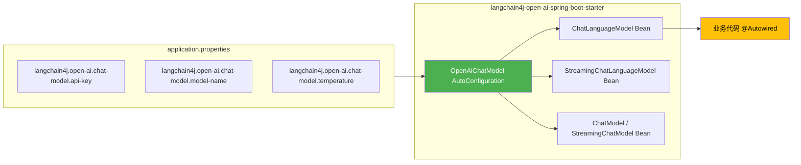
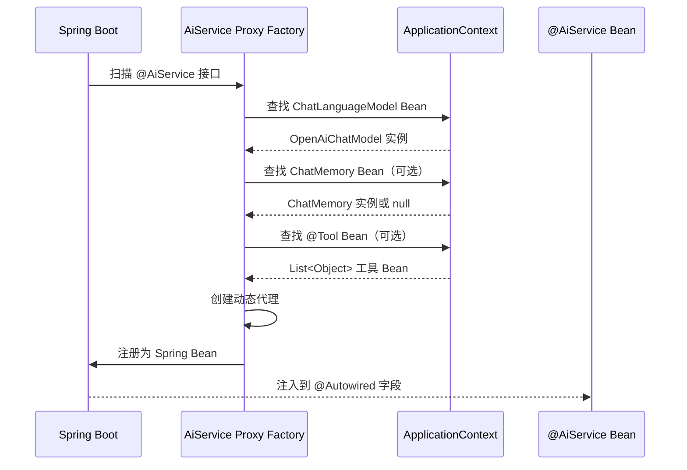
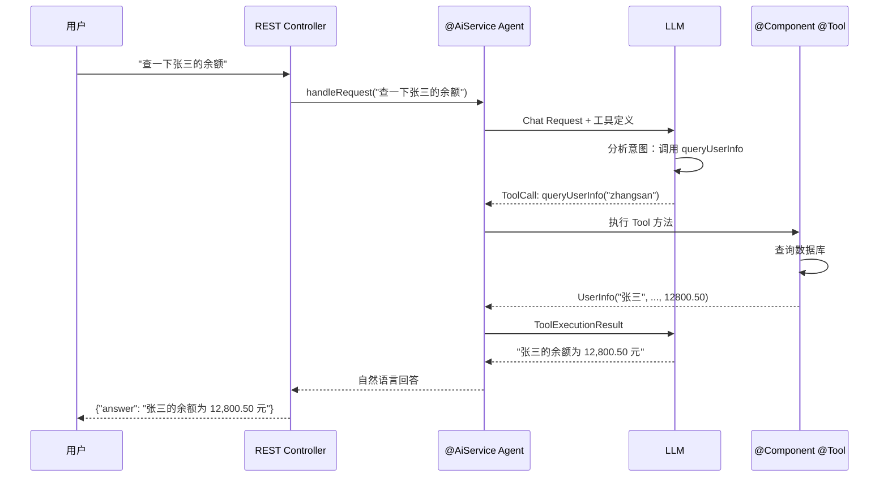

# 第9章 · Spring Boot 深度集成 — 自动配置与声明式 AI

> **预计时长**：3 小时 | **难度**：⭐⭐⭐ | **类型**：项目实战
>
> **目标**：掌握 LangChain4j Spring Boot Starter 的自动配置机制、application.properties 全属性配置、@AiService 声明式 AI 服务注册、Spring Bean 工具注入、可观测性集成，并对比手动搭建与 Spring Boot 集成以及 Quarkus 生态的差异

---

## 学习目标

- 理解 LangChain4j Spring Boot Starter 的自动配置原理，告别手动 Builder 代码
- 掌握 application.properties/yaml 中所有核心属性的配置方式，涵盖多环境切换
- 熟练使用 `@AiService` 注解将 AI 接口注册为 Spring Bean，实现依赖注入
- 学会将 Spring 管理的 `@Component` Bean 作为 AI 工具注入到 AiServices
- 配置 Spring 环境下的对话记忆方案，包括持久化与作用域管理
- 构建包含完整 CRUD、错误处理、可观测性的生产级 Spring Boot AI 应用
- 对比 Spring Boot Starter 集成与手动搭建的差异，理解企业选型的核心考量
- 了解 Quarkus 生态中 `@RegisterAiService` 的使用方式及与 Spring Boot 的异同

---

## 知识地图

```mermaid
graph TD
    subgraph A["Starter 自动配置"]
        A1[langchain4j-*-spring-boot-starter] --> A2[自动装配 ChatLanguageModel]
        A2 --> A3[从 application.properties 读取配置]
        A3 --> A4[无需手动 Builder 代码]
    end
    subgraph B["声明式 AI 服务"]
        B1[@AiService 注解] --> B2[接口动态代理]
        B2 --> B3[自动注入 ChatModel / Memory / Tools]
        B3 --> B4[Spring Bean 注册]
    end
    subgraph C["生产级能力"]
        C1[多环境配置] --> C2[Actuator 健康检查]
        C2 --> C3[Micrometer 指标]
        C3 --> C4[持久化记忆]
    end
    A4 --> B1
    B4 --> C1

    style A2 fill:#4CAF50,color:#fff
    style B1 fill:#FFC107,color:#000
    style C2 fill:#2196F3,color:#fff
```

---

## 9.1 Spring Boot Starter 自动配置

LangChain4j 为每个主流 LLM 提供商提供了独立的 Spring Boot Starter。引入依赖后，框架**自动装配**所有核心组件，开发者无需编写一行 Builder 代码。

### 9.1.1 核心依赖

```xml
<project>
    <parent>
        <groupId>org.springframework.boot</groupId>
        <artifactId>spring-boot-starter-parent</artifactId>
        <version>3.4.0</version>
        <relativePath/>
    </parent>

    <properties>
        <java.version>17</java.version>
        <langchain4j.version>1.16.1</langchain4j.version>
    </properties>

    <dependencyManagement>
        <dependencies>
            <dependency>
                <groupId>dev.langchain4j</groupId>
                <artifactId>langchain4j-bom</artifactId>
                <version>${langchain4j.version}</version>
                <type>pom</type>
                <scope>import</scope>
            </dependency>
        </dependencies>
    </dependencyManagement>

    <dependencies>
        <!-- Spring Boot Web -->
        <dependency>
            <groupId>org.springframework.boot</groupId>
            <artifactId>spring-boot-starter-web</artifactId>
        </dependency>

        <!-- LangChain4j OpenAI Starter（含自动配置） -->
        <dependency>
            <groupId>dev.langchain4j</groupId>
            <artifactId>langchain4j-open-ai-spring-boot-starter</artifactId>
        </dependency>

        <!-- 可选：其他提供商 Starter -->
        <!-- <dependency>
            <groupId>dev.langchain4j</groupId>
            <artifactId>langchain4j-ollama-spring-boot-starter</artifactId>
        </dependency> -->
    </dependencies>
</project>
```

> **关键点**：`langchain4j-open-ai-spring-boot-starter` 内部同时依赖了 `langchain4j-open-ai` 和 Spring Boot 自动配置模块。只需这一个依赖即可获得完整的 ChatLanguageModel Bean。

### 9.1.2 自动配置了什么



自动配置模块 `OpenAiChatModelAutoConfiguration` 会读取 `application.properties` 中以 `langchain4j.open-ai.chat-model` 为前缀的属性，自动构建 `OpenAiChatModel` 实例并注册为 Spring Bean。

### 9.1.3 一句话对比 Starter 与手动方式

| 维度 | 手动 Builder 方式 | Spring Boot Starter 方式 |
|------|-----------------|------------------------|
| 代码量 | 每处注入都需要 Builder 代码 | 零代码，自动装配 |
| 配置管理 | 分散在 Java 代码中 | 集中管理在 application.properties |
| 环境切换 | 需修改代码或条件判断 | Profile 原生支持 |
| 测试难度 | 需手动 Mock Builder | @SpringBootTest 原生 Mock |
| 团队规范 | 依赖开发者自觉 | 配置即契约，统一维护 |

---

## 9.2 application.properties 深度配置

Spring Boot Starter 的核心优势在于**配置外部化**。以下是一个完整的配置清单。

### 9.2.1 完整属性参考

```properties
# =============================================
# OpenAI ChatModel 配置
# =============================================
langchain4j.open-ai.chat-model.api-key=${OPENAI_API_KEY}
langchain4j.open-ai.chat-model.base-url=https://api.openai.com
langchain4j.open-ai.chat-model.model-name=gpt-4o-mini
langchain4j.open-ai.chat-model.temperature=0.7
langchain4j.open-ai.chat-model.max-tokens=2048
langchain4j.open-ai.chat-model.top-p=1.0
langchain4j.open-ai.chat-model.frequency-penalty=0.0
langchain4j.open-ai.chat-model.presence-penalty=0.0
langchain4j.open-ai.chat-model.log-requests=true
langchain4j.open-ai.chat-model.log-responses=true
langchain4j.open-ai.chat-model.max-retries=3
langchain4j.open-ai.chat-model.timeout=PT60S
langchain4j.open-ai.chat-model.organization-id=
langchain4j.open-ai.chat-model.user=
langchain4j.open-ai.chat-model.strict-json-schema=false

# =============================================
# Streaming ChatModel 配置
# =============================================
langchain4j.open-ai.streaming-chat-model.api-key=${OPENAI_API_KEY}
langchain4j.open-ai.streaming-chat-model.model-name=gpt-4o-mini
langchain4j.open-ai.streaming-chat-model.temperature=0.7

# =============================================
# EmbeddingModel 配置
# =============================================
langchain4j.open-ai.embedding-model.api-key=${OPENAI_API_KEY}
langchain4j.open-ai.embedding-model.model-name=text-embedding-3-small

# =============================================
# ImageModel 配置
# =============================================
langchain4j.open-ai.image-model.api-key=${OPENAI_API_KEY}
langchain4j.open-ai.image-model.model-name=dall-e-3
```

### 9.2.2 属性对照表

| 属性 | 默认值 | 说明 |
|------|--------|------|
| `api-key` | — | API 密钥（必填），建议用 `${}` 引用环境变量 |
| `base-url` | `https://api.openai.com` | API 基础地址，切换 DeepSeek 等兼容服务时修改 |
| `model-name` | `gpt-4o-mini` | 模型名称 |
| `temperature` | `0.7` | 创造性控制 0~2 |
| `max-tokens` | — | 最大输出 Token 数 |
| `top-p` | `1.0` | Nucleus sampling 参数 |
| `frequency-penalty` | `0.0` | 频率惩罚 -2~2 |
| `presence-penalty` | `0.0` | 存在惩罚 -2~2 |
| `log-requests` | `false` | 打印请求日志（开发环境推荐 true） |
| `log-responses` | `false` | 打印响应日志 |
| `max-retries` | `3` | 失败重试次数 |
| `timeout` | `PT60S` | HTTP 超时（ISO-8601 格式） |
| `strict-json-schema` | `false` | OpenAI 严格 JSON Schema 模式 |

### 9.2.3 多环境配置

Spring Boot Profile 是管理多环境配置的标准方案。将共有属性放在主文件，环境特定属性放在 Profile 文件中：

**application.properties**（通用配置）：
```properties
# 通用属性
langchain4j.open-ai.chat-model.api-key=${OPENAI_API_KEY}
langchain4j.open-ai.chat-model.model-name=gpt-4o-mini
langchain4j.open-ai.chat-model.temperature=0.7
langchain4j.open-ai.chat-model.max-tokens=2048
```

**application-dev.properties**（开发环境）：
```properties
# 开发环境：开启日志，使用较低成本模型
langchain4j.open-ai.chat-model.model-name=gpt-4o-mini
langchain4j.open-ai.chat-model.log-requests=true
langchain4j.open-ai.chat-model.log-responses=true
langchain4j.open-ai.chat-model.temperature=0.7
```

**application-prod.properties**（生产环境）：
```properties
# 生产环境：关闭日志，使用更强模型，设置超时
langchain4j.open-ai.chat-model.model-name=gpt-4o
langchain4j.open-ai.chat-model.log-requests=false
langchain4j.open-ai.chat-model.log-responses=false
langchain4j.open-ai.chat-model.temperature=0.3
langchain4j.open-ai.chat-model.timeout=PT120S
langchain4j.open-ai.chat-model.max-retries=3
```

启动时通过 `spring.profiles.active` 指定：
```bash
# 开发环境
java -jar app.jar --spring.profiles.active=dev

# 生产环境
java -jar app.jar --spring.profiles.active=prod
```

### 9.2.4 多提供商同应用配置

在一个应用中同时配置多个提供商，通过不同的前缀区分：

```properties
# ===== OpenAI =====
langchain4j.open-ai.chat-model.api-key=${OPENAI_API_KEY}
langchain4j.open-ai.chat-model.model-name=gpt-4o-mini

# ===== Ollama（本地） =====
langchain4j.ollama.chat-model.base-url=http://localhost:11434
langchain4j.ollama.chat-model.model-name=qwen2.5:7b
langchain4j.ollama.chat-model.temperature=0.7
```

Spring Boot 会分别为两个提供商创建 `ChatLanguageModel` Bean。使用时通过 `@Qualifier` 区分：

```java
@RestController
public class ChatController {

    @Autowired
    @Qualifier("openAiChatModel")
    private ChatLanguageModel openAiModel;

    @Autowired
    @Qualifier("ollamaChatModel")
    private ChatLanguageModel ollamaModel;
}
```

> **注意**：Bean 名称由自动配置决定，通常为 `openAiChatModel`、`ollamaChatModel` 等。详细名称可查看自动配置类的 `@Bean` 方法定义。

---

## 9.3 @AiService 声明式 AI 服务

`@AiService` 是 LangChain4j Spring Boot Starter 最强大的特性——它将 AI 接口直接注册为 Spring Bean，框架自动完成动态代理和所有装配工作。

### 9.3.1 基本使用

```java
import dev.langchain4j.service.AiService;
import dev.langchain4j.service.SystemMessage;
import dev.langchain4j.service.UserMessage;
import dev.langchain4j.service.V;

@AiService
public interface Assistant {

    @SystemMessage("你是专业的 Java 技术顾问，用中文回答用户问题。")
    String chat(@UserMessage String userMessage);

    @SystemMessage("请将以下文本从 {{sourceLang}} 翻译为 {{targetLang}}，只输出翻译结果。")
    String translate(
        @V("sourceLang") String sourceLang,
        @V("targetLang") String targetLang,
        @UserMessage String text
    );
}
```

**无需 `AiServices.create()`！** 当 Spring Boot 扫描到 `@AiService` 注解的接口后，自动配置会：

1. 为该接口创建 JDK 动态代理
2. 从 ApplicationContext 中查找可用的 `ChatLanguageModel` Bean
3. 如果有多个，通过 `@Qualifier` 或 Bean 名称匹配
4. 将代理注册为 Spring Bean，等待注入

### 9.3.2 注入并使用

```java
import org.springframework.beans.factory.annotation.Autowired;
import org.springframework.stereotype.Service;

@Service
public class ChatService {

    @Autowired
    private Assistant assistant;

    public String processQuestion(String question) {
        return assistant.chat(question);
    }

    public String processTranslation(String source, String target, String text) {
        return assistant.translate(source, target, text);
    }
}
```

### 9.3.3 完整 REST API 示例

```java
import org.springframework.web.bind.annotation.*;

@RestController
@RequestMapping("/api/ai")
public class AiController {

    @Autowired
    private Assistant assistant;

    @PostMapping("/chat")
    public ChatResponse chat(@RequestBody ChatRequest request) {
        String answer = assistant.chat(request.message());
        return new ChatResponse(answer);
    }

    @PostMapping("/translate")
    public TranslateResponse translate(@RequestBody TranslateRequest request) {
        String result = assistant.translate(
            request.sourceLang(),
            request.targetLang(),
            request.text()
        );
        return new TranslateResponse(result);
    }
}

// 请求/响应 Record
public record ChatRequest(String message) {}
public record ChatResponse(String answer) {}
public record TranslateRequest(String sourceLang, String targetLang, String text) {}
public record TranslateResponse(String result) {}
```

### 9.3.4 @AiService 内部装配机制



`@AiService` 注解还支持更多高级配置：

```java
@AiService
public interface AdvancedAssistant {

    @SystemMessage("你是客服助手。")
    @UserMessage("用户的问题是：{{it}}")
    String chat(@V("it") String message);

    @AiService(memory = "sessionMemory")
    String chatWithMemory(@MemoryId int memoryId, @UserMessage String message);

    @SystemMessage("你是一个可以访问数据库的助手。")
    String chatWithTools(@UserMessage String message);
}
```

---

## 9.4 Spring Bean 作为工具

LangChain4j 的 AI 工具调用（Function Calling）结合 Spring Boot 的依赖注入，使得将任意 Spring 管理的 Bean 暴露为 AI 工具变得异常简单。

### 9.4.1 @Component + @Tool

```java
import dev.langchain4j.agent.tool.P;
import dev.langchain4j.agent.tool.Tool;
import org.springframework.stereotype.Component;

@Component
public class DatabaseTool {

    @Tool("根据用户名查询用户信息，返回姓名、邮箱、余额")
    public UserInfo queryUserInfo(@P("用户名或用户ID") String username) {
        // 实际项目中会调用 DAO/Repository
        // 这里模拟数据库查询
        if ("zhangsan".equals(username)) {
            return new UserInfo("张三", "zhangsan@example.com", 12800.50);
        }
        return new UserInfo("未知用户", "", 0.0);
    }

    @Tool("查询指定商品的库存数量")
    public int queryStock(@P("商品SKU编号") String sku) {
        // 实际调用库存服务
        return sku.startsWith("SKU") ? 42 : 0;
    }

    @Tool("创建新订单")
    public String createOrder(
            @P("用户名") String username,
            @P("商品SKU") String sku,
            @P("数量") int quantity) {
        // 实际调用订单服务
        return "ORDER-" + System.currentTimeMillis();
    }

    public record UserInfo(String name, String email, double balance) {}
}
```

### 9.4.2 自动发现工具 Bean

当 `@AiService` 接口存在 Spring 管理的 `@Tool` Bean 时，框架会自动扫描 `ApplicationContext` 中所有带 `@Tool` 注解方法的 Bean，并注入到对应的 `AiServices` 中。

```java
@AiService
public interface CustomerServiceAgent {

    @SystemMessage("你是客服助手，可以查询用户信息、商品库存和创建订单。")
    String handleRequest(@UserMessage String request);
}
```

无需额外配置——`@Component` 扫描到的 `DatabaseTool` Bean 会被自动发现并注册为 AI 工具。

### 9.4.3 业务服务作为工具

更真实的场景：工具方法内部调用 Spring 管理的 Service 和 Repository，并参与事务管理。

```java
@Component
public class OrderTool {

    private final OrderRepository orderRepository;
    private final ProductRepository productRepository;
    private final PaymentService paymentService;

    public OrderTool(OrderRepository orderRepository,
                     ProductRepository productRepository,
                     PaymentService paymentService) {
        this.orderRepository = orderRepository;
        this.productRepository = productRepository;
        this.paymentService = paymentService;
    }

    @Tool("查询用户的订单历史，返回最近的订单列表")
    public List<Order> queryOrderHistory(@P("用户ID") Long userId) {
        return orderRepository.findByUserIdOrderByCreateTimeDesc(userId);
    }

    @Tool("根据订单ID查询订单详情")
    @Transactional(readOnly = true)
    public OrderDetail getOrderDetail(@P("订单ID") Long orderId) {
        Order order = orderRepository.findById(orderId)
            .orElseThrow(() -> new RuntimeException("订单不存在"));
        List<Product> products = productRepository.findByOrderId(orderId);
        return new OrderDetail(order, products);
    }

    @Tool("取消指定订单，如果已支付则发起退款")
    @Transactional
    public CancelResult cancelOrder(@P("订单ID") Long orderId,
                                    @P("取消原因") String reason) {
        Order order = orderRepository.findById(orderId)
            .orElseThrow(() -> new RuntimeException("订单不存在"));

        if (order.getStatus() == OrderStatus.PAID) {
            // 已支付：发起退款
            paymentService.refund(order.getPaymentId());
            order.setStatus(OrderStatus.REFUNDING);
        } else {
            order.setStatus(OrderStatus.CANCELLED);
        }
        order.setCancelReason(reason);
        orderRepository.save(order);

        return new CancelResult(orderId, order.getStatus(), "取消成功");
    }
}
```

> **事务安全**：Spring 的 `@Transactional` 注解在工具方法上正常工作——LangChain4j 的 AI 工具调用是同步执行的，事务边界保持完整。

### 9.4.4 工具调用完整流程



---

## 9.5 Spring Boot 记忆配置

在 Spring Boot 中配置对话记忆，只需将 `ChatMemory` 声明为 Bean。

### 9.5.1 基本记忆配置

```java
import dev.langchain4j.memory.ChatMemory;
import dev.langchain4j.memory.chat.MessageWindowChatMemory;
import org.springframework.context.annotation.Bean;
import org.springframework.context.annotation.Configuration;

@Configuration
public class AiConfig {

    @Bean
    public ChatMemory chatMemory() {
        return MessageWindowChatMemory.builder()
            .maxMessages(20)              // 保留最近 20 条消息
            .build();
    }
}
```

配合 `@AiService`：

```java
@AiService
public interface ChatWithMemory {

    @SystemMessage("你是一个友好的对话助手。")
    String chat(@MemoryId int memoryId, @UserMessage String message);
}
```

`@MemoryId` 参数用于区分不同会话的记忆——同一 `memoryId` 共享记忆，不同 `memoryId` 隔离。

### 9.5.2 会话作用域记忆

对于 Web 应用，通常需要**按会话隔离**记忆。使用 Spring 的 Session Scope 或自定义 Scope：

```java
import org.springframework.context.annotation.Bean;
import org.springframework.context.annotation.Configuration;
import org.springframework.context.annotation.Scope;
import org.springframework.context.annotation.ScopedProxyMode;
import org.springframework.web.context.WebApplicationContext;

@Configuration
public class MemoryConfig {

    /**
     * 按 HTTP 会话隔离记忆。每个用户的会话拥有独立的 ChatMemory。
     */
    @Bean
    @Scope(value = WebApplicationContext.SCOPE_SESSION,
           proxyMode = ScopedProxyMode.TARGET_CLASS)
    public ChatMemory sessionMemory() {
        return MessageWindowChatMemory.builder()
            .maxMessages(30)
            .build();
    }
}
```

> **注意**：`proxyMode = ScopedProxyMode.TARGET_CLASS` 是必需的——因为 `ChatMemory` 是非接口类，需要使用 CGLIB 代理来注入会话作用域。

### 9.5.3 持久化记忆

生产环境中，内存记忆在重启后会丢失。使用外部存储持久化记忆：

**JDBC 持久化**：

```xml
<dependency>
    <groupId>dev.langchain4j</groupId>
    <artifactId>langchain4j-chat-memory-jdbc</artifactId>
</dependency>
```

```java
import dev.langchain4j.memory.chat.ChatMemoryProvider;
import dev.langchain4j.memory.chat.jdbc.JdbcChatMemoryStore;
import org.springframework.context.annotation.Bean;
import org.springframework.context.annotation.Configuration;

import javax.sql.DataSource;

@Configuration
public class PersistentMemoryConfig {

    @Bean
    public JdbcChatMemoryStore chatMemoryStore(DataSource dataSource) {
        return JdbcChatMemoryStore.builder()
            .dataSource(dataSource)
            .tableName("chat_memory")
            .build();
    }

    @Bean
    public ChatMemoryProvider chatMemoryProvider(JdbcChatMemoryStore store) {
        return memoryId -> MessageWindowChatMemory.builder()
            .id(memoryId)
            .maxMessages(50)
            .chatMemoryStore(store)
            .build();
    }
}
```

**Redis 持久化**：

```xml
<dependency>
    <groupId>dev.langchain4j</groupId>
    <artifactId>langchain4j-chat-memory-redis</artifactId>
</dependency>
```

```java
import dev.langchain4j.memory.chat.RedisChatMemoryStore;
import org.springframework.context.annotation.Bean;
import org.springframework.context.annotation.Configuration;
import redis.clients.jedis.JedisPool;

@Configuration
public class RedisMemoryConfig {

    @Bean
    public RedisChatMemoryStore redisChatMemoryStore(JedisPool jedisPool) {
        return new RedisChatMemoryStore(jedisPool);
    }
}
```

### 9.5.4 记忆策略对照

| 策略 | 存储位置 | 持久化 | 会话隔离 | 适用场景 |
|------|---------|--------|---------|---------|
| MessageWindowChatMemory | 堆内存 | 否 | 手动 `@MemoryId` | 开发测试、原型 |
| 会话作用域 Memory | 堆内存（按 HTTP Session） | 否 | 自动 | 小规模 Web 应用 |
| JDBC ChatMemory | 关系数据库 | 是 | 手动 `@MemoryId` | 标准生产环境 |
| Redis ChatMemory | Redis | 是 | 手动 `@MemoryId` | 高并发、分布式 |
| 自定义 PersistentChatMemory | 任意存储 | 是 | 自定义 | 特殊存储需求 |

---

## 9.6 完整 CRUD Spring Boot 应用

以下是一个集成了所有前述概念的生产级 Spring Boot AI 应用。

### 9.6.1 项目结构

```
src/main/java/com/example/aiassistant/
├── AiAssistantApplication.java          # Spring Boot 入口
├── config/
│   └── AiConfig.java                    # 模型与记忆配置
├── controller/
│   └── AiController.java                # REST API
├── service/
│   ├── Assistant.java                   # @AiService 接口
│   └── AssistantService.java            # 业务封装层
├── tool/
│   ├── DatabaseTool.java                # 数据库查询工具
│   └── NotificationTool.java            # 通知发送工具
├── model/
│   ├── ChatRequest.java                 # 请求 Record
│   └── ChatResponse.java                # 响应 Record
├── exception/
│   └── GlobalExceptionHandler.java      # 全局异常处理
└── repository/
    └── OrderRepository.java             # 数据访问层
```

### 9.6.2 完整代码

**application.properties**：
```properties
spring.application.name=ai-assistant
server.port=8080

langchain4j.open-ai.chat-model.api-key=${OPENAI_API_KEY}
langchain4j.open-ai.chat-model.model-name=gpt-4o-mini
langchain4j.open-ai.chat-model.temperature=0.7
langchain4j.open-ai.chat-model.max-tokens=4096
langchain4j.open-ai.chat-model.log-requests=true
langchain4j.open-ai.chat-model.log-responses=true

spring.datasource.url=jdbc:h2:mem:aiassistant
spring.datasource.driver-class-name=org.h2.Driver
```

**AiConfig.java**：
```java
import dev.langchain4j.memory.chat.ChatMemoryProvider;
import dev.langchain4j.memory.chat.MessageWindowChatMemory;
import dev.langchain4j.memory.chat.jdbc.JdbcChatMemoryStore;
import org.springframework.context.annotation.Bean;
import org.springframework.context.annotation.Configuration;

import javax.sql.DataSource;

@Configuration
public class AiConfig {

    @Bean
    public JdbcChatMemoryStore chatMemoryStore(DataSource dataSource) {
        return JdbcChatMemoryStore.builder()
            .dataSource(dataSource)
            .tableName("chat_memory")
            .build();
    }

    @Bean
    public ChatMemoryProvider chatMemoryProvider(JdbcChatMemoryStore store) {
        return memoryId -> MessageWindowChatMemory.builder()
            .id(memoryId)
            .maxMessages(20)
            .chatMemoryStore(store)
            .build();
    }
}
```

**Assistant.java**（核心 AI 接口）：
```java
import dev.langchain4j.service.AiService;
import dev.langchain4j.service.MemoryId;
import dev.langchain4j.service.SystemMessage;
import dev.langchain4j.service.UserMessage;

@AiService
public interface Assistant {

    @SystemMessage("""
        你是智能客服助手，职责如下：
        1. 回答用户关于订单、商品、账户的问题
        2. 需要查询数据时，使用可用的工具
        3. 始终用中文回答，语气专业友好
        4. 如果不确定，请坦诚告知用户，不要编造信息
        """)
    String chat(
        @MemoryId String sessionId,
        @UserMessage String message
    );
}
```

**DatabaseTool.java**：
```java
import dev.langchain4j.agent.tool.P;
import dev.langchain4j.agent.tool.Tool;
import org.springframework.stereotype.Component;

@Component
public class DatabaseTool {

    @Tool("查询用户账户余额")
    public String queryBalance(@P("用户名") String username) {
        // 模拟数据库查询
        return "用户 " + username + " 的当前余额为 12,800.50 元";
    }

    @Tool("查询订单状态")
    public String queryOrderStatus(@P("订单号") String orderId) {
        // 模拟订单查询
        return "订单 " + orderId + " 状态：已发货，预计 2 天内送达";
    }

    @Tool("查询商品库存")
    public int queryInventory(@P("商品名称") String productName) {
        // 模拟库存查询
        return 120;
    }
}
```

**NotificationTool.java**：
```java
import dev.langchain4j.agent.tool.P;
import dev.langchain4j.agent.tool.Tool;
import org.springframework.stereotype.Component;

@Component
public class NotificationTool {

    @Tool("给指定用户发送短信通知")
    public String sendSms(
            @P("手机号") String phone,
            @P("短信内容") String content) {
        // 调用短信服务 SDK
        return "短信已成功发送至 " + phone;
    }
}
```

**AiController.java**：
```java
import org.springframework.beans.factory.annotation.Autowired;
import org.springframework.web.bind.annotation.*;

@RestController
@RequestMapping("/api/ai")
public class AiController {

    @Autowired
    private Assistant assistant;

    @PostMapping("/chat")
    public ChatResponse chat(@RequestBody ChatRequest request) {
        String answer = assistant.chat(request.sessionId(), request.message());
        return new ChatResponse(answer);
    }

    @PostMapping("/chat/stream")
    public void chatStream(@RequestBody ChatRequest request,
                           org.springframework.web.servlet.mvc.method.annotation
                               .SseEmitter emitter) {
        // 流式响应需使用 StreamingChatLanguageModel + @AiService
        // 此处省略实现，留作扩展
    }
}
```

**GlobalExceptionHandler.java**：
```java
import org.springframework.http.HttpStatus;
import org.springframework.http.ResponseEntity;
import org.springframework.web.bind.annotation.ControllerAdvice;
import org.springframework.web.bind.annotation.ExceptionHandler;

import java.time.LocalDateTime;

@ControllerAdvice
public class GlobalExceptionHandler {

    @ExceptionHandler(dev.langchain4j.model.output.FunctionExecutionException.class)
    public ResponseEntity<ErrorResponse> handleToolExecutionException(
            dev.langchain4j.model.output.FunctionExecutionException ex) {
        return ResponseEntity
            .status(HttpStatus.INTERNAL_SERVER_ERROR)
            .body(new ErrorResponse(
                "TOOL_EXECUTION_ERROR",
                "AI 工具执行异常：" + ex.getMessage(),
                LocalDateTime.now()
            ));
    }

    @ExceptionHandler(Exception.class)
    public ResponseEntity<ErrorResponse> handleGeneralException(Exception ex) {
        return ResponseEntity
            .status(HttpStatus.INTERNAL_SERVER_ERROR)
            .body(new ErrorResponse(
                "INTERNAL_ERROR",
                "服务器内部错误，请稍后重试",
                LocalDateTime.now()
            ));
    }

    public record ErrorResponse(String code, String message, LocalDateTime timestamp) {}
}

// 请求/响应 Model
public record ChatRequest(String sessionId, String message) {}
public record ChatResponse(String answer) {}
```

### 9.6.3 测试

```java
import org.junit.jupiter.api.Test;
import org.springframework.beans.factory.annotation.Autowired;
import org.springframework.boot.test.context.SpringBootTest;

import static org.assertj.core.api.Assertions.assertThat;

@SpringBootTest
class AssistantTest {

    @Autowired
    private Assistant assistant;

    @Test
    void testChat() {
        String answer = assistant.chat("test-session", "查询张三的账户余额");
        assertThat(answer).isNotEmpty();
        assertThat(answer).contains("12800");
    }

    @Test
    void testEmptyMessage() {
        String answer = assistant.chat("test-session", "");
        assertThat(answer).isNotBlank();
    }
}
```

> **注意**：集成测试会真实调用 LLM API，建议使用 Mock 或 @TestConfiguration 替换为测试专用的模型。

---

## 9.7 Spring Boot 可观测性

生产环境部署 AI 应用时，可观测性至关重要。LangChain4j Spring Boot Starter 与 Spring Actuator、Micrometer 深度集成。

### 9.7.1 Actuator 健康检查

```xml
<dependency>
    <groupId>org.springframework.boot</groupId>
    <artifactId>spring-boot-starter-actuator</artifactId>
</dependency>
```

```properties
# 暴露所有端点
management.endpoints.web.exposure.include=health,info,metrics
# 显示详细健康信息
management.endpoint.health.show-details=always
```

LangChain4j 自动注册了 LLM 健康指示器 `LangChain4jHealthIndicator`，会尝试向配置的 LLM 发送一个简单请求来验证连通性。访问 `GET /actuator/health` 可以看到：

```json
{
  "status": "UP",
  "components": {
    "langChain4j": {
      "status": "UP",
      "details": {
        "chatModel": "UP",
        "streamingChatModel": "UP",
        "embeddingModel": "UP"
      }
    }
  }
}
```

### 9.7.2 Micrometer 指标

```xml
<dependency>
    <groupId>io.micrometer</groupId>
    <artifactId>micrometer-registry-prometheus</artifactId>
</dependency>
```

LangChain4j 自动注册以下 Micrometer 指标：

| 指标名称 | 类型 | 说明 |
|---------|------|------|
| `langchain4j.chat.model.requests` | Counter | LLM 请求总数 |
| `langchain4j.chat.model.tokens.input` | Counter | 输入 Token 总数 |
| `langchain4j.chat.model.tokens.output` | Counter | 输出 Token 总数 |
| `langchain4j.chat.model.duration` | Timer | 请求耗时分布 |
| `langchain4j.chat.model.errors` | Counter | 请求错误总数 |

```properties
# 启用 Prometheus 端点
management.endpoints.web.exposure.include=health,info,metrics,prometheus
```

访问 `GET /actuator/prometheus` 可以看到类似：
```
# HELP langchain4j_chat_model_tokens_input_total
# TYPE langchain4j_chat_model_tokens_input_total counter
langchain4j_chat_model_tokens_input_total 15234.0

# HELP langchain4j_chat_model_duration_seconds
# TYPE langchain4j_chat_model_duration_seconds histogram
langchain4j_chat_model_duration_seconds_bucket{le="0.5",} 42.0
langchain4j_chat_model_duration_seconds_bucket{le="1.0",} 128.0
```

### 9.7.3 日志配置

```properties
# LangChain4j 请求/响应日志（已通过 chat-model 配置）
langchain4j.open-ai.chat-model.log-requests=true
langchain4j.open-ai.chat-model.log-responses=true

# 控制台日志级别
logging.level.dev.langchain4j=DEBUG
logging.level.org.springframework.ai=DEBUG

# 保存到文件
logging.file.name=logs/ai-assistant.log
logging.logback.rollingpolicy.max-history=7
logging.logback.rollingpolicy.max-file-size=100MB
```

---

## 9.8 Spring Boot vs 手动搭建

同样是调用 LLM，两种方式的代码量差异显著。

### 手动方式（非 Spring Boot）

```java
// 每个消费方都需要重复这段代码
ChatLanguageModel model = OpenAiChatModel.builder()
    .apiKey(System.getenv("OPENAI_API_KEY"))
    .modelName("gpt-4o-mini")
    .temperature(0.7)
    .maxTokens(2048)
    .logRequests(true)
    .logResponses(true)
    .build();

Translator translator = AiServices.builder(Translator.class)
    .chatLanguageModel(model)
    .build();
```

### Spring Boot Starter 方式

```java
// 无需任何代码——配置在 application.properties 中
// 直接注入即可
@Autowired
private Assistant assistant;
```

### 全面对比

| 维度 | 手动搭建 | Spring Boot Starter |
|------|---------|--------------------|
| **配置方式** | Java Builder 硬编码 | application.properties 外部化 |
| **环境切换** | 修改代码或自定义环境判断 | @Profile 原生支持 |
| **Bean 管理** | 开发者自行管理生命周期 | Spring 容器统一管理 |
| **多提供商** | 手动注册多个 Model | 自动按前缀配置 |
| **@AiService** | 手动调用 AiServices.create() | @AiService 注解自动代理 |
| **工具注入** | 手动 .tools() 注册 | 自动发现 @Component + @Tool |
| **记忆管理** | 手动构建 ChatMemory | 声明为 Bean 即可 |
| **健康检查** | 自行实现 | Actuator 自动集成 |
| **指标监控** | 自行埋点 | Micrometer 自动采集 |
| **测试支持** | 手动 Mock | @SpringBootTest 原生支持 |
| **代码量** | 每接口约 20~30 行 | 零配置代码 |

> **结论**：对于任何使用 Spring Boot 的项目，LangChain4j Starter 是毫无疑问的推荐方案——它消除了所有样板代码，同时保持了完全的控制能力。只有在非 Spring 项目（如纯 CLI 或 Vert.x 应用）中才需要考虑手动方式。

---

## 9.9 Quarkus 集成简介

Quarkus 是另一个流行的 Java 微服务框架，LangChain4j 提供了对应的 Quarkus 扩展。

### 依赖配置

```xml
<dependency>
    <groupId>io.quarkiverse.langchain4j</groupId>
    <artifactId>quarkus-langchain4j-openai</artifactId>
    <version>0.22.0</version>
</dependency>
```

### application.properties（Quarkus）

```properties
quarkus.langchain4j.openai.api-key=${OPENAI_API_KEY}
quarkus.langchain4j.openai.model=gpt-4o-mini
quarkus.langchain4j.openai.temperature=0.7
```

### @RegisterAiService 注解

```java
import io.quarkiverse.langchain4j.RegisterAiService;
import dev.langchain4j.service.SystemMessage;
import dev.langchain4j.service.UserMessage;

@RegisterAiService
public interface QuarkusAssistant {

    @SystemMessage("你是有用的助手。")
    String chat(@UserMessage String message);
}
```

### 在 REST 资源中使用

```java
import jakarta.inject.Inject;
import jakarta.ws.rs.POST;
import jakarta.ws.rs.Path;

@Path("/ai")
public class AiResource {

    @Inject
    QuarkusAssistant assistant;

    @POST
    @Path("/chat")
    public String chat(String message) {
        return assistant.chat(message);
    }
}
```

### 对比总结

| 维度 | Spring Boot | Quarkus |
|------|------------|---------|
| 注解 | `@AiService` | `@RegisterAiService` |
| 配置前缀 | `langchain4j.open-ai.*` | `quarkus.langchain4j.openai.*` |
| 工具注入 | `@Component + @Tool` | `@ApplicationScoped + @Tool` |
| 启动速度 | 秒级 | 毫秒级（CDS + 编译优化） |
| 内存占用 | 较高 | 较低（~50MB） |
| 构建产物 | Fat Jar | 原生映像 (Native Image) |
| 开发体验 | 成熟度最高 | 快速开发启动 |
| 适合场景 | 企业标准/遗留系统集成 | 云原生/Serverless/边缘计算 |

**选型建议**：
- 现有 Spring Boot 生态的团队应使用 Spring Boot Starter
- 新建云原生项目、需要极速启动和低内存时可以选用 Quarkus
- 两种方式的 API 设计理念高度一致，切换成本较低

---

## 常见踩坑

**1. Bean 重复导致启动失败**
- 原因：同时引入了 `langchain4j-open-ai`（非 Starter）和 `langchain4j-open-ai-spring-boot-starter`，手动创建的 Model Bean 与 Starter 自动创建的发生冲突
- 解决：只引入 Starter 依赖，**不要**手动创建 `ChatLanguageModel` Bean，让自动配置管理；如需自定义，使用 `@ConditionalOnMissingBean` 替代

```java
@Bean
@ConditionalOnMissingBean(ChatLanguageModel.class)
public ChatLanguageModel myCustomModel() {
    // 仅在 Starter 未创建 Bean 时生效
}
```

**2. @AiService 接口方法返回类型不支持**
- 原因：`@AiService` 代理目前不支持返回 `Mono`、`Flux` 等 Reactive 类型
- 解决：返回 `String` 或 POJO 类型，流式场景使用 `StreamingChatLanguageModel` 手动处理

**3. 工具方法参数字段缺失 @P 注解**
- 原因：`@Tool` 方法的参数未标注 `@P`，LLM 无法理解参数含义
- 解决：**所有工具方法参数必须标注** `@P("参数描述")`，描述越清晰 LLM 调用越准确

**4. 多环境配置中的 API Key 泄露**
- 原因：将 API Key 直接在 `application-prod.properties` 中写死，推送到 Git 仓库
- 解决：始终使用 `${ENV_VARIABLE}` 引用环境变量，将 `.properties` 文件加入 `.gitignore` 或在 CI/CD 中注入

**5. Session 作用域 Memory Bean 序列化异常**
- 原因：`MessageWindowChatMemory` 未实现 `Serializable`，HTTP Session 钝化时失败
- 解决：改用 JDBC 或 Redis 持久化记忆，或配置 Spring Session 使用非序列化存储

---

## 课后练习

**练习 1：将第 1 章的手动搭建应用迁移到 Spring Boot**
将第 1 章的 `Translator` AI 服务从手动 `AiServices.create()` 方式迁移为 Spring Boot Starter + `@AiService` 方式。要求使用 Profile 分别配置开发环境和生产环境的模型参数。

**练习 2：实现订单查询助手**
创建一个 Spring Boot 应用，包含：
- 一个 `@AiService` 接口（订单查询助手）
- 两个 `@Component + @Tool` Bean（订单查询工具 + 物流查询工具）
- 一个 REST Controller 暴露聊天端点
- 测试助手能否正确响应"查一下订单 OD20240001 的物流状态"

**练习 3：配置持久化记忆 + 会话隔离**
基于练习 2，添加 JDBC 持久化记忆配置。使用 `ChatMemoryProvider` Bean 实现按 `sessionId` 隔离的记忆。测试同一会话的上下文保持和跨会话的隔离性。

**练习 4：Actuator 监控与指标查看**
为练习 2 的应用添加 `spring-boot-starter-actuator` 依赖，配置并访问 `/actuator/health` 和 `/actuator/metrics` 端点。观察 LangChain4j 自动注册的健康检查和 Token 消耗指标。

---

## 本节小结

- ✅ LangChain4j Spring Boot Starter 消除了所有手动 Builder 代码，自动从 application.properties 读取配置完成装配
- ✅ `langchain4j.open-ai.chat-model.*` 属性体系覆盖了 OpenAI ChatModel 的全部配置项，支持多环境 Profile 管理
- ✅ `@AiService` 注解将 AI 接口自动注册为 Spring Bean，框架自动完成动态代理、模型注入、工具发现和记忆装配
- ✅ `@Component` + `@Tool` 注解使任意 Spring Bean 可被 LLM 识别和调用，工具方法中 `@Transactional` 事务正常生效
- ✅ 对话记忆支持内存模式、会话作用域模式、JDBC 持久化、Redis 持久化多种策略，满足不同生产场景
- ✅ Actuator 健康检查和 Micrometer 指标为生产运维提供了标准的可观测性能力
- ✅ Spring Boot Stater 相比手动搭建大幅减少了样板代码，而 Quarkus 的 `@RegisterAiService` 提供了类似的开发体验

---

> **下一章预告：第 10 章 · 多模态与大模型进阶应用**  
> 本章深入学习了 Spring Boot 生态中 LangChain4j 的完整集成方案。下一章将进入多模态领域——让 AI 不仅能理解文本，还能"看"图片、"听"音频、生成图像，以及探索 Function Calling 与 Agent 模式的深度融合，构建更智能、更自主的 AI 应用系统。
