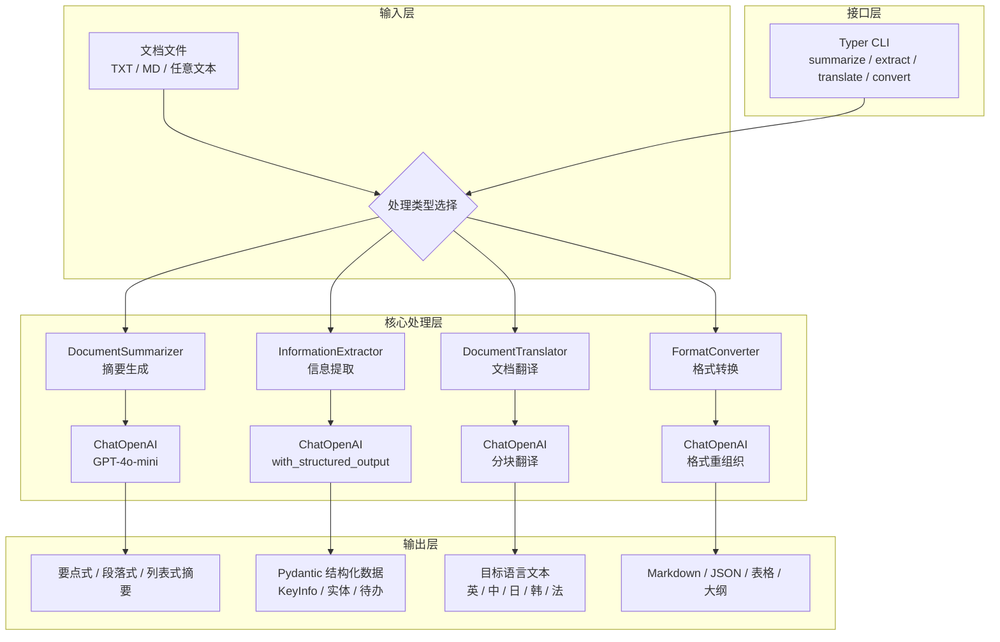

# 第2章 · 文档智能助手 — 构建多功能文档处理工具

> **时长**：约 5 小时 ｜ **难度**：⭐⭐⭐⭐ ｜ **类型**：综合实战
>
> **目标**：构建一个多功能的文档智能处理助手

---

## 项目概述

### 功能需求

- 文档摘要生成
- 关键信息提取
- 文档翻译
- 格式转换
- 智能问答

### 技术栈

| 组件 | 技术选型 |
|------|---------|
| 框架 | LangChain |
| LLM | OpenAI GPT-4o-mini |
| 结构化输出 | Pydantic |
| CLI | Typer |

---

## 项目结构

```
doc-assistant/
├── assistant/
│   ├── __init__.py
│   ├── summarizer.py      # 摘要生成
│   ├── extractor.py       # 信息提取
│   ├── translator.py      # 翻译
│   ├── converter.py       # 格式转换
│   └── qa.py              # 问答
├── cli.py                 # 命令行工具
└── requirements.txt
```

### 系统架构图



---

## 核心代码

### 1. 文档摘要

**概念定义**：文档摘要通过 LLM 压缩文本核心内容。短文本直接进行单次摘要，长文本使用 Map-Reduce 策略——先分块独立摘要，再合并为最终摘要，突破上下文窗口限制。

```python
"""
summarizer.py
文档摘要模块
"""
from langchain_openai import ChatOpenAI
from langchain_core.prompts import ChatPromptTemplate
from langchain.chains.summarize import load_summarize_chain
from langchain.text_splitter import RecursiveCharacterTextSplitter
from langchain.schema import Document


class DocumentSummarizer:
    """文档摘要生成器"""

    def __init__(self, model: str = "gpt-4o-mini"):
        self.llm = ChatOpenAI(model=model, temperature=0)
        self.text_splitter = RecursiveCharacterTextSplitter(
            chunk_size=4000,
            chunk_overlap=200
        )

    def summarize(
        self,
        text: str,
        style: str = "concise",
        max_length: int = 500
    ) -> str:
        """生成摘要"""
        styles = {
            "concise": "简洁的要点式摘要",
            "detailed": "详细的段落式摘要",
            "bullet": "要点列表形式的摘要",
        }

        style_desc = styles.get(style, styles["concise"])

        # 短文本直接摘要
        if len(text) < 4000:
            prompt = ChatPromptTemplate.from_template(f"""
请为以下文本生成{style_desc}，长度控制在{max_length}字以内。

文本：
{{text}}

摘要：
""")
            chain = prompt | self.llm
            return chain.invoke({"text": text}).content

        # 长文本使用 map-reduce
        docs = [Document(page_content=chunk)
                for chunk in self.text_splitter.split_text(text)]

        chain = load_summarize_chain(
            self.llm,
            chain_type="map_reduce",
            verbose=False
        )

        return chain.invoke(docs)["output_text"]

    def summarize_multi_doc(self, texts: list[str]) -> str:
        """多文档摘要"""
        docs = [Document(page_content=t) for t in texts]

        chain = load_summarize_chain(
            self.llm,
            chain_type="map_reduce"
        )

        return chain.invoke(docs)["output_text"]
```

### 2. 信息提取

**核心定位**：结构化输出——通过 Pydantic 定义输出 Schema，结合 `with_structured_output` 让 LLM 直接返回类型安全的 Python 对象，避免字符串解析的脆弱性和运行时类型错误。

```python
"""
extractor.py
信息提取模块
"""
from typing import List, Optional
from pydantic import BaseModel, Field
from langchain_openai import ChatOpenAI
from langchain_core.prompts import ChatPromptTemplate


class Person(BaseModel):
    """人物信息"""
    name: str = Field(description="姓名")
    role: Optional[str] = Field(description="角色/职位", default=None)
    description: Optional[str] = Field(description="描述", default=None)


class KeyInfo(BaseModel):
    """关键信息"""
    title: str = Field(description="文档标题或主题")
    summary: str = Field(description="一句话摘要")
    key_points: List[str] = Field(description="关键要点列表")
    people: List[Person] = Field(description="提及的人物", default_factory=list)
    dates: List[str] = Field(description="提及的日期", default_factory=list)
    locations: List[str] = Field(description="提及的地点", default_factory=list)


class InformationExtractor:
    """信息提取器"""

    def __init__(self, model: str = "gpt-4o-mini"):
        self.llm = ChatOpenAI(model=model, temperature=0)

    def extract_key_info(self, text: str) -> KeyInfo:
        """提取关键信息"""
        structured_llm = self.llm.with_structured_output(KeyInfo)

        prompt = ChatPromptTemplate.from_template("""
从以下文本中提取关键信息：

{text}

请提取：标题、摘要、关键要点、人物、日期、地点等信息。
""")

        chain = prompt | structured_llm
        return chain.invoke({"text": text})

    def extract_entities(self, text: str, entity_types: List[str]) -> dict:
        """提取指定类型的实体"""
        prompt = ChatPromptTemplate.from_template("""
从以下文本中提取 {entity_types} 类型的实体：

{text}

以 JSON 格式返回，格式为：{{"entity_type": ["entity1", "entity2", ...]}}
""")

        chain = prompt | self.llm
        response = chain.invoke({
            "text": text,
            "entity_types": ", ".join(entity_types)
        })

        import json
        try:
            return json.loads(response.content)
        except:
            return {"raw": response.content}

    def extract_action_items(self, text: str) -> List[str]:
        """提取待办事项"""
        prompt = ChatPromptTemplate.from_template("""
从以下会议记录/文档中提取待办事项和行动项：

{text}

以列表形式返回，每项一行，格式：
- [负责人] 待办事项 (截止日期)
""")

        chain = prompt | self.llm
        response = chain.invoke({"text": text})

        # 解析结果
        lines = response.content.strip().split("\n")
        return [line.strip("- ").strip() for line in lines if line.strip()]
```

### 3. 文档翻译

**概念定义**：长文本翻译采用分块翻译策略——将长文档切分为独立片段逐块翻译，最后拼接。可配合术语表（Glossary）确保专有名词和术语在不同块中翻译一致。

```python
"""
translator.py
文档翻译模块
"""
from langchain_openai import ChatOpenAI
from langchain_core.prompts import ChatPromptTemplate
from langchain.text_splitter import RecursiveCharacterTextSplitter


class DocumentTranslator:
    """文档翻译器"""

    LANGUAGES = {
        "en": "English",
        "zh": "中文",
        "ja": "日本語",
        "ko": "한국어",
        "fr": "Français",
        "de": "Deutsch",
        "es": "Español",
    }

    def __init__(self, model: str = "gpt-4o-mini"):
        self.llm = ChatOpenAI(model=model, temperature=0)
        self.text_splitter = RecursiveCharacterTextSplitter(
            chunk_size=2000,
            chunk_overlap=100
        )

    def translate(
        self,
        text: str,
        target_lang: str,
        source_lang: str = None,
        preserve_format: bool = True
    ) -> str:
        """翻译文本"""
        target = self.LANGUAGES.get(target_lang, target_lang)
        source = self.LANGUAGES.get(source_lang, "自动检测") if source_lang else "自动检测"

        format_instruction = "保持原文的格式和结构，包括标题、列表、段落等。" if preserve_format else ""

        prompt = ChatPromptTemplate.from_template(f"""
将以下文本从{source}翻译成{target}。
{format_instruction}

原文：
{{text}}

翻译：
""")

        # 短文本直接翻译
        if len(text) < 2000:
            chain = prompt | self.llm
            return chain.invoke({"text": text}).content

        # 长文本分块翻译
        chunks = self.text_splitter.split_text(text)
        translated_chunks = []

        for chunk in chunks:
            chain = prompt | self.llm
            result = chain.invoke({"text": chunk})
            translated_chunks.append(result.content)

        return "\n\n".join(translated_chunks)

    def translate_with_glossary(
        self,
        text: str,
        target_lang: str,
        glossary: dict
    ) -> str:
        """使用术语表翻译"""
        target = self.LANGUAGES.get(target_lang, target_lang)

        glossary_text = "\n".join([
            f"- {k} → {v}" for k, v in glossary.items()
        ])

        prompt = ChatPromptTemplate.from_template(f"""
将以下文本翻译成{target}。

术语表（请遵守以下术语翻译）：
{glossary_text}

原文：
{{text}}

翻译：
""")

        chain = prompt | self.llm
        return chain.invoke({"text": text}).content
```

### 4. 格式转换

**核心定位**：格式转换利用 LLM 的内容理解能力，在保留语义的前提下重组内容结构。相比传统模板引擎的机械替换，基于 LLM 的转换能理解章节关系、识别表格结构、保持上下文连贯性。

```python
"""
converter.py
格式转换模块
"""
from langchain_openai import ChatOpenAI
from langchain_core.prompts import ChatPromptTemplate


class FormatConverter:
    """格式转换器"""

    def __init__(self, model: str = "gpt-4o-mini"):
        self.llm = ChatOpenAI(model=model, temperature=0)

    def to_markdown(self, text: str) -> str:
        """转换为 Markdown"""
        prompt = ChatPromptTemplate.from_template("""
将以下文本转换为格式良好的 Markdown 格式：
- 添加适当的标题层级
- 使用列表、粗体、斜体等格式
- 保持内容完整

原文：
{text}

Markdown：
""")

        chain = prompt | self.llm
        return chain.invoke({"text": text}).content

    def to_outline(self, text: str) -> str:
        """转换为大纲"""
        prompt = ChatPromptTemplate.from_template("""
将以下文本转换为层级大纲格式：

{text}

大纲：
""")

        chain = prompt | self.llm
        return chain.invoke({"text": text}).content

    def to_table(self, text: str) -> str:
        """提取并转换为表格"""
        prompt = ChatPromptTemplate.from_template("""
从以下文本中提取结构化数据，转换为 Markdown 表格格式：

{text}

表格：
""")

        chain = prompt | self.llm
        return chain.invoke({"text": text}).content

    def to_json(self, text: str, schema: str = None) -> str:
        """转换为 JSON"""
        schema_instruction = f"\n按照以下 Schema 结构：\n{schema}" if schema else ""

        prompt = ChatPromptTemplate.from_template(f"""
将以下文本转换为 JSON 格式：{schema_instruction}

{text}

JSON：
""")

        chain = prompt | self.llm
        return chain.invoke({"text": text}).content
```

### 5. 命令行工具

**概念定义**：CLI 工具通过 Typer 框架快速构建命令行接口，将文档处理能力暴露给终端用户和自动化脚本。结合 Rich 库实现彩色输出和 Markdown 渲染，提升终端交互体验。

```python
"""
cli.py
命令行工具
"""
import typer
from pathlib import Path
from rich.console import Console
from rich.markdown import Markdown

from assistant.summarizer import DocumentSummarizer
from assistant.extractor import InformationExtractor
from assistant.translator import DocumentTranslator
from assistant.converter import FormatConverter

app = typer.Typer(help="文档智能助手")
console = Console()


@app.command()
def summarize(
    file: Path = typer.Argument(..., help="文档路径"),
    style: str = typer.Option("concise", help="摘要风格: concise/detailed/bullet"),
    length: int = typer.Option(500, help="最大长度")
):
    """生成文档摘要"""
    text = file.read_text(encoding="utf-8")
    summarizer = DocumentSummarizer()

    console.print("[bold]生成摘要中...[/bold]")
    result = summarizer.summarize(text, style=style, max_length=length)

    console.print("\n[bold green]摘要：[/bold green]")
    console.print(result)


@app.command()
def extract(
    file: Path = typer.Argument(..., help="文档路径"),
):
    """提取关键信息"""
    text = file.read_text(encoding="utf-8")
    extractor = InformationExtractor()

    console.print("[bold]提取信息中...[/bold]")
    info = extractor.extract_key_info(text)

    console.print(f"\n[bold]标题：[/bold] {info.title}")
    console.print(f"[bold]摘要：[/bold] {info.summary}")
    console.print("\n[bold]关键要点：[/bold]")
    for point in info.key_points:
        console.print(f"  • {point}")

    if info.people:
        console.print("\n[bold]人物：[/bold]")
        for p in info.people:
            console.print(f"  • {p.name} - {p.role or '未知'}")


@app.command()
def translate(
    file: Path = typer.Argument(..., help="文档路径"),
    target: str = typer.Option("en", help="目标语言代码"),
    output: Path = typer.Option(None, help="输出文件路径")
):
    """翻译文档"""
    text = file.read_text(encoding="utf-8")
    translator = DocumentTranslator()

    console.print(f"[bold]翻译为 {target} 中...[/bold]")
    result = translator.translate(text, target_lang=target)

    if output:
        output.write_text(result, encoding="utf-8")
        console.print(f"[green]已保存到 {output}[/green]")
    else:
        console.print("\n[bold green]翻译结果：[/bold green]")
        console.print(result)


@app.command()
def convert(
    file: Path = typer.Argument(..., help="文档路径"),
    format: str = typer.Option("markdown", help="目标格式: markdown/outline/table/json")
):
    """转换文档格式"""
    text = file.read_text(encoding="utf-8")
    converter = FormatConverter()

    console.print(f"[bold]转换为 {format} 中...[/bold]")

    if format == "markdown":
        result = converter.to_markdown(text)
    elif format == "outline":
        result = converter.to_outline(text)
    elif format == "table":
        result = converter.to_table(text)
    elif format == "json":
        result = converter.to_json(text)
    else:
        console.print(f"[red]不支持的格式: {format}[/red]")
        return

    console.print("\n[bold green]转换结果：[/bold green]")
    if format == "markdown":
        console.print(Markdown(result))
    else:
        console.print(result)


if __name__ == "__main__":
    app()
```

---

## 使用示例

```bash
# 生成摘要
python cli.py summarize document.txt --style bullet

# 提取信息
python cli.py extract meeting_notes.txt

# 翻译文档
python cli.py translate readme.md --target zh --output readme_zh.md

# 转换格式
python cli.py convert data.txt --format table
```

---

## 常见踩坑

1. **长文本摘要 Token 超限**：`load_summarize_chain` 的 map_reduce 模式虽能处理长文本，但每个分块仍需在 LLM 上下文窗口内。当前 4000 字分块对 8K 窗口模型偏大，建议调小至 2000 并增加 overlap 至 300，避免分块边界切断关键段落。

2. **结构化输出字段缺失导致报错**：`with_structured_output` 要求 LLM 严格遵循 Schema。当源文本中不存在对应字段（如无日期）时，模型可能返回 `null` 或虚构内容。务必为所有可选字段设置 `default=None`，并在调用侧添加空值校验。

3. **分块翻译术语不一致**：同一术语在不同分块中可能被译为不同词汇（如 "Transformer" 被译为"变压器"和"变换器"）。建议使用 `translate_with_glossary` 传入术语表，或翻译完成后进行全文本术语一致性检查。

4. **CLI 路径解析失败**：`file: Path` 参数要求传入路径字符串，终端传入相对路径时可能因工作目录不同导致 `FileNotFoundError`。建议在 CLI 入口添加 `Path.resolve()` 自动转换为绝对路径，并输出明确的错误提示。

5. **Markdown 转换丢失原始格式**：LLM 在将文档转为 Markdown 时，原始表格、代码缩进、列表层级等结构性格式可能被重新解释而非保留。转换后应人工核验关键格式，对要求高保真的场景可考虑结合 `pandoc` 做预处理。

---

## 课后练习

1. 添加图片描述提取功能：集成多模态模型（如 GPT-4o 或开源 VLM），从文档图片中提取文字描述并纳入摘要或信息提取结果。

2. 实现批量文档处理：为 CLI 增加 `--batch` 模式，支持递归扫描目录下所有文件并批量处理，最终生成汇总报告（Markdown 格式）。

3. 增加文档对比 Diff 功能：实现一个文档对比模块，输入两篇文档，输出内容差异报告——包括新增、删除和修改的要点，可用于版本变更追踪。

4. 使用 Gradio 搭建 Web 界面：为文档助手构建可视化界面，支持文件上传、功能选择、结果预览和下载，降低使用门槛。

---

## 本章小结

- ✅ 实现了多功能的文档处理能力
- ✅ 使用结构化输出提取信息
- ✅ 支持长文档的分块处理
- ✅ 提供了便捷的命令行工具

---

> **下一章**：第3章 · 多 Agent 协作系统 — 构建复杂任务处理平台
