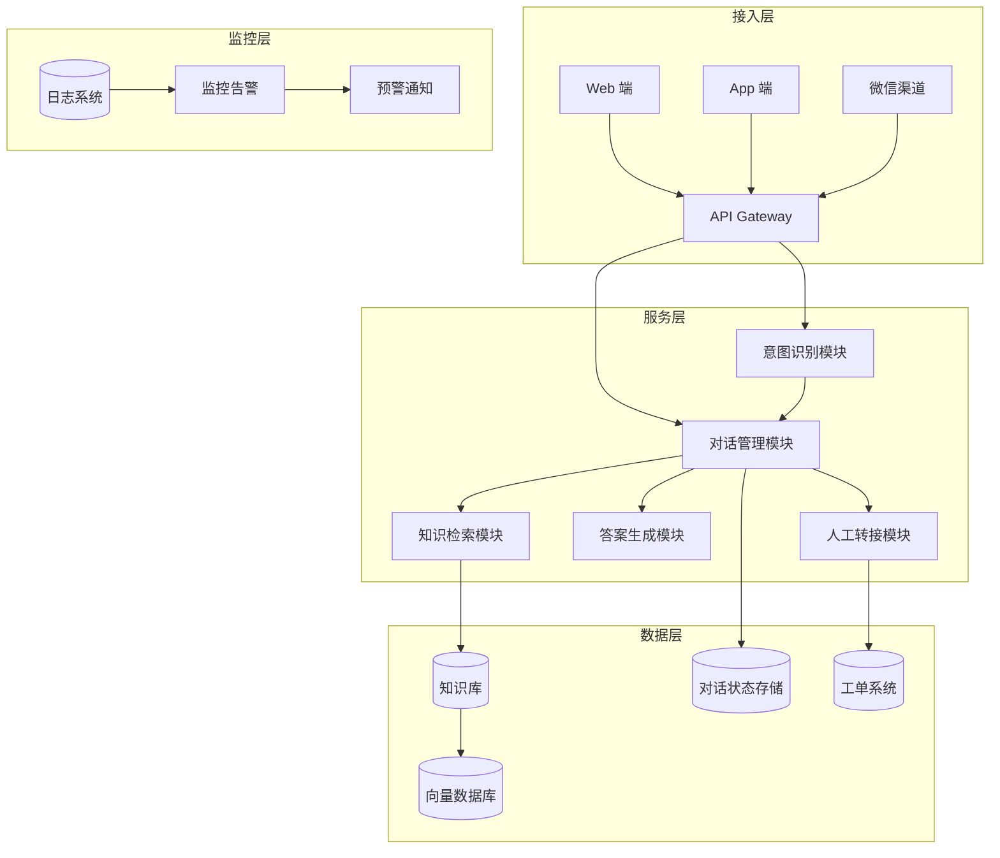
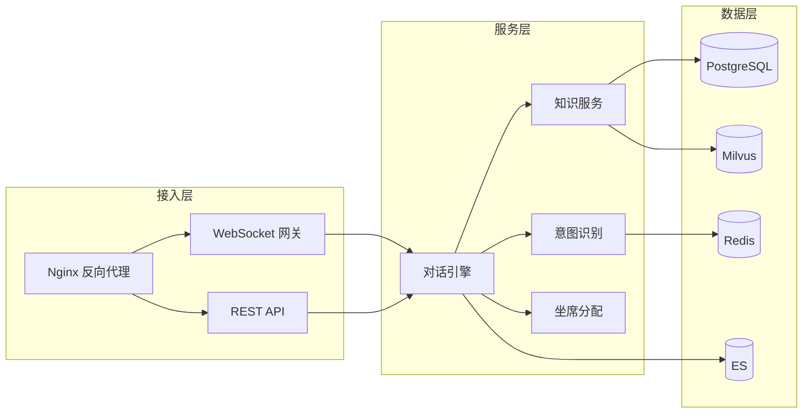
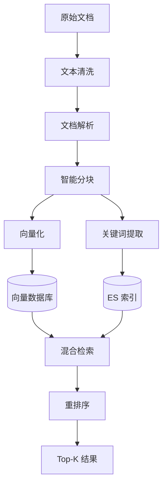
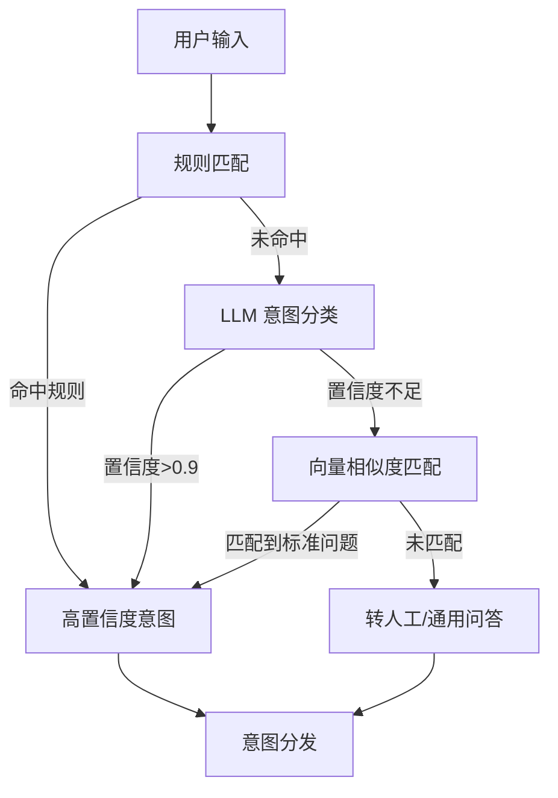
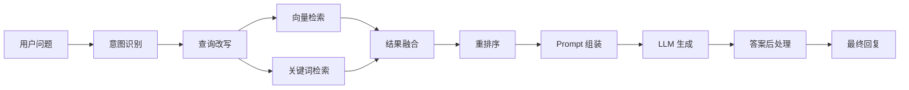

# 第1章 · 智能客服系统 — 多轮对话与知识库融合

> **时长**：约 5 小时 ｜ **难度**：⭐⭐⭐ ｜ **类型**：项目实战
>
> **目标**：从零搭建一个生产可用的智能客服系统，融合多轮对话、知识库检索与人工转接机制

---

## 学习目标

学完本章后，你将能够：
- 设计并实现多轮对话系统的整体架构
- 构建企业级知识库，完成知识的清洗、分块与向量化存储
- 实现意图识别与槽位填充的核心对话逻辑
- 设计人工转接机制，实现人机协作的无缝切换
- 掌握 FastAPI 后端服务与 React 前端的完整开发流程

---

## 知识地图



---

# 第一部分：需求分析与架构设计

## 1、需求分析

### 1.1 业务场景

智能客服在企业中有三个核心应用场景：

**售前咨询**：解答产品功能、价格方案、购买流程等问题，引导用户完成转化。这类场景要求回答准确且具有引导性。

**售后服务**：处理退换货、投诉、账户问题等售后诉求。需要与工单系统打通，记录用户信息与问题描述。

**技术支持**：解答 API 接入、故障排查、配置指导等技术问题。需要实时获取最新的技术文档和更新日志。

### 1.2 功能需求

| 功能模块 | 需求描述 | 优先级 |
|---------|---------|-------|
| 自动问答 | 用户提问后自动匹配知识库并生成答案 | P0 |
| 知识库检索 | 支持 FAQ、产品手册、技术文档的检索 | P0 |
| 多轮对话 | 支持上下文理解，多轮交互后完成意图确认 | P0 |
| 工单创建 | 自动或人工创建工单，流转到后端处理 | P1 |
| 人工转接 | 当自动服务无法满足时转接人工坐席 | P1 |
| 评价反馈 | 用户对回答进行评价，持续优化 | P2 |

### 1.3 非功能需求

```
响应时间：自动问答 < 3s（P95）
准确率：   首答准确率 > 85%
可用性：   SLA > 99.9%（月故障 < 43 分钟）
并发支持：支持 1000 并发同时对话
安全要求：敏感信息脱敏，对话日志审计
```

---

## 2、架构设计

### 2.1 整体架构

**核心定位**：采用微服务架构，将智能客服拆分为接入层、服务层和数据层三个层次，各层通过 API 解耦，支持独立扩展。



### 2.2 核心组件

**概念定义**：

- **意图识别模块**：分析用户输入，判断用户的真实意图类别（退货、咨询价格、故障报修等）。支持预定义规则分类和 LLM 分类两种模式。
- **对话管理模块**：维护对话状态（当前意图、已填槽位、对话轮次），决定下一轮对话策略。
- **知识检索模块**：根据意图和关键词从知识库中检索最相关的内容，支持向量检索和关键词检索的混合策略。
- **答案生成模块**：将检索到的知识片段作为上下文，结合对话历史，由 LLM 生成自然流畅的回复。
- **人工转接模块**：监控对话质量，在必要时触发生成坐席工单，将上下文完整传递给人工坐席。

### 2.3 技术选型

| 组件 | 技术选型 | 选型理由 |
|------|---------|---------|
| 后端框架 | FastAPI + Python 3.11 | 异步原生支持，性能优异，生态丰富 |
| 前端框架 | React 18 + TypeScript | 组件化开发，社区活跃 |
| 向量数据库 | Milvus | 支持十亿级向量检索，企业级部署 |
| 关系数据库 | PostgreSQL + pgvector | 结构化数据存储+向量检索双重能力 |
| 缓存 | Redis | 对话状态实时存储，会话超时管理 |
| 搜索引擎 | Elasticsearch | 关键词全文检索，弥补向量检索的不足 |
| LLM | DeepSeek / GPT-4 | 根据成本和精度要求混合使用 |

---

# 第二部分：知识库构建

## 3、知识库构建

### 3.1 知识来源

企业知识库的知识来源通常包括：

- **FAQ 文档**：最常被问到的"标准问题+标准答案"对，结构清晰，匹配准确率最高。
- **产品手册**：包含详细的产品规格、使用说明和注意事项，文本较长需要合理分块。
- **历史对话**：从过去的人工客服对话中提炼高频问题和优质回答，是知识回流的宝贵来源。

### 3.2 知识处理管线

**概念定义**：知识处理管线是将原始文档转化为可检索知识单元的一系列处理步骤，包括清洗、分块、向量化和索引。



**关键策略**：

**分块策略**：采用语义分块而非固定长度分块。使用递归字符分割器，以段落为单位，块大小 512 tokens，重叠 128 tokens。对于 Markdown 文档，保留标题层级作为元数据，支持按标题检索。

```python
# 分块策略示例
from langchain.text_splitter import RecursiveCharacterTextSplitter

text_splitter = RecursiveCharacterTextSplitter(
    chunk_size=512,
    chunk_overlap=128,
    separators=["\n\n", "\n", "。", ".", " "],
    length_function=len,
)
```

### 3.3 知识更新机制

**核心定位**：知识库不能"一次构建，永久使用"。业务变更、产品迭代都会导致知识过期，必须建立持续更新机制。

- **定时全量更新**：每天凌晨低峰期，全量重新构建知识索引。
- **实时增量更新**：文档编辑后立即触发对应知识片的重新索引。
- **过期知识自动标记**：对超过 90 天未访问的知识标记为"冷知识"，人工确认是否保留。

---

# 第三部分：核心功能实现

## 4、对话流程实现

### 4.1 意图识别

**概念定义**：意图识别是 NLP 的基础任务，将用户输入映射到预定义的意图类别。智能客服系统采用"规则兜底 + LLM 分类 + 向量匹配"三级策略。



**三级策略说明**：

1. **规则匹配**：关键词正则匹配，毫秒级响应，适合"退换货""人工"等明确意图。
2. **LLM 分类**：将用户输入和历史对话送往 LLM，输出意图类别。准确率高但延迟较大。
3. **向量匹配**：将用户输入与 FAQ 标准问题进行向量相似度匹配，作为兜底方案。

### 4.2 槽位填充

**概念定义**：槽位填充是从对话中提取关键信息的过程。例如退货意图需要提取"订单号""退货原因""商品名称"等槽位。

```python
# 槽位定义示例
INTENT_SLOTS = {
    "退货": {
        "required": ["订单号", "退货原因"],
        "optional": ["商品名称", "购买日期"],
        "validation": {
            "订单号": r"ORD\d{10}",
        }
    },
    "价格咨询": {
        "required": ["商品名称"],
        "optional": ["数量", "地区"],
    }
}
```

多轮对话的关键在于：用户不会在一句话里给出所有信息。系统需要追踪已填和未填的槽位，主动追问缺失信息。

### 4.3 对话状态管理

**核心定位**：对话状态管理是多轮对话的核心组件，它维护每个会话的完整上下文，包括当前意图、已填槽位、对话历史和系统内部状态。

使用 Redis 存储对话状态，以 `session_id` 为 key，数据结构为：

```json
{
  "session_id": "abc123",
  "intent": "退货",
  "slots": {
    "订单号": "ORD20241201001",
    "退货原因": null,
    "商品名称": null
  },
  "history": [
    {"role": "user", "content": "我要退货"},
    {"role": "assistant", "content": "好的，请提供您的订单号"}
  ],
  "turn_count": 2,
  "created_at": "2024-12-01T10:00:00Z"
}
```

### 4.4 RAG 检索生成

**概念定义**：RAG（Retrieval-Augmented Generation）通过检索外部知识库来增强 LLM 的回答质量，是解决 LLM 幻觉问题的核心技术手段。



**查询改写**：对于多轮对话，用户的问题往往依赖于上下文。例如用户问"它的价格是多少"，需要结合历史确定"它"指代的产品。

```python
# 查询改写提示词
QUERY_REWRITE_PROMPT = """
基于对话历史，将用户的最新问题改写为独立的自包含问题。

对话历史：
{history}

用户最新问题：{question}

改写后的独立问题：
"""
```

### 4.5 答案后处理

答案后处理保证回复质量：
1. **答案验证**：检查答案是否包含知识库未提供的虚构信息
2. **来源引用**：在答案末尾注明信息来源（文档名、章节）
3. **格式美化**：将纯文本转换为 Markdown 格式（列表、表格等）
4. **敏感词过滤**：过滤不当内容，确保合规

---

## 5、人工转接

### 5.1 转接触发条件

**核心定位**：人工转接是智能客服的最后防线。优秀的转接策略能最大限度平衡自动化率和用户体验。

触发转接的四种情况：

| 条件 | 判断依据 | 优先级 |
|------|---------|-------|
| 用户主动请求 | 用户输入"人工""转人工""转接"等关键词 | 最高 |
| 置信度过低 | 连续 3 轮回答置信度低于 60% | 高 |
| 敏感问题 | 涉及投诉、法律、安全等敏感话题 | 高 |
| 用户情绪异常 | 识别到愤怒、失望等负面情绪 | 中 |

### 5.2 上下文传递

转接时，系统需要将完整对话上下文传递给人工坐席：

```json
{
  "session_id": "abc123",
  "customer_info": {"name": "张三", "level": "VIP"},
  "conversation_history": [...],
  "current_intent": "退货",
  "extracted_info": {"订单号": "ORD20241201001"},
  "failed_attempts": 3,
  "recommended_action": "审核退货申请"
}
```

### 5.3 坐席分配策略

**概念定义**：坐席分配策略决定哪位人工客服来接待用户。合理的分配策略能提升坐席效率和用户满意度。

- **技能匹配**：技术问题分配给技术组，售后问题分配给售后组
- **负载均衡**：选择当前在线、空闲率最高的坐席
- **VIP 优先**：VIP 用户直接分配给金牌坐席
- **历史关联**：优先分配给之前服务过该用户的坐席

### 5.4 人机协作

转接后，AI 并未退出。系统继续监听对话，为坐席提供实时建议——推荐回复话术、知识库匹配结果、自动填写工单信息。这种"AI 辅助人工"模式比完全转接效率更高。

---

## 6、完整实现

### 6.1 后端服务

```python
# app/main.py — FastAPI 入口
from fastapi import FastAPI, WebSocket
from fastapi.middleware.cors import CORSMiddleware

app = FastAPI(title="智能客服系统")

app.add_middleware(
    CORSMiddleware,
    allow_origins=["*"],
    allow_credentials=True,
    allow_methods=["*"],
    allow_headers=["*"],
)

@app.websocket("/ws/chat/{session_id}")
async def chat_websocket(websocket: WebSocket, session_id: str):
    await websocket.accept()
    dialog_engine = DialogEngine(session_id)
    while True:
        data = await websocket.receive_text()
        response = await dialog_engine.process(data)
        await websocket.send_json(response)
```

### 6.2 项目目录结构

```
customer-service/
├── app/
│   ├── main.py              # FastAPI 入口
│   ├── config.py            # 配置管理
│   ├── engine/
│   │   ├── dialog.py        # 对话引擎
│   │   ├── intent.py        # 意图识别
│   │   └── slots.py         # 槽位管理
│   ├── knowledge/
│   │   ├── retriever.py     # 知识检索
│   │   ├── chunker.py       # 文档分块
│   │   └── indexer.py       # 索引管理
│   ├── agent/
│   │   └── human_handoff.py # 人工转接
│   ├── models/
│   │   └── schemas.py       # 数据模型
│   └── store/
│       ├── redis_store.py   # Redis 状态存储
│       └── pg_store.py      # PostgreSQL 持久化
├── frontend/
│   ├── src/
│   │   ├── components/      # React 组件
│   │   └── pages/           # 页面
│   └── package.json
├── admin/
│   └── ...                  # 管理后台
└── deploy/
    ├── docker-compose.yml
    └── nginx.conf
```

### 6.3 部署架构

使用 Docker Compose 进行多服务编排，核心服务包括：FastAPI 应用服务（3 副本）、Redis、PostgreSQL、Milvus、Elasticsearch，前端通过 Nginx 反向代理到后端 WebSocket。

---

## 常见踩坑

1. **对话上下文内存泄漏**：Redis 中的对话状态需要设置 TTL（建议 30 分钟无活动自动清理），否则长期会话会累积大量历史数据，拖慢检索和生成速度。
2. **知识库分块不合理**：块大小太大会混入无关信息降低检索精度，太小会丢失上下文。需要根据文档类型动态调整分块策略，技术文档和 FAQ 使用不同的参数。
3. **多轮查询改写失效**：用户说"那这个呢""还有别的吗"等指代不明确的问题时，查询改写可能失败。需要设计兜底提示词，让 LLM 主动反问澄清。
4. **人工转接乒乓效应**：用户反复被转接，或者坐席频繁转回 AI。需要设定转接冷却期（同一会话 5 分钟内不重复转接）和坐席确认机制。
5. **流式输出与服务端稳定性**：WebSocket 长连接在服务重启时会断开。需要实现客户端自动重连和服务端优雅断连，避免连接泄露。

---

## 课后练习

1. 设计并实现一个"意图识别+槽位填充"的完整对话流程，涵盖至少 3 种意图（退货、咨询、投诉），每个意图至少 2 个必填槽位。
2. 搭建 PostgreSQL + pgvector 的向量检索环境，导入一份 FAQ 数据（>100 条），对比向量检索与关键词检索的召回率差异。
3. 实现 WebSocket 双向通信的客服对话界面，支持用户发送消息、接收流式回复、查看知识来源引用。
4. 设计人工转接的坐席分配算法（技能匹配+负载均衡），并用 Python 模拟 100 个请求测试分配效果。

---

## 本节小结

- ✅ 完成了智能客服系统的需求分析与架构设计
- ✅ 掌握了知识库构建的完整流程：清洗、分块、向量化、索引
- ✅ 实现了三级意图识别策略（规则+LLM+向量匹配）
- ✅ 掌握了多轮对话的状态管理、槽位填充和查询改写
- ✅ 设计了人工转接机制，实现人机协作的无缝切换
- ✅ 采用 FastAPI + React + Milvus + Redis 构建了完整项目

---

> **下一章**：第2章 · 企业知识问答平台 — 多文档类型的 RAG 实践
