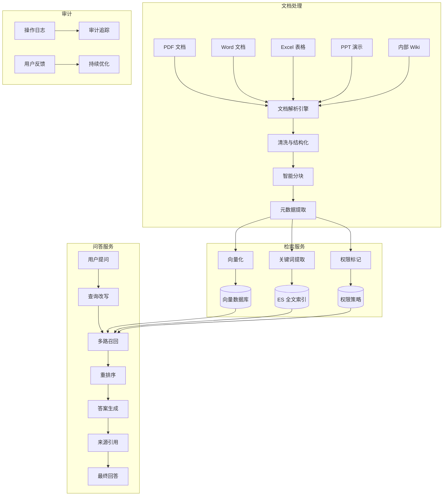
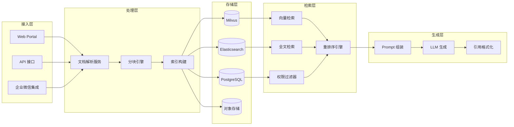
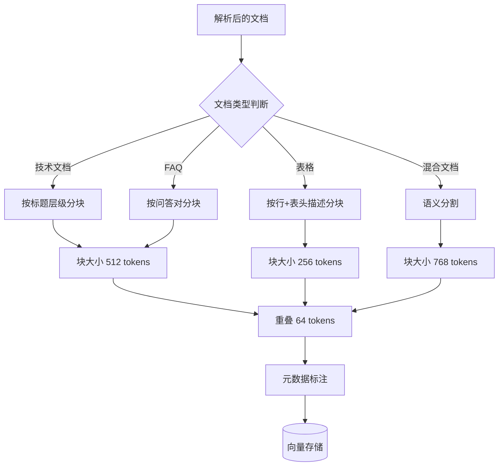

# 第2章 · 企业知识问答平台 — 多文档类型的 RAG 实践

> **时长**：约 5 小时 ｜ **难度**：⭐⭐⭐ ｜ **类型**：项目实战
>
> **目标**：构建企业级知识问答平台，支持多文档类型解析、权限控制的 RAG 检索，以及完整的答案溯源机制

---

## 学习目标

学完本章后，你将能够：
- 设计支持多文档类型（PDF、Word、Excel、PPT）的文档处理管线
- 实现智能分块策略，兼顾语义完整性和检索精度
- 构建多路召回 + 重排序的检索体系
- 设计基于 RBAC 的文档级权限控制模型
- 实现答案溯源，确保每一条回答都有据可查
- 掌握企业级 RAG 系统的性能优化与部署方案

---

## 知识地图



---

# 第一部分：需求分析与架构设计

## 1、需求分析

### 1.1 业务场景

企业内部知识问答平台服务于三大场景：

**内部知识查询**：员工查询公司制度、流程规范、通讯录等信息。要求快速准确，且能根据员工部门展示不同内容。例如财务人员看到的报销制度比研发人员更详细。

**政策制度咨询**：HR 政策和合规制度的问答。这类场景对答案的权威性要求极高，必须精确引用政策原文，不能有歧义。

**技术文档检索**：开发团队查询 API 文档、架构设计文档、运维手册。支持代码片段的索引和搜索，对技术术语的召回率有较高要求。

### 1.2 文档类型与处理策略

| 文档类型 | 处理难度 | 核心策略 |
|---------|---------|---------|
| Word (.docx) | 低 | python-docx 提取段落文本，保留标题层级 |
| PDF | 高 | PyMuPDF 提取文本+表格，OCR 处理扫描件 |
| Excel (.xlsx) | 中 | openpyxl 提取，按行/Sheet 组织上下文 |
| PPT (.pptx) | 中 | python-pptx 提取幻灯片备注和正文 |
| 内部 Wiki | 低 | Markdown 解析，直接保留结构 |

### 1.3 特殊要求

```
权限控制：
  - 文档级权限：不同部门只能看到归属本部门的文档
  - 部门隔离：市场部不能查看技术部的文档
  - 敏感内容过滤：包含"机密"标签的内容需要特殊授权

答案溯源：
  - 每一条答案必须标注引用的文档名称和段落位置
  - 支持用户点击引用跳转到原文高亮位置
  - 展示检索置信度分数，帮助用户判断答案可靠性

审计日志：
  - 记录每一次提问、检索、查看原文的操作
  - 支持审计追踪：谁、什么时间、查了什么内容
  - 日志不可篡改，保留周期不少于 180 天
```

---

## 2、架构设计

### 2.1 系统架构

**核心定位**：采用"文档处理管线 + 多路召回检索 + 权限过滤 + 答案生成"的四层架构，每层职责清晰，可独立扩展。



### 2.2 权限模型

**概念定义**：RBAC（Role-Based Access Control，基于角色的访问控制）通过"用户-角色-权限"三级关联管理访问权限。

```python
# 权限检查逻辑
class DocumentPermission:
    def __init__(self):
        self.doc_dept_map = {}    # 文档ID -> 部门列表
        self.doc_level_map = {}   # 文档ID -> 密级

    def can_access(self, user, doc_id):
        # 1. 管理员放行
        if user.role == "admin":
            return True

        # 2. 文档是否需要部门权限
        allowed_depts = self.doc_dept_map.get(doc_id, [])
        if allowed_depts and user.dept not in allowed_depts:
            return False

        # 3. 文档密级是否超过用户的授权等级
        doc_level = self.doc_level_map.get(doc_id, "公开")
        if LEVEL_MAP[doc_level] > LEVEL_MAP[user.max_level]:
            return False

        return True
```

### 2.3 技术选型

| 组件 | 技术选型 | 选型理由 |
|------|---------|---------|
| 文档解析 | PyMuPDF + python-docx + openpyxl | 生态成熟，支持格式全面 |
| OCR | PaddleOCR | 中文识别率高，支持表格还原 |
| 分块策略 | LangChain RecursiveCharacter + 自定义语义分割 | 兼顾语义完整和检索精度 |
| 向量数据库 | Milvus | 支持标量过滤（权限+部门），混合检索 |
| 全文检索 | Elasticsearch | 精准关键词匹配，弥补向量检索的模糊性 |
| 重排序 | BGE-Reranker | 业界领先的交叉编码器重排序模型 |
| Embedding | bge-large-zh-v1.5 | 中文语义理解优秀，1024 维向量 |
| 对象存储 | MinIO | S3 兼容，存储原始文档用于预览 |

---

# 第二部分：文档处理管线

## 3、文档处理管线

### 3.1 文档解析

**概念定义**：文档解析是将不同格式的原始文件转换为统一的纯文本结构，同时提取元数据（标题、作者、创建时间、目录层级）的过程。

不同文档类型的解析策略截然不同：

```python
class DocumentParser:
    def parse(self, file_path: str, file_type: str) -> ParsedDocument:
        parsers = {
            "pdf": self._parse_pdf,
            "docx": self._parse_docx,
            "xlsx": self._parse_xlsx,
            "pptx": self._parse_pptx,
            "md": self._parse_markdown,
        }
        parser = parsers.get(file_type)
        if not parser:
            raise UnsupportedFormatError(file_type)
        return parser(file_path)

    def _parse_pdf(self, path: str) -> ParsedDocument:
        """PDF 解析：含表格提取和扫描件 OCR"""
        doc = fitz.open(path)
        pages = []
        for page_num, page in enumerate(doc):
            text = page.get_text()
            tables = self._extract_tables(page)  # 表格提取
            images = self._extract_images(page)   # 图片提取（用于 OCR）
            pages.append(PageContent(
                page_num=page_num + 1,
                text=text,
                tables=tables,
                images=images,
            ))
        return ParsedDocument(pages=pages)

    def _parse_xlsx(self, path: str) -> ParsedDocument:
        """Excel 解析：每个 Sheet 按行组织，表头与数据关联"""
        wb = load_workbook(path, data_only=True)
        sheets = []
        for sheet_name in wb.sheetnames:
            ws = wb[sheet_name]
            rows = []
            for row in ws.iter_rows(values_only=True):
                rows.append(list(row))
            sheets.append(SheetContent(name=sheet_name, rows=rows))
        return ParsedDocument(sheets=sheets)
```

### 3.2 智能分块

**核心定位**：分块策略直接影响 RAG 系统的检索精度。过小的分块丢失上下文，过大的分块混入噪声。智能分块需要保留原始的语义边界（段落、章节、表格）。



```python
# 语义分块示例——保留 Markdown 标题层级
class MarkdownAwareSplitter:
    def split(self, text: str, metadata: dict) -> list[Document]:
        chunks = []
        sections = self._split_by_headers(text)

        for section_title, section_content in sections:
            # 递归分割过长的段落
            if self._token_count(section_content) > MAX_CHUNK_SIZE:
                sub_chunks = self._split_long_section(section_content)
                for i, sub in enumerate(sub_chunks):
                    chunks.append(Document(
                        text=sub,
                        metadata={
                            **metadata,
                            "section": section_title,
                            "chunk_index": i,
                        }
                    ))
            else:
                chunks.append(Document(
                    text=section_content,
                    metadata={**metadata, "section": section_title}
                ))
        return chunks
```

### 3.3 元数据提取

每个 Chunk 携带丰富的元数据，用于后续的权限过滤和来源追溯：

```json
{
  "doc_id": "DOC-2024-001",
  "doc_name": "2024年度差旅报销制度.pdf",
  "section": "第三章 · 住宿标准",
  "page_range": [12, 15],
  "dept": "财务部",
  "security_level": "内部",
  "chunk_index": 3,
  "total_chunks": 8,
  "created_at": "2024-01-15",
  "updated_at": "2024-06-01"
}
```

### 3.4 增量更新

**概念定义**：增量更新指只更新发生变化的文档，而不是全量重建索引。对于企业知识库来说，日增量通常是全量的 5%~10%，增量更新能节省 90% 以上的计算资源。

- 文档上传/编辑时，触发对应文档的重新解析和索引
- 修改时间戳作为版本号，旧版本自动归档
- 变更通知发送到消息队列（RabbitMQ），异步处理

---

# 第三部分：检索与生成

## 4、检索与生成

### 4.1 多路召回

**概念定义**：多路召回是指同时使用多种检索策略获取候选结果，再通过重排序融合得到最佳结果。不同检索策略覆盖不同维度，互为补充。

| 检索方式 | 优势 | 劣势 | 适用场景 |
|---------|------|------|---------|
| 向量检索 | 语义理解强，能处理同义词 | 对精确匹配不敏感 | 开放性问题 |
| 关键词检索 | 精确匹配，召回率高 | 无法理解语义 | 专有名词、代码 |
| 权限过滤 | 保证数据安全 | 可能降低召回率 | 所有场景前置 |

**多路召回流程**：

```python
async def hybrid_retrieve(question: str, user: User, top_k: int = 10):
    # 1. 向量检索
    vector_results = await vector_store.similarity_search(
        question, k=top_k * 2
    )

    # 2. 关键词检索
    keyword_results = await es_search(
        question, k=top_k * 2
    )

    # 3. 融合去重（加权 RRF）
    fused = reciprocal_rank_fusion(
        [vector_results, keyword_results],
        weights=[0.6, 0.4]
    )

    # 4. 权限过滤
    permitted = [
        doc for doc in fused
        if permission_check(user, doc.metadata)
    ]

    # 5. 重排序
    reranked = await reranker.rerank(question, permitted[:20])

    return reranked[:top_k]
```

### 4.2 结果重排

**核心定位**：双编码器（向量检索）速度快但精度有限，交叉编码器（重排序）精度高但速度慢。将两者结合——先用向量检索粗筛 Top-50，再用交叉编码器精排取 Top-5，兼顾速度和精度。

```python
from sentence_transformers import CrossEncoder

reranker = CrossEncoder("BAAI/bge-reranker-v2-m3")

def rerank(query: str, candidates: list[Document]) -> list[Document]:
    pairs = [[query, doc.text] for doc in candidates]
    scores = reranker.predict(pairs)
    scored = list(zip(candidates, scores))
    scored.sort(key=lambda x: x[1], reverse=True)
    return [doc for doc, score in scored]
```

### 4.3 答案生成

**概念定义**：答案生成是 RAG 管线的最后一步，将检索到的知识片段组装到 Prompt 中，由 LLM 生成最终回答。关键在于 Prompt 的设计——既要给出充分上下文，又要约束 LLM 不要编造知识库中没有的信息。

```python
RAG_PROMPT = """你是一个企业知识问答助手。请根据提供的文档内容回答用户问题。

## 回答规则
1. 严格基于文档内容回答，不要编造信息
2. 如果文档内容不足以回答问题，请明确告知
3. 在回答中标注引用来源：[文档名称 - 章节]
4. 对于涉及多个文档的内容，综合回答并分别标注来源

## 文档内容
{context}

## 对话历史
{history}

## 用户问题
{question}

## 你的回答
"""
```

### 4.4 来源引用

**概念定义**：来源引用是答案可追溯性（Answer Traceability）的核心机制。通过引用标注，用户可以验证答案的真实性，也是企业合规审计的基础。

引用格式设计：

```
根据公司规定，2024年度一线城市住宿标准为 500元/天 [1]。

[1] 《2024年度差旅报销制度.pdf》第三章 第12页
      → 查看原文高亮
```

---

## 5、答案溯源

### 5.1 引用标注

系统在答案中的每个事实性陈述后插入引用标记，支持多来源交叉引用。引用标记关联到原始文档的具体段落和页码。

### 5.2 原文高亮

用户点击引用标记后，前端弹出文档预览窗口，自动滚动到对应位置并高亮引用段落。使用 MinIO 存储原始文档，前端使用 PDF.js 实现预览和高亮。

### 5.3 置信度展示

每个回答附带置信度分数（基于重排序分数和 LLM 自评估），帮助用户判断答案的可靠性。低于 60% 的答案提示"此为参考信息，建议进一步核实"。

### 5.4 反馈收集

在每个答案下方提供"有用/无用"按钮和反馈输入框。收集的反馈数据用于：
- **质量监控**：统计每个文档来源的准确率
- **模型改进**：低分答案作为微调数据
- **知识库优化**：频繁被标记"无用"的文档需要人工审核

---

## 6、完整实现

### 6.1 项目目录结构

```
knowledge-qa/
├── backend/
│   ├── app/
│   │   ├── main.py              # FastAPI 入口
│   │   ├── api/
│   │   │   ├── chat.py          # 问答接口
│   │   │   └── documents.py     # 文档管理接口
│   │   ├── core/
│   │   │   ├── parser/          # 文档解析器
│   │   │   ├── chunker/         # 分块引擎
│   │   │   └── embedder/        # 向量化
│   │   ├── retrieval/
│   │   │   ├── vector.py        # 向量检索
│   │   │   ├── keyword.py       # 关键词检索
│   │   │   ├── reranker.py      # 重排序
│   │   │   └── permission.py    # 权限过滤
│   │   ├── generation/
│   │   │   ├── prompt.py        # Prompt 模板
│   │   │   └── citation.py      # 引用格式化
│   │   └── models/
│   │       ├── user.py          # 用户模型
│   │       └── document.py      # 文档模型
│   └── tests/
├── frontend/
│   ├── src/
│   │   ├── pages/
│   │   │   ├── Search.tsx       # 问答页面
│   │   │   └── Document.tsx     # 文档管理
│   │   └── components/
│   │       ├── Citation.tsx     # 引用组件
│   │       └── Feedback.tsx     # 反馈组件
│   └── package.json
└── deploy/
    ├── docker-compose.yml
    └── config/
```

### 6.2 性能优化策略

1. **异步处理**：文档解析、向量化、索引构建使用 Celery 异步任务队列
2. **缓存热点**：高频问题的检索结果缓存到 Redis，TTL 设为 1 小时
3. **批量 Embedding**：向量化时合并多个片段为批次，利用 GPU 并行计算
4. **查询缓存**：相同或相似问题直接返回缓存结果，使用 SimHash 做相似度去重

---

## 常见踩坑

1. **PDF 表格解析丢失**：PDF 中的表格在文本提取阶段常被打乱（文字按坐标排列）。需要针对表格使用专门的表格提取工具（Camelot、Tabula），将表格转换为 Markdown 格式再索引。
2. **权限过滤导致零结果**：过于严格的权限策略可能导致检索结果为空。需要设计"降级策略"——当权限过滤后结果不足 3 条时，给用户提示"以下结果部分来自其他部门，仅供参考"并放宽过滤。
3. **混合检索 RRF 分数不均衡**：向量检索和关键词检索的分数不在同一量纲（0~1 vs 整数 TF-IDF 分）。需要先标准化再融合，或使用 RRF（倒数排序融合）规避分数尺度问题。
4. **文档更新后的缓存雪崩**：全量重建索引时，新旧索引切换瞬间可能导致大量请求打到数据库。使用双缓冲策略——新索引构建完成后再切换，构建期间旧索引正常服务。
5. **大文档的分块时效问题**：1000+ 页的超长文档分块后，检索时可能遗漏跨块的关键上下文。引入"段落扩展"策略——命中的块前后各扩展一个相邻块作为上下文。

---

## 课后练习

1. 使用 PyMuPDF 解析一份含表格和图片的 PDF 文档，分别提取文本、表格和图片，对比文本提取的完整性。
2. 实现混合检索（向量检索 + 关键词检索），使用 RRF 融合算法，对比单路检索和多路检索的 Recall@10 指标。
3. 设计并实现基于 RBAC 的文档级权限控制，模拟 3 个部门（技术、市场、财务）的文档隔离访问。
4. 搭建一个完整的 RAG 管线（文档上传 -> 解析 -> 分块 -> 索引 -> 检索 -> 生成），测量端到端的响应时间，找出瓶颈并优化。

---

## 本节小结

- ✅ 完成了多文档类型（PDF、Word、Excel、PPT）知识问答平台的需求分析
- ✅ 掌握了智能分块策略和文档元数据提取方法
- ✅ 实现了多路召回（向量+关键词+权限过滤）+ 重排序的高效检索体系
- ✅ 设计了 RBAC 权限模型，支持文档级和部门级的访问控制
- ✅ 实现了答案溯源机制，确保每条回答都有据可查
- ✅ 掌握了基于 Milvus + ES + BGE-Reranker 的企业级 RAG 架构

---

> **下一章**：第3章 · 代码助手开发 — AI 编程辅助工具
