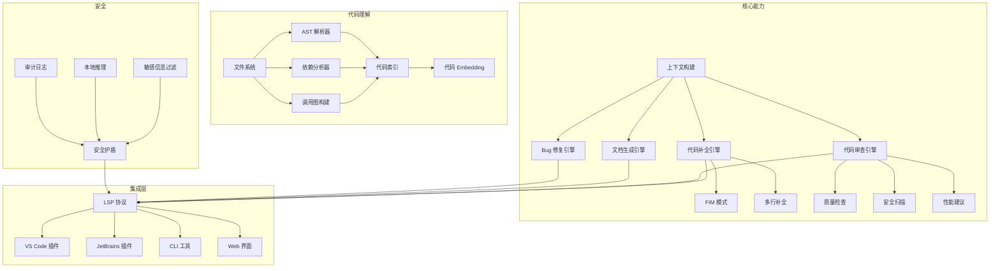
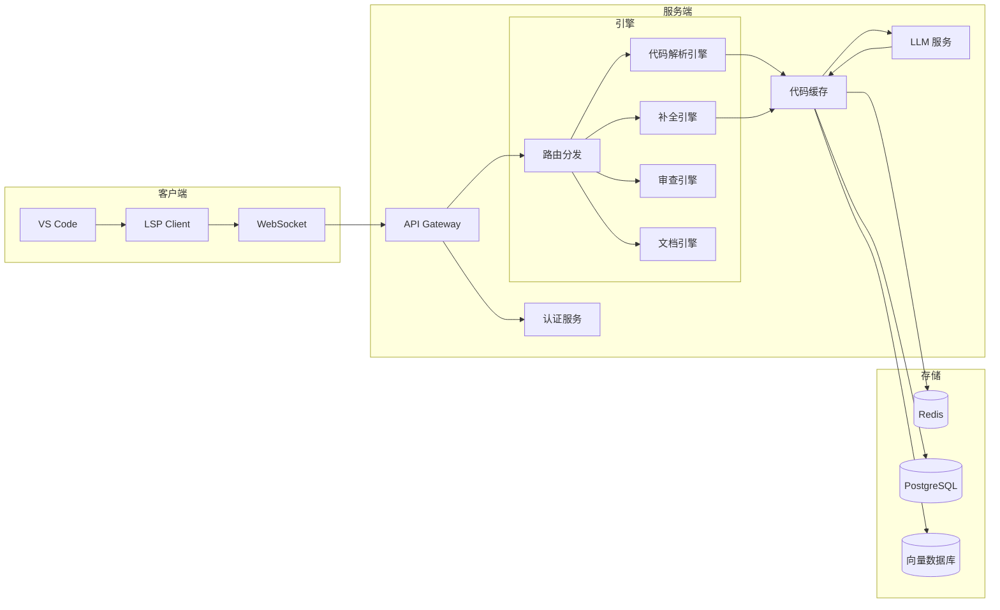
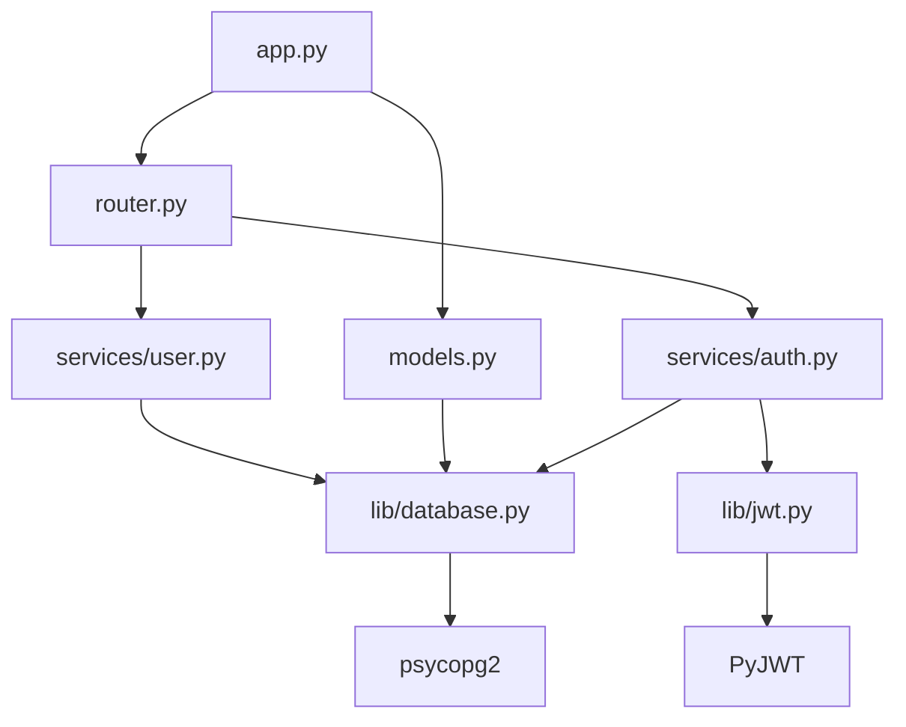
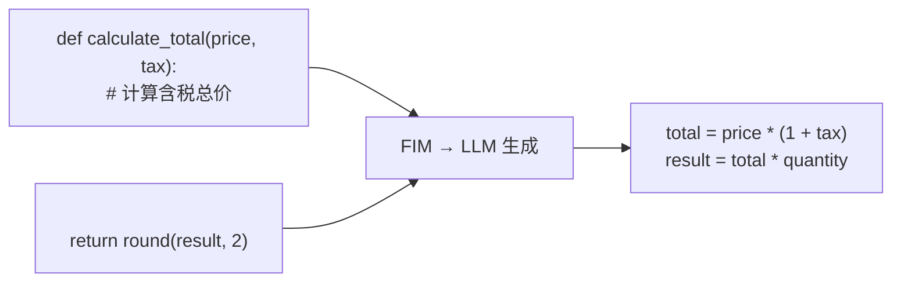

# 第3章 · 代码助手开发 — AI 编程辅助工具

> **时长**：约 5 小时 ｜ **难度**：⭐⭐⭐ ｜ **类型**：项目实战
>
> **目标**：开发一个生产可用的 AI 代码助手，支持代码补全、代码审查、文档生成，并通过 IDE 插件提供无缝体验

---

## 学习目标

学完本章后，你将能够：
- 掌握基于 AST 的代码解析技术与代码库索引方法
- 实现代码补全（行内补全、多行补全、FIM 模式）的核心逻辑
- 构建基于 LLM 的代码审查引擎，涵盖质量检查、安全扫描和性能建议
- 开发 VS Code 插件，实现与编辑器的深度集成
- 理解代码安全的关键防线：敏感信息过滤、本地推理、审计合规

---

## 知识地图



---

# 第一部分：需求分析与架构设计

## 1、需求分析

### 1.1 功能范围

AI 代码助手需要覆盖软件开发全流程的五个核心能力：

**代码补全**：开发者在编码时自动推荐下一段代码。包含行内补全（当前行补全）、多行补全（函数体/循环体）、FIM（Fill-in-the-Middle，在光标位置插入代码）。这是使用频率最高的功能，响应速度要求 < 500ms。

**代码解释**：选中一段代码，LLM 用自然语言解释其功能和逻辑。帮助新成员快速理解代码库，或在代码审查时降低理解成本。

**代码审查**：在 PR/MR 发起时自动审查代码变更。检查代码质量、潜在 Bug、安全漏洞、性能问题。给出改进建议和参考实现。

**文档生成**：根据代码签名、类型注解和上下文，自动生成函数注释、README 片段、变更日志。减少开发者编写文档的负担。

**Bug 修复**：当代码运行出错时，将错误堆栈和代码上下文发送给 LLM，分析根因并给出修复方案。

### 1.2 集成方式

| 集成方式 | 适用场景 | 开发成本 | 用户体验 |
|---------|---------|---------|---------|
| VS Code 插件 | 前端/全栈开发者 | 中 | 最佳 |
| JetBrains 插件 | Java/Kotlin 开发者 | 高 | 最佳 |
| CLI 工具 | 终端重度用户、CI/CD | 低 | 一般 |
| Web 界面 | 快速体验、项目管理 | 低 | 一般 |

**核心定位**：优先开发 VS Code 插件覆盖 70% 的开发者，再扩展 JetBrains 生态。CLI 工具用于 CI/CD 集成（如自动代码审查）。

### 1.3 非功能需求

```
响应时间：代码补全 < 500ms，代码审查 < 10s
准确率：  补全接受率 > 30%
并发支持：支持 500 并发请求
安全等级：所有代码数据加密传输，支持私有化部署
兼容性：  支持 Python、JavaScript/TypeScript、Java、Go 等主流语言
```

---

## 2、架构设计

### 2.1 整体架构



### 2.2 技术选型

| 组件 | 技术选型 | 选型理由 |
|------|---------|---------|
| 插件框架 | VS Code Extension API | 市场占有率最高，API 成熟 |
| LSP | LSP 3.17 协议 | 统一语言服务协议，多编辑器兼容 |
| 代码解析 | tree-sitter | 语法完备的 AST 解析器，支持 40+ 语言 |
| 补全模型 | DeepSeek Coder / StarCoder2 | 专为代码生成优化的开源模型 |
| 嵌入模型 | codebert / unixcoder | 代码语义向量化 |
| 后端 | FastAPI + Python | 异步高性能，LLM 生态丰富 |
| 流式通信 | Server-Sent Events | 补全结果逐 token 推送 |

---

# 第二部分：代码理解与生成

## 3、代码理解

### 3.1 AST 分析

**概念定义**：AST（Abstract Syntax Tree，抽象语法树）是源代码的树状结构化表示。每个节点代表代码中的一个构造（函数定义、变量声明、表达式等）。AST 分析能让代码助手理解代码的结构而非文本。

```python
# 使用 tree-sitter 解析 Python 代码
from tree_sitter import Language, Parser

PY_LANGUAGE = Language("build/my-languages.so", "python")
parser = Parser()
parser.set_language(PY_LANGUAGE)

def extract_functions(source_code: str) -> list[dict]:
    tree = parser.parse(bytes(source_code, "utf8"))
    functions = []

    def traverse(node):
        if node.type == "function_definition":
            name_node = node.child_by_field_name("name")
            body_node = node.child_by_field_name("body")
            functions.append({
                "name": source_code[name_node.start_byte:name_node.end_byte],
                "start_line": node.start_point[0] + 1,
                "end_line": node.end_point[0] + 1,
                "body": source_code[body_node.start_byte:body_node.end_byte],
            })
        for child in node.children:
            traverse(child)

    traverse(tree.root_node)
    return functions
```

### 3.2 依赖分析与调用图

**概念定义**：依赖分析帮助代码助手理解"这个函数用了哪些外部包""这个模块依赖哪些其他模块"。调用图则展示函数之间的调用关系，是理解和生成代码的关键上下文。



调用图在代码补全中的作用：当用户在一个 API 路由函数中编码时，上下文应包括该路由调用的服务函数签名、数据库模型定义和常用工具方法。

### 3.3 代码 Embedding

**核心定位**：代码 Embedding 将代码片段映射到向量空间。相似的代码在向量空间中距离近，用于实现"相似代码推荐""基于语义的代码搜索"。

```python
from sentence_transformers import SentenceTransformer

code_encoder = SentenceTransformer("microsoft/codebert-base")

def embed_function(func: dict) -> list[float]:
    # 将函数名、签名、注释和主体拼接编码
    text = f"{func['name']}\n{func['signature']}\n{func['docstring']}\n{func['body'][:512]}"
    return code_encoder.encode(text).tolist()
```

### 3.4 上下文构建

**概念定义**：上下文构建是代码补全中最关键也最困难的部分。系统需要决定哪些代码片段放入 LLM 的上下文窗口，在"信息充分"和"窗口限制"之间做平衡。

上下文构建策略：

| 上下文来源 | 提取方式 | 优先级 | Token 预算 |
|-----------|---------|-------|-----------|
| 当前文件 | 光标前后代码 | 最高 | 4K |
| 同语言文件 | 最近编辑的 3 个文件 | 高 | 2K |
| 相关函数定义 | 当前文件的导入链 | 中 | 2K |
| 类型定义 | 用到的类/接口定义 | 中 | 1K |
| 项目配置 | package.json/pyproject.toml | 低 | 0.5K |
| 最近编辑历史 | 最近的 5 次编辑差异 | 低 | 0.5K |

---

## 4、代码生成

### 4.1 代码补全

**概念定义**：FIM（Fill-in-the-Middle）是代码补全的核心技术。将光标前的代码作为前缀（prefix），光标后的代码作为后缀（suffix），LLM 输出中间缺失的代码。



**行内补全**：用户输入时实时触发，延迟需 < 200ms。使用专用的小模型（如 StarCoderBase-1B）以满足速度要求。

**多行补全**：用户按 Tab 接受行内补全后，可继续请求后续行。用大模型（DeepSeek Coder-6.7B）生成完整函数体或代码块。

### 4.2 函数生成

用户输入注释或函数名后，自动生成完整函数实现。例如用户输入 `# 计算两个日期之间的工作日天数`，系统自动生成：

```python
def count_workdays(start_date: datetime, end_date: datetime) -> int:
    """计算两个日期之间的工作日天数（排除周末）"""
    count = 0
    current = start_date
    while current <= end_date:
        if current.weekday() < 5:  # 周一到周五
            count += 1
        current += timedelta(days=1)
    return count
```

### 4.3 单元测试生成

**核心定位**：单元测试是开发中最容易被忽视但最耗时的环节。AI 生成单元测试能显著提升代码质量和开发效率。

```python
TEST_GEN_PROMPT = """为以下函数生成 pytest 单元测试：

## 函数代码
```python
{function_code}
```

## 生成要求
1. 覆盖所有分支（正常路径、边界条件、异常路径）
2. 使用 pytest 框架
3. 包含参数化测试
4. Mock 外部依赖

## 测试代码
"""
```

### 4.4 文档生成

通过函数签名、类型注解和实现代码，自动生成符合 Google/NumPy 风格的文档字符串：

```python
def auto_docstring(func_code: str) -> str:
    """自动根据代码生成文档字符串"""
    # ...解析 AST 提取参数和返回类型...
    # ...分析函数体理解逻辑...
    # ...生成符合规范的 docstring...
    pass
```

---

## 5、代码审查

### 5.1 代码质量检查

代码审查引擎在 PR 提交时自动执行，检查以下维度：

| 维度 | 检查项 | 严重程度 |
|------|-------|---------|
| 代码风格 | 命名规范、缩进、过长函数 | 建议 |
| 代码复用 | 重复代码检测 | 建议 |
| 复杂度 | 圈复杂度 > 10 的函数需重构 | 重要 |
| 异常处理 | 缺少 try-except、裸 except | 重要 |
| 资源泄漏 | 文件未关闭、连接未释放 | 严重 |

### 5.2 安全漏洞扫描

**概念定义**：AI 代码助手可以检测常见的安全漏洞模式，包括 SQL 注入、XSS、路径遍历、命令注入、敏感信息硬编码等。

```python
SECURITY_PATTERNS = [
    (r"eval\(.*\)", "高危", "不要使用 eval()，存在代码注入风险"),
    (r"exec\(.*\)", "高危", "不要使用 exec()，存在代码注入风险"),
    (r"subprocess\.call\(.*shell=True", "高危", "shell=True 存在命令注入风险"),
    (r"os\.system\(.*\)", "高危", "os.system() 存在命令注入风险，建议使用 subprocess"),
    (r"""password\s*=\s*["'][^"']+["']""", "高危", "密码不应硬编码在代码中，建议使用环境变量"),
]
```

### 5.3 性能建议

分析代码中的性能瓶颈并给出优化建议：

```python
# ❌ 低效写法
result = []
for item in large_list:
    if item.status == "active":
        result.append(process(item))

# ✅ 优化建议
result = [process(item) for item in large_list if item.status == "active"]
# 或用 multiprocessing 并行处理
```

### 5.4 重构建议

基于设计模式和最佳实践，为大函数和复杂逻辑提供重构方案：

- 抽取公共逻辑为独立函数/类
- 推荐策略模式替代长 if-elif 链
- 推荐依赖注入替代硬编码依赖

---

## 6、IDE 集成

### 6.1 VS Code 插件开发

**概念定义**：VS Code 插件通过 Extension API 扩展编辑器功能。代码助手插件通过 `InlineCompletionItemProvider` 提供行内补全，通过 `CodeActionProvider` 提供代码操作。

```typescript
// extension.ts — VS Code 插件入口
import * as vscode from "vscode";

export function activate(context: vscode.ExtensionContext) {
  // 注册行内补全提供者
  vscode.languages.registerInlineCompletionItemProvider(
    { pattern: "**" },  // 所有文件
    new CodeAssistantProvider()
  );

  // 注册命令
  context.subscriptions.push(
    vscode.commands.registerCommand(
      "code-assistant.explain",
      explainCodeHandler
    )
  );
}

class CodeAssistantProvider implements vscode.InlineCompletionItemProvider {
  async provideInlineCompletionItems(
    document: vscode.TextDocument,
    position: vscode.Position,
    context: vscode.InlineCompletionContext,
    token: vscode.CancellationToken
  ): Promise<vscode.InlineCompletionItem[]> {
    const textBeforeCursor = document.getText(
      new vscode.Range(position.with(undefined, 0), position)
    );
    const textAfterCursor = document.getText(
      new vscode.Range(position, document.lineAt(position.line).range.end)
    );

    // 调用服务器 API 获取补全
    const completion = await fetchCompletion(
      document.languageId,
      textBeforeCursor,
      textAfterCursor,
      token
    );

    return [new vscode.InlineCompletionItem(completion)];
  }
}
```

### 6.2 LSP 协议集成

**核心定位**：LSP（Language Server Protocol）是编辑器与语言服务之间的标准协议。通过 LSP 集成，代码助手一次开发即可支持所有 LSP 兼容的编辑器（VS Code、Neovim、Sublime Text 等）。

### 6.3 快捷键设计

| 快捷键 | 功能 | 说明 |
|-------|------|------|
| Tab | 接受补全 | 最常用操作 |
| Esc | 拒绝补全 | 关闭当前建议 |
| Ctrl+Space | 手动触发补全 | 未自动弹出时使用 |
| Ctrl+. | 代码操作菜单 | 解释、重构、生成测试 |

---

## 7、安全考虑

### 7.1 代码泄露风险

**核心定位**：代码是最核心的企业知识产权。代码助手必须严格防止代码泄露，无论是通过网络传输还是模型训练。

### 7.2 敏感信息过滤

所有发送到服务端的代码经过多层过滤：

```python
class CodeSanitizer:
    def sanitize(self, code: str) -> tuple[str, list[str]]:
        """过滤敏感信息，返回脱敏代码和警告列表"""
        warnings = []

        # 1. 替换 API Key / Token
        code, count = re.subn(
            r'(api_key|token|secret|password)\s*[=:]\s*["\'][^"\']+["\']',
            r'\1 = "***REDACTED***"',
            code
        )
        if count:
            warnings.append(f"检测到 {count} 处密钥硬编码")

        # 2. 替换内网 IP
        code, count = re.subn(
            r'\b(10\.\d{1,3}\.\d{1,3}\.\d{1,3}|172\.(1[6-9]|2\d|3[01])\.\d{1,3}\.\d{1,3}|192\.168\.\d{1,3}\.\d{1,3})\b',
            "***INTERNAL_IP***",
            code
        )
        # ...
        return code, warnings
```

### 7.3 本地推理方案

对于高安全要求的企业，支持纯本地部署方案：

- 使用 Ollama + CodeQwen 或 DeepSeek Coder 本地运行
- CPU 推理 + INT4 量化，16GB 内存即可运行 7B 模型
- 数据完全不离开用户机器

### 7.4 审计与合规

- 所有补全请求和响应记录日志，保留 90 天
- 支持审计接口，企业管理员可查询指定文件的 AI 补全历史
- 生成代码时在文件头部添加 "Generated by AI Code Assistant" 注释

---

## 常见踩坑

1. **补全上下文过大导致延迟飙升**：将所有代码塞入上下文会导致 LLM 处理时间暴增。必须实现智能上下文裁剪策略，优先保留光标附近和导入相关的代码，总 Token 控制在 8K 以内。
2. **FIM 模式不支持所有模型**：许多通用模型没有经过 FIM 训练，直接使用 FIM 格式会导致胡言乱语。确保使用经过 FIM 微调的代码专用模型（DeepSeek Coder、StarCoder）。
3. **插件内存泄漏**：VS Code 插件长期运行后内存占用持续增长。需要定期清理缓存、限制监听文件数、对大型项目使用按需索引而非全量扫描。
4. **代码审查误报率过高**：LLM 对代码审查可能产生误报，导致开发者信任崩塌。引入"严重级别"分级制度，严重问题直接标注，建议性问题标注"仅供参考"。
5. **敏感信息过滤漏网**：正则模式无法覆盖所有敏感信息变种。增加部署后监控——统计频繁被过滤的代码模式，不断更新过滤规则。

---

## 课后练习

1. 使用 tree-sitter 解析一个 Python 文件，提取所有函数定义、类定义和导入语句，输出为 JSON 格式的结构化索引。
2. 实现一个 FIM 格式的代码补全功能，接收 prefix 和 suffix，调用 LLM 生成中间代码。分别用通用模型和代码专用模型测试效果差异。
3. 开发一个 VS Code 插件的最小原型，实现行内代码补全（`InlineCompletionItemProvider`），在输入特定触发词时弹出补全建议。
4. 实现一个代码审查 Pipeline：接收一个 Git diff，调用 LLM 分析变更代码，输出质量检查、安全扫描和性能建议的结构化报告。

---

## 本节小结

- ✅ 完成了 AI 代码助手的需求分析与系统架构设计
- ✅ 掌握了基于 tree-sitter 的 AST 解析和代码索引构建
- ✅ 实现了 FIM 模式的代码补全和完整的代码审查引擎
- ✅ 开发了 VS Code 插件实现编辑器深度集成
- ✅ 构建了安全防护体系：敏感信息过滤、本地推理、审计日志
- ✅ 项目覆盖了代码补全、解释、审查、文档生成和 Bug 修复五大核心能力

---

> **下一章**：第4章 · 数据分析 Agent — 自然语言驱动的数据洞察
