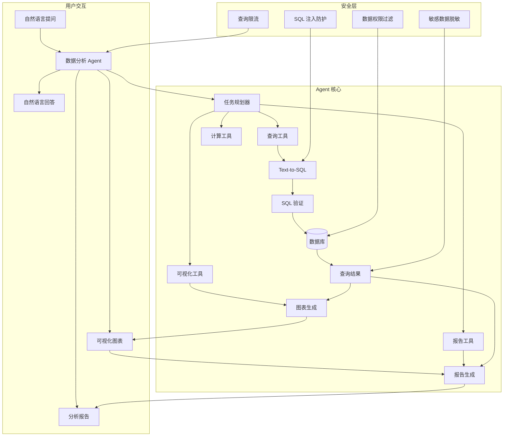
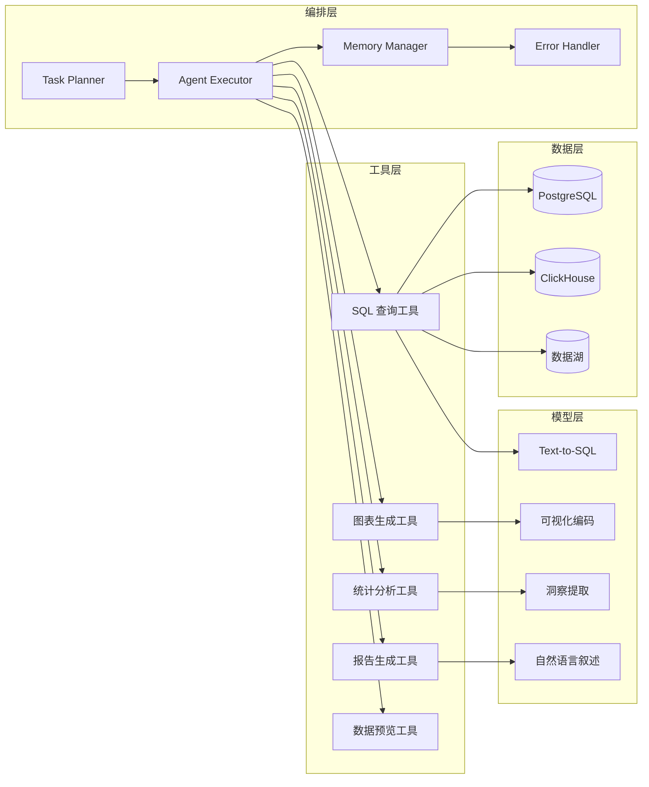
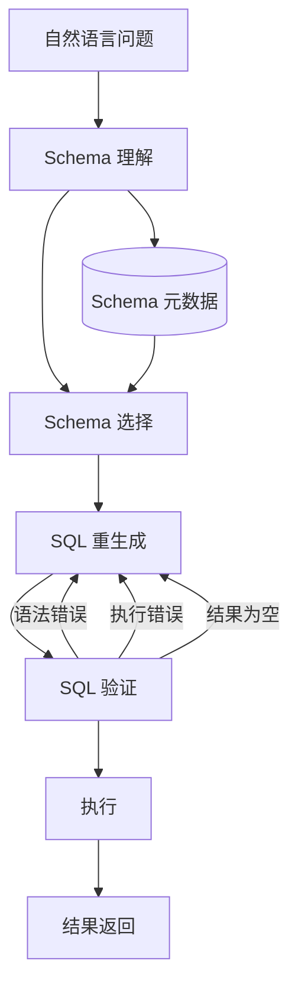
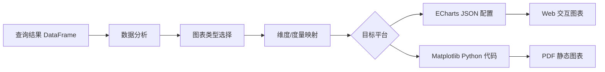

# 第4章 · 数据分析 Agent — 自然语言驱动的数据洞察

> **时长**：约 5 小时 ｜ **难度**：⭐⭐⭐ ｜ **类型**：项目实战
>
> **目标**：开发一个自然语言驱动的数据分析 Agent，支持 Text-to-SQL、自动可视化、报告生成，让业务人员用自然语言完成数据探索

---

## 学习目标

学完本章后，你将能够：
- 掌握 Text-to-SQL 的核心技术，从 Schema 理解到查询生成与验证
- 设计数据分析 Agent 的多工具架构（查库、绘图、计算、报告）
- 实现自动可视化生成，根据数据特征智能选择图表类型
- 构建分析报告自动生成管线，将数据洞察转化为自然语言叙述
- 理解数据安全与权限控制的设计要点

---

## 知识地图



---

# 第一部分：需求分析与架构设计

## 1、需求分析

### 1.1 使用场景

数据分析 Agent 面向三类核心用户：

**业务人员自助分析**：市场、运营、财务等非技术团队，在日常工作中需要查询数据但不会写 SQL。通过自然语言提问"上个月各渠道的获客成本是多少"，系统自动完成查库和展示。

**快速数据探索**：数据分析师面对新数据集时，先用自然语言快速探索数据概貌。"这个月销售额最高的 Top-10 产品是什么""用户留存率的变化趋势如何"——避免手写大量探索性 SQL。

**报告自动生成**：周期性业务报告（周报、月报）由 Agent 自动完成数据查询、图表生成和报告撰写，人工只需审核和微调。

### 1.2 功能需求

| 功能 | 描述 | 优先级 |
|------|------|-------|
| 自然语言查询 | 用户用自然语言提问，系统自动执行查询 | P0 |
| 图表生成 | 根据查询结果自动选择合适的图表展示 | P0 |
| 报告撰写 | 自动生成带图表和洞察的分析报告 | P1 |
| 洞察发现 | 自动识别数据中的异常、趋势和模式 | P1 |
| 多轮分析 | 支持追问和深入分析（"按月份展开看看"） | P1 |
| 数据对比 | 支持同比、环比等对比分析 | P2 |

### 1.3 技术挑战

```
核心挑战：
  1. 自然语言 → SQL 的准确率：复杂查询（多表 JOIN、聚合、子查询）的转换精度
  2. 图表智能选择：根据数据类型和分析目标自动匹配合适的图表
  3. 长报告连贯性：多段分析和多图表在报告中逻辑连贯
  4. 查询安全：防止 SQL 注入和越权访问
```

---

## 2、架构设计

### 2.1 系统架构

**核心定位**：基于 Agent 架构设计，将数据分析任务拆解为"规划 → 执行 → 验证 → 呈现"四个阶段。每个阶段由专门的工具模块执行，Agent 负责协调和决策。



### 2.2 技术选型

| 组件 | 技术选型 | 选型理由 |
|------|---------|---------|
| Agent 框架 | LangChain + LangGraph | 状态图驱动，任务规划清晰 |
| Text-to-SQL | DeepSeek + Few-Shot Prompting | 对 SQL 生成任务表现优异 |
| 数据库 | PostgreSQL / ClickHouse | 关系型和 OLAP 各取所需 |
| 可视化 | ECharts + Plotly | 交互式图表，Python/JS 双支持 |
| 报告模板 | Jinja2 + WeasyPrint | PDF 报告生成，模板灵活 |
| 向量记忆 | ChromaDB | 存储历史查询范式，辅助 SQL 生成 |

---

# 第二部分：核心功能实现

## 3、Text-to-SQL

### 3.1 技术原理

**概念定义**：Text-to-SQL 是将自然语言问题自动转换为 SQL 查询语句的技术。核心挑战在于让 LLM 理解数据库 Schema（表名、字段名、字段语义、表间关系），并准确生成符合语法和业务逻辑的 SQL。



### 3.2 Schema 理解

**概念定义**：Schema 理解是 Text-to-SQL 的第一步，也是最关键的一步。将数据库 Schema 描述成 LLM 能理解的自然语言格式。

```python
# Schema 描述生成
def build_schema_prompt(database: str) -> str:
    """将数据库 Schema 转换为 LLM 可读的文本描述"""
    tables = get_tables(database)
    schema_desc = []

    for table in tables:
        columns = get_columns(table)
        col_desc = []
        for col in columns:
            sample_vals = get_sample_values(table, col.name, 3)
            col_desc.append(
                f"  - {col.name} ({col.type})"
                f"{' [PK]' if col.is_pk else ''}"
                f"{' [FK → ' + col.fk_ref + ']' if col.fk_ref else ''}"
                f"\n    含义：{col.comment}"
                f"\n    示例值：{sample_vals}"
            )
        schema_desc.append(
            f"## 表：{table.name}\n"
            f"说明：{table.comment}\n"
            f"列：\n" + "\n".join(col_desc) + "\n"
        )

        # 外键关系
        fks = get_foreign_keys(table)
        if fks:
            schema_desc.append(f"外键关系：")
            for fk in fks:
                schema_desc.append(f"  {table.name}.{fk.col} = {fk.ref_table}.{fk.ref_col}")

    return "\n".join(schema_desc)
```

### 3.3 查询生成

**核心定位**：使用 Few-Shot Prompting 提升 SQL 生成质量。为 LLM 提供该数据库的高质量查询示例，覆盖常见查询模式（聚合、分组、排序、多表 JOIN、时间范围过滤）。

```python
SQL_GEN_PROMPT = """你是一个 SQL 专家。请根据数据库 Schema 和用户问题生成 SQL 查询。

## 数据库 Schema
{schema}

## 查询示例
{examples}

## 用户问题
{question}

## 生成要求
1. 只生成 SELECT 查询，不生成 INSERT/UPDATE/DELETE
2. 使用适当的聚合函数和 GROUP BY
3. 为聚合字段和计算字段起别名
4. 添加 LIMIT 100 限制结果数量
5. 如果是时间相关查询，使用合理的日期过滤

## SQL
"""
```

### 3.4 查询验证与优化

生成的 SQL 需要经过三层验证：

| 验证层 | 方法 | 处理方式 |
|-------|------|---------|
| 语法校验 | 使用 sqlparse / 数据库 EXPLAIN | 语法错误 → 重新生成（最多 3 次） |
| 语义校验 | 检查表名和字段名是否存在 | 不存在 → 修正或提示 Schema 错误 |
| 安全校验 | 检查是否为只读查询 | 非只读 → 拒绝执行 |

```python
class SQLValidator:
    def validate(self, sql: str) -> ValidationResult:
        # 1. 安全检查
        if not self._is_read_only(sql):
            return ValidationResult(valid=False, error="只允许 SELECT 查询")

        # 2. 语法检查
        try:
            parsed = sqlparse.parse(sql)
            if not parsed:
                return ValidationResult(valid=False, error="SQL 语法错误")
        except Exception as e:
            return ValidationResult(valid=False, error=str(e))

        # 3. 语义检查 (表名/字段名存在性)
        invalid_refs = self._check_references(sql)
        if invalid_refs:
            return ValidationResult(
                valid=False,
                error=f"引用了不存在的对象：{invalid_refs}"
            )

        return ValidationResult(valid=True)
```

### 3.5 错误处理

**核心定位**：SQL 执行出错的场景很多——语法错误、权限不足、超时、空结果。好的错误处理不只是报错，而是根据错误类型智能修复或给出合理提示。

```python
async def execute_with_retry(sql: str, max_retries: int = 3):
    for attempt in range(max_retries):
        try:
            result = await db.execute(sql)
            return result
        except SyntaxError as e:
            # 语法问题，让 LLM 修复
            sql = await fix_sql(sql, str(e))
        except TimeoutError:
            # 超时优化：加上更严格的过滤条件
            sql = add_limit(sql, 100)
        except PermissionError:
            return {"error": "没有权限访问该数据", "suggested_action": "联系管理员申请权限"}
        except EmptyResultError:
            return {"info": "查询结果为空", "suggestions": self._get_query_suggestions(sql)}

    return {"error": "多次重试后仍失败", "sql": sql}
```

---

## 4、数据可视化

### 4.1 图表类型选择

**概念定义**：图表选择是可视化生成的关键步骤。系统根据数据特征（维度数量、度量类型、数据分布）和分析意图（趋势、对比、构成、分布）自动选择最合适的图表类型。

```python
def suggest_chart_type(df: DataFrame, question: str) -> str:
    """根据数据特征和用户问题推荐图表类型"""
    dims, measures = analyze_columns(df)
    intent = analyze_intent(question)  # 趋势/对比/构成/分布

    # 决策规则
    if intent == "趋势" and is_date_column(dims[0]):
        return "line"      # 趋势 → 折线图
    elif len(dims) == 1 and len(measures) == 1:
        return "bar"       # 单一维度+度量 → 柱状图
    elif len(dims) == 1 and intent == "构成":
        return "pie"       # 构成 → 饼图
    elif len(dims) == 2 and len(measures) == 1:
        return "grouped_bar"  # 二维→分组柱状图
    elif len(measures) >= 2 and intent == "对比":
        return "scatter"   # 多度量对比→散点图
    else:
        return "table"     # 兜底→表格
```

### 4.2 可视化代码生成

**核心定位**：不直接生成图片，而是生成前端可渲染的图表配置代码。支持 ECharts（Web 端）和 Matplotlib（报告 PDF）两种输出格式。



```python
def generate_echarts_config(df, chart_type: str, dim: str, measure: str) -> dict:
    """生成 ECharts 配置"""
    config = {
        "tooltip": {"trigger": "axis"},
        "grid": {"left": "3%", "right": "4%", "bottom": "3%", "containLabel": True},
    }

    if chart_type == "bar":
        config["xAxis"] = {"type": "category", "data": df[dim].tolist()}
        config["yAxis"] = {"type": "value"}
        config["series"] = [{
            "type": "bar",
            "data": df[measure].tolist(),
            "itemStyle": {"color": "#5470C6"},
        }]
    elif chart_type == "line":
        config["xAxis"] = {"type": "category", "data": df[dim].tolist()}
        config["yAxis"] = {"type": "value"}
        config["series"] = [{
            "type": "line",
            "data": df[measure].tolist(),
            "smooth": True,
            "areaStyle": {"opacity": 0.3},
        }]

    return config
```

---

## 5、报告生成

### 5.1 分析框架

**概念定义**：分析框架是报告生成的结构化模板。Agent 根据用户问题选择合适的分析框架，指导后续的查询、可视化和叙述生成。

常见分析框架：
- **对比分析**：同比/环比、竞品对比、分组对比
- **趋势分析**：时间序列、增长率、季节性
- **构成分析**：占比、贡献度、帕累托
- **归因分析**：影响因子、相关性、根因

### 5.2 洞察提取

自动从数据中提取有意义的洞察，而非简单罗列数字：

```python
def extract_insights(df, context: dict) -> list[str]:
    """从查询结果中提取自然语言洞察"""
    insights = []

    # 1. 最值洞察
    max_val = df[context["measure"]].max()
    max_row = df.loc[df[context["measure"]].idxmax()]
    insights.append(
        f"最高{context['measure_name']}为 {max_val:.2f}，"
        f"来自{context['dim_name']}「{max_row[context['dim']]}」"
    )

    # 2. 趋势洞察
    if "date" in context and len(df) > 2:
        growth = (df[context["measure"]].iloc[-1] / df[context["measure"]].iloc[0] - 1) * 100
        direction = "增长" if growth > 0 else "下降"
        insights.append(
            f"整体呈{direction}趋势，{context['period']}内变化 {abs(growth):.1f}%"
        )

    # 3. 异常检测
    mean, std = df[context["measure"]].mean(), df[context["measure"]].std()
    outliers = df[abs(df[context["measure"]] - mean) > 2 * std]
    if len(outliers) > 0:
        insights.append(f"存在 {len(outliers)} 个异常值需要关注")

    return insights
```

### 5.3 报告模板

使用 Jinja2 模板引擎，将数据、图表和洞察组合为结构化的分析报告：

```html
<h2>{{ report.title }}</h2>
<p>报告周期：{{ report.period }}</p>

<h3>核心指标</h3>
<div class="metrics">
  
  <div class="metric-card">
    <div class="metric-value">{{ metric.value }}</div>
    <div class="metric-change {{ 'up' if metric.change > 0 else 'down' }}">
      {{ metric.change }}% 同比
    </div>
    <div class="metric-label">{{ metric.name }}</div>
  </div>
  
</div>

<h3>分析详情</h3>
{{ chart_html }}

<h3>洞察发现</h3>
<ul>
  
  <li>{{ insight }}</li>
  
</ul>
```

---

## 6、Agent 架构

### 6.1 工具设计

数据分析 Agent 的工具集：

| 工具 | 功能 | 输入 | 输出 |
|------|------|------|------|
| 数据库查询工具 | 执行 SQL 查询 | 自然语言问题 → SQL | DataFrame |
| 图表生成工具 | 生成可视化图表 | DataFrame + 图表配置 | ECharts JSON |
| 统计分析工具 | 执行统计分析 | DataFrame + 分析类型 | 统计结果 |
| 报告工具 | 组装分析报告 | 多段内容 | HTML/PDF 报告 |
| 数据预览工具 | 预览表结构 | 表名 | Schema 描述 + 样例数据 |

### 6.2 任务规划

**核心定位**：Agent 不直接执行，而是先将用户的问题分解为可执行的子任务，再按顺序逐个执行。

```python
class DataAnalysisAgent:
    def __init__(self):
        self.planner = TaskPlanner()
        self.executor = TaskExecutor()
        self.memory = ConversationMemory()

    async def run(self, question: str) -> AnalysisResult:
        # 1. 理解问题，分解任务
        plan = await self.planner.plan(question, self.memory)

        # 2. 执行任务序列
        context = {}
        for step in plan.steps:
            result = await self.executor.execute(step, context)
            context[step.name] = result

        # 3. 合成最终回答
        answer = await self._synthesize(context, plan)
        return answer
```

### 6.3 迭代分析

**概念定义**：迭代分析是数据分析 Agent 区别于简单问答的核心能力。用户问"上个月的销售情况"后，可以继续追问"按地区细分一下"或"和上上个月对比呢"。Agent 需要理解追问的指代，在前一轮结果基础上深入。

```python
# 多轮分析的记忆管理
class ConversationMemory:
    def __init__(self):
        self.rounds = []     # 历史轮次
        self.last_df = None  # 上一轮的查询结果

    def add_round(self, question: str, sql: str, df, insights: list):
        self.rounds.append({
            "question": question,
            "sql": sql,
            "df_head": df.head(5).to_dict(),
            "shape": df.shape,
            "columns": list(df.columns),
            "insights": insights,
            "timestamp": datetime.now(),
        })
        self.last_df = df
```

---

## 7、安全与权限

### 7.1 SQL 注入防护

系统确保任何用户输入不会导致 SQL 注入：
- Agent 只能生成 SELECT 查询
- 所有生成的 SQL 经过解析器语法树校验
- 数据库用户权限设置为只读

### 7.2 数据权限控制

**核心定位**：不同部门的用户只能看到其权限范围内的数据。权限过滤在 SQL 层面实现——Agent 生成 SQL 时自动追加行级过滤条件。

```python
def apply_row_level_permission(sql: str, user: User) -> str:
    """在 SQL 中注入行级权限过滤"""
    if user.role == "admin":
        return sql  # 管理员无限制

    # 为部门级数据追加 WHERE 条件
    dept_conditions = {
        "market": "department = '市场部'",
        "tech": "department = '技术部'",
        "finance": "department = '财务部'",
    }

    if user.dept in dept_conditions:
        # 在 WHERE 后追加 OR 在末尾追加
        if "WHERE" in sql.upper():
            sql = sql.rstrip(";") + f" AND {dept_conditions[user.dept]}"
        else:
            sql = sql.rstrip(";") + f" WHERE {dept_conditions[user.dept]}"

    return sql
```

### 7.3 查询限制

防止恶意或意外的高消耗查询：

```python
QUERY_LIMITS = {
    "max_rows": 10000,         # 最大返回行数
    "max_duration": 30,        # 最大执行时间（秒）
    "max_joins": 5,            # 最大 JOIN 表数
    "cooldown_seconds": 10,    # 单用户最短查询间隔
    "daily_limit": 500,        # 单用户每日查询次数
}
```

### 7.4 敏感数据脱敏

查询结果中涉及个人隐私的字段自动脱敏：

```python
SENSITIVE_COLUMNS = {
    "phone": lambda v: v[:3] + "****" + v[-4:],
    "id_card": lambda v: v[:4] + "**********" + v[-4:],
    "email": lambda v: v.split("@")[0][:2] + "***@" + v.split("@")[1],
    "name": lambda v: v[0] + "**",
}

def desensitize(df: DataFrame) -> DataFrame:
    for col, mask_fn in SENSITIVE_COLUMNS.items():
        if col in df.columns:
            df[col] = df[col].apply(mask_fn)
    return df
```

---

## 常见踩坑

1. **Text-to-SQL 的多表 JOIN 错误**：LLM 在涉及 3 张以上表 JOIN 时容易选错关联字段。建议在每个 Schema 描述中明确标注外键关系，并给出多表 JOIN 的示例查询作为 Few-Shot 样本。
2. **图表的"文不对题"**：LLM 生成图表时可能选择错误类型，或者维度映射颠倒。需要在前端做逆向校验——根据图表配置反推出"这个图表展示的是什么"，与用户问题做语义一致性检查。
3. **长查询超时无反馈**：复杂 SQL 执行超过 30 秒时，用户端完全无响应。需要设计"执行中"状态反馈——先返回"正在查询数据"消息，查询完成后流式推送结果。
4. **Agent 多轮分析的状态漂移**：多轮对话中，Agent 可能偏离原始问题。引入"分析目标锚定"机制——每轮开始时回顾最初的目标和已探明的发现，确保分析沿着主线进行。
5. **空结果误导性回答**：SQL 返回空数据时，LLM 可能编造理由（"数据显示为 0"）。需要严格区分"查询执行成功但无数据"和"查询执行失败"，空结果时输出固定提示"未找到匹配数据"。

---

## 课后练习

1. 在本地数据库（PostgreSQL 或 SQLite）中创建至少 3 张关联表（如用户表、订单表、产品表），然后实现 Text-to-SQL，使其能正确回答涉及多表 JOIN 的问题。
2. 实现一个图表智能选择函数：接收一个 DataFrame 和用户问题，自动分析数据特征并返回推荐的图表类型和配置（ECharts 格式）。
3. 构建一个数据分析 Agent 的原型，使用 LangChain + LangGraph 实现"查询→可视化→洞察→报告"的完整流程。
4. 实现行级数据权限过滤：设计一个用户-部门-数据表的权限模型，确保 SQL 查询自动追加行级过滤条件，验证不同部门用户查询结果不同。

---

## 本节小结

- ✅ 完成了数据分析 Agent 的需求分析与整体架构设计
- ✅ 掌握了 Text-to-SQL 的核心技术：Schema 理解、Few-Shot 生成、三层验证
- ✅ 实现了智能图表推荐和可视化代码自动生成
- ✅ 构建了结构化分析报告的自动生成管线
- ✅ 设计了多工具 Agent 架构（查询+可视化+统计+报告）
- ✅ 建立了数据安全体系：SQL 注入防护、行级权限、查询限制、敏感数据脱敏

---

> **下一章**：第5章 · 内容创作平台 — AI 辅助内容生产
