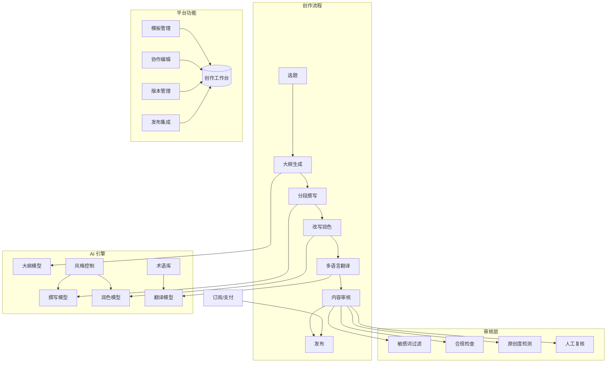
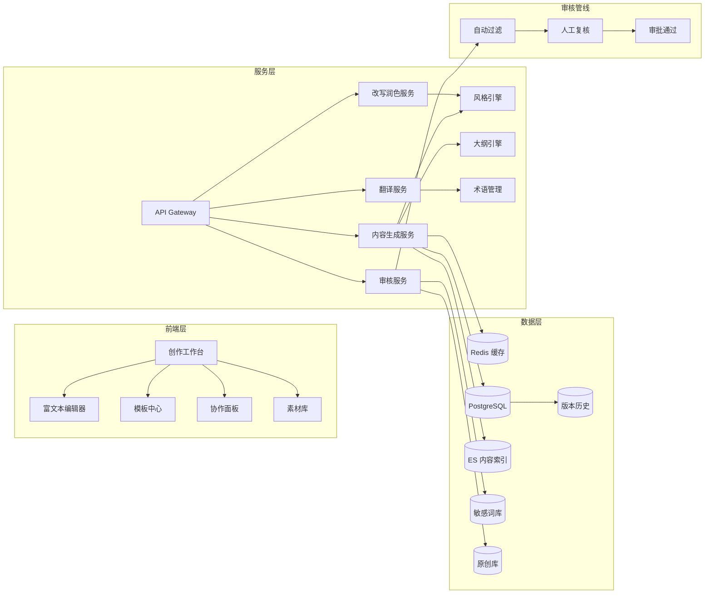
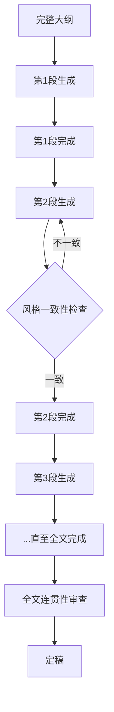
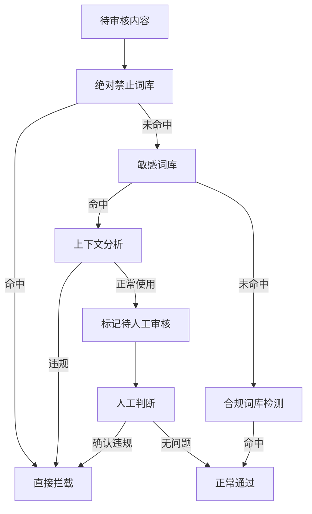

# 第5章 · 内容创作平台 — AI 辅助内容生产

> **时长**：约 5 小时 ｜ **难度**：⭐⭐⭐ ｜ **类型**：项目实战
>
> **目标**：构建一个 AI 驱动的内容创作平台，支持长文本生成、风格控制、多语言翻译和内容审核，实现从选题到发布的全流程辅助

---

## 学习目标

学完本章后，你将能够：
- 掌握长文本生成的实现策略（大纲→分段→连贯性处理）
- 设计风格控制系统，支持品牌调性、语气定制和 Few-Shot 风格学习
- 实现多语言内容生成与翻译，保证术语一致性
- 构建多层级内容审核机制（敏感词过滤、合规检查、原创度检测）
- 理解内容平台的模板管理、协作编辑和版本控制的设计

---

## 知识地图



---

# 第一部分：需求分析与架构设计

## 1、需求分析

### 1.1 内容类型

AI 内容创作平台需要覆盖四种主流内容类型：

**营销文案**：广告语、落地页文案、邮件营销内容、社交媒体帖子。这类内容要求创意性强、转化导向、品牌调性一致。

**新闻稿件**：企业新闻稿、行业动态报道、产品发布公告。要求事实准确、结构规范（倒金字塔结构）、中立客观。

**产品描述**：电商产品详情页文案、功能说明、卖点提炼。要求简洁清晰、突出差异化优势、SEO 友好。

**社交媒体**：微博、微信公众号、LinkedIn 帖子、短视频脚本。要求短小精悍、互动性强、适配不同平台调性。

### 1.2 功能需求

| 功能 | 描述 | 优先级 |
|------|------|-------|
| 内容生成 | 根据输入主题和参数生成各类内容 | P0 |
| 改写润色 | 对已有内容进行风格调整、语法修正、精简扩写 | P0 |
| 多语言翻译 | 将内容翻译为目标语言，保持专业术语一致 | P1 |
| 风格定制 | 根据品牌指南定义内容风格 | P1 |
| 内容审核 | 自动检查敏感词、合规性、原创度 | P1 |
| 模板管理 | 预定义内容模板，快速生成标准化内容 | P2 |
| 版本管理 | 记录内容修改历史，支持回滚 | P2 |
| 协作编辑 | 多人在线协作编辑和评论 | P2 |

---

## 2、架构设计

### 2.1 系统架构

**核心定位**：采用"AI 引擎 + 创作工作台 + 审核管线"三层架构。AI 引擎负责内容生成和智能处理，创作工作台提供编辑和管理界面，审核管线确保内容质量和合规。



### 2.2 技术选型

| 组件 | 技术选型 | 选型理由 |
|------|---------|---------|
| 前端编辑器 | TipTap (ProseMirror) | 可定制的富文本编辑器，协作编辑支持 |
| AI 生成 | DeepSeek / GPT-4 | 长文本生成能力强，风格控制灵活 |
| 实时协作 | Yjs + WebSocket | CRDT 算法，多人实时编辑无冲突 |
| 全文搜索 | Elasticsearch | 内容检索、相似度检测 |
| 对象存储 | MinIO / S3 | 存储图片、附件等素材 |
| 任务队列 | Celery + Redis | 异步处理生成和审核任务 |

---

# 第二部分：内容生成与风格控制

## 3、内容生成

### 3.1 大纲生成

**概念定义**：大纲生成是长文本创作的第一步。系统根据主题、内容类型和目标受众，自动生成结构化的内容大纲，作为后续分段撰写的基础。

```python
OUTLINE_PROMPT = """你是一个专业的内容策划。请根据以下信息生成内容大纲。

## 主题
{topic}

## 内容类型
{content_type}（营销文案/新闻稿件/产品描述/社交媒体）

## 目标受众
{target_audience}

## 关键词
{keywords}

## 生成要求
1. 大纲包含 4-6 个主要章节
2. 每个章节包含 2-3 个子要点
3. 标注每个章节的核心观点和目标字数
4. 开头要有吸引人的引入方式
5. 结尾要有明确的行动号召（CTA）

## 大纲格式
使用 Markdown 列表格式输出
"""
```

### 3.2 分段撰写

**核心定位**：一次性生成长文本（>2000 字）容易出现逻辑断裂、重复和主题漂移。分段撰写策略——按大纲逐段生成，每段生成时参考前一段内容——能有效保证连贯性。



```python
async def generate_long_text(outline: list, style_config: dict) -> str:
    """分段生成长文本"""
    full_text = []
    previous_section = ""

    for section in outline:
        # 每段生成时参考前一段内容和整体风格
        prompt = SECTION_PROMPT.format(
            section_title=section["title"],
            section_points="\n".join(section["points"]),
            previous_section=previous_section,
            style=style_config,
        )

        content = await llm.generate(prompt)

        # 风格一致性检查
        is_consistent = await check_style_consistency(content, style_config)
        if not is_consistent:
            # 重生成或修正
            content = await llm.generate(prompt + "\n注意保持风格一致。")

        full_text.append(content)
        previous_section = content[-200:]  # 只保留末尾 200 字作为参考

    return "\n\n".join(full_text)
```

### 3.3 全文连贯性

**概念定义**：分段撰写后，需要对全文做连贯性处理——消除重复内容、统一术语、润色过渡段落、确保整体逻辑流畅。

```python
COHERENCE_CHECK_PROMPT = """审查以下文章的一致性：

## 审查维度
1. 逻辑连贯性：段落之间的过渡是否自然
2. 术语一致性：全文使用术语是否统一
3. 内容重复：是否存在重复表述
4. 风格统一：前后风格是否一致
5. 语法检查：是否存在语病

## 文章内容
{full_text}

请逐条输出审查结果和修改建议。
"""
```

### 3.4 长文本策略

长文本生成的技术难点与对策：

| 难点 | 问题 | 解决方案 |
|------|------|---------|
| 上下文窗口限制 | 超过 8K tokens 后模型质量下降 | 分段生成+滑动窗口 |
| 主题漂移 | 长文中偏离原始主题 | 每段锚定大纲标题和核心观点 |
| 内容重复 | 不同段落出现相似表述 | 全局去重+交叉引用检查 |
| 记忆衰减 | 后文忘记前文已写的内容 | 关键信息摘要传递机制 |

---

## 4、风格控制

### 4.1 语气定义

**概念定义**：风格控制通过定义"语气参数"来约束 AI 的生成风格。语气是多维度的连续空间，在 Prompt 中以具体规则和示例的形式表达。

| 维度 | 取值范围 | 说明 |
|------|---------|------|
| 正式程度 | 正式 ↔ 非正式 | 用词规范和句式复杂度 |
| 专业程度 | 专业 ↔ 通俗 | 术语使用频率和解释详细度 |
| 情感色彩 | 幽默 ↔ 严肃 | 修辞手法和语气助词 |
| 亲和力 | 亲近 ↔ 疏离 | 人称使用（您/你）和互动语气 |

### 4.2 品牌调性

**核心定位**：品牌调性是一组风格参数的预设组合。每个品牌有独特的声音，内容创作平台需要支持品牌维度的风格配置。

```json
{
  "brand_name": "TechPro",
  "voice_attributes": {
    "formality": 0.8,
    "professionalism": 0.9,
    "humor": 0.2,
    "warmth": 0.6
  },
  "rules": [
    "全文使用'您'而非'你'",
    "所有产品名称首字母大写",
    "不使用网络流行语",
    "每段不超过 5 句",
    "结尾必须包含 CTA"
  ],
  "forbidden_words": ["最便宜", "第一", "领先（无数据支撑时）"],
  "required_sections": ["问题描述", "解决方案", "案例展示", "行动号召"]
}
```

### 4.3 Few-Shot 风格学习

**概念定义**：Few-Shot 风格学习通过在 Prompt 中提供少量目标风格的写作样本，让 LLM 模仿该风格进行内容生成。这是最实用且效果最好的风格控制方法。

```python
STYLE_FEW_SHOT_PROMPT = """你需要按照下面示例的风格来撰写内容。

## 参考风格样本（品牌：{brand_name}）

### 样本 1：
{example_1}

### 样本 2：
{example_2}

### 样本 3：
{example_3}

## 风格特征总结
{style_summary}

## 新内容主题：{topic}
请严格遵循上述风格写一段 {word_count} 字左右的内容：
"""
```

### 4.4 风格迁移

**概念定义**：风格迁移是将已有内容从一种风格转换为另一种风格。例如将技术博客改写成社交媒体帖子，或将正式公告改写成内部通知。

```python
STYLE_TRANSFER_PROMPT = """请将以下内容从[{source_style}]风格转换为[{target_style}]风格。

## 原文
{source_text}

## 目标风格特征
{target_style_description}

## 转换规则
1. 保留原文的核心信息和事实
2. 调整词汇、句式和语气适配目标风格
3. 不改变原文长度超过 20%
4. 不要添加原文没有的事实性信息

## 转换结果：
"""
```

---

## 5、多语言支持

### 5.1 翻译质量优化

**概念定义**：AI 翻译不同于通用的机器翻译，它需要在保持内容质量的同时，确保品牌术语的一致性和目标语言的文化适应。

```python
TRANSLATION_PROMPT = """请将以下内容翻译为{target_language}。

## 翻译要求
1. 保持原文的语气风格
2. 使用以下术语对照表中的标准翻译
3. 注意文化差异，进行本地化调整
4. 保持原文的格式（标题、列表、加粗等）

## 术语对照表
{glossary}

## 原文
{source_text}

## 翻译：
"""
```

### 5.2 本地化处理

**核心定位**：本地化不仅仅是翻译，还需要考虑目标市场的文化习惯、法规要求和表达偏好。

- **日期格式**：中文 YYYY年MM月DD日 vs 英文 MM/DD/YYYY vs 欧洲 DD.MM.YYYY
- **货币符号**：人民币 ¥ 美元 $ 欧元 EUR
- **计量单位**：千米/英里、公斤/磅
- **文化敏感**：数字禁忌、颜色含义、符号差异

### 5.3 术语一致性

术语库是保证多语言内容一致性的基础设施：

```python
class GlossaryManager:
    def __init__(self):
        self.terms = {
            "product_name": {
                "zh": "智能助手Pro",
                "en": "SmartAssistant Pro",
                "ja": "スマートアシスタントPro",
            },
            "feature_name": {
                "zh": "一键分析",
                "en": "One-Click Analysis",
                "ja": "ワンクリック分析",
            }
        }

    def apply_glossary(self, text: str, target_lang: str) -> str:
        """在翻译后的文本中确保术语一致性"""
        for term_key, translations in self.terms.items():
            for lang, translation in translations.items():
                if lang != target_lang:
                    # 确保不需要其他语言的术语
                    pass
            # 确保目标语言术语正确使用
            if target_lang in translations:
                # 替换可能出现的非标准翻译
                text = self._normalize_term(text, translations[target_lang])
        return text
```

### 5.4 多语言审核

不同语言的内容审核标准不同。需要为每个语言配置独立的敏感词库和合规规则。

---

## 6、内容审核

### 6.1 敏感词过滤

**概念定义**：敏感词过滤是内容安全的第一道防线。采用"多层词库 + 上下文判断"的策略，兼顾召回率和误报率。



### 6.2 合规检查

内容合规检查覆盖多个维度：

| 维度 | 检查内容 | 处理方式 |
|------|---------|---------|
| 广告法 | 是否使用违禁词（"最好""第一"等极限词） | 自动替换/标记 |
| 数据合规 | 是否泄露个人信息 | 自动脱敏 |
| 版权检查 | 是否侵权使用受版权保护的内容 | 标记待确认 |
| 平台规范 | 是否符合各发布平台的社区准则 | 自动适配 |
| 行业合规 | 是否满足行业特定法规（医疗、金融等） | 人工复核 |

### 6.3 原创度检测

**核心定位**：AI 生成的内容可能存在"高重复度"问题。原创度检测通过对比历史内容池和互联网公开内容，评估内容的原创性。

```python
def check_originality(text: str, content_db) -> OriginalityReport:
    """检测内容原创度"""
    # 1. 局部指纹匹配
    fragments = extract_fingerprints(text, window_size=50)
    matches = search_fingerprints(fragments, content_db)

    # 2. 语义相似度
    embedding = embed_text(text)
    similar = content_db.similarity_search(embedding, top_k=5)

    # 3. 综合评分
    overlap_ratio = len(matches) / len(fragments)
    max_similarity = max([s.score for s in similar]) if similar else 0

    score = 1 - max(overlap_ratio, max_similarity)
    return OriginalityReport(
        score=score,
        overlap_fragments=matches[:3],
        similar_docs=similar[:3],
        verdict="原创" if score > 0.7 else "需修改" if score > 0.4 else "低原创度"
    )
```

### 6.4 人工复核流程

自动审核无法 100% 准确。系统保留人工复核通道，所有高风险内容进入人工审核队列。审核员可以在线修改内容、批准发布或驳回修改。

---

## 7、平台功能

### 7.1 模板管理

**概念定义**：内容模板是预设的内容框架，包含固定结构、变量占位符和风格参数。模板化能大幅提升标准化内容的生成效率。

```yaml
# 模板示例：产品发布新闻稿
name: "产品发布新闻稿"
variables:
  - name: "product_name"
    type: "string"
    label: "产品名称"
  - name: "release_date"
    type: "date"
    label: "发布日期"
  - name: "key_features"
    type: "list"
    label: "核心功能列表"
sections:
  - title: "标题"
    template: "{{product_name}}正式发布，{{key_features[0]}}引领行业创新"
  - title: "导语"
    template: "【{{release_date}}】今日，{{company_name}}正式发布{{product_name}}..."
```

### 7.2 项目协作

- 多用户实时协作编辑（基于 Yjs CRDT 算法）
- 评论和修订建议（Inline 评论，类似 Google Docs）
- 角色权限：编辑者/审核者/管理员三级权限

### 7.3 版本管理

每次内容修改自动生成版本快照，支持版本对比（Diff）和回滚：

```python
class VersionManager:
    def save_version(self, content_id: str, content: str, editor: str):
        version = ContentVersion(
            content_id=content_id,
            version_number=self.get_next_version(content_id),
            content=content,
            editor=editor,
            diff=self.compute_diff(content_id, content),
            created_at=datetime.now(),
        )
        self.store.save(version)
        return version

    def rollback(self, content_id: str, target_version: int):
        """回滚到指定版本"""
        version = self.store.get_version(content_id, target_version)
        current = self.store.get_current(content_id)
        # 创建回滚记录
        self.save_version(content_id, version.content, "system(rollback)")
        # 更新当前内容
        self.store.update_current(content_id, version.content)
```

### 7.4 发布集成

支持一键发布到多个渠道（官网 CMS、微信公众号、LinkedIn、邮件营销平台），每个渠道的内容格式自动适配。

---

## 常见踩坑

1. **长文本生成的主题漂移**：2000 字以上的内容生成过程中，AI 容易在 2-3 段后偏离原始主题。每段生成时必须将大纲标题和核心观点注入 Prompt，而非仅靠"记住前面的内容"。
2. **风格控制不够稳定**：同一风格参数在不同批次生成时表现不一致。需要为每个品牌建立"风格验证集"——每次内容生成后用验证集评估风格一致性，不达标则重生成。
3. **多语言翻译的术语断裂**：AI 翻译同一个术语在不同段落可能用不同译法。必须维护一个全局术语库，在 Prompt 中使用术语限制，并在翻译后用术语库做后处理替换。
4. **敏感词误报过多**：过于激进的敏感词过滤会导致大量正常内容被拦截。"价格最好"中的"最好"并非极限词——需要上下文消歧，而非简单关键字匹配。
5. **AI 内容的 SEO 陷阱**：AI 生成的内容可能被搜索引擎判定为"低质量自动内容"导致降权。需要引入"人工编辑占比"指标，确保 AI 生成后有足够的人工修改和润色。

---

## 课后练习

1. 实现分段长文本生成策略：设计一个 2000 字以上文章的生成管线，支持大纲输入、分段撰写和全文连贯性检查（去重+主题一致性验证）。
2. 构建一个品牌风格配置系统：定义风格参数（正式程度、专业程度、语气等），实现基于 Few-Shot 示例的风格控制，并开发风格一致性验证函数。
3. 实现一个内容审核管线：集成敏感词过滤、合规检查和原创度检测三个模块，编写测试用例验证不同场景（正常内容、违规内容、边界情况）的处理结果。
4. 开发一个内容模板管理功能：设计模板 Schema（变量定义、章节结构、风格参数），实现模板渲染引擎，支持变量填充和条件渲染。

---

## 本节小结

- ✅ 完成了 AI 内容创作平台的需求分析与系统架构设计
- ✅ 掌握了长文本生成的分段撰写策略和连贯性处理技术
- ✅ 实现了基于多维参数和 Few-Shot 示例的风格控制系统
- ✅ 构建了多语言翻译管线，保证术语一致性和本地化质量
- ✅ 建立了多层内容审核机制（敏感词、合规、原创度、人工复核）
- ✅ 实现了模板管理、协作编辑和版本控制等平台级功能

---

## 模块14总结

恭喜你完成了企业级应用实战模块的全部学习！本模块通过 5 个完整项目，覆盖了 AI 在企业应用中最典型、最具价值的场景。

### 项目全景回顾

| 项目 | 核心技术栈 | 企业价值 |
|------|-----------|---------|
| 智能客服系统 | FastAPI + Milvus + Redis + React | 自动化率 > 80%，7x24 小时服务 |
| 企业知识问答平台 | RAG + 多路召回 + RBAC + 答案溯源 | 知识利用率提升 10 倍，降低培训成本 |
| 代码助手 | AST + FIM + LSP + VS Code Extension | 开发效率提升 30%+，代码质量提升 |
| 数据分析 Agent | Text-to-SQL + Agent + ECharts | 非技术人员自助分析，减少 80% 重复查询 |
| 内容创作平台 | 长文本生成 + 风格控制 + 多语言 + 审核 | 内容生产效率提升 5 倍，质量可控 |

### 核心能力总结

完成本模块学习后，你已经具备以下能力：

- ✅ **项目实战能力**：从需求分析到架构设计再到编码实现和部署上线，覆盖项目全流程
- ✅ **架构设计能力**：掌握微服务架构、消息队列、多级缓存等企业级设计模式
- ✅ **AI 工程化能力**：将 LLM 能力封装为可复用的服务组件，准确率、延迟、可用性可度量
- ✅ **安全合规意识**：权限控制、敏感信息过滤、审计日志、数据脱敏等企业级安全实践
- ✅ **生产就绪思维**：异常处理、监控告警、性能优化、降级熔断等 SRE 核心思想

### 下一步

将本模块的项目经验应用到实际工作中，或继续学习：

> **下一模块**：模块15 · 部署与运维 — 让应用稳定运行在生产环境

---

> **下一章**：模块15 · 部署与运维
