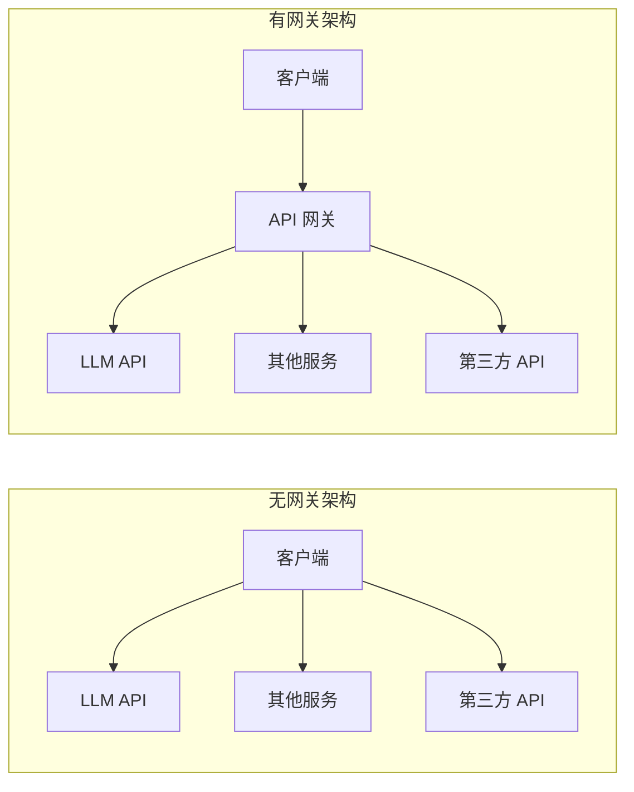
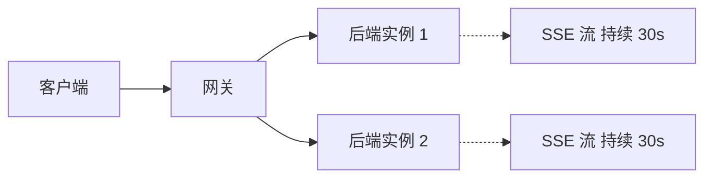
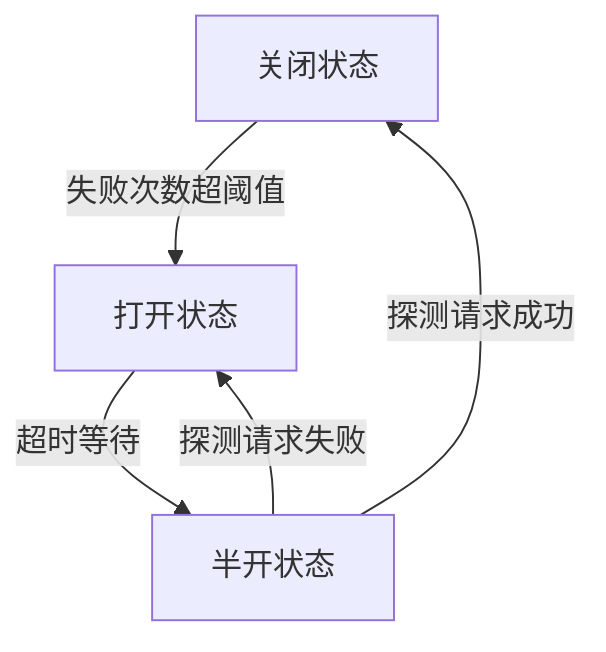
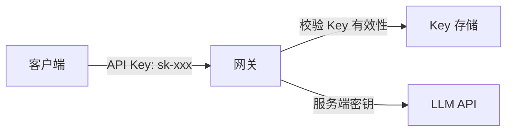

# 第1章 · API 网关与负载均衡 — AI 服务的流量管理

> **时长**：约 3 小时 ｜ **难度**：⭐⭐⭐ ｜ **类型**：工程实践
>
> **目标**：掌握 API 网关架构设计，实现限流熔断与负载均衡，保障 AI 服务在生产环境下的高可用与稳定性

---

## 学习目标

学完本章后，你将能够：
- 理解 API 网关在 AI 服务中的核心价值与架构设计
- 掌握令牌桶、漏桶、滑动窗口等限流算法及其选型依据
- 实现多维度限流（全局、用户、API 级别）与配额管理
- 配置负载均衡策略并处理 LLM API 长连接与流式响应的特殊场景
- 应用熔断器模式实现故障转移与降级策略
- 掌握 API Key 管理、JWT 认证与防重放攻击等安全机制

---

## 知识地图

```mermaid
graph TD
  subgraph C1["API 网关架构"]
    A1[流量入口] --> B1[路由转发]
    A1 --> B2[认证授权]
    A1 --> B3[限流熔断]
    A1 --> B4[日志监控]
  end
  subgraph C2["限流算法"]
    C1[令牌桶] --> D1[全局限流]
    C2[漏桶] --> D2[用户限流]
    C3[滑动窗口] --> D3[API 限流]
  end
  subgraph C3["负载均衡"]
    E1[轮询] --> F1[长连接处理]
    E2[加权轮询] --> F2[流式响应]
    E3[最少连接] --> G[LLM API 后端集群]
    E4[一致性哈希] --> G
  end
  subgraph C4["熔断降级"]
    H1[熔断器] --> I1[返回缓存]
    H2[降级策略] --> I2[切换备用模型]
  end
```

---

# 第一部分：API 网关架构

## 1、为什么需要 API 网关

**概念定义**：API 网关是系统的统一入口，所有客户端请求先到达网关，再由网关转发到后端服务。在 AI 应用中，网关承担着流量调度、安全防护和可观测性三大职责。

**核心定位**：没有网关时，客户端直接调用 LLM API，密钥暴露、无法限流、无法监控。网关作为"前置代理"，集中管控所有流量。



**三大核心价值**：

| 价值 | 说明 | 效果 |
|------|------|------|
| 统一入口 | 所有请求经网关转发 | 客户端只知网关，后端可重构 |
| 流量控制 | 集中限流、熔断、降级 | 防止后端被突发流量打垮 |
| 安全防护 | 认证、鉴权、防攻击 | 密钥不泄露，请求可审计 |

---

## 2、网关核心功能

### 2.1 路由转发

根据请求路径、Header、参数将请求转发到不同的后端服务。例如：

```yaml
# 路由规则示例
routes:
  - path: /v1/chat/completions
    upstream: llm_service
  - path: /v1/embeddings
    upstream: embedding_service
  - path: /v1/rag/query
    upstream: rag_service
```

### 2.2 认证授权

网关统一验证请求合法性，后端无需重复实现。支持 API Key、JWT、OAuth2 等多种认证方式。

### 2.3 限流熔断

防止恶意请求或流量洪峰打垮后端。限流控制速率，熔断在后端故障时快速失败。

### 2.4 日志监控

记录所有请求的出入信息——谁、什么时候、调了什么 API、耗时多长、是否成功。为可观测性提供原始数据。

---

## 3、技术选型

| 网关 | 优势 | 适用场景 |
|------|------|---------|
| Kong | 插件生态丰富，社区成熟 | 企业级标准场景 |
| APISIX | 高性能，Apache 项目 | 高吞吐、大规模集群 |
| 自建方案 | 完全可控，轻量灵活 | 团队小、定制需求多 |

**核心选型建议**：大多数 AI 应用团队建议从自建轻量网关起步（基于 FastAPI 或 Nginx），当规模增长后再迁移到 Kong 或 APISIX。

### ▶ 执行代码

```bash
python 01_api_gateway.py
```

---

# 第二部分：流量控制

## 4、限流算法

**概念定义**：限流是控制请求速率的手段，防止短时间内大量请求耗尽系统资源。

### 4.1 令牌桶

**概念定义**：以固定速率向桶中添加令牌，每个请求消耗一个令牌。桶有容量上限，允许一定程度的突发流量。

```python
class TokenBucket:
    def __init__(self, capacity, refill_rate, refill_interval=1.0):
        self.capacity = capacity          # 桶容量
        self.tokens = capacity            # 当前令牌数
        self.refill_rate = refill_rate    # 每次补充的令牌数
        self.refill_interval = refill_interval
        self.last_refill = time.time()

    def allow_request(self):
        self._refill()
        if self.tokens >= 1:
            self.tokens -= 1
            return True
        return False

    def _refill(self):
        now = time.time()
        elapsed = now - self.last_refill
        if elapsed >= self.refill_interval:
            refill_count = int(elapsed / self.refill_interval) * self.refill_rate
            self.tokens = min(self.capacity, self.tokens + refill_count)
            self.last_refill = now
```

**适用场景**：允许短时突发，整体平滑。非常适合 LLM API 调用——用户偶尔提问多个问题，但总体可控。

### 4.2 漏桶

**概念定义**：请求先进入桶中排队，以固定速率漏出。桶满则新请求被丢弃。

| 算法 | 允许突发 | 平滑输出 | 实现复杂度 |
|------|---------|---------|-----------|
| 令牌桶 | 允许 | 较平滑 | 低 |
| 漏桶 | 不允许 | 非常平滑 | 低 |
| 滑动窗口 | 允许（窗口内） | 一般 | 中 |

**核心选型建议**：AI 服务推荐令牌桶。LLM API 调用天然有波动性——用户阅读回复时暂停、提问时集中发送。令牌桶能容忍这种自然波动。

### 4.3 滑动窗口

**概念定义**：将时间划分为小格，每个格子记录请求数，滑动窗口汇总最近 N 格的请求总数。

---

## 5、限流维度

### 5.1 全局限流

保护整个系统不被打垮。设置全局 QPS 上限，所有用户共享。

```python
# 全局限流：整个网关每秒最多 1000 请求
global_limiter = TokenBucket(capacity=1000, refill_rate=1000, refill_interval=1.0)
```

### 5.2 用户限流

每个 API Key 有独立的限流配额，防止单个用户抢占资源。

```python
# 用户限流：每个 API Key 每秒最多 50 请求
user_limiters = {}  # api_key -> TokenBucket

def get_user_limiter(api_key):
    if api_key not in user_limiters:
        user_limiters[api_key] = TokenBucket(capacity=50, refill_rate=50)
    return user_limiters[api_key]
```

### 5.3 API 限流

不同 API 设置不同限流阈值。Chat 类 API 资源消耗大，限流更严格；Embedding 类相对轻量，限流可放宽。

| API 类型 | 限制策略 | 典型阈值 |
|----------|---------|---------|
| `/v1/chat/completions` | 严格限流 | 100 QPS |
| `/v1/embeddings` | 中等限流 | 500 QPS |
| `/v1/health` | 不限制 | - |

---

## 6、配额管理

**概念定义**：配额管理是对用户在一定时间窗口内（天/月）的累计用量进行管控，不同于限流的秒级控制。

```python
class QuotaManager:
    def __init__(self, daily_limit_tokens):
        self.daily_limit = daily_limit_tokens
        self.usage = defaultdict(int)  # user_id -> 当日累计 Token

    def check_quota(self, user_id, estimated_tokens):
        if self.usage[user_id] + estimated_tokens > self.daily_limit:
            return False  # 超出配额
        return True

    def record_usage(self, user_id, tokens_used):
        self.usage[user_id] += tokens_used
```

---

# 第三部分：负载均衡

## 7、负载均衡策略

**概念定义**：负载均衡将请求分发到多个后端实例，避免单点过载，提升整体吞吐。

### 7.1 轮询与加权轮询

**轮询**：请求依次分发到每个后端实例，简单公平。

**加权轮询**：给性能更强的实例更高权重，分配更多请求。

```python
class WeightedRoundRobin:
    def __init__(self, servers):
        # servers: [{"host": "10.0.0.1", "weight": 5}, {"host": "10.0.0.2", "weight": 3}]
        self.servers = servers
        self.current = 0
        self.current_weight = 0
        self.max_weight = max(s["weight"] for s in servers)
        self.gcd = self._gcd_of_weights()

    def select(self):
        while True:
            self.current = (self.current + 1) % len(self.servers)
            if self.current == 0:
                self.current_weight -= self.gcd
                if self.current_weight <= 0:
                    self.current_weight = self.max_weight
            if self.servers[self.current]["weight"] >= self.current_weight:
                return self.servers[self.current]
```

### 7.2 最少连接

将请求分配给当前活跃连接数最少的实例。适合请求处理时间差异大的场景。

### 7.3 一致性哈希

**概念定义**：对请求的 Key（如用户 ID）进行哈希，映射到固定的后端实例。保证同一用户的请求始终由同一实例处理，对缓存友好。

**核心定位**：当后端实例维护会话状态或本地缓存时，一致性哈希能最大化缓存命中率。

| 策略 | 适用场景 | 优点 | 缺点 |
|------|---------|------|------|
| 轮询 | 无状态服务 | 简单均匀 | 不考虑服务能力差异 |
| 加权轮询 | 异构集群 | 按能力分配 | 权重要手动调整 |
| 最少连接 | 处理时间不均 | 自动负载感知 | 实现略复杂 |
| 一致性哈希 | 有状态服务 | 缓存友好 | 扩展时需虚拟节点 |

---

## 8、LLM API 特殊考虑

**核心问题**：LLM API 的请求不是普通 HTTP 请求——尤其是流式输出场景，一个请求可能持续 10~60 秒。

### 8.1 长连接处理



LLM 的 Server-Sent Events（SSE）流式响应意味着连接持续时间远长于普通 API。负载均衡器需要：

- **连接数感知**：不仅看 QPS，还要看活跃连接数
- **慢启动**：新上线实例先分配少量请求，等待其预热
- **优雅关闭**：收到关停信号后，等现有流式请求完成再下线

### 8.2 流式响应

网关在处理流式响应时需要逐块转发，不能等整个响应完成才转发：

```python
@app.post("/v1/chat/completions")
async def proxy_chat(request: Request):
    async def stream_generator():
        async with httpx.AsyncClient() as client:
            async with client.stream("POST", backend_url, json=request_body) as resp:
                async for chunk in resp.aiter_bytes():
                    yield chunk  # 立即转发给客户端，不等完整响应
    return StreamingResponse(stream_generator(), media_type="text/event-stream")
```

---

## 9、实现方案

### ▶ 执行代码

```bash
python 04_load_balancer.py
```

---

# 第四部分：熔断与降级

## 10、熔断器模式

**概念定义**：熔断器是一种保护机制，当后端服务连续失败达到阈值时，熔断器"打开"——后续请求直接返回失败（触发降级），不再调用有问题的后端。一段时间后"半开"，尝试放行少量请求探测是否恢复。



**三个状态**：

| 状态 | 行为 | 切换条件 |
|------|------|---------|
| 关闭 | 正常转发请求 | 失败次数达到阈值 → 打开 |
| 打开 | 直接拒绝（快速失败） | 超时时间到 → 半开 |
| 半开 | 放行少量请求试探 | 成功 → 关闭；失败 → 打开 |

### 代码实现

```python
class CircuitBreaker:
    def __init__(self, failure_threshold=5, recovery_timeout=30):
        self.failure_threshold = failure_threshold
        self.recovery_timeout = recovery_timeout
        self.state = "CLOSED"
        self.failure_count = 0
        self.last_failure_time = None

    def call(self, func, *args, **kwargs):
        if self.state == "OPEN":
            if time.time() - self.last_failure_time >= self.recovery_timeout:
                self.state = "HALF_OPEN"
            else:
                raise CircuitBreakerOpenError("熔断器已打开")

        try:
            result = func(*args, **kwargs)
            self._on_success()
            return result
        except Exception as e:
            self._on_failure()
            raise
```

---

## 11、降级策略

**概念定义**：降级是在熔断或后端不可用时，返回一个"次优但可用"的响应，而不是直接报错。

### 11.1 返回缓存

如果曾经成功调用过类似请求，返回缓存的历史结果。适合对实时性要求不高的场景。

### 11.2 返回默认值

返回一个预设的兜底回复："服务繁忙，请稍后再试"。

### 11.3 切换备用模型

主模型熔断时，自动切换到备用模型（如从 GPT-4 切换到 GPT-3.5）。

```python
def chat_with_fallback(messages, primary="gpt-4", fallback="gpt-3.5"):
    try:
        return call_llm(messages, model=primary)
    except (RateLimitError, ServiceUnavailableError):
        logger.warning(f"{primary} 熔断，切换到 {fallback}")
        return call_llm(messages, model=fallback)
```

---

## 12、故障转移

**概念定义**：故障转移是在熔断基础上，将流量整体切换到备用集群或区域，应对更大规模故障。

```yaml
# 多区域部署方案
upstream:
  primary:
    - region: us-east
      url: https://us-east.api.example.com
  fallback:
    - region: eu-west
      url: https://eu-west.api.example.com
  failover_policy:
    max_retries: 2
    retry_interval: 1s
    circuit_breaker:
      failure_threshold: 10
      recovery_timeout: 60s
```

### ▶ 执行代码

```bash
python 03_circuit_breaker.py
```

---

# 第五部分：认证与安全

## 13、API Key 管理

**概念定义**：API Key 是客户端调用网关的凭证。网关验证 Key 的有效性后，再用服务端密钥调用后端 LLM API——客户端不直接持有后端密钥。



**最佳实践**：
- API Key 使用前缀标识 Key 类型（如 `sk-`、`pk-`）
- 存储时使用哈希（bcrypt/argon2），不存明文
- 支持 Key 的启用/禁用/过期

---

## 14、OAuth2 / JWT

**概念定义**：JWT（JSON Web Token）是一种自包含的令牌格式，包含用户身份和权限信息，经过签名确保不被篡改。

```python
import jwt
from datetime import datetime, timedelta

SECRET_KEY = os.getenv("JWT_SECRET_KEY")

def create_access_token(user_id: str, permissions: list) -> str:
    payload = {
        "sub": user_id,
        "permissions": permissions,
        "exp": datetime.utcnow() + timedelta(hours=2),
        "iat": datetime.utcnow()
    }
    return jwt.encode(payload, SECRET_KEY, algorithm="HS256")

def verify_token(token: str) -> dict:
    try:
        payload = jwt.decode(token, SECRET_KEY, algorithms=["HS256"])
        return payload
    except jwt.ExpiredSignatureError:
        raise AuthError("令牌已过期")
    except jwt.InvalidTokenError:
        raise AuthError("无效令牌")
```

---

## 15、请求签名与防重放

**概念定义**：请求签名防止请求在传输中被篡改；防重放机制确保同一请求不能被重复提交（防止攻击者截获请求后重复发送）。

**实现方式**：客户端用密钥对请求参数+时间戳+Nonce 生成签名，网关验证签名并检查 Nonce 是否已被使用。

```python
def verify_request_signature(method, path, headers, body, secret):
    timestamp = headers.get("X-Timestamp")
    nonce = headers.get("X-Nonce")
    signature = headers.get("X-Signature")

    # 检查时间戳是否在合理范围内（防止重放）
    if abs(time.time() - int(timestamp)) > 300:
        return False  # 超过 5 分钟

    # 检查 Nonce 是否已被使用
    if nonce in used_nonces:
        return False

    # 重新计算签名
    message = f"{method}{path}{timestamp}{nonce}{body}"
    expected = hmac.new(secret.encode(), message.encode(), hashlib.sha256).hexdigest()
    return hmac.compare_digest(expected, signature)
```

### ▶ 执行代码

```bash
python 02_rate_limiter.py
```

---

## 常见踩坑

1. **限流参数凭感觉配置**：没有压测就设置 QPS 上限。正确做法是先压测后端最大吞吐，再设置 70~80% 的安全阈值。
2. **流式响应超时不设**：客户端或网关的超时时间比 LLM 生成时间长。SSE 流可能持续 60 秒+，Nginx 默认 60 秒超时，需要显式调大 `proxy_read_timeout`。
3. **熔断恢复期过短**：熔断器打开后立即进入半开，后端尚未恢复，导致反复熔断。建议恢复超时设为 30~60 秒。
4. **负载均衡忽略连接数**：只按 QPS 分发请求，忽略了 LLM 流式响应的长连接特性。应同时考虑活跃连接数和 QPS。
5. **API Key 明文存储**：将 API Key 明文存入数据库或代码仓库。务必使用 bcrypt 等哈希算法存储，并通过密钥管理服务（如 AWS KMS、HashiCorp Vault）管理。

---

## 课后练习

1. 实现一个基于令牌桶的用户级限流器，支持动态调整速率。然后用 wrk 或 ab 压测验证限流效果。
2. 为你的 AI 服务配置 Nginx 负载均衡，包括健康检查和加权轮询，验证某实例宕机后流量是否自动转移。
3. 实现熔断器模式，当 LLM API 连续失败 5 次后切换到备用模型，并记录切换日志。
4. 设计 API Key 管理系统，支持密钥生成、哈希存储、轮换和吊销。编写自动化测试验证。

---

## 本节小结

- ✅ 理解了 API 网关的三大核心价值：统一入口、流量控制、安全防护
- ✅ 掌握了令牌桶、漏桶、滑动窗口三种限流算法及其选型依据
- ✅ 实现了全局、用户、API 三级限流维度和配额管理
- ✅ 掌握了轮询、加权轮询、最少连接、一致性哈希四种负载均衡策略
- ✅ 理解了 LLM API 长连接和流式响应对负载均衡的特殊要求
- ✅ 掌握了熔断器三态模型（关闭/打开/半开）及降级策略
- ✅ 实现了 API Key 管理、JWT 认证、请求签名和防重放攻击

---

> **下一章**：第2章 · 可观测性体系 — 监控、日志、追踪三位一体，让 LLM 应用状态尽在掌握
