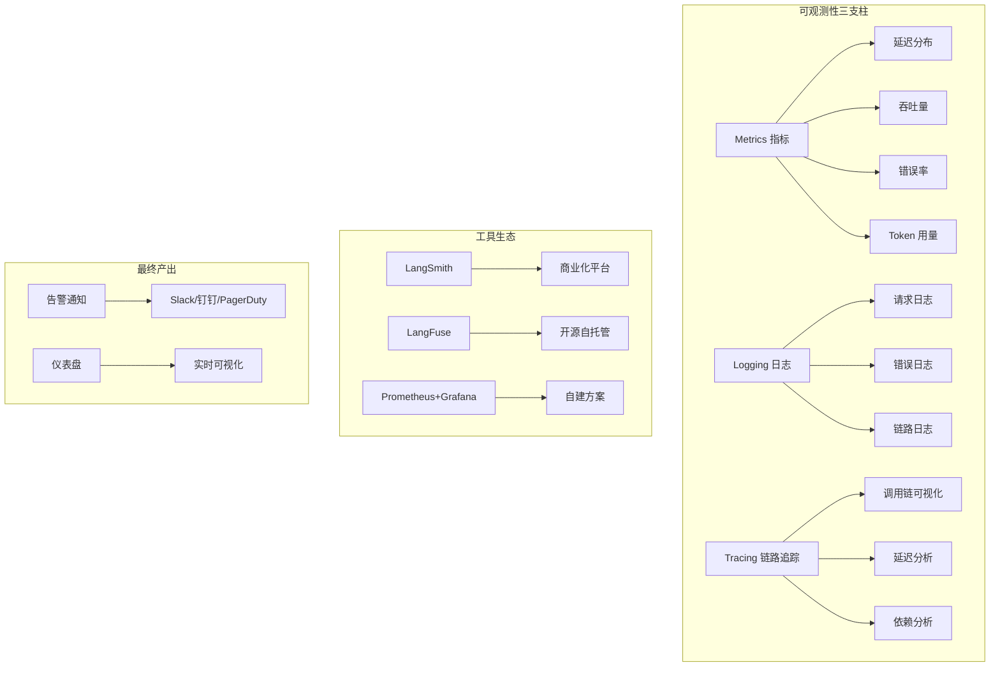
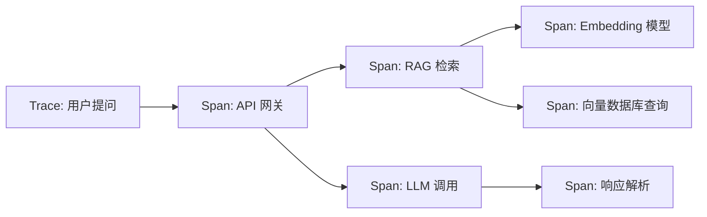
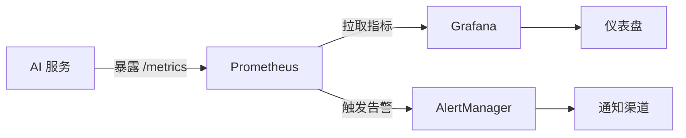

# 第2章 · 可观测性体系 — LLM 应用的监控与追踪

> **时长**：约 3.5 小时 ｜ **难度**：⭐⭐⭐ ｜ **类型**：工程实践
>
> **目标**：掌握 LLM 应用可观测性三大支柱（指标、日志、追踪），学会使用 LangSmith、LangFuse 以及自建 Prometheus + Grafana 方案实现全链路监控

---

## 学习目标

学完本章后，你将能够：
- 理解可观测性三大支柱（Metrics、Logging、Tracing）在 AI 应用中的落地方式
- 使用 LangSmith 对 LLM 调用进行追踪、评估和数据集管理
- 部署 LangFuse 开源平台并集成到现有应用中
- 通过 Prometheus + Grafana 自建监控方案采集 LLM 调用指标
- 配置 ELK/Loki 日志收集体系并实现敏感信息脱敏
- 设计包含延迟、吞吐、错误率、Token 用量的告警规则

---

## 知识地图



---

## 1、可观测性三支柱

**概念定义**：可观测性（Observability）是通过分析系统的外部输出来理解内部状态的能力。对于 AI 应用，可观测性不是可选项——LLM 输出是概率性的，调试比传统软件困难得多，必须依赖监控数据定位问题。

**核心定位**：传统监控回答"系统挂了没有"，可观测性回答"为什么挂了、谁影响的、怎么修复"。

### 1.1 指标（Metrics）

指标是时间序列数据，以固定间隔采集。AI 应用的关键指标：

| 指标类别 | 具体指标 | 采集方式 |
|---------|---------|---------|
| 延迟 | P50/P95/P99 响应时间 | 请求埋点 |
| 吞吐 | QPS、RPM、TPM | 计数器 |
| 错误率 | HTTP 4xx/5xx 比例 | 状态码统计 |
| Token 用量 | 输入 Token、输出 Token | SDK 回调 |
| 成本 | 每分钟/每小时/每天费用 | Token × 单价 |

### 1.2 日志（Logging）

日志是离散的事件记录。AI 应用日志分级：

```python
# 结构化日志推荐使用 JSON 格式
{
  "timestamp": "2026-06-18T10:30:00Z",
  "level": "INFO",
  "service": "llm-gateway",
  "request_id": "req_abc123",
  "user_id": "user_456",
  "model": "deepseek-chat",
  "prompt_tokens": 150,
  "completion_tokens": 45,
  "latency_ms": 2340,
  "status": "success"
}
```

### 1.3 链路追踪（Tracing）

**概念定义**：Trace 追踪一次请求经过的所有服务。每个 Trace 由多个 Span 组成，每个 Span 代表一个操作单元。



**核心价值**：当用户说"响应很慢"，Trace 能立刻定位是 LLM 调用慢（可能是模型负载高）还是 RAG 检索慢（可能是向量数据库满了），无需逐段猜。

---

## 2、LangSmith 使用

**概念定义**：LangSmith 是 LangChain 官方推出的 LLM 应用可观测性平台，提供追踪、评估、数据集管理和监控告警一体化能力。

### 2.1 平台介绍

LangSmith 是 SaaS 产品，注册后获得 API Key 即可接入。免费版可满足个人和小团队使用。

### 2.2 集成配置

```python
import os
from langsmith import Client
from langchain_openai import ChatOpenAI

os.environ["LANGCHAIN_TRACING_V2"] = "true"
os.environ["LANGCHAIN_API_KEY"] = "ls__your_key_here"
os.environ["LANGCHAIN_PROJECT"] = "my-ai-app"

llm = ChatOpenAI(model="deepseek-chat")
# 所有调用会自动被 LangSmith 追踪，无需额外埋点
response = llm.invoke("杭州明天会下雨吗？")
```

### 2.3 追踪功能

**自动追踪**：设置环境变量后，所有 LangChain 组件（Chain、Tool、Retriever）的调用自动生成 Trace。

**手动标注**：对非 LangChain 的代码，通过 `run_on_dataset` 或 `tracing_v2_enabled` 手动创建 Trace：

```python
from langsmith.run_helpers import traceable

@traceable(name="custom_rag_pipeline", project_name="my-ai-app")
def rag_query(question: str):
    docs = retriever.retrieve(question)
    context = "\n".join(docs)
    prompt = f"基于以下信息回答：{context}\n问题：{question}"
    response = llm.invoke(prompt)
    return response.content
```

**链路查看**：在 LangSmith 控制台可以查看每次调用的完整 Trace，包括输入输出、耗时、Token 用量。

### 2.4 评估功能

LangSmith 支持定义评估指标（正确性、相关性、安全性等），并批量对模型输出评分：

```python
from langsmith.evaluation import evaluate

def correctness_evaluator(run, example):
    # run.output: 模型输出, example.output: 标准答案
    score = compute_similarity(run.outputs["output"], example.outputs["expected"])
    return {"key": "correctness", "score": score}

evaluate(
    my_chain,
    data="test_dataset_name",
    evaluators=[correctness_evaluator]
)
```

### 2.5 数据集管理

**概念定义**：数据集是带标注的输入-输出对，用于测试和评估模型行为变化。LangSmith 支持从生产日志中自动构建数据集。

### 2.6 监控告警

配置规则：延迟超过 5 秒、错误率超过 5%、Token 消耗超过预算阈值时，自动通知。

### ▶ 执行代码

```bash
python 01_langsmith_setup.py
```

---

## 3、LangFuse 使用

**概念定义**：LangFuse 是开源的 LLM 可观测性平台，功能与 LangSmith 对标，但可自托管，数据不离开自己的网络。

### 3.1 开源优势

| 对比维度 | LangSmith | LangFuse |
|---------|-----------|----------|
| 部署方式 | SaaS | 自托管 / 云版 |
| 数据主权 | 数据归平台 | 数据归自己 |
| 社区版功能 | 有限免费 | 完整开源 |
| 定制化 | 受限 | 完全可控 |

### 3.2 自托管部署

```yaml
# docker-compose.yml for LangFuse
version: "3.8"
services:
  langfuse:
    image: langfuse/langfuse:latest
    ports:
      - "3000:3000"
    environment:
      DATABASE_URL: postgresql://user:pass@db:5432/langfuse
      NEXTAUTH_SECRET: your-secret
      SALT: your-salt
    depends_on:
      - db
  db:
    image: postgres:15
    environment:
      POSTGRES_DB: langfuse
      POSTGRES_USER: user
      POSTGRES_PASSWORD: pass
    volumes:
      - langfuse_data:/var/lib/postgresql/data
```

### 3.3 集成示例

```python
from langfuse import Langfuse

langfuse = Langfuse(
    secret_key="sk-lf-...",
    public_key="pk-lf-...",
    host="http://localhost:3000"  # 自托管地址
)

# 手动创建追踪
trace = langfuse.trace(name="rag-pipeline")
span = trace.span(name="retrieve", input={"question": "杭州天气"})
docs = retriever.retrieve("杭州天气")
span.end(output={"docs_count": len(docs)})

generation = trace.generation(
    name="llm-call",
    model="deepseek-chat",
    input=[{"role": "user", "content": "杭州天气"}],
    output="杭州明天多云转阴...",
    usage={"input": 50, "output": 30}
)
```

### ▶ 执行代码

```bash
python 02_langfuse_setup.py
```

---

## 4、自建监控方案

**概念定义**：当使用 SaaS 平台受限（数据合规、成本、定制需求），或团队已有 Prometheus + Grafana 生态时，自建方案是更好的选择。

### 4.1 Prometheus + Grafana



### 4.2 自定义指标

LLM 应用的指标采集需要自定义埋点：

```python
from prometheus_client import Counter, Histogram, Gauge, start_http_server

# 定义指标
llm_requests_total = Counter(
    "llm_requests_total", "Total LLM requests",
    ["model", "status"]
)

llm_latency_seconds = Histogram(
    "llm_latency_seconds", "LLM request latency",
    ["model"],
    buckets=[0.1, 0.5, 1.0, 2.0, 5.0, 10.0, 30.0, 60.0]
)

llm_tokens_total = Counter(
    "llm_tokens_total", "Total tokens consumed",
    ["model", "token_type"]  # token_type: prompt/completion
)

rag_retrieval_latency = Histogram(
    "rag_retrieval_latency_seconds", "RAG retrieval latency",
    buckets=[0.05, 0.1, 0.2, 0.5, 1.0, 2.0]
)

# 在请求中记录指标
def track_llm_call(model, latency, tokens_in, tokens_out, status):
    llm_requests_total.labels(model=model, status=status).inc()
    llm_latency_seconds.labels(model=model).observe(latency)
    llm_tokens_total.labels(model=model, token_type="prompt").inc(tokens_in)
    llm_tokens_total.labels(model=model, token_type="completion").inc(tokens_out)
```

**RAG 检索指标**：

| 指标 | 说明 | 告警阈值 |
|------|------|---------|
| 检索延迟 | 向量数据库查询耗时 | P99 > 500ms |
| 检索结果数 | 每次返回的文档块数 | 为 0 时告警 |
| 文档新鲜度 | 索引文档的更新日期 | 超过 7 天未更新 |

**Agent 执行指标**：

| 指标 | 说明 |
|------|------|
| 工具调用次数 | 每个 Agent 执行中调用了多少次工具 |
| 工具调用成功率 | 工具调用失败的占比 |
| Agent 步数 | Agent 完成一个任务需要几步（超过阈值可能陷入循环） |

### 4.3 告警规则配置

```yaml
# prometheus-rules.yml
groups:
  - name: llm-alerts
    rules:
      - alert: HighLatency
        expr: histogram_quantile(0.99, rate(llm_latency_seconds_bucket[5m])) > 10
        for: 5m
        labels:
          severity: warning
        annotations:
          summary: "LLM 调用 P99 延迟超过 10 秒"

      - alert: HighErrorRate
        expr: rate(llm_requests_total{status="error"}[5m]) / rate(llm_requests_total[5m]) > 0.05
        for: 3m
        labels:
          severity: critical
        annotations:
          summary: "LLM 调用错误率超过 5%"

      - alert: TokenUsageSurge
        expr: rate(llm_tokens_total[5m]) > 1000000
        for: 5m
        labels:
          severity: warning
        annotations:
          summary: "Token 消耗异常激增"
```

### 4.4 仪表盘设计

Grafana 仪表盘推荐面板：

1. **请求量趋势**：按模型分组的 QPS 折线图
2. **延迟分布**：P50/P95/P99 延迟热力图
3. **错误率监控**：按错误类型分类的柱状图
4. **Token 用量**：输入/输出 Token 的堆叠面积图
5. **成本实时显示**：基于 Token × 单价的费用估算

### ▶ 执行代码

```bash
python 03_custom_metrics.py
```

---

## 5、日志管理

### 5.1 日志收集

**概念定义**：日志收集是将分散在各服务器上的日志统一采集、传输、存储，方便集中检索和分析。

**ELK Stack（Elasticsearch + Logstash + Kibana）**：

- Filebeat：在各节点采集日志文件
- Logstash：解析和转换日志格式
- Elasticsearch：存储和索引
- Kibana：可视化检索

**Loki（Grafana 生态）**：

- 轻量级，与 Prometheus 共用标签体系
- 不全文索引，只索引标签，成本更低

### 5.2 日志格式规范

统一的结构化日志格式对检索效率至关重要：

```python
import structlog

structlog.configure(
    processors=[
        structlog.processors.TimeStamper(fmt="iso"),
        structlog.processors.add_log_level,
        structlog.dev.JSONRenderer()
    ]
)
logger = structlog.get_logger()

logger.info("llm_request", model="deepseek-chat", tokens=150, latency=2.3, status="success")
logger.error("llm_request", model="deepseek-chat", error="rate_limit_exceeded", retry_after=30)
```

### 5.3 敏感信息脱敏

**核心问题**：日志中可能包含用户隐私（电话号码、身份证号、地址等）。需要自动脱敏后才能落盘。

```python
import re

PII_PATTERNS = {
    "phone": r"1[3-9]\d{9}",
    "id_card": r"\d{18}[\dXx]",
    "email": r"[a-zA-Z0-9._%+-]+@[a-zA-Z0-9.-]+\.[a-zA-Z]{2,}",
    "ip": r"\d{1,3}\.\d{1,3}\.\d{1,3}\.\d{1,3}"
}

def mask_pii(text: str) -> str:
    for name, pattern in PII_PATTERNS.items():
        text = re.sub(pattern, lambda m: m.group()[0] + "*" * (len(m.group()) - 1), text)
    return text

# 在日志输出前调用
log_entry["message"] = mask_pii(log_entry["message"])
```

### 5.4 日志检索与分析

常见检索场景：

| 场景 | 查询语句（KQL） |
|------|---------------|
| 查找特定用户的请求 | `user_id: "user_123"` |
| 查找高延迟请求 | `latency_ms > 10000` |
| 查找错误详情 | `level: "ERROR" AND service: "llm-gateway"` |
| 按模型统计 | `model: "deepseek-chat" \| stats avg(latency_ms)` |

### ▶ 执行代码

```bash
python 04_logging_config.py
```

---

## 常见踩坑

1. **指标埋点遗漏关键维度**：只记录了请求量，没记录模型名和状态码。导致后期无法按模型拆解延迟和成本，排查问题时缺少维度。建议统一在中间件层自动埋点。
2. **日志级别混乱**：生产环境开 DEBUG 日志导致磁盘打满，或关键错误用 INFO 级别导致被忽略。建议错误用 ERROR、业务事件用 INFO、调试用 DEBUG 且生产默认 WARN。
3. **Trace 采样率过低**：为了省成本将采样率设为 1%，结果排查某个用户的问题时找不到 Trace 记录。建议动态采样——低流量时全采样，高流量时按错误优先级采样。
4. **敏感信息脱敏不及时**：先在日志中记录了明文 PII，再加脱敏逻辑时数据已经流出。应该在日志框架的最外层配置脱敏，而不是在每个业务代码中手动处理。
5. **告警阈值拍脑袋**：P99 延迟告警设为 1 秒，但 LLM API 调用本身就要 2~3 秒，导致持续告警噪音。建议先运行一周采集基线数据，设定为基线 + 50%。

---

## 课后练习

1. 将你的 AI 应用接入 LangSmith 或 LangFuse，运行 10 次不同查询，在控制台查看 Trace 和 Token 用量。
2. 使用 Prometheus 客户端库为你的 LLM 调用添加自定义指标（请求量、延迟、Token），并在 Grafana 中创建仪表盘可视化。
3. 配置结构化日志，实现 JSON 格式输出，写一个脚本统计过去 1 小时内的 P95 延迟和错误分布。
4. 部署 LangFuse 自托管版本（使用 Docker Compose），接入应用后对比与 LangSmith 的功能差异，输出对比表。

---

## 本节小结

- ✅ 理解了可观测性三大支柱（Metrics、Logging、Tracing）及 AI 应用中的落地方式
- ✅ 掌握了 LangSmith 的集成配置、自动追踪、评估和监控告警能力
- ✅ 掌握了 LangFuse 自托管部署和功能对比
- ✅ 实现了 Prometheus + Grafana 自建方案，包括自定义指标埋点和告警规则配置
- ✅ 学会了结构化日志、敏感信息脱敏和集中日志检索
- ✅ 掌握了基于基线的告警阈值设定方法，避免告警噪音

---

> **下一章**：第3章 · 成本优化策略 — Token 用量分析、缓存机制与模型路由，让每一分钱都花在刀刃上
