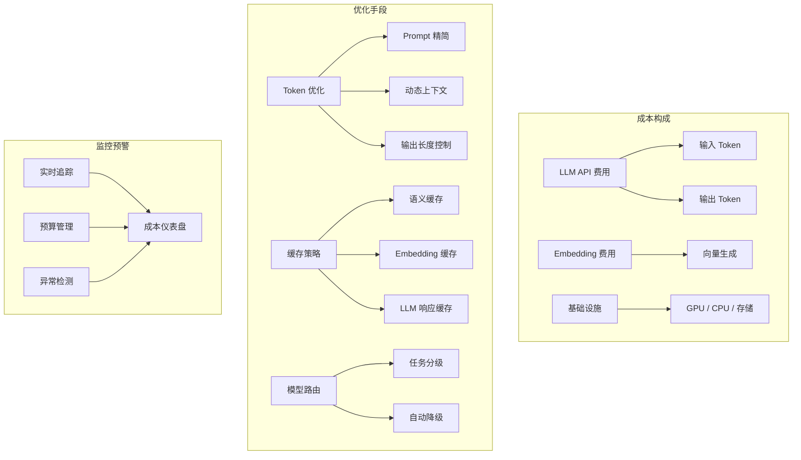
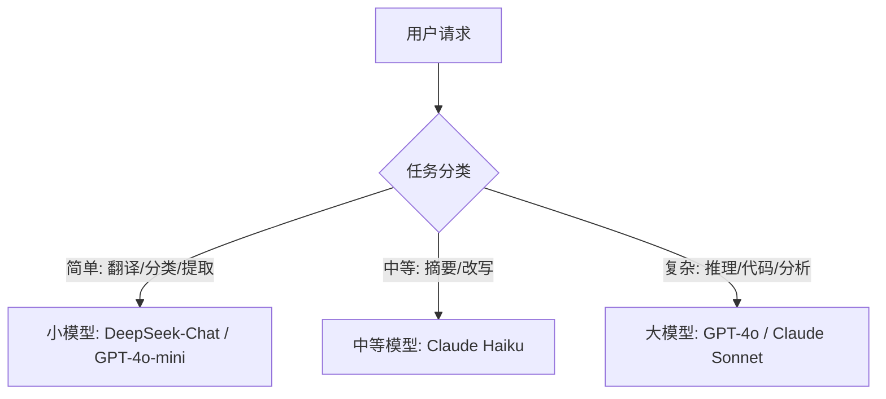
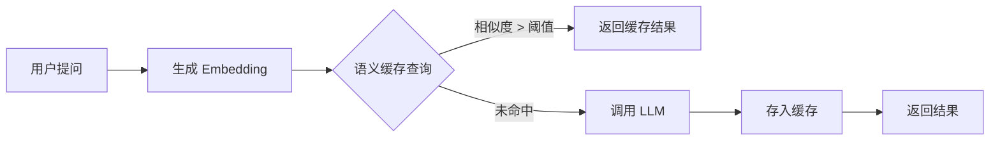

# 第3章 · 成本优化策略 — Token 用量与模型路由

> **时长**：约 3 小时 ｜ **难度**：⭐⭐⭐ ｜ **类型**：工程实践
>
> **目标**：掌握 LLM 应用成本构成分析方法，学会 Token 压缩、语义缓存、模型路由等优化手段，建立成本监控与预警机制

---

## 学习目标

学完本章后，你将能够：
- 拆解 AI 应用全链路成本构成（API、Embedding、向量库、基础设施）
- 通过 Prompt 压缩和输出控制降低每次调用的 Token 消耗
- 实现语义缓存减少重复的 LLM 调用
- 设计基于任务难度的模型路由策略
- 建立实时成本监控、预算管理和异常告警体系
- 对比各模型性价比并制定自动降级策略

---

## 知识地图



---

## 1、成本构成分析

**概念定义**：AI 应用的成本不止是 LLM API 调用费用。全链路成本包括模型调用、向量生成、数据存储和基础设施四个层面。

### 1.1 LLM API 成本

LLM API 按 Token 计费，输入和输出价格不同：

| 模型 | 输入价格（每百万 Token） | 输出价格（每百万 Token） |
|------|------------------------|-------------------------|
| GPT-4o | $2.50 | $10.00 |
| Claude 3.5 Sonnet | $3.00 | $15.00 |
| DeepSeek-V3 | $0.27 | $1.10 |
| GLM-4-Flash | 免费 | 免费 |

**核心发现**：输出 Token 通常比输入 Token 贵 3~5 倍。在优化时，控制输出长度往往比压缩输入 Prompt 的 ROI 更高。

### 1.2 Embedding 成本

Embedding 模型将文本转换为向量。每条文本的维度越高、模型参数量越大，成本越高。

| 模型 | 维度 | 价格（每百万 Token） |
|------|------|---------------------|
| text-embedding-3-small | 512/1536 | $0.02 |
| text-embedding-3-large | 256/1024/3072 | $0.13 |
| bge-large-zh | 1024 | 开源免费（自托管） |

**核心建议**：高频调用的 Embedding 场景，优先考虑自托管开源模型（如 BGE、M3E），单次推理成本几乎为零。

### 1.3 向量数据库成本

| 向量库 | 计费模式 | 典型月费 |
|--------|---------|---------|
| Pinecone | 按 Pod/Serverless 计费 | $70~$500 |
| Milvus Cloud | 按 CU 计费 | $100~$1000+ |
| Qdrant Cloud | 按集群规格 | $50~$300 |
| Chroma（自托管） | 仅服务器成本 | 极低 |

### 1.4 基础设施成本

包括 GPU 服务器（自托管模型）、应用服务器、网络带宽和存储。如果是纯 API 调用模式，这部分成本相对较低。

---

## 2、Token 优化

**概念定义**：Token 优化是通过减少每次 LLM 调用的 Token 消耗，在不影响输出质量的前提下降低费用。

### 2.1 Token 用量监控

优化的第一步是测量——没有数据就没有优化方向：

```python
class TokenTracker:
    def __init__(self):
        self.usage = defaultdict(lambda: {
            "prompt_tokens": 0, "completion_tokens": 0,
            "requests": 0, "cost": 0.0
        })

    def record(self, model, prompt_tokens, completion_tokens):
        entry = self.usage[model]
        entry["prompt_tokens"] += prompt_tokens
        entry["completion_tokens"] += completion_tokens
        entry["requests"] += 1
        entry["cost"] += self._calculate_cost(model, prompt_tokens, completion_tokens)

    def report(self):
        for model, data in self.usage.items():
            print(f"{model}: {data['requests']} 次请求, "
                  f"输入 {data['prompt_tokens']:,} tokens, "
                  f"输出 {data['completion_tokens']:,} tokens, "
                  f"费用 ${data['cost']:.2f}")

    def _calculate_cost(self, model, prompt, completion):
        rates = {
            "deepseek-chat": (0.27e-6, 1.10e-6),
            "gpt-4o": (2.50e-6, 10.00e-6),
        }
        in_rate, out_rate = rates.get(model, (1e-6, 2e-6))
        return prompt * in_rate + completion * out_rate
```

### 2.2 Prompt 精简

**压缩 System Prompt**：System Prompt 附加在每次请求中。一个 500 词的 System Prompt 如果每天调用 1 万次，相当于每天额外消耗约 1300 万 Token。

优化策略：

| 策略 | 效果 | 实现难度 |
|------|------|---------|
| 去除冗余指令 | 减少 10~30% | 低 |
| 简化示例 | 减少 20~50% | 中 |
| 使用简短指令 | 减少 30~50% | 低 |
| 动态加载（按需拼接） | 减少 50~80% | 高 |

**减少 Few-Shot 示例**：3 个示例可能够用就不要用 5 个。每一次示例都在消耗输入 Token。

**动态上下文**：不要把完整的对话历史每次都发过去。只保留最近的 N 轮：

```python
def build_messages(history, max_tokens=3000):
    """只保留最近的对话，总 Token 不超过 max_tokens"""
    messages = []
    total = 0
    for msg in reversed(history):
        tokens = count_tokens(msg["content"])
        if total + tokens > max_tokens:
            break
        messages.insert(0, msg)
        total += tokens
    return messages
```

### 2.3 输出控制

**max_tokens 设置**：不给 max_tokens 或者设得过大，模型可能输出远超预期的内容。

```python
# 不设 max_tokens → 模型可能输出 4096 tokens
llm.invoke("用一句话回答")

# 设 max_tokens=100 → 输出稳定控制在 100 token 以内
llm.invoke("用一句话回答", max_tokens=100)
```

**简洁输出指令**：在 Prompt 中明确要求简短回答：

```
用户提问：{question}
要求：用不超过 50 字回答，直接给出答案，不要解释，不要前缀。
```

### ▶ 执行代码

```bash
python 01_token_tracker.py
```

---

## 3、模型选择优化

### 3.1 任务分级

**概念定义**：不是所有请求都需要最强的模型。简单任务用小模型，复杂任务用大模型，可以节省 60~80% 的成本。



### 3.2 动态路由

**概念定义**：根据请求特征自动选择最合适的模型，而不是硬编码一个模型。

```python
class ModelRouter:
    def __init__(self):
        self.routes = [
            ("simple", self._is_simple_task, "deepseek-chat"),
            ("complex", self._is_complex_task, "gpt-4o"),
        ]
        self.default_model = "gpt-4o-mini"

    def select_model(self, task_type, task_content):
        if task_type == "translation":
            return "deepseek-chat"  # 翻译用便宜模型
        if task_type == "code_review":
            return "gpt-4o"         # 代码审查用强模型
        if len(task_content) > 3000:
            return "gpt-4o"         # 长文本用强模型
        return self.default_model

    def _is_simple_task(self, request):
        keywords = ["翻译", "分类", "提取", "总结"]
        return any(k in request for k in keywords)
```

### 3.3 自动降级策略

当高成本模型出现错误或限流时，自动降级到低成本模型：

```python
async def chat_with_degrade(messages, preferred="gpt-4o", fallback="deepseek-chat"):
    """优先使用 GPT-4o，失败时降级到 DeepSeek"""
    try:
        return await call_llm(messages, model=preferred)
    except (RateLimitError, ServiceUnavailableError):
        logger.warning(f"{preferred} 不可用，降级到 {fallback}")
        return await call_llm(messages, model=fallback)
    except Exception as e:
        logger.error(f"所有模型失败: {e}")
        return {"content": "服务暂时不可用，请稍后重试"}
```

**核心策略矩阵**：

| 场景 | 首选模型 | 降级模型 | 降级条件 |
|------|---------|---------|---------|
| 对话 | GPT-4o | GPT-4o-mini | 限流/超时 |
| 翻译 | DeepSeek-Chat | GLM-4-Flash | 错误率 > 5% |
| 代码 | Claude Sonnet | GPT-4o | 响应时间 > 30s |
| 提取 | GPT-4o-mini | DeepSeek-Chat | 准确率 < 90% |

### ▶ 执行代码

```bash
python 03_model_router.py
```

---

## 4、缓存策略

### 4.1 语义缓存

**概念定义**：语义缓存不只是缓存完全相同的请求，还能命中"含义相似"的问题。实现方式：将问题转为 Embedding，在缓存中找余弦相似度高于阈值的条目。



```python
class SemanticCache:
    def __init__(self, threshold=0.92, embedding_model="text-embedding-3-small"):
        self.threshold = threshold
        self.embedding_model = embedding_model
        self.cache = []  # [(embedding, response), ...]
        self.hits = 0
        self.misses = 0

    def get(self, query):
        query_emb = self._embed(query)
        for cached_emb, response in self.cache:
            similarity = cosine_similarity(query_emb, cached_emb)
            if similarity >= self.threshold:
                self.hits += 1
                return response
        self.misses += 1
        return None

    def set(self, query, response):
        if len(self.cache) >= self.max_size:
            self.cache.pop(0)  # LRU 淘汰
        self.cache.append((self._embed(query), response))
```

### 4.2 缓存失效策略

| 策略 | 说明 | 适用场景 |
|------|------|---------|
| TTL 过期 | 固定时间后失效 | 新闻摘要、实时问答 |
| 主动失效 | 数据更新时清除相关缓存 | 文档问答、企业内部知识库 |
| LRU 淘汰 | 缓存满时淘汰最久未使用的 | 通用兜底策略 |

### 4.3 LLM 响应缓存

完全相同的 Prompt 直接返回缓存结果，不做 LLM 调用。适合 QPS 高的场景。

```python
class LLMResponseCache:
    def __init__(self, ttl_seconds=3600):
        self.cache = {}
        self.ttl = ttl_seconds

    def get(self, messages):
        key = self._make_key(messages)
        if key in self.cache:
            entry = self.cache[key]
            if time.time() - entry["time"] < self.ttl:
                return entry["response"]
            else:
                del self.cache[key]
        return None

    def set(self, messages, response):
        key = self._make_key(messages)
        self.cache[key] = {"response": response, "time": time.time()}

    def _make_key(self, messages):
        return hashlib.md5(json.dumps(messages, sort_keys=True).encode()).hexdigest()
```

### 4.4 缓存命中率优化

| 方法 | 提升命中的原理 | 预期效果 |
|------|--------------|---------|
| 标准化输入 | 去除无关空格、统一大小写 | +5~10% |
| 分桶相似度 | 预聚类后再检索 | +10~15% |
| 多级缓存 | 本地+分布式 两级缓存 | +5~10% |
| 缓存预热 | 上线前预置高频查询 | +20~30%（冷启动阶段） |

### ▶ 执行代码

```bash
python 02_semantic_cache.py
```

---

## 5、成本监控与预警

### 5.1 实时成本追踪

**概念定义**：将 Token 消耗 × 模型单价，实时计算累计费用。

```python
class CostTracker:
    def __init__(self):
        self.daily_cost = 0.0
        self.hourly_cost = 0.0
        self.cost_history = []  # [(timestamp, cost), ...]

    def record(self, model, prompt_tokens, completion_tokens):
        cost = self._compute_cost(model, prompt_tokens, completion_tokens)
        self.daily_cost += cost
        self.hourly_cost += cost
        self.cost_history.append((time.time(), cost))

    def get_current_hour_cost(self):
        return self.hourly_cost

    def get_daily_cost(self):
        return self.daily_cost

    def reset_hourly(self):
        self.hourly_cost = 0.0

    def budget_alert(self, daily_budget):
        if self.daily_cost > daily_budget * 0.8:
            logger.warning(f"当日费用已达预算的 80%: ${self.daily_cost:.2f}")
        if self.daily_cost > daily_budget:
            logger.error(f"当日费用已超预算: ${self.daily_cost:.2f}")
```

### 5.2 预算管理

企业级预算管理建议分三层：

| 层级 | 粒度 | 策略 |
|------|------|------|
| 全局预算 | 全应用 | 月度总费用上限，超限触发熔断 |
| 部门/用户预算 | 每个 API Key | 每日配额，超限自动降级到免费模型 |
| 功能预算 | 每个功能模块 | 细分到翻译/摘要/问答等不同功能 |

### 5.3 异常检测

**概念定义**：检测 Token 用量或费用的突然异常波动，可能是 Bug、攻击或配置错误。

```python
class AnomalyDetector:
    def __init__(self, window_minutes=60, threshold_multiplier=3):
        self.window = window_minutes
        self.threshold = threshold_multiplier
        self.history = deque(maxlen=10080)  # 7 天

    def check(self, current_usage):
        if len(self.history) < 60:
            return False  # 数据不足时不做判定
        mean = np.mean(self.history)
        std = np.std(self.history)
        if current_usage > mean + self.threshold * std:
            alert(f"异常检测：Token 用量 {current_usage} 超过均值+{self.threshold}σ")
            return True
        return False
```

### 5.4 成本报告

定期生成成本报告，追踪优化效果：

```
=== 周成本报告 (2026-06-12 ~ 2026-06-18) ===

总费用: $1,234.56
总请求数: 89,012
总 Token: 45,678,901

按模型:
  - GPT-4o:    $890.12 (72.1%)
  - DeepSeek:  $234.56 (19.0%)
  - Embedding: $109.88 (8.9%)

按应用:
  - 对话:      $567.89 (46.0%)
  - 翻译:      $345.67 (28.0%)
  - 摘要:      $211.00 (17.1%)
  - RAG:       $110.00 (8.9%)

优化效果:
  - 语义缓存命中率: 34.5% (上周: 28.1%)
  - 平均 Prompt 长度: 1,234 tokens (上周: 1,567 tokens ⬇ 21.3%)
  - 成本环比: -12.3%
```

### ▶ 执行代码

```bash
python 04_cost_dashboard.py
```

---

## 常见踩坑

1. **只优化 Prompt 不优化输出**：花大量时间压缩 System Prompt 从 500 降到 300 Token，但不设 max_tokens 导致输出动不动 2000 Token。输出 Token 价格是输入的 3~5 倍，控制输出长度的 ROI 远高于压缩输入。
2. **语义缓存阈值一刀切**：所有问题用同一相似度阈值。简单事实性问答阈值可以 0.85，但创意写作类问题建议 0.95 以上，否则容易返回不相关内容。
3. **缓存未做 TTL 导致过时数据**：新闻问答场景用了语义缓存但没设过期时间，用户连续 3 天得到"今天天气晴"的相同回复。缓存必须有 TTL，时效性越强 TTL 越短。
4. **降级策略搞垮备用模型**：主模型限流后瞬间将 100% 流量打到备用模型，导致备用模型也限流。降级要带"缓冲"——逐步增加流量，观察备用模型状态。
5. **成本告警阈值设在预算上限**：日预算 $100，只在超了才告警。实际上超过时已经晚了。应该设三级预警——80% 警告、90% 严重、100% 熔断。

---

## 课后练习

1. 对你现有的 AI 应用进行成本审计：统计过去一周的总 Token 消耗、费用分布，找出 TOP 3 最贵的调用场景并提出优化方案。
2. 实现语义缓存，使用 text-embedding-3-small 作为编码器，设置 cosine 阈值 0.9。用 100 个相似问题测试命中率，调整阈值观察命中率和准确率的平衡。
3. 设计任务分级路由策略：将请求分为简单/中等/复杂三级，分别映射到不同模型。实现一个路由决策器并对比优化前后的成本差异。
4. 搭建成本监控仪表盘：实时追踪 Token 用量和费用，设置日预算 $10 的三级预警（80%/90%/100%），超限后自动切换到免费模型。

---

## 本节小结

- ✅ 拆解了 AI 应用全链路成本：LLM API、Embedding、向量数据库、基础设施
- ✅ 掌握了 Token 监控、Prompt 精简、输出控制三种成本优化手段
- ✅ 实现了基于任务分级的模型动态路由和自动降级策略
- ✅ 理解了语义缓存的工作原理和失效策略
- ✅ 建立了三级成本监控预警体系（警告/严重/熔断）
- ✅ 学会了成本报告自动生成，追踪优化效果

---

> **下一章**：第4章 · 安全与合规 — 数据安全、内容审核与合规性，构筑 AI 应用的安全防线
