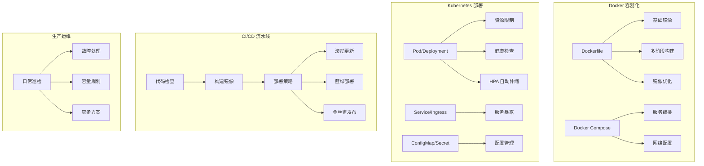

# 第5章 · 容器化部署 — 从 Docker 到 Kubernetes

> **时长**：约 3.5 小时 ｜ **难度**：⭐⭐⭐ ｜ **类型**：工程实践
>
> **目标**：掌握 Docker 容器化 AI 应用的最佳实践，熟练编写 Kubernetes 部署配置，建立完整的 CI/CD 流水线和生产运维体系

---

## 学习目标

学完本章后，你将能够：
- 编写高效安全的 Dockerfile，应用多阶段构建和镜像优化
- 使用 Docker Compose 编排多服务 AI 应用
- 编写 Kubernetes Deployment、Service、Ingress 配置
- 配置健康检查、资源限制和 HPA 自动扩缩容
- 使用 Helm Chart 标准化部署
- 搭建 CI/CD 流水线，实现蓝绿部署和金丝雀发布
- 掌握生产运维的日常巡检、故障处理和容量规划

---

## 知识地图



---

# 第一部分：Docker 容器化

## 1、Dockerfile 编写

**概念定义**：Dockerfile 是构建容器镜像的"配方文件"。每条指令创建一个新的镜像层，好的 Dockerfile 关注构建速度、镜像大小和安全性。

### 1.1 基础镜像选择

```dockerfile
# ❌ 不推荐：包含大量不需要的工具
FROM python:3.12-slim-bookworm

# ❌ 不推荐: alpine 缺少 glibc，很多 ML 库不兼容
FROM python:3.12-alpine
```

**AI 应用推荐基础镜像**：

| 场景 | 推荐镜像 | 大小 | 理由 |
|------|---------|------|------|
| 纯 API 应用 | `python:3.12-slim` | ~120MB | 够用且稳定 |
| 需要 GPU | `nvidia/cuda:12.4-runtime-ubuntu22.04` | ~2.5GB | CUDA 运行时必备 |
| 推理框架 | `vllm/vllm-openai:latest` | ~12GB | 已装好推理依赖 |

### 1.2 依赖安装

```dockerfile
# 利用 Docker 缓存层——先复制依赖文件，后复制源码
COPY requirements.txt .
RUN pip install --no-cache-dir -r requirements.txt

# 再复制源码（源码经常变，依赖不常变）
COPY src/ ./src/
```

**核心技巧**：`COPY requirements.txt` 和 `RUN pip install` 放在 `COPY src/` 之前。这样只要 `requirements.txt` 不变，`pip install` 层就会命中缓存——每次改代码不必重新安装依赖。

### 1.3 多阶段构建

**概念定义**：多阶段构建用一个 Dockerfile 定义多个构建阶段，每个阶段用不同的基础镜像。最终产物只包含运行时需要的文件，不包含构建工具。

```dockerfile
# === 阶段 1：构建阶段 ===
FROM python:3.12-slim AS builder

WORKDIR /app
COPY requirements.txt .
RUN pip install --no-cache-dir --user -r requirements.txt

# 对于需要编译的库（如 torch、sentence-transformers）
# 在这个阶段安装编译依赖，构建完就丢弃

# === 阶段 2：运行阶段 ===
FROM python:3.12-slim AS runtime

WORKDIR /app

# 只复制 Python 的 site-packages，不包含 pip、setuptools 等
COPY --from=builder /root/.local /root/.local

# 复制应用源码
COPY src/ ./src/

# 使用非 root 用户运行
RUN useradd --create-home appuser
USER appuser

EXPOSE 8000
CMD ["uvicorn", "src.main:app", "--host", "0.0.0.0", "--port", "8000"]
```

**多阶段构建的收益**：

| 方案 | 镜像大小 | 包含内容 |
|------|---------|---------|
| 单阶段 | ~1.2GB | Python + 编译工具 + 源码 |
| 多阶段 | ~180MB | Python 运行时 + 已编译依赖 + 精简源码 |

### 1.4 最佳实践

```dockerfile
# 1. 使用 .dockerignore 排除不必要文件
# .dockerignore:
#   __pycache__/
#   .env
#   .git/
#   .venv/
#   *.md

# 2. 设置环境变量
ENV PYTHONUNBUFFERED=1 \
    PYTHONDONTWRITEBYTECODE=1 \
    PIP_NO_CACHE_DIR=1

# 3. 使用非 root 用户
RUN groupadd -r appgroup && useradd -r -g appgroup appuser
USER appuser

# 4. 健康检查
HEALTHCHECK --interval=30s --timeout=3s --retries=3 \
    CMD python -c "import urllib.request; urllib.request.urlopen('http://localhost:8000/health')"
```

---

## 2、Docker Compose

**概念定义**：Docker Compose 用 YAML 定义和运行多容器应用。一个命令启动所有服务，适合本地开发和测试环境。

### 2.1 多服务编排

```yaml
# docker-compose.yml
version: "3.8"
services:
  api:
    build:
      context: .
      dockerfile: Dockerfile
    ports:
      - "8000:8000"
    environment:
      - REDIS_URL=redis://redis:6379
      - DATABASE_URL=postgresql://user:pass@db:5432/app
    depends_on:
      redis:
        condition: service_healthy
      db:
        condition: service_healthy
    restart: unless-stopped

  redis:
    image: redis:7-alpine
    healthcheck:
      test: ["CMD", "redis-cli", "ping"]
      interval: 10s
    volumes:
      - redis_data:/data

  db:
    image: postgres:15
    environment:
      POSTGRES_DB: app
      POSTGRES_USER: user
      POSTGRES_PASSWORD: ${DB_PASSWORD}
    volumes:
      - pg_data:/var/lib/postgresql/data

  vector-db:
    image: chromadb/chroma:latest
    volumes:
      - chroma_data:/chroma/data
    ports:
      - "8001:8000"

volumes:
  redis_data:
  pg_data:
  chroma_data:
```

### 2.2 网络配置

Compose 自动创建网络，服务名就是 hostname。`api` 服务访问 `redis` 直接用 `redis://redis:6379`。

**配置文件生成的最终命令**：

```bash
# 启动所有服务
docker compose up -d

# 查看日志
docker compose logs -f api

# 仅重建某个服务
docker compose up -d --build api

# 停止并清理
docker compose down -v
```

---

## 3、镜像优化


**优化清单**：

| 方法 | 减少量 | 说明 |
|------|--------|------|
| 改用 slim 镜像 | 60~70% | 从 full (~900MB) 到 slim (~120MB) |
| 多阶段构建 | 40~60% | 丢弃构建工具和中间产物 |
| 合并 RUN 指令 | 5~10% | 减少层数量，`RUN apt-get update && apt-get install -y pkg && rm -rf /var/lib/apt/lists/*` |
| 使用 .dockerignore | 10~20% | 避免把 `.venv`/`.git` 打包进镜像 |

### ▶ 配置文件

```bash
# 查看构建产物
cat Dockerfile
cat docker-compose.yml
```

---

# 第二部分：Kubernetes 部署

## 4、K8s 基础概念

**概念定义**：Kubernetes（K8s）是容器编排平台，自动化容器的部署、扩缩容和运维。

### 4.1 Pod / Deployment

```yaml
# deployment.yaml
apiVersion: apps/v1
kind: Deployment
metadata:
  name: llm-api
  labels:
    app: llm-api
spec:
  replicas: 3
  selector:
    matchLabels:
      app: llm-api
  template:
    metadata:
      labels:
        app: llm-api
    spec:
      containers:
        - name: api
          image: registry.example.com/llm-api:v1.2.3
          ports:
            - containerPort: 8000
          env:
            - name: MODEL_NAME
              value: "deepseek-chat"
            - name: REDIS_URL
              valueFrom:
                secretKeyRef:
                  name: app-secrets
                  key: redis-url
          resources:
            requests:
              memory: "512Mi"
              cpu: "500m"
            limits:
              memory: "1Gi"
              cpu: "1000m"
          livenessProbe:
            httpGet:
              path: /health
              port: 8000
            initialDelaySeconds: 10
            periodSeconds: 15
          readinessProbe:
            httpGet:
              path: /ready
              port: 8000
            initialDelaySeconds: 5
            periodSeconds: 10
```

### 4.2 Service / Ingress

```yaml
# service.yaml
apiVersion: v1
kind: Service
metadata:
  name: llm-api-service
spec:
  selector:
    app: llm-api
  ports:
    - port: 80
      targetPort: 8000
  type: ClusterIP

---
# ingress.yaml
apiVersion: networking.k8s.io/v1
kind: Ingress
metadata:
  name: llm-api-ingress
  annotations:
    nginx.ingress.kubernetes.io/proxy-read-timeout: "120s"
    nginx.ingress.kubernetes.io/proxy-body-size: "10m"
spec:
  rules:
    - host: api.example.com
      http:
        paths:
          - path: /v1/chat/completions
            pathType: Prefix
            backend:
              service:
                name: llm-api-service
                port:
                  number: 80
```

### 4.3 ConfigMap / Secret

```yaml
# configmap.yaml
apiVersion: v1
kind: ConfigMap
metadata:
  name: app-config
data:
  config.yaml: |
    log_level: INFO
    max_tokens: 4096
    default_model: deepseek-chat

---
# secret.yaml
apiVersion: v1
kind: Secret
metadata:
  name: app-secrets
type: Opaque
stringData:
  api-key: "sk-your-key-here"  # 实际应使用外部密钥管理
  redis-url: "redis://:password@redis-svc:6379"
```

---

## 5、部署配置

### 5.1 资源限制

**核心定位**：不设资源限制的 Pod 可能耗尽节点资源，导致其他服务被 OOM Kill。

**AI 应用的资源估算**：

| 服务类型 | 推荐 request | 推荐 limit | 说明 |
|---------|-------------|-----------|------|
| HTTP API 服务 | 512Mi / 500m | 1Gi / 1 | 处理请求和响应 |
| RAG 检索服务 | 1Gi / 1 | 2Gi / 2 | 加载 Embedding 模型 |
| LLM 推理（GPU） | 16Gi / 4 / 1 GPU | 32Gi / 8 / 1 GPU | 显存是关键瓶颈 |

### 5.2 健康检查

**两种探针的区别**：

| 探针 | 失败后果 | 用途 |
|------|---------|------|
| livenessProbe | 重启容器 | 检测死锁、内存泄漏 |
| readinessProbe | 从 Service 移除 | 检测是否准备好接收流量 |
| startupProbe | 重启容器 | 慢启动容器用（如加载大模型） |

```yaml
# 模型启动需要 30 秒加载 → 用 startupProbe 给足时间
startupProbe:
  httpGet:
    path: /startup
    port: 8000
  initialDelaySeconds: 5
  periodSeconds: 5
  failureThreshold: 30  # 30 * 5 = 150 秒，足够加载大模型
```

### 5.3 自动扩缩容

```yaml
# hpa.yaml
apiVersion: autoscaling/v2
kind: HorizontalPodAutoscaler
metadata:
  name: llm-api-hpa
spec:
  scaleTargetRef:
    apiVersion: apps/v1
    kind: Deployment
    name: llm-api
  minReplicas: 3
  maxReplicas: 20
  metrics:
    - type: Resource
      resource:
        name: cpu
        target:
          type: Utilization
          averageUtilization: 70
    - type: Resource
      resource:
        name: memory
        target:
          type: Utilization
          averageUtilization: 80
```

**核心建议**：AI 服务 HPA 不要只看 CPU。LLM 调用的瓶颈可能是 I/O 等待（网络等待 LLM API 返回），CPU 利用率很低但 QPS 已到上限。建议添加自定义指标（如活跃连接数、队列深度）。

---

## 6、Helm Chart

**概念定义**：Helm 是 Kubernetes 的包管理器。Helm Chart 将一组 K8s 资源模板化，通过 values.yaml 注入不同环境的配置。

```yaml
# values.yaml (生产环境)
replicaCount: 5
image:
  repository: registry.example.com/llm-api
  tag: "v1.2.3"
resources:
  requests:
    memory: "1Gi"
    cpu: "500m"
  limits:
    memory: "2Gi"
    cpu: "2"
ingress:
  host: api.example.com
  annotations:
    nginx.ingress.kubernetes.io/proxy-read-timeout: "120s"
env:
  MODEL_NAME: "deepseek-chat"
  LOG_LEVEL: "INFO"
```

```bash
# 部署
helm upgrade --install llm-api ./charts/llm-api \
  --values ./charts/llm-api/values.yaml \
  --namespace production

# 多环境
helm upgrade --install llm-api ./charts/llm-api \
  --values ./charts/llm-api/values.yaml \
  --values ./charts/llm-api/values-staging.yaml \
  --namespace staging
```

---

# 第三部分：CI/CD 流程

## 7、代码检查

CI 阶段（提交代码时自动触发）：

```yaml
# .github/workflows/ci.yml
name: CI
on: [push, pull_request]
jobs:
  lint:
    runs-on: ubuntu-latest
    steps:
      - uses: actions/checkout@v4
      - uses: actions/setup-python@v5
        with:
          python-version: "3.12"
      - run: pip install ruff mypy
      - run: ruff check src/
      - run: mypy src/ --strict

  test:
    runs-on: ubuntu-latest
    steps:
      - uses: actions/checkout@v4
      - run: pip install -r requirements-dev.txt
      - run: pytest tests/ --cov=src/ --cov-report=xml

  security:
    runs-on: ubuntu-latest
    steps:
      - uses: actions/checkout@v4
      - run: pip install bandit safety
      - run: bandit -r src/ -ll
      - run: safety check -r requirements.txt
```

---

## 8、构建流水线

```yaml
# .github/workflows/build.yml
jobs:
  build:
    runs-on: ubuntu-latest
    steps:
      - uses: actions/checkout@v4
      - name: Set up Docker Buildx
        uses: docker/setup-buildx-action@v3
      - name: Login to Registry
        uses: docker/login-action@v3
        with:
          registry: registry.example.com
          username: ${{ secrets.REGISTRY_USER }}
          password: ${{ secrets.REGISTRY_PASS }}
      - name: Build and Push
        uses: docker/build-push-action@v5
        with:
          push: true
          tags: |
            registry.example.com/llm-api:${{ github.sha }}
            registry.example.com/llm-api:latest
          cache-from: type=gha
          cache-to: type=gha,mode=max
```

---

## 9、部署策略

### 9.1 滚动更新

K8s 默认策略：逐个替换 Pod。新 Pod 就绪后，再终止旧 Pod。

```yaml
spec:
  strategy:
    type: RollingUpdate
    rollingUpdate:
      maxSurge: 1       # 最多启动 1 个新 Pod
      maxUnavailable: 0 # 保证全部可用
```

### 9.2 蓝绿部署

**概念定义**：维护两套完全相同的环境（蓝=当前生产，绿=新版本），验证无误后切换流量。

```yaml
# service.yaml — 切换 Service selector 实现蓝绿切换
apiVersion: v1
kind: Service
metadata:
  name: llm-api
spec:
  selector:
    app: llm-api
    version: green  # 从 blue 切换到 green
```

```bash
# 部署绿环境
kubectl apply -f deployment-green.yaml

# 等待绿环境就绪
kubectl wait --for=condition=Available deployment/llm-api-green

# 切换流量到绿环境
kubectl patch service llm-api -p '{"spec":{"selector":{"version":"green"}}}'
```

### 9.3 金丝雀发布

**概念定义**：让一小部分用户先使用新版本，观察无问题后再逐步全量。

```yaml
# 金丝雀: 1 个 Pod 运行 v2, 其余 9 个运行 v1
apiVersion: apps/v1
kind: Deployment
metadata:
  name: llm-api-canary
spec:
  replicas: 1
  selector:
    matchLabels:
      app: llm-api
      track: canary
  template:
    metadata:
      labels:
        app: llm-api
        track: canary
        version: "v2.0"
    # ... 其余配置
```

---

## 10、回滚机制

```bash
# 查看部署历史
kubectl rollout history deployment/llm-api

# 回滚到上一个版本
kubectl rollout undo deployment/llm-api

# 回滚到指定版本
kubectl rollout undo deployment/llm-api --to-revision=3

# 查看回滚状态
kubectl rollout status deployment/llm-api
```

---

# 第四部分：环境管理与生产运维

## 11、环境管理

### 11.1 开发/测试/生产环境隔离

| 环境 | K8s 命名空间 | 资源规格 | 数据 |
|------|-------------|---------|------|
| 开发 | `dev` | 最小配置 | 模拟数据 |
| 测试 | `staging` | 接近生产 | 脱敏数据 |
| 生产 | `production` | 高可用 | 真实数据 |

### 11.2 配置管理

```yaml
# 环境特定配置通过 values.yaml 拆分
├── charts/
│   └── llm-api/
│       ├── Chart.yaml
│       ├── templates/
│       └── values/
│           ├── base.yaml     # 公共配置
│           ├── dev.yaml      # 开发覆盖
│           ├── staging.yaml  # 测试覆盖
│           └── prod.yaml     # 生产覆盖
```

### 11.3 密钥管理

**概念定义**：生产密钥绝不存放在代码仓库中。使用外部密钥管理系统：

- **K8s External Secrets Operator**：从 AWS Secrets Manager / GCP Secret Manager / Vault 同步 Secret
- **Sealed Secrets**：加密后存储在 Git 仓库，只有集群内 Sealed Secrets Controller 能解密

---

## 12、生产运维

### 12.1 日常巡检

| 巡检项 | 频率 | 检查方法 |
|-------|------|---------|
| Pod 状态 | 每 15 分钟 | `kubectl get pods -o wide` |
| 节点资源 | 每 30 分钟 | `kubectl top nodes` |
| HPA 状态 | 每小时 | `kubectl get hpa` |
| 错误日志 | 实时 | 告警通知 |
| 证书过期 | 每天 | 检查证书有效期 |

### 12.2 故障处理

**标准故障处理流程**：

1. **感知**：告警系统通知（PagerDuty/钉钉/邮件）
2. **定位**：查看 Grafana 仪表盘 + 日志检索
3. **隔离**：摘除问题节点/实例
4. **恢复**：重启、回滚、扩容（按预案操作）
5. **复盘**：根因分析 + 改进措施

### 12.3 容量规划


**核心指标**：

- 日均请求量、峰值 QPS
- Token 日均消耗量
- Pod 平均 CPU/内存利用率
- API 调用延迟趋势

### 12.4 灾备方案

| 灾难级别 | 影响 | 恢复措施 | RTO | RPO |
|---------|------|---------|-----|-----|
| 单 Pod 故障 | 极低 | K8s 自动重启 | < 30s | 0 |
| 单节点故障 | 低 | Pod 重新调度到其他节点 | < 2min | 0 |
| 单可用区故障 | 中 | 跨可用区部署 + DNS 切换 | < 5min | < 1min |
| 整个 Region 故障 | 高 | 多 Region 主备切换 | < 30min | < 15min |

### ▶ 配置文件

```bash
# Kubernetes 部署配置文件位于 k8s/ 目录
cat k8s/deployment.yaml
cat k8s/service.yaml
cat k8s/ingress.yaml
# CI/CD 配置文件位于 .github/workflows/
cat .github/workflows/ci.yml
cat .github/workflows/deploy.yml
```

---

## 常见踩坑

1. **镜像标签用 `latest`**：`latest` 不可追溯，回滚时不知道之前跑的是什么版本。务必使用 Git commit SHA 或语义版本号作为镜像标签。
2. **资源限制不设或设得太宽松**：某 Pod 内存泄漏时无限占用节点资源，导致同节点其他 Pod 被 OOM Kill。所有 Pod 都必须设置 `resources.limits`，为 AI 服务留足 Buffer。
3. **健康检查配置太少**：`initialDelaySeconds` 设为 0，模型还没加载完就被 K8s 判定不健康反复重启。AI 服务启动慢，`startupProbe` + 适当的 `initialDelaySeconds` 必不可少。
4. **CI/CD 跳过安全检查**：为了快速上线跳过了 lint 和安全扫描，结果将含有明文密钥的镜像推到了生产仓库。CI 阶段的安全性检查应该是"Fail the build"而非"Warning"。
5. **金丝雀发布没有回滚预案**：金丝雀版本出了问题，但切换回蓝环境的脚本没有自动化，导致故障时间延长。部署策略必须配套自动化回滚方案，一键触发。

---

## 课后练习

1. 为你的 AI 应用编写 Dockerfile，应用多阶段构建和 .dockerignore，对比优化前后的镜像大小差异。
2. 编写 Kubernetes 部署配置：Deployment（3 副本 + 资源限制 + 健康检查）、Service、HPA（CPU 70% 触发扩容）。部署到 Minikube 或 Kind 测试集群验证。
3. 使用 GitHub Actions 搭建 CI/CD 流水线：代码检查 → 单元测试 → 安全扫描 → 构建镜像 → 部署到 K8s。
4. 模拟生产故障：手动杀掉一个 Pod 观察 K8s 自动恢复过程，手动模拟节点宕机观察 Pod 重新调度。记录各环节恢复时间并与 RTO 目标对比。

---

## 本节小结

- ✅ 掌握了 Dockerfile 编写最佳实践，包括多阶段构建和镜像优化
- ✅ 学会了 Docker Compose 编排多服务 AI 应用
- ✅ 掌握了 Kubernetes Deployment、Service、Ingress 配置
- ✅ 配置了健康检查、资源限制和 HPA 自动扩缩容
- ✅ 理解了 Helm Chart 多环境管理和密钥管理方案
- ✅ 搭建了包含代码检查、安全扫描、CI/CD 的完整流水线
- ✅ 掌握了滚动更新、蓝绿部署、金丝雀发布三种部署策略
- ✅ 建立了日常巡检、故障处理、容量规划和灾备体系

---

## 模块15总结

完成本模块的全部 5 章学习后，你已经建立了 AI 应用从开发到生产的完整运维能力：

**流量管理** — 通过 API 网关实现统一入口、限流熔断和负载均衡，保障服务稳定性

**可观测性** — 搭建了指标、日志、追踪三位一体的监控体系，让系统状态透明可控

**成本优化** — 掌握了 Token 压缩、语义缓存和模型路由，在不影响质量的前提下大幅降低费用

**安全合规** — 建立了数据安全、内容审核和合规体系，筑起了 AI 应用的完整安全防线

**容器化部署** — 从 Dockerfile 到 Kubernetes 集群，再到 CI/CD 流水线和生产运维，实现了全流程自动化部署

**下一步建议**：将本章学到的运维实践落地到实际项目中。推荐的工具组合：LangFuse（可观测性）+ Kong（网关）+ Prometheus/Grafana（监控）+ ArgoCD（GitOps）+ GitHub Actions（CI/CD）。当你的 AI 应用需要更强大的模型支持时，继续学习模块16：模型微调入门。

---

> **下一模块**：模块16 · 模型微调入门 — 当通用模型无法满足需求时，用小数据定制专属模型
