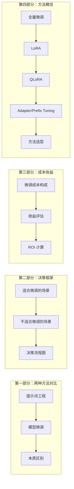
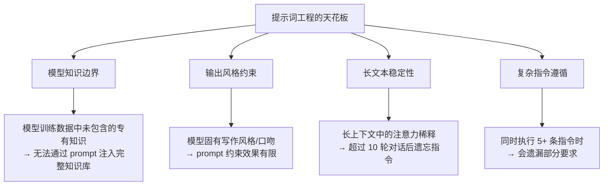
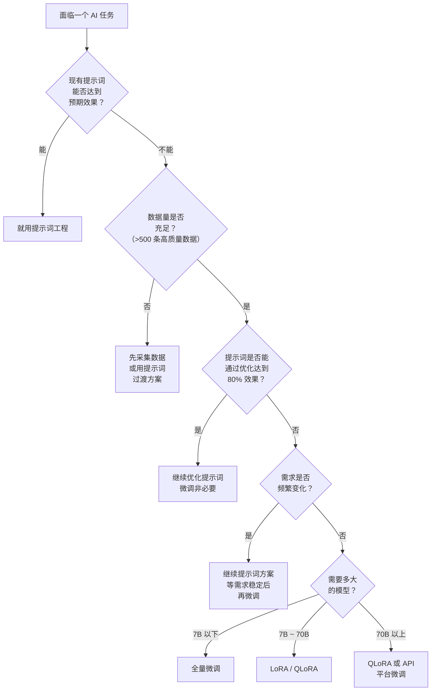
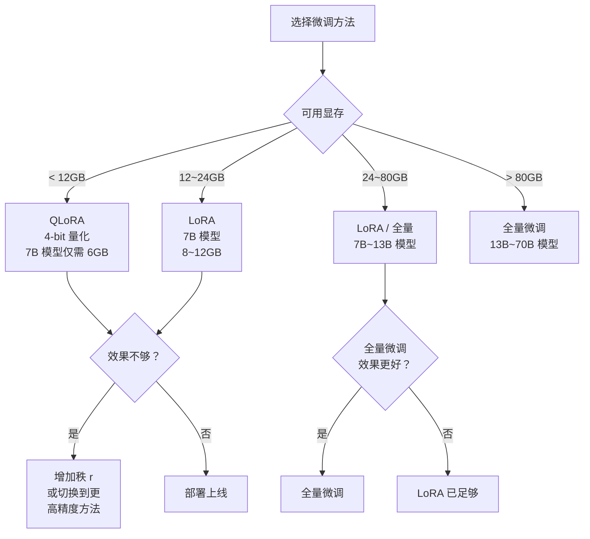

# 第1章 · 微调 vs 提示词工程 — 选择正确的路线

> **时长**：约 2.5 小时 ｜ **难度**：⭐⭐ ｜ **类型**：概念 + 决策
>
> **目标**：理解微调和提示词工程的本质区别，掌握何时选择微调的决策框架，了解主流微调方法的选型指南

---

## 学习目标

学完本章后，你将能够：
- 清晰区分微调与提示词工程的适用边界
- 用决策树判断具体场景该走哪条路线
- 计算微调的 ROI（投入产出比）
- 了解全量微调、LoRA、QLoRA、Adapter 等方法的区别
- 为项目选择正确的微调策略

---

## 知识地图



---

# 第一部分：两种方法对比

## 1、提示词工程

**概念定义**：提示词工程（Prompt Engineering）是通过精心设计输入文本的措辞、结构和格式，引导预训练大模型在**不修改任何模型参数**的前提下，生成符合预期输出的技术。

### 1.1.1 原理：引导模型行为

提示词工程依赖模型在预训练阶段已经习得的知识和能力。它通过以下方式影响模型输出：

- **指令明确化**：用清晰的任务描述告诉模型要做什么
- **提供上下文**：在对话历史或 system prompt 中注入背景信息
- **Few-Shot 示例**：给模型展示几个输入输出对，让模型"照猫画虎"
- **格式约束**：要求模型以特定格式输出（JSON、Markdown、XML 等）

```python
# 提示词工程的典型做法——零成本、高灵活性
system_prompt = "你是一个专业的法律文书助手。请将用户输入的口语描述转化为正式的法律条款表述。"
user_input = "我和房东签了合同，但他不修空调"
response = llm.invoke([
    {"role": "system", "content": system_prompt},
    {"role": "user", "content": user_input}
])
```

### 1.1.2 优势：快速、灵活、低成本

| 优势 | 说明 |
|------|------|
| 快速迭代 | 修改 prompt 即时生效，无需训练等待 |
| 灵活切换 | 同一模型可适应多种任务，换 prompt 即可 |
| 低成本 | 无需 GPU 训练，仅需 API 调用费用 |
| 无维护负担 | 依赖模型提供方维护基座模型 |

### 1.1.3 局限：受限于模型能力



---

## 2、模型微调

**概念定义**：模型微调（Fine-tuning）是在预训练模型的基础上，使用特定领域的数据集继续训练，**更新模型的权重参数**，使模型在特定任务上表现更优。微调**永久性地改变了模型的行为**。

### 2.1.1 原理：调整模型参数

微调的核心思想是"站在巨人的肩膀上"。预训练模型已经学习了海量的通用知识，微调通过在特定任务数据上进行额外训练，让模型的参数朝向目标任务方向调整：

- **全量微调**：更新所有参数，资源消耗大
- **参数高效微调**：只更新少量新增参数，冻结大部分预训练权重

### 2.1.2 优势：定制化、一致性

| 优势 | 说明 |
|------|------|
| 深度定制 | 模型能学到专有术语、独特风格和领域知识 |
| 输出一致 | 同一输入永远得到相同风格的输出 |
| 降低推理成本 | 更小的模型达到与更大模型 + prompt 同等的效果 |
| 离线可用 | 微调后的模型可本地部署，不依赖外部 API |

### 2.1.3 局限：数据要求、成本

| 局限 | 说明 |
|------|------|
| 数据门槛 | 需要高质量、标注好的领域数据集 |
| 训练成本 | 需要 GPU 资源，训练耗时 |
| 维护成本 | 模型版本管理、数据版本管理 |
| 过拟合风险 | 数据量不足或质量不高时效果反而变差 |

---

## 3、本质区别对比

| 对比维度 | 提示词工程 | 模型微调 |
|---------|-----------|---------|
| 是否修改参数 | 否 | 是 |
| 迭代速度 | 秒级（修改 prompt） | 小时~天级（训练时间） |
| 推理速度 | 无影响 | 无影响 |
| 推理成本 | 不变 | 可降低（用更小模型） |
| 知识注入 | 通过上下文注入 | 内化到模型参数中 |
| 一致性 | 一般（受 prompt 衰减影响） | 高（固化在权重中） |
| 离线部署 | 需要 API | 可完全本地化 |
| 适合任务 | 通用、多变的场景 | 特定、稳定的场景 |

---

# 第二部分：何时选择微调

## 4、适合微调的场景

### 4.1.1 特定领域术语

当业务涉及大量专有名词、行业黑话、内部缩写时，提示词工程很难让模型"记住"这些术语的准确含义。例如：

- **医疗领域**：药品商品名与化学名的对应关系、疾病编码系统（ICD-10）
- **法律领域**：法条编号体系、判例引用格式、法律文书模板
- **金融领域**：金融产品代码、监管文件编号、内部风控术语

```python
# ❌ 提示词工程的困境——术语太多，prompt 写不下
prompt = "请识别以下金融交易中的异常行为。注意：我们的内部代码含义如下：..."
# 仅内部风控代码就有 200+ 个，prompt 无法容纳

# ✅ 微调后的模型——术语已内化到参数中
# 直接用最简单的 prompt 即可
```

### 4.1.2 独特输出风格

当要求模型的输出严格遵循特定的风格、格式或模板时，微调是最可靠的方案：

- **品牌调性**：用固定的口吻、用词习惯和语气
- **固定模板**：输出必须严格遵循公司规定的报表/文档格式
- **多语言翻译**：特定领域的术语翻译规则固化

### 4.1.3 复杂格式要求

模型对严格遵守格式约束的提示词容易出现"格式崩坏"。例如：

- 输出必须严格按照特定 JSON Schema
- 表格输出必须包含特定列且顺序固定
- 代码生成必须遵循特定代码风格指南

### 4.1.4 大规模一致性需求

当你需要成千上万次请求保持风格完全一致时：

| 方案 | 一致性 | 成本 |
|------|--------|------|
| 提示词工程 | 80%~90% | 每次调用 + 长 prompt 成本 |
| 模型微调 | 98%~99% | 一次性训练 + 短 prompt 成本 |

### 4.1.5 延迟敏感场景

微调允许用更小的模型（如 7B 参数量）达到大模型（如 70B + 长 prompt）的效果，推理速度提升数倍：

- 实时客服系统：TP99 < 500ms
- 高频交易分析：单次推理 < 100ms
- 嵌入式/边缘设备：模型需要在本地运行

---

## 5、不适合微调的场景

### 5.1.1 可用提示词解决

这是最常见的误区。在投入微调之前，先用提示词工程充分测试，确认瓶颈确实在模型能力而非 prompt 设计上。

**判断原则**：如果人工标注者只需阅读 prompt 就能准确完成任务 → 大概率不需要微调，微调提示词即可。

### 5.1.2 数据量不足

微调需要一定量的高质量数据才能看到效果。经验法则：

| 任务类型 | 最小数据量 | 建议数据量 | 最佳数据量 |
|---------|-----------|-----------|-----------|
| 简单分类 | 100 条 | 500~1000 条 | 3000+ 条 |
| 格式迁移 | 200 条 | 500~2000 条 | 5000+ 条 |
| 复杂生成 | 500 条 | 2000~5000 条 | 10000+ 条 |
| 知识注入 | 1000 条 | 5000+ 条 | 20000+ 条 |

### 5.1.3 需求频繁变化

如果业务需求每周都在变，微调的"慢"（训练 + 部署）完全跟不上变化节奏。此时应该用提示词工程快速迭代，等到需求稳定后再考虑微调。

### 5.1.4 预算有限

| 方案 | 最低投入 | 每次变更成本 |
|------|---------|-------------|
| 提示词工程 | 0（仅 API 费） | 0 |
| LoRA 微调（7B） | ~$10（云 GPU） | ~$10 |
| 全量微调（70B） | ~$1000+（多卡 A100） | ~$1000+ |

---

## 6、决策流程图



---

# 第三部分：成本收益分析

## 7、微调成本构成

### 7.1.1 数据准备成本

这是最容易被低估的环节。高质量数据的准备通常占整个微调项目时间的 60%~80%：

| 成本项 | 说明 | 估算 |
|-------|------|------|
| 数据采集 | 从业务系统提取、爬取、日志收集 | ~2~5 人天 |
| 数据清洗 | 去重、过滤、格式统一 | ~1~3 人天 |
| 人工标注 | 标注/审核每条数据 | ~5~20 人天（取决于数据量） |
| 质量抽检 | 检查标注质量 | ~0.5~1 人天 |

### 7.1.2 训练成本

以 LoRA 微调 7B 模型为例：

| 配置 | GPU 类型 | 训练时长 | 成本 |
|------|---------|---------|------|
| LoRA 7B (r=8) | A10 24GB | 2~4 小时 | ~$3~6 |
| LoRA 7B (r=16) | A10 24GB | 4~8 小时 | ~$6~12 |
| QLoRA 7B (4bit) | T4 16GB | 3~6 小时 | ~$2~4 |
| 全量微调 7B | A100 80GB × 4 | 10~20 小时 | ~$100~200 |
| 全量微调 70B | A100 80GB × 8 | 50~100 小时 | ~$2000~4000 |

### 7.1.3 托管成本

| 部署方案 | 月成本估算 | 适用场景 |
|---------|-----------|---------|
| 云端 API（如 OpenAI） | 按量计费 | 小流量、起步阶段 |
| 单 GPU 部署（T4） | ~$200~300/月 | 低流量生产环境 |
| 多 GPU 部署（A10 × 2） | ~$600~1000/月 | 中高流量生产环境 |
| 自建服务器 | 一次性投入 ~$5000~30000 | 高流量、数据安全要求高 |

### 7.1.4 维护成本

- 模型监控：响应质量监控、漂移检测
- 定期重训：数据积累到一定量后需重新微调
- 版本管理：模型版本、数据版本、训练配置的追踪

---

## 8、收益评估

### 8.1.1 质量提升

微调带来的质量提升体现在：

- **准确率**：分类/提取任务的准确率通常提升 5%~20%
- **格式符合率**：输出符合预期格式的比例从 70%~80% 提升到 98%+
- **用户满意度**：回答更贴合业务场景，用户反馈更好

### 8.1.2 推理成本降低

微调后可以用更小的模型达成同样的效果。以翻译任务为例：

| 方案 | 每百万 Token 成本 | 质量评分 |
|------|-----------------|---------|
| GPT-4 + 长 prompt | $30 | 95 分 |
| GPT-3.5 + 长 prompt | $3 | 85 分 |
| 微调后的 7B 模型 | $0.4（自部署） | 93 分 |

**结论**：微调 7B 模型的推理成本是 GPT-4 的 1/75，同时质量接近。

### 8.1.3 用户体验改善

- **响应速度更快**：自部署模型省去了网络延迟和排队时间
- **服务更稳定**：不依赖第三方 API 的可用性
- **数据更安全**：所有请求在自有基础设施内完成

---

## 9、ROI 计算示例

**场景**：某电商平台需要自动生成商品描述，日调用量 10 万次。

**方案 A：GPT-4 + 提示词工程**
- API 成本：10 万次 × 2000 tokens × $30/M tokens = $60/天
- 年成本：$60 × 365 = $21,900
- 质量：95 分

**方案 B：微调 7B 模型 + 自部署**
- 训练成本（一次性）：$500
- GPU 月租：$500/月
- 年成本：$500 + $500 × 12 = $6,500
- 质量：93 分
- 节省：$15,400/年

> **结论**：对于大流量场景，微调的投入可以在 1~2 个月内回本。

---

# 第四部分：微调方法概览

## 10、全量微调

**概念定义**：全量微调（Full Fine-tuning）对预训练模型的所有参数进行更新训练。模型从基座模型的权重出发，在目标任务数据上完成完整的前向传播和反向传播。

**核心定位**：效果最好，但计算代价最高。适合需要最大程度定制化且有充足 GPU 资源的场景。

**优势**：
- 理论上可达到最优效果
- 模型所有参数都为目标任务调整
- 适合数据量充足的大型项目

**劣势**：
- 需要大量 GPU 显存（7B 模型需要 ~60GB+ 显存）
- 训练速度慢
- 模型副本占用大量存储空间（每个微调版本需存储全部参数）

---

## 11、参数高效微调（PEFT）

**概念定义**：参数高效微调（Parameter-Efficient Fine-Tuning，PEFT）在冻结大部分预训练参数的前提下，只更新少量新增/选中的参数，大幅降低计算资源需求。

### 11.1 LoRA

**概念定义**：LoRA（Low-Rank Adaptation）在预训练权重矩阵旁添加低秩分解矩阵对（A 和 B），仅训练这两个小矩阵。推理时可将 LoRA 权重合并回原模型，不增加推理延迟。

**核心定位**：目前最主流的 PEFT 方法，在效果和效率之间达到最佳平衡。

- 参数量仅为原模型的 0.1%~1%
- 可训练参数量与秩 r 有关（通常 r=8~32）
- 支持热插拔：同一个基座模型可加载不同的 LoRA 权重应对不同任务

### 11.2 QLoRA

**概念定义**：QLoRA 在 LoRA 的基础上引入 4-bit 量化，将基座模型量化为 NF4 精度，进一步降低显存需求。一个 7B 模型仅需 ~6GB 显存即可微调。

**核心定位**：为显存有限的个人开发者而生——消费级显卡也能微调大模型。

- 4-bit NormalFloat（NF4）量化
- 双重量化（Double Quantization）
- 分页优化器（Paged Optimizer）处理显存溢出

### 11.3 Adapter

- 在 Transformer 层中插入小的全连接网络（瓶颈结构）
- 每层 Transformer 增加 2 个 Adapter
- 参数量约为原模型的 2%~5%

### 11.4 Prefix Tuning

- 在输入序列前添加可学习的虚拟 Token（Prefix）
- 只更新 Prefix 的 embedding，不更新模型
- 适合文本生成任务，控制生成风格

---

## 12、方法选型指南



**选型建议**：

| 条件 | 推荐方法 | 理由 |
|------|---------|------|
| 学生/个人开发者 | QLoRA | 消费级显卡可用 |
| 初创公司快速验证 | LoRA | 性价比最高 |
| 大厂核心业务 | 全量微调 | 追求极致效果 |
| 多任务场景 | LoRA + Adapter | 热插拔切换 |
| 推理延迟敏感 | LoRA | 合并后零额外延迟 |

---

## 常见踩坑

1. **盲目选择微调**：花了几千块训练后发现还不如精心设计的 prompt 效果好 —— 先做提示词工程实验，确认瓶颈后再微调
2. **忽略数据质量**：80% 的微调效果取决于数据质量，而不是训练技巧 —— 花最多时间在数据准备上
3. **全量微调导致灾难性遗忘**：模型学新任务时忘记了之前学过的能力 —— 保留 10%~20% 的通用数据混合训练
4. **训练数据太少就急于微调**：100 条数据训练后效果不升反降 —— 先用 prompt 试错，积累到 500+ 条再微调
5. **高估了微调的通用性**：微调后的模型只在目标任务上表现好，在其他任务上可能比基座模型更差 —— 仅用于特定场景

---

## 课后练习

1. 列出你工作中 3 个可能用到 AI 的场景，逐一判断：提示词工程是否足够？如果不够，需要多少数据？
2. 打开 OpenAI Playground，用同一个任务分别测试：a）极简 prompt；b）详细 prompt + Few-Shot；c）记录二者差距，判断是否值得微调
3. 计算一个具体场景的微调 ROI：假设你要微调一个客服模型，日调用 5 万次，当前使用 GPT-4，计算微调方案的回本周期
4. 调研一个公开的 LoRA 微调项目（如 Alpaca-LoRA），回答：用了什么基座模型？数据量多少？最终效果提升多少？

---

## 本节小结

- ✅ 理解了提示词工程和微调的本质区别——是否修改模型参数
- ✅ 掌握了微调的决策框架：先尝试提示词、确认数据量、评估需求稳定性
- ✅ 能计算微调的 ROI，包括数据、训练、托管、维护四类成本
- ✅ 了解了 LoRA / QLoRA / Adapter / Prefix Tuning 等 PEFT 方法
- ✅ 掌握了不同方法的选择逻辑：依据显存、效果需求和场景类型
- ✅ 能够为具体项目选择合适的微调策略

---

> **下一章**：第2章 · 数据准备与清洗——高质量数据集构建
