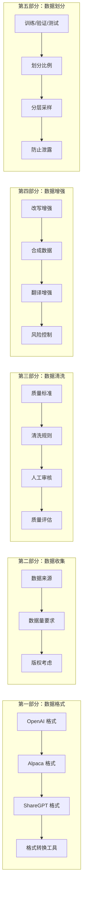
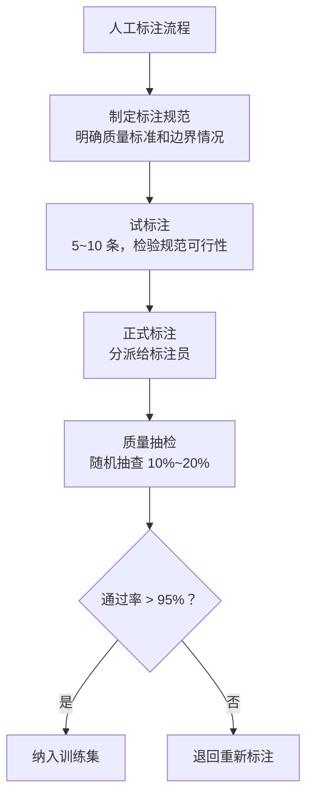
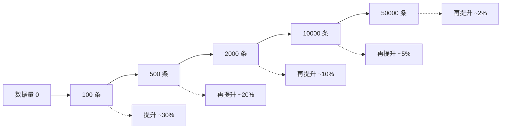
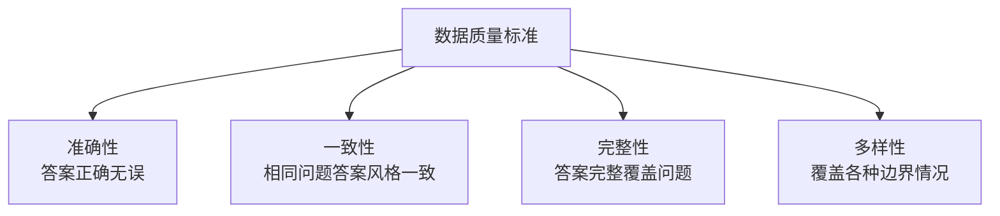
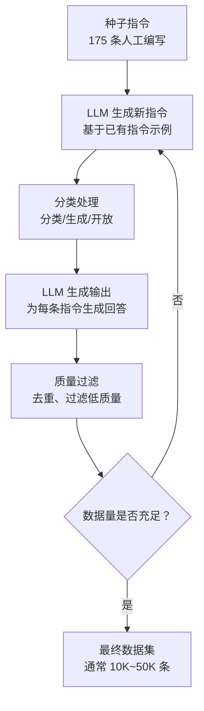
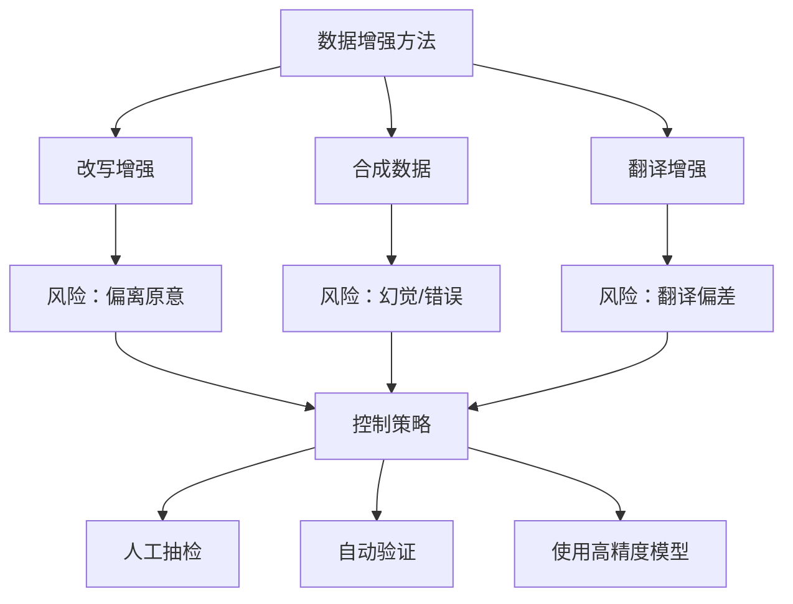

# 第2章 · 数据准备与清洗 — 高质量数据集构建

> **时长**：约 3.5 小时 ｜ **难度**：⭐⭐⭐ ｜ **类型**：动手实操
>
> **目标**：掌握微调数据集的全套构建流程，从格式规范、数据收集、质量清洗到数据增强和训练集划分

---

## 学习目标

学完本章后，你将能够：
- 掌握 OpenAI、Alpaca、ShareGPT 三种主流数据格式的转换
- 设计满足微调需求的数据采集方案
- 执行完整的数据清洗流程（去重、过滤、格式验证）
- 使用 Self-Instruct 和 Evol-Instruct 方法进行数据增强
- 正确划分训练集、验证集和测试集，防止数据泄露

---

## 知识地图



---

# 第一部分：数据格式规范

## 1、对话格式

**概念定义**：微调数据以对话/指令对的形式组织。不同的训练框架和平台要求不同的数据格式。选择合适的格式是微调的第一步。

### 1.1.1 OpenAI 格式

OpenAI 微调 API 使用 JSONL（JSON Lines）格式，每行一个 JSON 对象，包含 `messages` 数组：

```jsonl
{"messages": [{"role": "system", "content": "你是一个专业的中英文翻译助手。"}, {"role": "user", "content": "翻译成英文：今天天气真好。"}, {"role": "assistant", "content": "The weather is great today."}]}
{"messages": [{"role": "system", "content": "你是一个专业的中英文翻译助手。"}, {"role": "user", "content": "翻译成英文：这道菜很好吃。"}, {"role": "assistant", "content": "This dish is delicious."}]}
```

**格式要求**：
- 每条数据必须有 `messages` 字段
- `messages` 中至少包含 1 条 user 和 1 条 assistant 消息
- system 消息可选，但建议保留以稳定模型行为
- 所有 content 必须是字符串（不支持多模态输入）

### 1.1.2 Alpaca 格式

由 Stanford Alpaca 项目推广，以 `instruction` / `input` / `output` 三个字段组织：

```jsonl
{"instruction": "将以下中文翻译成英文", "input": "今天天气真好。", "output": "The weather is great today."}
{"instruction": "将以下中文翻译成英文", "input": "这道菜很好吃。", "output": "This dish is delicious."}
```

**格式说明**：
- `instruction`：任务指令（必填）
- `input`：任务输入（可选，无输入时可留空字符串）
- `output`：期望的输出（必填）

许多开源训练框架（如 FastChat、LLaMA-Factory）支持此格式。Alpaca 格式比 OpenAI 格式更简洁，但缺少 role 语义。

### 1.1.3 ShareGPT 格式

由 ShareGPT 项目推广，用于存储真实的人机对话：

```jsonl
{"conversations": [{"from": "human", "value": "翻译成英文：今天天气真好。"}, {"from": "gpt", "value": "The weather is great today."}, {"from": "human", "value": "再翻译成日文"}, {"from": "gpt", "value": "今日の天気は本当にいいですね。"}]}
```

**核心特点**：
- 支持多轮对话
- `from` 字段标识消息来源（human / gpt）
- `value` 字段存储对话内容
- 适合从真实对话记录构建训练数据

---

## 2、指令格式

### 2.1.1 instruction / input / output 详解

```python
# 标准 Alpaca 格式
data = {
    "instruction": "根据产品描述生成营销文案",
    "input": "一款智能保温杯，可显示水温，续航30天",  # 可选
    "output": "【智温杯】不烫嘴的智能保温杯！\n✓ 实时显示水温\n✓ 30天超长续航\n✓ 316不锈钢内胆\n让每一口水都恰到好处！"
}

# 无需输入的任务，input 留空
data = {
    "instruction": "写一首关于人工智能的五言绝句",
    "input": "",
    "output": "智海无边际，\n深学探未知。\n算法通天际，\n万物可思齐。"
}
```

### 2.1.2 单轮 vs 多轮对话

```python
# 单轮对话
{
    "instruction": "解释什么是微调",
    "input": "",
    "output": "微调是在预训练模型基础上使用特定领域数据继续训练..."
}

# 多轮对话（ShareGPT 格式）
{
    "conversations": [
        {"from": "human", "value": "什么是微调？"},
        {"from": "gpt", "value": "微调是在预训练模型基础上..."},
        {"from": "human", "value": "那微调和提示词工程有什么区别？"},
        {"from": "gpt", "value": "核心区别在于是否修改模型参数..."}
    ]
}
```

多轮对话数据的价值在于让模型学会在上下文的基础上延续对话，而非每次独立回答。

---

## 3、格式转换工具

**概念定义**：格式转换工具将不同来源的数据统一为目标训练框架所需的格式。

### ▶ 执行代码

```powershell
cd code/
python 01_data_format.py
```

```python
# 格式转换示例：Alpaca → OpenAI
def alpaca_to_openai(data: dict) -> dict:
    system_prompt = "你是一个有用的AI助手。"
    messages = [{"role": "system", "content": system_prompt}]
    
    if data.get("input"):
        user_content = f"{data['instruction']}\n\n{data['input']}"
    else:
        user_content = data['instruction']
    
    messages.append({"role": "user", "content": user_content})
    messages.append({"role": "assistant", "content": data['output']})
    return {"messages": messages}

# ShareGPT → OpenAI
def sharegpt_to_openai(data: dict) -> dict:
    role_map = {"human": "user", "gpt": "assistant"}
    messages = []
    for turn in data["conversations"]:
        messages.append({
            "role": role_map.get(turn["from"], turn["from"]),
            "content": turn["value"]
        })
    return {"messages": messages}
```

> **注意**：训练数据的格式必须与训练框架完全匹配。错误的格式会导致训练失败或模型行为异常。

---

# 第二部分：数据收集

## 4、数据来源

### 4.1.1 业务日志

最珍贵的数据来源——真实的用户请求和理想的人工回复：

| 来源 | 示例 | 优势 | 劣势 |
|------|------|------|------|
| 客服对话 | 用户问题 + 客服回答 | 真实场景、覆盖面广 | 需要脱敏清洗 |
| QA 系统日志 | 问题 + 最佳答案 | 高质量配对 | 可能偏向高频问题 |
| AI 产品使用记录 | 用户 query + 人工修正 | 直接反映用户需求 | 冷启动阶段数据少 |

### 4.1.2 人工标注

针对特定任务雇佣标注员或邀请领域专家创建训练数据：



### 4.1.3 现有文档

利用企业已有的知识文档构建训练数据：

- 产品手册 → QA 对
- 知识库文章 → 摘要 + 细节
- 代码仓库注释 → 代码解释对
- 历史邮件 → 正式回复风格

### 4.1.4 公开数据集

| 数据集 | 规模 | 适合场景 | 获取方式 |
|--------|------|---------|---------|
| Alpaca 52K | 52K 条 | 指令跟随 | Hugging Face |
| Dolly 15K | 15K 条 | 多种任务 | Hugging Face |
| OpenAssistant | 161K 条 | 对话生成 | Hugging Face |
| ShareGPT | 百万级 | 真实对话 | 社区资源 |

> ⚠️ 使用公开数据集时务必检查**版权协议和许可条款**，避免商业使用的法律风险。

---

## 5、数据量要求

### 5.1.1 最小数据量

不同类型任务对数据量的需求差异很大：

| 任务类型 | 最低要求 | 可观测效果 | 说明 |
|---------|---------|-----------|------|
| 格式迁移 | 50~100 条 | 立即 | 模型只需学习输出格式 |
| 简单分类 | 100~300 条 | 500 条 | 类别边界清晰时效果明显 |
| 风格模仿 | 200~500 条 | 1000 条 | 风格需要一定样本量才能固化 |
| 知识注入 | 500~2000 条 | 5000 条 | 新知识需要大量重复 |
| 复杂推理 | 1000~5000 条 | 10000 条 | 推理链需要大量示例 |

### 5.1.2 边际效益



**核心洞察**：前 500~2000 条数据贡献了 70%~80% 的效果提升，之后数据量的边际效益递减。不要追求数量而牺牲质量。

### 5.1.3 质量 > 数量

一条高质量数据的价值可能超过 10 条低质量数据：

| 数据质量 | 表现 |
|---------|------|
| 高质量 | 准确、完整、多样、格式规范、无噪声 |
| 低质量 | 错误、含混、重复、格式混乱、有噪声 |

**建议**：宁可花时间清洗 2000 条高质量数据，也不要图省事收集 20000 条未清洗的数据。

---

## 6、数据版权考虑

这是微调项目中最容易被忽视的法律风险：

| 风险类型 | 说明 | 应对措施 |
|---------|------|---------|
| 受版权保护的文本 | 书籍、文章、代码仓库 | 使用公开许可/自行生成 |
| 个人隐私数据 | 姓名、电话、地址 | 脱敏处理或过滤 |
| 商业机密 | 内部策略、客户信息 | 签名保密协议 |
| API 使用条款 | 某些平台禁止使用其输出训练 | 仔细阅读条款 |

---

# 第三部分：数据质量控制

## 7、质量标准定义

### 7.1.1 四个核心维度



| 维度 | 检查内容 | 通过标准 |
|------|---------|---------|
| 准确性 | 事实性错误 | 每条数据经过验证 |
| 一致性 | 风格、格式、长度 | 同类型数据无明显差异 |
| 完整性 | 是否完整回答问题 | 无截断、无遗漏关键信息 |
| 多样性 | 覆盖各种输入类型 | 包含正常、边界、异常案例 |

---

## 8、清洗规则

**概念定义**：数据清洗是通过预设规则自动检测和修复数据中的问题，确保进入训练集的数据符合质量要求。

### ▶ 执行代码

```powershell
cd code/
python 02_data_cleaning.py
```

### 8.1.1 去重

重复数据会扭曲训练分布，导致模型对特定输入过拟合：

```python
def deduplicate(data_list: list[dict], similarity_threshold: float = 0.85) -> list[dict]:
    """基于文本相似度去重"""
    unique_data = []
    seen_texts = set()
    
    for item in data_list:
        # 提取文本内容去重
        text = item.get("output", "") or item.get("messages", [{}])[-1].get("content", "")
        
        # 简单去重：精确匹配
        text_hash = hashlib.md5(text.encode()).hexdigest()
        if text_hash not in seen_texts:
            seen_texts.add(text_hash)
            unique_data.append(item)
    
    return unique_data
```

### 8.1.2 长度过滤

过短的回答缺乏信息量，过长的回答可能包含无关内容：

| 任务类型 | 最短长度 | 最长长度 | 说明 |
|---------|---------|---------|------|
| 分类/打分 | 1 个词 | 50 字 | 简短输出即可 |
| 翻译 | 10 字 | 500 字 | 与原文长度对应 |
| 摘要 | 20 字 | 200 字 | 比原文短 |
| 生成/对话 | 10 字 | 2000 字 | 视场景而定 |

### 8.1.3 格式验证

确保每条数据的结构完整：

```python
def validate_openai_format(data: dict) -> bool:
    """验证 OpenAI 格式的完整性"""
    if "messages" not in data:
        return False
    if not isinstance(data["messages"], list):
        return False
    if len(data["messages"]) < 2:
        return False
    for msg in data["messages"]:
        if "role" not in msg or "content" not in msg:
            return False
        if msg["role"] not in ("system", "user", "assistant"):
            return False
        if not isinstance(msg["content"], str) or len(msg["content"]) == 0:
            return False
    return True
```

### 8.1.4 敏感内容过滤

```python
def filter_sensitive_content(data: list[dict]) -> list[dict]:
    """过滤包含敏感信息的数据"""
    import re
    
    # 手机号正则
    phone_pattern = re.compile(r'1[3-9]\d{9}')
    # 身份证号正则
    id_pattern = re.compile(r'\d{17}[\dXx]')
    # 邮箱正则
    email_pattern = re.compile(r'[a-zA-Z0-9._%+-]+@[a-zA-Z0-9.-]+\.[a-zA-Z]{2,}')
    
    clean_data = []
    for item in data:
        text = str(item)
        has_sensitive = any([
            phone_pattern.search(text),
            id_pattern.search(text),
            email_pattern.search(text),
        ])
        if not has_sensitive:
            clean_data.append(item)
    
    return clean_data
```

---

## 9、人工审核

### 9.1.1 审核流程

自动化清洗之后，人工审核是最后一道质量屏障：

1. **抽样策略**：随机抽样 + 重点抽样（边界案例）
2. **审核维度**：准确性、一致性、完整性、多样性
3. **问题分级**：
   - **P0**（严重错误）：事实错误、格式错误 → 直接删除
   - **P1**（需修改）：表述不准确、风格不统一 → 修改
   - **P2**（轻微问题）：不够简洁、措辞可优化 → 可留用或修改

### 9.1.2 审核标准示例

| 评分 | 定义 | 处理方式 |
|------|------|---------|
| 5 分 | 完美——准确、完整、格式规范 | 直接入库 |
| 4 分 | 良好——有小瑕疵但不影响使用 | 直接入库 |
| 3 分 | 及格——有较多问题但核心正确 | 人工修改后入库 |
| 2 分 | 差——有事实错误或格式严重问题 | 删除 |
| 1 分 | 完全不可用 | 删除 |

---

## 10、质量评估指标

### 10.1.1 自动化指标

```python
def quality_report(data: list[dict]) -> dict:
    """生成数据质量报告"""
    n = len(data)
    report = {
        "总条数": n,
        "平均长度": sum(len(str(d)) for d in data) / n,
        "去重后条数": len(set(str(d) for d in data)),
        "重复率": f"{(1 - len(set(str(d) for d in data)) / n) * 100:.1f}%",
        "空值检查": sum(1 for d in data if not any(d.values())) if data else 0,
        "格式错误": sum(1 for d in data if not validate_openai_format(d)),
    }
    return report
```

### 10.1.2 数据分布检查

- **指令长度分布**：确保涵盖长短不一的指令
- **输出长度分布**：确保输出长度多样
- **主题分布**：确保覆盖不同主题领域
- **难度分布**：包含简单、中等、困难三种级别的样本

---

# 第四部分：数据增强

## 11、改写增强

**概念定义**：在不改变数据语义的前提下，通过改写扩充数据的多样性，提高模型的泛化能力。

### 11.1.1 同义替换

```python
# 同义替换示例（基于规则）
synonyms = {
    "翻译": ["将以下内容翻译", "请翻译", "转换为", "译成"],
    "解释": ["说明", "阐述", "解释一下", "讲讲"],
    "总结": ["概括", "归纳", "提炼要点", "摘要"],
}

def synonym_augment(instruction: str) -> str:
    """同义替换增强"""
    for word, replacements in synonyms.items():
        if word in instruction:
            import random
            instruction = instruction.replace(word, random.choice(replacements))
            break
    return instruction
```

### 11.1.2 LLM 改写

使用 LLM 本身对现有数据进行改写，是最高效的增强方式：

```
原始指令：将以下中文翻译成英文
改写后：请将下列中文内容译成英文，保持原意
改写后：Translate the following Chinese text into English
改写后：帮我把这段中文翻译成英文，谢谢
```

## 12、合成数据

**概念定义**：利用 LLM 自动生成训练数据，是从少量种子数据扩展到大规模数据集的核心技术。

### 12.1.1 Self-Instruct

由 Stanford Alpaca 项目提出，核心流程：



**关键要点**：
- 种子指令需要覆盖多样化的任务类型
- 生成的指令去重非常重要（基于 ROUGE-L 相似度）
- 生成的回答质量需要二次验证

### 12.1.2 Evol-Instruct

由 WizardLM 项目提出，在 Self-Instruct 基础上增加了"进化"机制：

1. **深度进化**：将简单指令变得更复杂，增加约束条件
2. **广度进化**：从简单指令衍生出不同类型的变体
3. **质量淘汰**：进化后的指令如果 LLM 无法回答则淘汰

```
# 原始指令
写一个 Python 函数计算斐波那契数列

# 深度进化后
写一个 Python 函数计算斐波那契数列，要求：
1. 使用递归 + 缓存（memoization）
2. 处理 n 为负数的情况
3. 添加类型注解
4. 包含单元测试
5. 时间复杂度不超过 O(n)

# 广度进化后
用 Java 实现斐波那契数列的流式计算版本
```

---

## 13、翻译增强

将高质量数据从一种语言翻译到另一种语言，快速创建多语言训练集：

```
# 英文 → 中文
Instruction: "Explain the concept of gradient descent"
Output: "Gradient descent is an optimization algorithm..."

# 中文翻译
指令："解释梯度下降的概念"  
输出："梯度下降是一种优化算法..."
```

**优势**：翻译增强保留了原始数据的质量，同时拓展了语言覆盖范围。

**风险**：翻译质量直接影响增强数据质量。建议用人工审核或高精度翻译模型（而非 NMT）。

---

## 14、增强风险：噪声引入



**核心原则**：增强数据必须经过质量验证才能进入训练集，不可直接混用。

---

# 第五部分：数据集划分

## 15、训练集 / 验证集 / 测试集

**概念定义**：
- **训练集**：模型学习用的数据，用于梯度更新
- **验证集**：调参和早停用的数据，每个 epoch 后评估
- **测试集**：最终评估模型效果的数据，仅在训练完成后使用一次

### 15.1.1 划分比例

| 数据集 | 比例 | 用途 | 评估频率 |
|--------|------|------|---------|
| 训练集 | 80% | 模型训练 | 每个 batch |
| 验证集 | 10% | 调参、早停 | 每个 epoch |
| 测试集 | 10% | 最终评估 | 仅一次 |

### ▶ 执行代码

```powershell
cd code/
python 04_dataset_split.py
```

```python
from sklearn.model_selection import train_test_split

def split_dataset(data: list, train_ratio=0.8, val_ratio=0.1, test_ratio=0.1, stratify=None):
    """划分数据集"""
    assert abs(train_ratio + val_ratio + test_ratio - 1.0) < 1e-6
    
    # 先分出测试集
    train_val, test = train_test_split(
        data, test_size=test_ratio, random_state=42, stratify=stratify
    )
    
    # 剩余部分按比例分训练和验证
    val_adjusted = val_ratio / (train_ratio + val_ratio)
    train, val = train_test_split(
        train_val, test_size=val_adjusted, random_state=42, 
        stratify=stratify[train_val.index] if stratify is not None else None
    )
    
    return train, val, test
```

---

## 16、分层采样

**概念定义**：在划分数据集时保持各组数据中各类别/难度的比例与原数据集一致。

**为什么要分层采样**：
- 防止验证集/测试集中的类别分布偏差
- 确保每个子集都代表整体数据
- 使评估结果更可靠

```python
# 不分层采样 → 小类别可能在验证集中缺失
# 分层采样 → 每类数据在各集合中比例一致

def stratified_split(data, labels, ratios=[0.8, 0.1, 0.1]):
    """分层采样"""

    from sklearn.model_selection import StratifiedShuffleSplit
    sss = StratifiedShuffleSplit(n_splits=1, test_size=ratios[1]+ratios[2], random_state=42)
    
    train_idx, temp_idx = next(sss.split(data, labels))
    train_data = [data[i] for i in train_idx]
    temp_labels = [labels[i] for i in temp_idx]
    temp_data = [data[i] for i in temp_idx]
    
    val_ratio = ratios[1] / (ratios[1] + ratios[2])
    sss2 = StratifiedShuffleSplit(n_splits=1, test_size=1-val_ratio, random_state=42)
    val_idx, test_idx = next(sss2.split(temp_data, temp_labels))
    
    val_data = [temp_data[i] for i in val_idx]
    test_data = [temp_data[i] for i in test_idx]
    
    return train_data, val_data, test_data
```

---

## 17、防止数据泄露

**概念定义**：数据泄露指训练集的信息在训练过程中被验证集或测试集"看到"，导致评估结果虚高，实际上线效果远不如预期。

### 17.1.1 常见数据泄露场景

| 泄露场景 | 示例 | 后果 |
|---------|------|------|
| 重复数据跨集 | 同一问题的不同表述同时出现在训练集和测试集 | 测试准确率虚高 10%~20% |
| 时间穿越 | 未来的数据出现在训练集 | 模型无法泛化到"未来"场景 |
| 用户重叠 | 同一用户的数据同时出现在训练集和测试集 | 模型学到的是"记忆"而非"理解" |
| 特征泄露 | 测试时不可用的特征在训练时被使用 | 评估结果不可信 |

### 17.1.2 预防措施

1. **去重后再划分**：先全局去重，再划分集合
2. **按时间划分**：对于有时间戳的数据，按时间点切割（训练集用过去，测试集用未来）
3. **按用户划分**：确保同一用户的所有数据在同一个集合中
4. **数据扰动**：对测试集数据做轻微扰动，防止记忆

```python
def time_based_split(data, date_field, split_date):
    """按时间划分数据集，防止时间泄露"""
    train = [d for d in data if d[date_field] < split_date]
    test = [d for d in data if d[date_field] >= split_date]
    return train, test
```

---

## 常见踩坑

1. **数据泄露导致评估虚高**：测试集中混入了训练集的重复或相似数据 —— 先全局去重再划分，按时间/用户分层
2. **只重数量不重质量**：花了大量精力收集了 10 万条数据，但清洗不彻底，效果不如 5000 条高质量数据 —— 每个环节都要做质量检查
3. **合成数据引入系统性偏差**：Self-Instruct 生成的指令模式单一，导致模型只擅长特定句式 —— 种子指令要足够多样，控制合成比例不超过 30%
4. **忽视格式兼容性**：在 Hugging Face 框架下用 Alpaca 格式，换到 OpenAI API 微调时报错 —— 提前确认训练平台支持的数据格式
5. **数据量分布不均**：90% 的数据集中在 3 种场景，其他 20 种场景只有 10% —— 做分层采样，确保每个场景在训练集中都有代表性

---

## 课后练习

1. 准备 10 条你的业务数据，分别转换成 OpenAI、Alpaca、ShareGPT 三种格式，观察差异
2. 针对这 10 条数据，执行完整清洗流程：去重、长度过滤、格式验证、敏感内容过滤，记录通过率
3. 用 LLM 对其中 3 条指令进行 Evol-Instruct 增强，分别做深度进化和广度进化，比较增强前后差异
4. 将处理好的数据集按 8:1:1 划分，检查验证集和测试集中是否包含训练集的近似重复

---

## 本节小结

- ✅ 掌握了 OpenAI、Alpaca、ShareGPT 三种主流微调数据格式及其转换
- ✅ 了解了数据收集的四种来源：业务日志、人工标注、现有文档、公开数据集
- ✅ 掌握了数据清洗的全流程：去重、长度过滤、格式验证、敏感内容过滤
- ✅ 学会了 Self-Instruct 和 Evol-Instruct 两种数据增强方法
- ✅ 能正确划分训练/验证/测试集，并应用分层采样和防泄露措施
- ✅ 理解了"质量 > 数量"的核心原则

---

> **下一章**：第3章 · LoRA/QLoRA 实战——参数高效微调
