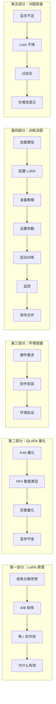
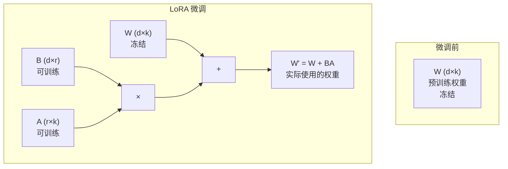
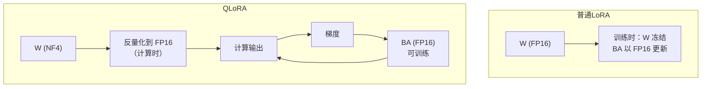
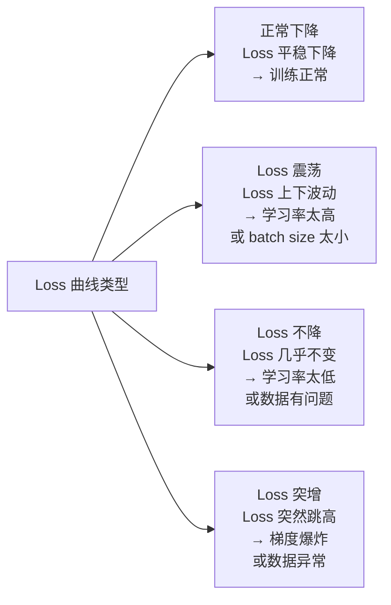

# 第3章 · LoRA/QLoRA 实战 — 参数高效微调

> **时长**：约 4 小时 ｜ **难度**：⭐⭐⭐ ｜ **类型**：动手实操
>
> **目标**：深入理解 LoRA 和 QLoRA 原理，掌握参数高效微调的完整实战流程，从环境搭建到模型训练和保存

---

## 学习目标

学完本章后，你将能够：
- 理解 LoRA 低秩分解的核心思想和数学原理
- 掌握 LoRA 关键参数（r、alpha、dropout、target_modules）的配置方法
- 用 QLoRA 在消费级显卡上微调 7B 级别的模型
- 配置训练参数（learning rate、batch size、epochs、warmup）
- 监控训练过程并判断是否收敛
- 保存、合并、导出 LoRA 权重用于推理

---

## 知识地图



---

# 第一部分：LoRA 原理详解

## 1、低秩适应的思想

**概念定义**：LoRA（Low-Rank Adaptation，低秩适应）的核心思想是：预训练大模型的权重矩阵虽然维度很高，但适应特定任务时的**权重变化量 ΔW 具有低秩性**——即 ΔW 可以通过两个更小的矩阵相乘来近似。

### 1.1.1 权重矩阵分解

预训练模型的密集层（如 attention 中的 QKV 投影矩阵）可以表示为权重矩阵 W ∈ ℝ^(d×k)。LoRA 假设 W 在适应任务时的更新量 ΔW 具有低秩性：

```
W' = W + ΔW
    = W + BA
```

其中：
- W ∈ ℝ^(d×k)：原始预训练权重（**冻结**，不更新）
- B ∈ ℝ^(d×r)：低秩矩阵（可训练）
- A ∈ ℝ^(r×k)：低秩矩阵（可训练）
- r << min(d, k)：秩，通常取 4~32



### 1.1.2 A 和 B 矩阵

**初始化策略**：
- A 矩阵：随机高斯初始化（标准差 ~1/r）
- B 矩阵：零初始化

这样在训练开始时 BA = 0，W' = W，模型输出与微调前完全一致，不会因为突然插入新参数导致训练不稳定。

### 1.1.3 秩 r 的作用

`r` 是 LoRA 中最重要的超参数，控制着可训练参数的数量和表达能力：

| 秩 r | 可训练参数量（7B 模型） | 表达力 | 建议场景 |
|------|----------------------|--------|---------|
| 4 | ~0.05% | 低 | 简单任务、数据量少 |
| 8 | ~0.1% | 中等 | 通用推荐值 |
| 16 | ~0.2% | 较高 | 复杂任务、数据充足 |
| 32 | ~0.4% | 高 | 非常复杂、接近全量微调 |
| 64 | ~0.8% | 很高 | 极少使用，接近全量微调 |

**经验法则**：r 通常取 8 或 16。r 过低可能导致欠拟合，r 过高增加过拟合风险且显存消耗增大。

---

## 2、为什么 LoRA 有效

### 2.1.1 参数效率

LoRA 的可训练参数量仅为全量微调的 0.1%~1%。以 LLaMA-7B 模型为例：

| 微调方式 | 可训练参数量 | 显存需求 | 单卡可训练 |
|---------|------------|---------|-----------|
| 全量微调 | 7B | ~60GB | 否（需要多卡） |
| LoRA (r=8) | ~4.2M | ~16GB | 是（A10 即可） |
| LoRA (r=16) | ~8.4M | ~18GB | 是（A10 即可） |
| QLoRA (4-bit, r=8) | ~4.2M | ~6GB | 是（T4 即可） |

### 2.1.2 避免遗忘

全量微调时，模型更新所有参数，容易在学新任务时**覆盖**预训练阶段学到的知识（灾难性遗忘）。LoRA 只更新少量参数，原始权重保持不变，因此：

- 模型在目标任务上表现更好
- 同时保留了预训练阶段的大部分通用能力
- 可以通过卸载 LoRA 权重"恢复"为基座模型

### 2.1.3 模块化

LoRA 权重的模块化特性带来了极大的灵活性：

```python
# 同一个基座模型，不同的 LoRA 权重应对不同任务
base_model = AutoModelForCausalLM.from_pretrained("model-path")

# 加载翻译 LoRA
translation_lora = PeftModel.from_pretrained(base_model, "lora-translation")
# 加载客服 LoRA
customer_lora = PeftModel.from_pretrained(base_model, "lora-customer-service")
# 加载代码 LoRA
code_lora = PeftModel.from_pretrained(base_model, "lora-code")

# 使用时热切换
current_lora = translation_lora  # 现在做翻译
current_lora = code_lora         # 现在写代码
```

---

## 3、LoRA 配置参数

### 3.1.1 r（秩）

**概念定义**：控制 LoRA 模块的表达能力。取值越大，可训练参数越多，但显存消耗和过拟合风险也增加。

**推荐值**：简单任务取 8，复杂任务取 16。

### 3.1.2 alpha（缩放因子）

**概念定义**：alpha 是 LoRA 权重的缩放系数。实际应用的权重更新为 `ΔW = (alpha / r) × BA`。

**核心作用**：控制 LoRA 模块对原始权重的影响强度。

- `alpha / r` 比值越大，LoRA 的影响越强
- 通常设置 alpha 为 r 的 2 倍（即 `alpha = 2r`）
- alpha = 16、r = 8 → 缩放因子 = 2
- alpha = 32、r = 16 → 缩放因子 = 2

### 3.1.3 dropout

**概念定义**：LoRA 层的 dropout 率，在训练时随机丢弃一部分 LoRA 神经元的输出，防止过拟合。

| dropout | 效果 | 建议场景 |
|---------|------|---------|
| 0 | 无 dropout | 数据量少（<500 条） |
| 0.05 | 轻度正则化 | 通用推荐值 |
| 0.1 | 中度正则化 | 数据量大（>5000 条） |
| 0.2+ | 强正则化 | 极少使用 |

### 3.1.4 target_modules

**概念定义**：指定哪些模块/层应用 LoRA。

**常见选择**：

| target_modules | 参数量 | 效果 |
|---------------|--------|------|
| q_proj, v_proj | 最少 | 基础效果 |
| q_proj, k_proj, v_proj, o_proj | 中等 | 推荐配置 |
| 全部线性层 (q/k/v/o + up/down/gate) | 最多 | 最强表达力 |

```python
# LoRA 配置示例
lora_config = LoraConfig(
    r=16,                           # 秩
    lora_alpha=32,                  # alpha = 2r
    target_modules=["q_proj", "k_proj", "v_proj", "o_proj"],  # 目标模块
    lora_dropout=0.1,               # dropout 率
    bias="none",                    # 是否训练 bias
    task_type="CAUSAL_LM",          # 任务类型
)
```

---

## 4、LoRA 变体

### 4.1.1 LoRA+

对 LoRA 的优化：A 矩阵和 B 矩阵使用不同的学习率。B 矩阵的学习率比 A 矩阵大 4 倍，加速收敛。

### 4.1.2 DoRA

**概念定义**：DoRA（Weight-Decomposed Low-Rank Adaptation）将权重分解为**方向**和**幅度**两个分量，分别用 LoRA 微调方向分量，用独立参数调整幅度分量。

**核心优势**：比原始 LoRA 更接近全量微调的表达能力，同时保持参数效率。

### 4.1.3 AdaLoRA

**概念定义**：AdaLoRA（Adaptive Budget Allocation）根据每个权重矩阵的重要性动态分配参数预算。对重要的层分配更高的秩，对不重要的层分配更低的秩。

**核心优势**：在总参数量固定的情况下，实现比均匀分配更好的效果。

---

# 第二部分：QLoRA 量化微调

## 5、4-bit 量化原理

**概念定义**：量化是将高精度浮点数（32-bit FP32）映射到低精度表示（4-bit）的过程，大幅降低模型的内存占用。

QLoRA 的核心思想是：**将基座模型量化为 4-bit，只对 LoRA 参数保持 16-bit 精度进行训练**。



---

## 6、NF4 数据类型

**概念定义**：NF4（NormalFloat4）是一种针对神经网络权重分布优化的 4-bit 数据类型。它假设神经网络权重服从零均值正态分布，将量化区间更密集地分布在零附近。

**与普通 int4 的对比**：

| 数据类型 | 位宽 | 表示范围 | 分布适配 | 精度损失 |
|---------|------|---------|---------|---------|
| FP32 | 32-bit | 最大 | 无 | 基准 |
| FP16 | 16-bit | 大 | 无 | 很小 |
| INT8 | 8-bit | 小 | 均匀 | 中 |
| INT4 | 4-bit | 很小 | 均匀 | 大 |
| NF4 | 4-bit | 很小 | 适配正态分布 | **比 INT4 小** |

NF4 相比普通 int4 在相同位宽下的精度损失更小，是 QLoRA 的关键创新。

---

## 7、双重量化

**概念定义**：双重量化（Double Quantization）是对量化常数再做一次量化。第一次量化将 FP16 权重转为 NF4，需要存储每个块的量化常数（FP32）。第二次量化将这些 FP32 常数再量化为 FP8。

**效果**：平均每个参数仅增加 ~0.5 bit 的额外存储开销。

---

## 8、显存节省效果

| 模型规模 | 全精度 (FP16) | LoRA (FP16) | QLoRA (NF4) | 节省比例 |
|---------|-------------|------------|-------------|---------|
| LLaMA-7B | ~14 GB | ~16 GB (含梯度) | ~6 GB | **~62%** |
| LLaMA-13B | ~26 GB | ~28 GB | ~10 GB | **~64%** |
| LLaMA-33B | ~66 GB | ~70 GB | ~20 GB | **~71%** |
| LLaMA-65B | ~130 GB | ~140 GB | ~36 GB | **~74%** |

**结论**：QLoRA 让单卡 T4（16GB）微调 7B 模型成为可能，是个人开发者的最佳选择。

---

## 9、精度影响

| 评估任务 | FP16 基线 | QLoRA (NF4) | 性能差距 |
|---------|-----------|-------------|---------|
| MMLU (知识推理) | 64.3% | 63.9% | -0.4% |
| HellaSwag (常识) | 85.2% | 85.0% | -0.2% |
| GSM8K (数学) | 56.8% | 56.1% | -0.7% |

**结论**：QLoRA 的性能损失通常在 1% 以内，而显存节省超过 60%——性价比极高。

---

# 第三部分：训练环境搭建

## 10、硬件要求

### 10.1.1 GPU 显存需求

| 训练方案 | 最小显存 | 推荐显存 | 适合的 GPU |
|---------|---------|---------|-----------|
| QLoRA 7B | 6 GB | 12 GB | T4、RTX 3060 |
| QLoRA 13B | 10 GB | 16 GB | RTX 3080、A10 |
| LoRA 7B | 12 GB | 16 GB | A10、RTX 4090 |
| LoRA 13B | 20 GB | 24 GB | A10G、RTX 4090 |
| 全量微调 7B | 56 GB | 80 GB × 2 | A100、H100 |
| 全量微调 13B | 104 GB | 80 GB × 4 | A100、H100 |

### 10.1.2 推荐配置

| 预算 | 推荐方案 | 估算成本 | 适合场景 |
|------|---------|---------|---------|
| 入门 | 云 GPU T4 + QLoRA | ~$0.5/小时 | 学习、原型验证 |
| 标准 | RTX 4090 + LoRA | ~$2000（一次性） | 个人项目、创业团队 |
| 专业 | A100 80G × 4 + 全量微调 | ~$5/小时 | 企业级训练 |

### 10.1.3 云 GPU 选择

| 服务商 | GPU 类型 | 价格 | 特点 |
|-------|---------|------|------|
| AutoDL | T4 / A10 / A100 | ~¥2~20/小时 | 性价比高，按量计费 |
| 阿里云 PAI | V100 / A100 | ~¥10~50/小时 | 企业级，对接阿里云生态 |
| Lambda Labs | A10 / A100 / H100 | ~$0.6~2/小时 | 国外便宜选择 |
| RunPod | A100 / H100 | ~$0.5~3/小时 | 支持断点续训 |

---

## 11、软件环境

### 11.1.1 PyTorch

```powershell
pip install torch torchvision torchaudio --index-url https://download.pytorch.org/whl/cu118
```

> **注意**：PyTorch 版本需要与 CUDA 版本匹配。先用 `nvidia-smi` 确认 CUDA 版本。

### 11.1.2 Transformers

```powershell
pip install transformers datasets accelerate
```

### 11.1.3 PEFT

```powershell
pip install peft
```

### 11.1.4 bitsandbytes (QLoRA 必需)

```powershell
# Windows 用户需要从源码安装或使用预编译版本
pip install bitsandbytes

# Linux 用户直接安装
pip install bitsandbytes
```

---

## 12、环境验证

### ▶ 执行代码

```powershell
cd code/
python 01_lora_config.py
```

```python
import torch
import transformers
import peft
import bitsandbytes

print(f"PyTorch: {torch.__version__}")
print(f"CUDA available: {torch.cuda.is_available()}")
print(f"CUDA devices: {torch.cuda.device_count()}")
print(f"Transformers: {transformers.__version__}")
print(f"PEFT: {peft.__version__}")

if torch.cuda.is_available():
    for i in range(torch.cuda.device_count()):
        print(f"  [{i}] {torch.cuda.get_device_name(i)} - {torch.cuda.get_device_properties(i).total_memory / 1024**3:.1f} GB")
```

---

# 第四部分：训练流程

## 13、加载基座模型

### ▶ 执行代码

```powershell
cd code/
python 02_qlora_training.py
```

```python
import torch
from transformers import AutoModelForCausalLM, AutoTokenizer, BitsAndBytesConfig

# QLoRA 量化配置
bnb_config = BitsAndBytesConfig(
    load_in_4bit=True,                      # 4-bit 量化
    bnb_4bit_quant_type="nf4",              # NF4 数据类型
    bnb_4bit_compute_dtype=torch.float16,   # 计算精度
    bnb_4bit_use_double_quant=True,         # 双重量化
)

# 加载量化后的模型
model = AutoModelForCausalLM.from_pretrained(
    "meta-llama/Llama-2-7b-hf",             # 基座模型
    quantization_config=bnb_config,
    device_map="auto",                      # 自动分配 GPU/CPU
    trust_remote_code=True,
)

tokenizer = AutoTokenizer.from_pretrained("meta-llama/Llama-2-7b-hf")
tokenizer.pad_token = tokenizer.eos_token   # 设置 padding token
```

---

## 14、配置 LoRA

```python
from peft import LoraConfig, get_peft_model

# LoRA 配置
lora_config = LoraConfig(
    r=16,                                   # 秩
    lora_alpha=32,                          # 缩放因子
    target_modules=["q_proj", "k_proj", "v_proj", "o_proj"],
    lora_dropout=0.1,                       # dropout
    bias="none",
    task_type="CAUSAL_LM",
)

# 在模型上应用 LoRA
model = get_peft_model(model, lora_config)
model.print_trainable_parameters()
# 输出示例: trainable params: 4,194,304 || all params: 6,742,736,896 || trainable%: 0.0622
```

---

## 15、准备数据

```python
from datasets import Dataset

# 准备训练数据（Alpaca 格式）
train_data = [
    {"instruction": "翻译成英文", "input": "今天天气真好。", "output": "The weather is great today."},
    {"instruction": "翻译成英文", "input": "这道菜很好吃。", "output": "This dish is delicious."},
    # ... 更多数据
]

# 格式化成模型输入
def format_instruction(example):
    if example["input"]:
        text = f"### Instruction:\n{example['instruction']}\n\n### Input:\n{example['input']}\n\n### Response:\n{example['output']}"
    else:
        text = f"### Instruction:\n{example['instruction']}\n\n### Response:\n{example['output']}"
    return {"text": text}

dataset = Dataset.from_list(train_data)
dataset = dataset.map(format_instruction)
```

---

## 16、训练参数设置

### 16.1.1 核心参数

| 参数 | 推荐值 | 说明 |
|------|-------|------|
| learning_rate | 2e-4 | LoRA 通常用 1e-4 ~ 5e-4 |
| batch_size | 4~16 | 取决于显存大小 |
| epochs | 3~5 | 数据量少时可以增加 |
| warmup_ratio | 0.03~0.1 | 前 3%~10% 的 step 线性增加学习率 |
| gradient_accumulation | 2~8 | 等效扩大 batch size |
| lr_scheduler | cosine | 余弦退火学习率 |
| max_grad_norm | 1.0 | 梯度裁剪阈值 |

```python
from transformers import TrainingArguments

training_args = TrainingArguments(
    output_dir="./lora-llama2-7b-finetuned",
    per_device_train_batch_size=4,
    gradient_accumulation_steps=4,          # 等效 batch_size = 4 × 4 = 16
    num_train_epochs=3,
    learning_rate=2e-4,
    warmup_ratio=0.03,
    lr_scheduler_type="cosine",
    logging_steps=10,
    save_strategy="epoch",
    save_total_limit=2,
    fp16=True,                              # 混合精度训练
    optim="paged_adamw_8bit",               # 8-bit 优化器，节省显存
    max_grad_norm=1.0,
    gradient_checkpointing=True,            # 梯度检查点，节省显存
    report_to="tensorboard",                # 日志记录
)
```

---

## 17、启动训练

```python
from transformers import Trainer

trainer = Trainer(
    model=model,
    args=training_args,
    train_dataset=dataset,
    tokenizer=tokenizer,
    data_collator=transformers.DataCollatorForSeq2Seq(tokenizer=tokenizer),
)

trainer.train()
```

### ▶ 执行代码

```powershell
cd code/
python 03_training_monitor.py
```

---

## 18、监控训练过程

### 18.1.1 Loss 曲线解读



### 18.1.2 TensorBoard 可视化

```powershell
tensorboard --logdir ./lora-llama2-7b-finetuned/logs
```

**关键监控指标**：
- **loss**：训练损失，应持续下降
- **grad_norm**：梯度范数，应保持稳定（< 10）
- **learning_rate**：学习率变化曲线（cosine 应为平滑下降）

### 18.1.3 早停判断

| Loss 变化趋势 | 判断 | 行动 |
|-------------|------|------|
| 持续下降 | 训练正常 | 继续训练 |
| 3 个 epoch 不再下降 | 已收敛 | 可停止 |
| 验证集 loss 开始上升 | 过拟合 | 立即停止（早停） |
| 一直不下降 | 训练有问题 | 检查数据和学习率 |

---

## 19、保存与合并

### ▶ 执行代码

```powershell
cd code/
python 04_model_merge.py
```

### 19.1.1 保存 LoRA 权重（推荐）

```python
# 只保存 LoRA 权重（小，几 MB）
model.save_pretrained("./my-lora-adapter")
tokenizer.save_pretrained("./my-lora-adapter")
```

**优势**：文件小（~10 MB），可分享、可版本控制。

### 19.1.2 合并到基座模型（用于部署）

```python
from peft import PeftModel

# 加载基座模型
base_model = AutoModelForCausalLM.from_pretrained("meta-llama/Llama-2-7b-hf")
# 加载 LoRA 权重
lora_model = PeftModel.from_pretrained(base_model, "./my-lora-adapter")
# 合并权重
merged_model = lora_model.merge_and_unload()
# 保存合并后的模型
merged_model.save_pretrained("./my-merged-model")
```

**优势**：推理时零额外开销（与原始模型速度一致），部署简单。

---

# 第五部分：常见问题排查

## 20、显存不足

| 症状 | 原因 | 解决方案 |
|------|------|---------|
| CUDA out of memory | batch_size 太大 | 减小 batch_size 或使用 gradient_checkpointing |
| 训练到一半 OOM | 显存碎片 | 启用 paged_optimizer |
| 加载模型时 OOM | 模型太大 | 使用 QLoRA（4-bit）加载 |

## 21、Loss 不下降

| 原因 | 诊断 | 解决方案 |
|------|------|---------|
| 数据问题 | 检查数据格式和答案质量 | 修复数据格式，确保答案正确 |
| 学习率太低 | Loss 下降非常缓慢（<0.01/100 steps） | 调高 learning_rate 到 2e-4 ~ 5e-4 |
| 学习率太高 | Loss 剧烈震荡不下降 | 调低 learning_rate 到 5e-5 ~ 1e-4 |
| 秩太低 (r=2) | 模型表达能力不足 | 增加 r 到 8~16 |

## 22、过拟合

| 症状 | 诊断 | 解决方案 |
|------|------|---------|
| 训练 loss 很低，验证 loss 很高 | 过拟合典型表现 | 增加 dropout，减少 epochs，增加数据 |
| 能记住训练数据但泛化差 | 数据量不足 | 收集更多数据或使用数据增强 |
| 验证集准确率不再提升 | 过拟合边缘 | 使用早停（Early Stopping） |

## 23、灾难性遗忘

| 症状 | 诊断 | 解决方案 |
|------|------|---------|
| 微调后在目标任务上表现好，但通用能力下降 | 典型灾难性遗忘 | 混合 10%~20% 通用数据训练 |
| 甚至忘记了基本问答格式 | 过训练 | 减小 epochs，降低学习率 |
| 微调后回答风格大变 | LoRA 影响太强 | 降低 alpha/r 比值 |

---

## 常见踩坑

1. **量化参数设置错误导致训练速度极慢**：`bnb_4bit_compute_dtype` 未设置为 float16，模型以 float32 计算 —— 显式设置为 `torch.float16`
2. **LoRA 配置与模型结构不匹配**：`target_modules` 中的模块名与模型实际命名不一致 —— 用 `model.named_modules()` 查看真实模块名
3. **多轮对话数据格式错误**：将多轮对话的所有轮次拼成一段文本训练，模型学不会对话模式 —— 按 ShareGPT 格式保留 role 和 turn 结构
4. **忽略梯度检查点**：batch_size 设得极小才能运行，训练速度极慢 —— 开启 `gradient_checkpointing=True`
5. **训练完成后忘记合并权重就部署**：推理时调用的是没有 LoRA 权重的基座模型 —— 部署前执行 `merge_and_unload()` 或确保加载了 LoRA adapter

---

## 课后练习

1. 在 Hugging Face 上找一个 1B~3B 的小模型，用 LoRA (r=8, r=16, r=32) 分别微调，比较训练时间和效果差异
2. 在同等条件下对比 QLoRA (4-bit) 和 LoRA (FP16) 的训练速度、显存占用和最终效果
3. 在训练过程中记录 loss 曲线，分别在 loss 不再下降时、下降变缓时、过拟合时停止训练，比较 3 个 checkpoint 的效果
4. 微调完成后，对比基座模型和 LoRA 微调模型在目标任务和通用任务上的表现差异，验证灾难性遗忘是否发生

---

## 本节小结

- ✅ 深入理解了 LoRA 的低秩分解思想——用 BA 两个小矩阵近似权重更新
- ✅ 掌握了 LoRA 关键参数：r（秩）、alpha（缩放因子）、dropout、target_modules
- ✅ 了解了 QLoRA 中的 NF4 量化和双重量化原理
- ✅ 学会了从环境搭建到模型训练、监控、保存、合并的完整流程
- ✅ 掌握了常见问题的排查方法：显存不足、Loss 不降、过拟合、灾难性遗忘

---

> **下一章**：第4章 · 微调平台实践——从 OpenAI 到 AutoTrain
