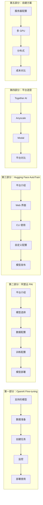
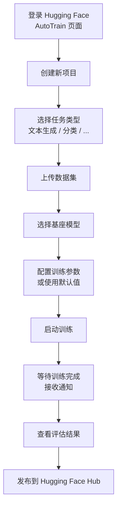
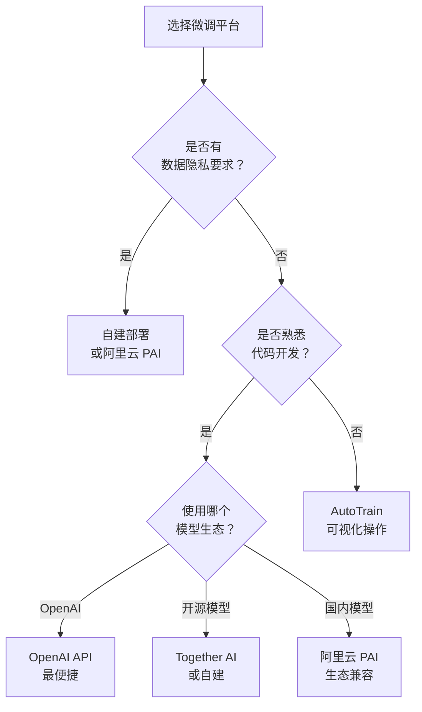

# 第4章 · 微调平台实践 — 从 OpenAI 到 AutoTrain

> **时长**：约 3 小时 ｜ **难度**：⭐⭐⭐ ｜ **类型**：动手实操
>
> **目标**：掌握 OpenAI 微调 API、Hugging Face AutoTrain 和阿里云 PAI 三大平台的微调实践，学会根据场景选择合适的平台和自建方案

---

## 学习目标

学完本章后，你将能够：
- 使用 OpenAI API 创建和管理微调任务
- 在 Hugging Face AutoTrain 上实现无代码微调
- 使用阿里云 PAI 平台进行企业级微调
- 了解 Together AI、Anyscale 等替代平台
- 评估自建训练环境的成本和可行性
- 根据项目需求选择最合适的微调平台

---

## 知识地图



---

# 第一部分：OpenAI Fine-tuning

## 1、支持的模型

**概念定义**：OpenAI 的微调 API 允许用户使用自己的数据对 OpenAI 的模型进行定制化训练，训练后的模型通过 OpenAI 的 API 端点提供服务。

### 1.1.1 当前支持的模型

| 模型 | 特点 | 定价（训练） | 适合场景 |
|------|------|-------------|---------|
| gpt-3.5-turbo | 性价比高，成熟的微调支持 | $0.008/1K tokens | 通用微调场景 |
| gpt-4o-mini | 更智能、更便宜 | $0.003/1K tokens | 推荐的默认选择 |
| gpt-4o | 最强大的微调能力 | 价格更高 | 需要极致质量的场景 |

> **注意**：模型支持情况会随时间变化，微调前务必在 OpenAI 官方文档确认当前支持的模型列表。

### 1.1.2 定价模式

OpenAI 微调费用由三部分组成：

```
总费用 = 训练费用 + 存储费用 + 推理费用

训练费用：每 1K tokens 收费（取决于模型）
存储费用：每月每 GB 收费（微调后的模型）
推理费用：与标准 API 相同定价（按 token 计费）
```

---

## 2、数据准备

### 2.1.1 JSONL 格式

OpenAI 微调 API 要求数据为 JSONL 格式，每行一个完整的对话样本：

```jsonl
{"messages": [{"role": "system", "content": "你是一个专业的客服助手。"}, {"role": "user", "content": "我的订单怎么还没到？"}, {"role": "assistant", "content": "您好，请提供您的订单号，我帮您查询物流信息。"}]}
{"messages": [{"role": "system", "content": "你是一个专业的客服助手。"}, {"role": "user", "content": "我想退货"}, {"role": "assistant", "content": "好的，请问您是在哪里购买的商品？不同渠道的退货政策略有不同。"}]}
```

**格式关键要求**：
- 每条数据至少包含 1 条 user 消息和 1 条 assistant 消息
- 多轮对话：按顺序包含 human → assistant → human → assistant 的交替序列
- system 消息可选，但推荐使用以保持风格一致
- 每条数据的总 token 数不能超过模型的上下文窗口

### 2.1.2 数据验证

### ▶ 执行代码

```powershell
cd code/
python 01_openai_finetune.py
```

OpenAI 提供了数据验证工具，在上传前检查数据格式：

```python
import json
import tiktoken

def validate_openai_data(file_path: str) -> dict:
    """验证 OpenAI 微调数据"""
    errors = []
    token_counts = []
    encoding = tiktoken.encoding_for_model("gpt-3.5-turbo")
    
    with open(file_path, "r") as f:
        for i, line in enumerate(f, 1):
            try:
                data = json.loads(line)
            except json.JSONDecodeError:
                errors.append(f"行 {i}: JSON 解析失败")
                continue
            
            if "messages" not in data:
                errors.append(f"行 {i}: 缺少 messages 字段")
                continue
            
            messages = data["messages"]
            has_user = any(m["role"] == "user" for m in messages)
            has_assistant = any(m["role"] == "assistant" for m in messages)
            
            if not has_user:
                errors.append(f"行 {i}: 缺少 user 消息")
            if not has_assistant:
                errors.append(f"行 {i}: 缺少 assistant 消息")
            
            # 计算 token 数
            tokens = len(encoding.encode(str(data)))
            token_counts.append(tokens)
    
    return {
        "总行数": sum(1 for _ in open(file_path)),
        "错误数": len(errors),
        "错误详情": errors[:10],
        "平均 tokens": sum(token_counts) / len(token_counts) if token_counts else 0,
        "最大 tokens": max(token_counts) if token_counts else 0,
    }
```

**OpenAI 命令行验证工具**：

```bash
# 使用 OpenAI 提供的 CLI 工具验证数据
openai tools fine_tunes.prepare_data -f training_data.jsonl
```

### 2.1.3 上传数据

```python
from openai import OpenAI

client = OpenAI()

# 上传训练文件
file = client.files.create(
    file=open("training_data.jsonl", "rb"),
    purpose="fine-tune"
)

print(f"文件 ID: {file.id}")
# 输出示例: file-abc123
```

---

## 3、创建微调任务

```python
# 创建微调任务
fine_tune = client.fine_tuning.jobs.create(
    training_file=file.id,
    model="gpt-4o-mini",           # 基座模型
    suffix="customer-service",      # 模型名称后缀（可选）
    hyperparameters={
        "n_epochs": 3,              # 训练轮数
        "batch_size": 16,           # batch size（可选）
        "learning_rate_multiplier": 1.0,  # 学习率乘数（可选）
    },
)

print(f"微调任务 ID: {fine_tune.id}")
# 输出示例: ftjob-abc123
```

**超参数建议**：

| 参数 | 推荐值 | 说明 |
|------|-------|------|
| n_epochs | 3~5 | 数据量少时可增加到 5~10 |
| batch_size | 由 OpenAI 自动选择 | 数据量 < 2000 条时自动用小 batch |
| learning_rate_multiplier | 1.0~2.0 | 数据量少时用更小值防止过拟合 |

---

## 4、监控训练

### 4.1.1 查看任务列表

```python
# 列出所有微调任务
jobs = client.fine_tuning.jobs.list(limit=10)
for job in jobs:
    print(f"{job.id} - {job.status} - {job.model}")

# 查看特定任务状态
job = client.fine_tuning.jobs.retrieve("ftjob-abc123")
print(f"状态: {job.status}")
print(f"训练 tokens: {job.trained_tokens}")
print(f"训练 loss: {job.result_files}")
```

### 4.1.2 查看训练指标

```python
# 获取训练事件（含 loss 指标）
events = client.fine_tuning.jobs.list_events(
    fine_tuning_job_id="ftjob-abc123",
    limit=50
)

for event in events:
    print(f"[{event.created_at}] {event.message}")
    if hasattr(event, 'data') and event.data:
        if 'train_loss' in event.data:
            print(f"  Loss: {event.data['train_loss']}")
```

### 4.1.3 任务状态说明

| 状态 | 说明 | 预计时间 |
|------|------|---------|
| validating_files | 验证数据文件格式 | ~1 分钟 |
| queued | 排队等待 GPU | 取决于当前负载 |
| running | 训练进行中 | 1~10 小时（取决于数据量） |
| succeeded | 训练完成 | - |
| failed | 训练失败 | - |
| cancelled | 用户取消 | - |

---

## 5、使用微调模型

```python
# 训练完成后，获取微调模型 ID
job = client.fine_tuning.jobs.retrieve("ftjob-abc123")
fine_tuned_model = job.fine_tuned_model
print(f"微调模型: {fine_tuned_model}")
# 输出示例: ft:gpt-4o-mini:my-org:customer-service:abc123

# 使用微调模型
response = client.chat.completions.create(
    model=fine_tuned_model,
    messages=[
        {"role": "system", "content": "你是一个专业的客服助手。"},
        {"role": "user", "content": "我的商品有质量问题怎么办？"}
    ]
)
print(response.choices[0].message.content)
```

---

## 6、最佳实践

- **数据量建议**：至少 100 条（建议 500~5000 条）
- **训练轮数**：默认 3 轮，数据量少时增加，数据量大时减少
- **system prompt**：在训练数据中使用一致的 system prompt，推断时也使用相同的 system prompt
- **平衡类别**：确保各类问题的比例均衡，避免对高频问题过拟合
- **评估集**：预留 10%~20% 的数据作为评估集（使用 `validation_file` 参数）

---

# 第二部分：阿里云 PAI

## 7、平台介绍

**概念定义**：阿里云 PAI（Platform for AI）是阿里云提供的一站式机器学习平台，支持大模型微调、训练和部署。与国内大模型生态深度集成，适合有阿里云基础设施的企业用户。

**核心优势**：
- 与阿里云产品生态无缝集成（OSS 存储、MaxCompute 数据源）
- 支持国内主流大模型（通义千问、百川、ChatGLM 等）
- 符合国内数据合规要求
- 提供可视化工作流，降低上手门槛

---

## 8、模型选择

PAI 平台预置了多种基座模型，可直接用于微调：

| 模型 | 参数规模 | 适合场景 |
|------|---------|---------|
| 通义千问 (Qwen) | 7B / 14B / 72B | 通用中文场景 |
| 百川 (Baichuan) | 7B / 13B | 知识密集型任务 |
| ChatGLM | 6B / 12B / 130B | 中英文对话 |
| LLaMA 系列 | 7B / 13B / 70B | 英文场景为主 |

---

## 9、数据配置

PAI 支持多种数据来源和格式：

**支持的存储源**：
- OSS（对象存储）
- MaxCompute 表
- NAS 文件系统
- 本地文件上传

**支持的数据格式**：
- JSONL（OpenAI 兼容格式）
- CSV
- Alpaca 格式
- Hugging Face Datasets 格式

### ▶ 执行代码

```powershell
cd code/
python 03_pai_example.py
```

```python
# PAI 微调任务配置示例（通过 SDK）
from pai import PlatformClient

client = PlatformClient(
    access_key_id="YOUR_AK",
    access_key_secret="YOUR_SK",
    region="cn-hangzhou"
)

# 创建微调任务
job = client.create_fine_tune_job(
    model_name="qwen-7b",
    training_data="oss://bucket/train_data.jsonl",
    validation_data="oss://bucket/val_data.jsonl",
    hyperparameters={
        "epochs": 3,
        "batch_size": 4,
        "learning_rate": 2e-5,
        "lora_r": 16,
        "lora_alpha": 32,
    },
    output_model_uri="oss://bucket/finetuned-model/"
)
```

---

## 10、训练配置

PAI 的可视化界面提供完整的训练配置：

```
训练配置面板:
├── 基础配置
│   ├── 模型选择: [Qwen-7B / Baichuan-13B / ...]
│   ├── 训练方式: [全量微调 / LoRA / QLoRA]
│   └── 资源规格: [V100-32G × 1 / A100-80G × 4 / ...]
├── 数据配置
│   ├── 训练数据: oss://path/to/train.jsonl
│   ├── 验证数据: oss://path/to/val.jsonl (可选)
│   └── 数据格式: [OpenAI / Alpaca / 自定义]
├── 超参数
│   ├── 学习率: 2e-5
│   ├── 训练轮数: 3
│   ├── Batch Size: 4
│   └── Warmup 比例: 0.03
└── 输出配置
    ├── 模型输出路径: oss://path/to/output/
    └── 自动部署: [是 / 否]
```

---

## 11、模型部署

PAI 支持一键部署微调后的模型为在线 API：

1. **模型注册**：将微调后的模型注册到 PAI 模型管理
2. **服务配置**：设置副本数、GPU 类型、弹性伸缩策略
3. **端点发布**：生成 RESTful API 端点
4. **流量接入**：将业务流量切换到微调模型

```python
# 部署微调后的模型
service = client.deploy_model(
    model_uri="oss://bucket/finetuned-model/",
    service_name="my-ft-qwen-7b",
    instance_type="ecs.gn6v-c8g1.2xlarge",  # V100
    instance_count=2,                         # 2 个副本
    autoscale=True,                           # 自动伸缩
    min_replicas=1,
    max_replicas=5,
)

# 调用 API
response = service.predict({
    "messages": [
        {"role": "user", "content": "你好，请问有什么可以帮您？"}
    ]
})
```

---

# 第三部分：Hugging Face AutoTrain

## 12、AutoTrain 介绍

**概念定义**：AutoTrain 是 Hugging Face 推出的自动化机器学习平台，支持通过 Web 界面或 CLI 进行零代码微调。它自动处理训练配置、硬件选择和模型评估。

**核心定位**：让没有深度学习背景的开发者也能微调模型——上传数据、点几下鼠标、等通知。

**支持的任务类型**：
- 文本分类
- 文本生成（对话模型微调）
- Token 分类（NER）
- 文本到文本（翻译、摘要）

---

## 13、Web 界面使用

### 13.1.1 操作流程



### 13.1.2 界面操作要点

- **数据集**：支持 CSV、JSONL、Parquet 格式
- **列映射**：将数据列映射到模型的输入/输出字段
- **验证集**：自动从训练数据中拆分，或单独上传
- **模型选择**：可以从 Hugging Face Hub 搜索基座模型
- **付费方式**：使用 Hugging Face 的付费积分或自带 GPU

---

## 14、CLI 使用

### ▶ 执行代码

```powershell
cd code/
python 02_autotrain_config.yaml
```

AutoTrain 也提供了 CLI 工具和配置文件方式，适合批量操作：

```yaml
# autotrain_config.yaml
task: causal_lm                    # 任务类型
model: meta-llama/Llama-2-7b-hf    # 基座模型
train_split: train                 # 训练数据划分
valid_split: validation            # 验证数据划分

training:
  epochs: 3
  batch_size: 4
  learning_rate: 2e-4
  lora: True                       # 启用 LoRA
  lora_r: 16
  lora_alpha: 32
  lora_dropout: 0.1
  target_modules:                  # LoRA 目标模块
    - q_proj
    - k_proj
    - v_proj
    - o_proj
  
quantization:                      # 量化配置
  load_in_4bit: True
  bnb_4bit_quant_type: nf4
  bnb_4bit_compute_dtype: float16
  bnb_4bit_use_double_quant: True

output:
  push_to_hub: True                # 推送到 Hugging Face Hub
  model_name: my-finetuned-model   # Hub 上的模型名
```

**CLI 命令**：

```bash
# 使用配置文件启动训练
autotrain --config autotrain_config.yaml

# 或命令行传参
autotrain causal_lm \
    --model meta-llama/Llama-2-7b-hf \
    --trainer peft \
    --train-data-path ./train_data.csv \
    --text-column text \
    --epochs 3 \
    --batch-size 4 \
    --lr 2e-4
```

---

## 15、自定义配置

AutoTrain 支持覆盖默认配置，实现更精细的控制：

| 配置项 | 默认值 | 可调整范围 | 说明 |
|-------|-------|-----------|------|
| `lora` | True | True/False | 是否使用 LoRA |
| `lora_r` | 16 | 4~64 | LoRA 秩 |
| `lora_alpha` | 32 | 8~128 | LoRA 缩放因子 |
| `learning_rate` | 5e-5 | 1e-6~1e-3 | 学习率 |
| `epochs` | 5 | 1~20 | 训练轮数 |
| `batch_size` | 2 | 1~16 | 批大小 |
| `warmup_ratio` | 0.1 | 0~0.5 | 预热比例 |
| `gradient_accumulation` | 4 | 1~16 | 梯度累积步数 |
| `scheduler` | cosine | linear/cosine/warmup | 学习率调度器 |
| `max_seq_length` | 2048 | 512~8192 | 最大序列长度 |

---

## 16、模型发布

训练完成后，AutoTrain 自动将模型推送到 Hugging Face Hub，可以通过 Hub 直接使用：

```python
from transformers import AutoModelForCausalLM, AutoTokenizer

model = AutoModelForCausalLM.from_pretrained("your-username/my-finetuned-model")
tokenizer = AutoTokenizer.from_pretrained("your-username/my-finetuned-model")

# 推理
inputs = tokenizer("用户的问题：...", return_tensors="pt")
outputs = model.generate(**inputs, max_new_tokens=256)
print(tokenizer.decode(outputs[0]))
```

---

# 第四部分：其他平台

## 17、Together AI

**概念定义**：Together AI 提供云端 API 进行模型微调和推理，支持大量开源模型（LLaMA、Mistral、Falcon 等）。

**特点**：
- 支持 GPT-JT、LLaMA、Mistral、Falcon 等主流开源模型
- 一键 API 微调，无需管理 GPU
- 支持 LoRA 和全量微调
- 提供模型路由和推理优化

**定价模式**：按训练 token 和推理 token 计费，比 OpenAI 更经济。

## 18、Anyscale

**概念定义**：Anyscale 是基于 Ray 分布式计算平台的推理和微调服务，适合有大规模分布式需求的场景。

**特点**：
- 基于 Ray 分布式架构
- 支持弹性和可扩展的微调
- 适合大规模模型（70B+）的分布式微调
- 提供企业级 SLA

**适用场景**：已经使用 Ray 进行分布式计算的企业。

## 19、Modal

**概念定义**：Modal 是一个 serverless 计算平台，支持按需启动 GPU 进行模型微调，按秒计费。

**特点**：
- Serverless 模式，用多少付多少
- 按秒计费，不用时零成本
- 支持 Python 脚本定义训练逻辑
- 自动处理 GPU 分配和环境配置

```python
# Modal 微调示例（伪代码）
import modal

app = modal.App("my-fine-tune")

@app.function(gpu="A10G", timeout=3600)
def fine_tune():
    # 在这里编写训练代码
    model = load_model("meta-llama/Llama-2-7b-hf")
    lora_config = LoraConfig(r=16, ...)
    # ... 训练逻辑
    save_model(model, "output-path")
    return "训练完成"
```

---

## 20、平台对比

| 对比维度 | OpenAI | AutoTrain | 阿里云 PAI | Together AI | 自建 |
|---------|--------|-----------|-----------|------------|------|
| 上手难度 | ⭐ | ⭐ | ⭐⭐ | ⭐⭐ | ⭐⭐⭐⭐⭐ |
| 模型选择 | 仅 OpenAI 模型 | 开源模型 | 国内模型为主 | 多种开源 | 任意 |
| 数据隐私 | 数据上传 OpenAI | 数据上传 HF | 阿里云内 | 数据上传 | 完全自控 |
| 费用模式 | 按 token | 按时间/积分 | 按资源规格 | 按 token | 硬件 + 电费 |
| 定制程度 | 低 | 中 | 中高 | 中 | 最高 |
| 适合场景 | 快速原型 | 零代码入门 | 企业合规 | 开源模型 | 极致定制 |

**选择建议**：



---

# 第五部分：自建训练环境

## 21、服务器配置

### 21.1.1 硬件配置方案

| 方案 | 配置 | 估算价格 | 适合场景 |
|------|------|---------|---------|
| 入门级 | 1 × RTX 4090 24GB | ~¥3~5 万 | LoRA/QLoRA 微调 7B~13B |
| 标准级 | 2 × A100 80GB | ~¥30~50 万 | LoRA 微调 13B~70B |
| 专业级 | 8 × A100 80GB | ~¥100~200 万 | 全量微调 70B+ |
| 企业级 | 8 × H100 80GB | ~¥300~500 万 | 大规模训练集群 |

### 21.1.2 软件栈

```
推荐软件栈:
├── 操作系统: Ubuntu 22.04 LTS
├── CUDA: 11.8 / 12.1
├── Python: 3.10+
├── PyTorch: 2.1+
├── 框架: Transformers + PEFT + bitsandbytes
├── 分布式: DeepSpeed / FSDP
└── 监控: TensorBoard / Weights & Biases
```

---

## 22、多 GPU 训练

**概念定义**：多 GPU 训练通过将模型和数据分布到多张 GPU 上，加速训练过程或在单卡无法容纳大模型时提供解决方案。

### 22.1.1 数据并行（Data Parallelism）

- 每张 GPU 持有完整模型副本
- 将 batch 切分到各 GPU 独立计算梯度
- 通过 all-reduce 同步梯度

### 22.1.2 模型并行（Model Parallelism）

- 将模型的不同层分布到不同 GPU
- 前向传播时依次通过各 GPU
- 适合大模型但显存不足以加载完整模型的情况

### 22.1.3 DeepSpeed ZeRO

- ZeRO Stage 1：优化器状态分片
- ZeRO Stage 2：优化器 + 梯度分片
- ZeRO Stage 3：优化器 + 梯度 + 参数分片
- ZeRO Stage 3 + offload：将部分数据卸载到 CPU 内存

---

## 23、分布式训练

```python
# DeepSpeed 启动命令示例
deepspeed --num_gpus=8 train.py \
    --deepspeed ds_config.json

# ds_config.json
{
    "bf16": {"enabled": true},
    "zero_optimization": {
        "stage": 3,
        "offload_optimizer": {
            "device": "cpu",
            "pin_memory": true
        },
        "offload_param": {
            "device": "cpu",
            "pin_memory": true
        }
    },
    "gradient_accumulation_steps": 4,
    "gradient_clipping": 1.0,
    "train_batch_size": 32
}
```

---

## 24、成本对比

| 方案 | 微调 7B 模型成本 | 微调 70B 模型成本 | 月推理成本（1 万请求/天） |
|------|-----------------|-----------------|------------------------|
| OpenAI API | $10~50 | 不支持 | $30~100 |
| AutoTrain | $5~20 | $50~200 | $0（自托管） |
| Together AI | $5~15 | $50~150 | $20~50 |
| 阿里云 PAI | ¥50~200 | ¥500~2000 | ¥200~500 |
| 自建（4090） | ¥5~10（电费） | 不支持 | ¥100~200（电费） |
| 自建（8×A100） | ¥3~5（电费） | ¥10~30（电费） | ¥100~500（电费） |

---

## 常见踩坑

1. **OpenAI 微调数据中混入中文标点**：模型学到的标点使用习惯异常 —— JSONL 中保持标点统一，推荐全角/半角混用检查
2. **AutoTrain 的默认参数不适合你的数据量**：500 条数据用默认的 5 个 epoch 可能过拟合 —— 数据量少于 1000 条时手动减少 epochs 到 2~3
3. **阿里云 PAI 的 OSS 路径格式错误**：`oss://bucket/path` 与 `oss://bucket-name/path` 混用导致数据加载失败 —— 确认路径格式为 `oss://bucket-name/path`
4. **多 GPU 训练时 NCCL 超时**：网络通信瓶颈导致训练频繁中断 —— 设置 `NCCL_TIMEOUT=3600000` 延长超时时间
5. **平台选择错误导致后期迁移成本高**：在 OpenAI 上微调后想切到开源模型需要重新训练 —— 初期就评估数据隐私和长期成本，选择绑定程度低的平台

---

## 课后练习

1. 准备 50 条客服对话数据，用 OpenAI 微调 API 完成一次微调任务，记录训练过程和最终模型效果
2. 在 Hugging Face AutoTrain 上使用同样的数据完成一次微调，对比两个平台的操作流程和效果差异
3. 列出自建方案（单卡 4090）和云平台方案（OpenAI）的三年总成本对比表，判断哪个更适合你的项目
4. 调研 Together AI 或 Modal 平台，回答：它比 OpenAI 微调好在哪？比自建好在哪？

---

## 本节小结

- ✅ 掌握了 OpenAI 微调 API 的完整流程：数据准备、上传、创建任务、监控、部署
- ✅ 了解了阿里云 PAI 平台的企业级微调能力
- ✅ 掌握了 Hugging Face AutoTrain 的无代码微调方法
- ✅ 了解了 Together AI、Anyscale、Modal 等替代平台的特点
- ✅ 学会了自建训练环境的硬件配置和软件栈选择
- ✅ 能根据项目需求进行平台选型和成本评估

---

> **下一章**：第5章 · 模型评估与迭代——持续优化微调效果（模块完结篇）
