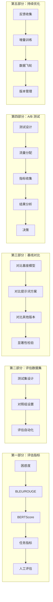
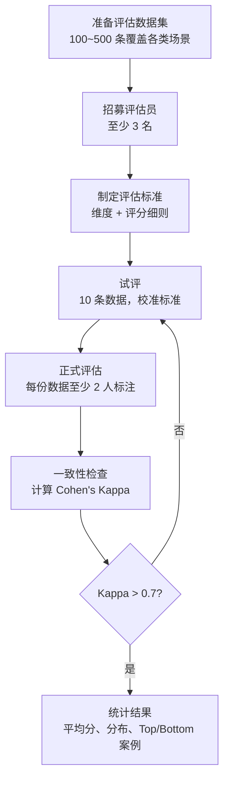
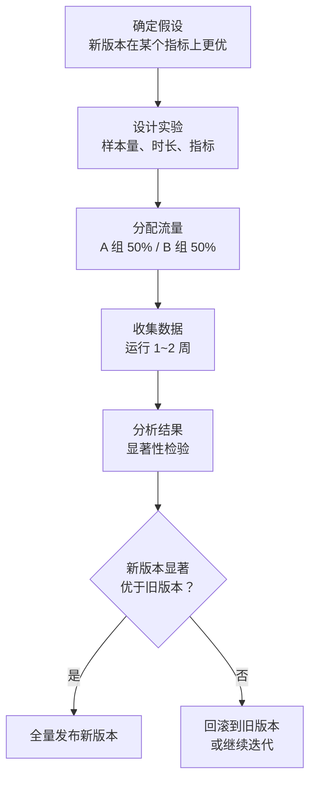
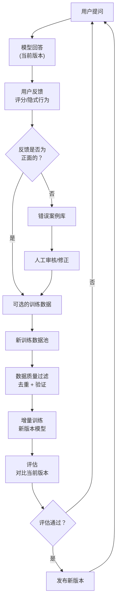
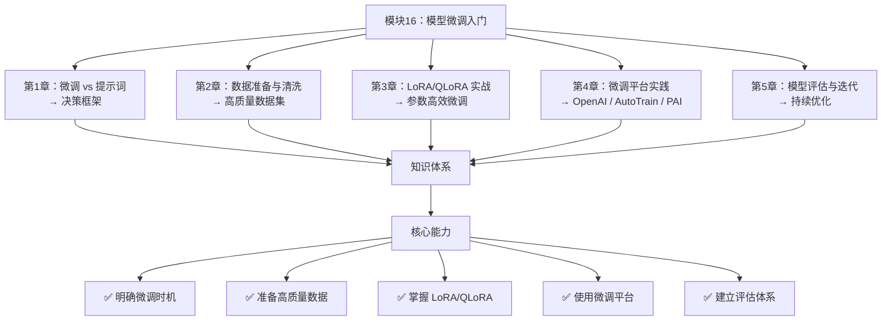
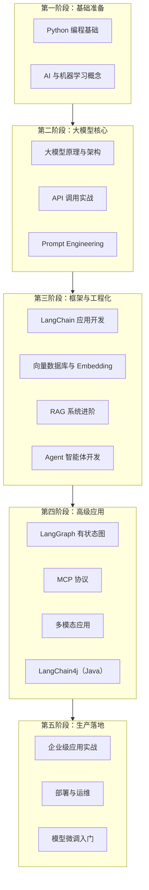

# 第5章 · 模型评估与迭代 — 持续优化微调效果

> **时长**：约 3 小时 ｜ **难度**：⭐⭐⭐ ｜ **类型**：概念 + 实操
>
> **目标**：建立科学的微调模型评估体系，掌握 A/B 测试方法，构建数据飞轮实现持续优化

---

## 学习目标

学完本章后，你将能够：
- 使用困惑度、BLEU/ROUGE、BERTScore 等指标评估模型
- 设计针对任务场景的评估方案（分类、生成、对话）
- 建立人工评估流程和质量标准
- 设计和执行 A/B 测试对比模型版本
- 构建数据飞轮实现模型的持续迭代优化

---

## 知识地图



---

# 第一部分：评估指标体系

## 1、通用指标

**概念定义**：通用指标是与具体任务无关的评估维度，用于衡量模型输出的基本质量和与参考答案的匹配程度。

### 1.1.1 困惑度（Perplexity）

**概念定义**：困惑度（PPL）衡量模型对文本的**预测能力**——模型认为一段文本出现的概率越高，困惑度越低，表示模型越"确信"。

**计算公式**（直观理解）：
- PPL = 2^(-平均对数概率)
- 困惑度越低越好：PPL = 1 完美预测，PPL = 100 很差

**使用场景**：
- 训练过程中监控收敛情况
- 对比不同 checkpoint 的语言建模能力
- **注意**：PPL 低不直接等价于输出质量高

```python
# ▶ 执行代码
# cd code/
# python 01_evaluation_metrics.py

import torch
from transformers import AutoModelForCausalLM, AutoTokenizer

def compute_perplexity(model, tokenizer, text: str) -> float:
    """计算一段文本的困惑度"""
    inputs = tokenizer(text, return_tensors="pt")
    with torch.no_grad():
        outputs = model(**inputs, labels=inputs["input_ids"])
        loss = outputs.loss
        perplexity = torch.exp(loss).item()
    return perplexity

# PPL 越低越好
ppl_before = compute_perplexity(base_model, tokenizer, domain_text)
ppl_after = compute_perplexity(finetuned_model, tokenizer, domain_text)
print(f"微调前 PPL: {ppl_before:.2f} → 微调后 PPL: {ppl_after:.2f}")
```

### 1.1.2 BLEU / ROUGE

**概念定义**：BLEU（Bilingual Evaluation Understudy）和 ROUGE（Recall-Oriented Understudy for Gisting Evaluation）是基于 **n-gram 重叠**的评估指标。

| 指标 | 侧重点 | 计算方式 | 适合场景 |
|------|--------|---------|---------|
| BLEU | **精确率** | 生成文本中 n-gram 出现在参考文本中的比例 | 机器翻译 |
| ROUGE-L | **召回率** | 参考文本中 n-gram 出现在生成文本中的比例 | 文本摘要 |
| ROUGE-L | **最长公共子序列** | 基于 LCS 的 F1 分数 | 摘要、翻译 |

**局限**：
- 只关注表面词汇匹配，不考虑语义等价
- 对同义表达不敏感（"很好" vs "非常棒" 得分低）
- 不适合开放生成任务的评估

```python
from nltk.translate.bleu_score import sentence_bleu
from rouge import Rouge

def compute_bleu_rouge(reference: str, hypothesis: str) -> dict:
    """计算 BLEU 和 ROUGE 分数"""
    # BLEU
    ref_tokens = reference.split()
    hyp_tokens = hypothesis.split()
    bleu = sentence_bleu([ref_tokens], hyp_tokens, weights=(0.25, 0.25, 0.25, 0.25))
    
    # ROUGE
    rouge = Rouge()
    scores = rouge.get_scores(hypothesis, reference)[0]
    
    return {
        "bleu": bleu,
        "rouge-1": scores["rouge-1"]["f"],
        "rouge-2": scores["rouge-2"]["f"],
        "rouge-l": scores["rouge-l"]["f"],
    }
```

### 1.1.3 BERTScore

**概念定义**：BERTScore 利用 BERT 等预训练模型的 embedding，计算生成文本和参考文本之间的**语义相似度**，弥补 BLEU/ROUGE 只匹配表面词汇的缺陷。

**核心优势**：
- 能识别同义表达（"好极了" vs "棒极了" → 高相似度）
- 对语序变化相对鲁棒
- 与人工评估的相关性更高

```python
from bert_score import score

def compute_bertscore(references: list[str], hypotheses: list[str]) -> dict:
    """计算 BERTScore"""
    P, R, F1 = score(hypotheses, references, lang="zh", verbose=False)
    return {
        "precision": P.mean().item(),
        "recall": R.mean().item(),
        "f1": F1.mean().item(),
    }
```

---

## 2、任务特定指标

**概念定义**：不同任务需要设计针对性的评估指标，以衡量模型在具体场景下的表现。

### 2.1.1 分类任务

| 指标 | 计算方式 | 含义 |
|------|---------|------|
| 准确率（Accuracy） | 正确预测数 / 总数 | 整体正确率 |
| 精确率（Precision） | TP / (TP + FP) | 预测为正类的样本中有多少是真的正类 |
| 召回率（Recall） | TP / (TP + FN) | 真正的正类中有多少被预测出来了 |
| F1 分数 | 2 × (P × R) / (P + R) | 精确率和召回率的调和平均 |

**场景示例**——客服意图分类：
```python
# 混淆矩阵
#              预测:退货  预测:查询  预测:投诉
# 实际:退货      92        5          3
# 实际:查询      4         88         8
# 实际:投诉      2         6         92

# F1 分数（加权平均）≈ 0.91
```

### 2.1.2 生成任务

| 维度 | 定义 | 评估方式 |
|------|------|---------|
| 流畅度 | 语言是否通顺自然 | 人工打分 1~5 |
| 相关性 | 回答是否切题 | 人工打分 1~5 |
| 完整性 | 是否完整覆盖问题 | 人工打分 1~5 |
| 信息量 | 是否提供了有用信息 | 人工打分 1~5 |
| 安全性 | 是否有有害内容 | Pass/Fail |

### 2.1.3 对话任务

| 维度 | 定义 | 评估方式 |
|------|------|---------|
| 连贯性 | 多轮对话上下文的衔接 | 人工评估 |
| 一致性 | 同一话题前后回答不矛盾 | 人工 + 自动检测 |
| 主动性 | 是否能主动追问澄清 | 人工评估 |
| 任务完成度 | 是否解决了用户问题 | 人工 + 结果指标 |

---

## 3、人工评估

**概念定义**：人工评估是人类标注员根据预设标准对模型输出进行评判，是衡量模型真实效果的最可靠方式。

### 3.1.1 评估维度

| 评分 | 定义 | 说明 |
|------|------|------|
| 5 分 | 完美 | 答案准确、完整、格式正确、超出预期 |
| 4 分 | 良好 | 答案正确，有小瑕疵但不影响使用 |
| 3 分 | 及格 | 答案基本正确，但不够完整或清晰 |
| 2 分 | 较差 | 答案有部分错误或明显不符合要求 |
| 1 分 | 不可用 | 答案完全错误或产生有害内容 |

### 3.1.2 评估流程



---

# 第二部分：评估数据集

## 4、测试集设计

**概念定义**：测试集是评估模型的"考卷"，必须体现真实场景的多样性和挑战性。

### 4.1.1 覆盖性

测试集应覆盖以下维度：

| 维度 | 覆盖要求 | 示例 |
|------|---------|------|
| 指令类型 | 覆盖所有任务类别 | 翻译、总结、分类、生成 |
| 输入长度 | 短、中、长 | 5 字 ~ 2000 字 |
| 难度级别 | 简单、中等、困难 | 常识问答 / 专业分析 / 复杂推理 |
| 边界情况 | 边缘输入 | 空输入、超长输入、含特殊字符 |

### 4.1.2 难度分布

测试集的难度分布应与真实业务场景一致：

```
难度分级    占比    示例
简单        40%    "翻译成英文：你好"
中等        35%    "总结这篇 500 字文章的核心观点"
困难        20%    "给定 5 个约束条件，生成满足所有要求的回复"
极难        5%     "多步推理：结合上下文和外部知识回答"
```

### 4.1.3 边界情况

测试集中必须包含边界案例，否则上线后可能在意外输入上表现极差：

| 边界类型 | 测试用例 | 期望行为 |
|---------|---------|---------|
| 空输入 | "" | 友好提示要求输入 |
| 超长输入 | 3000 字段落 | 截断或摘要后回复 |
| 特殊字符 | "你好@@##\n\n\t 世界" | 正常处理 |
| 否定表达 | "不要翻译，只要解释" | 正确理解否定 |
| 多语言混合 | "Hello 你好 Konnichiwa" | 正确处理或说明 |

---

## 5、对照组设置

**概念定义**：对照组是评估的基准，用于比较微调模型的效果提升。

**对比层级**：

| 对比对象 | 对比目的 | 评估维度 |
|---------|---------|---------|
| 基座模型（微调前） | 衡量微调带来的绝对提升 | 所有指标 |
| 基座模型 + 最佳 prompt | 对比微调 vs 提示词工程 | 质量 + 成本 |
| 上一版微调模型 | 衡量迭代版本的增量提升 | 关键指标 |
| 竞品模型（如 GPT-4） | 定位当前水平 | 质量 + 成本 |

---

## 6、评估自动化

### ▶ 执行代码

```powershell
cd code/
python 02_benchmark_suite.py
```

```python
class BenchmarkSuite:
    """自动化评估测试套件"""
    
    def __init__(self, model, tokenizer, test_cases: list[dict]):
        self.model = model
        self.tokenizer = tokenizer
        self.test_cases = test_cases
        self.results = []
    
    def run(self):
        """运行评估套件"""
        for case in self.test_cases:
            input_text = case["input"]
            reference = case.get("reference", "")
            
            # 生成输出
            output = self.generate(input_text)
            
            # 计算指标
            metrics = {}
            if reference:
                metrics["bleu"] = sentence_bleu([reference.split()], output.split())
                metrics["rouge_l"] = self.compute_rouge_l(reference, output)
            
            metrics["length"] = len(output)
            metrics["has_empty"] = len(output.strip()) == 0
            metrics["has_repetition"] = self.detect_repetition(output)
            
            self.results.append({
                "input": input_text,
                "output": output,
                "reference": reference,
                "metrics": metrics,
            })
        
        return self.summarize()
    
    def report(self):
        """生成评估报告"""
        df = pd.DataFrame(self.results)
        return {
            "平均 BLEU": df["metrics"].apply(lambda x: x.get("bleu", 0)).mean(),
            "平均 ROUGE-L": df["metrics"].apply(lambda x: x.get("rouge_l", 0)).mean(),
            "空输出率": df["metrics"].apply(lambda x: x["has_empty"]).mean(),
            "重复率": df["metrics"].apply(lambda x: x["has_repetition"]).mean(),
            "平均输出长度": df["metrics"].apply(lambda x: x["length"]).mean(),
        }
```

---

# 第三部分：基线对比

## 7、与基座模型对比

**评估目的**：验证微调是否真正提升了目标任务的性能。

```python
# 对比评估
base_results = evaluate_model(base_model, test_set)
ft_results = evaluate_model(finetuned_model, test_set)

print("指标对比:")
for metric in base_results:
    delta = ft_results[metric] - base_results[metric]
    arrow = "↑" if delta > 0 else "↓"
    print(f"  {metric}: {base_results[metric]:.3f} → {ft_results[metric]:.3f} {arrow} {abs(delta):.3f}")
```

**注意**：如果微调后的模型在目标任务上的提升很微小（< 2%），可能需要检查数据质量或训练配置。

---

## 8、与提示词方案对比

**评估目的**：验证"微调投入是否值得"——如果精心设计的 prompt 就能达到接近的效果，可能不需要微调。

```python
# 微调模型（短 prompt）
ft_prompt = "请回答用户的问题。"
ft_output = ft_model.generate(ft_prompt + user_question)

# 基座模型 + 复杂 prompt
base_prompt = """你是专业的客服助手，请遵循以下规则：
1. 始终保持专业友好的语气
2. 回答需要完整覆盖用户问题
3. 如果信息不足，主动询问补充信息
4. 不要编造不确定的信息
用户问题："""
base_output = base_model.generate(base_prompt + user_question)

# 对比质量和成本
print(f"微调模型：质量={quality_score(ft_output)}, 每次成本=$0.001")
print(f"提示词方案：质量={quality_score(base_output)}, 每次成本=$0.003")
```

---

## 9、与其他微调版本对比

- 对比不同训练配置（r=8 vs r=16）
- 对比不同数据组合（含增强 vs 不含）
- 对比不同阶段 checkpoint（epoch 2 vs epoch 3）

---

## 10、显著性检验

**概念定义**：指标提升可能是随机波动导致的。显著性检验判断观察到的差异是否具有统计意义。

```python
from scipy import stats

def statistical_significance(scores_a: list[float], scores_b: list[float]) -> dict:
    """独立样本 t 检验"""
    t_stat, p_value = stats.ttest_ind(scores_a, scores_b)
    return {
        "t_statistic": t_stat,
        "p_value": p_value,
        "significant": p_value < 0.05,  # p < 0.05 说明有显著差异
        "effect_size": (np.mean(scores_b) - np.mean(scores_a)) / np.std(scores_a + scores_b),
    }
```

**解读**：
- p < 0.05：差异显著，微调确实有效
- p >= 0.05：差异可能来自随机波动，需要更多数据或检查评估方法

---

# 第四部分：A/B 测试

## 11、测试设计

**概念定义**：A/B 测试是将用户流量随机分配到两种模型版本（A：当前版本，B：新版本），通过对比业务指标来决策是否替换模型。

### 11.1.1 测试流程



### 11.1.2 关键设计要素

| 要素 | 说明 | 建议值 |
|------|------|-------|
| 样本量 | 每组需要多少样本 | 每组至少 1000 次有效交互 |
| 测试时长 | 运行多长时间 | 至少 1 个完整业务周期（7~14 天） |
| 指标 | 衡量什么 | 1 个主要指标 + 2~3 个次要指标 |
| 流量分配 | 如何分流量 | 50%/50% 或 90%/10%（小流量测试） |

---

## 12、流量分配

```python
# ▶ 执行代码
# cd code/
# python 03_ab_testing.py

import hashlib
import random

class ABTestRouter:
    """A/B 测试流量路由器"""
    
    def __init__(self, model_a, model_b, b_percentage: float = 0.5):
        self.model_a = model_a
        self.model_b = model_b
        self.b_percentage = b_percentage
    
    def get_model(self, user_id: str):
        """基于用户 ID 做一致性哈希，确保同一用户始终分到同一组"""
        hash_val = int(hashlib.md5(user_id.encode()).hexdigest(), 16) % 100
        if hash_val < self.b_percentage * 100:
            return self.model_b, "B"
        return self.model_a, "A"
    
    def route(self, user_id: str, user_input: str) -> tuple:
        """路由请求到对应模型"""
        model, group = self.get_model(user_id)
        output = model.generate(user_input)
        return output, group
```

**流量分配原则**：
- **一致性哈希**：基于用户 ID 哈希决定分组，保证同一用户始终在相同组
- **不要用时间分段**：上午跑 A、下午跑 B 会引入时间偏差
- **小流量起步**：先用 10% 流量验证，稳定后再扩大到 50%

---

## 13、指标收集

### 13.1.1 核心业务指标

| 指标 | 定义 | 收集方式 |
|------|------|---------|
| 用户满意度 | 用户评分（点赞/点踩） | 前端收集 |
| 任务完成率 | 用户是否完成了目标操作 | 后端埋点 |
| 响应时长 | 从请求到返回的延迟 | 服务端记录 |
| 人工介入率 | 用户是否转人工 | 系统记录 |
| 对话轮数 | 平均对话轮次 | 系统记录 |

### 13.1.2 质量监控指标

| 指标 | 定义 | 收集方式 |
|------|------|---------|
| Token 使用量 | 每次请求的 token 数 | 服务端记录 |
| 输出格式正确率 | 是否符合预期格式 | 自动化校验 |
| 拒答率 | 拒绝回答的比例 | 关键词检测 |
| 异常输出率 | 产生乱码/空白的比例 | 自动化检测 |

---

## 14、结果分析

```python
def analyze_ab_test(results_a: list[dict], results_b: list[dict]) -> dict:
    """分析 A/B 测试结果"""
    analysis = {}
    
    # 主要指标对比
    for metric in ["satisfaction", "completion_rate", "latency_ms"]:
        values_a = [r[metric] for r in results_a]
        values_b = [r[metric] for r in results_b]
        
        mean_a = np.mean(values_a)
        mean_b = np.mean(values_b)
        lift = (mean_b - mean_a) / mean_a * 100
        
        # t 检验
        t_stat, p_value = stats.ttest_ind(values_a, values_b)
        
        analysis[metric] = {
            "A 组均值": mean_a,
            "B 组均值": mean_b,
            "提升": f"{lift:+.2f}%",
            "p 值": p_value,
            "显著": "✅" if p_value < 0.05 else "❌",
        }
    
    return analysis
```

---

## 15、决策依据

| p 值 | 置信水平 | 建议行动 |
|------|---------|---------|
| p < 0.01 | 高度显著 | 立即全量发布 |
| 0.01 ≤ p < 0.05 | 统计显著 | 发布，同时继续监控 |
| 0.05 ≤ p < 0.1 | 边缘显著 | 延长测试收集更多数据 |
| p ≥ 0.1 | 不显著 | 保持当前版本，继续迭代 |

> **警惕"辛普森悖论"**：总体指标提升但每个细分群体都下降，或反过来。做 A/B 测试时需按用户群体分层分析。

---

# 第五部分：持续优化

## 16、反馈收集

**概念定义**：持续优化依赖高质量的用户反馈。反馈越准确及时，模型迭代越快。

### 16.1.1 用户评分

最直接的反馈方式——让用户对模型输出进行评价：

```python
# 收集反馈的结构化数据
feedback = {
    "user_id": "user_12345",
    "model_version": "ft-v2.1",
    "input": "我的订单为什么还没到？",
    "output": "您好，我已查到您的订单，目前正在配送中...",
    "user_rating": 5,       # 1~5 分
    "user_comment": "回答很准确",  # 可选
    "timestamp": 1718000000,
}
```

### 16.1.2 隐式反馈

用户行为比评分更诚实：

| 隐式反馈 | 信号 | 含义 |
|---------|------|------|
| 用户复制了回答 | 用户认为有用 | 正向信号 |
| 用户立即重新提问 | 回答不满意 | 负向信号 |
| 用户转人工 | 模型无法解决 | 强负向信号 |
| 用户点赞/点踩 | 直接评价 | 明确信号 |
| 对话轮次 < 2 | 回答未解决需求 | 可能负向 |
| 对话轮次 > 5 | 问题复杂或未解决 | 需人工审查 |

### 16.1.3 错误案例

建立错误案例库，分类跟踪：

```python
error_cases = {
    "事实错误": ["回答了不存在的时间", "..."],
    "格式问题": ["输出没有按要求的 JSON 格式", "..."],
    "安全违规": ["输出了不当内容", "..."],
    "拒答过度": ["应该回答的问题被拒答", "..."],
    "理解偏差": ["误解了用户意图", "..."],
}
```

定期（如每周）分析错误案例，识别共性问题作为下次微调的改进方向。

---

## 17、增量训练

**概念定义**：增量训练是在已有微调模型的基础上，利用新积累的高质量数据继续训练，不断优化模型表现。

**两种策略**：

| 策略 | 方法 | 优势 | 劣势 |
|------|------|------|------|
| 完整重训 | 旧数据 + 新数据从头训练 | 无遗忘风险 | 训练时间长 |
| 增量微调 | 在旧模型上继续训练新数据 | 速度快、成本低 | 可能灾难性遗忘 |

**推荐做法**：
- 日常优化：增量微调（每周 1 次）
- 重大升级：完整重训（每月 1 次或每 5000 条新数据）

---

## 18、数据飞轮

**概念定义**：数据飞轮是一个自我强化的循环——模型产生服务、收集反馈、积累新数据、重新训练后效果更好、带来更多用户。

### ▶ 执行代码

```powershell
cd code/
python 04_feedback_loop.py
```



### 18.1.1 生产数据回流

```python
def collect_training_data_from_production(predictions, feedbacks, min_rating=4):
    """从生产环境收集高质量训练数据"""
    new_training_data = []
    
    for pred, fb in zip(predictions, feedbacks):
        # 只收集高评分数据（评分 >= 4）
        if fb.get("user_rating", 0) >= min_rating:
            new_training_data.append({
                "messages": [
                    {"role": "user", "content": pred["input"]},
                    {"role": "assistant", "content": pred["output"]},
                ]
            })
    
    return new_training_data
```

### 18.1.2 质量过滤

从生产环境回流的数据必须经过质量过滤：

| 过滤规则 | 说明 | 阈值 |
|---------|------|------|
| 最小长度 | 回答不能太短 | > 10 字 |
| 最大长度 | 回答不能太长 | < 2000 字 |
| 重复检测 | 与已有数据不重复 | 相似度 < 85% |
| 安全检测 | 不含敏感内容 | 通过安全模型 |
| 用户评分 | 确保正面反馈 | 评分 >= 4 |

### 18.1.3 持续改进

**迭代频率建议**：

| 阶段 | 迭代频率 | 说明 |
|------|---------|------|
| 冷启动 | 每周 1~2 次 | 快速试错，找到方向 |
| 稳定期 | 每 2 周 1 次 | 积累数据，稳步提升 |
| 成熟期 | 每月 1 次 | 小步快跑，防止回归 |

---

## 19、版本管理

**概念定义**：模型版本管理跟踪每次微调的模型、数据、配置和效果，确保可追溯、可回滚。

### 19.1.1 命名规范

```
格式: {模型名}-v{主版本}.{次版本}-{日期}

示例:
llama7b-ft-v1.0-20250315    # 首次微调
llama7b-ft-v1.1-20250322    # 增量训练（小版本更新）
llama7b-ft-v2.0-20250401    # 数据量级变化或配置大改（大版本更新）
```

### 19.1.2 版本记录

```python
model_version_record = {
    "version": "v1.2",
    "base_model": "meta-llama/Llama-2-7b-hf",
    "training_date": "2025-03-22",
    "training_data": {
        "source": "生产数据回流 + 人工标注",
        "size": 8500,
        "version": "dataset-v3",
    },
    "config": {
        "lora_r": 16,
        "lora_alpha": 32,
        "learning_rate": 2e-4,
        "epochs": 3,
        "batch_size": 4,
    },
    "eval_results": {
        "bleu": 0.532,
        "rouge_l": 0.618,
        "accuracy": 0.923,
        "user_satisfaction": 4.2,
    },
    "ab_test": {
        "vs_v1.1": "胜出（p=0.003）",
        "lift": "+5.2% satisfaction",
    },
}
```

### 19.1.3 回滚策略

| 问题等级 | 响应时间 | 操作 |
|---------|---------|------|
| P0（安全事故） | 立即 | 回滚到上一个稳定版本 |
| P1（质量严重下降） | 1 小时内 | 回滚或切换为基座模型 + prompt |
| P2（质量轻微下降） | 发布周期内 | 修复后下次版本更新 |

---

## 常见踩坑

1. **过分依赖自动化指标**：BLEU 提升了 10% 但用户满意度下降了 —— 自动化指标不能替代人工评估和用户反馈
2. **A/B 测试设计不严谨**：新版本在周末上线（用户行为与工作日不同）导致偏差 —— 确保测试覆盖完整业务周期
3. **数据飞轮引入数据偏差**：只收集了高评分用户数据，模型越来越"讨好"特定类型的用户 —— 设计平衡的数据采样策略，覆盖各分段
4. **版本管理缺失导致无法回溯**：生产环境模型出了 bug，但找不到对应的训练数据和配置 —— 每次训练后记录完整版本信息
5. **过度迭代导致模型退化**：每次增量训练都增加新数据，3 个版本后模型反而变差 —— 定期用完整的评估套件做回归测试，确保不退化

---

## 课后练习

1. 为你的微调模型设计一个评估方案：选择 3 个自动化指标和 3 个人工评估维度，说明为什么选这些指标
2. 准备 20 个测试用例（包含正常案例和边界案例），用微调前和微调后的模型分别生成回答，对比质量
3. 设计一个 A/B 测试方案：假设你要将新版模型替换当前生产模型，写出测试假设、样本量计算、测试时长和成功标准
4. 绘制你的项目的数据飞轮图：标注数据来源、过滤规则、训练触发条件、评估节点和发布流程

---

## 本节小结

- ✅ 掌握了困惑度、BLEU/ROUGE、BERTScore 等自动化评估指标
- ✅ 学会了任务特定指标的设计方法（分类、生成、对话）
- ✅ 掌握了人工评估的流程和评分标准
- ✅ 能设计包含覆盖性、难度分布和边界情况的测试集
- ✅ 掌握了 A/B 测试的设计、执行和结果分析方法
- ✅ 理解了数据飞轮的概念——生产数据回流、质量过滤、持续训练
- ✅ 学会了模型版本管理和回滚策略

---

## 模块16总结

完成本模块学习后，你已经掌握了模型微调从决策到落地的完整知识体系：



**关键收获**：

1. **微调时机判断** —— 知道何时应该微调、何时用提示词工程更合适
2. **高质量数据构建** —— 数据收集、清洗、增强、划分的全流程方法
3. **LoRA/QLoRA 实战** —— 参数高效微调的完整技术栈和最佳实践
4. **微调平台选型** —— OpenAI、AutoTrain、阿里云 PAI 等多平台实践
5. **评估与迭代体系** —— 指标、测试、A/B 测试、数据飞轮，让模型持续进化

---

## 课程完结

恭喜你完成了《大模型应用开发完整课程》的全部学习！

回顾你的完整学习旅程：



**学习旅程一览**：

```
第一阶段：基础准备
  ✅ Python 编程基础 —— 模块1
  ✅ AI 与机器学习概念 —— 模块2

第二阶段：大模型核心
  ✅ 大模型原理与架构 —— 模块3
  ✅ API 调用实战 —— 模块4
  ✅ Prompt Engineering —— 模块5

第三阶段：框架与工程化
  ✅ LangChain 应用开发 —— 模块6-7
  ✅ 向量数据库与 Embedding —— 模块8
  ✅ RAG 系统进阶 —— 模块9
  ✅ Agent 智能体开发 —— 模块10-11

第四阶段：高级应用
  ✅ LangGraph 有状态图 —— 模块12
  ✅ MCP 协议 —— 模块13
  ✅ 多模态应用 —— 模块14
  ✅ LangChain4j（Java） —— 模块15

第五阶段：生产落地
  ✅ 企业级应用实战 —— 模块前序
  ✅ 部署与运维 —— 模块前序
  ✅ 模型微调入门 —— 模块16（本章）
```

### 对你的嘱托

掌握这些技术只是第一步，真正的价值在于**应用**。以下是一些持续学习的建议：

---

**1. 关注技术动态**

大模型领域日新月异：
- 关注 LangChain、OpenAI、Anthropic、Hugging Face 的官方更新
- 订阅技术博客和 Newsletter（The Batch、智谱技术博客等）
- 关注活跃的开源项目（vLLM、llama.cpp、Ollama 等）

**2. 参与社区**

- GitHub Discussions：参与开源项目的讨论和贡献
- Discord 社区：与同行实时交流
- 技术博客：阅读和分享实践经验

**3. 实践项目**

将所学应用于实际工作是最有效的学习方式：
- 从一个小型 RAG 系统开始，逐步引入 Agent 和微调
- 记录每次实验的配置和结果，建立自己的最佳实践库
- 在真实业务场景中验证技术方案的可行性

**4. 分享输出**

教是最好的学：
- 写博客记录学习和实践心得
- 在技术会议上做分享
- 开源你的项目或工具

---

> 大模型应用开发是一场马拉松，而不是百米冲刺。保持好奇心，持续实践，你一定能在 AI 时代创造真正的价值。
>
> **祝你在 AI 应用开发的道路上越走越远！**
